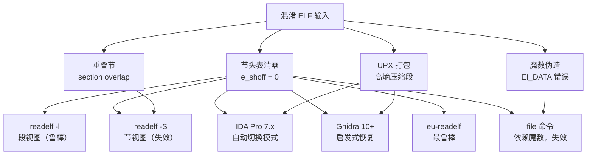

# ELF混淆与防护手段

> [!abstract] TL;DR
> ELF 混淆是攻击者通过破坏或伪造 ELF 元数据、注入虚假信息、故意制造结构歧义，来干扰反汇编器、反编译器和调试器的一类对抗技术。常见手段包括：将节头表偏移 `e_shoff` 置零以使 section-view 工具失效、污染 `.shstrtab` 节名字符串、注入虚假符号、通过 segment 与 section 视图故意错位制造 overlapping sections、使用 UPX/shikata\_ga\_nai 等 packer/encoder 隐藏真实代码。本篇从攻防双方视角，系统解析每种技术的二进制机制与工具影响，以及分析人员的识别与还原思路。

---

## 一、概述与定位

### 1.1 为什么需要 ELF 混淆

ELF 格式的设计初衷是可移植、易于加载，结构清晰且有大量工具支持。正因如此，ELF 二进制文件对反向工程师极为友好——`readelf`、`objdump`、IDA Pro、Ghidra、Binary Ninja 等工具开箱即用，可在数秒内完成大部分结构解析。

恶意软件作者、软件保护方案设计者，乃至 CTF 题目出题人，都会利用 ELF 格式规范的灵活余地（以及各工具对格式容错边界的差异），刻意破坏或伪造结构信息，制造分析障碍。

### 1.2 ELF 的两视图：混淆的根本前提

ELF 格式存在两个独立的视图：

| 视图 | 核心结构 | 使用者 | 决定字段 |
|---|---|---|---|
| **链接视图**（Linking View） | 节头表（Section Header Table）+ 节 | 静态分析工具、链接器 | `e_shoff`、`e_shnum`、`e_shstrndx` |
| **执行视图**（Execution View） | 程序头表（Program Header Table）+ 段 | 内核加载器、动态链接器 | `e_phoff`、`e_phnum` |

操作系统内核在加载 ELF 时**只读程序头表**，完全不依赖节头表。节头表是给链接器和调试工具用的——这意味着**节头表可以随意伪造甚至删除，不影响程序运行**，却能让大量以节头表为主要解析入口的分析工具失效。

### 1.3 混淆技术分类

```
ELF 混淆手段
├── 结构级破坏
│   ├── 节头表清零/乱改（e_shoff 置零、e_shnum 归零）
│   ├── 魔数/字节序/ABI 字段伪造
│   └── e_phoff / e_entry 偏移错误
├── 元数据污染
│   ├── .shstrtab 节名替换乱码
│   ├── 符号表注入虚假符号
│   └── 动态符号表（.dynsym）污染
├── 视图错位
│   ├── Segment 与 Section 重叠（overlapping sections）
│   └── 故意制造节-段不一致
└── 代码打包/加密
    ├── UPX（ELF packer）
    ├── shikata_ga_nai（多态 shellcode 编码器）
    └── 自定义加密 loader + 解密 stub
```

---

## 二、原理与机制

### 2.1 节头表破坏：`e_shoff` 置零与 `e_shnum` 归零

ELF 文件头中有三个字段控制节头表：

```c
Elf64_Ehdr {
    Elf64_Off  e_shoff;     /* 节头表在文件中的偏移（字节） */
    Elf64_Half e_shnum;     /* 节头表条目数量 */
    Elf64_Half e_shstrndx;  /* 节名字符串表（.shstrtab）所在的节索引 */
};
```

将 `e_shoff = 0`（或设为文件末尾之外的值）、`e_shnum = 0`，工具行为立即发生变化：

| 工具 | `e_shoff = 0` 时的行为 |
|---|---|
| `readelf -S` | "There are no sections in this file." |
| `objdump -d` | 尝试用程序头表推断代码范围，但反汇编范围不准 |
| IDA Pro | 切换到 segment-only 模式，丢失 section 名，函数边界依赖启发式 |
| Ghidra | 同样回退，但有自动恢复尝试，成功率不稳定 |
| `strip` | 依赖节头表定位符号表，`e_shoff=0` 下无法正常 strip |
| `nm` | 输出 "no symbols"（nm 依赖 .symtab） |

**关键点**：`e_phoff` 和程序头表完全不受影响，程序照常运行。攻击者用一行 Python 即可实施：

```python
import struct

with open('target', 'r+b') as f:
    # ELF64: e_shoff 在偏移 40，e_shnum 在偏移 60，e_shstrndx 在偏移 62
    f.seek(40)
    f.write(struct.pack('<Q', 0))   # e_shoff = 0
    f.seek(60)
    f.write(struct.pack('<HH', 0, 0))  # e_shnum = 0, e_shstrndx = 0
```

### 2.2 魔数与 ELF 文件头字段伪造

ELF 文件头的 `e_ident` 数组（前 16 字节）包含多个可以篡改的字段：

```
e_ident[0..3]  = 0x7f 'E' 'L' 'F'   ← 魔数（篡改后文件仍可运行，但工具拒绝解析）
e_ident[4]     = EI_CLASS    (1=32bit, 2=64bit)
e_ident[5]     = EI_DATA     (1=LE, 2=BE)     ← 伪造字节序误导反汇编器
e_ident[6]     = EI_VERSION  (应为 1)
e_ident[7]     = EI_OSABI    (0=System V, 3=Linux, 9=FreeBSD, ...)  ← 伪造 ABI
e_ident[8]     = EI_ABIVERSION
e_ident[9..15] = EI_PAD      (填充，应为 0，可以藏数据)
```

**伪造字节序字段**（`EI_DATA`）是经典手法：将其设为 `ELFDATA2MSB`（大端），会让 `readelf` 以大端方式解读后续所有字段，导致程序头表偏移、段地址等被错误解释，反汇编直接错位。内核在实际加载时忽略这个字段（现代 x86 Linux 内核直接跳过字节序校验），程序正常运行。

**魔数篡改**则更激进：将 `e_ident[0]` 从 `0x7f` 改为其他值，`readelf`、`file` 等工具不再识别为 ELF。但若分析人员直接用十六进制编辑器查看，真实的 `PT_LOAD` 段仍在原位，内核的实际加载路径（`fs/binfmt_elf.c`）在生产系统上可能有额外补丁或通过其他机制规避这一检查。

### 2.3 `.shstrtab` 污染：节名替换乱码

节名字符串表 `.shstrtab` 是一个普通的 null-terminated 字符串堆，被节头表中的 `sh_name` 字段（相对于 `.shstrtab` 的偏移）引用。

混淆方法：
1. **将所有节名替换为乱码或相同字符串**（如全部改成 `.text`），导致 IDA/Ghidra 无法按节名分类代码/数据，启发式分析困难
2. **将 `.text` 节名替换为 `.data`**，使工具将代码节标记为数据，跳过反汇编
3. **在节名字符串中嵌入特殊字节**（如 `0x00` 提前截断，让节名显示异常缩短）
4. **将 `.shstrtab` 的内容完全填零**，所有节名变为空字符串

```
正常 .shstrtab:
Offset: 00 01 02 03 04 05 06 07 08 09 0A 0B 0C ...
Data:   \0 .t  e  x  t \0 .d  a  t  a \0 .b  s  s \0 ...

污染后 .shstrtab:
Offset: 00 01 02 03 04 05 06 07 08 09 0A 0B 0C ...
Data:   \0 .a  a  a \0 .a  a  a \0 .a  a  a \0 ...
         ↑ 所有节名都变成 ".aaa"，工具无法区分
```

**分析视角**：`.shstrtab` 污染不影响节数据本身（`sh_offset`、`sh_size` 不变），只是让节名不可读。分析人员可以直接用 `sh_offset + sh_size` 定位每个节的数据，结合节类型（`sh_type`）而非节名来识别内容。

### 2.4 符号表注入虚假符号

`.symtab` 和 `.dynsym` 中的符号是分析人员命名函数的主要来源。注入大量虚假符号会制造噪音，或通过错误命名误导分析。

```c
typedef struct {
    Elf64_Word  st_name;    /* 符号名（.strtab 中的偏移） */
    unsigned char st_info;  /* 类型（STT_FUNC/STT_OBJECT）+ 绑定（STB_GLOBAL/LOCAL） */
    unsigned char st_other; /* 可见性 */
    Elf64_Section st_shndx; /* 所在节索引（SHN_UNDEF / SHN_ABS / 实际节索引）*/
    Elf64_Addr  st_value;   /* 符号值（函数则为地址） */
    Elf64_Xword st_size;    /* 符号大小 */
} Elf64_Sym;
```

攻击者注入虚假 `STT_FUNC` 符号，指向随机地址或数据区域，使反编译器在错误位置生成函数，并掩盖真实函数的边界。

另一种手法：**将真实函数的符号 `st_value` 偏移几个字节**（如 `+2`），使 IDA 从中间开始反汇编，产生非法指令；而真实函数的前两个字节是一条完整前缀指令，可以跳过这个错误入口。

### 2.5 Segment 与 Section 视图故意错位（Overlapping Sections）

ELF 规范并未要求 section 和 segment 完全对齐——section 只是对 segment 数据的注释，没有强制约束。混淆者利用这一点：

**方法一：单个节横跨多个段**

让一个节（如 `.text`）的 `sh_offset + sh_size` 范围横跨两个不同 `PT_LOAD` 段的内容。对基于节来分析的工具（如旧版 objdump），反汇编范围出错；基于段来加载的 CPU 执行正常。

**方法二：节与段故意错位**

```
文件内容（简化）：
偏移 0x1000: [真实代码区 A]
偏移 0x2000: [数据区 B]
偏移 0x3000: [真实代码区 C]

段（Program Header）定义：
PT_LOAD 1: 文件偏移 0x1000，VMA 0x401000，大小 0x2000  ← 包含 A + B
PT_LOAD 2: 文件偏移 0x3000，VMA 0x404000，大小 0x1000  ← C

节（Section Header）定义：
.text  sh_offset=0x2000, sh_size=0x2000  ← 故意指向 B 和 C，不对应 PT_LOAD 1
.data  sh_offset=0x1000, sh_size=0x1000  ← 故意把代码区标注为 data
```

这样，`objdump --disassemble` 只反汇编 `.text` 区域（即 B+C），漏掉真实代码 A。IDA 按段加载后会正确识别，但如果用户强制信任节信息，也会受干扰。

**方法三：Overlapping Sections**

让两个节的文件范围重叠。这违反了大多数链接器的输出规范，但 ELF 格式本身没有禁止。工具（如旧版 readelf）在这种情况下行为不确定，可能重复解析同一区域或完全跳过一段数据。

---

## 三、结构算法伪代码详解

### 3.1 节头表清零检测与还原算法

```
算法：SHT_Nullification_Detector
输入：ELF 文件 F
输出：是否存在 SHT 清零混淆，以及 PT_LOAD 段描述

1. 读取 ELF 文件头 Ehdr
2. 若 Ehdr.e_shoff == 0 或 Ehdr.e_shnum == 0：
   输出"节头表已被清零/置空"
   执行步骤 3（从程序头恢复）
3. 读取程序头表（Phdr[0..e_phnum-1]）
4. 对每个 Phdr[i]：
   若 Phdr[i].p_type == PT_LOAD：
       记录 (p_vaddr, p_memsz, p_flags, p_offset, p_filesz)
5. 输出：已从段视图恢复，请基于段分析而非节分析

算法：Section_Recovery_Heuristic
输入：ELF 文件 F，已知 SHT 不可信
输出：启发式节列表

1. 读取所有 PT_LOAD 段，按 p_vaddr 排序
2. 对每个 PT_LOAD 段的文件内容，扫描已知签名：
   - ELF 注释签名（如 GCC 版本字符串）→ 可能是 .comment
   - 全零大块 → 可能是 .bss 对应的文件部分
   - 字符串密集区域 → 可能是 .rodata 或 .strtab
   - 跳转表特征（连续的间接跳转数组） → 可能是 .got.plt
3. 对可执行 PT_LOAD 段，执行线性扫描反汇编，标记函数入口
4. 输出：启发式节识别结果（置信度低，需人工验证）
```

### 3.2 UPX 打包 ELF 的结构特征检测

```
算法：UPX_ELF_Detector
输入：可疑 ELF 文件 F

1. 读取文件头前 512 字节
2. 检查字符串签名：
   - 搜索 "UPX!" 魔数（偏移不固定，在 p_note 区域）
   - 搜索 "$Info: This file is packed with the UPX"
   - 检查 "UPX!" 出现在 e_ident[8..15] 填充区域
3. 检查程序头表：
   - UPX 打包后通常只有 2-3 个 PT_LOAD 段（原始段更多）
   - 第一个 PT_LOAD 段权限为 "RWE"（可读写执行）——正常 ELF 中可疑
   - e_entry 指向解压 stub 的起始（通常在文件末尾的段）
4. 检查熵值：
   - 打包段的数据熵接近 8.0（最大熵），说明已压缩/加密
   - 正常代码熵通常在 5.5-7.0 之间
5. 若步骤 2-4 匹配，判定为 UPX 打包
   执行：upx -d -o unpacked_F F  （尝试自动解包）
```

### 3.3 overlapping sections 检测算法

```
算法：Overlapping_Section_Detector
输入：ELF 文件 F

1. 读取节头表，构建区间集合 S = {}
2. 对每个节 i（跳过 SHT_NULL 和 SHT_NOBITS）：
   interval_i = [sh_offset_i, sh_offset_i + sh_size_i)
   对 S 中已有的每个区间 interval_j：
       若 interval_i ∩ interval_j ≠ ∅：
           报告"节 i 与节 j 在文件内容上重叠"
           记录重叠范围和疑似混淆
   S.add(interval_i)

3. 对每个节 i，检查其文件范围是否在某个 PT_LOAD 的文件范围之外：
   若 sh_offset_i < PT_LOAD.p_offset 或
      sh_offset_i + sh_size_i > PT_LOAD.p_offset + PT_LOAD.p_filesz：
       报告"节 i 超出任何 PT_LOAD 范围，可能是幽灵节"

4. 交叉验证：对每个节 i，检查其 sh_addr 是否落在某个 PT_LOAD 的 VMA 范围内：
   expected_file_offset = sh_addr - PT_LOAD.p_vaddr + PT_LOAD.p_offset
   若 |expected_file_offset - sh_offset_i| > 阈值（如 4096）：
       报告"节 i 的 sh_addr 与文件偏移不一致，可能是人为错位"
```

---

## 四、工具视角与实战

### 4.1 识别节头表被清零

```bash
# 检查 e_shoff 和 e_shnum
$ readelf -h suspicious_binary | grep -E 'section|offset'
  Start of section headers:          0 (bytes into file)   # ← e_shoff = 0
  Number of section headers:         0                     # ← e_shnum = 0
  Section header string table index: 0

# 尝试段视图（此时仍有效）
$ readelf -l suspicious_binary
Elf file type is EXEC (Executable file)
Entry point 0x401060
There are 4 program headers, starting at offset 64

Program Headers:
  Type   Offset   VirtAddr    PhysAddr    FileSiz  MemSiz   Flg  Align
  LOAD   0x000000 0x400000    0x400000    0x0e5678 0x0e5678 R E  0x200000
  LOAD   0x0f0000 0x6f0000    0x6f0000    0x001234 0x002000 RW   0x200000
  ...
# 即使节头表为零，段信息仍然完整，可用于后续分析
```

### 4.2 还原节头表（手工重建）

```python
#!/usr/bin/env python3
"""minimal_sht_rebuild.py：为节头表被清零的 ELF 补充最小节头表"""
import struct, sys

with open(sys.argv[1], 'rb') as f:
    data = bytearray(f.read())

# 读取程序头表信息
e_phoff, = struct.unpack_from('<Q', data, 32)
e_phentsize, e_phnum = struct.unpack_from('<HH', data, 54)

# 找可执行 PT_LOAD 段作为 .text 的候选
sections = []
for i in range(e_phnum):
    ph = e_phoff + i * e_phentsize
    p_type, p_flags = struct.unpack_from('<II', data, ph)
    p_offset, p_vaddr = struct.unpack_from('<QQ', data, ph + 8)
    p_filesz, p_memsz = struct.unpack_from('<QQ', data, ph + 32)

    if p_type == 1:  # PT_LOAD
        if p_flags & 1:  # 可执行
            sections.append(('reconstructed_code', p_offset, p_filesz, p_vaddr, 1, p_flags))
        else:
            sections.append(('reconstructed_data', p_offset, p_filesz, p_vaddr, 1, p_flags))

print(f"从 {len(sections)} 个 PT_LOAD 段重建节头表")
for name, off, sz, vaddr, _, flags in sections:
    flag_str = ('R' if flags & 4 else '') + ('W' if flags & 2 else '') + ('E' if flags & 1 else '')
    print(f"  {name}: offset={off:#x}, size={sz:#x}, vaddr={vaddr:#x}, flags={flag_str}")
```

### 4.3 检测并还原 UPX 打包

```bash
# 方法 1：upx 自带检测
$ upx -t suspicious_binary
testing suspicious_binary [OK]
  # "OK" 表示是有效 UPX 包，可以解包

# 方法 2：upx 解包
$ upx -d suspicious_binary -o unpacked_binary
                       Ultimate Packer for eXecutables
                          Copyright (C) 1996 - 2024
UPX 4.2.1       Markus Oberhumer, Laszlo Molnar & John Reiser   Jan 3rd 2024

        File size         Ratio      Format      Name
   --------------------   ------   -----------   -----------
    245760 <-     98304   40.00%   linux/amd64   unpacked_binary
Unpacked 1 file.

# 方法 3：若 upx 被修改了版本头（常见反 upx 手段）
# 重建 UPX "UPX!" magic
$ python3 -c "
import sys
data = bytearray(open('suspicious_binary', 'rb').read())
# 搜索典型的 UPX 解压 stub 特征：push PHDRSZ; call decompress
idx = data.find(b'\\x60\\xe8')  # pusha; call
print(f'UPX stub 候选偏移: {idx:#x}')
"
# 然后可以手工 patch 回 UPX! magic 再 upx -d
```

### 4.4 shikata_ga_nai 多态编码器特征与还原

shikata_ga_nai 是 Metasploit Framework 中的多态 XOR 编码器，也被移植到 Linux ELF 场景：

```
shikata 特征：
- 开头几字节是 fnstenv 或 fpu 指令（获取 EIP）
- 紧随 XOR 解码循环
- 解码后的明文代码会覆盖编码区域（自修改代码）
- 每次编码密钥随机变化（多态），但指令骨架固定

典型汇编骨架（x86）：
  d9 eb       fldpi              ; 获取 x87 FPU 状态
  ...
  d9 74 24 f4 fstenv [esp-12]   ; 将 FPU 环境（含 EIP）推入栈
  5b          pop ebx            ; ebx = 当前 EIP
  ...
  31 13       xor [ebx], edx    ; XOR 解码循环
  83 c3 04    add ebx, 4
  83 e9 04    sub ecx, 4
  ...
  jnz ...
```

```bash
# 静态特征检测
$ strings suspicious_binary | grep -i 'UPX\|shikata\|msfvenom'

# 熵值分析（高熵 = 可能打包/加密）
$ python3 -c "
import math, sys
data = open(sys.argv[1], 'rb').read()
# 计算前 4096 字节的熵
chunk = data[:4096]
freq = [0] * 256
for b in chunk: freq[b] += 1
entropy = -sum((f/len(chunk)) * math.log2(f/len(chunk)) for f in freq if f > 0)
print(f'前 4096 字节熵值: {entropy:.3f} bits/byte')
print('高熵（>7.0）= 可能打包/加密/混淆')
" suspicious_binary

# 动态还原（在沙盒中运行并转储解密后内存）
$ strace -e trace=mmap,mprotect ./suspicious_binary 2>&1 | head -30
# 关注 PROT_EXEC 的 mprotect 调用，转储对应内存区域
```

### 4.5 `.shstrtab` 污染的绕过

```bash
# 节名显示乱码时，改用节类型（sh_type）分析
$ readelf -S --wide suspicious_binary
  [ 1] .????  SHT_PROGBITS  00401000  001000  004321  00  AX 0  0  16
  # sh_type=PROGBITS + AX 标志 → 代码节（即使名字乱码）

# 用 eu-readelf 显示原始节类型
$ eu-readelf -S suspicious_binary

# 用 pyelftools 忽略节名，按类型遍历
$ python3 -c "
from elftools.elf.elffile import ELFFile
with open('suspicious_binary', 'rb') as f:
    elf = ELFFile(f)
    for s in elf.iter_sections():
        print(f'Type={s[\"sh_type\"]}, Addr={s[\"sh_addr\"]:#x}, Size={s[\"sh_size\"]:#x}')
"
```

### 4.6 虚假符号过滤

```bash
# 显示所有符号（含虚假）
$ nm -n suspicious_binary | head -50

# 过滤策略：只保留有合理地址的 FUNC 类型符号
$ nm -n suspicious_binary | awk '
  /T/ || /t/ {  # 代码段符号
    addr = strtonum("0x" $1)
    # 过滤 0 地址和极大地址（>= 0x7fff00000000 通常是 vDSO/栈）
    if (addr > 0x400000 && addr < 0x7fff00000000) print $0
  }
'

# 用 IDA/Ghidra 时：开启"显示所有函数"功能，
# 对每个符号检查其指向的字节是否是合法函数序言
# 典型 x86-64 函数序言：55 48 89 e5 (push rbp; mov rbp,rsp)
```

---

## 安全性与正确使用

### 5.1 防御者视角：为何要了解这些技术

对安全分析人员而言，了解 ELF 混淆技术是**防御工作的基础**，而非进攻技能。恶意软件作者在工程化的攻击框架中大量使用这些手段，不了解就无法有效分析：

- **终端检测与响应（EDR）**系统需要能识别打包/混淆的 ELF，才能在执行前标记可疑行为
- **YARA 规则编写**依赖对打包器特征的精确理解（如 UPX magic、高熵段特征）
- **CTF/取证**场景中，破坏的 ELF 是常见题型，分析人员需要手工还原

### 5.2 合法使用场景

| 使用场景 | 技术 | 合法理由 |
|---|---|---|
| 软件版权保护 | 去除符号、节头表、加壳 | 防止直接反编译商业软件 |
| DRM/版权管理 | 代码加密 + 运行时解密 | 防止代码提取 |
| CTF 出题 | 故意制造损坏 ELF | 教学目的，培养分析能力 |
| 安全研究 | 验证工具鲁棒性 | 测试 ELF 解析器的边界情况 |

> [!caution] 合规声明
> 将这些技术用于恶意软件开发、绕过安全软件、传播恶意代码，在绝大多数国家地区属于违法行为。本篇内容仅供安全研究、防御分析、CTF 学习和工具鲁棒性测试使用。

### 5.3 防护 ELF 的正确分析方法

面对混淆 ELF 时，分析人员应遵循以下原则：

```
分析原则：
1. 永远基于 PT_LOAD 段（执行视图）而非节头表（链接视图）进行初步分析
2. 验证节的文件范围必须落在至少一个 PT_LOAD 段的文件范围内
3. 高熵段（>7.0 bits/byte）优先怀疑打包/加密，动态分析比静态分析更可靠
4. 符号表中的函数符号需要与实际反汇编结果交叉验证才可信
5. 沙盒执行 + 内存转储往往比纯静态逆向更高效
```

### 5.4 工具对混淆的鲁棒性对比



---

## 小结

ELF 混淆的本质是利用格式规范的宽松性与工具实现的不一致性。核心洞察有三：

1. **两视图分离是根源**：节头表（链接视图）与程序头表（执行视图）相互独立，破坏前者不影响执行，却能瘫痪大量依赖节头表的分析工具。

2. **工具依赖链越短越鲁棒**：`eu-readelf -l`（直接解析程序头）比 `objdump -d`（依赖节信息确定代码范围）更能抵抗混淆。IDA/Ghidra 的自动化启发式功能虽然有帮助，但也是攻击面（伪造符号可以误导启发式函数识别）。

3. **动态分析是最终武器**：无论多么精妙的静态混淆，程序最终必须在 CPU 上运行。在沙盒中执行并在关键时机转储内存（`/proc/PID/maps` + `dd`），可以得到完全解混淆的内存镜像，再行静态分析。

---

## 七、相关阅读

- `[[01.ELF文件基础]]`：ELF 两视图（链接视图与执行视图）的基础原理
- `[[02.ELF文件头部]]`：`e_ident`、`e_shoff`、`e_phoff` 等关键字段的精确含义
- `[[03.程序头表]]`：PT\_LOAD 段解析，混淆时的分析入口
- `[[09.symtab节]]`：符号表格式，理解虚假符号注入的原理
- `[[10.shstrtab节]]`：节名字符串表的格式与作用
- `[[34.节头表]]`：节头表完整格式，理解被清零时的影响
- `[[59.ELF核心转储解析]]`：core 文件的解析（与混淆分析互补）
- `[[64.ELF损坏修复与手工重建]]`：从另一角度处理损坏 ELF 的手工修复

---

[[00.ELF文件详解总览|⬆ 系列总览]] | [[59.ELF核心转储解析|← 上一篇]] | [[61.ELF与eBPF目标文件格式|→ 下一篇]]
