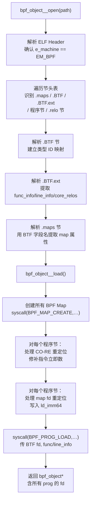

# 详解ELF文件(六十一).ELF与eBPF目标文件格式

> [!abstract] TL;DR
> eBPF 程序以标准 ELF 目标文件（`ET_REL`）的形式在磁盘上存储，由 `libbpf` 解析并加载到内核。其关键特殊性在于：节名即程序类型声明（如 `SEC("xdp")`）、BTF（BPF Type Format）提供内核感知的调试元信息、`.maps` 节描述 BPF Map 定义，以及一套独立的重定位机制将 map fd 写回指令流。理解这套 ELF 扩展是进行 eBPF 开发、调试与逆向的基础。

## 一、eBPF ELF 的整体格式

eBPF 程序编译后产生一个普通的 ELF 可重定位目标文件（`e_type = ET_REL`，与 `.c` 文件编译出的普通 `.o` 无异），不是可执行文件（`ET_EXEC`）也不是共享对象（`ET_DYN`）。其机器架构标识为 `EM_BPF`（值 `0xF7` = 247），这是区别于 x86-64 的关键标志：

```bash
# 示例输出（代表性，非本机实跑）
$ readelf -h xdp_prog.o
ELF Header:
  Magic:   7f 45 4c 46 02 01 01 00 ...
  Class:                             ELF64
  Data:                              2's complement, little endian
  Type:                              REL (Relocatable file)
  Machine:                           Linux BPF       # EM_BPF = 247
  Entry point address:               0x0
  ...
```

BPF 寄存器宽度为 64 位，ELF 类别恒为 `ELFCLASS64`。尽管 BPF ISA 本身是大小端无关的，但实际上 clang 生成的 BPF ELF 几乎总是小端（`ELFDATA2LSB`），因为宿主机多是 x86-64。

### 1.1 文件整体布局

```
┌─────────────────────────────┐
│       ELF Header (64B)      │ e_type=ET_REL, e_machine=EM_BPF
├─────────────────────────────┤
│   .text (可选通用代码)       │ 内联辅助函数等
├─────────────────────────────┤
│   xdp/prog_name             │ BPF 程序指令（节名即类型声明）
│   kprobe/sys_execve          │
│   tp/syscalls/sys_enter_...  │
├─────────────────────────────┤
│   .maps                     │ BPF Map 定义（结构体数组）
├─────────────────────────────┤
│   .BTF                      │ BPF Type Format 类型信息
│   .BTF.ext                  │ 行信息、函数信息、CO-RE 重定位
├─────────────────────────────┤
│   .bpf_iter_*               │ Iterator 程序（可选）
├─────────────────────────────┤
│   .relo<节名>               │ BPF 专用重定位（针对 map 引用）
├─────────────────────────────┤
│   .symtab / .strtab         │ 标准符号/字符串表
└─────────────────────────────┘
```

## 二、节命名约定：`SEC()` 宏与程序类型映射

### 2.1 `SEC()` 宏展开机制

用 clang + BPF 后端编译时，开发者用 `SEC("xdp")` 这样的宏将函数放入特定节。展开后本质是 `__attribute__((section("xdp")))` GCC 扩展，指示编译器将该函数的机器码放入名为 `xdp` 的 ELF 节。

```c
#include <linux/bpf.h>
#include <bpf/bpf_helpers.h>

SEC("xdp")
int xdp_drop(struct xdp_md *ctx) {
    return XDP_DROP;
}

SEC("kprobe/sys_execve")
int trace_execve(struct pt_regs *ctx) {
    bpf_printk("execve called\n");
    return 0;
}
```

编译后两个函数分别在 `xdp` 和 `kprobe/sys_execve` 节中，`libbpf` 通过解析节名确定程序类型。

### 2.2 `libbpf` 节名前缀到 `BPF_PROG_TYPE_*` 的映射表

`libbpf` 在 `libbpf.c` 中维护一张前缀匹配表（`section_defs`），部分内容如下：

| SEC() 前缀 | BPF_PROG_TYPE | bpf_attach_type | 说明 |
|-----------|---------------|-----------------|------|
| `xdp` | `BPF_PROG_TYPE_XDP` | `BPF_XDP` | XDP 网络处理 |
| `kprobe/` | `BPF_PROG_TYPE_KPROBE` | — | kprobe 追踪 |
| `kretprobe/` | `BPF_PROG_TYPE_KPROBE` | — | kretprobe 返回追踪 |
| `tracepoint/` / `tp/` | `BPF_PROG_TYPE_TRACEPOINT` | — | 静态追踪点 |
| `raw_tp/` | `BPF_PROG_TYPE_RAW_TRACEPOINT` | — | 原始追踪点 |
| `fentry/` | `BPF_PROG_TYPE_TRACING` | `BPF_TRACE_FENTRY` | 函数入口追踪 |
| `fexit/` | `BPF_PROG_TYPE_TRACING` | `BPF_TRACE_FEXIT` | 函数返回追踪 |
| `tc` | `BPF_PROG_TYPE_SCHED_CLS` | `BPF_TC_INGRESS` | TC 分类器 |
| `socket` | `BPF_PROG_TYPE_SOCKET_FILTER` | — | 套接字过滤 |
| `sk_msg` | `BPF_PROG_TYPE_SK_MSG` | `BPF_SK_MSG_VERDICT` | 消息过滤 |
| `cgroup_skb/` | `BPF_PROG_TYPE_CGROUP_SKB` | — | cgroup SKB 过滤 |
| `lsm/` | `BPF_PROG_TYPE_LSM` | `BPF_LSM_MAC` | LSM 钩子（5.7+）|
| `iter/` | `BPF_PROG_TYPE_TRACING` | `BPF_TRACE_ITER` | BPF Iterator |

前缀匹配优先级：精确匹配 > 前缀最长匹配，`libbpf` 按此顺序遍历表格确定加载参数。

### 2.3 节名中的程序名与实例区分

从 `libbpf` 1.0 起，支持节名 `SEC("xdp.multi_prog")` 形式，通过 `.` 分隔附加程序实例标识；`bpftool gen skeleton` 生成的骨架代码用节名派生 C 结构体成员名。

## 三、BTF：BPF Type Format

### 3.1 BTF 的动机与作用

BTF 是专为 BPF 设计的轻量类型系统，编码 C 语言的类型信息（结构体、联合体、基础类型、指针、枚举等），核心用途：

1. **验证器辅助**：内核 BPF 验证器可利用 BTF 推断指针类型，实现类型感知的内存访问检查。
2. **CO-RE（Compile Once, Run Everywhere）**：`libbpf` 借助 BTF 在加载时做结构体字段偏移重定位，无需为不同内核版本单独编译。
3. **bpftool 输出可读性**：`bpftool map dump` 可以输出键值对的结构体字段名称而非裸字节。
4. **perf/BCC 调试**：`perf script`、BCC 工具用 BTF 格式化追踪点参数。

### 3.2 `.BTF` 节的二进制布局

`.BTF` 节以 `struct btf_header` 开头（24 字节）：

```c
struct btf_header {
    __u16   magic;      /* 0xeB9F：BTF 魔数 */
    __u8    version;    /* 当前为 1 */
    __u8    flags;      /* 保留 */
    __u32   hdr_len;    /* 头部长度（通常 24） */
    /* 类型段：相对于 hdr_len 末尾的偏移与大小 */
    __u32   type_off;
    __u32   type_len;
    /* 字符串段 */
    __u32   str_off;
    __u32   str_len;
};
```

头部之后是**类型段**与**字符串段**：

- **类型段**：连续的 `btf_type` 记录，每条描述一个类型（结构体、基础类型、指针等），`btf_type.name_off` 指向字符串段中的名称。
- **字符串段**：NUL 分隔的字符串池，与 `.strtab` 格式相同，但独立存储。

`btf_type` 的 `info` 字段编码类型种类（`BTF_KIND_INT`、`BTF_KIND_STRUCT`、`BTF_KIND_PTR` 等）及成员数量：

```
info[31:24] = kind_flag（是否有位域大小信息）
info[23:16] = 保留
info[15:11] = 类型种类（BTF_KIND_*）
info[10:0]  = vlen（可变长度，如结构体成员数量）
```

### 3.3 `.BTF.ext` 节

`.BTF.ext` 扩展 BTF，主要包含三类信息：

| 子段 | 作用 |
|------|------|
| `func_info` | 函数入口处的 BTF 类型 ID，使验证器了解函数签名 |
| `line_info` | 指令偏移到源文件行列号的映射，支持 `bpftool prog dump` 显示源码 |
| `core_relos` | CO-RE 重定位记录，描述哪条指令的哪个字段需要按目标内核 BTF 重写 |

`.BTF.ext` 头部布局（`btf_ext_header`）：

```c
struct btf_ext_header {
    __u16   magic;
    __u8    version;
    __u8    flags;
    __u32   hdr_len;
    __u32   func_info_off;   __u32 func_info_len;
    __u32   line_info_off;   __u32 line_info_len;
    /* v1.1+ */
    __u32   core_relo_off;   __u32 core_relo_len;
};
```

### 3.4 CO-RE 机制详解

CO-RE（Compile Once, Run Everywhere）是 `libbpf` + BTF 的核心价值主张，解决了 BPF 程序需要与特定内核版本绑定编译的痛点。

**工作原理：**

```
编译阶段（clang）：
  源码中写 BPF_CORE_READ(task, mm->start_stack)
      ↓
  clang 生成带占位偏移的指令，并在 .BTF.ext 的 core_relos 段写入
  一条重定位记录：（指令偏移, 字段访问路径, 期望类型ID）

加载阶段（libbpf）：
  1. 从内核读取运行内核的 BTF（/sys/kernel/btf/vmlinux）
  2. 将编译时 BTF 中的字段路径解析为运行内核 BTF 中的字段偏移
  3. 用真实偏移修补目标指令的立即数字段
  4. 验证器验证修补后的程序
```

```c
// CO-RE 写法：portable，跨内核版本
struct task_struct *task = (void *)bpf_get_current_task();
__u64 stack = BPF_CORE_READ(task, mm, start_stack);
// 展开后等效于多次 bpf_probe_read_kernel，但偏移在加载时由 libbpf 修补
```

## 四、`.maps` 节与 Map 定义

### 4.1 传统 `.maps` 格式（legacy）

早期 `libbpf`（0.2 前）要求 map 定义放在 `maps` 节（无前导点）：

```c
struct bpf_map_def SEC("maps") my_map = {
    .type        = BPF_MAP_TYPE_HASH,
    .key_size    = sizeof(__u32),
    .value_size  = sizeof(__u64),
    .max_entries = 1024,
};
```

`bpf_map_def` 是一个固定大小的结构体，`libbpf` 直接读取其字段。

### 4.2 新式 `.maps` 格式（BTF-defined maps）

从 `libbpf` 0.4 起，推荐使用 BTF-defined map 语法，放入 `.maps` 节：

```c
struct {
    __uint(type, BPF_MAP_TYPE_HASH);
    __uint(max_entries, 1024);
    __type(key, __u32);
    __type(value, struct event);
} my_hash_map SEC(".maps");
```

这里 `__uint` / `__type` 是宏，展开为类型为特定指针类型的结构体成员（`int (*type)[BPF_MAP_TYPE_HASH]` 等），其含义由 BTF 类型信息中的结构体字段名推断。`libbpf` 从 BTF 中读取 `.maps` 节中各结构体的字段名，解析 `type`、`max_entries`、`key`、`value` 等属性。

**BTF-defined maps 相对于 legacy 格式的优势：**
- 支持 `inner_map`（嵌套 map）、`pinning`、`map_extra` 等新属性
- `bpftool` 可以通过 BTF 显示 map 的键值类型名称
- 类型安全：key/value 类型为 C 类型而非裸大小

### 4.3 `.maps` 节在 ELF 中的组织

```bash
# 示例输出（代表性，非本机实跑）
$ readelf -S prog.o | grep maps
  [12] .maps             PROGBITS        0000000000000000  000002f0
       0000000000000060  0000000000000000  WA       0     0     8
```

`.maps` 节中每个 map 变量对应一段连续的字节区域（大小为结构体大小），`readelf -S` 中 `W`（SHF_WRITE）+`A`（SHF_ALLOC）。`libbpf` 通过 symtab 中指向 `.maps` 节的符号定位每个 map 定义的偏移和大小。

## 五、BPF ELF 重定位机制

### 5.1 BPF 重定位的特殊性

标准 ELF 重定位将符号地址填入某处（详见 [[12.rela.data节]]）。BPF ELF 的重定位比较特殊：

1. **map 引用重定位**：BPF 指令 `ld_imm64 r1, &my_map` 需要在加载后将 map 的文件描述符（fd）写入指令立即数，但 fd 是运行时才有的整数，不是内存地址——这是 BPF ELF 重定位与普通 ELF 重定位的本质差异。
2. **CO-RE 重定位**：由 `.BTF.ext` 的 `core_relos` 段描述，重写结构体字段偏移相关的立即数。

### 5.2 BPF ELF 重定位条目

```bash
# 示例输出（代表性，非本机实跑）
$ readelf -r prog.o
Relocation section '.relo.xdp' at offset 0x...:
    Offset             Info             Type           Sym. Value    Sym. Name
000000000000 0010 000000050000 R_BPF_64_64           0000000000000000 my_hash_map
```

BPF 重定位类型主要有：

| 类型 | 值 | 含义 |
|------|----|------|
| `R_BPF_NONE` | 0 | 无重定位 |
| `R_BPF_64_64` | 1 | 64位立即数（`ld_imm64` 双指令对）写入符号值或 map fd |
| `R_BPF_64_ABS64` | 2 | 64位绝对地址 |
| `R_BPF_64_ABS32` | 3 | 32位绝对地址 |
| `R_BPF_64_NODYLD32` | 4 | 32位，不通过动态链接 |

`libbpf` 处理 `R_BPF_64_64` 的过程：
1. 从 reloc entry 取符号索引，在 symtab 中查到符号。
2. 符号指向 `.maps` 节中的某个 map 定义。
3. `libbpf` 已经创建了该 map（`bpf_create_map`），得到 fd 值。
4. 将 fd 写入目标 `ld_imm64` 双字指令的低 32 位 imm（高字指令的 `src_reg` 同步置位）。

### 5.3 `.relo<prog_sec>` 节命名约定

BPF ELF 中重定位节的名字遵循 `.relo` + 程序节名：

```
.relo.xdp              ← 对应 xdp 程序节
.relokprobe/sys_execve ← 对应 kprobe/sys_execve 程序节
```

（注意：有些工具生成的是 `.relo`，有些是 `.rel`，`libbpf` 两者均支持。）

## 六、`libbpf` 解析与加载流程



关键 API 路径：

```c
/* 打开 ELF 文件，不立即加载 */
struct bpf_object *obj = bpf_object__open("prog.o");

/* 可在加载前调整 map 大小、设置 global data 等 */
struct bpf_map *map = bpf_object__find_map_by_name(obj, "my_hash_map");
bpf_map__set_max_entries(map, 4096);

/* 加载：创建 map、做重定位、加载程序 */
bpf_object__load(obj);

/* 获取程序 fd，用于附加 */
struct bpf_program *prog = bpf_object__find_program_by_name(obj, "xdp_drop");
int prog_fd = bpf_program__fd(prog);
```

## 七、工具链：bpftool、bpf2go 与实战操作

### 7.1 bpftool 操作 BPF ELF

```bash
# 查看 ELF 中的程序节信息（不加载到内核）
bpftool gen object output.o input.o    # 合并多个 BPF ELF

# 加载并附加（内核 5.15+）
bpftool prog load prog.o /sys/fs/bpf/xdp_prog
bpftool prog attach pinned /sys/fs/bpf/xdp_prog xdp dev eth0

# 查看已加载程序的 BTF 信息
bpftool prog show
bpftool btf dump file prog.o

# 查看 map 定义（带 BTF 字段名）
bpftool map dump name my_hash_map

# 生成骨架代码（将 ELF 嵌入 .h 文件）
bpftool gen skeleton prog.o > prog.skel.h

# 反编译 BPF 指令
bpftool prog dump xlated name xdp_drop
```

### 7.2 bpf2go 工具（Go 语言生态）

`bpf2go` 是 Cilium 项目的工具，将 BPF ELF 嵌入 Go 代码：

```bash
# 从 .c 文件生成 Go 绑定
go generate  # 触发 //go:generate bpf2go -cc clang -cflags "..." BpfProg xdp_prog.c
```

生成的 Go 代码中包含：
- 编译后的 BPF ELF 字节数组（嵌入 `_bpf*.go` 文件）
- `loadBpfProgObjects()` 函数：封装 `libbpf-go` 的加载流程
- Map 和 Program 的强类型 Go 结构体访问器

### 7.3 vmlinux.h 与 BTF Hub

CO-RE 开发依赖对内核数据结构的类型感知，实践上有两种方式：

1. **本机生成**：`bpftool btf dump file /sys/kernel/btf/vmlinux format c > vmlinux.h`，生成当前内核所有类型的 C 头文件（不含宏，仅类型定义，约 300KB+）。
2. **BTF Hub**（[btfhub.io](https://github.com/aquasecurity/btfhub)）：预构建的多发行版/多版本 BTF 文件集合，用于在不支持内核 BTF 的旧内核上实现 CO-RE。

### 7.4 手工分析 BPF ELF

```bash
# 查看所有节（识别程序类型）
readelf -S prog.o

# 查看 BTF 原始字节
readelf -x .BTF prog.o
readelf -x .BTF.ext prog.o

# 查看重定位
readelf -r prog.o

# 查看符号表（map 变量名、程序函数名）
readelf -s prog.o
nm prog.o

# 反汇编 BPF 指令（需要 objdump 支持 EM_BPF）
objdump -d prog.o
llvm-objdump -d prog.o    # LLVM 版本更可靠

# 验证 BTF 完整性
bpftool btf dump file prog.o
```

## 八、安全性与正确使用

### 8.1 BPF 程序的内核安全边界

eBPF 程序在加载时经过内核验证器（BPF Verifier）的静态分析，但仍存在若干安全考量：

- **特权需求**：加载 BPF 程序通常需要 `CAP_BPF`（Linux 5.8+）或 `CAP_SYS_ADMIN`，普通用户（`unprivileged_bpf_disabled=1`）不得加载。
- **Spectre 缓解**：BPF 验证器会拒绝可能泄露内核内存的 Spectre 类推测执行路径，并在某些情况下插入 `LFENCE` 指令。
- **JIT 编译与 hardening**：内核 `bpf_jit_harden=2` 会对 JIT 代码进行常量盲化（constant blinding），防止 ROP gadget 注入。

### 8.2 BPF ELF 篡改与验证规避

从逆向/安全审计视角：

- **`.BTF` 节可被删除**：`bpftool` 生成的骨架代码内嵌完整 ELF，strip 删除 BTF 不影响程序运行，但 CO-RE 将失效，验证器日志将不含类型信息，给调试带来困难。
- **节名欺骗无效**：仅修改节名（如将 `xdp` 改为 `socket`）不能绕过验证器，因为实际程序类型由 `BPF_PROG_LOAD` syscall 参数决定，`libbpf` 根据节名选择参数——错误节名只影响工具行为，不影响内核验证。
- **指令替换攻击**：若攻击者能替换 BPF ELF 文件内容（指令字节），加载后的程序可执行任意内核操作（在验证器允许范围内）。应通过文件权限和 IMA（Integrity Measurement Architecture）签名保护 BPF 目标文件。

### 8.3 生产部署建议

1. 使用 `bpftool gen skeleton` 将 ELF 嵌入应用可执行文件，避免依赖外部文件路径。
2. 启用 `BPF_F_SLEEPABLE` 等限制标志，在 LSM 程序中避免可睡眠路径滥用。
3. 定期审查 `bpftool prog list` 中运行的 BPF 程序，识别非预期的加载者。
4. 在 CI 流程中运行 `bpftool prog load --log-level 1` 预验证 BPF ELF，确保在目标内核版本通过验证。

---

[[00.ELF文件详解总览|⬆ 系列总览]] | [[60.ELF混淆与防护手段|← 上一篇]] | [[62.ELF静态库与链接器交互|→ 下一篇]]
