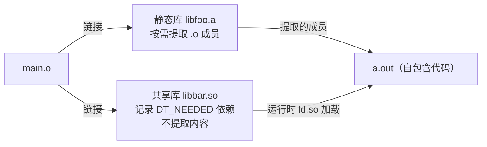

# 详解ELF文件(六十二).ELF静态库与链接器交互

> [!abstract] TL;DR
> 静态库（`.a` 文件）本质上是一组 ELF 可重定位目标文件（`.o`）的存档，由 `ar` 工具打包，并附带符号索引节（`/`）加速链接器查找。链接器采用**按需提取**（lazy extraction）算法：从左到右扫描命令行，仅提取能满足当前未定义符号的成员——这决定了库的顺序敏感性、`--whole-archive` 的必要性以及循环依赖时 `--start-group` 的作用。掌握这一机制是排查"undefined reference"链接错误的核心知识。

## 一、`ar` 格式的内部结构

### 1.1 归档文件头：`!<arch>` 魔数

所有 `.a` 文件以 8 字节的魔数 `!<arch>\n`（0x21 0x3C 0x61 0x72 0x63 0x68 0x3E 0x0A）开头，这是 POSIX `ar` 格式的标准标识。没有单独的"ELF 静态库"格式——`ar` 是通用存档格式，只是惯例上用来存储 ELF 目标文件。

### 1.2 成员头：`ar_hdr` 结构

紧随魔数之后，每个归档成员（member）前都有一个固定 60 字节的头部：

```c
struct ar_hdr {
    char ar_name[16];   /* 成员文件名（右填充空格）*/
    char ar_date[12];   /* 修改时间（十进制 UNIX 时间戳）*/
    char ar_uid[6];     /* 用户 ID */
    char ar_gid[6];     /* 组 ID */
    char ar_mode[8];    /* 文件权限（八进制 ASCII）*/
    char ar_size[10];   /* 成员大小（字节，十进制 ASCII）*/
    char ar_fmag[2];    /* 0x60 0x0A（"`\n"）：头部结束标志 */
};
```

所有字段均为 ASCII 文本，右填充空格。例如大小为 1234 字节的成员，`ar_size` 写 `"1234      "`（10个字符）。

### 1.3 特殊成员：符号索引 `/`

在 GNU `ar` 格式中，归档文件的第一个成员是**符号索引**，`ar_name` 字段为 `"/               "（名字是斜杠加空格填充）`：

```
!<arch>
/               <时间戳> <uid> <gid> <mode> <大小>`\n`
<符号计数（4字节大端）>
<offset_1><offset_2>...<offset_N>   （各成员的归档偏移，4字节大端）
symbol_name_1\0symbol_name_2\0...   （导出符号名的字符串表）
```

结构解读：
- **符号计数**（4 字节，big-endian）：该归档导出的符号总数。
- **偏移表**：N 个 4 字节偏移，第 i 个偏移指向第 i 个符号所在成员在归档中的字节偏移（相对于归档文件起始）。
- **字符串表**：NUL 分隔的符号名序列，顺序与偏移表一一对应。

链接器查找符号时，先在此索引中二分查找（或线性扫描）符号名，得到偏移后直接定位到对应 `.o` 成员，无需全部解包。

```bash
# 查看归档符号索引（"symbol map"）
nm --print-armap libfoo.a

# 示例输出（代表性，非本机实跑）
Archive index:
foo_init in foo.o
foo_process in foo.o
bar_helper in bar.o

Contents of foo.o:
0000000000000000 T foo_init
0000000000000010 T foo_process
...
```

### 1.4 特殊成员：长文件名 `//`

POSIX `ar` 的 `ar_name` 字段只有 16 字节，无法容纳长文件名。GNU `ar` 扩展：`ar_name` 为 `"//              "` 的成员是**长文件名表**，存储所有超过 15 字节的文件名（NUL 或 `\n` 分隔）。实际成员的 `ar_name` 形如 `"/42             "`，表示真实文件名从长文件名表偏移 42 处开始。

```bash
# 示例输出（代表性，非本机实跑）
$ ar -t libfoo.a      # -t 列出归档成员名
foo.o
bar.o
long_module_name_that_exceeds_limit.o
```

`ar -tv`（verbose）还显示权限、大小、时间戳：

```
rw-r--r-- 1000/1000   2048 Jan 01 00:00 2026 foo.o
rw-r--r-- 1000/1000    512 Jan 01 00:00 2026 bar.o
```

### 1.5 成员的对齐

每个成员数据紧跟在 `ar_hdr` 之后，大小按 `ar_size` 中的值确定。若成员大小为奇数，追加一个填充字节 `\n`（0x0A），使下一个成员的 `ar_hdr` 从偶数偏移开始。这是 POSIX 要求的最小 2 字节对齐。

## 二、链接器按需提取算法

### 2.1 核心算法：单趟扫描

GNU ld（和大多数链接器）使用**单趟从左到右**扫描命令行的算法，对静态库采用按需提取：

```
算法状态：
  U = 未定义符号集合（初始为空）
  D = 已定义符号集合（初始为空）

扫描命令行参数：
  对于每个输入（.o 文件 或 -lxxx 库）：
    if (.o 文件):
      无条件提取所有符号
      U -= D; D += 新定义; U += 新引用
    if (静态库 .a):
      repeat:
        for 每个未被提取的成员 m in 库:
          if m 定义了 U 中的某个符号:
            提取 m（包含其所有符号）
            U -= D; D += m 的定义; U += m 的新引用
      until 本轮无新提取（固定点迭代）
```

注意内层是固定点迭代（repeat-until）：对一个库内部，会反复扫描直到没有新成员被提取，以处理库内成员间的依赖。但**两个不同库之间不会回头重扫**（见循环依赖问题）。

### 2.2 顺序敏感性实例

```bash
# 错误顺序：libfoo 依赖 libbar，但 libbar 在前
gcc main.o -lbar -lfoo     # 链接失败！

# 正确顺序：依赖方在前，被依赖方在后
gcc main.o -lfoo -lbar     # 成功

# 原因：处理 -lbar 时 libbar 的符号还未被引用，不提取；
# 处理 -lfoo 时引入对 bar_func 的引用；
# 但 -lbar 已处理完，不再回头——undefined reference to bar_func
```

这是 C/C++ 开发中最常见的链接错误根源之一。

### 2.3 `--whole-archive`：强制提取所有成员

`--whole-archive` / `--no-whole-archive`（GCC 透传：`-Wl,--whole-archive`）关闭按需提取，强制提取紧随其后的所有库成员：

```bash
gcc main.o -Wl,--whole-archive -lfoo -Wl,--no-whole-archive -lbar
# libfoo 中所有成员被无条件提取；libbar 仍按需提取
```

**使用场景：**
- 当库中某些符号只被动态插件引用（编译时无法分析到引用）
- 当库使用 `__attribute__((constructor))` 注册初始化函数（若对应 `.o` 未被提取，构造函数不会运行）
- 创建包含完整内容的 "fat" 库供后续链接（见 §4 thin archive）

**注意**：`--whole-archive` 可能导致符号冲突（multiple definition），因为强制提取的 `.o` 可能定义了与其他输入重复的符号。

### 2.4 `--start-group` / `--end-group`：处理循环依赖

当两个库 A 和 B 互相依赖时，单趟算法无论如何排序都无法正确处理。`--start-group` / `--end-group`（`-( )`）让链接器对括号内的库做多趟扫描：

```bash
gcc main.o -Wl,--start-group -lfoo -lbar -Wl,--end-group
# 等价短形式（GNU ld）
gcc main.o -( -lfoo -lbar -)
```

**算法：**
```
repeat:
  对 --start-group 到 --end-group 之间的所有库
  按序执行按需提取
until 没有新成员被提取（固定点收敛）
```

**性能代价：**`--start-group` 会增加链接时间，因为库可能被多次扫描。大型项目应优先理清依赖顺序，将 `--start-group` 用于真正无法解开的循环依赖。

## 三、符号解析与库成员提取的细节

### 3.1 弱符号（WEAK）与强符号（GLOBAL）

静态库提取算法与符号强弱性（binding）相互作用：

| 情形 | 结果 |
|------|------|
| 库中成员定义强符号，主程序也定义强符号 | 链接错误：multiple definition |
| 库中成员定义强符号，另一库成员也定义强符号 | 取决于提取顺序：先提取的优先，重复提取会报错 |
| 主程序定义弱符号，库中成员定义强符号 | 强符号胜出（但仅当该成员被提取时） |
| 库中成员定义弱符号，未被其他符号触发提取 | 成员不被提取，弱符号不可见 |

弱符号陷阱：`__attribute__((weak))` 标记的符号不触发库成员提取，即使未定义符号集合中有该名字：

```c
// libfoo.a 中的 weak_override.o
__attribute__((weak)) void custom_alloc(size_t n) { /* ... */ }
// 主程序未调用 custom_alloc，该 .o 不会被提取！
// 即使主程序有未定义的 custom_alloc 弱引用，也不触发提取
```

### 3.2 符号可见性与静态库

`__attribute__((visibility("hidden")))` 在静态库上下文中不抑制符号提取，它只影响共享库的动态符号表。在静态链接时，hidden 符号仍然参与符号解析，只是最终链接到可执行文件后不会出现在 `.dynsym` 中。

### 3.3 `COMDAT` 节与 `.gnu.linkonce`

C++ 模板实例化、内联函数、vtable 等在多个翻译单元中可能重复定义，编译器将其放入 `COMDAT` 组（`SHF_GROUP` 节，参见 ELF ABI §Section Groups）。链接器对所有同名 COMDAT 组只保留一份：

```bash
readelf -g foo.o    # 查看节组（COMDAT 组）

# 示例输出（代表性，非本机实跑）
COMDAT group section [    3] `.group' [_ZN3Foo3barEv] contains 2 sections:
   [Index]    Name
   [    4]   .text._ZN3Foo3barEv
   [    5]   .rela.text._ZN3Foo3barEv
```

当链接器从多个 `.a` 中提取了含同名 COMDAT 组的成员，它会丢弃重复的，保留最先遇到的，这是合法的（不报 multiple definition 错误）。

## 四、Thin Archive 与 Fat Archive

### 4.1 Fat Archive（标准格式）

普通 `ar rcs libfoo.a foo.o bar.o` 创建的是 **fat archive**：所有 `.o` 成员的完整字节内容被嵌入 `.a` 文件中，`.a` 是自包含的。分发时只需此单一文件。

### 4.2 Thin Archive

**Thin archive** 由 `ar` 的 `T` 标志（`ar rcsT libfoo.a foo.o bar.o`）创建，成员 `ar_name` 以 `//` 前缀区分（GNU `ar` 扩展，非 POSIX）：

- `.a` 文件只存储成员路径（绝对路径或相对于 `.a` 的相对路径），**不嵌入成员内容**。
- 链接器在解析 thin archive 时，按路径直接读取对应的 `.o` 文件。
- 极大降低了 `.a` 文件的磁盘占用（仅存储索引和路径，无需拷贝 `.o` 字节）。

```bash
# 创建 thin archive
ar rcsT libfoo_thin.a foo.o bar.o

# 验证：thin archive 体积极小
ls -lh libfoo.a libfoo_thin.a
# libfoo.a:       150K
# libfoo_thin.a:  4.0K （仅路径和索引）
```

**适用场景：**
- 构建系统中间产物（如 CMake 的内部 convenience library），`.o` 文件与 `.a` 同处构建目录，不需要分发。
- 加速大型项目的增量构建（修改单个 `.o` 后无需重新打包 `.a`）。

**限制：**
- Thin archive 不能脱离原始 `.o` 文件独立使用。
- 分发给第三方时必须转为 fat archive 或改用共享库。
- `ar --thin` 时使用 `<arch>\nThin archive` 魔数前缀（GNU binutils 扩展），非标准工具可能不识别。

### 4.3 查看归档类型

```bash
# 区分 thin/fat archive
file libfoo.a
# fat:   libfoo.a: current ar archive
# thin:  libfoo_thin.a: current ar archive, with thin members

# 查看成员偏移（thin 成员偏移指向外部文件，非归档内部偏移）
ar -tv libfoo_thin.a
```

## 五、`ar` 常用操作与实战

### 5.1 创建与更新

```bash
# 创建静态库（r=替换/添加成员, c=创建文件, s=更新符号索引）
ar rcs libfoo.a foo.o bar.o baz.o

# 向现有库追加成员
ar rs libfoo.a new_module.o

# 替换库中的特定成员（同名替换）
ar r libfoo.a updated_bar.o

# 删除成员
ar d libfoo.a bar.o

# 解包所有成员（提取 .o 文件到当前目录）
ar x libfoo.a

# 解包特定成员
ar x libfoo.a bar.o
```

### 5.2 查看与分析

```bash
# 列出成员（不提取）
ar -t libfoo.a

# 详细列出（含权限、时间）
ar -tv libfoo.a

# 打印符号索引（armap）
nm --print-armap libfoo.a

# 查看所有成员的所有符号（T=text/已定义, U=未定义）
nm libfoo.a

# 只查看已定义的外部符号（静态库导出符号）
nm -g --defined-only libfoo.a

# objdump 反汇编特定成员（先解包或直接指定）
ar x libfoo.a foo.o && objdump -d foo.o
```

### 5.3 符号索引管理

```bash
# 手工重建符号索引（库成员被修改后可能需要）
ranlib libfoo.a
# 等价于 ar -s libfoo.a

# 验证符号索引是否最新
ar -s libfoo.a    # 幂等操作，安全运行
```

## 六、链接错误诊断与调试

### 6.1 常见错误模式

**错误 1：undefined reference（顺序问题）**
```
/usr/bin/ld: main.o: undefined reference to `bar_func'
collect2: error: ld returned 1 exit status
```
诊断：`bar_func` 在 `libbar` 中，但 `libbar` 在 `libfoo`（依赖 `bar_func` 的库）之前被处理且无引用，未提取含 `bar_func` 的成员。
修复：调整顺序，将 `libbar` 放在 `libfoo` 之后；或用 `--start-group`。

**错误 2：multiple definition（`--whole-archive` 滥用）**
```
/usr/bin/ld: bar.o:(.data+0x0): multiple definition of `global_var'
```
修复：去掉 `--whole-archive`，或在库中将重复定义改为弱符号。

**错误 3：thin archive 找不到成员**
```
/usr/bin/ld: cannot find /old/build/path/foo.o: No such file or directory
```
修复：路径失效（移动了构建目录），重新 `ar rcsT` 或转为 fat archive。

### 6.2 调试技巧

```bash
# 查看链接器符号解析过程（输出量大，配合 grep 使用）
ld --verbose 2>&1 | grep "archive member"

# GCC 透传到链接器的等价形式
gcc -Wl,--trace-symbol=bar_func main.o -lfoo -lbar

# 查看最终可执行文件的符号来源
nm -A a.out | grep bar_func

# 用 ldd 检查运行时链接（仅动态库）
ldd ./a.out

# 完整链接 map（查看每个符号来自哪个 .o/库）
gcc -Wl,-Map,output.map main.o -lfoo -lbar
grep bar_func output.map
```

### 6.3 链接顺序自动排序工具

```bash
# pkg-config 通常已正确处理顺序
gcc $(pkg-config --libs libssl libcrypto) main.o

# CMake target_link_libraries 在内部维护依赖图并自动排序
# 必要时用 LINK_GROUP（CMake 3.24+）替代 --start-group
target_link_libraries(myapp PRIVATE foo bar)
```

## 七、与共享库的对比及混合链接

### 7.1 静态库 vs 动态库的链接时行为差异



- 静态库：链接时提取代码，最终可执行文件自包含，体积大，无运行时依赖。
- 共享库：链接时仅记录库名，运行时由 `ld.so` 加载，见 [[63.ELF动态链接器ld_so内部实现]]。

### 7.2 使用 `-static` 强制静态链接

```bash
gcc -static main.o -lfoo -lbar -lc
# 将所有库（包括 libc）静态链接
# 注意：-lc 对应 libc.a（glibc 提供），体积增加显著
# 某些系统函数（如 getpwnam）在静态链接时行为受限（NSS 插件无法加载）
```

### 7.3 部分静态链接

```bash
# 特定库静态，其余动态
gcc main.o -Wl,-Bstatic -lfoo -Wl,-Bdynamic -lbar
# -Bstatic：强制后续 -l 查找 .a
# -Bdynamic：恢复查找 .so（必须加，否则后续连 libc 也变静态）
```

## 八、安全性与正确使用

### 8.1 静态库的供应链风险

静态链接将库代码直接嵌入最终可执行文件，产生以下安全影响：

- **漏洞传播**：若静态链接了含漏洞的库版本（如 OpenSSL 历史 CVE），更新库后需重新编译并重新分发所有使用该库的可执行文件——无法像更新 `.so` 那样热修复。
- **版本追踪困难**：`nm libssl.a | grep OPENSSL_VERSION_TEXT` 可以查看嵌入的版本字符串，但商业分发的二进制往往删除了此信息，使漏洞扫描工具难以检测。
- **死代码注入**：`--whole-archive` 强制包含所有成员，即使部分成员的代码从未被调用，增大攻击面（包含未初始化的内存处理代码路径等）。

### 8.2 确定性归档构建

```bash
# 归档成员的顺序影响链接的确定性
# ar 默认按文件系统顺序，不同机器可能不同
# 使用 D 标志创建确定性归档（归档头时间戳归零、uid/gid=0）
ar rcsDT libfoo.a $(ls *.o | sort)    # 显式排序 + 确定性头

# 验证归档可重现性
sha256sum libfoo.a    # 在不同机器/时间应得到相同哈希
```

### 8.3 ASLR 与静态库

静态链接可执行文件（`ET_EXEC`）默认不启用 ASLR（因为没有 `PT_INTERP`，加载基址固定）。为静态链接二进制保留 ASLR 需要：

```bash
# 编译为 PIE 可执行文件（即使静态链接）
gcc -pie -fpie -static main.o -lfoo -o a.out
# 此时 e_type = ET_DYN，内核可随机化加载基址
```

---

[[00.ELF文件详解总览|⬆ 系列总览]] | [[61.ELF与eBPF目标文件格式|← 上一篇]] | [[63.ELF动态链接器ld_so内部实现|→ 下一篇]]
