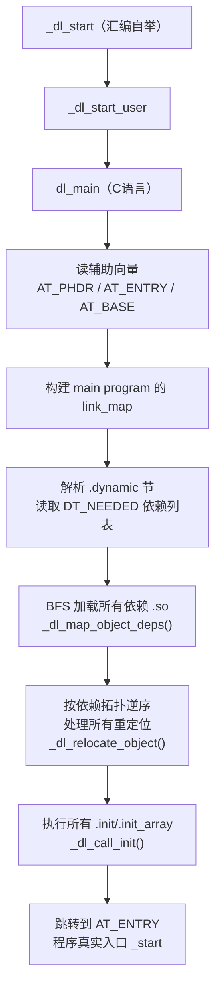

# 详解ELF文件(六十三).ELF动态链接器ld.so内部实现

> [!abstract] TL;DR
> `ld.so`（`/lib/x86_64-linux-gnu/ld-linux-x86-64.so.2`）本身就是一个特殊的 ELF 共享对象（`ET_DYN`），能够**自举**（bootstrap）：在没有任何外部帮助的情况下完成自身重定位并加载目标程序。其核心数据结构是 `link_map` 链表，核心算法是 BFS 依赖遍历与深度优先符号查找（`_dl_lookup_symbol`）。`LD_DEBUG=all` 可将整个加载过程透明化，是动态链接调试的利器。理解 `ld.so` 内部机制是 hook、preload、符号覆盖等技术的理论基础。

## 一、`ld.so` 自身的 ELF 特性

### 1.1 `ld.so` 是 `ET_DYN` 而非 `ET_EXEC`

```bash
# 示例输出（代表性，非本机实跑）
$ readelf -h /lib/x86_64-linux-gnu/ld-linux-x86-64.so.2
ELF Header:
  Type:              DYN (Shared object file)
  Machine:           Advanced Micro Devices X86-64
  Entry point:       0x1050            # _start 入口，不是 0
  ...
$ file /lib/x86_64-linux-gnu/ld-linux-x86-64.so.2
.../ld-linux-x86-64.so.2: ELF 64-bit LSB shared object, x86-64, dynamically linked, ...
```

`ld.so` 是 `ET_DYN`（位置无关共享对象），可被加载到任意虚拟地址，这是自举的先决条件：它不能依赖固定的加载地址。

### 1.2 `ld.so` 无 `PT_INTERP`

普通共享库和可执行文件均有 `PT_INTERP` 程序头，指向解释器路径（通常就是 `/lib64/ld-linux-x86-64.so.2`）。`ld.so` 自身**没有** `PT_INTERP`，因为它就是解释器，无需被另一个解释器加载。

```bash
readelf -l /lib/x86_64-linux-gnu/ld-linux-x86-64.so.2 | grep INTERP
# 无输出
```

### 1.3 `ld.so` 的节结构

`ld.so` 包含一些与普通共享库相同的节（`.text`, `.data`, `.dynamic`, `.plt`, `.got`），但也有几个特殊之处：

- **`.data.rel.ro`**：存储只读数据（如函数指针表），重定位后保护（RELRO）。
- **`__libc_globals`（glibc 内部）**：全局配置变量（如 `_dl_hwcap`、`_dl_lazy`）。
- **`_dl_start`**（而非 `_start`）：glibc 命名下 `ld.so` 的真实入口点函数。
- **无 `PT_PHDR` 自指**：通常共享库不自引用程序头表，`ld.so` 需要在自举期间用 `ELF` 段 `PT_LOAD` 的基址计算自身 `_DYNAMIC` 指针。

## 二、自举路径：从内核交接到 `dl_main`

### 2.1 内核如何移交控制权

当内核加载一个 ELF 可执行文件（`ET_EXEC` 或 `ET_DYN`），若该文件有 `PT_INTERP` 段，内核：

1. 将可执行文件（程序）的 PT_LOAD 段映射到内存。
2. 解析 `PT_INTERP` 得到解释器路径（如 `/lib64/ld-linux-x86-64.so.2`）。
3. 以同样方式将 `ld.so` 的 PT_LOAD 段映射到一段随机基址（ASLR）。
4. 在初始栈上写入辅助向量（auxiliary vector, `AT_*`）：包含 `AT_PHDR`（程序的程序头表地址）、`AT_PHNUM`、`AT_ENTRY`（程序真实入口）、`AT_BASE`（`ld.so` 的基址）等。
5. 将 CPU 控制权转移到 `ld.so` 的入口点（`e_entry`），而非程序的入口点。

```
内核 execve() 结束时的栈布局：
  RSP → argc
         argv[0..N]
         NULL
         envp[0..M]
         NULL
         AT_PHDR = 程序头表VA
         AT_PHNUM = 头数量
         AT_ENTRY = 程序入口VA
         AT_BASE  = ld.so 加载基址
         AT_PAGESZ = 页大小
         ...
         AT_NULL  = 辅助向量结束
```

### 2.2 `_dl_start`：自举阶段

`_dl_start`（glibc 源码 `sysdeps/x86_64/dl-machine.h` 中的汇编）是 `ld.so` 的真实入口，此时：

- **栈可用**，但 C 运行时（BSS 清零、全局构造等）尚未完成。
- **`ld.so` 自身尚未完成重定位**（`.got` 表中的地址还是编译时的占位值）。

自举阶段的核心任务：

```
_dl_start:
  1. 从栈读取 AT_BASE 得到 ld.so 实际加载地址
  2. 计算 ld.so 的 _DYNAMIC 节真实地址（编译时相对地址 + 实际基址）
  3. 遍历 _DYNAMIC 找到 DT_RELA / DT_JMPREL，处理 ld.so 自身的重定位
     （此时 ld.so 的函数调用尚不可用，只用汇编内联完成）
  4. 建立 ld.so 自身的 GOT（写入真实函数地址）
  5. 调用 _dl_start_user（C 代码，此后可正常使用全局变量和函数指针）
```

这一阶段是所谓的"位置无关自举"（PIC bootstrap），是动态链接器实现中最精妙的部分。

### 2.3 `dl_main`：主加载阶段

自举完成后，控制权转给 `dl_main`（glibc `elf/rtld.c`），这是 `ld.so` 的 C 语言核心：



## 三、`link_map`：`ld.so` 的核心数据结构

### 3.1 `link_map` 的关键字段

`struct link_map`（glibc `include/link.h`）是每个已加载共享对象的运行时描述符，关键字段（已简化）：

```c
struct link_map {
    ElfW(Addr)      l_addr;      /* 加载基址（实际 VA - 链接时 VA）*/
    const char     *l_name;      /* 库文件路径，如 "/lib/libm.so.6" */
    ElfW(Dyn)      *l_ld;        /* .dynamic 节的 VA */
    struct link_map *l_next;     /* 双向链表：下一个 link_map */
    struct link_map *l_prev;     /* 双向链表：上一个 link_map */

    /* 以下为 glibc 私有扩展（非标准 ABI，各版本略有差异）*/
    unsigned int    l_direct_opencount;  /* 引用计数 */
    enum {lt_executable, lt_library, lt_loaded} l_type;
    unsigned int    l_relocated;    /* 是否已完成重定位 */
    unsigned int    l_init_called;  /* .init 是否已执行 */
    struct r_scope_elem *l_scope;   /* 符号查找作用域 */
    struct link_map **l_searchlist; /* 依赖的 link_map 列表（BFS 顺序）*/
    struct libname_list *l_libname; /* 库名链表（soname/别名）*/
};
```

`link_map` 链表的顺序：
- 链表头 `_r_debug.r_map`（glibc 公开 ABI）：第一个节点是主程序（`l_type = lt_executable`）。
- 后续节点按加载顺序排列：`ld.so` 自身、各依赖库（按 BFS 依赖顺序）。

### 3.2 用 GDB 访问 `link_map`

```gdb
(gdb) info sharedlibrary           # 高层视图
(gdb) p _r_debug.r_map             # 访问 link_map 链表头
(gdb) p *_r_debug.r_map            # 主程序 link_map
(gdb) p *_r_debug.r_map->l_next   # 第一个依赖库
(gdb) p _r_debug.r_map->l_addr    # 主程序加载基址
```

`_r_debug`（结构类型 `struct r_debug`）是 `ld.so` 提供给调试器的公开接口（`DT_DEBUG` 动态段条目指向它），GDB 和 LLDB 均通过此结构发现已加载的共享库。

### 3.3 `l_addr`：加载基址与 ASLR

对于 PIE 可执行文件和共享库，`l_addr = 实际加载地址 - 链接时虚拟地址`（通常链接时 VA 为 0，则 `l_addr = 实际加载基址`）。

在重定位时，`ld.so` 对每个重定位记录应用：`目标地址 = l_addr + r_offset + 加数`。

## 四、依赖加载算法：BFS 遍历

### 4.1 `DT_NEEDED` 驱动的 BFS

`ld.so` 的依赖发现采用广度优先搜索（BFS），以主程序的 `.dynamic` 节中的 `DT_NEEDED` 条目为初始队列：

```
BFS 队列初始 = [主程序的所有 DT_NEEDED]
已加载集合  = {主程序}

while 队列非空:
  取出库名 soname
  if soname 在已加载集合中:
    continue    # 去重，避免重复加载
  按搜索顺序定位 soname 对应的文件：
    1. LD_PRELOAD 库（最高优先）
    2. 程序的 DT_RPATH（RPATH，不推荐）
    3. LD_LIBRARY_PATH（若无 setuid/setgid）
    4. /etc/ld.so.cache（ldconfig 生成的缓存）
    5. 默认搜索路径（/lib, /usr/lib 等）
    6. DT_RUNPATH（RUNPATH，次于缓存）
  mmap 该 .so 文件的 PT_LOAD 段
  创建其 link_map 节点，加入链表
  将该 .so 的 DT_NEEDED 追加到 BFS 队列
  加入已加载集合
```

BFS 的结果是一个按宽度优先顺序排列的 `link_map` 链表，这决定了后续的符号查找顺序。

### 4.2 搜索路径的优先级细节

| 来源 | 优先级 | 限制 |
|------|--------|------|
| `LD_PRELOAD` | 1（最高）| `setuid`/`setgid` 程序下被忽略 |
| `DT_RPATH`（无 `DT_RUNPATH`）| 2 | 已废弃，不受 `LD_LIBRARY_PATH` 影响 |
| `LD_LIBRARY_PATH` | 3 | `setuid`/`setgid` 程序下被忽略 |
| `/etc/ld.so.cache` | 4 | 由 `ldconfig` 构建 |
| 默认路径 `/lib`, `/usr/lib` | 5 | 系统级 |
| `DT_RUNPATH` | 6 | 比 `RPATH` 弱：受 `LD_LIBRARY_PATH` 影响 |

`RPATH` vs `RUNPATH`：
- `DT_RPATH`（旧）：最高优先级，`LD_LIBRARY_PATH` 无法覆盖，被认为过于强制，新工具链默认不生成。
- `DT_RUNPATH`（新，`-Wl,-rpath=...`）：位于 `LD_LIBRARY_PATH` 之后，可被环境变量覆盖，更安全灵活。

### 4.3 `LD_PRELOAD` 的特殊性

`LD_PRELOAD` 指定的库在 BFS 开始前就被加载，且其 `link_map` 被插入链表的最前端（紧跟主程序之后）。这使得 preload 库的符号在查找时比正常库更早被发现，实现符号覆盖（hook）的效果。

## 五、`_dl_resolve`：运行时符号查找

### 5.1 延迟绑定（Lazy Binding）触发路径

PLT stub（见 [[21.got.plt节]] 和 [[20.rela.plt节]]）首次被调用时，跳转到 `PLT[0]`（resolver stub），推入两个参数后调用 `_dl_runtime_resolve`：

```asm
# x86-64 PLT 首次调用路径（汇编伪代码）
foo@plt:
    jmp   *[GOT+n]          # 第一次跳回 PLT+6
    push  reloc_idx         # 重定位索引（哪个符号）
    jmp   PLT[0]            # 跳转到公共 resolver stub

PLT[0]:
    push  *[GOT+8]          # push link_map 指针（当前模块的）
    jmp   *[GOT+16]         # 调用 _dl_runtime_resolve（GOT[2]）
```

`GOT[1]` 存储当前模块的 `link_map` 指针，`GOT[2]` 在加载时由 `ld.so` 写入 `_dl_runtime_resolve` 的地址（通过 `DT_PLTGOT` 找到 `.got.plt`，写入固定偏移处）。

### 5.2 `_dl_lookup_symbol`：BFS 作用域查找

符号查找遍历 `link_map` 的 `l_scope`（作用域）链，scope 是按 BFS 依赖顺序排列的 `link_map` 数组：

```
查找符号 foo 的顺序（以主程序为起点的 BFS 顺序）：

1. 主程序的 .dynsym（若主程序导出 foo，优先使用）
2. LD_PRELOAD 库（按 LD_PRELOAD 列表顺序）
3. BFS 队列第一层：主程序的直接 DT_NEEDED（按 DT_NEEDED 出现顺序）
4. BFS 队列第二层：各依赖库的 DT_NEEDED
5. ...
直到找到第一个匹配项
```

哈希查找优化：为避免遍历所有符号，`.dynsym` 配合 `.hash`（SysV hash，[[37.hash节]]）或 `.gnu.hash`（GNU hash，更快）实现 O(1) 平均查找。

```
.gnu.hash 查找步骤：
  1. 计算符号名的 GNU hash 值 h
  2. 查 Bloom filter（快速排除，2-level bitset）
  3. 若 Bloom 未排除，查 bucket[h % nbuckets] 得链首索引
  4. 顺序比对链上各项（hash 值 + 名字字符串）
```

### 5.3 `RTLD_DEFAULT` 与 `RTLD_NEXT`

`dlsym(RTLD_DEFAULT, "foo")` 按全局 BFS 顺序查找 `foo`；`dlsym(RTLD_NEXT, "foo")` 从调用者的下一个 `link_map` 开始查找，常用于 hook 实现：

```c
// hook malloc 示例
static void *(*real_malloc)(size_t) = NULL;

void *malloc(size_t size) {
    if (!real_malloc)
        real_malloc = dlsym(RTLD_NEXT, "malloc");    // 找 libc 的 malloc
    /* 插入自定义逻辑 */
    return real_malloc(size);
}
```

## 六、`LD_DEBUG=all` 输出解读

### 6.1 启用 `LD_DEBUG`

```bash
LD_DEBUG=all ./prog 2>&1 | head -200

# 也可只开特定子系统：
LD_DEBUG=libs     # 库搜索路径
LD_DEBUG=symbols  # 符号查找
LD_DEBUG=reloc    # 重定位
LD_DEBUG=bindings # 每次符号绑定
LD_DEBUG=files    # 文件打开
LD_DEBUG=help     # 列出所有可用值
```

### 6.2 关键输出模式

```text
# 示例输出（代表性，非本机实跑，已简化）

# ─── 库搜索 ───
      pid: find library=libm.so.6 [0]; searching
      pid: search cache=/etc/ld.so.cache
      pid:   trying file=/lib/x86_64-linux-gnu/libm.so.6
      pid: loading library=libm.so.6 [0]

# ─── 符号绑定（延迟绑定触发时）───
      pid: binding file=prog [0] to libm.so.6 [0]: normal symbol `sin'

# ─── 重定位 ───
      pid: relocation processing: libm.so.6 [0]
      pid: symbol=sin;  lookup in file=prog [0]
      pid: symbol=sin;  lookup in file=ld-linux-x86-64.so.2 [0]
      pid: symbol=sin;  lookup in file=libc.so.6 [0]
      pid: symbol=sin;  lookup in file=libm.so.6 [0]
      pid: binding file=libm.so.6 to libm.so.6: normal symbol `sin' [...]

# ─── 初始化顺序 ───
      pid: calling init: libm.so.6
      pid: initialize program: prog
```

字段含义：
- `file=X [N]`：`X` 是 `link_map->l_name`，`[N]` 是 `l_ns`（命名空间索引，通常为 0）。
- `normal symbol`：非弱符号、非特殊 TLS 符号。
- `binding file=A to B`：在 B 中找到了 A 所引用的符号。

### 6.3 `LD_DEBUG_OUTPUT`

`LD_DEBUG` 默认写到 `stderr`，可用 `LD_DEBUG_OUTPUT=file.txt ./prog` 重定向到文件（尤其在 `setuid` 程序中 `LD_DEBUG` 会被完全忽略）。

## 七、glibc `ld.so` 版本差异与安全加固

### 7.1 glibc 2.29 前：全局重定位锁

glibc 2.29 以前，符号解析（`_dl_runtime_resolve`）持有全局互斥锁 `_dl_load_lock`，多线程程序在大量延迟绑定时会争抢此锁，造成性能热点。glibc 2.29 引入 `RTLD_NODELETE`-aware 路径后略有改善，但根本性改进在更新版本中。

### 7.2 glibc 2.34：`ld.so` 与 `libc.so` 合并实验

glibc 2.34 将大量 `ld.so` 内部功能（如 `libdl` 函数）迁移进 `libc.so`，`libdl.so` 成为空壳。`ld.so` 自身体积因此略有缩小，但接口兼容性不变。

### 7.3 glibc 2.35+ 安全加固

**Stack canaries in `ld.so`**：glibc 2.35 为 `ld.so` 的部分关键函数启用栈 canary（之前仅 libc 有），防止通过 `LD_PRELOAD` 注入栈溢出的 `ld.so` 函数。

**HWCAP2 与 IFUNC 强化**：`IFUNC`（间接函数，`STT_GNU_IFUNC`）允许库在加载时动态选择函数实现（如按 CPU 特性选择 AVX512 版本的 `memcpy`）。glibc 2.35+ 加强了 IFUNC resolver 的调用约束，限制在 resolver 中可调用的 libc 函数范围（防止 resolver 递归或访问未初始化状态）。

**`LD_AUDIT` 限制**：glibc 2.35+ 对 `LD_AUDIT`（运行时库审计接口）在 setuid/setgid 场景下增加更严格的限制，`LD_AUDIT` 提供的钩子（`la_symbind`、`la_pltenter`/`la_pltexit`）在特权进程中被完全禁用。

**Direct binding（DT_SYMTAB + DT_SYMBOLIC）**：部分 glibc 版本加强了对 `DF_SYMBOLIC`（`DT_FLAGS` 中的 `DF_SYMBOLIC` 位，使本库符号优先本地解析）的处理，减少跨库符号查找的不确定性。

### 7.4 版本字符串查看

```bash
# 查看 ld.so 版本
/lib/x86_64-linux-gnu/ld-linux-x86-64.so.2 --version

# 查看 glibc 版本（通过 libc.so）
ldd --version
strings /lib/x86_64-linux-gnu/libc.so.6 | grep "GNU C Library"
```

## 八、常用调试与逆向技巧

### 8.1 查看进程加载的所有共享库

```bash
# 静态分析（链接期依赖）
ldd ./prog

# 运行时实际加载（含 dlopen 动态加载的库）
cat /proc/<pid>/maps | grep "\.so"

# 用 ld.so 直接运行（不执行程序逻辑）
LD_TRACE_LOADED_OBJECTS=1 ./prog    # 等价于 ldd（环境变量内部机制）
```

### 8.2 拦截 PLT 调用（LD_PRELOAD hook）

```c
// hook_write.c：拦截所有 write() 调用
#define _GNU_SOURCE
#include <unistd.h>
#include <dlfcn.h>
#include <stdio.h>

ssize_t write(int fd, const void *buf, size_t count) {
    static ssize_t (*real_write)(int, const void*, size_t) = NULL;
    if (!real_write)
        real_write = dlsym(RTLD_NEXT, "write");
    fprintf(stderr, "[HOOK] write(%d, %p, %zu)\n", fd, buf, count);
    return real_write(fd, buf, count);
}
```

```bash
gcc -shared -fPIC -o hook_write.so hook_write.c -ldl
LD_PRELOAD=./hook_write.so ./prog
```

### 8.3 用 GDB 在符号绑定处设断点

```gdb
# 在延迟绑定处设断点（glibc 内部符号）
(gdb) b _dl_runtime_resolve
(gdb) b _dl_fixup          # 真正的绑定函数
# 每次第一次调用 PLT 符号时触发
```

### 8.4 `LD_AUDIT`：库级审计接口

```c
// audit.c：实现 rtld-audit 接口
#include <link.h>
#include <stdio.h>

unsigned int la_version(unsigned int version) { return LAV_CURRENT; }

unsigned int la_objopen(struct link_map *map, Lmid_t lmid, uintptr_t *cookie) {
    fprintf(stderr, "[AUDIT] loading: %s at %p\n",
            map->l_name, (void*)map->l_addr);
    return LA_FLG_BINDTO | LA_FLG_BINDFROM;
}

uintptr_t la_symbind64(Elf64_Sym *sym, unsigned int ndx,
                        uintptr_t *refcook, uintptr_t *defcook,
                        unsigned int *flags, const char *symname) {
    fprintf(stderr, "[AUDIT] binding: %s\n", symname);
    return sym->st_value;
}
```

```bash
gcc -shared -fPIC -o audit.so audit.c
LD_AUDIT=./audit.so ./prog
```

## 九、安全性与正确使用

### 9.1 `ld.so` 相关的安全攻击面

动态链接器是进程启动路径上高权限的代码，历史上出现过多类安全问题：

**`LD_PRELOAD` 提权**：若 setuid 程序在某些条件下意外尊重了 `LD_PRELOAD`（glibc bug 或配置错误），攻击者可注入恶意库以 root 权限执行任意代码。现代 glibc 对所有 effective-uid != real-uid 的情况一律忽略 `LD_*` 环境变量。

**RPATH 注入**：可执行文件使用 `$ORIGIN`（相对 RPATH）时，若 RPATH 指向可被攻击者控制的目录（如 `/tmp`），攻击者可放置同名恶意库。`--enable-new-dtags`（`DT_RUNPATH`）+ 严格目录权限是缓解手段。

**GOT 覆写攻击**：GOT 表（`.got.plt`）在早期 RELRO（Partial RELRO）下可写，攻击者通过任意写漏洞覆写 GOT 条目实现控制流劫持。Full RELRO（`-Wl,-z,relro,-z,now`）在加载时完成所有重定位并将 `.got.plt` 标记为只读（`mprotect`）。

**Scope Manipulation**：通过 `dlopen` 注入的库若能修改 `link_map` 链表（在 glibc 早期版本中 `link_map` 可读写），可影响符号解析顺序实现 hook 或绕过安全检查。现代 glibc 通过隐藏 `link_map` 的内部节点（`RTLD_NODELETE` 引用计数保护）缓解此问题。

### 9.2 防御配置建议

```bash
# 1. 启用 Full RELRO（使 .got.plt 只读）
gcc -Wl,-z,relro,-z,now -o prog main.o -lfoo

# 2. 检查 RPATH 是否包含不安全路径
readelf -d prog | grep -E "RPATH|RUNPATH"
# 理想情况：无 RPATH，或仅包含绝对路径且权限受控

# 3. 验证 Full RELRO 是否生效
readelf -l prog | grep GNU_RELRO
checksec --file=prog    # 第三方工具，综合安全属性检查

# 4. 使用 ldconfig 维护系统库缓存（避免依赖 LD_LIBRARY_PATH）
sudo ldconfig
# 不在 /etc/ld.so.conf 中的路径不应被信任程序使用
```

### 9.3 `ld.so.preload` 系统级 preload

`/etc/ld.so.preload` 文件（一行一个库路径）是系统级 `LD_PRELOAD`，对所有进程有效（包括 setuid）。该文件被入侵者用于持久化 rootkit（注入全局 hook），是系统安全审计的必查点：

```bash
# 检查系统级 preload
cat /etc/ld.so.preload    # 正常情况应为空或不存在
ls -la /etc/ld.so.preload
```

---

[[00.ELF文件详解总览|⬆ 系列总览]] | [[62.ELF静态库与链接器交互|← 上一篇]] | [[64.ELF损坏修复与手工重建|→ 下一篇]]
