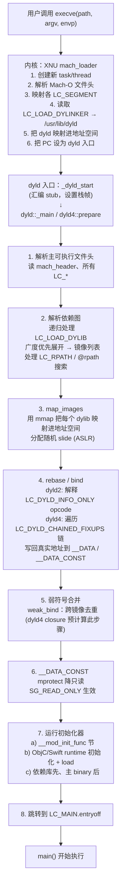
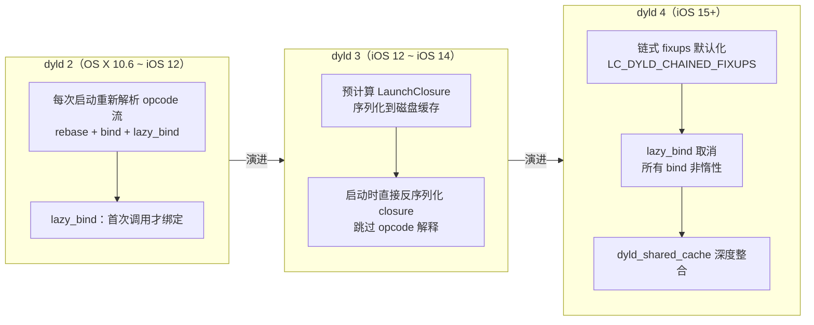

# 详解Mach-O(四十四)dyld加载流程全景

> [!abstract] TL;DR
> 一个 iOS / macOS 进程从 Shell 敲下回车到 `main()` 第一行代码执行，中间经历的不只是"把二进制读进内存"这么简单。整套启动流程跨越内核、动态链接器（dyld）、运行时三个层次：**内核**响应 `execve` 系统调用，把 Mach-O 映射进新地址空间并把控制权交给 dyld；**dyld** 接管后依次完成镜像映射、rebase/bind（或链式 fixups）、初始化器调用，最后跳入 `LC_MAIN` 指定的入口；**运行时**（ObjC / Swift runtime）在初始化器阶段注册类、方法、协议等元数据。dyld 自身经历了三代演化：**dyld 2**（逐库、延迟惰性绑定）→ **dyld 3**（预计算启动闭包 closure，缓存在磁盘）→ **dyld 4**（统一 closure 架构，链式 fixups 默认化，`dyld_shared_cache` 深度整合）。逆向 dyld 行为最直接的武器是 `DYLD_PRINT_*` 家族环境变量，可在不修改二进制的前提下把每一步加载行为打印出来。

## 概述与定位

### 为什么要理解 dyld 加载流程

大多数逆向入门者把 Mach-O 分析集中在 `__TEXT` 段的机器码上，却忽视了一个事实：**进程跑起来之前，整个地址空间要被 dyld 重新塑造一遍**。不理解这个过程，就无法理解：

- 为什么 LLDB 能在 `main` 之前打断点（hook 点存在于初始化器链）；
- 为什么 `+load` 和 `__mod_init_func` 的调用顺序有时难以预测；
- 为什么有些 hook 框架注入在 `dyld` 层、有些在 ObjC runtime 层——它们在时序上完全不同；
- 为什么 iOS 15 以后的二进制"长相"（指针含链式 fixup 信息）和老二进制差异如此之大。

本篇把从 `execve` 到 `main()` 的每一步拆开讲透，并给出可以在实际逆向中使用的工具命令。

### 与本系列其他篇的关系

- [[17.Mach-O LC_DYLD_INFO_ONLY]]：rebase/bind opcode 字节码，dyld 加载流程"绑定"阶段的数据源；
- [[09.Mach-O LC_MAIN]]：`dyld` 加载完成后跳入的入口点；
- [[32.Mach-O __mod_init_func节]]、[[33.Mach-O __mod_term_func节]]：初始化器与终止器链；
- [[07.Mach-O LC_LOAD_DYLIB]]：依赖库声明，构成 dyld 解析的依赖图；
- [[15.Mach-O __DATA_CONST]]：bind 阶段写回的目标之一，写完后 dyld 将其降为只读。

---

## 结构图示

### 全景时序（execve → main）

> [!note]- Mermaid 源码
> ```text
> flowchart TD
>     A["用户调用 execve(path, argv, envp)"] --> B["内核：XNU mach_loader<br/>1. 创建新 task/thread<br/>2. 解析 Mach-O 文件头<br/>3. 映射各 LC_SEGMENT<br/>4. 读取 LC_LOAD_DYLINKER → /usr/lib/dyld<br/>5. 把 dyld 映射进地址空间<br/>6. 把 PC 设为 dyld 入口"]
>     B --> C["dyld 入口：_dyld_start<br/>(汇编 stub，设置栈帧)<br/>↓<br/>dyld::_main / dyld4::prepare"]
>     C --> D["1. 解析主可执行文件头<br/>  读 mach_header、所有 LC_*"]
>     D --> E["2. 解析依赖图<br/>  递归处理 LC_LOAD_DYLIB<br/>  广度优先展开 → 镜像列表<br/>  处理 LC_RPATH / @rpath 搜索"]
>     E --> F["3. map_images<br/>  用 mmap 把每个 dylib 映射进地址空间<br/>  分配随机 slide (ASLR)"]
>     F --> G["4. rebase / bind<br/>  dyld2: 解释 LC_DYLD_INFO_ONLY opcode<br/>  dyld4: 遍历 LC_DYLD_CHAINED_FIXUPS 链<br/>  写回真实地址到 __DATA / __DATA_CONST"]
>     G --> H["5. 弱符号合并<br/>  weak_bind：跨镜像去重<br/>  (dyld4 closure 预计算此步骤)"]
>     H --> I["6. __DATA_CONST mprotect 降只读<br/>  SG_READ_ONLY 生效"]
>     I --> J["7. 运行初始化器<br/>  a) __mod_init_func 节（C++ 全局构造器、__attribute__((constructor))）<br/>  b) ObjC/Swift runtime 初始化：<br/>     map_images → load_images → +load 方法<br/>  c) 依赖库先、主 binary 后（DFS 后序）"]
>     J --> K["8. 跳转到 LC_MAIN.entryoff<br/>  (dyld 调用 start() 启动 CRT，CRT 调 main())"]
>     K --> L["main() 开始执行"]
> ```



### dyld 三代演化对比

> [!note]- Mermaid 源码
> ```text
> flowchart LR
>     subgraph D2["dyld 2（OS X 10.6 ~ iOS 12）"]
>         direction TB
>         D2A["每次启动重新<br/>解析 opcode 流<br/>rebase + bind + lazy_bind"]
>         D2B["lazy_bind：首次调用<br/>才绑定外部函数"]
>         D2A --> D2B
>     end
>     subgraph D3["dyld 3（iOS 12 ~ iOS 14）"]
>         direction TB
>         D3A["预计算 LaunchClosure<br/>序列化到磁盘缓存<br/>(dyld_closure_directory)"]
>         D3B["启动时直接<br/>反序列化 closure<br/>跳过 opcode 解释"]
>         D3A --> D3B
>     end
>     subgraph D4["dyld 4（iOS 15+）"]
>         direction TB
>         D4A["链式 fixups 默认化<br/>LC_DYLD_CHAINED_FIXUPS<br/>rebase+bind 按页链式"]
>         D4B["lazy_bind 取消<br/>__la_symbol_ptr 消失<br/>所有 bind 非惰性"]
>         D4C["dyld_shared_cache<br/>深度整合：框架预绑定<br/>直接引用 cache 地址"]
>         D4A --> D4B --> D4C
>     end
>     D2 --"演进"--> D3 --"演进"--> D4
> ```



---

## 核心原理与字段详解

### 1. 第零步：execve 与内核 mach_loader

整个流程从 Shell（或父进程）调用 **`execve(2)`** 系统调用开始。内核接管后，XNU 的 `mach_loader` 完成以下工作，然后才把 CPU 交给用户态的 dyld：

1. **解析 Mach-O 头**：读取 `mach_header` 的 `magic`（`0xFEEDFACF` 表示 arm64 64 位），验证 `cputype`/`cpusubtype`，确认文件类型是 `MFT_EXECUTE`。

2. **映射各段**：遍历所有 `LC_SEGMENT_64` 命令，按 `vmaddr`/`vmsize` 调用 `vm_map` 建立虚拟内存映射。**此时 slide 还是 0**——ASLR 的随机化由 dyld 在用户态完成（主可执行文件的 slide 由内核随机确定，传给 dyld；dylib 的 slide 由 dyld 分配）。

3. **找到 dyld**：查找 `LC_LOAD_DYLINKER` 命令，其 `name` 字段通常是 `/usr/lib/dyld`。内核把 dyld 自身也映射进地址空间。

4. **移交控制权**：内核把 PC（程序计数器）设置为 dyld 的 `__TEXT` 段入口（`_dyld_start` 汇编桩），此后 dyld 接管。主可执行文件的 `mach_header` 地址、命令行参数 `argv`、环境变量 `envp`、Apple 传递的扩展参数等，都通过初始栈布局传给 dyld。

> [!note] ASLR slide 的来源
> 内核给主可执行文件随机选一个 slide（64 位程序通常在高位，确保落在 `__PAGEZERO` 之外）并通过栈帧传给 dyld。dylib 的 slide 由 dyld 自行随机化分配——每个库获得不同的随机偏移，保证加载到不同虚拟地址。dyld_shared_cache 的 slide 则是在 cache 构建时或首次映射时固定，整个 cache 作为一个整体施加同一个 slide。

### 2. dyld 入口：`_dyld_start` → `dyld::_main`

`_dyld_start` 是一段汇编 stub（在 `dyld/src/dyldStartup.s`），其任务极简：

- 对齐栈帧；
- 把内核传来的栈指针和 Apple 参数指针作为参数；
- 调用 C++ 函数 `dyld::_main()`（dyld 2/3）或 `dyld4::prepare()`（dyld 4）。

`dyld::_main` 是整个加载流程的总调度器，接下来几节描述的所有步骤都在其控制下顺序执行。

### 3. 解析依赖图（Dependency Resolution）

dyld 拿到主可执行文件的 `mach_header` 后，**广度优先**展开所有 `LC_LOAD_DYLIB` 依赖：

```
主可执行 (level 0)
 ├── libfoo.dylib (level 1)  ← LC_LOAD_DYLIB
 │    └── libbar.dylib (level 2)  ← libfoo 的 LC_LOAD_DYLIB
 └── libsystem.dylib (level 1)
```

展开时需要处理以下情况：

- **路径解析**：`@executable_path`（相对主可执行目录）、`@loader_path`（相对当前镜像目录）、`@rpath`（按 `LC_RPATH` 命令列表依序搜索）。`DYLD_LIBRARY_PATH` / `DYLD_FRAMEWORK_PATH` 环境变量可在搜索路径前插入自定义路径（沙盒外 + SIP 禁止 → 已在受限进程中被屏蔽，逆向绕过是经典技法，见第 7 节）。

- **循环依赖**：dyld 维护"已加载镜像"集合，已加载的镜像直接复用，避免重复映射和无限递归。

- **dyld_shared_cache 命中**：如果目标 dylib 在当前系统的 `dyld_shared_cache` 中，dyld **不从文件系统读取**——直接映射 cache 内对应区域，极大加速加载。`dyld_shared_cache` 包含所有系统框架的预链接版本（见 [[00.Mach-O文件详解总览]] 中对 cache 的介绍）。

### 4. map_images：把二进制映射进地址空间

对每个未从 cache 命中的镜像，dyld 调用 `mmap` 把文件的各个段映射进进程地址空间，分配随机 slide，并更新内部的"已加载镜像"列表。

这步完成后，地址空间里所有镜像的段都已存在，但：

- 所有**内部指针**（指向本镜像内部的绝对指针）值还是"文件里的基准地址"——尚未加上 slide；
- 所有**外部符号引用**（`__got`、`__la_symbol_ptr` 等）还是占位 0。

这两类错误分别由 rebase 和 bind 来修正。

### 5. rebase / bind（或链式 fixups）

这是 dyld 最核心的步骤，依二进制格式不同走两条路：

#### 路径 A：旧机制 —— LC_DYLD_INFO_ONLY opcode 流

dyld 读取 [[17.Mach-O LC_DYLD_INFO_ONLY]] 中描述的五张表：

| 步骤 | 表名 | 作用 |
|---|---|---|
| 1 | rebase | 遍历 opcode 流，对所有"内部绝对指针"位置做 `*ptr += slide` |
| 2 | bind | 遍历 opcode 流，按符号名从依赖库查找真实地址，写回 `__got`/`__nl_symbol_ptr` |
| 3 | weak_bind | bind 之后，跨镜像合并同名弱符号，确保"全进程只用一份" |
| 4 | lazy_bind | 不在启动时执行，而是在首次调用时由 `dyld_stub_binder` 触发 |

#### 路径 B：新机制 —— LC_DYLD_CHAINED_FIXUPS 链式遍历

iOS 15+ / macOS 12+（部署目标 ≥ 这些版本）的二进制：

1. dyld 读取 `dyld_chained_fixups_header` → `dyld_chained_starts_in_image` → 各段 `dyld_chained_starts_in_segment`；
2. 对每个内存页，从 `page_starts[i]` 定位该页第一个 fixup 指针；
3. **顺链遍历**：从 64 位原始值中取 `next`（步距）、`bind` 位（0=rebase，1=bind）、`auth` 位（PAC）；
4. rebase 变体：将 `target` 加上镜像 slide 写回；bind 变体：从 imports 表查符号地址写回；
5. **一遍扫描同时完成 rebase + bind**，lazy_bind 彻底消失。

> [!note] 为什么链式更快
> 旧机制需要三次独立扫描（rebase、bind、lazy_bind 各一次），且 opcode 解释有 dispatch 开销。链式 fixups 利用"fixup 指针本身携带到下一个的步距"把整页的 fixup 串成一条链，**单次遍历全做完**；又因按内存页组织，可以和缺页中断（page fault）联动，未访问的页根本不修补——相当于免费的惰性化。

### 6. __DATA_CONST 降权：mprotect 到只读

bind 完成后，dyld 对 `SG_READ_ONLY`（[[15.Mach-O __DATA_CONST]]）标志的段调用 `mprotect(..., PROT_READ)`，把整段降为只读。从此，GOT、ObjC 元数据指针表等成为不可写内存——攻击者即使拿到了写原语，也无法再改写函数指针（这是 `__DATA_CONST` 防 GOT 劫持的根本机制）。

### 7. 运行初始化器：`__mod_init_func` 与 ObjC `+load`

**这是 `main()` 之前最危险（也最有趣）的地带**：大量框架 hook、反调试、注入代码都在这里发生。

初始化器调用顺序遵循**依赖图后序（post-order DFS）**：先初始化依赖，再初始化依赖方；同一层内按加载顺序。

#### 7a. `__mod_init_func` 节（C++ 全局构造器 / `__attribute__((constructor))`）

`__DATA,__mod_init_func`（见 [[32.Mach-O __mod_init_func节]]）存放一组函数指针，每个指向一个初始化函数。dyld 遍历并**逐一调用**它们。典型来源：

- C++ 全局对象的构造函数（编译器自动生成）；
- `__attribute__((constructor))` 标记的 C 函数；
- ObjC 运行时注册函数（`_objc_init`、`_NSInitializePlatform` 等系统框架）。

#### 7b. ObjC runtime 初始化：`map_images` → `load_images` → `+load`

ObjC runtime 自身通过 `__mod_init_func` 注册了一个初始化回调：

1. **`map_images`**：对每个新映射的镜像，runtime 扫描 `__objc_classlist`（[[36.Mach-O __objc_classlist节]]）、`__objc_protolist`（[[38.Mach-O __objc_protolist节]]）、`__objc_catlist`（[[39.Mach-O __objc_catlist节]]）等节，把类、协议、分类注册进 runtime 的全局表（realized class 表 + protocol 表）。

2. **`load_images`**：调用所有实现了 `+load` 方法的类和分类的 `+load`。调用顺序：
   - 父类的 `+load` 先于子类；
   - 同一层内按编译单元链接顺序；
   - 分类的 `+load` 晚于其所属类；
   - **`+load` 不走 `objc_msgSend`，是直接函数调用**——即使类被 swizzle，`+load` 已被调用。

> [!warning] `+load` 是启动性能杀手
> 每个 `+load` 实现都在 `main` 之前执行，且无法懒加载。WWDC 多次强调：非必要不实现 `+load`，能用 `+initialize`（首次发消息时惰性触发）代替就用。**逆向时 `+load` 是发现注入框架和反调试代码的高频位置**。

#### 7c. Swift runtime 初始化

Swift 二进制在 `__mod_init_func` 中注册 `swift_init`，它负责：

- 遍历 `__swift5_types`（类型描述符，见 [[43.Mach-O __RODATA]]）、`__swift5_proto`（协议一致性）；
- 执行 Swift 的协议见证表（witness table）初始化；
- 调用 `@_silgen_name("swift_once")` 包裹的全局初始化 token。

### 8. 跳入入口：LC_MAIN

所有初始化器执行完毕后，dyld 读取 [[09.Mach-O LC_MAIN]] 的 `entryoff` 字段（相对 `__TEXT` 段起点的字节偏移），加上镜像的 slide 得到入口函数地址，跳转执行。

对现代二进制，入口通常是 CRT（C Runtime）的 `start()` 函数（在 `libdyld.dylib` 或 `crt1.o` 里），它设置 `argc`/`argv`/`envp`，再调 `main()`。

> [!note] `LC_MAIN` vs `LC_UNIXTHREAD`
> 旧式二进制（Xcode 旧工具链）用 `LC_UNIXTHREAD` 指定入口，直接给出寄存器初始状态（包括 PC）。`LC_MAIN`（OS X 10.8+ 引入）只给一个相对偏移，由 dyld 负责找 CRT 的 `start()`，更安全也更紧凑。现代所有二进制都用 `LC_MAIN`。

---

## dyld 2 / dyld 3 / dyld 4 详解

### dyld 2：经典架构（OS X 10.6 ~ iOS 12）

dyld 2 是"每次启动完整重走一遍"的架构：

- 全量解析 `LC_DYLD_INFO_ONLY` 的 rebase/bind opcode 流；
- **lazy_bind** 机制：函数桩（`__stubs`）→ 惰性指针（`__la_symbol_ptr`）→ `__stub_helper` → `dyld_stub_binder` → 绑定 + 回填 `__la_symbol_ptr`；
- 每次冷启动都要重新解析依赖图、遍历 opcode——**不缓存**，每次 `open()/mmap()` 全跑一遍。

dyld 2 的瓶颈在于：大型 App 有几百个 dylib，opcode 解释和符号查找是线性的，冷启动耗时可达数秒。

### dyld 3：启动闭包（iOS 12 ~ iOS 14，macOS 10.14+）

dyld 3 的核心创新是**预计算启动闭包（LaunchClosure）**：

1. 第一次（或二进制更新后）启动时，dyld 完整计算所有加载决策（依赖图、rebase/bind 结果、初始化器顺序）并**序列化成 closure 文件**缓存到磁盘（`/var/db/dyld/dyld_closure_*`）；
2. 后续启动时，dyld 直接**反序列化 closure**，跳过几乎所有解析步骤，直接映射 + 写回预计算好的地址；
3. Closure 文件本质是一个紧凑的二进制格式（`dyld3::closure::*` 结构），描述"在当前系统版本下如何把这个 App 跑起来"。

**逆向视角**：dyld 3 时代的 App，`/var/db/dyld/` 目录下的 closure 文件记录了所有符号绑定的最终地址——是分析依赖关系和符号解析结果的宝贵信息。

### dyld 4：统一架构（iOS 15+，macOS 12+）

dyld 4 延续了 dyld 3 的 closure 思想，同时做了更深层的改变：

- **链式 fixups 默认化**：新格式让 rebase+bind 的元数据体积缩小约 50%，启动期写操作减少；
- **取消 lazy_bind**：`__la_symbol_ptr` 节、`__stub_helper` 节在新二进制中消失，所有外部函数绑定在 bind 阶段统一完成；
- **dyld_shared_cache 深度整合**：系统框架的 fixup 在 cache 构建时预先完成（`dyld_closure_dir/com.apple.dyld/`），加载时直接用 cache 中已绑定好的地址；
- **合法性验证增强**：配合 AMFI（Apple Mobile File Integrity）对每个镜像的代码签名进行强制验证（见 [[45.代码签名LC_CODE_SIGNATURE详解]]）。

---

## 逆向 dyld 行为：DYLD_PRINT_* 环境变量

`DYLD_PRINT_*` 是 dyld 内置的调试开关，无需修改二进制，通过环境变量即可把加载过程的每一步打印出来。

> [!warning] 受限进程不可用
> `DYLD_PRINT_*` 等环境变量在以下情况下被 dyld 静默忽略（hardened runtime / SIP / 沙盒 / entitlements 受限进程）：
> - 设置了 `setuid`/`setgid` 位的二进制；
> - 开启了 `com.apple.security.cs-allow-dyld-environment-variables` entitlement 以外的任何受限 entitlement；
> - 在 iOS 真机沙盒内（需越狱或使用 DebugServer + lldb attach）。
> 在 macOS 上，对非沙盒 App 和 CLI 工具可直接用。

### 常用变量一览

| 变量名 | 打印内容 | 典型用途 |
|---|---|---|
| `DYLD_PRINT_LIBRARIES` | 每个被加载的 dylib 路径 | 了解实际加载的库、发现注入库 |
| `DYLD_PRINT_LIBRARIES_POST_LAUNCH` | 仅显示 `main()` 之后动态加载的库（`dlopen`）| 发现运行期注入 |
| `DYLD_PRINT_SEGMENTS` | 每个镜像每个段的映射地址 | 得到实际 slide、段地址 |
| `DYLD_PRINT_BINDINGS` | 每次 bind 操作（符号名 + 目标地址）| 追踪每个外部符号的解析结果 |
| `DYLD_PRINT_INITIALIZERS` | 每个初始化器函数被调用（路径 + 函数指针）| 发现 `+load` / `__attribute__((constructor))` 注入 |
| `DYLD_PRINT_DOFS` | DTrace Object Format 探针注册 | DTrace 调试 |
| `DYLD_PRINT_STATISTICS` | 各阶段耗时汇总（启动性能分析）| App 启动优化 |
| `DYLD_PRINT_STATISTICS_DETAILS` | 比 `_STATISTICS` 更细粒度的耗时 | 精细性能分析 |
| `DYLD_PRINT_APIS` | dyld 公开 API（如 `dlopen`/`dlsym`）调用 | 追踪动态符号查找 |
| `DYLD_PRINT_ENV` | 输出 dyld 看到的所有相关环境变量 | 验证注入环境是否生效 |

### 使用方式

```bash
# macOS CLI 工具：直接前置环境变量
DYLD_PRINT_LIBRARIES=1 DYLD_PRINT_BINDINGS=1 /usr/bin/xcrun otool --version

# Xcode Scheme 中注入（Edit Scheme → Run → Arguments → Environment Variables）
DYLD_PRINT_STATISTICS = 1

# lldb 在 launch 前注入
(lldb) process launch --environment DYLD_PRINT_INITIALIZERS=1

# 用于 macOS 非沙盒 App
DYLD_PRINT_LIBRARIES=1 DYLD_PRINT_INITIALIZERS=1 /Applications/MyApp.app/Contents/MacOS/MyApp
```

### 示例输出解读

```bash
DYLD_PRINT_LIBRARIES=1 DYLD_PRINT_INITIALIZERS=1 /usr/bin/true
```

> [!warning] 以下输出为示意，实际路径和地址以系统为准

```text
dyld: loaded: /usr/bin/true
dyld: loaded: /usr/lib/dyld
dyld: loaded: /usr/lib/libSystem.B.dylib          ← 系统库从 dyld_shared_cache 直接映射
dyld: loaded: /usr/lib/system/libcache.dylib
...

dyld: calling initializer function 0x7ff80012a340 in /usr/lib/libSystem.B.dylib
dyld: calling initializer function 0x7ff800210890 in /usr/lib/system/libdispatch.dylib
...
```

**DYLD_PRINT_BINDINGS** 输出中每行格式为：

```text
dyld: bind: /usr/bin/true:__DATA_CONST(__auth_got) += 0x7ff8001f4e10 (libSystem: _printf)
```

含义：`/usr/bin/true` 的 `__DATA_CONST,__auth_got` 节中，符号 `_printf` 被绑定到地址 `0x7ff8001f4e10`（来自 libSystem）。

---

## 实操：逆向分析 dyld 加载行为

### 场景 1：找出所有 `+load` / `__attribute__((constructor))` 调用

```bash
# 方法1：DYLD_PRINT_INITIALIZERS（macOS 非沙盒 App）
DYLD_PRINT_INITIALIZERS=1 /path/to/app 2>&1 | grep initializer

# 方法2：静态分析，列出 __mod_init_func 节所有函数指针
otool -s __DATA __mod_init_func /path/to/binary | xxd | head -20
# 然后对每个地址用 nm / atos / lldb 还原符号名

# 方法3：用 class-dump 或 IDA 找所有实现了 +load 的类
class-dump --arch arm64 /path/to/binary | grep "+load"
```

### 场景 2：追踪动态库注入点

```bash
# 检查是否存在 DYLD_INSERT_LIBRARIES 或异常库
DYLD_PRINT_LIBRARIES=1 /path/to/binary 2>&1 | grep -v "dyld_shared_cache"
# cache 内的库可以忽略，非 cache 来源的是"外来"库
```

### 场景 3：获得每个 dylib 的实际加载地址（用于计算 slide）

```bash
DYLD_PRINT_SEGMENTS=1 /path/to/binary 2>&1 | grep -E "^.*\s+__TEXT"
# 输出格式：
# /usr/lib/libSystem.B.dylib   __TEXT at 0x7ff80012a000
# 对比 otool -l 的 vmaddr（加载前基准地址），差值即 slide
```

### 场景 4：用 lldb 在初始化器 / dyld 关键函数下断点

```lldb
# attach 前在 dyld 层设断点（需 SIP 关闭或 DebugServer）
(lldb) target create /path/to/binary
(lldb) settings set target.env-vars DYLD_PRINT_STATISTICS=1
# 在所有 +load 调用时中断
(lldb) breakpoint set -n "+[NSObject load]"
# 在 dyld 的 map_images 调用时中断（符号在 /usr/lib/libobjc.A.dylib）
(lldb) breakpoint set -n "_ZN4objc11map_imagesEjPKP10mach_headerS2_"
```

### 场景 5：分析 dyld3/4 的 Closure 缓存

```bash
# dyld3 时代的 closure 文件位置（需 root）
ls /var/db/dyld/dyld_closure_*

# dyld4 时代（iOS 15+/macOS 12+），通过 dyld_info 查看
dyld_info -fixups -imports -exports /path/to/binary

# 查看 shared_cache 中已预绑定的地址（macOS）
dyld_shared_cache_util -list /System/Library/dyld/dyld_shared_cache_arm64e | grep libSystem
```

---

## 安全性与正确使用

### dyld 作为攻击面

dyld 加载流程是移动安全领域的高价值攻击面，常见的利用和滥用方式包括：

1. **`DYLD_INSERT_LIBRARIES` 注入**：在非受限进程中，通过环境变量把任意 dylib 在 `main()` 之前加载，等价于代码注入。所有 `__attribute__((constructor))` 函数都能在目标进程上下文中执行。**防御**：hardened runtime + `com.apple.security.cs-disable-library-validation` entitlement 不开放；系统进程 SIP 全保护。

2. **`__mod_init_func` 投毒**：恶意代码修改或插入初始化器函数指针，在合法程序的 `main()` 之前执行任意代码。逆向工具检测：对比二进制的 `__mod_init_func` 节与已知良性版本。

3. **弱符号劫持（weak symbol hijacking）**：若攻击者能在进程内提前放置同名弱符号定义，dyld 的 weak_bind 去重逻辑会让全进程统一使用被劫持的版本。**防御**：不暴露弱符号给外部；关键函数不用弱符号。

4. **dyld_shared_cache 污染（越狱场景）**：越狱环境下，替换 cache 内的系统框架可以影响所有使用该 cache 的进程。iOS 正常模式下 cache 由系统生成，签名验证保护。

5. **Closure 文件篡改（历史漏洞）**：dyld 3 时代的 Closure 文件早期版本信任度过高，存在被篡改后绕过签名验证的风险（已在后续更新中修复，closure 文件本身也被纳入签名验证范围）。

### 正确使用姿势（开发者角度）

- **减少 `+load` 使用**：每个 `+load` 都延长启动时间，能用 `+initialize` 代替就代替；
- **控制 `__attribute__((constructor))` 的工作量**：初始化器应只做最必要的事，不应触发大量类注册或磁盘 I/O；
- **不滥用 `DYLD_INSERT_LIBRARIES`**：即使是开发调试，也要意识到注入库在初始化器阶段就运行，可能影响时序；
- **监控异常加载**：在 App 启动日志中启用 `DYLD_PRINT_LIBRARIES` 输出，可以快速发现非预期的库被加载（例如被注入框架）。

---

## 与相邻章节的关系

- [[17.Mach-O LC_DYLD_INFO_ONLY]]：rebase/bind opcode 的完整格式——本篇第 5 节"绑定"阶段的数据来源；
- [[09.Mach-O LC_MAIN]]：dyld 加载完成后的跳转目标；
- [[32.Mach-O __mod_init_func节]]：初始化器函数指针数组，本篇第 7a 节的主角；
- [[07.Mach-O LC_LOAD_DYLIB]]：依赖图解析的起点；
- [[15.Mach-O __DATA_CONST]]：bind 后被 dyld 降为只读的关键数据段；
- [[45.代码签名LC_CODE_SIGNATURE详解]]：AMFI 验证，dyld 加载每个镜像时必须通过的签名检查；
- [[43.Mach-O __RODATA]]：`__swift5_types` 等 Swift 元数据节，Swift runtime 在 `map_images` 阶段扫描的目标。

---

## 小结

- **全流程七步**：`execve` → 内核映射 + 交控 → dyld 解析依赖图 → `map_images` → rebase/bind → 降权 `__DATA_CONST` → 初始化器（`__mod_init_func` / `+load`）→ 跳入 `LC_MAIN`。
- **三代 dyld**：dyld 2 每次重走 opcode；dyld 3 引入 LaunchClosure 磁盘缓存；dyld 4 链式 fixups 默认化、取消 lazy_bind、深度整合 dyld_shared_cache。
- **`__mod_init_func` 与 `+load` 是 `main()` 之前最重要的执行窗口**，也是注入框架、反调试代码的高频藏身处；ObjC `+load` 直接函数调用（不走 `objc_msgSend`），调用时机早于任何用户代码。
- **`DYLD_PRINT_*` 家族**是逆向 dyld 行为最轻量的工具，无需修改二进制，但受限进程（沙盒 / SIP / hardened runtime）中被静默忽略。
- **安全边界**：`DYLD_INSERT_LIBRARIES` 是双刃剑——开发调试利器，也是代码注入入口；hardened runtime + SIP 共同封堵正式 App 的这条路。

---

[[00.Mach-O文件详解总览|⬆ 系列总览]] | [[43.Mach-O __RODATA|← 上一篇]] | [[45.代码签名LC_CODE_SIGNATURE详解|→ 下一篇]]
