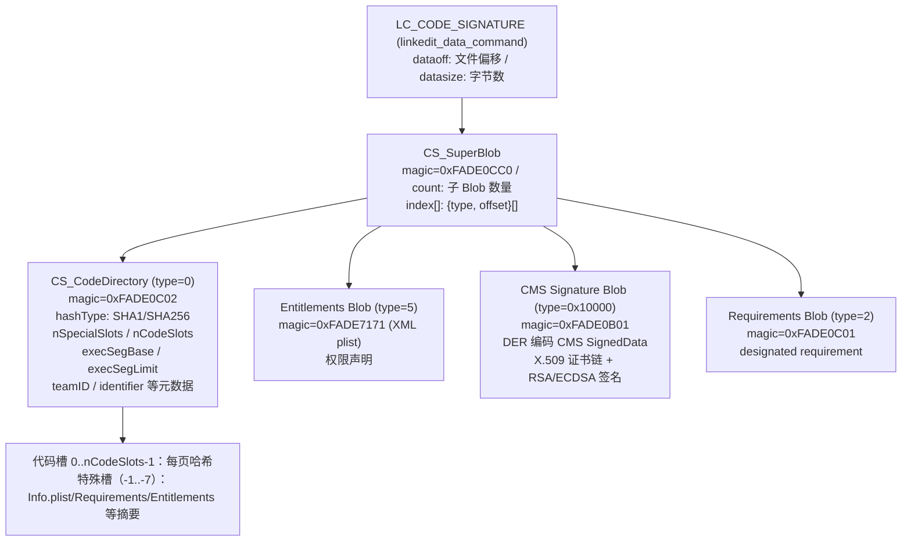
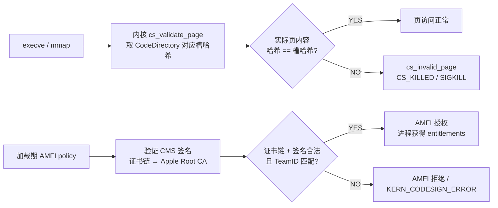

# 详解Mach-O(四十五)代码签名LC_CODE_SIGNATURE详解

> [!abstract] TL;DR
> **`LC_CODE_SIGNATURE`** 是 Mach-O 中指向代码签名数据块的加载命令，其数据结构是一棵以 **`CS_SuperBlob`** 为根的层级签名树：根下挂着 `CS_CodeDirectory`（页哈希槽列表 + 各种元数据摘要）、Entitlements Blob（权限声明）、`CMS_Signature_Blob`（X.509 证书链 + 密码学签名）等子 Blob。内核 + AMFI 在 **mmap 每一页** 时验证对应哈希槽，任何字节被篡改立即触发 `SIGKILL`；沙盒权限由 Entitlements 声明；FairPlay DRM 对加密段（`SG_PROTECTED_VERSION_1`）额外施加硬件级保护。逆向场景下，理解这套结构是**重签名 / adhoc 签名 / 去除限制** 的前提，也是绕过失败（崩溃 / 拒绝运行）时排查根因的关键。

## 概述与定位

### 为什么代码签名对逆向如此重要

iOS / macOS 的代码签名不是"一次性门票"，而是**运行期持续强制执行**的完整性保护：

- **加载时**：dyld 在 `map_images` 之后、首次访问任何页之前，通过 AMFI（Apple Mobile File Integrity）验证整个签名链；
- **运行时**：内核在每次 **page fault** 填入新页时，对该页的哈希进行验证——任何一个字节被改写，下次访问该页就 `SIGKILL`；
- **进程间**：SIP（System Integrity Protection）、TrustCache、App Store 审核全部依赖签名链。

不懂签名结构，就不懂为什么重签名后崩溃、为什么 entitlements 不生效、为什么某些调试选项只在越狱机上可用。

### 与本系列其他篇的关系

- [[44.dyld加载流程全景]]：dyld 加载每个镜像时触发 AMFI 验证，本篇是那个验证的底层机制；
- [[16.Mach-O __LINKEDIT]]：`LC_CODE_SIGNATURE` 的数据存在 `__LINKEDIT` 段内；
- [[11.Mach-O Segments]]：`SG_PROTECTED_VERSION_1` 是 segment flags，FairPlay 加密段的标志；
- [[09.Mach-O LC_MAIN]]：只有签名通过，内核才会把控制权交给 dyld，进而跳入 `LC_MAIN`。

---

## 结构图示

### LC_CODE_SIGNATURE → SuperBlob → 各子 Blob

> [!note]- Mermaid 源码
> ```text
> flowchart TD
>     LC["LC_CODE_SIGNATURE (linkedit_data_command)<br/>dataoff: 文件偏移<br/>datasize: 字节数"]
>     LC --> SB["CS_SuperBlob<br/>magic=0xFADE0CC0<br/>count: 子 Blob 数量<br/>index[]: {type, offset}[]"]
>     SB --> CD["CS_CodeDirectory (type=0)<br/>magic=0xFADE0C02<br/>hashType: SHA1/SHA256<br/>nSpecialSlots: 特殊槽数<br/>nCodeSlots: 页哈希槽数<br/>execSegBase / execSegLimit<br/>teamID, identifier 等元数据<br/>↓ 紧跟页哈希数组"]
>     SB --> ENT["Entitlements Blob (type=5)<br/>magic=0xFADE7171 (XML)<br/>或 0xFADE7172 (DER)<br/>plist 格式权限声明"]
>     SB --> CMS["CMS Signature Blob (type=0x10000)<br/>magic=0xFADE0B01<br/>DER 编码 CMS SignedData<br/>含 X.509 证书链 + RSA/ECDSA 签名"]
>     SB --> REQ["Requirements Blob (type=2)<br/>magic=0xFADE0C01<br/>designated requirement 表达式"]
>     SB --> ENT2["DER Entitlements (type=7)<br/>magic=0xFADE7172<br/>BER/DER 编码，iOS 15+ 额外补充"]
>     CD --> SLOT["特殊槽（负索引）：<br/>-1: CodeDirectory 摘要<br/>-2: Info.plist 摘要<br/>-3: Requirements 摘要<br/>-4: ResourceDir 摘要<br/>-5: Entitlements 摘要<br/>-7: DER Entitlements 摘要<br/>代码槽（0..nCodeSlots-1）：<br/>每 4KB (x86_64) / 16KB (arm64) 页哈希"]
> ```



### AMFI 验证流程（内核视角）

> [!note]- Mermaid 源码
> ```text
> flowchart LR
>     A["execve / mmap"] --> B["内核 cs_validate_page<br/>取 CodeDirectory 对应槽哈希"]
>     B --> C{"实际页内容<br/>哈希 == 槽哈希?"}
>     C -- "YES" --> D["页访问正常"]
>     C -- "NO" --> E["cs_invalid_page<br/>CS_KILLED / SIGKILL"]
>     A2["加载期：AMFI policy check"] --> F["读取 SuperBlob<br/>验证 CMS 签名（RSA/ECDSA）<br/>验证证书链 → Apple Root CA"]
>     F --> G{"证书链 + 签名<br/>均合法?"}
>     G -- "YES<br/>且 TeamID 匹配 Entitlements" --> H["AMFI 授权<br/>进程获得声明的 entitlements"]
>     G -- "NO<br/>或 TeamID 不匹配" --> I["AMFI 拒绝<br/>内核终止加载<br/>KERN_CODESIGN_ERROR"]
> ```



---

## 核心原理与字段详解

### 1. LC_CODE_SIGNATURE 命令本体

```c
// <mach-o/loader.h>
struct linkedit_data_command {
    uint32_t   cmd;        // LC_CODE_SIGNATURE = 0x1D
    uint32_t   cmdsize;    // 固定 16
    uint32_t   dataoff;    // 签名数据在文件中的偏移（落在 __LINKEDIT 内）
    uint32_t   datasize;   // 签名数据字节数
};
```

`cmd = 0x1D`，`cmdsize = 16`（固定），`dataoff`/`datasize` 共同指向 `__LINKEDIT` 内的代码签名块起点。该块的首 4 字节必须是 `CS_SuperBlob` 的 magic `0xFADE0CC0`（大端序，与 Mach-O 其余部分的小端序不同——代码签名数据块**全部大端**）。

> [!warning] 大端 vs 小端
> Mach-O 头部及加载命令是**小端序**（现代 Apple 平台）；`LC_CODE_SIGNATURE` 指向的 SuperBlob 及其所有子 Blob 是**大端序（网络序）**。解析时必须对每个字段做 `ntohl()`/`ntohs()` 转换，这是一个常见陷阱。

```bash
# 查看 LC_CODE_SIGNATURE 命令
otool -l MyApp.ipa/Payload/MyApp.app/MyApp | grep -A4 LC_CODE_SIGNATURE
```

示意输出：

```text
Load command N
           cmd LC_CODE_SIGNATURE
       cmdsize 16
       dataoff 2097152    ← 签名块起点（__LINKEDIT 内偏移）
      datasize 12288      ← 签名块总大小
```

### 2. CS_SuperBlob：签名树的根

`CS_SuperBlob` 是所有代码签名数据的容器，相当于一个小型"目录+数据"的合并结构：

```c
// <Security/SecCodeSigner.h> / <mach-o/dyld.h> 的内部结构（简化）
struct CS_BlobIndex {
    uint32_t type;    // 子 Blob 类型（大端）
    uint32_t offset;  // 子 Blob 起点相对 SuperBlob 起点的偏移（大端）
};

struct CS_SuperBlob {
    uint32_t       magic;       // 0xFADE0CC0（大端）
    uint32_t       length;      // 整个 SuperBlob 的字节数（大端）
    uint32_t       count;       // 子 Blob 数量（大端）
    CS_BlobIndex   index[];     // count 个索引项（紧跟其后）
    // 子 Blob 数据紧跟 index[] 之后，无固定顺序
};
```

常见子 Blob 类型：

| type 值 | 常量名 | 内容 |
|---|---|---|
| `0x00000000` | `CSSLOT_CODEDIRECTORY` | 主 CodeDirectory（必须有）|
| `0x00000001` | `CSSLOT_INFOSLOT` | Info.plist 摘要（较老格式）|
| `0x00000002` | `CSSLOT_REQUIREMENTS` | Designated Requirements |
| `0x00000003` | `CSSLOT_RESOURCEDIR` | 资源目录哈希（旧）|
| `0x00000004` | `CSSLOT_APPLICATION` | 应用程序特定 |
| `0x00000005` | `CSSLOT_ENTITLEMENTS` | Entitlements plist（XML）|
| `0x00000007` | `CSSLOT_DER_ENTITLEMENTS` | DER 编码 Entitlements（iOS 15+）|
| `0x00001000` | `CSSLOT_ALTERNATE_CODEDIRECTORIES` | 替代哈希算法的 CodeDirectory（如同时提供 SHA1 + SHA256）|
| `0x00010000` | `CSSLOT_SIGNATURESLOT` | CMS 签名 Blob（Apple CA 签名）|

### 3. CS_CodeDirectory：核心 —— 页哈希槽列表

`CS_CodeDirectory` 是代码签名的灵魂：它记录了**二进制文件每一页的哈希值**，内核在运行期用这些哈希逐页验证完整性。

```c
struct CS_CodeDirectory {
    uint32_t magic;          // 0xFADE0C02（大端）
    uint32_t length;         // 本结构总长度（大端）
    uint32_t version;        // 格式版本（大端）
                             // 0x20100 = 最初版本
                             // 0x20200 = 加入 scatterOffset
                             // 0x20300 = 加入 teamOffset
                             // 0x20400 = 加入 sparseData
                             // 0x20500 = 加入 codeLimit64 / execSeg*
    uint32_t flags;          // CS_FLAG_* 组合（大端）
    uint32_t hashOffset;     // 哈希槽数组起点（相对本结构起点，大端）
    uint32_t identOffset;    // identifier 字符串偏移（大端）
    uint32_t nSpecialSlots;  // 特殊槽数量（负索引槽，大端）
    uint32_t nCodeSlots;     // 代码槽数量 = ceil(代码字节数 / pageSize)（大端）
    uint32_t codeLimit;      // 受保护代码区末尾偏移（32位，大端）
    uint8_t  hashSize;       // 每个哈希值的字节数（SHA1=20, SHA256=32）
    uint8_t  hashType;       // 哈希算法（1=SHA1, 2=SHA256, 3=SHA256/Truncated）
    uint8_t  platform;       // 平台标识（iOS=1, macOS=2, ...）
    uint8_t  pageSize;       // log2(页大小)（12=4KB/x86_64, 14=16KB/arm64）
    uint32_t spare2;         // 保留（大端）
    /* version >= 0x20200 */
    uint32_t scatterOffset;
    /* version >= 0x20300 */
    uint32_t teamOffset;     // teamID 字符串偏移（大端）
    /* version >= 0x20500 */
    uint32_t spare3;
    uint64_t codeLimit64;    // codeLimit 的 64 位版本（大端）
    uint64_t execSegBase;    // 可执行段起点（文件偏移，大端）
    uint64_t execSegLimit;   // 可执行段长度（大端）
    uint64_t execSegFlags;   // CS_EXECSEG_* 标志（大端）
};
```

#### 哈希槽数组布局

`hashOffset` 指向哈希数组的起点。数组同时容纳**特殊槽**（负索引）和**代码槽**（非负索引）：

```
内存布局（相对 hashOffset）：

[-nSpecialSlots * hashSize] ← 特殊槽 #nSpecialSlots（最低地址）
[-（nSpecialSlots-1）* hashSize]
...
[-1 * hashSize] ← 特殊槽 #1（下标 -1，即 CodeDirectory 自身摘要）
[hashOffset]   ← hashOffset 处 = 代码槽 #0（文件第 0 页的哈希）
[hashOffset + hashSize]   ← 代码槽 #1
...
[hashOffset + (nCodeSlots-1)*hashSize] ← 代码槽 #(nCodeSlots-1)
```

**特殊槽含义**（索引为负，从 -1 到 -(nSpecialSlots)）：

| 槽索引 | CSSLOT 常量 | 内容 |
|---|---|---|
| -1 | `CSSLOT_CODEDIRECTORY` | CodeDirectory 自身的哈希 |
| -2 | `CSSLOT_INFOSLOT` | `Info.plist` 文件哈希 |
| -3 | `CSSLOT_REQUIREMENTS` | Requirements Blob 哈希 |
| -4 | `CSSLOT_RESOURCEDIR` | `_CodeSignature/CodeResources` 哈希 |
| -5 | `CSSLOT_APPLICATION` | 应用程序自定义（常为 0）|
| -6 | `CSSLOT_ENTITLEMENTS` | Entitlements Blob 哈希 |
| -7 | `CSSLOT_DER_ENTITLEMENTS` | DER Entitlements 哈希（iOS 15+）|

**代码槽 #N** 对应文件**第 N 页**（从文件偏移 `N * pageSize` 到 `(N+1) * pageSize - 1`）的原始字节的哈希值。`pageSize = 1 << CS_CodeDirectory.pageSize`（arm64 = 16384，x86_64 = 4096）。

#### CS_FLAG 重要标志

| 标志常量 | 值 | 含义 |
|---|---|---|
| `CS_VALID` | `0x0000001` | 签名有效（内核设置）|
| `CS_ADHOC` | `0x0000002` | adhoc 签名（无证书，仅哈希）|
| `CS_GET_TASK_ALLOW` | `0x0000004` | 允许调试器附加（开发证书默认有）|
| `CS_INSTALLER` | `0x0000008` | 安装器权限 |
| `CS_HARD` | `0x0000100` | 若签名失效立即 kill 进程 |
| `CS_KILL` | `0x0000200` | 进程被内核 kill（CS_HARD 触发后）|
| `CS_ENFORCEMENT` | `0x0001000` | 强制代码签名执行 |
| `CS_REQUIRE_LV` | `0x0002000` | 需要库验证 |
| `CS_ENTITLEMENTS_VALIDATED` | `0x0004000` | entitlements 已验证（AMFI 设置）|
| `CS_NVRAM_UNRESTRICTED` | `0x0008000` | NVRAM 写入无限制 |
| `CS_RUNTIME` | `0x0010000` | Hardened Runtime 开启 |
| `CS_LINKER_SIGNED` | `0x0020000` | 链接期自动签名（Xcode 15+ 本地构建）|
| `CS_EXEC_SET_HARD` | `0x0100000` | execve 后子进程也强制 HARD |
| `CS_EXEC_SET_KILL` | `0x0200000` | execve 后子进程也 KILL |
| `CS_EXEC_INHERIT_SIP` | `0x0400000` | execve 后子进程继承 SIP |

### 4. Entitlements Blob：权限声明

Entitlements（授权）是 Apple 沙盒与权限系统的核心：它声明一个进程**被允许做什么**，由 AMFI 在加载时读取并与证书声明对照。

```c
struct CS_GenericBlob {
    uint32_t magic;    // 0xFADE7171（XML plist）或 0xFADE7172（DER）
    uint32_t length;   // 含本头的总字节数
    // 紧跟 plist/DER 数据
};
```

XML Entitlements plist 示例：

```xml
<?xml version="1.0" encoding="UTF-8"?>
<!DOCTYPE plist PUBLIC "-//Apple//DTD PLIST 1.0//EN"
  "http://www.apple.com/DTDs/PropertyList-1.0.dtd">
<plist version="1.0">
<dict>
    <!-- 允许调试器附加（开发证书必须有，App Store 不允许）-->
    <key>com.apple.security.get-task-allow</key>
    <true/>

    <!-- 应用沙盒标识符 -->
    <key>com.apple.application-identifier</key>
    <string>TEAMID123.com.example.myapp</string>

    <!-- 推送通知（需 APNs entitlement）-->
    <key>aps-environment</key>
    <string>production</string>

    <!-- 钥匙串访问组 -->
    <key>keychain-access-groups</key>
    <array>
        <string>TEAMID123.com.example.myapp</string>
    </array>

    <!-- 文件访问（Hardened Runtime 下开放特定路径）-->
    <key>com.apple.security.files.user-selected.read-write</key>
    <true/>
</dict>
</plist>
```

**DER Entitlements**（iOS 15+ / macOS 12+ 新增，`type=7`，magic `0xFADE7172`）是同一内容的 BER/DER 二进制编码版本，由 AMFI 优先使用（更快解析，避免 XML 解析的安全隐患）。当二者都存在时，AMFI 以 DER 版本为准。

#### 逆向时提取 Entitlements

```bash
# 方法1：codesign 直接打印（最方便）
codesign -d --entitlements :- MyApp.app/MyApp 2>/dev/null

# 方法2：codesign 输出 XML 到文件
codesign -d --entitlements entitlements.plist MyApp.app/MyApp

# 方法3：ldid（越狱环境常用工具）
ldid -e MyApp.app/MyApp

# 方法4：jtool2（跨平台，支持 ipa 内的 arm64 二进制）
jtool2 --ent MyApp.app/MyApp

# 方法5：从 ipa 直接解析（unzip 后）
unzip -o MyApp.ipa -d /tmp/ipa_extract
codesign -d --entitlements :- /tmp/ipa_extract/Payload/MyApp.app/MyApp

# 方法6：二进制内搜索（快速确认是否含某 entitlement key）
strings MyApp | grep "get-task-allow"
```

### 5. CMS 签名 Blob：密码学签名

`CMS Signature Blob`（magic `0xFADE0B01`，type `0x10000`）包含一个完整的 CMS（Cryptographic Message Syntax，RFC 5652）`SignedData` 结构，DER 编码：

```
CMS SignedData {
    version                     → 1 (CMSv1)
    digestAlgorithms            → SHA-256（现代）或 SHA-1（旧）
    encapContentInfo            → 被签名内容 = CodeDirectory 的哈希（对 CD 摘要签名）
    certificates                → X.509 证书链：
                                  [0] 签名证书（开发者 / 发布者证书）
                                  [1] Apple Worldwide Developer Relations CA
                                  [2] Apple Root CA（可选，信任锚已在系统内置）
    signerInfos → [{
        version                 → 1
        sid                     → 签名者信息（颁发者 + 序列号）
        digestAlgorithm         → SHA-256
        signedAttrs             → [
            ContentType,
            MessageDigest,        ← CodeDirectory 的 SHA-256 摘要
            SigningTime,          ← 签名时间戳
            CMSTimestamp,         ← TSA 时间戳（App Store 签名有）
        ]
        signatureAlgorithm      → rsaEncryption（RSA-2048 或更强）
                                  或 ecdsaWithSHA256（ECC P-256）
        signature               → RSA/ECDSA 签名值（对 signedAttrs 哈希）
    }]
}
```

**验证流程简要**：

1. 内核 / AMFI 取出 CMS SignedData；
2. 验证证书链直到 Apple Root CA（系统信任锚）；
3. 验证签名者的 signedAttrs 中 `MessageDigest` = 当前 CodeDirectory 的哈希；
4. 用证书公钥验证 RSA/ECDSA 签名；
5. 检查证书中的 TeamID（OID `1.2.840.113635.100.6.2.1`）与 CodeDirectory 中的 teamOffset 字符串一致；
6. 如是 App Store 发布签名，还会核查 TSA 时间戳。

### 6. adhoc 签名：无证书的哈希绑定

**adhoc 签名**（`CS_ADHOC`，flags `0x2`）是一种特殊形式：**没有 CMS Blob、没有证书、没有私钥签名**，只有 CodeDirectory（含页哈希）。

adhoc 签名告诉系统："我的完整性由这些页哈希保证，但不保证身份"。

适用场景：
- **macOS 本地开发构建**（Xcode 15+ 的 `CS_LINKER_SIGNED` 模式，链接后自动 adhoc 签名，无需证书即可在本机运行）；
- **开源命令行工具分发**（Homebrew 安装的工具，不需要 Developer ID 即可运行，macOS Gatekeeper 对 adhoc 签名的 CLI 工具网开一面）；
- **越狱设备重签名**（jailbreak 下的 `ldid -S` 即生成 adhoc 签名）；
- **iOS 模拟器 Build**（模拟器二进制 adhoc 签名，不需要设备证书）。

```bash
# 生成 adhoc 签名（macOS codesign）
codesign --sign - --force --deep MyApp.app  # "-" 表示 adhoc

# 用 ldid 生成 adhoc 签名（越狱常用）
ldid -S MyBinary           # 不指定 entitlements，最简 adhoc
ldid -S MyEntitlements.xml MyBinary  # adhoc + entitlements

# 验证是否 adhoc
codesign -dvvv MyBinary 2>&1 | grep "Signature="
# 输出 Signature=adhoc 即为 adhoc 签名
```

### 7. FairPlay DRM：`SG_PROTECTED_VERSION_1`

FairPlay 是 Apple 的 DRM（数字版权管理）系统，用于保护从 App Store 下载的应用的代码段内容：

```c
// <mach-o/loader.h>
#define SG_PROTECTED_VERSION_1  0x8   // segment flags，标记 FairPlay 加密段
```

**加密范围**：带 `SG_PROTECTED_VERSION_1` 标志的 `LC_SEGMENT_64` 所描述的区域（通常是 `__TEXT` 段的部分内容或整体）在磁盘上是**加密状态**。

**解密流程**（高度简化）：

1. 用户从 App Store 下载时，服务器把 FairPlay 加密密钥（用设备专属密钥加密）嵌入 `iTunesMetadata.plist` 或与 ipa 绑定；
2. 设备加载 App 时，Secure Enclave / AES 硬件引擎持有设备专属根密钥，用于解密 FairPlay 密钥；
3. 内核在 mmap 加密段时通过 `APFS_DATA_PROTECTION` 或专用硬件通道实时解密，解密后的页才进入 CPU 缓存；
4. **应用程序进程本身永远看不到明文的 FairPlay 密钥**，只有 Secure Enclave 知道。

逆向视角：

```bash
# 检查是否含 FairPlay 加密段
otool -l MyApp | grep -A5 "flags.*0x"
# 若某段 flags 含 0x8（SG_PROTECTED_VERSION_1）→ FairPlay 加密

# 常见判断方式
otool -l MyApp | grep SG_PROTECTED
# 或用 MachOView 图形化查看段 flags
```

**脱壳（Decrypt）的原理**：FairPlay 保护的 App 在运行时，iOS 内核在 page fault 填页时会实时解密对应页放入内存。脱壳工具（如 `frida-ios-dump`、`bagbak`、`clutch`）的原理是**在 App 运行后从内存 dump 已解密的页**，再重新打包为无 FairPlay 保护的 ipa——本质是"内存取证"，而非真正解密密钥。

### 8. Requirements Blob：Designated Requirement

`Requirements Blob`（magic `0xFADE0C01`，type `0x2`）用一种专用的**要求表达式语言（Requirement Language）** 描述"什么签名才算合法运行本程序"：

```
# 示例：典型 macOS App 的 designated requirement
identifier "com.example.myapp"
  and anchor apple generic
  and certificate 1[field.1.2.840.113635.100.6.2.6] /* exists */
  and certificate leaf[field.1.2.840.113635.100.6.1.13] /* exists */
  and certificate leaf[subject.OU] = "TEAMID123"
```

含义：
- `identifier` = Bundle ID 必须匹配；
- `anchor apple generic` = 证书链根必须是 Apple 根 CA；
- 证书1（中间 CA）含 Developer Relations CA OID；
- leaf（签名证书）含 Developer ID Application OID；
- OU = 开发者 Team ID。

```bash
# 查看 designated requirement
codesign -d -r- MyApp.app 2>&1
# 输出格式：
# designated => identifier "com.example.myapp" and anchor apple generic ...
```

---

## 实操：codesign 命令全解

### 验证与查看

```bash
# 基础验证（通过则无输出，失败则打印错误）
codesign --verify MyApp.app

# 详细验证（-v 一次输出基本信息，-vvv 输出所有字段）
codesign -dvvv MyApp.app 2>&1
# 示例关键输出：
#   Identifier=com.example.myapp
#   TeamIdentifier=TEAMID123
#   Sealed Resources version=2 rules=13 files=127
#   Internal requirements count=1 size=184

# 查看 Entitlements（最常用）
codesign -d --entitlements :- MyApp.app 2>/dev/null
# :- 表示输出到 stdout，可重定向

# 查看 CodeDirectory 摘要信息
codesign -dvvv --verbose=5 MyApp.app 2>&1 | head -40

# 查看 Requirements
codesign -d -r- MyApp.app 2>&1
```

### 签名操作

```bash
# adhoc 签名（开发/越狱用）
codesign --sign - --force --deep MyApp.app

# 用 Developer ID 签名（发布到 Mac App Store 外）
codesign --sign "Developer ID Application: Your Name (TEAMID)" \
         --deep --force \
         --options runtime \      ← 开启 Hardened Runtime
         MyApp.app

# 签名时注入 Entitlements
codesign --sign "CERT_NAME" \
         --entitlements MyApp.entitlements \
         --force MyApp.app

# 重签名单个 dylib（逆向改完后需重签）
codesign --sign - --force --deep /path/to/Library.dylib

# 验证签名链完整性（包括资源文件）
codesign --verify --deep --strict MyApp.app
```

### 逆向常见操作

```bash
# 1. 从 App Store ipa 提取并检查签名（需先脱壳或在真机上）
unzip MyApp.ipa -d /tmp/app_extract
codesign -dvvv /tmp/app_extract/Payload/MyApp.app 2>&1

# 2. 检查是否为 App Store 签名（有 Apple 中间 CA）vs 开发签名
codesign -dvvv MyApp.app 2>&1 | grep -E "Authority|TeamIdentifier"

# 3. 查看页哈希算法（SHA1 旧 vs SHA256 新）
codesign -dvvv MyApp.app 2>&1 | grep "Hash "
# 输出如：Hash type=sha256 size=32

# 4. 检查 execSegFlags（含 CS_EXECSEG_MAIN_BINARY / CS_EXECSEG_ALLOW_UNSIGNED 等）
jtool2 --sig --verbose MyApp

# 5. 对比两个版本的签名差异（逆向找 patch 点）
codesign -d --entitlements ent_old.plist OldVersion/MyApp
codesign -d --entitlements ent_new.plist NewVersion/MyApp
diff ent_old.plist ent_new.plist
```

---

## AMFI 验证流程详解

AMFI（Apple Mobile File Integrity）是内核扩展（kext）+ 用户态守护进程 `amfid` 的组合，负责执行代码签名策略。

### 验证触发时机

1. **`execve`**：内核在 `mac_execve` Hook 里调用 AMFI 策略检查，验证失败直接拒绝执行（`EPERM`）；
2. **`mmap`**：对有代码签名保护的文件，每次 `mmap` 时内核检查文件的签名状态；
3. **Page Fault**：内核在 `vm_fault_enter` 中，对代码签名强制执行的进程，每次填入新页前调用 `cs_validate_page()` 验证该页哈希——这是**运行期持续验证**的实现机制；
4. **`dlopen`**：动态加载库时，AMFI 对每个新镜像重新执行验证链。

### 内核 cs_validate_page 流程

```c
// 伪代码（简化自 XNU vm/vm_fault.c）
bool cs_validate_page(vnode_t vp, vm_offset_t page_offset, const void *page_data) {
    cs_blobs_t *blobs = ubc_get_cs_blobs(vp);   // 取该文件的签名 blob
    if (!blobs) return !CS_ENFORCEMENT;           // 无签名 + 非强制 = 允许

    for each blob in blobs:
        CodeDirectory *cd = blob->cd;
        int slot = page_offset / (1 << cd->pageSize);
        if (slot >= cd->nCodeSlots) continue;

        uint8_t *expected_hash = cd_hash_at_slot(cd, slot);  // 取槽哈希
        uint8_t actual_hash[32];
        SHA256(page_data, page_size, actual_hash);             // 计算实际页哈希

        if (memcmp(expected_hash, actual_hash, cd->hashSize) == 0)
            return true;   // 哈希匹配，页合法

    cs_invalid_page(vp, page_offset);   // 哈希不匹配
    return false;   // → 进程被 SIGKILL（若 CS_KILL 设置）
}
```

### amfid：用户态策略守护进程

`amfid`（运行在 `launchd` 下，PID 较小）持有策略数据库和 TrustCache，负责：

- 查询 `TrustCache`（Apple 内置的已知良好签名哈希列表）；
- 与内核 AMFI kext 通过 Mach IPC 通信，返回"允许 / 拒绝 / 需要进一步验证"；
- 在越狱场景下，`amfid` 常被 patch（注入 `applocker-bypass` 等）以绕过签名检查，这是"越狱后签名验证失效"的根本原因。

### TrustCache：离线快速白名单

TrustCache 是一个哈希列表（每项 20 字节：`{cs_cdhash[20], flags}`），内置于固件 / OTA 更新包，由 Secure Boot 链信任：

- 系统自带二进制的 CDHash 在出厂时就进 TrustCache，无需网络验证；
- 第三方 App 安装时，App Store 服务器把 CDHash 加入设备的用户 TrustCache；
- 开发者证书签名的 App 不走 TrustCache，走完整 CMS 证书链验证。

---

## 逆向与重签名实践

### 重签名流程（iOS 越狱 / 真机调试）

重签名是逆向工程中最常见的操作，以下是在越狱设备或有自签证书场景下的完整流程：

```bash
# 前提：已有开发者证书 / 企业证书，或在越狱设备上使用 ldid

# 步骤1：从 ipa 解压
unzip MyApp.ipa -d /tmp/resign_workspace
APP=/tmp/resign_workspace/Payload/MyApp.app

# 步骤2：移除原签名（不强制，但有助于排查冲突）
rm -rf "$APP/_CodeSignature"

# 步骤3：修改 Entitlements（如需 get-task-allow 用于调试）
cat > /tmp/resign_entitlements.plist << EOF
<?xml version="1.0" encoding="UTF-8"?>
<!DOCTYPE plist PUBLIC "-//Apple//DTD PLIST 1.0//EN" "...">
<plist version="1.0"><dict>
    <key>com.apple.security.get-task-allow</key><true/>
    <key>com.apple.application-identifier</key>
    <string>YOUR_TEAMID.$(defaults read "$APP/Info.plist" CFBundleIdentifier)</string>
</dict></plist>
EOF

# 步骤4：对所有 Frameworks / Plugins 先签名（依赖先签）
for framework in "$APP"/Frameworks/*.framework; do
    codesign --sign "YOUR_CERT_NAME" --force --deep "$framework"
done

# 步骤5：对主 binary 签名（含 Entitlements）
codesign --sign "YOUR_CERT_NAME" \
         --entitlements /tmp/resign_entitlements.plist \
         --force "$APP/MyApp"

# 步骤6：对 App bundle 签名
codesign --sign "YOUR_CERT_NAME" \
         --entitlements /tmp/resign_entitlements.plist \
         --force "$APP"

# 步骤7：打包回 ipa（可选）
cd /tmp/resign_workspace
zip -r MyApp_resigned.ipa Payload/

# 步骤8：验证
codesign --verify --deep --strict "$APP"
```

> [!warning] 常见重签名失败原因
> 1. **Frameworks 顺序**：必须先签 Frameworks，后签主 binary / bundle，否则 `sealed resources` 哈希不一致；
> 2. **Bundle ID 不匹配**：Entitlements 里的 `com.apple.application-identifier` 必须含正确的 TeamID 前缀；
> 3. **Provisioning Profile**：真机非越狱部署必须有匹配的 `.mobileprovision` 文件，且设备 UDID 在 profile 内；
> 4. **`_CodeSignature/CodeResources` 未更新**：`codesign --deep` 会自动重算资源哈希，但手动操作时要确保它被重新生成。

### 用 jtool2 深度分析签名结构

```bash
# 打印完整 SuperBlob 结构
jtool2 --sig --verbose MyApp

# 输出示例（示意）：
# Code Signature (2 blobs, 12288 bytes)
#   Blob 0 (CodeDirectory, version 0x20500):
#     Hash type: SHA-256 (32 bytes)
#     Platform: 0 (none)
#     nSpecialSlots: 7, nCodeSlots: 512
#     Identifier: com.example.myapp
#     TeamID: TEAMID123
#     Executable Segment: base=0, limit=16384, flags=0x1 (main binary)
#   Blob 1 (Entitlements):
#     ... (XML plist content)
#   Blob 2 (CMS Blob): 4096 bytes (contains Apple cert chain)

# 打印 CDHash（ContentDirectory 的 SHA-256 摘要，用于 TrustCache 查询）
jtool2 --sig MyApp | grep "CDHash"
```

### 分析 CS_CodeDirectory 的页哈希（Python 示例）

```python
import struct, hashlib

def parse_code_directory(data: bytes, offset: int):
    """解析 CS_CodeDirectory，所有字段大端序"""
    magic, length, version, flags = struct.unpack_from('>IIII', data, offset)
    assert magic == 0xFADE0C02, f"Bad CD magic: {magic:#010x}"

    hash_offset, ident_offset = struct.unpack_from('>II', data, offset + 16)
    n_special, n_code = struct.unpack_from('>II', data, offset + 24)
    code_limit = struct.unpack_from('>I', data, offset + 32)[0]
    hash_size, hash_type, platform, page_size_log2 = \
        struct.unpack_from('BBBB', data, offset + 36)

    page_size = 1 << page_size_log2
    hash_arr_start = offset + hash_offset  # 相对文件起点

    print(f"  CD version: {version:#x}, flags: {flags:#010x}")
    print(f"  HashType: {'SHA256' if hash_type == 2 else 'SHA1'}, hashSize={hash_size}")
    print(f"  pageSize: {page_size} bytes")
    print(f"  nSpecialSlots={n_special}, nCodeSlots={n_code}")
    print(f"  codeLimit={code_limit:#x}")

    # 读取前几个代码槽（文件第 0~2 页的哈希）
    for i in range(min(3, n_code)):
        slot_off = hash_arr_start + (n_special + i) * hash_size
        slot_hash = data[slot_off: slot_off + hash_size]
        # 对应文件偏移 0（注意：从文件头开始，非段内偏移）
        file_page = data[i * page_size: (i + 1) * page_size]
        expected = hashlib.sha256(file_page).digest() if hash_type == 2 \
                   else hashlib.sha1(file_page).digest()
        match = "✓" if slot_hash == expected else "✗ MISMATCH"
        print(f"  Slot #{i}: {slot_hash.hex()} {match}")

# 使用
with open("/path/to/binary", "rb") as f:
    binary = f.read()
# 先定位 LC_CODE_SIGNATURE 的 dataoff...（解析 Mach-O 头部略）
# parse_code_directory(binary, superblob_offset + blob_offset_of_CD)
```

---

## 安全性与正确使用

### 代码签名不能做什么

代码签名保护的是**完整性（Integrity）**——"这个文件没被改过"——而**不是**：

- **机密性**：代码签名不加密代码（FairPlay 才加密，且是单独机制）；
- **混淆**：签名不防止逆向；任何运行在 CPU 上的代码，最终都能被反汇编；
- **防内存 dump**：进程运行时内存中的已解密代码，可以被有 `task_for_pid` 权限的工具 dump；
- **防 Method Swizzle / dlopen hook**：签名只验证页完整性，运行期 ObjC 方法交换等不修改文件，签名无能为力。

### 攻击者视角的利用点

1. **CDHash 碰撞（理论）**：如果能找到与合法文件哈希相同但内容不同的字节序列，可绕过哈希验证。SHA-256 当前无实际碰撞风险。

2. **amfid Patch（越狱环境）**：越狱 exploit 链通常包含对 `amfid` 的 hook，让其对所有 CDHash 返回"通过"，从而加载任意未签名代码。`checkm8` / `palera1n` 等 bootrom 漏洞利用后通过 `kpf`（kernel patchfinder）修改内核的 AMFI 策略位，让签名检查直接被绕过。

3. **Entitlements 越权**：开发者若在 Entitlements 中声明了超出 Profile 允许范围的权限，AMFI 会截断（Entitlements 以 Profile 中声明的为上界）。但若 Profile 被伪造或设备未开启 CS_ENFORCEMENT，则 Entitlements 可任意声明。

4. **重签名绕过**（macOS Gatekeeper 绕过历史漏洞）：历史上有过"修改 bundle 内 non-code 资源绕过 Gatekeeper"的漏洞，因为某些版本的 Gatekeeper 仅验证 CodeDirectory 而不验证 `_CodeSignature/CodeResources`，或对某些文件类型存在豁免。Apple 已持续修复此类问题。

### 正确使用建议（开发者）

- **始终启用 Hardened Runtime**（`--options runtime`），防止 dylib 注入；
- **最小化 Entitlements**：只声明 App 真正需要的权限，Entitlements 越少攻击面越小；
- **验证 `get-task-allow` 在发布版中关闭**：测试版和发布版应使用不同签名配置；
- **不要把私钥嵌入二进制**：代码签名私钥应只存在于安全的 Keychain 或 CI 环境变量中，绝不提交到代码仓库。

---

## 与相邻章节的关系

- [[44.dyld加载流程全景]]：dyld 加载每个镜像时调用 AMFI，本篇是那个验证的底层数据结构；
- [[16.Mach-O __LINKEDIT]]：`LC_CODE_SIGNATURE` 的数据在 `__LINKEDIT` 段，与符号表、bind 信息同住；
- [[15.Mach-O __DATA_CONST]]：bind 后被保护的段，与代码签名共同构成运行期完整性保护；
- [[11.Mach-O Segments]]：`SG_PROTECTED_VERSION_1` 是 segment flags，FairPlay 加密标志；
- [[03.Mach-O加载命令]]：`LC_CODE_SIGNATURE = 0x1D`，是 `linkedit_data_command` 的实例之一。

---

## 小结

- **`LC_CODE_SIGNATURE`** 是一个 `linkedit_data_command`（16 字节，cmd=0x1D），通过 `dataoff`/`datasize` 指向 `__LINKEDIT` 内的签名数据块。
- **`CS_SuperBlob`**（magic `0xFADE0CC0`，大端）是签名树的根，通过索引数组组织多个子 Blob；**`CS_CodeDirectory`**（magic `0xFADE0C02`）是核心，记录每一页的 SHA-1/SHA-256 哈希（代码槽）及元数据摘要（特殊槽），供内核在每次 page fault 时逐页验证完整性。
- **Entitlements Blob**（magic `0xFADE7171` XML / `0xFADE7172` DER）声明进程权限，由 AMFI 在加载时读取；`codesign -d --entitlements :-` 是最快的提取命令。
- **CMS 签名 Blob**（magic `0xFADE0B01`）包含 DER 编码的 CMS SignedData，含 X.509 证书链和 RSA/ECDSA 签名，将 CodeDirectory 摘要与 Apple CA 绑定；**adhoc 签名**（`CS_ADHOC`）无此 Blob，仅凭哈希槽提供完整性保证。
- **FairPlay**（`SG_PROTECTED_VERSION_1`）对 App Store App 的代码段进行硬件级加密，通过 Secure Enclave 实时解密，脱壳工具本质是内存 dump 已解密页。
- **AMFI** = 内核 kext + `amfid` 守护进程，分两阶段验证：加载期验证证书链，运行期（page fault）逐页验证哈希；越狱通过 patch `amfid` 或修改内核 AMFI 策略位绕过。
- **逆向必会命令**：`codesign -dvvv`（查看所有签名元数据）、`codesign -d --entitlements :-`（提取权限）、`jtool2 --sig --verbose`（深度分析 SuperBlob 结构）、`ldid -S`（越狱设备 adhoc 签名）。

---

[[00.Mach-O文件详解总览|⬆ 系列总览]] | [[44.dyld加载流程全景|← 上一篇]] | [[46.dyld_shared_cache机制|→ 下一篇]]
