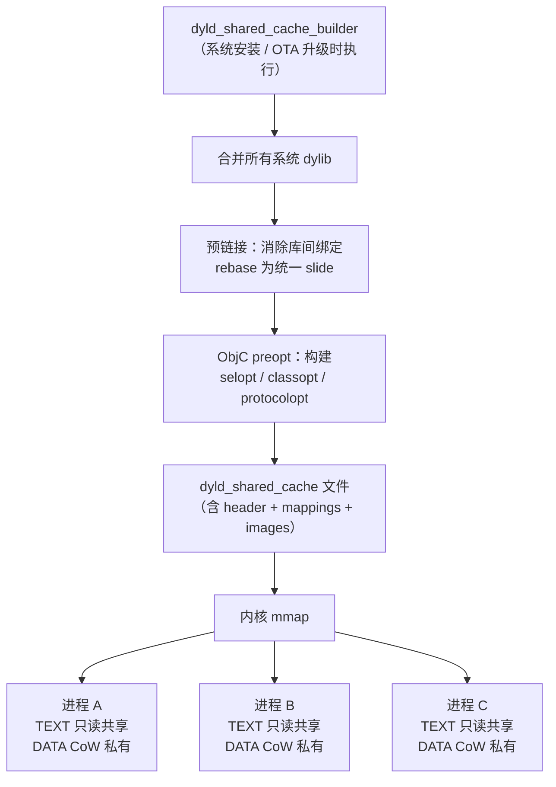

# 详解Mach-O(四十六)dyld_shared_cache机制

> [!abstract] TL;DR
> **dyld shared cache（DSC）是 Apple 将系统全部动态库预链接到单一大文件的优化手段**，在 macOS/iOS 启动时由内核直接映射入每个进程的地址空间，彻底省去逐个加载 dylib 的成本。其内部由 `dyld_cache_header` 描述三张核心映射区（`__TEXT` 只读可执行、`__DATA` 可写、`__LINKEDIT`），并维护一张 `dyld_cache_image_info` 表索引各 dylib 的入口。理解 DSC 不仅是性能调优的基础，更是**逆向系统框架的第一道门**——提取 DSC 中的 dylib，才能对 Foundation、UIKit、libSystem 等做静态分析。本篇从 Mach-O 格式视角深挖 DSC 结构，与 `[[36.Objective-C与iOS运行时/16.dyld_shared_cache与系统框架逆向]]` 的 iOS 逆向视角形成互补。

## 概述与背景动机

### 为什么需要 dyld shared cache

早期 iOS/macOS 的动态链接过程十分昂贵。以 iOS 系统为例，UIKit、Foundation、CoreFoundation、libSystem 等数百个系统 dylib 在每个进程启动时都需要：

1. **单独映射**：每个 dylib 独立从文件系统映射，内核维护大量 `vm_map` 条目，TLB 负担极重。
2. **独立符号绑定**：对每个 dylib 执行 rebase（ASLR 随机化后修补内部指针）、bind（跨库符号绑定），涉及大量脏页写操作，阻止页共享。
3. **库间指针失效**：各库的 `__DATA` 段因 ASLR slide 不同，相互之间的指针在加载期全部要重新计算。

**系统库的核心特征**是：它们被所有进程共享、版本固定（系统升级才更新）、内容在运行期几乎不变。这让"预先做好一次链接、所有进程共享同一份内存"成为可行且高收益的优化。

dyld shared cache 正是这个思路的实现：在系统安装 / 升级时由 `dyld_shared_cache_builder`（以前叫 `update_dyld_shared_cache`）将所有系统 dylib **预链接（pre-link）** 合并成单一的缓存文件，之后 dyld 在进程启动时直接把这个文件的各段映射进来，跳过逐个加载的全部开销。

### 动机总结与实测收益

| 瓶颈 | 原始 dylib 加载 | DSC 方案 |
|---|---|---|
| 映射次数 | N × dylib 次（iOS 可达 300+）| 1 次 mmap 涵盖所有库 |
| rebase 开销 | 每个指针写一次脏页 | 预链接后内部指针已固定，DSC 映射时 slide 统一 |
| 页共享 | 各进程 TEXT 独立映射（ASLR slide 不同）| 所有进程 TEXT 共享同一物理页 |
| 符号解析缓存 | 运行期 hash 查找 | 提前构建 ObjC preopt / selector table |
| 启动时间（Apple 内部数据）| 基线 | 减少约 40%（iOS 13 报告）|

## DSC 文件位置与版本演变

### 文件路径

| 平台 / 版本 | 路径 |
|---|---|
| macOS（Intel，10.x）| `/var/db/dyld/dyld_shared_cache_x86_64` |
| macOS（Apple Silicon，11+）| `/System/Volumes/Preboot/Cryptexes/OS/System/Library/dyld/dyld_shared_cache_arm64e` 及 `/private/var/db/dyld/dyld_shared_cache_arm64e` |
| iOS（越狱设备 / IPSW 提取）| `/System/Library/Caches/com.apple.dyld/dyld_shared_cache_arm64` |
| iOS 16+ / macOS 13+（多文件）| 同目录下拆分为 `.1`、`.2`…子文件（见下文） |

### 多文件拆分（iOS 16+ / macOS 13+）

从 iOS 16 / macOS 13 起，Apple 将 DSC **拆分为多个子文件**（`dyld_shared_cache_arm64e`、`dyld_shared_cache_arm64e.1`、`dyld_shared_cache_arm64e.2`……），原因有三：

1. **文件系统 2GB/4GB 限制**：FAT32 / 某些 APFS 分区的单文件大小上限，拆分可绕过。
2. **差量 OTA 更新**：只替换变化最大的子文件，减少 OTA 包体积。
3. **Cryptex 分离**：`OS Cryptex`（操作系统加密扩展）与 `App Cryptex` 分属不同子文件，便于独立更新。

在使用提取工具时，需**将所有子文件一并提供**，工具会自动处理跨文件的符号引用。

## DSC 二进制结构详解

### 整体布局

```
┌────────────────────────────────────────────┐  offset 0
│         dyld_cache_header                  │  固定大小头部，含版本、magic、映射表偏移等
├────────────────────────────────────────────┤
│    dyld_cache_mapping_info[]               │  各段（TEXT/DATA/LINKEDIT）的映射描述
├────────────────────────────────────────────┤
│    dyld_cache_image_info[]                 │  各 dylib 的地址、路径偏移、mtime 等
├────────────────────────────────────────────┤
│    symbol table / slide info / …           │  动态链接器辅助数据
├────────────────────────────────────────────┤
│  ┌──────────────────────────────────────┐  │
│  │  __TEXT 合并区                        │  │  所有 dylib 的 __TEXT 段紧密打包
│  │  （只读 + 可执行，r-x）               │  │
│  ├──────────────────────────────────────┤  │
│  │  __DATA 合并区                        │  │  所有 dylib 的 __DATA / __DATA_CONST
│  │  （可读写，rw-）                      │  │  在此分配，每进程 CoW
│  ├──────────────────────────────────────┤  │
│  │  __LINKEDIT 合并区                    │  │  所有符号表、字符串表已去重合并
│  │  （只读，r--）                        │  │
│  └──────────────────────────────────────┘  │
└────────────────────────────────────────────┘
```

### `dyld_cache_header` 关键字段

以下结构来自 Apple 开源的 `dyld` 源码（`dyld/include/mach-o/dyld_cache_format.h`），简化展示核心字段：

```c
struct dyld_cache_header {
    char     magic[16];              // "dyld_v1   arm64" 等版本魔数
    uint32_t mappingOffset;          // dyld_cache_mapping_info 数组的文件偏移
    uint32_t mappingCount;           // 映射区数量（通常 3 个：TEXT/DATA/LINKEDIT）
    uint32_t imagesOffsetOld;        // dyld_cache_image_info 数组的文件偏移（旧格式）
    uint32_t imagesCountOld;         // image 数量（旧格式）
    uint64_t dyldBaseAddress;        // dyld 期望的基地址（用于计算各 dylib 的 slide）
    uint64_t codeSignatureOffset;    // 代码签名块偏移
    uint64_t codeSignatureSize;      // 代码签名块大小
    uint64_t slideInfoOffsetUnused;  // 旧版 slide info 偏移（新格式已废弃）
    uint64_t slideInfoSizeUnused;    // 旧版 slide info 大小
    uint64_t localSymbolsOffset;     // 本地符号表偏移（已被单独 symbols 文件替代）
    uint64_t localSymbolsSize;
    uint8_t  uuid[16];              // DSC 的唯一 UUID
    uint64_t cacheType;             // 0=开发版，1=发布版
    uint32_t branchPoolsOffset;     // arm64e branch island 池的偏移
    uint32_t branchPoolsCount;
    uint64_t accelerateInfoAddr;    // 加速结构（旧；新格式用 preoptimized info）
    uint64_t accelerateInfoSize;
    uint64_t imagesTextOffset;      // __TEXT 区内 image 信息的偏移
    uint64_t imagesTextCount;
    uint64_t patchInfoAddr;         // patch table（dylib 热补丁信息）
    uint64_t patchInfoSize;
    uint64_t otherImageGroupAddrUnused;
    uint64_t otherImageGroupSizeUnused;
    uint64_t progClosuresAddr;      // 程序闭包缓存（启动配置预计算）
    uint64_t progClosuresSize;
    uint64_t progClosuresTrieAddr;  // trie 树索引
    uint64_t progClosuresTrieSize;
    uint32_t platform;              // Apple 平台枚举（macOS=1, iOS=2, ...）
    uint32_t dyldVersion;           // dyld 格式版本
    // iOS 16+ 追加字段：subCachesArrayOffset / subCachesArrayCount 等
    ...
};
```

> [!note] magic 字符串规律
> `magic[16]` 形如 `"dyld_v1   arm64"` 或 `"dyld_v1  arm64e"`，最后几位标识 CPU 架构；iOS 真机为 `arm64` 或 `arm64e`（带指针认证），模拟器为 `x86_64`。

### `dyld_cache_mapping_info` —— 段映射描述

每个映射区对应一个 `dyld_cache_mapping_info`，描述该段在文件中的偏移和在虚拟地址空间的位置：

```c
struct dyld_cache_mapping_info {
    uint64_t address;    // 段加载到进程虚拟地址空间的目标地址
    uint64_t size;       // 段大小（字节）
    uint64_t fileOffset; // 段数据在 DSC 文件内的偏移
    uint32_t maxProt;    // VM 权限上限（VM_PROT_READ=1, VM_PROT_WRITE=2, VM_PROT_EXECUTE=4）
    uint32_t initProt;   // VM 权限初始值（同上）
};
```

标准三个映射区的权限分布：

| 映射区 | maxProt | initProt | 含义 |
|---|---|---|---|
| `__TEXT` | `r-x` (5) | `r-x` (5) | 代码与只读数据，所有进程物理页共享 |
| `__DATA` | `rw-` (3) | `rw-` (3) | 可写数据，CoW 后各进程私有 |
| `__LINKEDIT` | `r--` (1) | `r--` (1) | 符号/字符串/绑定信息，只读 |

### `dyld_cache_image_info` —— 镜像索引

```c
struct dyld_cache_image_info {
    uint64_t address;          // dylib 的 Mach-O 头在 DSC __TEXT 区的虚拟地址
    uint64_t modTime;          // 文件修改时间（mtime），用于验证缓存有效性
    uint64_t inode;            // 文件 inode（同上）
    uint32_t pathFileOffset;   // dylib 路径字符串在 DSC 文件内的偏移
    uint32_t pad;
};
```

通过 `address` 字段可直接定位每个 dylib 的 Mach-O 头，再按普通 Mach-O 格式解析其加载命令、段、节。

## 核心机制：LINKEDIT 合并与去重

### 为什么要合并 LINKEDIT

在正常 Mach-O 中，每个 dylib 各有一个独立的 `__LINKEDIT` 段，包含：

- **符号表**（`nlist_64[]`）：函数、变量的名称与地址
- **字符串表**：所有符号名的 C 字符串
- **绑定信息**：`LC_DYLD_INFO_ONLY` 中的 bind/lazy bind/rebase opcode 流
- **代码签名**：`LC_CODE_SIGNATURE` 指向的签名 blob

当数百个 dylib 合并入 DSC 时，若保留各自独立 LINKEDIT，**同一个字符串可能出现成百上千次**（例如 `_objc_msgSend` 被几乎所有 Cocoa 库引用）。DSC builder 在构建阶段做了深度去重：

1. **字符串去重**：所有 dylib 的符号字符串合并到全局字符串池，相同字符串只保留一份。
2. **符号表合并**：所有 `nlist_64` 统一入全局符号表，路径由各 image 的符号范围描述符索引。
3. **绑定 opcode 消除**：库间绑定在 DSC 构建时已经"执行"，无需运行期重复绑定，相关 opcode 被移除。
4. **本地符号分离**：为减少加载时内存映射的符号表大小，私有（非导出）符号被移出主 DSC，存入单独的 `.symbols` 文件（iOS 16+ 常见）。

> [!warning] 提取 dylib 后 LINKEDIT 可能残缺
> 由于上述合并，从 DSC 中直接 dump 出来的 dylib 的 `__LINKEDIT` 已被"打散"——符号表偏移、字符串表偏移指向的是全局合并区的某段，**单独拿出来后偏移全部失效**。`dsc_extractor` 等工具的核心工作之一就是重建这些偏移，确保提取出的 dylib 是可独立分析的。

## ObjC Preopt Cache：启动优化的核心

DSC 的另一大价值是预先计算 Objective-C 运行时的各类数据结构，避免在每次进程启动时重新扫描和构建。

### Selector 预优化（`__objc_selopt`）

ObjC 的 selector 机制要求**全局唯一**——`objc_registerName("setFrame:")` 在整个进程中只应有一个 `SEL` 指针。正常情况下，dyld 在 `map_images` 阶段会扫描每个 dylib 的 `__objc_selrefs` 节，把字符串池化/去重。

DSC preopt 在构建时提前完成了全局 selector 去重，将所有系统 dylib 的 selector 放入 `__objc_selopt` 哈希表（一个 perfect hash 结构）。进程启动时，`libobjc` 直接使用这张预建表，省去运行期扫描。

### Protocol / Class 预优化

类似地，DSC 中包含 `__objc_classopt`（类名到 `Class` 指针的哈希表）和 `__objc_protocolopt`（协议名到 `Protocol *` 的哈希表），均为**完美哈希**结构，O(1) 查找无碰撞。

### 类关系预链接

`class_ro_t` 中的 `superclass` 指针和 `baseMethods` 在 DSC 构建时已指向最终地址，不再需要 dyld 的 rebase 修补（因为所有库共同 slide），大幅减少启动时的写操作。

```
图示：ObjC Preopt 在 DSC 中的位置

DSC __TEXT 区
├── lib1.dylib __TEXT
│   ├── __text（机器码）
│   ├── __objc_methname（方法名字符串原始数据）
│   └── ...
├── lib2.dylib __TEXT
│   └── ...
├── [合并区] __objc_selopt    ← 全局 selector perfect hash 表
├── [合并区] __objc_classopt  ← 全局类名 perfect hash 表
└── [合并区] __objc_protocolopt
```

详细的 ObjC 运行时元数据结构（`class_ro_t`/`class_rw_t`/`map_images` 调用链）见 `[[47.ObjC运行时元数据架构总览]]`，本篇聚焦 DSC 侧的预优化机制。

## 结构图示



## 提取 DSC 中的 dylib

### 工具一：Apple 官方 `dsc_extractor`

Apple 在 `dyld` 开源项目中附带了 `dsc_extractor`，可将 DSC 中的所有 dylib 提取到指定目录：

```bash
# macOS 上编译（需 Xcode Command Line Tools）
git clone https://github.com/apple-oss-distributions/dyld.git
cd dyld
# dsc_extractor 在 dyld/launch-cache/ 目录下
# 编译后直接运行：
./dsc_extractor /path/to/dyld_shared_cache_arm64 /tmp/extracted/

# 或使用系统自带（macOS 12+ 的路径）：
/System/Library/PrivateFrameworks/CoreFP.framework/Versions/A/Resources/dsc_extractor \
    /var/db/dyld/dyld_shared_cache_x86_64h /tmp/dylibs/
```

提取后每个 dylib 会在 `/tmp/extracted/` 下恢复其原始路径（如 `/usr/lib/libobjc.A.dylib`）。

### 工具二：dyldextractor（Python，支持 iOS）

对于 iOS 的 DSC（从 IPSW 解压获取），更常用的是第三方工具 [dyldextractor](https://github.com/arandomdev/DyldExtractor)：

```bash
pip install dyldextractor

# 列出 DSC 中所有 dylib
dyldex list /path/to/dyld_shared_cache_arm64

# 提取单个 dylib
dyldex -e /System/Library/Frameworks/UIKit.framework/UIKit \
    /path/to/dyld_shared_cache_arm64 ./output/

# 提取全部（耗时较长）
dyldex_all /path/to/dyld_shared_cache_arm64 ./output/
```

> [!note] dyldextractor 的修复工作
> dyldextractor 在提取时会执行以下修复，使输出 dylib 可独立分析：
> 1. **重建 `__LINKEDIT`**：根据全局合并区的偏移量，重新计算各节在独立 dylib 内的偏移。
> 2. **修复加载命令**：更新 `LC_SYMTAB`、`LC_DYSYMTAB` 指向重建后的符号/字符串表。
> 3. **恢复 stub**：部分 stub 函数在 DSC 中被合并/优化，提取时需将其还原为标准桩代码形式。

### 工具三：ipsw（Go 语言，多功能）

```bash
# 安装 ipsw
brew install blacktop/tap/ipsw

# 提取单个 dylib
ipsw dsc extract --dylib UIKit /path/to/dyld_shared_cache_arm64

# 查看 DSC 信息
ipsw dsc info /path/to/dyld_shared_cache_arm64

# 列出所有 images
ipsw dsc list /path/to/dyld_shared_cache_arm64
```

### 从 IPSW 获取 DSC（iOS 设备无需越狱）

```bash
# IPSW 是标准 ZIP 格式
unzip iPhone15,2_16.0_20A362_Restore.ipsw -d ipsw_content/

# 找到包含 DSC 的 DMG（通常是最大的那个）
ls -lh ipsw_content/*.dmg

# macOS 直接挂载 DMG（hdiutil）
hdiutil attach ipsw_content/098-XXXXX.dmg -mountpoint /tmp/ios_fs

# DSC 路径
ls /tmp/ios_fs/System/Library/Caches/com.apple.dyld/
```

## 逆向系统框架：从 DSC 到静态分析

### 实战流程

1. **获取 DSC**：越狱设备直接读取 `/System/Library/Caches/com.apple.dyld/`；非越狱设备从 IPSW 提取（见上文）。
2. **提取目标 dylib**：使用 dyldextractor / ipsw 提取，例如 UIKit、Foundation。
3. **静态分析**：
   - **class-dump**：生成所有类的头文件，还原 ObjC 接口（对于无 Swift 的旧版 dylib 尤佳）。
   - **Hopper / IDA / Binary Ninja**：反汇编 + 伪代码生成。
   - **frida-trace**：动态 hook（无需提取，直接 attach）。

```bash
# class-dump 提取 UIKit 头文件
class-dump -H /tmp/extracted/System/Library/Frameworks/UIKit.framework/UIKit \
    -o /tmp/UIKit_headers/

# 查看 UIKit 的导出符号
nm /tmp/extracted/System/Library/Frameworks/UIKit.framework/UIKit | grep " T " | head -20

# otool 查看 dylib 的加载命令（提取后）
otool -l /tmp/extracted/System/Library/Frameworks/Foundation.framework/Foundation | head -60
```

### DSC 直接分析（不提取）

部分工具支持直接在 DSC 上操作，无需提取：

```bash
# frida 直接 attach 到运行中的进程（系统库已映射）
frida -p $(pgrep SpringBoard)

# ipsw 直接在 DSC 上搜索符号
ipsw dsc sym /path/to/dyld_shared_cache_arm64 _UIApplicationMain

# lldb attach 到运行进程，所有系统库符号直接可用
lldb -p $(pgrep Springboard)
(lldb) image list | grep UIKit
```

### 注意：DSC 地址与实际映射地址

DSC 中记录的 `dyld_cache_image_info.address` 是**基于 DSC 构建时的基地址**（`header.dyldBaseAddress`）的预设虚拟地址。运行时，内核将整个 DSC 以某个随机 slide 映射进进程（与常规 ASLR 类似，但所有进程的 DSC slide 在同一次 boot 内相同）。

```
实际运行时地址 = DSC 中的 image address + DSC slide（同一 boot 内所有进程共用同一 slide）
```

这意味着**可以用 vmmap 或 lldb `image list` 获取 DSC slide**，再换算出所有系统符号的运行地址。

## iOS 16+ 多文件 DSC 的拆分细节

iOS 16 起，DSC 被拆分为以下子文件类型：

| 子文件 | 内容 |
|---|---|
| `dyld_shared_cache_arm64e`（主文件）| header + image list + 主要系统库 TEXT/DATA |
| `dyld_shared_cache_arm64e.1` | 追加的 TEXT/DATA 映射（overflow）|
| `dyld_shared_cache_arm64e.symbols` | 所有 image 的本地符号（私有函数，调试用）|
| `dyld_shared_cache_arm64e.rosetta` | Apple Silicon Mac 上运行 x86_64 代码的 Rosetta 翻译层 DSC |

多文件结构在 `dyld_cache_header` 中通过 `subCachesArrayOffset`/`subCachesArrayCount` 字段描述，每个子文件有独立的 UUID，主文件负责统一索引。

提取工具使用时，需将所有子文件置于同一目录，工具会自动扫描并组合：

```bash
ls dyld_cache/
# dyld_shared_cache_arm64e
# dyld_shared_cache_arm64e.1
# dyld_shared_cache_arm64e.symbols

dyldex_all dyld_cache/dyld_shared_cache_arm64e ./output/
# 工具自动识别并加载 .1 和 .symbols 子文件
```

## 安全性与正确使用

### 安全价值：DSC 作为攻击面

DSC 是所有进程共享的核心组件，一旦 DSC 中的系统 dylib 存在漏洞，所有使用该库的进程都可能受影响。以下是几类与 DSC 相关的安全场景：

1. **DSC 投毒（缓存替换）**：在越狱环境下，攻击者若能替换 DSC 文件，可在所有进程注入恶意代码。Apple 通过**代码签名验证**（`LC_CODE_SIGNATURE` 块覆盖整个 DSC，启动时内核验证）和 **SIP（System Integrity Protection）** 保护 DSC 文件不被非特权用户修改。
2. **DSC slide 信息泄露**：DSC slide 在同一 boot 内所有进程共享，若某个进程存在信息泄露漏洞（如格式字符串漏洞泄露函数地址），攻击者可由此推算出所有系统符号的实际运行地址，从而辅助 ROP 链构造。
3. **Patch table 滥用**：DSC 中的 `patchInfo`（热补丁表）机制允许 dyld 在运行时替换某些函数实现；研究者曾发现通过篡改 patch table 可实现持久化 hook（越狱工具常用）。

### 正确使用原则

- **逆向用途仅限安全研究与授权测试**：提取系统 dylib 进行静态分析属合理安全研究行为；将提取的库重新打包发布或用于绕过版权保护则违反 Apple 许可协议。
- **不在生产环境依赖 DSC 内部结构**：`dyld_cache_header` 等结构未列入公共 API，Apple 可在任意系统更新中更改，不应用于生产代码。
- **提取操作在本机执行**：从自己的 iPhone（已激活）或官方 IPSW 提取，不从第三方来源获取 DSC 文件，防止加载已被篡改的缓存。

## 与相邻章节的关系

- `[[36.Mach-O __objc_classlist节]]`、`[[35.Mach-O __objc_selrefs节]]`：DSC preopt 预优化正是针对这些节中的数据建立索引，理解这些节的格式是理解 preopt 原理的前提。
- `[[16.Mach-O __LINKEDIT]]`：DSC 合并与去重的核心操作对象；理解独立 dylib 的 LINKEDIT 布局，才能理解"提取后需要重建"的原因。
- `[[47.ObjC运行时元数据架构总览]]`：DSC preopt 的成果（selector table、class table）在进程启动时如何被 `libobjc` 消费，见本篇下一篇。
- `[[36.Objective-C与iOS运行时/16.dyld_shared_cache与系统框架逆向]]`：从 iOS 逆向实战视角讲述 DSC 提取与 Frida hook；本篇从 Mach-O 格式层面补充二进制结构细节，两篇互为补充。

## 小结

- **dyld shared cache** 将数百个系统 dylib 预链接为单一文件，内核 mmap 后所有进程共享 `__TEXT` 物理页，大幅降低启动时间与内存占用。
- **核心数据结构**：`dyld_cache_header`（文件元信息）→ `dyld_cache_mapping_info[]`（段映射）→ `dyld_cache_image_info[]`（各 dylib 入口）。
- **LINKEDIT 合并去重** 消除重复字符串，**ObjC preopt** 预建 selector/class/protocol 哈希表，是 DSC 两大技术亮点。
- **iOS 16+ 多文件拆分** 服务于 OTA 差量更新与 Cryptex 隔离，提取时需将子文件一并提供给工具。
- **逆向系统框架** 的第一步是从 DSC 提取目标 dylib（`dsc_extractor` / dyldextractor / ipsw），再用 class-dump / Hopper / IDA 做静态分析。
- **安全性**：DSC 受代码签名与 SIP 双重保护；DSC slide 共享特性使其成为信息泄露漏洞的利用杠杆点。

---

[[00.Mach-O文件详解总览|⬆ 系列总览]] | [[45.代码签名LC_CODE_SIGNATURE详解|← 上一篇]] | [[47.ObjC运行时元数据架构总览|→ 下一篇]]
