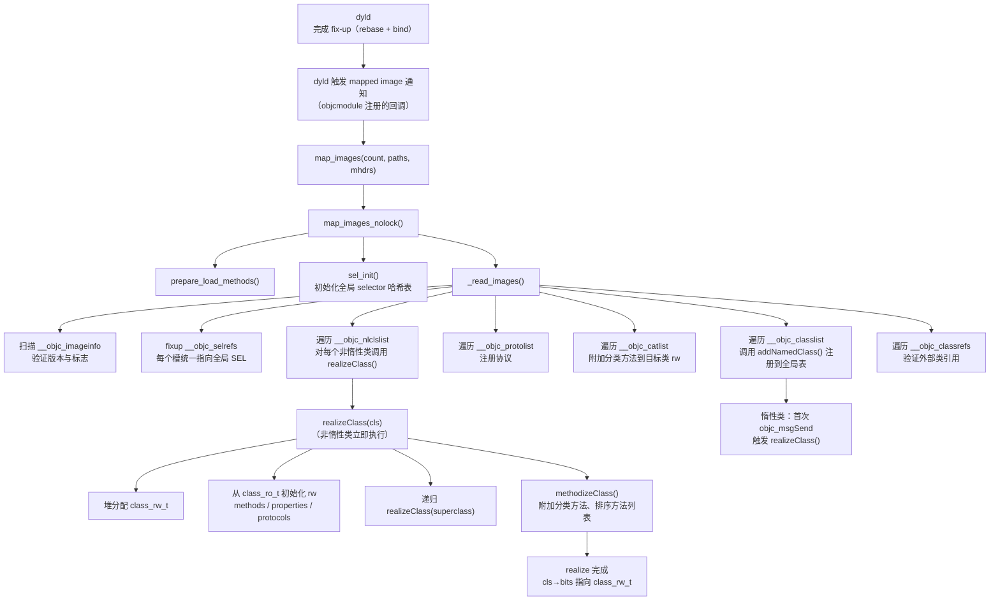
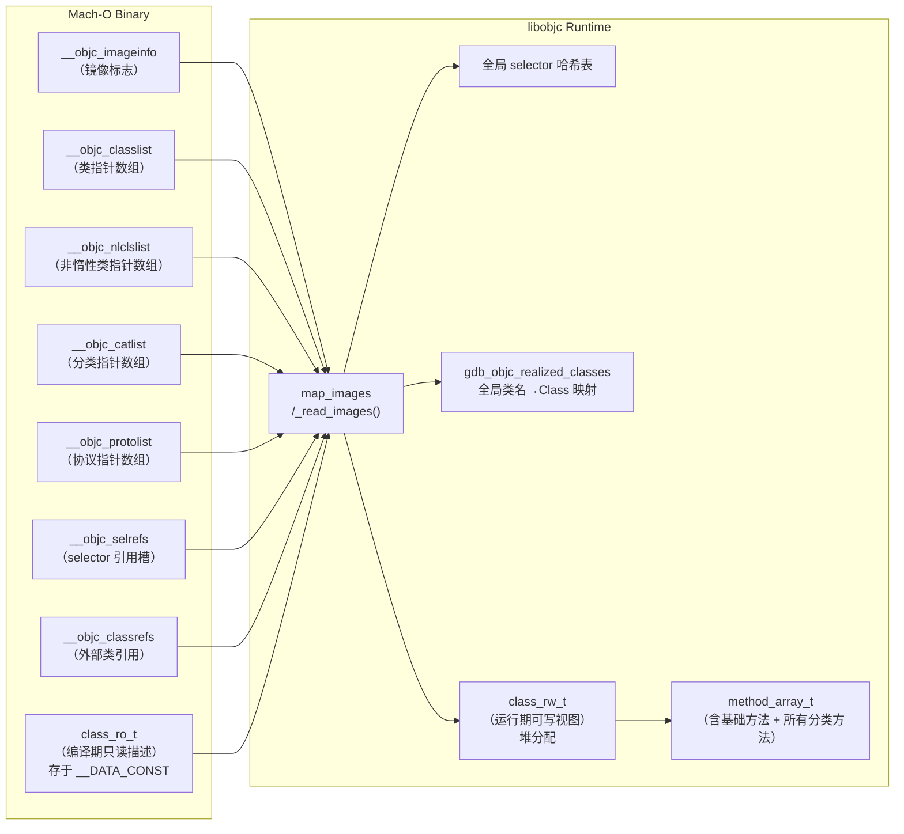

# 详解Mach-O(四十七)ObjC运行时元数据架构总览

> [!abstract] TL;DR
> Objective-C 运行时的元数据**全部嵌入 Mach-O 二进制**，散布在 `__objc_classlist`、`__objc_catlist`、`__objc_protolist`、`__objc_selrefs`、`__objc_classrefs`、`__objc_imageinfo` 等专用节中。进程启动时，`dyld` 完成地址绑定后调用 `map_images` 函数，后者串联起**镜像扫描 → 类注册 → realize（实体化）→ 非惰性类初始化**的完整调用链，最终将二进制里的静态描述符转化为运行时可查询的活跃数据结构（`class_rw_t`）。`class_ro_t` 是编译期固定的只读描述，`class_rw_t` 是运行期可扩展的可写视图，两者的分离是 ObjC 运行时在安全与灵活性之间取得平衡的关键设计。对这套机制的完整理解，是 class-dump、Frida 脚本编写、漏洞利用与防御分析的共同基础。

## 概述：ObjC 元数据的静态存储与动态激活

Objective-C 的动态特性（消息发送、运行期类注册、分类、协议一致性查询）依赖运行时维护的一套数据结构。这些结构**在编译期由 clang 生成、以固定布局写入 Mach-O 的专用节**，运行期由 `libobjc.A.dylib` 中的 `map_images` 函数解析并激活。

整个机制分为两个阶段：

**阶段一：静态阶段（编译器/链接器负责）**

- clang 将每个 `@interface`/`@implementation`/`@protocol`/`@category` 编译为对应的 C 结构体（`class_t`/`protocol_t`/`category_t`），写入各专用 `__objc_*` 节。
- 静态链接器将各编译单元的 ObjC 节合并，排列紧凑，并在 `__DATA_CONST,__objc_classlist` 等节中生成指针数组。

**阶段二：动态阶段（`libobjc` 在 `map_images` 中负责）**

- `dyld` 完成 fix-up（rebase + bind）后，调用已注册的 `map_images` 回调（通过 `LC_ROUTINES_64` 或静态初始化器机制）。
- `libobjc` 扫描所有已加载镜像的 ObjC 节，完成类/协议/分类注册，并对非惰性类执行 `realize`（实体化）。

## 专用节总览

### `__objc_imageinfo` —— 镜像信息标志

**节**：`__DATA,__objc_imageinfo`（或 `__DATA_CONST,__objc_imageinfo`）

每个含 ObjC 代码的镜像都有且仅有一个 `__objc_imageinfo` 节，内容是一个 8 字节结构：

```c
struct objc_image_info {
    uint32_t version;   // 始终为 0
    uint32_t flags;     // 特性标志位（见下表）
};
```

关键 `flags` 位：

| 位掩码 | 含义 |
|---|---|
| `0x00000001` | Supports GC（已废弃，ObjC GC 仅存于历史 macOS）|
| `0x00000002` | Requires GC |
| `0x00000004` | Optimized by dyld shared cache |
| `0x00000008` | Signed |
| `0x00000010` | Is simulated（模拟器二进制）|
| `0x00FF0000` | Swift 版本字段（`flags >> 16 & 0xFF`，非零表示含 Swift 类）|
| `0x00000020` | Has exception info |

```bash
# 查看 __objc_imageinfo 内容
otool -s __DATA __objc_imageinfo MyApp | head -4

# 典型输出示意（flags=0x40，bit 6 = optimized by DSC）
# 0000000100098000  00000000 00000040
```

### `__objc_classlist` —— 类指针表

**节**：`__DATA_CONST,__objc_classlist`（新格式）或 `__DATA,__objc_classlist`（旧格式）

内容：一个 `uint64_t *` 数组，每个元素是指向 `class_t`（即 `objc_class`）结构体的指针。`map_images` 遍历这张表，完成所有定义类的注册。

```c
// 从 __objc_classlist 读取示意（伪代码）
uint64_t *classlist = section_data("__DATA_CONST", "__objc_classlist");
uint32_t count = section_size / sizeof(uint64_t);
for (int i = 0; i < count; i++) {
    Class cls = (Class)classlist[i];
    // 注意：在 DSC preopt 之外的镜像，此处的指针是 rebase 后的绝对地址
}
```

> [!note] 与 `[[36.Mach-O __objc_classlist节]]` 的关系
> 本节详细讲解了 `__objc_classlist` 的字节级布局与 `class_t` 结构；本篇（第 47 篇）从更高层的**架构视角**串联各节与运行时调用链，两者互补。

### `__objc_nlclslist` —— 非惰性类表

**节**：`__DATA,__objc_nlclslist`

内容与 `__objc_classlist` 格式相同，但仅包含实现了 `+load` 方法的类（"非惰性"类，non-lazy class）。这些类在镜像加载时**立即** realize，而不是等到首次消息发送时才实体化。详见 `[[37.Mach-O __objc_nlclslist节]]`。

### `__objc_catlist` —— 分类指针表

**节**：`__DATA,__objc_catlist`（或 `__DATA_CONST,__objc_catlist`）

内容：一个指向 `category_t` 结构体的指针数组。`map_images` 在注册完基础类后，遍历此表将分类方法（`method_t[]`）合并（附加）到对应类的 `class_rw_t` 中。

```c
struct category_t {
    const char *name;             // 分类名称字符串（调试用）
    classref_t  cls;              // 目标类的引用（指向 __objc_classlist 中的条目）
    struct method_list_t *instanceMethods;  // 实例方法列表
    struct method_list_t *classMethods;     // 类方法列表
    struct protocol_list_t *protocols;      // 协议一致性声明
    struct property_list_t *instanceProperties;
    struct property_list_t *classProperties;
};
```

> [!warning] 分类方法合并顺序
> 当多个分类为同一类添加了同名方法时，**后加载的分类中的方法会覆盖先加载的**（同一镜像内按编译顺序；跨镜像按 dyld 加载顺序）。这是 ObjC 分类 "method swizzling" 能生效的原因，也是分类滥用导致难以调试的根源。

### `__objc_protolist` —— 协议指针表

**节**：`__DATA,__objc_protolist`

内容：指向 `protocol_t` 结构体的指针数组。`map_images` 注册协议，并处理协议之间的继承关系（`incorporated_protocols`）。

```c
struct protocol_t : objc_object {
    const char *mangledName;          // 协议名
    struct protocol_list_t *protocols; // 继承的协议列表
    method_list_t *instanceMethods;
    method_list_t *classMethods;
    method_list_t *optionalInstanceMethods;
    method_list_t *optionalClassMethods;
    property_list_t *instanceProperties;
    uint32_t size;
    uint32_t flags;
    const char **extendedMethodTypes; // 各方法的 type encoding（含 _Nullable 等属性）
    const char *demangledName;
    property_list_t *classProperties;
};
```

### `__objc_selrefs` —— Selector 引用表

**节**：`__DATA,__objc_selrefs`

内容：一个 `SEL *` 数组，每个元素是二进制中实际使用（调用或引用）的 selector 的字符串指针。与 `__objc_methname`（`__TEXT` 节，存原始字符串）不同，`__objc_selrefs` 存的是**唯一化后的 SEL 槽**——ObjC 运行时保证同名 selector 在进程内只有一个 `SEL` 地址。

`map_images` 阶段的 `sel_init` 会将 `__objc_selrefs` 中的每个槽替换为全局 selector table 中对应条目的地址，完成唯一化。

```bash
# 查看 __objc_selrefs 内容（8 字节指针，内容为 selector 字符串地址）
otool -s __DATA __objc_selrefs MyApp | head -10
```

### `__objc_classrefs` —— 类引用表

**节**：`__DATA,__objc_classrefs`

内容：指向其他类的指针数组（用于向外部定义的类发消息，如 `[NSString stringWithFormat:...]`）。`dyld` 在 bind 阶段将这些指针填入实际的 `Class` 地址；`map_images` 验证并在必要时触发对应类的 realize。

### `__objc_superrefs` —— 父类引用表

**节**：`__DATA,__objc_superrefs`

内容与 `__objc_classrefs` 格式相同，专门存放 `super` 调用目标（`objc_super2.receiver` 的类型）。这两个节的引用在运行期 realize 完成后会转为直接的 `Class` 指针。

## `class_ro_t` 与 `class_rw_t`：只读描述与可写视图

这是 ObjC 运行时元数据设计中最关键的二分：

### `class_ro_t`（只读，编译期固定）

```c
struct class_ro_t {
    uint32_t flags;               // 类特性标志（见下文）
    uint32_t instanceStart;       // 实例变量区起始偏移（继承链上的累积）
    uint32_t instanceSize;        // 实例对象的总字节大小
    uint32_t reserved;            // 对齐填充
    union {
        const uint8_t *ivarLayout;           // 强引用实例变量布局位图（ARC 扫描用）
        Class firstSubclass;                  // realize 后此处被覆盖
    };
    const char *name;             // 类名字符串（调试 / class-dump 的信息来源）
    method_list_t *baseMethods;   // 该类自身定义的方法（不含分类、不含继承）
    protocol_list_t *baseProtocols;  // 声明实现的协议列表
    ivar_list_t *ivars;           // 实例变量列表（name, type encoding, offset, size）
    const uint8_t *weakIvarLayout;  // 弱引用实例变量布局位图
    property_list_t *baseProperties; // 属性列表（名称、attributes 字符串）
    // arm64e（pointer auth）版本有额外字段
};
```

关键 `flags` 位（`class_ro_t.flags`）：

| 位掩码 | 含义 |
|---|---|
| `RO_META` (0x1) | 这是元类（metaclass）|
| `RO_ROOT` (0x2) | 根类（NSObject 或自定义根类）|
| `RO_HAS_CXX_STRUCTORS` (0x4) | 含 C++ 构造/析构函数（`.cxx_construct`/`.cxx_destruct`）|
| `RO_HIDDEN` (0x10) | `__attribute__((visibility("hidden")))` 类 |
| `RO_EXCEPTION` (0x20) | `__attribute__((objc_exception))` 类 |
| `RO_IS_ARC` (0x80) | ARC 编译的类 |
| `RO_FORBIDS_ASSOCIATED_OBJECTS` (0x100) | 禁止关联对象（`@interface … (NS_REQUIRES_PROPERTY_DEFINITIONS)`）|

`class_ro_t` 存储在二进制的 `__DATA_CONST` 段（`__objc_const` 节），在 dyld 完成绑定、`map_images` realize 之前，其内容**不会被修改**。

### `class_rw_t`（可写，运行期动态）

realize 时，运行时为每个类在堆上分配 `class_rw_t`，并将 `class_t.bits` 从指向 `class_ro_t` 改为指向新分配的 `class_rw_t`：

```c
struct class_rw_t {
    uint32_t flags;              // 运行期标志（RW_REALIZED, RW_INITIALIZED, ...）
    uint16_t witness;            // 用于多线程 realize 的轮次标记
    uint16_t index;
    explicit_atomic<uintptr_t> ro_or_rw_ext;  // 指向 class_ro_t 或 class_rw_ext_t
    Class firstSubclass;         // 子类链表头（运行时维护的子类树）
    Class nextSiblingClass;      // 兄弟类链（同一父类的所有子类构成链表）
    // 以下由 class_rw_ext_t（懒分配）存储方法/属性/协议的扩展列表
};

// class_rw_ext_t（仅在有分类附加 / 动态方法添加时才分配）
struct class_rw_ext_t {
    const class_ro_t *ro;        // 反向引用原始 ro
    method_array_t methods;      // 合并后的完整方法列表（含分类方法）
    property_array_t properties; // 合并后的属性列表
    protocol_array_t protocols;  // 合并后的协议列表
    char *demangledName;
    uint32_t version;
};
```

关键 `flags` 位（`class_rw_t.flags`）：

| 位掩码 | 含义 |
|---|---|
| `RW_REALIZED` (1<<31) | 类已完成 realize |
| `RW_REALIZATION_PREVENTING_STUBS` (1<<30) | 正在 realize 中，防止重入 |
| `RW_LOADED` (1<<23) | `+load` 已调用 |
| `RW_INITIALIZED` (1<<29) | `+initialize` 已调用 |
| `RW_COPIED_RO` (1<<27) | `ro` 已被拷贝（供 class_rw_ext 安全替换）|

## `map_images` 调用链详解

`map_images` 是 `libobjc` 中负责处理新加载镜像的核心函数。以下展示从 `dyld` 回调触发到类注册完成的完整调用链：



### 关键步骤详解

#### `_read_images`：镜像扫描总控

`_read_images` 是 `map_images_nolock` 调用的核心子函数，按以下顺序操作：

1. **gdb_objc_realized_classes 初始化**：第一次调用时创建全局类名哈希表（`NXMapTable *gdb_objc_realized_classes`），之后所有 `addNamedClass` 都向此表注册。
2. **`__objc_selrefs` 修复**：将每个 selref 槽改写为指向全局 selector 唯一化表（sel-to-name mapping）的条目地址。DSC preopt 若已完成此步，则跳过。
3. **类注册**：遍历 `__objc_classlist`，调用 `readClass(cls)` —— 此函数检查类名是否已注册（处理 dyld stub 的 "future class" 场景），将类加入 `gdb_objc_realized_classes`，并处理 remapping（当 DSC preopt 版本不匹配时重新定位）。
4. **非惰性类 realize**：遍历 `__objc_nlclslist`，立即调用 `realizeClassWithoutSwift(cls)`，完成 `class_rw_t` 分配与子类树挂载。
5. **协议注册**：遍历 `__objc_protolist`，调用 `readProtocol(proto)`，处理协议间的继承关系（`incorporated_protocols`）。
6. **分类附加**：遍历 `__objc_catlist`，对每个已 realize 的目标类调用 `attachCategories(cls, cats)`，将分类的 `method_list_t` 追加到 `class_rw_ext_t.methods`（使用 `method_array_t` 的二维列表结构，最新附加的列表排在最前，确保分类方法优先查找）。

#### `realizeClass`：类的实体化

```
realizeClass(cls):
  1. 若 cls→bits 已是 RW_REALIZED，直接返回（已实体化）
  2. 取 ro = cls→bits（此时 bits 指向编译期的 class_ro_t）
  3. 堆分配 rw = new class_rw_t
  4. rw→ro_or_rw_ext = ro（保存 ro 引用）
  5. cls→bits = rw | RW_REALIZED（将 bits 从 ro 切换为 rw，并置标志位）
  6. 递归 realizeClass(superclass)（确保父类先于子类 realize）
  7. 递归 realizeClass(metaclass)
  8. cls→superclass = superclass（写入父类指针）
  9. 将 cls 加入 superclass.firstSubclass 链表（维护子类树）
  10. 调用 methodizeClass(cls)
      a. 将 ro→baseMethods 设为 rw 的初始方法列表（不拷贝，直接引用）
      b. 附加目前已知的待处理分类（pendingCategories）
      c. 对方法列表做 fixup（large method 排序、sel 去重等）
  11. 若 ro→flags & RO_HAS_CXX_STRUCTORS，注册 C++ 构造/析构
```

#### 惰性 vs 非惰性 realize

| 类型 | realize 触发时机 | 判断依据 |
|---|---|---|
| **非惰性类（non-lazy）** | `map_images` 时立即 | 出现在 `__objc_nlclslist`（即实现了 `+load`）|
| **惰性类（lazy）** | 首次收到 ObjC 消息时 | 只出现在 `__objc_classlist`，不在 nlclslist |

惰性 realize 的路径：`objc_msgSend → lookupImpOrForward → ... → realizeAndInitializeIfNeeded → realizeClassWithoutSwift`，在首次消息发送时透明地完成，对调用者无感知，但**第一次消息发送耗时略高**。

## 整体架构图



## class-dump 原理

class-dump 是逆向 ObjC 二进制的核心工具，其工作原理直接建立在上述元数据结构上：

### 工作流程

```
class-dump MyApp:
  1. 解析 Mach-O 头，定位各 __objc_* 节
  2. 遍历 __objc_classlist，读取每个 class_t 指针
  3. 对每个 class_t：
     a. 读取 class_t→bits（在未 realize 的磁盘映像中，bits 直接指向 class_ro_t）
     b. 从 class_ro_t.name 读取类名
     c. 从 class_ro_t.baseMethods 遍历所有方法
        - 每个 method_t.name → selector 字符串（从 __objc_methname 节读）
        - 每个 method_t.types → type encoding（从 __objc_methtype 节读）
        - 还原为 ObjC 方法签名（- (returnType)methodName:(argType)arg ...）
     d. 从 class_ro_t.ivars 读取实例变量（ivar_t：名称、类型、偏移、大小）
     e. 从 class_ro_t.baseProperties 读取属性（名称、@property attributes 字符串）
     f. 从 class_t.superclass 指针读取父类（或从 __objc_superrefs 节）
  4. 遍历 __objc_catlist，对每个 category_t：
     a. 读取 category_t.name（分类名）
     b. 读取目标类引用（category_t.cls）
     c. 生成 @interface TargetClass (CategoryName) 声明
  5. 遍历 __objc_protolist，生成 @protocol 声明
  6. 将所有信息格式化输出为 .h 头文件
```

### small method_t 的兼容处理

iOS 14+ 引入的 small method_t（详见 `[[43.Mach-O __RODATA]]` 附录中的 method_t small 变体章节）会影响 class-dump 的方法读取路径：

```python
# 伪代码：读取方法列表（区分 big/small）
def read_method_list(data, header_offset, base_addr):
    entsize_flags, count = read_u32x2(data, header_offset)
    is_small = (entsize_flags & 0x80000000) != 0
    for i in range(count):
        if is_small:
            # 相对指针：需 + 字段自身地址 解码
            name_rel, types_rel, imp_rel = read_i32x3(data, entry_offset)
            name_sel_ptr = entry_offset + name_rel          # 指向 __objc_selrefs 槽
            sel_str_ptr  = read_u64(data, name_sel_ptr)     # 再一层间接
            sel_str      = read_cstring(data, sel_str_ptr)  # 最终的 selector 字符串
        else:
            name, types, imp = read_u64x3(data, entry_offset)  # 绝对指针
            sel_str = read_cstring(data, name)
```

现代 class-dump（如 [ClassDumpRuntime](https://github.com/bangerang/class-dump) 等 fork）已内置 small method_t 支持。

## type encoding 详解

`class_ro_t.baseMethods` 中每个方法的 `types` 字段是 ObjC type encoding 字符串，描述返回值与参数类型，格式如下：

```
"v24@0:8@16"
 │  │  │ │ │
 │  │  │ │ └── 第2个参数（@=id）从偏移 16 起
 │  │  │ └──── 隐式参数 :（SEL）从偏移 8 起
 │  │  └────── 隐式参数 @（self=id）从偏移 0 起
 │  └────────── 总参数栈帧大小 = 24 字节
 └──────────── 返回值 v = void
```

常用 type encoding 符号：

| 符号 | C/ObjC 类型 | 
|---|---|
| `v` | `void` |
| `B` | `BOOL` (`_Bool`) |
| `c` | `char` / `BOOL`（旧） |
| `i` | `int` |
| `l` | `long` |
| `q` | `long long` / `NSInteger`（64 位）|
| `f` | `float` |
| `d` | `double` |
| `@` | `id`（ObjC 对象）|
| `#` | `Class` |
| `:` | `SEL` |
| `^v` | `void *` |
| `*` | `char *` |
| `{CGRect=...}` | 结构体 |
| `[8i]` | `int[8]` |
| `r@` | `const id` |

## 运行时动态能力

在 `map_images` 完成 realize 后，运行时对 `class_rw_t` 的**动态修改能力**才得以释放：

### `objc_allocateClassPair` / `class_addMethod`

```objc
// 运行期动态创建类
Class newClass = objc_allocateClassPair([NSObject class], "DynamicClass", 0);
// 添加方法（会修改 class_rw_ext_t.methods）
class_addMethod(newClass, @selector(hello), (IMP)helloIMP, "v@:");
// 注册（加入全局类表）
objc_registerClassPair(newClass);
```

### Method Swizzling（方法交换）

```objc
// 交换两个方法的 IMP，通过修改 class_rw_ext_t 中的方法列表实现
Method orig = class_getInstanceMethod([MyClass class], @selector(original));
Method swiz = class_getInstanceMethod([MyClass class], @selector(swizzled));
method_exchangeImplementations(orig, swiz);
// ↑ 本质是交换两个 method_t.imp 指针
```

### Associated Objects（关联对象）

关联对象**不存储在 `class_rw_t` 中**，而是存于全局 `AssociationsHashMap`（以对象地址为 key），完全独立于 ObjC 元数据节。

## 安全性与正确使用

### 安全视角：ObjC 元数据的攻击面

ObjC 运行时元数据是 iOS/macOS 漏洞利用中的重要目标：

1. **方法列表伪造（Method List Forgery）**：`class_ro_t.baseMethods` 存于 `__DATA_CONST`，在 dyld 完成绑定后由内核 `mprotect` 为只读（`SG_READ_ONLY`）。若攻击者在此之前（或通过任意写原语在 `mprotect` 之后）篡改方法列表，可劫持任意 ObjC 方法调用（"ObjC method confusion" 攻击）。Apple 在 iOS 16+ 引入 **PAC（Pointer Authentication）** 对函数指针（IMP）签名，增加利用难度。

2. **ISA 混淆（ISA Confusion）**：`class_t` 的 `isa` 指针指向元类；若攻击者可控 `isa`，则 `objc_msgSend` 会从伪造的元类中查找方法，实现任意代码执行。Tagged Pointer 和 PAC-authenticated ISA（arm64e）缓解此类攻击。

3. **分类滥用**：恶意 dylib 注入（越狱环境）可通过注册含有 `__objc_catlist` 的分类，在无需修改原始类的情况下 hook 所有方法。防御手段：代码签名 + Library Validation（仅允许同 team ID 的库注入）。

4. **`+load` 提权时机**：非惰性类的 `+load` 在 `map_images` 期间即刻调用，此时进程处于早期初始化阶段。恶意库若能在此时机执行代码，可在安全检查启用前完成持久化 hook。

### 正确使用原则

- **class-dump 仅用于授权分析**：对他人应用使用 class-dump 提取接口需遵守《计算机欺诈与滥用法》（CFAA）及所在国法规；对自己开发的 App 或在授权安全测试项目中使用属合规行为。
- **不依赖运行时私有元数据布局**：`class_ro_t`/`class_rw_t` 结构体是 `libobjc` 的内部实现，Apple 可在任意版本更改；生产代码应通过公开 API（`class_getInstanceMethod` 等）操作运行时，而非直接读写这些内部结构。
- **Method Swizzling 的最佳实践**：在 `+load` 中执行 swizzle（确保时机最早、避免并发问题），且每对方法只 swizzle 一次（防止多次交换导致方法链断裂）。
- **动态创建类的生命周期**：`objc_allocateClassPair` 创建的类必须在不再使用后调用 `objc_disposeClassPair` 销毁；泄漏动态类会导致内存增长，因为类一旦注册就无法从全局类表移除（`gdb_objc_realized_classes` 的限制）。

## 与相邻章节的关系

- `[[35.Mach-O __objc_selrefs节]]`：selector 引用节的字节级格式，是本篇 `sel_init` fixup 流程的前提。
- `[[36.Mach-O __objc_classlist节]]`：`class_t` 结构体的字节级详解，与本篇 `class_ro_t`/`class_rw_t` 二分是互补关系。
- `[[38.Mach-O __objc_protolist节]]`：`protocol_t` 的字节级格式与本篇协议注册流程对应。
- `[[39.Mach-O __objc_catlist节]]`：分类的字节级格式与本篇 `attachCategories` 流程对应。
- `[[46.dyld_shared_cache机制]]`：DSC preopt 在 `map_images` 之前预建了 selector/class/protocol 哈希表，本篇描述的 `sel_init` 在 DSC 优化路径下会走快速路径，两篇构成完整的启动优化图景。

## 小结

- ObjC 运行时元数据以 **`class_ro_t`（只读、编译期固定）** 存于 `__DATA_CONST`，以 **`class_rw_t`（可写、运行期堆分配）** 在 `map_images → realizeClass` 时激活。
- `map_images` 调用链：`dyld 回调 → map_images → _read_images → 扫描各 __objc_* 节 → realizeClass（非惰性立即，惰性按需）→ methodizeClass（附加分类方法）`。
- **六大专用节**各司其职：`__objc_imageinfo`（镜像标志）、`__objc_classlist`（类表）、`__objc_nlclslist`（非惰性类）、`__objc_catlist`（分类）、`__objc_protolist`（协议）、`__objc_selrefs`（selector 唯一化锚点）。
- **class-dump 原理**：直接解析磁盘镜像中的 `class_ro_t`，无需 realize，通过 `baseMethods`/`ivars`/`baseProperties` 还原 ObjC 接口。
- **安全视角**：方法列表、ISA、分类机制均是已知攻击面；PAC + Library Validation + `SG_READ_ONLY` 是主要防御机制。

---

[[00.Mach-O文件详解总览|⬆ 系列总览]] | [[46.dyld_shared_cache机制|← 上一篇]] | [[48.Mach-O_Core_Dump格式|→ 下一篇]]
