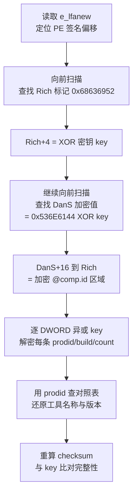

# 详解PE文件(二十六)：Rich Header

> [!abstract] TL;DR
> Rich Header 是一段**完全未文档化**的微软私有数据，嵌在 DOS Stub 尾部与 PE 签名之间。它记录了构建该 PE 文件所使用的每个编译/链接工具的版本号与调用次数，异或加密存储。逆向价值在于：威胁情报溯源归因、编译器指纹比对、检测文件是否被重新打包或篡改。本篇完整拆解其结构、解码算法、解析工具，以及伪造与清除的对抗视角。

## 概述与定位

在 PE 文件的物理布局里，DOS 头（`IMAGE_DOS_HEADER`，64 字节）之后通常跟着一段"DOS Stub"——那段打印"This program cannot be run in DOS mode."的 16 位代码。`e_lfanew` 字段指向 PE 签名的文件偏移，而 DOS Stub 与 PE 签名之间的间隙，正是 Rich Header 的藏身之处。

```text
文件偏移
0x00  ┌──────────────────────────────────────┐
      │  IMAGE_DOS_HEADER (64 字节)           │  e_lfanew → PE签名偏移
0x40  ├──────────────────────────────────────┤
      │  DOS Stub (16位代码 + 字符串)          │
      ├──────────────────────────────────────┤  ← Rich Header 开始
      │  "DanS" 标记（异或加密后为加密形式）    │
      │  填充 DWORD × 3                       │
      │  @comp.id 条目 × N                    │
      │  "Rich" 标记                          │
      │  checksum（XOR 密钥）                 │
e_lfanew → ──────────────────────────────────┤  ← Rich Header 结束
      │  "PE\0\0" (PE 签名)                   │
      │  ...                                  │
```

Rich Header 由 Visual Studio 的链接器（`link.exe`）自动插入，从 VS 97（MSVC 6.0 工具链）开始存在。微软从未公开文档，但安全社区在 2010 年代已将其完全逆向。

与 [[02-详解PE文件(二)：DOS头]] 中介绍的 `e_lfanew` 字段配合来看：操作系统加载 PE 时直接用 `e_lfanew` 跳到 PE 签名，完全忽略 DOS Stub 和 Rich Header 中的内容。Rich Header 对运行毫无影响，但对**溯源分析**价值极高。

## 原理与机制

### 异或加密的设计意图

Rich Header 不以明文存储，而是用一个 32 位 `checksum`（也作为 XOR 密钥）对所有数据做异或。微软的意图可能是避免被静态分析工具直接解读，或者只是作为一种简单的完整性标记。

**密钥（checksum）的计算方式**是 Rich Header 里唯一"可验证"的部分：

```text
checksum  = 初始值（由 DOS 头前 0x3C 字节计算）
          + 每个 @comp.id 条目的贡献（prodid × 使用次数的位旋转累加）
```

具体算法见下文"结构/算法/伪代码详解"一节。

### Rich Header 记录了什么

每个 `@comp.id` 条目是一个 64 位记录，编码为两个 DWORD：

```text
DWORD[0] = (prodid << 16) | build   ← 工具版本信息
DWORD[1] = count                    ← 该工具被调用的次数（编译了多少个目标文件）
```

- **prodid**（高 16 位）：产品 ID，对应特定版本的编译器/链接器/汇编器/masm/资源编译器等。微软内部有一张 prodid → 工具名称的对照表，安全社区已经整理并开源。
- **build**（低 16 位）：具体构建号，可精确到 MSVC 的 minor build。
- **count**：使用次数。例如 `.obj` 文件数量（每个源文件编译一次）。

**典型条目示例（解密后）：**

| prodid | 对应工具 | 说明 |
|--------|---------|------|
| 0x0001 | 导入占位（`[ 0]`） | 始终存在，count = 0 |
| 0x00AA | MSVC 2019 C/C++ 编译器 | build = 28611 ≈ VS 16.11 |
| 0x00AB | MSVC 2019 链接器 | |
| 0x00FC | MSVC 2022 C/C++ 编译器 | build = 31xxx |
| 0x0060 | Visual Studio 2003 C 编译器 | 旧版本 |
| 0x006D | MASM（汇编器）6.x | 手工写汇编的代码 |
| 0x0093 | 资源编译器（RC） | 含 .rc 文件 |

通过这些信息，分析人员可以还原"这个 PE 是用 VS 2019 + MASM 构建的，共编译了 17 个 .cpp，1 个 .asm"这样的结论。

## 结构/算法/伪代码详解

### 内存布局（解密前后对比）

```text
文件中存储（异或加密形式）：
┌──────────────────────────────────────────────────────────┐
│ enc[0]  = "DanS" XOR key  (0x536E6144 XOR key)           │  ← "DanS" 加密
│ enc[1]  = 0x00000000 XOR key                              │  ← 填充
│ enc[2]  = 0x00000000 XOR key                              │  ← 填充
│ enc[3]  = 0x00000000 XOR key                              │  ← 填充
│ enc[4]  = entry[0].prodid_build XOR key                   │  ← 第1条
│ enc[5]  = entry[0].count       XOR key                    │
│ ...                                                       │
│ enc[N-2]= entry[K].prodid_build XOR key                   │  ← 最后一条
│ enc[N-1]= entry[K].count       XOR key                    │
│ "Rich"  = 0x68636952           （明文，不加密）            │  ← 结束标记
│  key    = checksum             （明文，是解密密钥本身）    │  ← XOR 密钥
└──────────────────────────────────────────────────────────┘
```

**定位算法**：从 PE 签名（`e_lfanew`）向前搜索，找到字符串 `"Rich"`（`0x68636952`）；紧随其后的 DWORD 就是 `key`。向前 `(N+4)*4` 字节找到加密的 `"DanS"`，两者之间就是全部 `@comp.id` 条目。

### 解码算法（Python 实现）

```python
import struct
import pefile

def decode_rich_header(pe_path: str):
    """解析并解密 PE 文件的 Rich Header。"""
    with open(pe_path, "rb") as f:
        raw = f.read()

    dos = struct.unpack_from("<H", raw, 0)[0]
    assert dos == 0x5A4D, "不是有效的 DOS MZ 头"

    e_lfanew = struct.unpack_from("<I", raw, 0x3C)[0]

    # 在 DOS Stub 区域搜索 "Rich" 标记（0x68636952）
    rich_pos = -1
    for i in range(0x40, e_lfanew, 4):
        val = struct.unpack_from("<I", raw, i)[0]
        if val == 0x68636952:  # "Rich"
            rich_pos = i
            break
    if rich_pos == -1:
        print("未找到 Rich Header（非 MSVC 链接器构建，或已被清除）")
        return

    key = struct.unpack_from("<I", raw, rich_pos + 4)[0]
    print(f"[+] Rich Header 位置: 0x{rich_pos:04X}  XOR 密钥(checksum): 0x{key:08X}")

    # 向前找 "DanS" 加密标记（明文 = 0x536E6144，密文 = 0x536E6144 XOR key）
    dans_enc = 0x536E6144 ^ key
    dans_pos = -1
    for i in range(rich_pos, 0x40, -4):
        val = struct.unpack_from("<I", raw, i)[0]
        if val == dans_enc:
            dans_pos = i
            break
    if dans_pos == -1:
        print("[!] 找到 Rich 但未找到 DanS，结构损坏")
        return

    print(f"[+] DanS 位置: 0x{dans_pos:04X}")

    # 解密条目（跳过 DanS + 3个填充 DWORD）
    entries_start = dans_pos + 16  # 4 DWORD = 16 字节
    entries_end   = rich_pos

    print(f"\n{'prodid':>8}  {'build':>6}  {'count':>6}  工具提示")
    print("-" * 50)
    for pos in range(entries_start, entries_end, 8):
        dw0 = struct.unpack_from("<I", raw, pos)[0]     ^ key
        dw1 = struct.unpack_from("<I", raw, pos + 4)[0] ^ key
        prodid = (dw0 >> 16) & 0xFFFF
        build  =  dw0        & 0xFFFF
        count  =  dw1
        print(f"0x{prodid:04X}  {build:6d}  {count:6d}")

# 调用示例：decode_rich_header("target.exe")
```

### checksum 校验算法

checksum 的计算依赖 DOS 头前 0x3C 字节（即 `IMAGE_DOS_HEADER` 去掉 `e_lfanew`），以及所有解密后的 `@comp.id` 条目：

```python
def compute_checksum(raw: bytes, entries: list) -> int:
    """
    entries: [(prodid_build_dword, count_dword), ...]
    对应 Rich Header 里每个 @comp.id 条目（已解密）。
    """
    import ctypes

    def rol32(val, shift):
        """32 位循环左移"""
        shift %= 32
        return ((val << shift) | (val >> (32 - shift))) & 0xFFFFFFFF

    # 第一部分：DOS 头前 0x3C 字节（按字节循环左移累加）
    chk = 0
    for i, b in enumerate(raw[:0x3C]):
        if 0x3C <= i < 0x40:
            continue  # 跳过 e_lfanew 字段本身
        chk = (chk + rol32(b, i)) & 0xFFFFFFFF

    # 第二部分：每个 @comp.id 条目贡献
    for (dw0, count) in entries:
        # dw0 = (prodid << 16) | build，以 count 为移位量循环左移后累加
        chk = (chk + rol32(dw0, count)) & 0xFFFFFFFF

    return chk
```

若计算结果与文件中的 `key` 一致，说明 Rich Header **完整无篡改**；不一致说明文件在链接后被修改过（即使仅改了 1 字节，checksum 就会失配）。

### Mermaid：Rich Header 在 PE 布局中的位置及解码流程



## 工具视角与实战

### PE-bear

PE-bear 在 "Rich Header" 标签页直接展示解密后的条目列表，每行显示 prodid、build、count 及工具名称（内置 prodid 数据库）。这是最直观的 GUI 工具，无需手动解码。

### pefile（Python）

```python
import pefile
pe = pefile.PE("target.exe")
if hasattr(pe, "RICH_HEADER"):
    for entry in pe.RICH_HEADER.values:
        print(f"prodid=0x{entry[0]:04X}  build={entry[1]}  count={entry[2]}")
```

`pefile` 内置 Rich Header 解析，返回 `(prodid, build, count)` 三元组列表。

### richprint / richer

`richprint`（GitHub: `dishather/richprint`）是专用命令行工具，输出格式友好，附带工具名映射，适合批量分析：

```text
$ richprint target.exe
 Id  | Ver  | Uses | Info
0001 | 0000 |    0 | [Linker marker]
00AA | 7003 |   17 | VS2019 (16.11) C/C++ Compiler
00AB | 7003 |    1 | VS2019 (16.11) Linker
0093 | 0000 |    1 | Resource Compiler
```

### 批量溯源工作流

威胁情报场景中，Rich Header 可用于**同源归因**：

```text
1. 提取样本集合的 Rich Header（解密后的 @comp.id 数组）
2. 计算"Rich Header 指纹"（对条目排序后 hash）
3. 对照已知 APT 样本库，相同指纹 → 可能同一构建环境
4. 结合 PE 时间戳、导入函数集合，三角交叉验证

注意：Rich Header 指纹相同只说明"工具链相同"，
     不排除不同组织巧合使用同一版本 VS 的情况。
     需配合其他特征（代码语义、C2 基础设施）综合判断。
```

## 安全性与正确使用

### 逆向价值：溯源归因与编译器指纹

Rich Header 在威胁情报领域的三大用途：

1. **编译器版本指纹**：malware 作者通常用固定版本的 VS/MingW 构建样本。如果同一个 APT 组的多个样本 Rich Header 完全一致（相同的 prodid/build 组合），可作为"同一构建机器或构建脚本"的旁证。例如，NotPetya、EternalBlue 载荷的 Rich Header 分析就是学术论文的常见内容。

2. **检测重打包/篡改**：正常 PE 的 checksum 应能用原始数据重算验证。若一个"签名的合法程序"的 Rich Header checksum 失配，说明文件在签名后被修改——可能是代码注入或节数据替换。

3. **区分手工 PE 与编译器输出**：手工构造的 PE（shellcode loader、某些 stager）往往没有 Rich Header，或有伪造的 Rich Header（checksum 不匹配）。这是区分"工具链生成"与"手工打造"的快速启发。

> [!caution] 对抗视角：伪造与清除
> **清除 Rich Header**：将 DanS 到 Rich（含密钥）的区域全部填 `0x00`，并更新 checksum 为 0。链接器不会在加载时重建它，对运行无影响，但会消除工具链指纹。部分 Packer/混淆工具（如 Themida）自动清除或替换 Rich Header。
>
> **伪造 Rich Header**：将 prodid/build 替换为目标语言的典型值（如模拟 VS 2015 构建），重新计算 checksum 写入。由于 checksum 算法已完全公开，伪造成本极低。伪造检测：只能结合代码语义（import 函数集合、编译器优化模式、异常处理风格）交叉验证，单凭 Rich Header 无法确认真实性。

> [!note] 清除对 Authenticode 签名的影响
> Rich Header 位于 PE 文件中被 Authenticode 签名**覆盖**的区域（整个文件哈希，不含 PE 头中的 checksum 字段和签名本身）。修改或清除 Rich Header 会导致数字签名验证失败。因此，已签名的合法程序其 Rich Header 不能被简单修改——这反而是一个防止篡改的副产品。

### 为什么 GNU ld / Clang 没有 Rich Header

Rich Header 是 MSVC 链接器（`link.exe`）的私有扩展，GNU 链接器（`ld`）和 LLVM 链接器（`lld`）均不生成。因此：

- 用 MinGW-w64 / LLVM-MinGW 交叉编译的 Windows PE 不含 Rich Header。
- 用 Go / Rust / Zig 等语言编译的原生 Windows PE（链接器为语言内置 lld）也不含。
- 这本身是一个"编译器识别"特征：缺少 Rich Header 且代码风格不像手工汇编，通常意味着非 MSVC 工具链。

## 小结

Rich Header 是 PE 文件里最"隐蔽"的字段：加密存储、未文档化、对运行完全无影响，却在逆向与威胁情报分析中有着超出其体积的价值。

核心要点：

1. **位置**：DOS Stub 尾部，PE 签名之前，由 `DanS` 到 `Rich` 标记界定。
2. **加密**：每个 DWORD 均与 `checksum`（即 XOR 密钥）做异或，`checksum` 本身明文存于 `Rich` 标记之后。
3. **内容**：每个 `@comp.id` 条目 = `(prodid << 16 | build, count)`，记录了每个 MSVC 工具链组件的版本与调用次数。
4. **完整性**：`checksum` 可通过算法从文件内容重算，失配即代表篡改。
5. **对抗**：清除成本极低，伪造成本也低，但修改会破坏 Authenticode 签名；单凭 Rich Header 做溯源时需结合其他特征交叉验证。

## 相关阅读

- [[02-详解PE文件(二)：DOS头]]
- [[06-详解PE文件(六)：可选头]]
- [[08-详解PE文件(八)：导入表]]
- [[24-详解PE文件(二十四)：节表]]
- [[25-详解PE文件(二十五)：节数据]]

---

← 上一篇：[[25-详解PE文件(二十五)：节数据]]　｜　[[00-合集总览-PE文件详解|📚 返回合集总览]]　｜　下一篇：[[27-详解PE文件(二十七)IAT Hook与Import混淆]] →
