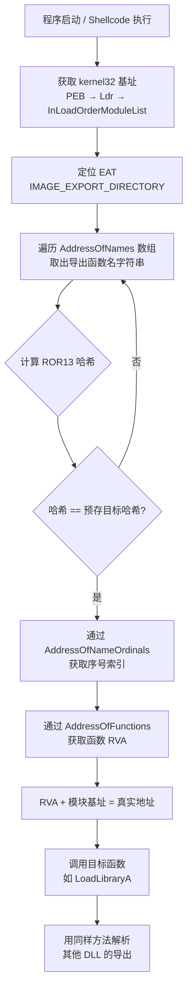

# 详解PE文件(二十七)：IAT Hook 与 Import 混淆

> [!abstract] TL;DR
> 导入地址表（IAT）既是 Windows PE 加载器的"函数调线板"，也是攻防双方反复争夺的战场。**IAT Hook** 通过改写 IAT 槽中的函数指针，静默拦截所有经由该槽的 API 调用；**Import 混淆**则反其道而行之——从源头消灭静态可见的导入符号，以按序号导入、API 哈希、动态加载、加密延迟填充等手段让逆向工程师和自动化工具失去立足点。本篇从 PE 导入表结构出发，逐一剖析这两类技术的实现原理与对抗方法。

## 概述与定位

PE 文件的导入机制由两张紧密配合的表共同承载：**INT（Import Name Table，导入名称表）** 存放导入函数的符号描述（名称或序号），在文件加载前保持只读；**IAT（Import Address Table，导入地址表）** 则在加载时被 Windows 加载器填写为真实的运行时函数地址，之后代码中所有 `call [iat_slot]` 均通过 IAT 间接跳转到目标函数。

这一机制的本质是一层**间接层**：编译器不把目标地址硬编码到 `.text`，而是让所有调用走一个"地址仓库"。这个间接层极大地方便了动态链接，但也天然成为挂钩（hook）和混淆的切入点。

本篇在系列中的位置：

- 结构基础：[[08-详解PE文件(八)：导入表]] 覆盖 `IMAGE_IMPORT_DESCRIPTOR` 与 INT 的完整解析
- 地址表细节：[[20-详解PE文件(二十)：导入地址表]] 覆盖 IAT 的布局与加载器填写过程
- 本篇（第 28 篇）：在上述基础上，深入 Hook 手法与 Import 混淆技术的原理、实现与对抗

## 原理与机制

### IAT 双表回顾

加载器处理导入时的核心数据流如下：

```
文件中：
  IMAGE_IMPORT_DESCRIPTOR
    ├── OriginalFirstThunk → INT（IMAGE_THUNK_DATA 数组，保存名称/序号描述符）
    └── FirstThunk        → IAT（IMAGE_THUNK_DATA 数组，文件中也是名称/序号描述符）

加载后：
  INT 保持不变（只读，供校验用）
  IAT 被改写为真实地址：
    IAT[0] = &MessageBoxA
    IAT[1] = &CreateFileW
    ...
```

代码调用模式（x86）：

```asm
call dword ptr [__imp__MessageBoxA]   ; 间接调用，__imp__ 符号指向 IAT 中对应槽位
```

x64 下则是 `call qword ptr [__imp_MessageBoxA]`，原理相同，指针宽度 8 字节。

### IAT Hook 原理

IAT Hook 的核心操作极为简洁：**找到目标函数在 IAT 中的槽位，将其中的地址改写为钩子函数的地址**。此后任何通过该 IAT 槽的调用都会先到达钩子，钩子可以监控参数、修改返回值、完全替换行为，也可以在完成自身逻辑后调用原始地址（即保存在钩子内部的 `original_func`）继续正常流程。

**操作步骤（以用户态为例）：**

1. 遍历目标进程的 `IMAGE_IMPORT_DESCRIPTOR` 数组，找到包含目标函数（如 `MessageBoxA`）的 DLL 描述符
2. 遍历该描述符指向的 IAT，逐项与目标函数地址比对（或通过 INT 匹配名称）
3. 找到目标槽后：
   a. 调用 `VirtualProtect` 将 IAT 所在内存页改为可写（IAT 默认权限 `PAGE_READONLY`）
   b. 备份原始地址：`original_func = iat_slot`
   c. 写入钩子地址：`iat_slot = &hook_func`
   d. 恢复内存页权限

**关键约束：IAT Hook 只作用于同一模块内的调用路径。** 如果目标进程直接调用了 `GetProcAddress` 解析地址再 `call eax`，这条路径完全绕开 IAT，Hook 无效。这也是 Import 混淆技术能够规避 IAT Hook 监控的根本原因。

### Inline Hook 对比

| 维度 | IAT Hook | Inline Hook |
|------|----------|-------------|
| 修改位置 | IAT 数据节（指针数组） | 函数体起始字节（`.text` 代码） |
| 侵入性 | 低（改数据，不改代码） | 高（修改指令字节，可能破坏对齐） |
| 绕过难度 | 中（绕过：直接调用而非间接）  | 高（绕过：绕过前 5 字节跳转）|
| 检测难度 | 低（对比 INT 与 IAT 即可发现） | 中（需扫描函数头是否含非预期 JMP）|
| 多模块覆盖 | 需对每个模块分别 Hook | 一处修改全局生效 |
| 兼容性 | 无代码修改，不影响 CFI | 可能触发 CFG/CET 保护 |

### EAT Hook

导出地址表（Export Address Table，EAT）同样可以被 Hook。EAT 存储的是 DLL 导出函数相对 DLL 基址的 RVA；**EAT Hook** 将目标函数的 RVA 改写为钩子函数的 RVA，使所有通过 `GetProcAddress` 动态解析该函数名称的调用都拿到钩子地址。

EAT Hook 的影响范围与 IAT Hook 互补：IAT Hook 拦截"已经在编译时确定导入"的调用，EAT Hook 拦截"运行时动态解析"的调用。两者组合可以覆盖对一个 API 的全部调用路径——这也是杀软 Hook 引擎的常见实现思路（详见 [[32.hooks/02-windows-api-hook]]）。

## 结构/算法/伪代码详解

### IAT Hook 实现伪代码

```c
// 在当前进程内对 target_module 的 IAT 进行 Hook
bool IATHook(HMODULE target_module, const char* dll_name,
             const char* func_name, LPVOID hook_func, LPVOID* orig_func) {
    // 1. 定位 IMAGE_IMPORT_DESCRIPTOR 数组
    PIMAGE_DOS_HEADER dos = (PIMAGE_DOS_HEADER)target_module;
    PIMAGE_NT_HEADERS nt  = RVA_TO_VA(dos, dos->e_lfanew);
    DWORD import_rva = nt->OptionalHeader
                         .DataDirectory[IMAGE_DIRECTORY_ENTRY_IMPORT].VirtualAddress;
    PIMAGE_IMPORT_DESCRIPTOR desc = RVA_TO_VA(dos, import_rva);

    // 2. 遍历 DLL 描述符，匹配 dll_name
    for (; desc->Name; desc++) {
        const char* cur_dll = RVA_TO_VA(dos, desc->Name);
        if (_stricmp(cur_dll, dll_name) != 0) continue;

        // 3. 遍历 IAT，通过 INT 匹配函数名
        PIMAGE_THUNK_DATA thunk_int = RVA_TO_VA(dos, desc->OriginalFirstThunk);
        PIMAGE_THUNK_DATA thunk_iat = RVA_TO_VA(dos, desc->FirstThunk);

        for (; thunk_int->u1.Ordinal; thunk_int++, thunk_iat++) {
            if (IMAGE_SNAP_BY_ORDINAL(thunk_int->u1.Ordinal)) continue; // 按序号导入，跳过
            PIMAGE_IMPORT_BY_NAME ibn =
                RVA_TO_VA(dos, thunk_int->u1.AddressOfData);
            if (strcmp((char*)ibn->Name, func_name) != 0) continue;

            // 4. 改写 IAT 槽
            *orig_func = (LPVOID)thunk_iat->u1.Function;
            DWORD old_prot;
            VirtualProtect(&thunk_iat->u1.Function, sizeof(LPVOID),
                           PAGE_READWRITE, &old_prot);
            thunk_iat->u1.Function = (ULONG_PTR)hook_func;
            VirtualProtect(&thunk_iat->u1.Function, sizeof(LPVOID),
                           old_prot, &old_prot);
            return true;
        }
    }
    return false;
}
```

### API 哈希查找算法（ROR13）

API 哈希是 Import 混淆中最广泛使用的技术。Shellcode 与 packer 将所有需要调用的 API 名称替换为哈希值，在运行时遍历 DLL 的 EAT，对每个导出函数名计算哈希，与预存哈希比对，匹配则获得函数地址。

最经典的哈希算法是 **ROR13**（循环右移 13 位）：

```python
def ror13_hash(name: bytes) -> int:
    h = 0
    for c in name + b'\x00':        # 包含终止 \0
        h = ((h >> 13) | (h << 19)) & 0xFFFFFFFF  # ROR 13
        h = (h + c) & 0xFFFFFFFF
    return h

# 示例
print(hex(ror13_hash(b'LoadLibraryA')))   # 0xec0e4e8e
print(hex(ror13_hash(b'GetProcAddress'))) # 0x7c0dfcaa
```

恶意代码中常见的模式（x86 Shellcode 风格伪代码）：

```asm
; 遍历 kernel32 的 EAT，查找哈希 = TARGET_HASH 的函数
find_func:
    ; eax = 当前导出函数名地址
    ; 计算 ROR13 哈希
    xor ecx, ecx
    xor edi, edi
hash_loop:
    movsx edx, byte [eax]
    test edx, edx
    jz hash_done
    ror edi, 0x0D
    add edi, edx
    inc eax
    jmp hash_loop
hash_done:
    cmp edi, TARGET_HASH   ; 与预存哈希比对
    je  found
    ; 继续遍历下一个导出函数
found:
    ; 通过 EAT 中的地址偏移计算真实地址
```

### Mermaid：API 哈希解析流程



### 导入混淆技术汇总对比

```
┌──────────────────────────────────────────────────────────────────────┐
│                      Import 混淆技术谱系                               │
├─────────────────────┬──────────────────────────────────────────────┤
│ 技术                │ 原理                                          │
├─────────────────────┼──────────────────────────────────────────────┤
│ 按序号导入           │ IMAGE_IMPORT_BY_NAME 中不含名称字符串，       │
│ (Ordinal-only)      │ INT/IAT 槽的最高位置 1 直接存序号。            │
│                     │ IDA/Ghidra 只显示 ordinal#N，无符号名。        │
├─────────────────────┼──────────────────────────────────────────────┤
│ API 哈希查找         │ 静态导入表为空/最小化，运行时遍历 EAT 比对哈希。 │
│ (API Hashing)       │ 常见：ROR13、djb2、FNV-1a 等。                │
├─────────────────────┼──────────────────────────────────────────────┤
│ 动态导入             │ 直接调用 LoadLibraryA + GetProcAddress，       │
│ (Dynamic Import)    │ 完全绕开静态 IAT；地址存于堆/全局变量。         │
├─────────────────────┼──────────────────────────────────────────────┤
│ 导入表加密           │ 加载前 IAT/INT 为加密数据，壳在入口点前解密     │
│ (IAT Encryption)    │ 并填充真实地址；静态分析看到垃圾字节。          │
├─────────────────────┼──────────────────────────────────────────────┤
│ 延迟加载混淆         │ 利用 /DELAYLOAD 机制，首次调用时才触发解析；    │
│ (Delay Import)      │ 壳可替换 DelayImport 的辅助 DLL 名实现欺骗。   │
└─────────────────────┴──────────────────────────────────────────────┘
```

## 工具视角与实战

### 静态检测 IAT Hook

使用 **PE-bear** 或 **x64dbg** 的 IAT 检测插件可以对比"INT 中记录的函数名对应的预期地址"与"IAT 当前槽中的实际地址"，若两者指向不同模块则说明 IAT 已被修改：

```python
# Python + pefile 检测 IAT Hook 的思路
import pefile, ctypes

pe = pefile.PE("target.exe")
for entry in pe.DIRECTORY_ENTRY_IMPORT:
    dll = entry.dll.decode()
    lib = ctypes.windll.LoadLibrary(dll)
    for imp in entry.imports:
        if imp.name is None:
            continue
        expected = ctypes.cast(
            ctypes.windll.kernel32.GetProcAddress(lib, imp.name),
            ctypes.c_void_p).value
        actual = imp.address           # IAT 中当前地址（运行时读取）
        if expected != actual:
            print(f"[HOOK] {dll}!{imp.name.decode()}: "
                  f"expected {hex(expected)}, got {hex(actual)}")
```

上述脚本在正常进程中运行时 `expected == actual`；若某 AV/EDR 已对目标进程安装 IAT Hook，则两者会出现差异（通常 actual 指向 AV 的监控 DLL 地址空间）。

### 识别 API 哈希混淆

**IDA Python 自动化还原 ROR13 哈希：**

```python
# IDA Python：扫描立即数并尝试反查 ROR13 哈希
import idaapi, idautils, idc

# 预先建立哈希→名称的查找表
HASH_DB = {
    0xec0e4e8e: "kernel32!LoadLibraryA",
    0x7c0dfcaa: "kernel32!GetProcAddress",
    0x0726774c: "kernel32!ExitProcess",
    # ... 更多从 shellcode 哈希数据库补充
}

for ea in idautils.Segments():
    for head in idautils.Heads(ea, idc.get_segm_end(ea)):
        mnem = idc.print_insn_mnem(head)
        if mnem in ("mov", "push", "cmp"):
            imm = idc.get_operand_value(head, 1)
            if imm in HASH_DB:
                idc.set_cmt(head, f"API hash -> {HASH_DB[imm]}", 0)
                print(f"0x{head:x}: {HASH_DB[imm]}")
```

**Cutter/Ghidra 插件**（如 `iathook-find` 或 `apihash-resolver`）提供 GUI 界面完成同样的哈希反查工作。

### 动态导入的逆向追踪

面对 `LoadLibrary + GetProcAddress` 模式，在 x64dbg 中：

1. 对 `GetProcAddress` 下断点（`bp GetProcAddress`）
2. 观察第二个参数 `rdx`（函数名字符串），记录每次解析的函数
3. 若 rdx 为空（按序号），则观察 `rcx` 的高位（ordinal 模式）
4. 结合 x64dbg 的 "API 调用日志" 插件，可自动收集所有动态解析的导入

**Frida 脚本追踪动态导入：**

```javascript
// Frida: 追踪 GetProcAddress 动态调用
const GetProcAddress = Module.getExportByName('kernel32.dll', 'GetProcAddress');
Interceptor.attach(GetProcAddress, {
    onEnter(args) {
        const hModule = args[0];
        const nameArg  = args[1];
        const ordinal  = nameArg.toUInt32();
        if (ordinal < 0x10000) {
            console.log(`GetProcAddress(ordinal #${ordinal})`);
        } else {
            console.log(`GetProcAddress("${nameArg.readAnsiString()}")`);
        }
    }
});
```

### 脚本重建被混淆的 IAT

在 dump 出的内存镜像中，若原始 IAT 已被加密或清空，可以通过以下步骤重建：

1. 让程序运行到 OEP 前的壳初始化完成点（此时壳已解密/填充 IAT）
2. 用 **Scylla**（x64dbg 插件）或 **ImportREC** 扫描内存中的有效函数指针，重建 IAT 并修复 dump
3. 对于哈希解析型混淆，在哈希比对成功的位置下断点，收集所有 `(hash, address)` 对后再统一重建

## 安全性与正确使用

> [!caution] 合规边界
> IAT Hook 与 Import 混淆技术均属于高权限系统操作，存在严重的误用风险：
>
> - **IAT Hook** 需要对目标进程内存执行写操作，在未经授权的进程上实施构成计算机入侵行为（中国《网络安全法》第 27 条；美国 CFAA）。
> - **API 哈希/动态导入** 等混淆手法是恶意软件规避检测的核心技术之一；在自有代码之外使用此类技术打包他人软件，涉及知识产权与安全合规风险。
> - **合法使用场景**：授权安全测试（渗透测试合同范围内）、EDR/AV 产品自身的防护实现、CTF 竞赛题目、个人学习环境中的自有样本分析、安全研究人员在隔离沙箱中的行为分析。
> - 任何对真实系统的 Hook 操作均需明确书面授权。

**防御与检测建议：**

- **进程完整性校验**：在程序启动时对比 IAT 当前值与加载器填写的预期值，若有差异则报警（类似上文 Python 脚本的思路）
- **控制流完整性（CFI/CFG）**：Windows CFG 在间接调用时校验目标地址是否在合法函数开头，可缓解但不能完全阻止 IAT Hook
- **Import 混淆的检测**：静态分析时，导入表极短（少于 3 个函数）但代码量极大，通常是动态解析的信号；YARA 规则可以匹配 ROR13 哈希常数（`0xEC0E4E8E`、`0x7C0DFCAA` 等已知值）
- **沙箱行为分析**：监控 `GetProcAddress`/`LoadLibrary` 调用序列，是识别 API 哈希混淆的最有效手段

## 小结

IAT Hook 与 Import 混淆是 PE 导入机制的两个对立面：前者利用 IAT 的间接层实施拦截，后者通过消灭静态符号信息来规避拦截与分析。

核心要点：

- INT 保持加载前的符号信息，IAT 在加载后存放真实地址；两者之差即 Hook 的蛛丝马迹
- IAT Hook 改写的是 IAT 数据槽，代价低、影响范围有限（仅限通过该 IAT 的调用路径）；Inline Hook 改代码字节，影响全局但侵入性强
- EAT Hook 与 IAT Hook 互补，前者针对 `GetProcAddress` 动态解析路径
- Import 混淆的四个主要形式：按序号导入、API 哈希、动态加载、加密/延迟填充；逆向还原的核心工具是断点追踪 + 哈希数据库 + Scylla 重建 IAT
- 所有技术均应在合法授权范围内学习与使用

## 相关阅读

- [[08-详解PE文件(八)：导入表]] — INT/IAT 双表的完整结构解析
- [[20-详解PE文件(二十)：导入地址表]] — IAT 布局与加载器填写过程
- [[09-详解PE文件(九)：导出表]] — EAT 结构，EAT Hook 的基础
- [[32.hooks/02-windows-api-hook]] — Windows API Hook 全景（IAT/Inline/内核三类）
- [[28-详解PE文件(二十八)PE脱壳基础]] — 脱壳时如何面对被混淆的导入表

---

← 上一篇：[[26-详解PE文件(二十六)Rich Header]]　｜　[[00-合集总览-PE文件详解|📚 返回合集总览]]　｜　下一篇：[[28-详解PE文件(二十八)PE脱壳基础]] →
