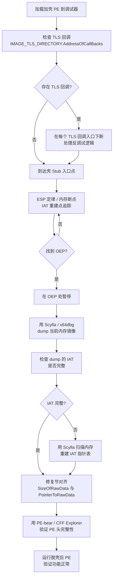

# 详解PE文件(二十八)：PE 脱壳基础

> [!abstract] TL;DR
> "加壳"是通过修改 PE 结构保护或压缩可执行文件的技术：壳将原始代码压缩/加密后存放于新注入的节，把 PE 入口点替换为自身的 stub，并在运行时解压/解密并重建导入表，最终跳转到原始入口点（OEP）执行。**脱壳**就是逆转这一过程：识别壳特征、找到 OEP、dump 内存、修复 IAT 与节对齐——每一步都依赖对 PE 结构的深度理解。本篇从 PE 结构视角系统梳理壳的改写手法、壳特征识别、OEP 定位思路与脱壳后修复流程。

## 概述与定位

壳（Packer/Protector）对 PE 文件的改写可以从以下几个维度理解：

- **入口点（AddressOfEntryPoint）**：替换为壳 stub 的 RVA，使加载器一启动就执行壳代码
- **节表与节数据**：注入新节（如 UPX0/UPX1）存放压缩数据和解压代码；原始节可能被合并、重命名或清零
- **导入表（Import Directory）**：原始导入表被隐藏、压缩或加密；壳自身只需最小化导入（如 `LoadLibraryA` + `GetProcAddress`），其余导入在运行时动态重建
- **TLS 回调（TLS Callbacks）**：某些壳在 TLS 回调中提前执行反调试/解密逻辑，早于入口点执行
- **资源节（.rsrc）**：有些壳将压缩后的原始 PE 或配置数据嵌入资源节

理解这些改写手法是脱壳的前提——脱壳的每一步操作都是对上述改写的逆转。

本篇在系列中的位置：

- 节表基础：[[24-详解PE文件(二十四)：节表]] — 节表结构与 UPX 节名特征
- TLS 表：[[17-详解PE文件(十七)：TLS表]] — TLS 回调的结构与执行时机
- 上一篇：[[27-详解PE文件(二十七)IAT Hook与Import混淆]] — 导入混淆与 IAT 重建
- 花指令干扰：[[31.Junk Code/00.花指令详解与实战教程]] — 壳 stub 中常嵌入花指令干扰反汇编

## 原理与机制

### 加壳对 PE 结构的改写

加壳过程是一个"PE 再封装"流程，下图展示了原始 PE 与加壳后 PE 的结构对比：

```
原始 PE：
┌───────────────────────────────────┐
│  DOS 头 / PE 头                   │
│  OEP → .text（原始代码）           │
│  .rdata（导入表、只读数据）          │
│  .data                            │
└───────────────────────────────────┘

加壳后 PE（以 UPX 为例）：
┌───────────────────────────────────┐
│  DOS 头 / PE 头                   │
│  AddressOfEntryPoint → UPX1 内部  │  ← 入口点被替换为壳 stub
│  UPX0：VirtualSize 极大，Raw=0    │  ← 解压目标区域（内存中由壳填充）
│  UPX1：含压缩数据 + 解压 stub      │  ← 真正存在于文件中
│  导入表：仅 LoadLibraryA/GPA       │  ← 原始导入表已被替换为最小集
└───────────────────────────────────┘
```

加壳对每个关键 PE 字段的具体改写：

| PE 字段 | 加壳前 | 加壳后（典型） |
|---------|--------|--------------|
| `AddressOfEntryPoint` | 指向 `.text` 中的 WinMain/DllMain | 指向壳 stub（通常在新注入节内）|
| `IMAGE_IMPORT_DESCRIPTOR` | 完整导入表（数十个函数） | 仅保留壳自身需要的 2-4 个函数 |
| 节数量 | 3-6 个标准节 | 新增壳专用节，原始节可能被合并 |
| `.text` 内容 | 原始机器码 | 被压缩/加密后存入壳节 |
| TLS 目录 | 通常为空 | 某些壳添加 TLS 条目做前置初始化 |
| 校验和（Checksum） | 工具计算的正确值 | 通常为 0 或不正确（壳不更新）|

### 常见壳的 PE 特征

**UPX（Ultimate Packer for eXecutables）：**

```
节名特征：UPX0（Raw=0, VirtualSize 极大, RWX）
          UPX1（Raw 较大, RWX, 含压缩数据）
文件末尾：4-5 字节 UPX 版本签名（ASCII "UPX!" + 版本号）
导入表：  极简，只有 kernel32 的极少数函数
脱壳方式：upx -d target.exe（开源工具，一键脱壳）
```

**ASPack：**

```
节名特征：.aspack（主壳节，RWX）或 .adata
入口特征：push ebp / call $+5 / pop ebx 等典型 stub 模式
导入特征：仅 GetProcAddress、LoadLibraryA、VirtualAlloc
加密方式：对 .text 进行简单异或或 RC4 加密
```

**Themida / WinLicense：**

```
节名特征：随机名称，或 .themida、.winlicence
虚拟化：  部分代码被替换为 VM 字节码（x86 → 自定义 VM 指令集）
反调试：  大量反调试技术（IsDebuggerPresent、NtQueryInformationProcess、
          检测 BeingDebugged 标志、时序检测等）
导入混淆：大量按序号导入 + API 哈希，几乎无符号名
TLS 使用：注册多个 TLS 回调用于前置反调试检测
难度评级：高（纯手工脱壳极其困难，通常需专用工具或逐步单步）
```

**VMProtect：**

```
节名特征：.vmp0、.vmp1（或随机）
核心技术：代码虚拟化——关键函数被编译为自定义 RISC 指令集（vcode）
          CPU 模拟器（VM Handler 表 + VSTACK + RETA 寄存器）在运行时解释执行
识别特征：大量 Handler 跳转表、PUSH imm32 + CALL 进入 VM 入口
脱壳难度：极高（虚拟化代码无法简单 dump，需专用反虚拟化框架）
```

### TLS 回调的壳利用

TLS（Thread Local Storage）回调在主线程启动之前、`AddressOfEntryPoint` 执行之前被系统调用。壳在 TLS 回调中执行的典型操作：

1. 反调试检测（断点硬件寄存器检查、`NtQueryInformationProcess` 查 `ProcessDebugPort`）
2. 解密部分代码或配置（此时 `AddressOfEntryPoint` 处的 stub 尚未执行）
3. 修改内存保护属性（为后续代码写入做准备）

在逆向时，必须先检查 `IMAGE_TLS_DIRECTORY` 中的 `AddressOfCallBacks` 数组——若非空，则 TLS 回调会在断点到达 OEP 之前先执行。忽略 TLS 回调是初学者脱壳时最常踩的陷阱之一（参见 [[17-详解PE文件(十七)：TLS表]]）。

## 结构/算法/伪代码详解

### OEP 寻找思路详解

OEP（Original Entry Point，原始入口点）是壳解压/解密完成、跳回原始代码的那一条指令的地址。找到 OEP 是脱壳的核心目标。

**方法一：ESP 定律（堆栈平衡法）**

壳 stub 在入口处通常会保存所有寄存器（`PUSHAD`），在完成工作后用 `POPAD` 恢复，最后 `JMP OEP`。利用这一特点：

```
操作步骤：
1. 运行到壳的第一条指令（通常是 PUSHAD 或 PUSH reg）
2. 执行 PUSHAD 后，记录 ESP 的值（设为 ESP_AFTER_PUSHAD）
3. 对地址 [ESP_AFTER_PUSHAD - 4] 设置内存写断点（硬件断点）
   （POPAD 恢复现场时会写这个位置）
4. 运行（F9），断点触发时就在 POPAD 附近
5. 单步几步，找到 JMP 跳转到 OEP 的指令
```

ESP 定律的局限：对多层壳无效（每层都有自己的 PUSHAD/POPAD，需要多次执行）；对不使用 PUSHAD 的壳需要其他方法。

**方法二：内存断点（访问断点）**

```
操作步骤：
1. 确认原始代码所在区域（通常是被壳清零后又填充的节，如 UPX0）
2. 对该内存区域设置执行断点（"在 0x401000 执行时中断"）
3. 运行，当壳把原始代码解压到该区域并跳入执行时，断点触发
4. 此时 EIP/RIP 即为 OEP（或 OEP 附近）
```

**方法三：IAT 重建点定位**

壳在跳转 OEP 之前必须重建 IAT（否则原始代码的导入调用会崩溃）。在 `GetProcAddress` 上设断点，观察调用序列——壳批量调用 `GetProcAddress` 的最后一次调用之后，通常就是 OEP 跳转：

```
GetProcAddress("CreateFile")
GetProcAddress("ReadFile")
GetProcAddress("WriteFile")
GetProcAddress("CloseHandle")
<最后一次 GetProcAddress 返回>
JMP OEP    ← 就在这附近
```

**方法四：单步跟踪（Trace）**

对于小型壳（stub 代码量较少），直接使用单步（F8/F7）从壳入口一路走到 OEP。配合 x64dbg 的 "Step Over" 跳过已知库函数，可以相对快速地找到第一条属于原始代码的指令。

### 脱壳流程 Mermaid



### 伪代码：壳 stub 的典型解压逻辑

```asm
; 典型压缩壳 stub（UPX 风格，简化）
stub_entry:
    pushad                          ; 保存所有寄存器
    lea  esi, [UPX1_start]          ; esi = 压缩数据起始地址（源）
    lea  edi, [UPX0_start]          ; edi = 解压目标地址（目标）
    
decomp_loop:
    call get_byte                   ; 从 esi 读取一个压缩字节
    test al, al
    jz   decomp_done
    ; ... 解压算法（LZMA/LZO/UCL 等）...
    stosb                           ; 将解压字节写入 edi
    jmp  decomp_loop

decomp_done:
    ; 重建 IAT：遍历 IAT 中的函数名，调用 GetProcAddress 填充
    lea  esi, [import_table_data]
rebuild_iat:
    lodsd                           ; 加载函数名 RVA
    test eax, eax
    jz   iat_done
    push eax                        ; 函数名
    push dll_handle
    call [GetProcAddress]
    stosd                           ; 写入 IAT 槽
    jmp  rebuild_iat

iat_done:
    popad                           ; 恢复所有寄存器
    jmp  OEP                        ; 跳转到原始入口点  ← 这里就是 OEP
```

## 工具视角与实战

### 常用工具链

| 工具 | 用途 |
|------|------|
| **x64dbg**（含 Scylla 插件） | 主力调试器，断点/单步/dump/IAT 重建一体化 |
| **Scylla** | 独立或 x64dbg 插件，dump 内存并自动重建 IAT |
| **PE-bear** | 验证脱壳后 PE 头完整性，直观显示节表和目录项 |
| **Detect-It-Easy (DIE)** | 静态识别壳类型（1000+ 壳签名），脱壳前首要工具 |
| **PEiD** | 经典壳识别（已停更，但签名库仍有参考价值） |
| **upx -d** | UPX 一键脱壳 |
| **IDA Pro / Ghidra** | 脱壳后的深度静态分析 |

### 实战步骤示例：UPX 手工脱壳

```
1. DIE 识别：确认壳为 UPX 3.x
2. x64dbg 加载，F9 运行到 OEP
   - 在 x64dbg 中：Plugins → OllyDump（或 Scylla）→ "Find OEP by Section Hop"
   - 或手工：入口处 PUSHAD → ESP 定律断点 → 跑到 POPAD → 找 JMP OEP
3. 在 OEP 处暂停，确认反汇编已是原始代码（有意义的函数序言：push ebp / mov ebp,esp）
4. Scylla → "Dump" → 选择输出路径
5. Scylla → "IAT Autosearch" → "Get Imports" → 检查所有导入是否有效 → "Fix Dump"
6. 用 PE-bear 打开 Fixed Dump，检查：
   - DataDirectory[1]（Import Directory）是否指向有效结构
   - 各节的 PointerToRawData 是否按 FileAlignment 对齐
7. 双击运行脱壳后的 PE，验证功能
```

### 节对齐修复

脱壳后常见问题之一是节对齐不正确（壳处理后内存中的节边界与文件对齐要求不符）。修复方法：

```python
# 用 pefile 检查并修复节对齐
import pefile

pe = pefile.PE("dumped.exe")
fa = pe.OPTIONAL_HEADER.FileAlignment
for sect in pe.sections:
    # 确保 SizeOfRawData 是 FileAlignment 的倍数
    aligned = (sect.SizeOfRawData + fa - 1) // fa * fa
    if sect.SizeOfRawData != aligned:
        print(f"修复节 {sect.Name}: {hex(sect.SizeOfRawData)} → {hex(aligned)}")
        sect.SizeOfRawData = aligned
    # PointerToRawData 必须是 FileAlignment 的倍数
    if sect.PointerToRawData % fa != 0:
        print(f"警告：节 {sect.Name} PointerToRawData 未对齐！")

pe.write("fixed.exe")
```

## 安全性与正确使用

> [!caution] 合规与法律边界
> 脱壳技术具有双重属性：既是逆向工程的基础技能，也可能被用于绕过软件保护机制、破解商业授权。以下合规边界务必遵守：
>
> - **合法使用**：自有软件的安全测试与漏洞研究；CTF 竞赛题目（明确允许的场景）；授权委托的恶意软件样本分析；学术研究目的下的安全分析（在隔离环境中）。
> - **非法/侵权使用**：对商业软件进行脱壳以绕过授权验证（违反《著作权法》及软件 EULA）；将脱壳技术用于生产恶意软件变种（构成计算机犯罪）；在未获书面授权的情况下对他人系统上的软件实施分析。
> - **合规建议**：凡涉及商业软件分析，事先获取书面授权；进行恶意样本分析时，始终在物理隔离的虚拟机中操作，禁止联网；学习环境中使用公开的 CTF 样本或自行编写的测试程序。
> - 本篇所有内容仅用于**防御性安全研究与教育目的**。

**防御侧：如何让壳更难被脱掉**（授权软件保护视角）：

- 多层嵌套壳（每次脱壳只到下一层的壳，非原始代码）
- 虚拟化代码（VMProtect/Themida VM），使脱壳后无法直接阅读原始逻辑
- 代码与完整性绑定（运行时校验代码段哈希，篡改即崩溃）
- 反调试对抗（检测 HW 断点、TF 标志、调试器特征窗口/进程名）

## 小结

从 PE 结构视角，加壳是一次有意为之的 PE 改写：入口点被劫持、节被注入/加密、导入表被最小化或隐藏。脱壳则是一次结构还原：找到隐藏在解压流程末尾的 OEP、在内存中拿到完整的原始代码、用 Scylla 重建 IAT，最后修复节对齐使脱壳结果成为合规 PE。

关键知识点：

- TLS 回调在 OEP 之前执行，必须先处理；否则反调试会在你到达 OEP 前先触发
- ESP 定律（PUSHAD → 硬件写断点 → POPAD → JMP OEP）是最通用的手工找 OEP 方法
- Scylla 的 IAT Autosearch 可以自动扫描内存中有效的函数指针，重建被壳清除或加密的 IAT
- 节对齐修复是脱壳后运行测试的必要步骤
- UPX 等开源壳可以用官方工具一键脱壳；商业保护（Themida/VMProtect）需要专用框架和大量手工分析

下一篇将深入探讨脱壳后的 PE 修复与重建流程，覆盖更复杂的 IAT 重构场景与节合并处理。

## 相关阅读

- [[24-详解PE文件(二十四)：节表]] — 节名与属性，UPX0/UPX1 识别基础
- [[17-详解PE文件(十七)：TLS表]] — TLS 回调结构与执行时机
- [[27-详解PE文件(二十七)IAT Hook与Import混淆]] — 导入混淆技术，脱壳后 IAT 重建的对应知识
- [[08-详解PE文件(八)：导入表]] — 完整导入表结构，理解 IAT 修复的数据依据
- [[31.Junk Code/00.花指令详解与实战教程]] — 壳 stub 中常嵌入的花指令干扰反汇编分析

---

← 上一篇：[[27-详解PE文件(二十七)IAT Hook与Import混淆]]　｜　[[00-合集总览-PE文件详解|📚 返回合集总览]]　｜　下一篇：[[29-详解PE文件(二十九)PE修复与重建]] →
