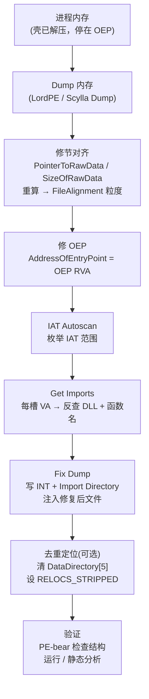

# 详解PE文件(二十九)：PE 修复与重建

> [!abstract] TL;DR
> 脱壳后得到的内存转储（memory dump）是"内存视图"，不能直接运行——节偏移/对齐不符合文件格式、导入表 IAT 里存的是已解析的真实地址而非函数名。PE 修复就是把内存视图**还原成合法的磁盘文件视图**：修节对齐（SectionAlignment→FileAlignment）、重建导入表（枚举 IAT→反查模块与函数→写 INT/THUNK）、修 OEP、酌情去重定位（.reloc）。主流工具链：Scylla、Import REConstructor、PE-bear、CFF Explorer、LordPE。

## 概述与定位

脱壳（unpacking）的终态是把还原后的原始代码从进程内存中**取出并保存为磁盘文件**。这一操作通称"dump"（转储）。dump 完成后得到的文件在逆向分析链条上处于以下位置：

```text
原始 PE（已加壳）
    │  运行并解压自身
    ▼
进程内存（原始代码已还原）
    │  Dump（OEP 处/壳解压完成后）
    ▼
内存视图文件（"broken PE"）
    │  PE 修复 ← 本篇主题
    ▼
可运行 / 可静态分析的重建 PE
```

内存视图文件有三类核心问题：

1. **节偏移与对齐不符**：文件加载到内存时，Windows 加载器把每个节按 `SectionAlignment`（通常 0x1000）对齐映射；dump 时直接按内存地址连续写出，得到的节在文件里的位置与节表头的 `PointerToRawData` 字段已不一致，且节间距仍是内存对齐粒度而非文件对齐粒度（通常 0x200）。
2. **导入表 IAT 已被解析**：原始 PE 的 IAT 槽位存放的是指向 `IMAGE_IMPORT_BY_NAME` 的 RVA（或序号）；加载器调用 `LoadLibrary`/`GetProcAddress` 后，IAT 被原地填入函数真实地址（虚拟地址）。dump 出来的 IAT 里是一堆 `7FFxxx` 之类的地址，静态分析工具/加载器无法还原函数名。
3. **OEP 错误**：若 dump 时机不对，`AddressOfEntryPoint` 字段仍指向壳的入口而非原始代码入口点（OEP）。
4. **重定位表可能多余**：dump 后文件通常固定在某个 ImageBase，`.reloc` 节已无意义，可安全删除以简化分析（也可保留）。

本篇深度覆盖这四个问题的原理与修复方法，并介绍工具链的实战用法。

## 原理与机制

### 内存视图 vs 文件视图

Windows PE 加载器（`ntdll!LdrLoadDll` 下层的 `ntdll!LdrpMapImage`）在把 PE 映射进进程时，执行以下关键转换：

| 文件视图字段 | 内存视图对应 | 说明 |
|---|---|---|
| `PointerToRawData`（文件偏移） | `VirtualAddress`（RVA） | 加载器按 RVA 映射，节在内存中的偏移 ≠ 文件偏移 |
| `SizeOfRawData`（文件大小） | `Misc.VirtualSize`（内存大小） | 内存中按 VirtualSize 清零 |
| `FileAlignment`（磁盘对齐） | `SectionAlignment`（内存对齐） | 典型值分别为 0x200 和 0x1000 |

dump 时读进程内存，直接把映射后的页面按顺序写文件，等于把内存视图"截图"到磁盘。此时文件中每个节的实际偏移是 `ImageBase + VirtualAddress`（按 SectionAlignment 对齐），而节表头中的 `PointerToRawData` 仍是旧值（或 0），两者对不上。

### IAT 重建原理

进程加载完成后，IAT 的每个槽里存的是函数绝对地址（VA）。IAT 重建工具的工作流程：

1. **扫描 IAT 区域**：从 `Import Directory`（如果还在）或手动指定的 IAT 范围中，读出每个非零的 VA。
2. **反查所属模块与函数**：对每个 VA，调用 `EnumProcessModules` + `GetModuleInformation` 确定其属于哪个 DLL（按地址落入 `base..base+SizeOfImage` 判断）；再遍历该 DLL 的导出表，匹配地址→函数名（或序号）。
3. **写 INT（Import Name Table）**：重建 `IMAGE_IMPORT_BY_NAME` 结构，为每个函数写好 Hint + 函数名。
4. **写新的 Import Directory**：为每个模块写一个 `IMAGE_IMPORT_DESCRIPTOR`，并让 OriginalFirstThunk 指向 INT、FirstThunk 指向对应 IAT 槽，使加载器能重新解析。

以上流程被 Scylla（全称 Scylla Hide + Scylla Imports Rebuild）等工具自动化执行。

### OEP 定位原理

OEP 是壳把控制权交还给原始代码的跳转目标。常见找法：

- **ESP 定律**：壳入口通常先 `PUSHAD` 保存寄存器，解压完成后 `POPAD` + `JMP OEP`。在 ESP 处设硬件断点（访问断点 on write → 弹出时命中），此时 JMP 的目标即 OEP。
- **内存断点法**：在解压目标节设置内存执行断点，壳第一次跳入时即 OEP。
- **TLS 回调**：部分壳利用 TLS 在 OEP 前执行代码，需先过 TLS 才能找到真 OEP。

找到 OEP 后，把其 RVA 写入 `AddressOfEntryPoint` 字段。

## 结构/算法/伪代码详解

### 修节对齐算法

dump 后文件中，各节按 `SectionAlignment`（0x1000）为粒度排列。修复时需把间距压缩到 `FileAlignment`（0x200），同步更新节表头字段。

```python
# 伪代码：修节对齐（内存视图 → 文件视图）
def fix_section_alignment(dump_bytes, section_headers, file_alignment=0x200):
    output = bytearray()
    # 1. 先把 PE 头（到第一个节之前的部分）原样保留
    first_raw = min(s.PointerToRawData for s in section_headers if s.PointerToRawData > 0)
    output += dump_bytes[:first_raw]

    current_file_offset = align_up(len(output), file_alignment)

    for sec in section_headers:
        if sec.SizeOfRawData == 0:
            # 跳过 .bss 类型节（文件中不占空间）
            sec.PointerToRawData = 0
            continue

        # 从 dump 中读出该节（按内存中实际位置）
        mem_offset = sec.VirtualAddress  # dump 按 RVA 写出时 offset == RVA
        raw_data = dump_bytes[mem_offset : mem_offset + sec.SizeOfRawData]

        # 对齐到 FileAlignment
        current_file_offset = align_up(current_file_offset, file_alignment)
        sec.PointerToRawData = current_file_offset  # 更新节表字段

        # 填充到对齐边界
        padded = raw_data + b'\x00' * (align_up(len(raw_data), file_alignment) - len(raw_data))
        output[current_file_offset : current_file_offset + len(padded)] = padded
        current_file_offset += len(padded)

    # 2. 更新可选头
    opt_header.SizeOfImage = align_up(max(s.VirtualAddress + s.Misc.VirtualSize
                                          for s in section_headers), section_alignment)
    return bytes(output)

def align_up(value, alignment):
    return (value + alignment - 1) & ~(alignment - 1)
```

### 重建导入表算法

```python
# 伪代码：IAT 重建核心逻辑（在调试器内 / IAT 扫描器内运行）
def rebuild_imports(process_handle, iat_rva, iat_size, image_base):
    imports = {}  # dll_name -> [(func_name_or_ord, iat_slot_rva), ...]

    # 1. 枚举 IAT 槽位
    for slot_offset in range(0, iat_size, PTR_SIZE):
        slot_va = read_ptr(process_handle, image_base + iat_rva + slot_offset)
        if slot_va == 0:
            continue  # NULL 终止符，跳至下一个 DLL 组

        # 2. 反查所属 DLL（遍历已加载模块的地址范围）
        dll_name, func_name, ordinal = reverse_lookup(process_handle, slot_va)

        if dll_name not in imports:
            imports[dll_name] = []
        imports[dll_name].append((func_name, ordinal, iat_rva + slot_offset))

    # 3. 构建新的 Import Directory + INT + IAT thunks
    new_section = bytearray()
    descriptors = []

    for dll_name, funcs in imports.items():
        int_rva = append_int(new_section, funcs)       # IMAGE_IMPORT_BY_NAME 数组
        iat_thunk_rva = iat_rva                         # 指向原 IAT（保持不变）
        name_rva = append_string(new_section, dll_name) # DLL 名字字符串

        descriptors.append(IMAGE_IMPORT_DESCRIPTOR(
            OriginalFirstThunk = int_rva,
            TimeDateStamp      = 0,
            ForwarderChain     = 0xFFFFFFFF,
            Name               = name_rva,
            FirstThunk         = iat_thunk_rva,
        ))

    # 4. 写 null terminator descriptor
    descriptors.append(IMAGE_IMPORT_DESCRIPTOR.null())
    # 5. 更新 Data Directory[1]（Import Directory RVA + Size）
    return new_section, descriptors
```

### 修复 OEP 与可选头

在 dump 文件上，用十六进制编辑器或工具直接改 `OptionalHeader.AddressOfEntryPoint`（相对 PE 签名偏移 0x28）。

```text
PE 文件布局（相关偏移）：
e_lfanew → PE\0\0（4B）
           + COFF File Header（20B）
           + Optional Header 起始：
             Magic（2B）、MajorLinkerVersion（1B）、MinorLinkerVersion（1B）、
             SizeOfCode（4B）、...、AddressOfEntryPoint（4B）← 偏移 +0x28
             BaseOfCode（4B）、ImageBase（4B/8B for PE32+）、
             SectionAlignment（4B）、FileAlignment（4B）、...、SizeOfImage（4B）
```

### 去除重定位表

若 dump 时 `ImageBase` 固定（ASLR 关闭或用 LordPE 固定），可通过如下方式去重定位：

1. 清空 `IMAGE_OPTIONAL_HEADER.DataDirectory[5]`（Base Relocation Directory）的 RVA 和 Size（均置 0）。
2. 在 `IMAGE_FILE_HEADER.Characteristics` 中设置 `IMAGE_FILE_RELOCS_STRIPPED`（bit 0）。
3. 可选：把 `.reloc` 节的 `SizeOfRawData` 置 0（彻底裁掉）。

若需要文件能在随机基址加载，则必须保留重定位表（或手动重建）。

## 工具视角与实战

### 工具链总览

| 工具 | 主要用途 | 特点 |
|---|---|---|
| **Scylla** | IAT 重建 + dump | 开源，支持 32/64 位，集成自动扫描 + 手动 IAT 编辑，内置 PE 修复 |
| **Import REConstructor (ImpREC)** | IAT 重建（32 位） | 老牌工具，对复杂壳支持成熟，插件体系丰富 |
| **LordPE** | dump + 节对齐修复 + 可选头编辑 | GUI，可直接在进程列表中选目标 dump |
| **PE-bear** | PE 头静态编辑验证 | 可视化节表/目录/字段，修复后验证用 |
| **CFF Explorer** | 全字段编辑 | 支持导入表/导出表可视化修改 |
| **x64dbg + Scylla 插件** | 配合调试器一键修复 | Scylla 以插件形式嵌入 x64dbg，OEP 停下即可一键 IAT Autoscan + Fix Dump |

### Scylla 实战流程（x64dbg 集成）

```text
step 1: 用 x64dbg 加载壳程序，运行到 OEP（停在原始代码入口，见 [[28-详解PE文件(二十八)PE脱壳基础]]）
step 2: 打开 Scylla 插件（Plugins → Scylla）
step 3: 确认 OEP 字段已填入正确的 OEP RVA（如 0x401000）
step 4: 点击 "IAT Autoscan" → Scylla 自动定位 IAT 范围
step 5: 点击 "Get Imports" → 枚举所有 IAT 槽，列出 DLL + 函数名
         若有 "invalid" 项（函数反查失败），手动修复或用 Trace 功能追溯
step 6: 点击 "Dump" → 选择保存路径，得到 dumped.exe（节对齐由 Scylla 自动修复）
step 7: 点击 "Fix Dump" → 选中 dumped.exe，Scylla 将重建的导入表注入文件
step 8: 用 PE-bear 打开修复后文件，确认：
         - Import Directory RVA/Size 有效
         - 所有 DLL 均可解析
         - AddressOfEntryPoint 指向正确位置
step 9: 双击或 LoadLibrary 测试能否正常加载
```

### Mermaid：PE 修复完整流程



### 常见问题排查

**问题 1：IAT Autoscan 找不到 IAT**

原因：壳可能使用了 **IAT 加密**（IAT obfuscation）——每个槽里存的不是直接 VA，而是经过异或/加法的间接地址，或跳转 thunk 序列。

处理：手动在调试器中跟踪第一个 API 调用，找到真正的 IAT 槽位范围，在 Scylla 中手动填写 `IAT Address` 和 `Size`。

**问题 2：部分导入函数显示 "Invalid"**

原因：该 VA 属于 forwarded export（转发导出）或壳私有 hook DLL，反查时匹配不到标准 DLL。

处理：用 x64dbg 的 `bp` 在该 IAT 槽的调用处下断，看调用链；或接受 Invalid 项（用序号代替名字）。

**问题 3：修复后文件崩溃**

排查顺序：
1. OEP 是否正确（在原始代码节内，而非壳节）；
2. 节对齐是否已修复（用 PE-bear 确认 `PointerToRawData` 是否为 0x200 的倍数）；
3. 导入目录是否完整（空 `OriginalFirstThunk` 或 `Name` RVA 为 0 会导致加载器崩溃）；
4. `SizeOfImage` 是否更新（必须 ≥ 最后一个节的 `VirtualAddress + VirtualSize`，按 SectionAlignment 对齐）。

## 安全性与正确使用

> [!caution] 法律与合规边界
> PE 修复技术本质上是逆向工程的一个环节，具有双重用途。以下场景属于**合法且受认可**的使用：
> - **CTF（Capture The Flag）竞赛**：题目通常明确授权参赛者对二进制进行完整逆向。
> - **授权渗透测试 / 安全评估**：在书面授权下对目标软件进行分析，修复 dump 以便深入评估。
> - **自有软件调试**：分析自己开发或拥有完整版权的软件，无任何限制。
> - **恶意软件分析（沙箱/隔离环境）**：安全研究人员在受控隔离环境中分析恶意样本，修复其内存 dump 以提取 IoC/行为特征，属于防御性研究。
> - **学术研究**：用于论文发表、技术文档编写等学术目的。
>
> **严禁**将此技术用于：绕过正版授权保护（破解商业软件）、分发脱壳后的版权内容、对未经授权的目标进行分析。违反者可能承担《计算机信息系统安全保护条例》或 CFAA（美国）等相关法律责任。

从防御角度，理解 PE 修复的完整流程有助于软件开发者：
- 评估商业壳（UPX、Themida、VMProtect）的防脱壳强度；
- 在 IAT 加密、OEP 混淆、代码虚拟化等保护手段之间做出合理选择；
- 为自己的产品设计更难被 dump + 修复的保护策略。

## 小结

PE 修复与重建是脱壳流程的最后一公里，也是最容易出错的环节。核心要点：

- **内存视图与文件视图的本质差异**在于对齐粒度（SectionAlignment vs FileAlignment）和 IAT 状态（已解析 VA vs 待解析 RVA/名字），两者必须分别修复。
- **重建导入表**（IAT 枚举 → 反查 → 写 INT + 目录）是技术难点，Scylla 的 IAT Autoscan + Get Imports 流程覆盖了 90% 的场景；复杂壳需要手动干预。
- **修 OEP** 和**修 SizeOfImage** 是最易遗漏的步骤，但对可运行性至关重要。
- **工具链组合**：Scylla 做 dump + IAT 修复，PE-bear / CFF Explorer 做精细验证与手动调整，LordPE 处理特殊 dump 场景。

## 相关阅读

- [[08-详解PE文件(八)：导入表]]（导入表结构原理：Import Directory、INT、IAT、IMAGE_IMPORT_BY_NAME）
- [[24-详解PE文件(二十四)：节表]]（节表字段：PointerToRawData、SizeOfRawData、VirtualAddress、Characteristics）
- [[28-详解PE文件(二十八)PE脱壳基础]]（脱壳前置：OEP 定位、ESP 定律、dump 时机选择）
- [[06-详解PE文件(六)：可选头]]（SectionAlignment / FileAlignment / SizeOfImage 来源）
- [[13-详解PE文件(十三)：基址重定位表]]（.reloc 节结构，去重定位的判断依据）

---

← 上一篇：[[28-详解PE文件(二十八)PE脱壳基础]]　｜　[[00-合集总览-PE文件详解|📚 返回合集总览]]　｜　下一篇：[[30-详解PE文件(三十)畸形PE与边界]] →
