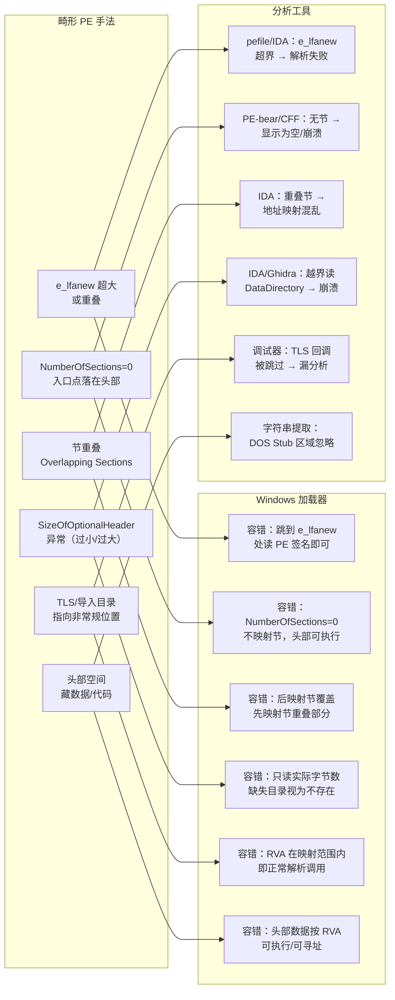

# 详解PE文件(三十)：畸形 PE 与边界测试

> [!abstract] TL;DR
> 畸形 PE（malformed PE）是故意违反 PE 规范的可执行文件——`e_lfanew` 超大、节表为空、节重叠、可选头尺寸异常、入口点落在文件头部……这些违规字段能让 PE-bear、IDA、pefile 等分析工具崩溃或误判，却仍可被 Windows 加载器正常执行，因为加载器对许多字段具有惊人的容错性（只关心"够用"而非"合规"）。理解畸形 PE 是对抗分析的进阶技术，也是研究加载器行为与工具健壮性的重要切入点。

## 概述与定位

PE 规范（Microsoft PE/COFF Specification）定义了一套严格的格式约束，但 Windows 可执行加载器（`ntdll!LdrLoadDll` → `ntdll!LdrpMapImage`）的实现历史比规范更久远，且以"能跑"为最高优先级。加载器在许多地方对"不合规但可解析"的字段静默容错，导致现实中存在大量合法运行但工具无法正确解析的"畸形 PE"。

这类文件在以下场景中出现：

1. **反静态分析**：恶意软件故意引入畸形字段，使 IDA/Ghidra/pefile 无法自动解析，人工分析成本倍增。
2. **反沙箱逃逸**：某些沙箱的 PE 解析层比 Windows 加载器更严格，畸形 PE 在沙箱中"加载失败"（检测无法启动的程序），在真实环境中正常运行，形成绕过。
3. **漏洞研究**：畸形 PE 是探测加载器边界行为的标准手段，历史上多个 Windows 内核漏洞（如解析 PE 头时的整数溢出）通过此类文件触发。
4. **最小 PE（tinype）**：学术/CTF 场景中故意裁剪 PE 到最小可执行尺寸，极限测试加载器的必要字段集合。

本篇系统梳理常见畸形手法、加载器容错行为，以及各类工具面对畸形 PE 时的典型失败模式。

## 原理与机制

### Windows 加载器的容错哲学

加载器在处理 PE 头时并非逐字段校验，而是按照"需要时才读，不需要就忽略"的懒惰策略。以下列出关键字段的真实处理方式：

| 字段 | 严格合规值 | 加载器实际行为 |
|---|---|---|
| `e_lfanew`（DOS 头偏移） | 指向 PE 签名，≤文件大小 | 只要 `e_lfanew` 处能读到 `"PE\0\0"` 即通过，值超大但仍在文件内也被接受 |
| `SizeOfOptionalHeader` | 标准 PE32=0xE0，PE32+=0xF0 | 加载器只读到实际有的字节，超出部分视为 0；若小于最小必要尺寸则拒绝 |
| `NumberOfSections` | 反映实际节数量 | 加载器直接按此值迭代节表，值为 0 则无节（可执行代码全塞在 PE 头空间内）；极大值只要不超出文件范围就接受 |
| `Characteristics`（文件头标志） | 各位有明确语义 | 部分位被忽略；`IMAGE_FILE_RELOCS_STRIPPED` 等不影响加载本身 |
| `AddressOfEntryPoint` | 指向 .text 内有效代码 | 可以指向任何已映射内存，包括 PE 头本身（入口点落在头部） |
| `SizeOfImage` | ≥最后节末尾，按 SectionAlignment 对齐 | 若偏小，加载器可能截断映射；若偏大，多出部分填零——不直接拒绝 |
| `DataDirectory[x].VirtualAddress` | 指向合法结构 | 为 0 视为"不存在"，直接跳过；非零但指向无效位置会在访问时崩溃（而非加载时检测） |
| `TimeDateStamp` | 链接时间戳 | 完全忽略 |
| `CheckSum`（可选头校验和） | CRC 校验值 | 驱动（`.sys`）强制校验；普通 EXE/DLL 完全忽略 |

### e_lfanew 重叠与超大值

正常 PE 中 `IMAGE_DOS_HEADER.e_lfanew`（偏移 0x3C，4 字节 LE）指向 `"PE\0\0"` 签名。畸形手法：

- **e_lfanew 极大**：只要 `e_lfanew` 仍在文件范围内，加载器直接跳到该偏移读 PE 签名，中间的 DOS Stub 字节被完全忽略（或用来藏数据）。
- **e_lfanew 与节表重叠**：让 PE 头区域与某个节的数据区重叠，同一字节在 DOS/PE 头语义和节数据语义下被双重解读——工具通常处理的是线性扁平结构，重叠会导致重复解析或越界。
- **e_lfanew 指向 DOS Stub 内部**：PE 签名嵌在 DOS Stub 中，而非追加在末尾——合法，只要地址处确实是 `"PE\0\0"`。

### 节数量为 0 与 tiny PE

`NumberOfSections = 0` 意味着节表为空，加载器不映射任何节。代码从哪里来？直接放在 PE 头之后（即 `SizeOfHeaders` 覆盖的范围内）。加载器映射头时会把 `SizeOfHeaders` 范围的字节映射为可读，若 `AddressOfEntryPoint` 指向头部区域内，即可执行。

最著名的 tiny PE 记录（32 位 Windows XP）仅 **97 字节**，包含完整的 DOS 头、PE 签名、COFF 头、可选头，且能弹出 MessageBox（通过找 kernel32 基址 + 手动 GetProcAddress）。

```text
最小 PE（概念示意）：
Offset 0x00  DOS 头（必须含 e_magic=MZ，e_lfanew 指向 offset 0x28 或更小）
Offset 0x28  PE 签名 + COFF 头 + 精简 OptionalHeader
             AddressOfEntryPoint → 指向 offset 0x78（头部内）
             SizeOfHeaders = 0x200（映射时包含头部代码）
             NumberOfSections = 0
Offset 0x78  实际机器码（藏在"头"的末尾空间）
```

### 节重叠（Overlapping Sections）

两个节的虚拟地址范围在内存中交叉。规范明确禁止，但加载器按节表顺序映射，后映射的节会覆盖前一节与之重叠的部分。

```text
节 A：VirtualAddress=0x1000, VirtualSize=0x3000（占 0x1000~0x4000）
节 B：VirtualAddress=0x2000, VirtualSize=0x2000（占 0x2000~0x4000，与 A 重叠）

加载顺序：
  1. 映射节 A → 内存 0x1000~0x4000
  2. 映射节 B → 写入 0x2000~0x4000（覆盖节 A 的后半段）

结果：
  0x1000~0x2000 = 节 A 独有部分（未被覆盖）
  0x2000~0x4000 = 节 B 内容（覆盖了节 A 的对应范围）
```

工具通常按节表绘制"地图"，重叠节会导致地图不一致，部分工具直接报错退出。

### SizeOfOptionalHeader 异常

`IMAGE_FILE_HEADER.SizeOfOptionalHeader` 告诉加载器可选头有多少字节。畸形手法：

- **偏小**（如 0x60，比标准 0xE0 小）：加载器只读到 0x60 字节的可选头，DataDirectory 数组可能只有部分甚至完全缺失——加载器视缺失目录为"不存在"，跳过；但 IDA 等工具通常按 Magic（PE32/PE32+）决定偏移，若 `SizeOfOptionalHeader` 过小，读 DataDirectory 会越界。
- **偏大**：加载器忽略多余字节，但节表的起始偏移会被推远（节表紧跟在可选头之后），若推出文件边界则加载失败。
- **SizeOfOptionalHeader = 0**：加载器无法确定 PE 类型（PE32 or PE32+），直接拒绝。

### 入口点落在 PE 头部

`AddressOfEntryPoint`（RVA）指向 0x0000~SizeOfHeaders 范围内，即 PE 头映射区域。加载器不检查入口点是否在合法的代码节内，只要该 RVA 在映射范围内（且页面有执行权限），即正常跳入。

常见恶意软件技巧：把 shellcode 写入 DOS Stub（偏移 0x02~0x3B，共 60 字节），把 `e_lfanew` 推到后面，让 OEP 指向这 60 字节的 DOS Stub 区域执行代码。IDA 通常不对 DOS Stub 区域进行反汇编。

### TLS/导入目录指向可疑位置

- **TLS 回调（Thread Local Storage）**：在 `AddressOfEntryPoint` 执行之前，加载器会调用所有 TLS 回调函数。若 `DataDirectory[9]`（TLS Directory）指向有效的 `IMAGE_TLS_DIRECTORY` 并包含非空的 `AddressOfCallBacks` 数组，这些回调先于 main 执行——且调试器通常默认停在 OEP 而非 TLS，会错过这部分代码。
- **导入目录 RVA 指向头部**：将 `IMAGE_IMPORT_DESCRIPTOR` 数组放在 DOS Stub 或 PE 头空白区，利用加载器"只要地址在映射范围内就解析"的特性，让导入表隐藏在工具不会重点分析的区域。

### 头部冗余空间藏数据

标准 PE 的 DOS Stub 只需到 `e_lfanew` 处，但 `e_lfanew` 可以设置得很大，使 DOS Stub 区域扩大到数 KB。多余空间可以：
- 藏额外的导入函数名（如果在正式导入表之外额外写一份 fake 导入表迷惑工具）；
- 藏加密后的 payload（TLS 回调解密并跳入）；
- 藏反调试字符串（让字符串搜索产生误导）。

## 结构/算法/伪代码详解

### 加载器容错 vs 分析器失败对比（Mermaid）



### 检测畸形 PE 字段的伪代码

```python
# 伪代码：畸形 PE 检测器（静态分析安全工具的核心逻辑片段）
def detect_malformed_pe(data: bytes) -> list[str]:
    warnings = []
    file_size = len(data)

    # 1. DOS 头检查
    e_magic = read_u16(data, 0)
    if e_magic != 0x5A4D:  # "MZ"
        return ["Not a PE file"]

    e_lfanew = read_u32(data, 0x3C)
    if e_lfanew + 4 > file_size:
        warnings.append(f"e_lfanew=0x{e_lfanew:X} 超出文件边界，无法读 PE 签名")
        return warnings

    # 2. PE 签名
    pe_sig = data[e_lfanew:e_lfanew+4]
    if pe_sig != b'PE\x00\x00':
        warnings.append(f"PE 签名无效：{pe_sig!r}")

    coff_off = e_lfanew + 4
    num_sections  = read_u16(data, coff_off + 2)
    size_opt_hdr  = read_u16(data, coff_off + 16)
    characteristics = read_u16(data, coff_off + 18)

    # 3. SizeOfOptionalHeader 边界
    opt_off = coff_off + 20
    if opt_off + size_opt_hdr > file_size:
        warnings.append("SizeOfOptionalHeader 超出文件大小")
    if size_opt_hdr < 0x60:
        warnings.append(f"SizeOfOptionalHeader={size_opt_hdr:#x} 过小，DataDirectory 可能缺失")

    # 4. 节表位置
    section_table_off = opt_off + size_opt_hdr
    if section_table_off + num_sections * 40 > file_size:
        warnings.append(f"节表（{num_sections} 个节 × 40B）超出文件边界")

    # 5. 节重叠检测
    sections = [(read_u32(data, section_table_off + i*40 + 12),  # VirtualAddress
                 read_u32(data, section_table_off + i*40 + 8))   # VirtualSize
                for i in range(num_sections)]
    for i in range(len(sections)):
        for j in range(i+1, len(sections)):
            va_i, vs_i = sections[i]
            va_j, vs_j = sections[j]
            if va_i < va_j + vs_j and va_j < va_i + vs_i:
                warnings.append(f"节 {i} 与节 {j} 在虚拟地址空间重叠")

    # 6. 入口点检查
    if size_opt_hdr >= 0x28:
        magic = read_u16(data, opt_off)
        ep_off = opt_off + 0x10  # AddressOfEntryPoint 在 OptionalHeader+16
        ep_rva = read_u32(data, ep_off)
        size_hdrs = read_u32(data, opt_off + 0x3C) if size_opt_hdr >= 0x40 else 0
        if ep_rva < size_hdrs:
            warnings.append(f"入口点 RVA={ep_rva:#x} 落在 PE 头部（SizeOfHeaders={size_hdrs:#x}）")

    return warnings
```

### tinype 最小可执行 PE 结构（示意）

```text
偏移   大小  字段           值           说明
0x00   2    e_magic         4D 5A       "MZ"
0x02   2    e_cblp          00 00       （可随意）
...（其余 DOS 头字段置零）
0x3C   4    e_lfanew        40 00 00 00 PE 头在偏移 0x40
0x40   4    PE 签名         50 45 00 00 "PE\0\0"
0x44   2    Machine         4C 01       IMAGE_FILE_MACHINE_I386
0x46   2    NumberOfSections 00 00      无节！
0x48   4    TimeDateStamp   00 00 00 00
0x4C   4    PointerToSymbolTable 00 ..
0x50   4    NumberOfSymbols 00 ..
0x54   2    SizeOfOptionalHeader E0 00  标准大小
0x56   2    Characteristics  02 01      EXECUTABLE | 32BIT
0x58   2    Magic            0B 01      PE32
0x5A   2    LinkerVersion    00 00
0x5C   4    SizeOfCode       实际代码大小
... （其余可选头字段）
0x70   4    AddressOfEntryPoint → 指向 0xC0（头部内的代码区）
0x78   4    ImageBase        00 00 40 00
... DataDirectory 均为 0 ...
0xC0   N    机器码（藏在 SizeOfHeaders 覆盖的头部末尾）
            xor eax, eax
            push eax
            ...（用 PEB→kernel32→GetProcAddress 获取 API 地址）
            ret
```

## 工具视角与实战

### 各工具对畸形 PE 的健壮性

| 工具 | e_lfanew 超大 | 节数=0 | 节重叠 | SizeOfOptHdr 异常 | 入口在头部 |
|---|---|---|---|---|---|
| **PE-bear** | 通常处理，显示警告 | 显示空节表 | 可能显示重叠警告 | 显示实际读到的字节 | 显示异常 OEP 但不崩溃 |
| **CFF Explorer** | 处理（老版本偶有崩溃） | 正常显示空节 | 可能混淆地址 | 读到 SizeOfOptHdr 为止 | 显示 OEP 字段值 |
| **IDA Pro** | 解析失败 / 询问手动修复 | 通常可加载 | 节地址映射混乱 | 越界读 DataDirectory | 可分析但自动化分析跳过头部 |
| **Ghidra** | 报错后尝试修复 | 可加载 | 部分版本崩溃 | 越界读并报错 | 默认不把头部区域加入反汇编 |
| **pefile（Python）** | `PEFormatError` 异常 | 正常解析（无节） | `PEFormatError` 或 Warning | `PEFormatError` 越界 | `.dump_info()` 给出警告 |
| **objdump** | 拒绝解析 | 通常拒绝 | 段错误 | 拒绝 | 部分版本接受 |

### PE-bear 的畸形 PE 实战

PE-bear 是目前对畸形 PE 健壮性最好的免费工具：
- 对每个异常字段单独弹出警告框，不因一个错误中断整个解析；
- 可视化显示每个节的文件偏移 vs 虚拟地址，重叠节以红色高亮；
- 手动编辑任意字段，可用于构造畸形 PE 做测试；
- 支持"修复"操作：自动对齐节偏移、修正 SizeOfImage 等。

### pefile 的健壮模式

```python
import pefile

# 普通模式（遇到畸形字段报错）
try:
    pe = pefile.PE("malformed.exe")
except pefile.PEFormatError as e:
    print(f"解析失败：{e}")

# 快速加载模式（尽力解析，忽略部分错误）
pe = pefile.PE("malformed.exe", fast_load=True)
pe.parse_data_directories()  # 按需解析目录

# 获取所有警告（不报错但记录异常）
for warning in pe.get_warnings():
    print(f"[!] {warning}")
```

### 构造畸形 PE 做工具测试

安全研究人员常用以下脚本框架批量生成畸形变体进行工具 fuzz：

```python
import copy, pefile

def fuzz_pe_field(original_path: str, mutations: dict, output_path: str):
    """
    mutations 示例：
      {"e_lfanew": 0x1000, "NumberOfSections": 0, "AddressOfEntryPoint": 0x40}
    """
    with open(original_path, "rb") as f:
        data = bytearray(f.read())

    pe = pefile.PE(data=bytes(data), fast_load=True)

    for field, value in mutations.items():
        if field == "e_lfanew":
            # DOS 头偏移 0x3C，4 字节 LE
            data[0x3C:0x40] = value.to_bytes(4, "little")
        elif field == "NumberOfSections":
            coff_off = int.from_bytes(data[0x3C:0x40], "little") + 4
            data[coff_off+2:coff_off+4] = value.to_bytes(2, "little")
        elif field == "AddressOfEntryPoint":
            e_lfanew = int.from_bytes(data[0x3C:0x40], "little")
            opt_off = e_lfanew + 4 + 20
            data[opt_off+0x10:opt_off+0x14] = value.to_bytes(4, "little")
        # ... 其他字段

    with open(output_path, "wb") as f:
        f.write(data)
```

## 安全性与正确使用

> [!caution] 研究目的与合规边界
> 畸形 PE 技术具有明确的双刃剑属性：
>
> **合法用途（明确允许）**：
> - 工具健壮性研究：测试 IDA、Ghidra、pefile 等工具对异常输入的处理能力，提交漏洞报告以改善工具质量。
> - 加载器行为研究：在个人/测试机器上探索 Windows PE 加载器的容错边界，用于论文或技术分享。
> - CTF 比赛：许多 CTF 题目使用畸形 PE 作为反分析手段，参赛者被明确授权分析。
> - 反病毒/EDR 能力验证：安全产品厂商测试自己产品对畸形 PE 的检测能力。
> - 自有软件保护研究：探索对自己软件引入轻量级反分析保护（需评估合规性）。
>
> **严禁**：将畸形 PE 技术用于制造绕过安全软件的恶意程序、向未授权目标投递恶意载荷，或利用加载器解析漏洞进行提权/远程代码执行（违反相关法律）。
>
> 防御建议：安全工程师在分析可疑样本时，应首先用 PE-bear 或 pefile 的 `get_warnings()` 检测畸形字段，将畸形程度作为可疑度评分的重要指标。正常软件极少使用不合规字段，存在多处畸形字段的可执行文件应提升分析优先级。

## 小结

畸形 PE 是 PE 格式规范与 Windows 加载器实现之间"间隙"的产物。理解这片间隙，需要同时掌握：

- **规范**（Microsoft PE/COFF Spec）——定义了什么是"合法"；
- **加载器实现**（ntdll 内部逻辑）——定义了什么是"可运行"；
- **工具实现**（IDA/Ghidra/pefile 等）——定义了什么是"可分析"。

三者并不完全重叠。关键要点：

- `e_lfanew`、`NumberOfSections`、`SizeOfOptionalHeader`、`AddressOfEntryPoint` 是最常被利用的畸形字段，加载器对它们有明显容错，工具普遍脆弱。
- 节重叠与头部藏代码是两种最实用的反分析技术，能有效迷惑自动化分析流程。
- PE-bear 是目前对畸形 PE 健壮性最好的免费静态分析工具；pefile 的 `fast_load + get_warnings()` 是脚本化批量检测的最佳选择。
- 最小 PE（tinype）是理解"加载器必需字段最小集"的极好学习材料。

## 相关阅读

- [[01-详解PE文件(一)：PE文件基础概念]]（PE 整体结构，字段布局基础）
- [[05-详解PE文件(五)：COFF文件头]]（NumberOfSections、SizeOfOptionalHeader、Characteristics 字段详解）
- [[06-详解PE文件(六)：可选头]]（AddressOfEntryPoint、SizeOfImage、SizeOfHeaders、DataDirectory 字段）
- [[29-详解PE文件(二十九)PE修复与重建]]（dump + IAT 修复，与畸形 PE 互为补充的对抗流程）
- [[11.ELF文件详解/64.ELF损坏修复与手工重建]]（ELF 格式的类似畸形/修复场景，横向对比）

---

← 上一篇：[[29-详解PE文件(二十九)PE修复与重建]]　｜　[[00-合集总览-PE文件详解|📚 返回合集总览]]
