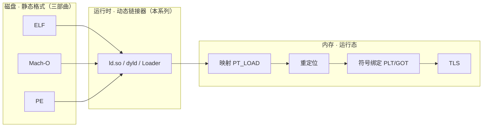

# 动态链接与加载器详解 · 系列总览

> 作者原创系列，共 **22** 篇。本系列承接 [[11.ELF文件详解/00.ELF文件详解总览|ELF]]、[[12.Mach-O文件详解/00.Mach-O文件详解总览|Mach-O]]、[[13.PE文件详解/00-合集总览-PE文件详解|PE]] 三部曲——三部曲讲"可执行文件躺在磁盘上的**静态结构**"，本系列讲它"如何被**加载进内存、链接、重定位、最终跑起来**"。全程贯穿 Linux `ld.so` / macOS `dyld` / Windows Loader 三平台对照。

## 一、基础与全景

理解动态链接的动机，以及"从 `exec`/双击到第一条用户指令"之间到底发生了什么。

| # | 章节 | 说明 |
| --- | --- | --- |
| 01 | [[01.从静态链接到动态链接]] | 静态 vs 动态链接；`.so`/`.dylib`/`.dll` 三平台产物与五维权衡 |
| 02 | [[02.程序加载全景]] | `execve`/`CreateProcess` → 内核映射 → 交棒动态链接器 → `main` |
| 03 | [[03.动态链接器是谁]] | `ld.so` / `dyld` / `ntdll` Loader 的身份、定位与自举(self-relocation) |

## 二、加载过程

可执行文件与其依赖如何被映射进地址空间、依赖库与符号如何被找到。

| # | 章节 | 说明 |
| --- | --- | --- |
| 04 | [[04.可执行文件的内存映射]] | `PT_LOAD`/`mmap`/页对齐/写时复制；PE section→内存映射 |
| 05 | [[05.依赖解析与库搜索顺序]] | `DT_NEEDED`、`rpath`/`runpath`、Windows DLL 搜索顺序、dyld 路径 |
| 06 | [[06.符号解析与符号查找]] | 符号作用域、符号插入、`gnu_hash`、dyld 两级命名空间 |

## 三、重定位与绑定

把"占位地址"改写成"真实地址"的机制，以及函数调用的延迟绑定。

| # | 章节 | 说明 |
| --- | --- | --- |
| 07 | [[07.重定位机制详解]] | `RELATIVE`/`GLOB_DAT`/`JUMP_SLOT`、PE 基址重定位、dyld chained fixups |
| 08 | [[08.PLT与GOT与延迟绑定]] | `_dl_runtime_resolve` 全流程、PLT stub、lazy vs now |
| 09 | [[09.ASLR与位置无关代码]] | PIC/PIE、ASLR、prelink、dyld shared cache |

## 四、运行时与高级

程序运行后的动态加载、初始化次序、线程本地存储与版本兼容。

| # | 章节 | 说明 |
| --- | --- | --- |
| 10 | [[10.运行时动态加载]] | `dlopen`/`dlsym` vs `LoadLibrary`/`GetProcAddress`、引用计数 |
| 11 | [[11.初始化与析构顺序]] | `.init_array`/`.fini_array`、`DllMain`、`+load`、依赖拓扑序 |
| 12 | [[12.TLS的实现]] | TLS 四种模型、`__tls_get_addr`、三平台差异 |
| 13 | [[13.符号版本与二进制兼容]] | ELF symbol versioning、`GLIBC_2.x`、Windows SxS、ABI |

## 五、对抗与实战

加载机制的攻击面、加固手段，以及动手观察整个加载过程。

| # | 章节 | 说明 |
| --- | --- | --- |
| 14 | [[14.加载器劫持]] | `LD_PRELOAD`、`DYLD_INSERT_LIBRARIES`、DLL 搜索顺序劫持/侧加载 |
| 15 | [[15.加载器视角的安全]] | RELRO、`BIND_NOW`、`ret2dl-resolve`、加固清单 |
| 16 | [[16.实战观察加载全过程]] | `LD_DEBUG`/`dyld_info`/Process Monitor、手写 mini 加载器 |

## 六、进阶专题

命名空间隔离、加载审计、IFUNC、静态 PIE，以及 musl / macOS 两条非 glibc 路线。

| # | 章节 | 说明 |
| --- | --- | --- |
| 17 | [[17.dlmopen与链接器命名空间]] | `dlmopen`、`LM_ID_NEWLM`、命名空间隔离与插件沙箱 |
| 18 | [[18.GNU_Audit接口]] | `LD_AUDIT`、`la_symbind`/`la_objopen` 回调、加载审计 |
| 19 | [[19.IFUNC间接函数]] | `STT_GNU_IFUNC`、resolver、CPU 特性分发、`R_*_IRELATIVE` |
| 20 | [[20.静态PIE]] | static-pie 自举重定位、`DT_RELR`、与普通 PIE 对比 |
| 21 | [[21.musl动态链接器]] | musl ld.so vs glibc：无 IFUNC/Audit/dlmopen/TLSDESC |
| 22 | [[22.macOS_dyld与chained_fixups]] | dyld4、`LC_DYLD_CHAINED_FIXUPS` 链式指针格式 |

## 与三部曲的衔接

> 一句话定位：三部曲是"**名词**"（文件里有哪些结构），本系列是"**动词**"（这些结构在加载运行时如何被使用）。
