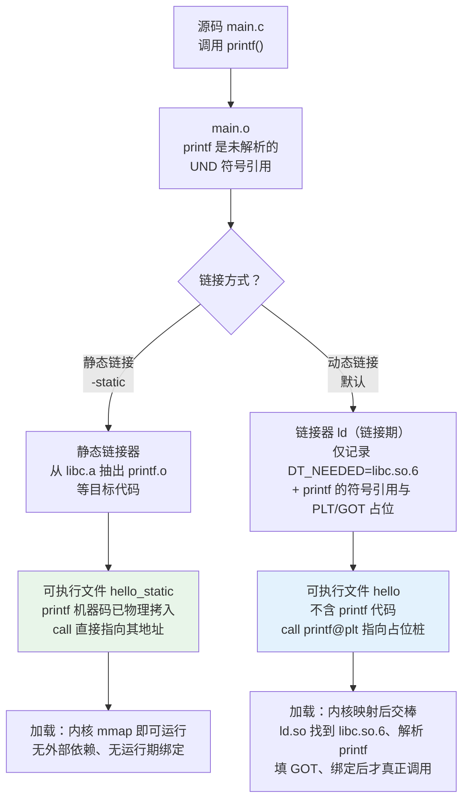

# 动态链接与加载器（1）· 从静态链接到动态链接

> [!abstract] TL;DR
> 静态链接在**链接期**把库的目标代码物理拷入可执行文件，产物自包含但臃肿、无法共享、打补丁要全量重发；动态链接在链接期**只记录"我依赖哪个库、引用哪些符号"**，把符号到地址的绑定推迟到**加载期/运行期**由动态链接器（Linux `ld.so` / macOS `dyld` / Windows Loader）完成。三平台的共享库产物分别是 `.so`（ELF）/ `.dylib`（Mach-O）/ `.dll`（PE），各自的"导入侧"产物与绑定细节差异很大。本篇是"动态链接与加载器"系列的概念基线，先把**为什么要动态链接**与**两条流水线的分叉点**讲透，后续各篇再逐环深入。

## 概述与定位

要理解动态链接，先要把它放回工具链的位置。一个 C/C++ 程序从源码到能跑起来，经历五个阶段：

```
预处理(.i) → 编译(.s) → 汇编(.o) → 链接(可执行文件) → 加载&运行
            ↑ 单文件视角                ↑ 多文件合并        ↑ 进内存、绑外部符号
```

- **编译 / 汇编**：以单个翻译单元（translation unit）为视角，把源码变成目标文件 `.o`。此时对外部符号（比如别的文件里的函数、libc 的 `printf`）只留下一个**未解析的符号引用**，并不知道它的地址。
- **链接（link）**：把多个 `.o` 和库合并，**解析这些跨文件的符号引用**，安排各段（section）在最终文件里的布局，生成可执行文件或共享库。
- **加载 & 运行（load & run）**：操作系统把可执行文件映射进新进程的地址空间，再把控制权交给程序的入口。

**静态链接与动态链接的分歧，正发生在"链接"这一环，并一路延伸到"加载&运行"。** 它们的本质区别只有一句话：

> **库的目标代码，到底是在链接期就被拷进可执行文件（静态），还是直到加载/运行期才由动态链接器去绑定（动态）？**

静态链接把"解析外部符号"这件事**全部在链接期做完**，产物里不再有任何悬空引用，加载时内核 `mmap` 一下、跳到入口即可运行。动态链接则**故意把一部分符号解析推迟**：链接器只往可执行文件里写"我需要 `libc.so.6`、我会用到里面的 `printf`"这类**元信息**，真正的地址要等程序被加载时，由一个特殊的程序——**动态链接器**——去查找、填表、绑定。

本篇在系列中的定位是**第 01 篇 / 概念基线**：

- 它回答"**为什么会有动态链接**"和"两条流水线在哪里分叉"。
- "加载&运行"这一环的细节——内核怎么映射、动态链接器是谁、依赖怎么搜、符号怎么查、重定位怎么改、函数调用怎么延迟绑定——是后续 [[02.程序加载全景]]、[[03.动态链接器是谁]] 直到 [[08.PLT与GOT与延迟绑定]] 各篇的主题。本篇只把"分叉点"和"三平台产物形态"讲清楚，为全系列搭好坐标系。

## 原理与机制

### 两条流水线的分叉

把静态与动态两条链接流水线并排画出来，分叉点一目了然：



图中要抓住三处对照（**图是增强，下面的文字才是完整信息源**）：

1. **左路（静态）**：链接器从静态库 `libc.a`（本质是一堆 `.o` 的归档 `ar`）里**抽出** `printf` 及其依赖的目标代码，**物理拷贝**进 `hello_static`。最终文件里 `call printf` 直接指向文件内 `printf` 的代码位置。产物自包含，加载即跑，运行期没有任何"绑定"动作。
2. **右路（动态）**：链接器**不拷贝任何 libc 代码**，只在可执行文件里写两类信息——① 一条"我依赖 `libc.so.6`"的记录（ELF 里是 `.dynamic` 段中的 `DT_NEEDED` 表项）；② 对 `printf` 这个外部符号的引用，以及一个**占位桩**（PLT 条目）和一个**占位地址槽**（GOT 条目）。`call` 指向的是 `printf@plt` 这个桩，而非真实的 `printf`。
3. **分叉的代价转移**：静态把成本花在**磁盘体积与升级**上，动态把成本转移到**加载期的查找与绑定**上。这正是后面"六维权衡"的根源。

### 动态链接器：被推迟工作的承接者

动态链接把"解析 `printf` 的真实地址"推迟了，那这件事最终由谁、在何时完成？答案是**动态链接器（dynamic linker / loader）**，它是一个本身也以共享库形式存在的特殊程序：

| 平台 | 动态链接器 | 典型路径 |
|---|---|---|
| Linux (glibc) | `ld-linux-x86-64.so.2`（`ld.so`） | `/lib64/ld-linux-x86-64.so.2` |
| macOS | `dyld` | `/usr/lib/dyld` |
| Windows | Loader（位于 `ntdll.dll`，由 `KERNEL32` 协同） | `C:\Windows\System32\ntdll.dll` |

它的核心职责（本篇只点到，细节见 [[03.动态链接器是谁]] 与 [[02.程序加载全景]]）：

1. **找依赖**：根据可执行文件记录的依赖列表（`DT_NEEDED` / `LC_LOAD_DYLIB` / PE 导入表），递归找到并映射所有需要的共享库——这是 [[05.依赖解析与库搜索顺序]] 的主题。
2. **查符号**：在已加载的各模块的动态符号表里查找 `printf` 这类符号的实际地址——这是 [[06.符号解析与符号查找]] 的主题。
3. **改地址（重定位）**：把查到的真实地址回填到 GOT/IAT 等"地址槽"里，让间接跳转能命中——这是 [[07.重定位机制详解]] 与 [[08.PLT与GOT与延迟绑定]] 的主题。

> [!note] "链接"一词的两次出现
> 容易混淆的是："链接器(linker, `ld`)" 和 "动态链接器(dynamic linker, `ld.so`)" 是**两个不同的程序**。前者在**构建期**跑，把 `.o` 合并成可执行文件；后者在**运行期**跑，由内核在加载阶段拉起，负责把动态依赖绑定到位。本系列讨论的主角是后者。

## 三平台对照

动态链接是三大操作系统的共同机制，但产物形态、文件格式和"导入侧"的工程实践各不相同。先看共享库本身：

| 维度 | Linux | macOS | Windows |
|---|---|---|---|
| 共享库扩展名 | `.so`（shared object） | `.dylib`（dynamic library） | `.dll`（dynamic-link library） |
| 文件格式 | ELF | Mach-O | PE/COFF |
| 标识共享库的关键字段 | ELF 头 `e_type = ET_DYN`（值 `3`） | Mach-O 头 `filetype = MH_DYLIB`（值 `0x6`） | PE COFF 文件头（`IMAGE_FILE_HEADER`）的 `Characteristics` 字段含 `IMAGE_FILE_DLL`（`0x2000`） |
| 依赖记录所在结构 | `.dynamic` 段的 `DT_NEEDED` 表项 | Load Command：`LC_LOAD_DYLIB` | 导入表（Import Directory，`.idata`） |
| 动态链接器 | `ld.so` | `dyld` | ntdll Loader |

> [!important] `ET_DYN` 不只表示共享库
> ELF 里 `e_type = ET_DYN` 既用于**共享库** `.so`，也用于 **PIE 可执行文件**（Position-Independent Executable，现代发行版的默认可执行格式）。两者都是"位置无关、可被加载到任意基址"的对象，区别在于 PIE 有 `INTERP`/入口、可直接执行，而纯共享库一般通过被依赖或 `dlopen` 间接加载。靠 `e_type` 单一字段已不足以区分"可执行文件 vs 库"，还需结合 `DT_FLAGS_1` 的 `DF_1_PIE` 等标志。详见 [[11.ELF文件详解/03.程序头表.md]]。

### "导入侧"产物：你链接时到底链的是什么？

三平台真正容易踩坑的，不是"库长什么样"，而是"**编译我自己的程序、要用到别人的库时，链接命令里给的是什么文件**"。这一点三家分歧最大：

| 平台 | 链接期给链接器的"导入侧"文件 | 运行期实际加载的文件 | 说明 |
|---|---|---|---|
| Linux | **直接给 `.so`**（如 `-lc` → `libc.so`） | 同一个 `.so`（按 `SONAME` 解析到 `libc.so.6`） | 链接期与运行期是**同一类产物**，`.so` 同时承担"提供符号给链接器"和"运行期提供代码"两个角色。 |
| Windows | **导入库 `.lib`（import library）** | **`.dll`** | `.dll` 本身不直接喂给链接器。编译 DLL 时会同时产出一个**导入库** `xxx.lib`——它**不含代码**，只含"符号 → 该 DLL 中某序号/名字"的桩(stub)与重定位信息。链接器用 `.lib` 在你的 EXE 里生成导入表，运行期 Loader 再据此加载 `.dll`。 |
| macOS | **`.tbd`（text-based stub）** 或直接 `.dylib` | **`.dylib`** | 现代 macOS SDK 里，系统库以 **`.tbd`**（YAML 文本，描述某 `.dylib` 导出了哪些符号、安装路径 install name 等）提供给链接器，避免在 SDK 里塞庞大的真实二进制；运行期仍加载真实 `.dylib`（很多还藏在 dyld shared cache 中）。 |

> [!tip] Windows 的 `.lib` 有两种，别混
> 同样是 `.lib` 后缀，**静态库**（含真实目标代码的归档，类似 Linux 的 `.a`）和**导入库**（只含指向 DLL 的桩）是完全不同的东西。前者链接后代码进 EXE，后者链接后只在 EXE 里留下导入表条目、运行期才去找 DLL。判断手段之一是看体积与 `dumpbin /headers`/`dumpbin /linkermember`。

三平台"记录依赖"的具体结构，分别由这三篇详解：

- Linux 的依赖记录在 `.dynamic` 段，由程序头表中的 `PT_DYNAMIC` 指向，参见 [[11.ELF文件详解/03.程序头表.md]]。
- macOS 的依赖记录是 Load Command `LC_LOAD_DYLIB`，参见 [[12.Mach-O文件详解/07.Mach-O LC_LOAD_DYLIB.md]]。
- Windows 的依赖记录在 PE 导入表，参见 [[13.PE文件详解/08-详解PE文件(八)：导入表.md]]。

## 数据结构 / 流程详解

静态与动态没有绝对优劣，是一组**工程权衡**。下面从六个维度逐一给出实质结论——每个维度都直接关系到"什么场景该选哪种"。

| 维度 | 静态链接 | 动态链接 | 实质结论 |
|---|---|---|---|
| **磁盘体积** | 大。每个可执行文件都内嵌一份所用到的库代码；100 个程序都用 libc，就有 100 份 libc 副本散落在各 EXE 里。 | 小。可执行文件只含自己的代码 + 几行依赖元信息；libc 在系统里只存一份。 | 系统层面动态显著省盘。但若某库**仅一个程序用**，静态反而省去额外文件、便于分发。 |
| **内存多进程共享** | 不共享。每个进程把自己那份库代码独立载入物理内存，N 个进程跑同一静态程序≈N 份代码常驻。 | **可共享**。共享库的**只读代码段**（前提是位置无关代码 PIC）在物理内存里只存一份，被所有进程的页表映射，靠写时复制(COW)隔离可写数据。 | 多进程/高并发场景动态在物理内存上优势巨大——这正是"shared library"得名的核心。共享的前提是 PIC/PIE，详见 [[09.ASLR与位置无关代码]]。 |
| **升级 / 打补丁** | 难。库出了安全漏洞（如著名的 libc/OpenSSL CVE），所有静态链接了它的程序都要**重新编译、重新分发**。 | 易。多数情况下只需替换系统里那一个 `.so`/`.dll`，所有依赖它的程序下次启动即用上新版——**前提是 ABI 兼容**。 | 安全运维角度动态完胜（"打一次补丁，全系统受益"）。但动态把"兼容性"风险引入了运行期，见下一维度。 |
| **启动开销** | 低。内核映射完直接跳入口，无符号查找、无重定位绑定。 | 较高。启动时动态链接器要找依赖、递归映射、查符号、做重定位（延迟绑定可摊薄但不消除）。依赖越多、符号越多越明显。 | 对**冷启动延迟敏感**或**极简静态环境**（容器 scratch 镜像、initramfs、嵌入式）静态更利落。延迟绑定如何摊薄此开销见 [[08.PLT与GOT与延迟绑定]]。 |
| **部署复杂度** | 低。单文件自包含，拷过去就能跑，无"缺库"问题。 | 高。必须保证目标机器上有**版本兼容**的依赖库，否则启动即报 `error while loading shared libraries` / "找不到 xxx.dll"。涉及搜索路径、`rpath`、`LD_LIBRARY_PATH` 等。 | 这就是经典的 **"DLL Hell" / 依赖地狱**。容器化、静态链接(如 Go 默认)、`rpath` 固化等都是缓解手段。库搜索顺序见 [[05.依赖解析与库搜索顺序]]。 |
| **符号冲突风险** | 低。链接期一次性解析完，符号归属在构建时就钉死。 | 较高。运行期多个库可能导出同名符号，**符号插入(interposition)**、作用域与加载顺序会影响"到底绑定到哪个"——可被善用（如 `LD_PRELOAD` 替换 `malloc`），也可被滥用（劫持）。 | 动态的"运行期绑定"是把双刃剑：灵活，但引入不确定性与攻击面。符号查找规则见 [[06.符号解析与符号查找]]，攻击面见 [[14.加载器劫持]]。 |

把六维浓缩成一句对照：**静态用"系统层面磁盘体积较大 + 升级困难 + 运行期僵化"换"部署简单 + 启动快 + 行为确定"；动态反之。** 现代桌面/服务器默认动态（省内存、好打补丁），而对部署自包含、启动确定性要求高的场景（Go 静态二进制、容器极简镜像、嵌入式）则常回归静态。

## 代码与汇编

理论之外，最能体现分叉的是**反汇编里那一条 `call` 指令**。看一段最简 C：

```c
// hello.c
#include <stdio.h>

int main(void) {
    printf("hello\n");
    return 0;
}
```

分别用**动态**（默认）与**静态**两种方式链接，然后看 `main` 里调用 `printf` 的那条指令在 x86-64 上的差异。

**动态链接版**（`gcc hello.c -o hello`）的 `main` 反汇编核心：

```asm
; objdump -d hello （动态版，节选 main）
main:
    push   %rbp
    mov    %rsp,%rbp
    lea    0xee4(%rip),%rax        ; rax = "hello\n" 字符串地址（RIP-relative）
    mov    %rax,%rdi               ; 第一个参数 → rdi
    call   1050 <puts@plt>         ; ★ 间接：跳到 PLT 桩，而非 puts 本体
    mov    $0x0,%eax
    pop    %rbp
    ret
```

> [!warning] 示例输出为示意
> 上面的偏移、PLT 地址（如 `1050`）为代表性示意值，非本机实跑结果（本机为 Windows，未实际执行 `objdump`）。编译器通常把无格式化、带换行的 `printf("hello\n")` 优化为 `puts("hello")`，故符号显示为 `puts@plt`，这一替换不影响"经 PLT 间接跳转"这一结论。

**静态链接版**（`gcc -static hello.c -o hello_static`）对应位置：

```asm
; objdump -d hello_static （静态版，节选 main）
main:
    push   %rbp
    mov    %rsp,%rbp
    lea    0x404560(%rip),%rax     ; rax = "hello\n" 地址
    mov    %rax,%rdi
    call   0x401000 <_IO_puts>     ; ★ 直接：call 指向文件内 puts/_IO_puts 实体
    mov    $0x0,%eax
    pop    %rbp
    ret
```

> [!warning] 示例输出为示意
> 静态版中 `call` 目标（如 `0x404560 <_IO_puts>`）为示意：libc 的 `puts` 实体已被**物理拷入** `hello_static`，`call` 直接指向该文件内地址，无 `@plt` 后缀、无间接层。实际地址依编译环境而定，此处不臆造具体值。

### 关键差异：`@plt` 这层间接到底是什么

两段代码唯一的本质区别就在 `call` 的目标：

- **静态版**：`call <_IO_puts>` —— 目标是**可执行文件内部**已拷入的 `puts` 代码，链接期就钉死，运行期不变。这是一次普通的、确定的近跳转。
- **动态版**：`call <puts@plt>` —— 目标是一个叫 **PLT（Procedure Linkage Table，过程链接表）** 的**桩(stub)**，而非 `puts` 本体。

为什么动态版要多这一层 PLT 间接？因为链接期**根本不知道 `puts` 运行时在哪**（它在 `libc.so.6` 里，而 libc 每次被 ASLR 加载到的基址都不同）。于是编译器/链接器埋了一套间接机制：

```
call puts@plt
      │
      ▼
   PLT[puts] 桩 ──── 第一次调用 ───▶ 触发动态链接器 _dl_runtime_resolve
      │                              查到 puts 真实地址，回填到 GOT[puts]
      │
      └── 读 GOT[puts] ─────────────▶ 跳到 puts 真实地址
           （之后每次调用直接命中已填好的 GOT，不再惊动链接器）
```

- **PLT** 是代码段里一段固定的跳板指令，`main` 永远只 `call` 这个固定地址，所以代码段可只读、可被多进程共享（满足 PIC）。
- **GOT**（Global Offset Table，全局偏移表）是数据段里的一张地址表，`puts` 的真实运行期地址被动态链接器填到 `GOT[puts]` 槽里。
- 这套"代码不写死地址、统一经 GOT 间接、运行期才回填"的设计，配合**延迟绑定(lazy binding)**——第一次调用才解析、之后直连——既保住了代码段只读共享，又把符号解析成本摊薄到"按需"。

> [!note] 本篇只引出，深挖见后续
> PLT 桩的逐条指令、GOT 的内存布局、`_dl_runtime_resolve` 的完整解析流程、lazy vs now 两种绑定时机，是 [[08.PLT与GOT与延迟绑定]] 的核心内容。GOT 数据结构本身在三部曲已详解：[[11.ELF文件详解/17.got节.md]]（数据符号版 GOT）与其函数符号版 `.got.plt`。本篇你只需记住一个结论：**动态链接 = 多了一层 PLT/GOT 间接，把"call 谁"的决定权从链接期挪到了运行期。**

## 实操：用工具观察

下面用 Linux 工具链亲手对比同一份 `hello.c` 的两种产物。每段输出后均标注"示意"——本机为 Windows，未实跑。

### 1. 编译两个版本

```bash
gcc hello.c -o hello             # 默认：动态链接
gcc -static hello.c -o hello_static   # 强制静态链接
```

### 2. `file`：看类型与是否动态

```bash
$ file hello
hello: ELF 64-bit LSB pie executable, x86-64, dynamically linked,
       interpreter /lib64/ld-linux-x86-64.so.2, ...

$ file hello_static
hello_static: ELF 64-bit LSB executable, x86-64, statically linked, ...
```

> [!warning] 示例输出为示意
> 上为代表性输出，非本机实跑。关注三个词：动态版是 **`pie executable` + `dynamically linked`** 且带 **`interpreter /lib64/ld-linux-x86-64.so.2`**（即指定了动态链接器）；静态版是 **`statically linked`** 且**没有 interpreter 行**（无需动态链接器）。`pie` 对应前文所说 `e_type=ET_DYN` 的 PIE 可执行文件。

### 3. `readelf`：直接看 `e_type` 与依赖记录

```bash
$ readelf -h hello | grep Type
  Type:                              DYN (Position-Independent Executable file)

$ readelf -h hello_static | grep Type
  Type:                              EXEC (Executable file)

$ readelf -d hello | grep NEEDED        # 动态版的依赖记录
 0x0000000000000001 (NEEDED)             Shared library: [libc.so.6]

$ readelf -d hello_static | grep NEEDED  # 静态版：无输出（没有 .dynamic 依赖）
```

> [!warning] 示例输出为示意
> 非本机实跑。`Type: DYN` 即 `e_type=ET_DYN`（PIE），`EXEC` 即 `e_type=ET_EXEC`（传统静态可执行文件，地址写死）。动态版 `readelf -d` 能看到 `NEEDED libc.so.6`——这就是前文"链接期只记录依赖库名"那行元信息的实证；静态版 `readelf -d` 没有 `NEEDED` 条目（它根本没有运行期依赖）。

### 4. `ldd`：看运行期依赖了哪些共享库

```bash
$ ldd hello
        linux-vdso.so.1 (0x00007ffd...)              # 示意基址
        libc.so.6 => /lib/x86_64-linux-gnu/libc.so.6 (0x00007f...)
        /lib64/ld-linux-x86-64.so.2 (0x00007f...)

$ ldd hello_static
        not a dynamic executable
```

> [!warning] 示例输出为示意
> 非本机实跑；括号里的运行期基址（`0x00007f...`）为占位示意，**不代表任何真实地址**（每次加载因 ASLR 而不同）。动态版列出了 `libc.so.6` 与动态链接器本身；静态版直接回 **`not a dynamic executable`**——它不依赖任何外部共享库。
>
> 安全提醒：`ldd` 对**不可信二进制有风险**（某些实现会通过设置 `LD_TRACE_LOADED_OBJECTS` 实际加载/触发目标），分析可疑样本应改用 `readelf -d` 或 `objdump -p`（纯静态解析，不执行目标）。

### 5. `size`：直观对比体积

```bash
$ size hello hello_static
   text    data     bss     dec     hex filename
   5680     600       8    6288    1890 hello
 776583    7104   13160  796847   c286f hello_static
```

> [!warning] 示例输出为示意
> 非本机实跑，数值为代表性量级。一眼看出量级差异：动态版 `text` 仅约 1.5 KB（自己那点代码），静态版 `text` 飙到数百 KB——因为整套 `puts`/`printf` 乃至其依赖的 libc 代码都被拷了进来。这就是"磁盘体积"维度的直接证据。

### 三平台对照命令速查

| 目的 | Linux | macOS | Windows |
|---|---|---|---|
| 看是否/依赖哪些动态库 | `ldd hello`、`readelf -d` | `otool -L a.out` | `dumpbin /dependents app.exe` |
| 看文件类型/头 | `file`、`readelf -h` | `file`、`otool -h` | `dumpbin /headers` |
| 看导入表/依赖记录 | `readelf -d`（`NEEDED`） | `otool -l`（`LC_LOAD_DYLIB`） | `dumpbin /imports` |

> [!warning] 示例输出为示意
> macOS/Windows 侧命令同样未在本机实跑，仅作对照参考。`otool` 之于 Mach-O、`dumpbin` 之于 PE，地位类似 `readelf`/`objdump` 之于 ELF。

## 小结

1. **分叉点在"链接"环**：静态在链接期把库的目标代码物理拷入可执行文件，产物自包含；动态在链接期只记录"依赖哪个库、引用哪些符号"，把符号到地址的绑定推迟到加载/运行期，由动态链接器完成。
2. **三平台同构异形**：共享库产物为 `.so`（ELF，`ET_DYN`）/ `.dylib`（Mach-O，`MH_DYLIB`）/ `.dll`（PE，`IMAGE_FILE_DLL`）；导入侧差异最大——Linux 直接链 `.so`，Windows 链导入库 `.lib` 而运行期加载 `.dll`，macOS 链 `.tbd` 文本桩而运行期加载 `.dylib`。
3. **六维权衡无绝对优劣**：动态在磁盘体积、内存多进程共享、升级打补丁上占优；静态在启动开销、部署复杂度、符号冲突风险（行为确定性）上占优。选型取决于场景，而非"谁更先进"。
4. **`call` 指令是试金石**：动态版经 `call printf@plt`（实际常为 `puts@plt`）走 PLT/GOT 间接跳转，静态版 `call` 直指文件内实体。这层间接的存在，是因为链接期不知道库的运行期地址（叠加 ASLR），必须运行期才绑定。
5. **工具实证三件套**：`file`/`readelf -h` 看 `ET_DYN` vs `ET_EXEC` 与 interpreter，`ldd`/`readelf -d` 看运行期依赖与 `NEEDED`，`size` 看体积差。分析不可信二进制优先用静态解析的 `readelf`/`objdump`，慎用 `ldd`。
6. **本篇是坐标系**："为什么动态、在哪分叉、产物长啥样"已讲清；"加载时究竟发生了什么"将由 [[02.程序加载全景]] 接力，PLT/GOT 与延迟绑定的内部机制留待 [[08.PLT与GOT与延迟绑定]]。

## 相关阅读

- **三平台的"依赖记录"结构**：
    - Linux 程序头与 `PT_DYNAMIC`/`DT_NEEDED`：[[11.ELF文件详解/03.程序头表.md]]
    - macOS 加载命令：[[12.Mach-O文件详解/07.Mach-O LC_LOAD_DYLIB.md]]
    - Windows 导入表：[[13.PE文件详解/08-详解PE文件(八)：导入表.md]]
- GOT 数据结构与 RELRO 攻防：[[11.ELF文件详解/17.got节.md]]
- **本系列的下一步**：
    - 加载的全过程：[[02.程序加载全景]]
    - PLT/GOT 间接层与延迟绑定的内部机制：[[08.PLT与GOT与延迟绑定]]

---

⬅️ 上一篇 [[00.动态链接与加载器总览]] ｜ 🏠 [[00.动态链接与加载器总览]] ｜ 下一篇 [[02.程序加载全景]] ➡️
