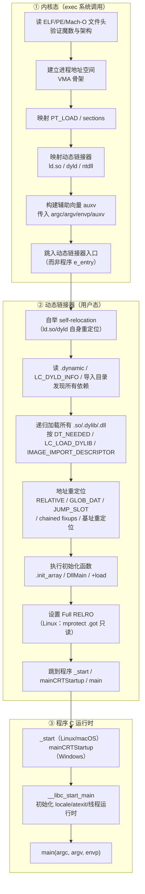

# 动态链接与加载器（2）· 程序加载全景

> [!abstract] TL;DR
> - 双击可执行文件或 shell 键入命令，到 `main()` 第一行代码跑起来，中间隔着一整条"加载流水线"——内核、动态链接器、C 运行时三个阶段依次接力。
> - **Linux**：`execve` → 内核读 ELF、按 `PT_LOAD` 映射段、因 `PT_INTERP` 再映射 `ld.so`、跳入 `ld.so` 入口 → `ld.so` 自举、遍历依赖、重定位、初始化 → 跳到 `_start` → `__libc_start_main` → `main`。
> - **Windows**：`CreateProcess` → `NtCreateUserProcess` 建进程/线程 → 映射 PE 头并初始映射 → `ntdll!LdrpInitialize` 解析导入表、执行 DllMain / TLS 回调 → 应用入口 `mainCRTStartup` → `main`。
> - **macOS**：`execve` → 内核加载并跳入 `dyld` → `dyld` 映射依赖、执行绑定、运行 `+load`/`__attribute__((constructor))` → 程序入口 → `main`。
> - 三平台的分界线都在"内核做完最低限度的地址空间搭建之后，把控制权交给用户态的动态链接器"这一刻——之后的一切都在用户态完成。

本篇是「动态链接与加载器详解」系列第 2 篇，定位是**全景概述**：把 `exec`/双击到第一条用户指令之间的全过程，在三平台上平行铺开，建立"谁先跑、谁接棒"的完整时序心智模型。后续各篇（内存映射、依赖解析、重定位、初始化顺序……）都是在这张全景图的某个子阶段上放大细节，本篇为它们提供定位坐标。

---

## 概述与定位

### 一个直觉问题："_start 之前到底发生了什么"

许多开发者调试时在 `main` 里打断点，以为程序"从 `main` 开始跑"。实际上到 `main` 第一行时，已经有相当多的代码跑过了：

- 内核执行了若干次 `mmap`，建起了进程地址空间的骨架；
- 动态链接器把所有依赖的 `.so`/`.dylib`/`.dll` 加进了地址空间；
- 所有占位地址（重定位）都被改写成了真实运行时地址；
- 全局 C++ 对象的构造函数、`__attribute__((constructor))` 函数、TLS 初始化全部跑完了；
- 在 Linux 上，`__libc_start_main` 还完成了 locale、环境变量、`atexit` 等运行时初始化。

这些工作统称"**`_start` 之前发生的事**"（更准确地说：`_start` 是 C 运行时的最早用户态代码，但动态链接器本身比 `_start` 更早）。本篇就是回答这个问题的全景地图。

### 三平台的共同结构

尽管实现迥异，三大平台的加载流程都遵循同一个宏观结构：

```
[内核态] 建地址空间骨架，加载动态链接器
       ↓ 控制权移交用户态
[动态链接器] 加载依赖库、重定位、初始化
       ↓ 控制权移交程序
[程序 C 运行时] _start → 运行时初始化 → main
```

三个阶段的边界在各平台有细微差异，但这个三段式结构是普遍的。

### 本篇在系列中的位置

| 维度 | 本篇聚焦 | 相邻篇章 |
|---|---|---|
| 前置动机 | 为何需要动态链接器 | [[01.从静态链接到动态链接]] |
| 动态链接器身份 | ld.so/dyld/ntdll 是谁、如何自举 | [[03.动态链接器是谁]] |
| PT_LOAD 映射细节 | 段如何 mmap 进地址空间 | [[04.可执行文件的内存映射]] |
| 依赖发现 | DT_NEEDED/rpath/搜索顺序 | [[05.依赖解析与库搜索顺序]] |
| 重定位细节 | RELATIVE/GLOB_DAT/JUMP_SLOT | [[07.重定位机制详解]] |

---

## 原理与机制

### 全景泳道图

下图把三平台的加载流程并排展示，纵轴是时间线，横轴区分"内核态 / 动态链接器 / 程序入口"三个阶段。



> 三个泳道依次接力：内核完成最低限度的地址空间搭建后，跳入动态链接器；动态链接器做完所有重定位与初始化后，跳入程序自身的 `_start`；`_start` 完成 C 运行时初始化后，才调用用户编写的 `main`。这条接力链在三平台上结构一致，只是每个方框里的具体实现差异很大。

---

## 三平台对照

### Linux：execve → ld.so → _start

Linux 的加载机制以 ELF 程序头表驱动，`PT_INTERP` 是关键枢纽——正是这一个段，告诉内核"先别把控制权给我，先把它给动态链接器"。

#### 阶段一：内核处理 execve（`fs/binfmt_elf.c`）

1. **读 ELF 头，验证魔数**（`\x7fELF`）与 `e_machine`，确认是可执行文件。
2. **遍历程序头表**（`PT_PHDR` 数组），找到 `PT_INTERP` 段，读出解释器路径字符串——通常是 `/lib64/ld-linux-x86-64.so.2`。路径存在 [[11.ELF文件详解/35.interp节.md]] 所描述的 `.interp` 节里，由 [[11.ELF文件详解/03.程序头表.md]] 的 `PT_INTERP` 段头指向。
3. **依次映射主程序的每个 `PT_LOAD` 段**：`mmap(p_vaddr & ~(PAGE_SIZE-1), p_memsz + ..., prot, MAP_FIXED|MAP_PRIVATE, fd, p_offset & ~(PAGE_SIZE-1))`。`p_memsz > p_filesz` 的部分（即 `.bss`）内核补一段匿名页并清零。PIE 可执行文件（`ET_DYN`）加载基址在 ASLR 下随机化。
4. **打开并解析解释器（ld.so）的 ELF**，同样映射它的 `PT_LOAD` 段到地址空间——注意 `ld.so` 总以 `ET_DYN` 形式存在，加载基址由内核选定（也受 ASLR 影响）。
5. **构建辅助向量（auxv）**，压入栈顶，供 ld.so 启动时读取：

   | auxv 标签 | 含义 |
   |---|---|
   | `AT_PHDR` | 主程序程序头表的内存地址 |
   | `AT_PHNUM` | 程序头条目数 |
   | `AT_ENTRY` | 主程序真实入口地址（`e_entry`，即 `_start`） |
   | `AT_BASE` | ld.so 的加载基址（ld.so 用它做自举重定位） |
   | `AT_RANDOM` | 16 字节随机种子（用于 stack canary 等） |
   | `AT_EXECFN` | 可执行文件路径 |

6. **跳入 ld.so 的入口点**（`ld.so` 自己的 `e_entry`），而非主程序的 `_start`——此刻主程序还没有任何库函数可调，因为重定位还没做。

#### 阶段二：ld.so 接管（用户态，glibc 的 `elf/rtld.c`）

ld.so 启动时自身还没有完成重定位，它先做**自举（self-relocation）**：从 auxv 取 `AT_BASE`，把自身的 `RELATIVE` 重定位一一应用（加载基址加 addend），让自己的全局变量地址合法。这段代码必须完全 PC-relative，不依赖任何外部符号——这是 [[03.动态链接器是谁]] 的核心主题。

自举完成后，ld.so 依次完成：

1. 读主程序的 `PT_DYNAMIC` 段（通过 auxv 的 `AT_PHDR` 找到），解析 `DT_NEEDED` 列表，发现所有直接依赖（`libc.so.6`、`libpthread.so.0`……）。
2. 递归加载依赖：按 `rpath`/`runpath`/`LD_LIBRARY_PATH`/`/etc/ld.so.cache` 搜索，`mmap` 每个 `.so` 的 `PT_LOAD` 段（参见 [[05.依赖解析与库搜索顺序]]）。
3. **地址重定位**：按照各模块的 `.rela.dyn` (`R_X86_64_RELATIVE`、`R_X86_64_GLOB_DAT`) 和 `.rela.plt` (`R_X86_64_JUMP_SLOT`) 填写 GOT。`RELATIVE` 型不查符号表，效率最高；`GLOB_DAT`/`JUMP_SLOT` 要走符号查找（详见 [[07.重定位机制详解]]）。
4. **执行 `.init_array`**（以及旧式 `.init`）：按依赖拓扑逆序，先跑依赖库的初始化，再跑主程序的初始化。依赖库的 `.init_array` 由 ld.so 直接触发；**主程序的 `.init_array` 实际由 `__libc_start_main`（→`__libc_csu_init`）触发**，而非 ld.so 直接调用。全局 C++ 对象的构造函数、`__attribute__((constructor))` 均在此时执行。
5. 若启用了 `Full RELRO`（`-z relro,-z now`），对 `PT_GNU_RELRO` 段调用 `mprotect(PROT_READ)`，把 `.got`、`.init_array` 等只读化。
6. **跳到 `AT_ENTRY`**（主程序的 `_start`），参数（`argc/argv/envp`）已经由内核放好在栈上。

#### 阶段三：_start → __libc_start_main → main

`_start` 是 glibc crt 提供的汇编入口（`sysdeps/x86_64/start.S`），职责是清零 `rbp`（标记栈底帧）、从栈弹出 `argc`/`argv`/`envp`，然后调 `__libc_start_main`。

`__libc_start_main` 完成：TLS（线程本地存储）最终初始化、stack canary 设置、`atexit` 注册 `__libc_csu_fini`、安全审计钩子——最后才调用 `main(argc, argv, envp)`。`main` 返回后 `__libc_start_main` 调 `exit()`，触发 `.fini_array` 析构链。

```
execve
  │
  ▼ (内核)
mmap PT_LOAD × N（主程序）
mmap PT_LOAD × N（ld.so）
构建 auxv
  │
  ▼ (跳入 ld.so.e_entry)
ld.so 自举（AT_BASE + RELATIVE 重定位）
解析 DT_NEEDED，递归 mmap 所有依赖
地址重定位（RELATIVE / GLOB_DAT / JUMP_SLOT）
执行 .init_array（构造函数等）
mprotect RELRO
  │
  ▼ (跳到 AT_ENTRY = _start)
_start（清零 rbp，整理栈参数）
  │
  ▼
__libc_start_main（TLS / canary / atexit）
  │
  ▼
main(argc, argv, envp)     ← 你的代码从这里开始
```

---

### Windows：CreateProcess → LdrpInitialize → main

Windows 的加载机制完全在 NT 内核与 ntdll.dll 中实现，没有独立的"解释器"字符串——ntdll 的路径由内核硬编码写入每个进程地址空间（始终是 `%SystemRoot%\System32\ntdll.dll`）。

#### 阶段一：CreateProcess / NtCreateUserProcess（内核态）

1. **`CreateProcess`**（Win32 API）收到可执行文件路径，校验文件类型（PE 魔数 `MZ`、`PE\0\0`），经多层包装最终调内核 `NtCreateUserProcess`。
2. **`NtCreateUserProcess`**（`ntoskrnl.exe`，内核）：
   - 创建**进程对象**（`EPROCESS`）和初始**线程对象**（`ETHREAD`）。
   - 建立进程地址空间（`PEPROCESS->VadRoot`，VAD 树管理 VMA）。
   - 映射 PE 可执行文件本身（通过节对象/Section Object，`NtCreateSection` + `NtMapViewOfSection`）——按节（Section）权限映射，不完全等价于 Linux 的 `mmap PT_LOAD`，但结果类似。
   - **强制映射 `ntdll.dll`** 到进程地址空间（`ntdll` 是内核对每个用户态进程的第一个礼物，不走普通 DLL 加载流程）。
   - 将初始线程的 RIP/RSP 设置为 `ntdll!LdrpInitialize` 的地址，而非应用程序的入口点。
3. 控制权移交：初始线程在用户态第一次被调度时，从 `LdrpInitialize` 开始执行。

#### 阶段二：ntdll!LdrpInitialize（用户态，Loader 初始化）

Windows Loader 的核心在 ntdll 的 `Ldr*` 函数族（`LdrpInitialize`、`LdrpLoadDll`、`LdrpProcessImportDescriptor` 等）。主要步骤：

1. **`LdrpInitialize` → `LdrpInitializeProcess`**：
   - 初始化 `PEB`（Process Environment Block）和 `LDR_DATA_TABLE_ENTRY` 链表（已加载模块的链表）。
   - 把 ntdll 自身和主模块（可执行文件）登记进链表。
2. **解析导入目录（Import Directory）**：遍历主 PE 文件的 `IMAGE_IMPORT_DESCRIPTOR` 数组，得到所有 `DT_NEEDED` 的等价物——被依赖的 DLL 名称列表。
3. **递归加载依赖 DLL**（`LdrpLoadImportedModule`）：按 DLL 搜索顺序（Known DLLs → 应用程序目录 → System32 → 16 位系统目录 → Windows 目录 → 当前目录 → PATH），`NtCreateSection` + `NtMapViewOfSection` 映射每个 DLL；DLL 若有自己的导入表，递归处理。
4. **基址重定位（Base Relocation）**：若 DLL/EXE 实际加载地址不等于它的 `ImageBase`（ASLR 或地址冲突），遍历 `.reloc` 节（`IMAGE_BASE_RELOCATION`），按差值修正所有绝对地址。
5. **填写 IAT（Import Address Table）**：对每个依赖 DLL，按 INT（Import Name Table）查导出符号，把真实函数地址填入 IAT。PE 没有延迟绑定（lazy binding）的概念——**所有常规导入在交还控制权之前就全部填好**，等价于 ELF 的 `BIND_NOW`。只有显式标了 `/DELAYLOAD` 的 DLL 才走延迟加载（`.didat` + `__delayLoadHelper2`）。
6. **运行 TLS 回调**（`TLS_DIRECTORY`，`DLL_PROCESS_ATTACH` 理由）：在 DllMain 之前先跑，常被 packer/反调试检测利用。
7. **运行 DllMain**（`DLL_PROCESS_ATTACH`）：按依赖拓扑逆序（先叶节点，后主模块依赖），每个 DLL 的 `DllMain` 在此被调用。`DllMain` 里做耗时操作或调另一个未初始化 DLL 的函数，是经典死锁/崩溃根源（Loader Lock 问题）。
8. 完成后跳到应用程序入口点——MSVC 运行时的 `mainCRTStartup`（或 `WinMainCRTStartup`）。

#### 阶段三：mainCRTStartup → main

`mainCRTStartup`（MSVC CRT，`exe_main.cpp` 或 `exe_common.inl`）：
- 初始化 MSVC 堆（`_heap_init`）
- 处理全局 C++ 构造（`_initterm`，遍历 `.CRT$XC*` 节组）
- 设置 `_argc`、`_argv`、`_envp`
- 调 `main`（或 `WinMain`）

```
CreateProcess / cmd 双击
  │
  ▼ (内核 NtCreateUserProcess)
创建 EPROCESS / ETHREAD
映射 PE 主模块 + ntdll
初始线程 RIP = ntdll!LdrpInitialize
  │
  ▼ (用户态，ntdll)
LdrpInitialize → LdrpInitializeProcess
  解析 IMAGE_IMPORT_DESCRIPTOR
  递归加载所有 DLL
  Base Relocation（基址重定位）
  填写 IAT（全量，无 lazy）
  运行 TLS 回调
  运行 DllMain(DLL_PROCESS_ATTACH)
  │
  ▼
mainCRTStartup（堆初始化 / C++ 全局构造）
  │
  ▼
main(argc, argv)     ← 你的代码从这里开始
```

---

### macOS：execve → dyld → main

macOS 的机制与 Linux 最相似——内核加载 Mach-O、通过 `LC_LOAD_DYLINKER` 加载 `dyld`、把控制权交给 `dyld`。但 `dyld` 的实现哲学在 dyld3/dyld4 时代经历了根本性变化。

#### 阶段一：内核处理 execve（`bsd/kern/kern_exec.c` + `osfmk/vm/`）

1. 内核识别 Mach-O 魔数（`0xFEEDFACF` for 64-bit, `0xFEEDFACE` for 32-bit）。
2. 遍历 Load Commands，找到 `LC_LOAD_DYLINKER`（通常路径为 `/usr/lib/dyld`）——这是 macOS 版的 `PT_INTERP`。
3. 映射主程序的所有 `LC_SEGMENT_64` （`__TEXT`、`__DATA`、`__LINKEDIT`……）到进程地址空间，按 `initprot`/`maxprot` 设置权限。
4. 映射 `dyld` 本身（同样按其 Load Commands 映射段）。
5. 栈上传递 `argc/argv/envp` 以及 dyld 需要的辅助信息（`apple[]` 数组，类比 Linux auxv）。
6. 跳入 `dyld` 的入口点，而非主程序 `__TEXT,__text` 的 `_main`。

#### 阶段二：dyld 接管（用户态）

**dyld3/dyld4 的变化（重点）**：

经典 dyld（dyld2 时代）在每次进程启动时即时解析所有依赖、做符号查找、按 lazy binding opcode 流处理绑定。dyld3 起 Apple 引入了**闭包（Closure）缓存**和**共享缓存（dyld shared cache）**，把大量工作提前到构建时（`dyld_closure_util`）或缓存中完成，进程启动时只需快速消费已预计算的元数据。dyld4（macOS 12+/iOS 15+）全面转向 **chained fixups**（`LC_DYLD_CHAINED_FIXUPS`）替代传统 `LC_DYLD_INFO` 的 opcode 流。

主要步骤（概括三代）：

1. **dyld 自举**：dyld 自身也需要重定位（它以 `ET_DYN` 风格的 Mach-O 加载），先做自身的 fixup。
2. **加载 dyld shared cache**：系统库（libSystem、libobjc、CoreFoundation……）预先合并在 `/System/Volumes/Preboot/…/dyld_shared_cache_*` 中，dyld 直接将其 ASLR 化地映射，绝大多数系统依赖"零加载"（已在缓存）。
3. **加载非缓存依赖**：按 `LC_LOAD_DYLIB`（强依赖）/`LC_LOAD_WEAK_DYLIB`（弱依赖）/`LC_LOAD_UPWARD_DYLIB` 递归处理。
4. **符号绑定（Binding）**：
   - 旧路径：解释 `LC_DYLD_INFO` 里的 bind opcodes，填写 `__DATA,__got` / `__DATA,__la_symbol_ptr`。
   - 新路径（chained fixups）：遍历镜像内的 fixup 链表，按 `dyld_chained_ptr_*` 格式直接 patch 指针——更快、更容易做只读化、lazy 语义退场（参见 [[08.PLT与GOT与延迟绑定]] 的 macOS 对照节）。
5. **运行初始化**：
   - Objective-C runtime 注册类（`objc_init`，通过 `__DATA,__objc_classlist`）。
   - `+load` 方法按层级调用（先超类后子类）。
   - C++ 全局构造（`__DATA,__mod_init_func`，相当于 ELF 的 `.init_array`）。
   - `__attribute__((constructor))` 函数。
6. **跳到主程序入口**：通过 `LC_MAIN`（现代 Mach-O）提供的 `entryoff` 字段，计算出 `__TEXT` 基址 + 偏移，跳到 `_main`（等效于 `_start` + `main` 的合并体，macOS libc 在 dyld 内嵌的 libSystem 中已完成运行时初始化）。

```
execve
  │
  ▼ (内核 Mach-O 加载)
映射 LC_SEGMENT_64（主程序）
映射 dyld（LC_LOAD_DYLINKER）
  │
  ▼ (跳入 dyld 入口)
dyld 自举（self-fixup）
映射 dyld shared cache（系统库"零加载"）
递归处理 LC_LOAD_DYLIB
符号绑定（chained fixups / bind opcodes）
ObjC runtime / +load / C++ 全局构造
  │
  ▼ (跳到 LC_MAIN.entryoff)
main(argc, argv, envp)     ← 你的代码从这里开始
```

---

## 数据结构 / 流程详解

### 三平台"解释器/动态链接器指定"机制对比

三平台都有一个机制告诉内核"用哪个动态链接器"，但形式不同：

| 维度 | Linux ELF | macOS Mach-O | Windows PE |
|---|---|---|---|
| 指定方式 | `PT_INTERP` 段，包含路径字符串 | `LC_LOAD_DYLINKER` load command | 无——ntdll 路径由内核硬编码 |
| 动态链接器 | `/lib64/ld-linux-x86-64.so.2`（路径随架构/发行版变） | `/usr/lib/dyld`（固定路径） | `ntdll.dll`（固定，始终已映射） |
| 用户可否替换 | 可，通过 `patchelf --set-interpreter` 或 `-Wl,--dynamic-linker=` | 不可（dyld 路径不可替换，`/usr/lib/dyld` 受保护） | 不可 |
| 内核文档 | `man 2 execve`，`fs/binfmt_elf.c` | `xnu/bsd/kern/kern_exec.c` | `NtCreateUserProcess`（非公开文档） |

相关结构详见 [[11.ELF文件详解/35.interp节.md]]（Linux `.interp` 节）与 [[11.ELF文件详解/03.程序头表.md]]（`PT_INTERP` 程序头）。

### 内核给动态链接器的"行李"：auxv / apple[] / 初始线程上下文

内核跳入动态链接器时，会在栈上或寄存器里传递启动信息，让动态链接器无需重新 `open`/`read` 文件即可完成自举：

**Linux（辅助向量 auxv）**：

```
栈底（高地址）
  ...
  envp[n] = NULL
  envp[n-1] ... envp[0]    ← 环境变量字符串指针
  argv[argc] = NULL
  argv[argc-1] ... argv[0] ← 命令行参数字符串指针
  argc                     ← 整数
  AT_NULL  (= 0)           ← auxv 结束标志
  AT_RANDOM  addr          ← 随机种子
  AT_BASE    ld.so_base    ← ld.so 加载基址（用于自举重定位）
  AT_ENTRY   _start_addr   ← 主程序入口（ld.so 最后跳此）
  AT_PHNUM   n             ← 主程序程序头数
  AT_PHDR    phdr_addr     ← 主程序程序头表地址（用于找 PT_DYNAMIC）
  AT_PAGESZ  4096          ← 页大小
  ...
栈顶（低地址）
```

`ld.so` 通过解析辅助向量，不需要 `open` + `read` 主程序文件，就能知道去哪找 `PT_DYNAMIC`（靠 `AT_PHDR`）、自身基址在哪（靠 `AT_BASE`）、最后跳哪里（靠 `AT_ENTRY`）。

**macOS（apple[] 数组）**：

类似 Linux auxv，macOS 内核在 `envp` 之后传递一个 `apple[]` 数组，包含可执行文件路径、dyld 基址等信息，供 dyld 自举。

**Windows（PEB + 初始线程上下文）**：

ntdll 在地址空间里始终已存在（内核直接映射），不需要"自举"。`NtCreateUserProcess` 在 PEB（Process Environment Block，`GS:[0x60]`）里填好 `ImageBaseAddress`、`Ldr`（模块链表）等关键字段，ntdll 的 `LdrpInitialize` 直接读 PEB 起步。

### PT_LOAD 映射的页对齐细节

内核映射 `PT_LOAD` 段时，必须按页（通常 4KB，大页模式 2MB）对齐——因为 `mmap` 的粒度是页。若 `p_vaddr` 不是页对齐的，内核会把起始地址向下取整：

```c
// 内核伪代码（简化）
vaddr_aligned  = p_vaddr  & ~(PAGE_SIZE - 1);
offset_aligned = p_offset & ~(PAGE_SIZE - 1);
map_size = p_memsz + (p_vaddr - vaddr_aligned);

mmap(vaddr_aligned, map_size,
     prot_from_flags(p_flags),
     MAP_PRIVATE | MAP_FIXED,
     fd, offset_aligned);

// 若 p_memsz > p_filesz：BSS 部分补匿名页
if (p_memsz > p_filesz)
    mmap(bss_start, bss_size,
         PROT_READ|PROT_WRITE,
         MAP_PRIVATE|MAP_FIXED|MAP_ANONYMOUS, -1, 0);
```

> [!note] 页内偏移与 MAP_FIXED
> 若段在文件里的偏移 `p_offset` 不是页对齐的（较少见但合法），内核需要把对应文件页全部映射进来，但 VMA 起点依旧是页对齐的。这意味着同一个物理文件页可能同时贡献给两个 VMA 段（写时复制语义，各自私有可写副本）。

### Linux _start 到 main 的精确调用链

```nasm
; _start (crt1.o, sysdeps/x86_64/start.S)
_start:
    xor   rbp, rbp              ; 最外层栈帧 rbp = 0（标记 unwinder 底部）
    mov   rdi, [rsp]            ; argc
    lea   rsi, [rsp+8]          ; argv
    lea   rdx, [rsi+rdi*8+8]   ; envp（argv 末 NULL 之后）
    ; 对齐栈到 16 字节
    and   rsp, -16
    call  __libc_start_main     ; 永不返回（main 返回后 __libc_start_main 调 exit）
```

`__libc_start_main(main, argc, argv, init, fini, rtld_fini, stack_end)`：其中 `init` 指向 `__libc_csu_init`（遍历 `.init_array`），`fini` 指向 `__libc_csu_fini`（`atexit` 注册），`rtld_fini` 是 ld.so 传来的析构函数（清理 `.fini_array`）。

> [!note] glibc 2.34+ 的变化
> 从 glibc 2.34 开始，`libpthread` 和 `libdl` 合并进 `libc.so.6`，且 **`__libc_start_main` 的入参约定有所调整**：新增 `__libc_start_call_main` 作为中间调用层，`init`/`fini` 不再经由 `_start` 传递给 `__libc_start_main`，而由链接器/ld.so 通过 `.init_array` 机制自行触发。不同发行版的实际调用链可能略有差异，但三段式（`_start → __libc_start_main → main`）结构不变。

---

## 实操：用工具观察加载全景

> [!warning] 示例输出为示意
> 本节所有命令输出均为**代表性示意**，非本机实跑；地址、符号数量、版本字符串等随工具链版本、ASLR 而变，切勿据此断言任何真实运行期地址。

### 1. Linux：LD_DEBUG 观察加载各阶段

`LD_DEBUG` 是 glibc ld.so 提供的最直接的加载过程观察工具：

```bash
# 观察文件映射（类似内核 mmap 的视角）
LD_DEBUG=files ./a.out 2>&1 | head -40

# 观察符号绑定时机（lazy 还是 now）
LD_DEBUG=bindings ./a.out 2>&1 | grep -E 'binding|symbol'

# 观察所有细节
LD_DEBUG=all ./a.out 2>&1 | less
```

```text
# 示例输出（代表性，非本机实跑）
     12345:
     12345: file=libc.so.6 [0];  needed by ./a.out [0]
     12345: file=libc.so.6 [0];  generating link map
     12345:   dynamic: 0x00007f...  base: 0x00007f...   size: ...
     12345:   entry: 0x00007f...  phdr: 0x00007f...   phnum:  14
     12345:
     12345: calling init: /lib/x86_64-linux-gnu/libc.so.6
     12345:
     12345: initialize program: ./a.out
     12345:
     12345: transferring control: ./a.out
```

> [!warning] 示例输出为示意
> `base:`、`entry:` 后面的地址每次运行（ASLR）都不同，仅展示输出结构。"transferring control" 这行是 ld.so 跳入 `_start` 前的最后一条日志。

### 2. Linux：readelf 查看 PT_INTERP

```bash
readelf -l /bin/ls | grep -A1 INTERP
```

```text
# 示例输出（代表性，非本机实跑）
  INTERP         0x0000000000000318 0x0000000000000318 0x0000000000000318
                 0x000000000000001c 0x000000000000001c  R      0x1
      [Requesting program interpreter: /lib64/ld-linux-x86-64.so.2]
```

> [!warning] 示例输出为示意
> 解释器路径随架构和发行版变化；Alpine (musl) 的结果是 `/lib/ld-musl-x86_64.so.1`。

### 3. Linux：查看辅助向量

```bash
LD_SHOW_AUXV=1 /bin/true 2>&1
```

```text
# 示例输出（代表性，非本机实跑）
AT_SYSINFO_EHDR:  0x7fff...   (vDSO 页)
AT_HWCAP:         ...
AT_PAGESZ:        4096
AT_PHDR:          0x5555555...  (主程序程序头表地址)
AT_PHNUM:         13
AT_BASE:          0x7f...       (ld.so 加载基址)
AT_FLAGS:         0x0
AT_ENTRY:         0x5555555...  (_start 地址)
AT_UID/GID/...
AT_RANDOM:        0x7fff...     (16 字节随机种子)
AT_EXECFN:        /usr/bin/true
```

> [!warning] 示例输出为示意
> `AT_BASE` 后面的地址就是 ld.so 的 ASLR 化加载基址，ld.so 用它来做自举重定位（见 [[03.动态链接器是谁]]）。`AT_ENTRY` 是 `_start` 的最终虚拟地址，ld.so 做完所有初始化后跳此。

### 4. macOS：dyld_info / otool 观察加载命令

```bash
# 查看解释器 / dyld 路径
otool -l /bin/ls | grep -A2 LC_LOAD_DYLINKER

# 查看依赖（LC_LOAD_DYLIB 列表）
otool -L /bin/ls

# 查看新版 chained fixups 信息
dyld_info -fixups /bin/ls | head -30
```

```text
# 示例输出（代表性，非本机实跑）
Load command 8
          cmd LC_LOAD_DYLINKER
      cmdsize 32
         name /usr/lib/dyld (offset 12)

/bin/ls:
        /usr/lib/libutil.dylib (compatibility version 1.0.0, ...)
        /usr/lib/libncurses.5.4.dylib (compatibility version 5.4.0, ...)
        /usr/lib/libc.dylib
        /usr/lib/dyld
```

> [!warning] 示例输出为示意
> macOS 系统二进制从 dyld shared cache 加载，`otool -L` 显示的路径是逻辑路径而非磁盘路径；实际映射的是 shared cache 里预合并的版本。

### 5. Windows：Process Monitor 观察 DLL 加载

Sysinternals Process Monitor（procmon）可以抓到 Windows 加载器在 `LdrpInitialize` 阶段的所有 `CreateFile`/`MapViewOfFile` 操作。过滤条件：`Process Name = <你的程序> AND Operation = LoadImage`。

对于命令行工具，也可用 WinDbg：

```
windbg -g -G program.exe
0:000> sxe ld:msvcrt   ; 在加载 msvcrt 时中断
0:000> g
```

### 工具速查

| 目的 | Linux 命令 | macOS 命令 | Windows 工具 |
|---|---|---|---|
| 查解释器路径 | `readelf -l bin \| grep INTERP` | `otool -l bin \| grep -A2 LC_LOAD_DYLINKER` | — |
| 查依赖 | `ldd bin` | `otool -L bin` | `dumpbin /dependents bin.exe` |
| 观察加载过程 | `LD_DEBUG=files ./bin` | `DYLD_PRINT_LIBRARIES=1 ./bin` | Process Monitor / WinDbg |
| 查辅助向量 | `LD_SHOW_AUXV=1 ./bin` | — | — |
| 查映射地址空间 | `cat /proc/<pid>/maps` | `vmmap <pid>` | Process Explorer → Memory Map |
| 跟踪 mmap/映射调用 | `strace -e mmap,mmap2 ./bin` | `dtruss -n ./bin` | — |

---

## 攻防 / 陷阱

### LD_PRELOAD 劫持（Linux/macOS）

`LD_PRELOAD` 是 ld.so/dyld 提供的"插队"机制：在加载任何其他依赖之前，先加载 `LD_PRELOAD` 指定的库，并让其符号优先覆盖后来加载的同名符号。这是合法的调试/测试手段（如 `malloc` 替换、函数 hook），也是经典的权限提升攻击入口。

```bash
# 合法用途：用自定义 malloc 替换 glibc malloc
LD_PRELOAD=/path/to/mymalloc.so ./a.out

# 攻击利用：劫持高权限 setuid 程序（glibc 已加防护：setuid/gid 时忽略 LD_PRELOAD）
LD_PRELOAD=/tmp/evil.so /usr/bin/sudo  # 已被 glibc 防护，sudo 会忽略
```

glibc 的防护：若可执行文件有 setuid/setgid 位，ld.so 会**完全忽略** `LD_PRELOAD`、`LD_LIBRARY_PATH` 等环境变量。macOS 类似（dyld 的 `DYLD_INSERT_LIBRARIES` 在 SIP 保护的进程和 setuid 二进制上无效）。详见 [[14.加载器劫持]]。

### Windows DLL 搜索顺序劫持（DLL Hijacking）

Windows Loader 按固定顺序搜索 DLL（SafeDllSearchMode=1，即默认开启）：Known DLLs 注册表 → **应用程序目录** → `%SystemRoot%\System32` → 16 位系统目录 → Windows 目录 → 当前目录 → PATH。注意**应用程序目录优先于 System32**，这正是 DLL 侧加载（DLL Side-Loading）的根本原因：若攻击者能在应用程序目录放一个与合法系统 DLL 同名的恶意 DLL，`LdrpLoadImportedModule` 就会优先加载它，之后的 DllMain 执行即为代码注入。这类漏洞在应用安装目录写权限宽松时极为常见。详见 [[05.依赖解析与库搜索顺序]]。

### _start 之前的代码：竞争面

- **Linux**：`.init_array` 函数、`__attribute__((constructor))` 函数在 `main` 之前执行，且是按依赖库加载顺序调用的。恶意 `.so`（通过 `LD_PRELOAD` 注入的或被 GOT 改写引入的）可以在此执行任意代码，比在 `main` 里还早。
- **Windows**：DllMain 里执行的代码（`DLL_PROCESS_ATTACH`）在 `main` 之前，且持有 Loader Lock——在此调用 `LoadLibrary` 或 `CreateThread` 是死锁高危区。
- **macOS**：`+load` 方法（ObjC）和 `__mod_init_func` 函数在 `main` 之前执行，在 `+load` 里调用 `[SomeClass someMethod]` 如果 SomeClass 尚未初始化，会触发未定义行为。

### 静态 PIE 与无 interp 的边界情况

静态 PIE（`gcc -static-pie`）编译的程序没有 `PT_INTERP`，也没有 `PT_DYNAMIC` 里的 `DT_NEEDED`——内核直接映射它到随机地址后跳入 `_start`，没有 ld.so 介入。这类程序的初始化链是 `_start → __libc_start_main → main`，跳过了"动态链接器"这整个泳道。但它自身仍可能包含 `DT_RELR`（压缩的 RELATIVE 重定位），内核或程序自身的自举代码（`crtbeginS.o`）负责处理。

---

## 小结

1. **三段式接力是普遍结构**：内核态建地址空间骨架 → 动态链接器完成重定位与初始化 → 程序 C 运行时入口到 `main`。三平台均遵循此结构，差别在各阶段的具体实现。
2. **Linux 的关键枢纽是 `PT_INTERP`**：内核不假设动态链接器是谁，只读 ELF 里的字符串路径；这使得 musl、自定义 ld.so 等替代品成为可能，也是 `patchelf --set-interpreter` 的工作原理。
3. **Windows Loader 等效于 always-BIND_NOW**：普通导入在 `LdrpInitialize` 阶段全量填写 IAT，没有运行期 lazy 符号解析；ntdll 的角色由内核硬编码，无法替换。
4. **`_start` 之前代码量不小**：ld.so/dyld/ntdll Loader 的初始化 + 所有依赖库的 `DllMain`/`.init_array`/`+load`，在某些大型应用里这段时间甚至超过 `main` 本身。`.init_array` 里的代码是合法的"比 main 更早"执行点，也是攻击面。
5. **auxv 是 Linux 加载链的隐形数据管道**：内核通过栈顶的辅助向量把 `AT_BASE`、`AT_ENTRY`、`AT_PHDR` 等关键信息传给 ld.so，让 ld.so 无需重新打开文件即可完成自举——读懂 auxv 是深入分析 ld.so 自举过程的第一步。
6. **macOS 的 dyld 正在从 lazy 走向 eager**：chained fixups + dyld shared cache 使 macOS 的加载行为越来越接近 Windows 的"即时全量绑定"，以换取更好的安全性与启动性能。

---

## 相关阅读

- **加载过程涉及的 ELF 段**：[[11.ELF文件详解/03.程序头表.md]]（PT_LOAD / PT_INTERP / PT_DYNAMIC）
- **解释器路径的来源**：[[11.ELF文件详解/35.interp节.md]]（.interp 节）
- **动态链接器的身份与自举**：[[03.动态链接器是谁]]
- **PT_LOAD 映射的完整细节**：[[04.可执行文件的内存映射]]
- **依赖库搜索规则**：[[05.依赖解析与库搜索顺序]]
- **重定位的类型与流程**：[[07.重定位机制详解]]
- **PLT/GOT 与延迟绑定（本系列最核心机制篇）**：[[08.PLT与GOT与延迟绑定]]
- **init/fini_array 与初始化顺序**：[[11.初始化与析构顺序]]
- **LD_PRELOAD/DLL 劫持攻防**：[[14.加载器劫持]]
- **RELRO/BIND_NOW 安全加固体系**：[[15.加载器视角的安全]]

---

⬅️ 上一篇 [[01.从静态链接到动态链接]] ｜ 🏠 [[00.动态链接与加载器总览]] ｜ 下一篇 [[03.动态链接器是谁]] ➡️
