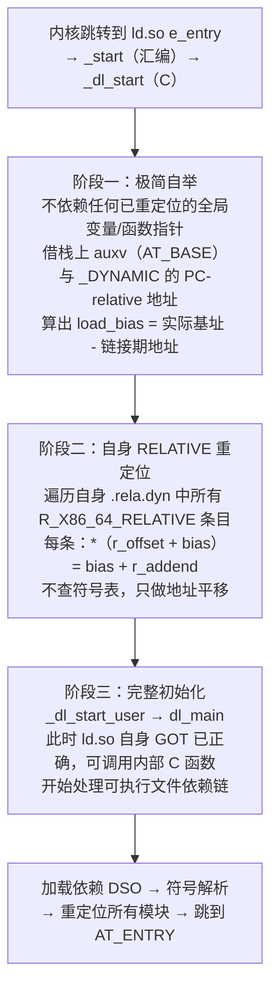

# 动态链接与加载器（3）· 动态链接器是谁

> [!abstract] TL;DR
> - **三个主角**：Linux 的 `ld.so`（`/lib64/ld-linux-x86-64.so.2`）是独立 ELF 共享库；macOS 的 `dyld`（`/usr/lib/dyld`）同样是独立 Mach-O 可执行体；Windows 的 Loader **不是独立文件**，而是 `ntdll.dll` 内部一组函数（`LdrLoadDll`/`LdrGetProcedureAddress` 等），由内核在进程启动时直接映射。
> - **如何被拉起**：Linux/macOS 由内核读 `PT_INTERP`（ELF）/`LC_LOAD_DYLINKER`（Mach-O）后把控制权交给动态链接器；Windows 内核直接把 `ntdll.dll` 映射进每个进程，无需额外配置。
> - **自举难题**：动态链接器自身也是一个 ELF/Mach-O 模块，包含需要重定位的内部引用——但"别的链接器"来不及也不可能先重定位它；于是它必须用**不依赖任何全局绑定的最小代码**先把自身的相对重定位处理好，再去服务可执行文件。这个过程叫 **self-relocation（自举重定位）**。
> - **可否替换**：Linux 可通过修改 `.interp` 字符串（`patchelf --set-interpreter` 或链接时 `--dynamic-linker`）换用任意 ld.so；macOS 在现代安全策略下极难替换；Windows Loader 作为系统核心几乎不可替换。

本篇是系列「基础与全景」三篇中的第三篇。[[02.程序加载全景]] 讲了"从 `execve` 到第一条用户指令"的完整流程；本篇把镜头对准那个**承上启下的关键角色**：动态链接器本身——它是谁、住在哪、由谁把它加载进来、以及它如何在没有援手的情况下让自己先"活过来"。理解动态链接器的身份与自举，是理解后续所有加载、重定位、符号解析篇的前置基础。

---

## 概述与定位

### 为什么需要一个独立的动态链接器

内核（`exec` 路径）的职责很窄：验证文件格式、把 `PT_LOAD` 段映射进地址空间、建好辅助向量（auxv）、把 CPU 控制权交出去。内核**不做**符号解析、不处理依赖关系、不填 GOT——这些运行时细节太复杂、太依赖用户态库（glibc、musl 等），放进内核会破坏内核/用户态的分层边界。

于是三大平台都采用了同一个架构决策：把运行时链接逻辑放进一个**用户态程序**，由内核在交出控制权时优先把这个程序跑起来，再由它去服务可执行文件。这个用户态程序就是动态链接器。

它需要满足几个特殊要求：
1. **自举**：自身不能依赖任何外部共享库——没有 libc，没有 libpthread，一切从零开始。
2. **知道可执行文件的全部信息**：依赖库列表、程序头表地址、真正的入口地址——内核通过辅助向量（auxv）把这些传给它。
3. **完全透明**：加载依赖、重定位、填 GOT 全部完成后，**跳转到真正的程序入口**，让程序感知不到中间经历了这一切。

### 三个主角一览

| 平台 | 动态链接器 | 默认路径 | 文件形态 | 拉起方式 |
|---|---|---|---|---|
| Linux | `ld.so`（glibc 版本）| `/lib64/ld-linux-x86-64.so.2` | ELF 共享库（`ET_DYN`） | 内核读 `PT_INTERP`，`execve` 时直接映射并跳转 |
| macOS | `dyld` | `/usr/lib/dyld` | Mach-O 可执行体（`MH_DYLINKER`） | 内核读 `LC_LOAD_DYLINKER`，加载并移交控制权 |
| Windows | Windows Loader（`Ntdll` Loader） | 在 `ntdll.dll` 内 | **非独立文件**，是 `ntdll.dll` 中的一组导出函数 | 内核固定映射 `ntdll.dll` 到每个进程地址空间 |

---

## 原理与机制

### PT_INTERP 与 LC_LOAD_DYLINKER：配置"用谁"

#### Linux：PT_INTERP 节与 .interp

动态链接的 ELF 可执行文件通过一个程序头段 `PT_INTERP` 告诉内核"用哪个解释器"。该段对应 `.interp` 节，其内容是一个以 `\0` 结尾的路径字符串（详见 [[11.ELF文件详解/35.interp节.md]]）：

```text
/lib64/ld-linux-x86-64.so.2
```

内核在 `execve` 的 `load_elf_binary`（`fs/binfmt_elf.c`）中：
1. 扫描程序头表，找到 `PT_INTERP` 段
2. 读出解释器路径字符串（长度 < `PATH_MAX`）
3. 打开解释器文件，验证其为有效 ELF
4. 把可执行文件和解释器的 `PT_LOAD` 段全部 `mmap` 进地址空间
5. 构建 auxv，其中 `AT_ENTRY` 存放可执行文件真正的入口、`AT_BASE` 存放解释器加载基址
6. **跳转到解释器入口**（ld.so 的 `e_entry`），而非可执行文件入口

内核不关心路径内容的格式，路径完全由文件自身决定——这是 `.interp` 可被替换（`patchelf --set-interpreter`）的根本原因。

```bash
# 查看可执行文件使用的动态链接器
readelf -p .interp a.out
readelf -l a.out | grep INTERP
```

> [!warning] 示例输出为示意
> 本机为 Windows 环境，以下输出均为代表性示意，非本机实跑。

```text
$ readelf -p .interp a.out
String dump of section '.interp':
  [     0]  /lib64/ld-linux-x86-64.so.2

$ readelf -l a.out | grep -A2 INTERP
  INTERP         0x0000000000000318 0x0000000000400318 0x0000000000400318
                 0x000000000000001c 0x000000000000001c  R      0x1
      [Requesting program interpreter: /lib64/ld-linux-x86-64.so.2]
```

`PT_INTERP` 段的 `p_filesz` 极小（仅路径字符串长度 + 1），权限为只读（`PF_R`），是整个程序头表中最小的段之一。

#### macOS：LC_LOAD_DYLINKER

macOS Mach-O 可执行文件用加载命令 `LC_LOAD_DYLINKER` 指定动态链接器路径（详见 [[12.Mach-O文件详解/03.Mach-O加载命令.md]]）：

```text
cmd LC_LOAD_DYLINKER
cmdsize 32
name /usr/lib/dyld (offset 12)
```

内核（`xnu` 的 `bsd/kern/mach_loader.c`）处理 `LC_LOAD_DYLINKER`，把 `dyld` 映射进地址空间，并把控制权交给 `dyld` 的入口。其流程与 Linux 类似，区别在于信息传递机制——macOS 用 `_dyld_start` 的栈帧传参（而非 auxv）。

`dyld` 自身的标识命令是 `LC_ID_DYLINKER`，其 `cmd = 0xf`；`LC_LOAD_DYLINKER` 的 `cmd = 0xe`。内核对 `LC_LOAD_DYLINKER` 的处理是强制的——无此命令的动态可执行文件内核会拒绝运行。

#### Windows：无配置，固定注入

Windows 的做法根本不同：`ntdll.dll` 不是"被配置"进来的——内核在创建每一个进程时，都会把 `ntdll.dll` **无条件映射**到进程地址空间（地址由 ASLR 决定）。PE 可执行文件里没有"用哪个加载器"的字段，这个映射是内核行为，不可从用户态配置。

`ntdll.dll` 里的用户态加载逻辑入口是 `LdrInitializeThunk`（进程初始化路径）和 `LdrLoadDll`/`LdrGetProcedureAddress`（运行时动态加载路径）。内核把初始线程上下文的指令指针指向 `ntdll.dll` 内的 `LdrInitializeThunk`，从此动态链接开始。

---

## 三平台对照

| 维度 | Linux `ld.so` | macOS `dyld` | Windows Loader |
|---|---|---|---|
| **解释器文件** | `/lib64/ld-linux-x86-64.so.2`（glibc）、`/lib/ld-musl-x86_64.so.1`（musl） | `/usr/lib/dyld` | `ntdll.dll`（位于 `%SystemRoot%\System32\`） |
| **文件类型** | ELF `ET_DYN`（共享库，但可直接执行） | Mach-O `MH_DYLINKER` | PE DLL（`IMAGE_FILE_DLL` 标志位已置） |
| **由谁拉起** | 内核（`binfmt_elf.c`），读 `PT_INTERP` | 内核（`xnu mach_loader.c`），读 `LC_LOAD_DYLINKER` | 内核（`ntoskrnl.exe`），强制映射，无需配置 |
| **入口符号** | `_start`（汇编）→ `_dl_start`（C，自举）→ `_dl_start_user` → `dl_main` | `__dyld_start` → `dyldbootstrap::start()` | `LdrInitializeThunk` |
| **信息传递** | 辅助向量 auxv（栈上）：`AT_PHDR`/`AT_ENTRY`/`AT_BASE` 等 | `dyld` 栈帧（`dyld_start_helper`），类 auxv 结构 | PEB（进程环境块）+初始线程上下文 |
| **是否独立文件** | 是 | 是 | 否（是 ntdll.dll 内的子系统，不可拆分） |
| **能否替换** | 可以：`patchelf --set-interpreter` 或 `-Wl,--dynamic-linker=` | 极难：SIP / 代码签名 / Hardened Runtime 阻止替换 | 不可（`ntdll.dll` 是系统核心，内核固定映射） |
| **自身依赖** | 零外部依赖（静态链接内部实现） | 零外部依赖（dyld 静态链接所有内部逻辑） | ntdll 由内核直接加载，不经 Loader 自身 |
| **调试环境变量** | `LD_DEBUG=all`、`LD_TRACE_LOADED_OBJECTS=1`、`LD_PRELOAD` | `DYLD_PRINT_LIBRARIES`、`DYLD_INSERT_LIBRARIES`（SIP 下受限） | 无等效环境变量；用 WinDbg / Process Monitor |

---

## 数据结构 / 流程详解

### Linux ld.so：身份解析

`ld.so` 的文件路径是硬编码到 glibc 构建系统里的。在典型 x86-64 Linux 上，`/lib64/ld-linux-x86-64.so.2` 通常是到 `/lib/x86_64-linux-gnu/ld-2.xx.so`（Debian/Ubuntu）或 `/lib64/ld-linux-x86-64.so.2`（独立文件）的符号链接。

```bash
# 查看 ld.so 真实路径
ls -la /lib64/ld-linux-x86-64.so.2

# 查看版本
/lib64/ld-linux-x86-64.so.2 --version

# 列出程序依赖（等同 ldd）
/lib64/ld-linux-x86-64.so.2 --list /bin/ls
```

> [!warning] 示例输出为示意
> 本机为 Windows 环境，以下输出均为代表性示意，非本机实跑。

```text
$ /lib64/ld-linux-x86-64.so.2 --version
ld-linux-x86-64.so.2 (GNU libc) 2.39

$ /lib64/ld-linux-x86-64.so.2 --list /bin/ls
        linux-vdso.so.1 (0x00007ffd2ab7e000)
        libselinux.so.1 => /lib/x86_64-linux-gnu/libselinux.so.1 (0x00007f...)
        libc.so.6 => /lib/x86_64-linux-gnu/libc.so.6 (0x00007f...)
        /lib64/ld-linux-x86-64.so.2 (0x00007f...)
```

`ld.so` 是一个 `ET_DYN` 类型的 ELF 共享库，但它直接可执行（有自己的 `e_entry`）。其内部**没有 `.interp` 节**——它不需要"别人"来加载它，它自己负责自举。

### macOS dyld：演进历史

macOS 的动态链接器 `dyld` 经历了几代演进：

- **dyld 1**（Mac OS X 早期）：基础 lazy binding，对应 `LC_DYLD_INFO` opcode 流
- **dyld 2**（OS X 10.x 主力）：共享缓存（`dyld_shared_cache`）、二级命名空间
- **dyld 3**（macOS 10.14 引入）：把符号解析结果缓存到磁盘（launch closure），大幅提速冷启动
- **dyld 4**（macOS 12 / iOS 15 起）：`LC_DYLD_CHAINED_FIXUPS` + `LC_DYLD_EXPORTS_TRIE`，链式 fixups 取代传统 opcode bind，惰性绑定在 arm64 上基本退场

现代二进制中 `otool -l` 看到的 `LC_LOAD_DYLINKER` 几乎永远指向 `/usr/lib/dyld`，这是苹果强制的约定。`dyld` 文件类型是 `MH_DYLINKER`（`0x7`），区别于普通可执行文件的 `MH_EXECUTE`（`0x2`）和共享库的 `MH_DYLIB`（`0x6`）。

```bash
# 查看可执行文件使用的 dylinker
otool -l /bin/ls | grep -A2 LC_LOAD_DYLINKER
```

> [!warning] 示例输出为示意
> 本机为 Windows 环境，以下输出均为代表性示意，非本机实跑。

```text
Load command 12
          cmd LC_LOAD_DYLINKER
      cmdsize 32
         name /usr/lib/dyld (offset 12)
```

### Windows Loader：ntdll 内的加载子系统

Windows Loader 不是"一个程序"，而是 `ntdll.dll` 导出的一组函数。这些函数与内核加载器（`ntoskrnl.exe` 中的 `MmLoadSystemImage` 等）共同构成完整的加载体系：

- **`LdrInitializeThunk`**：进程创建后第一个执行的用户态函数。它初始化 PEB（Process Environment Block）的加载器相关字段、处理静态导入表（IAT 填充）、调用 TLS 回调，最后把控制权交给可执行文件入口。
- **`LdrLoadDll`**：运行时加载 DLL 的核心（`LoadLibraryA/W` 最终调用它）。
- **`LdrGetProcedureAddress`**：导出符号查找（`GetProcAddress` 最终调用它）。
- **`LdrUnloadDll`**：引用计数减一，触发 `DllMain(DLL_PROCESS_DETACH)`，必要时卸载。

PE 可执行文件的导入信息在 `IMAGE_IMPORT_DESCRIPTOR` 链表中（在 `.idata` 节），`LdrInitializeThunk` 遍历它、按库名 `LoadLibrary`、按名称/序号查导出表，把真实地址填进 IAT——这是 PE 的"加载时全量绑定"（等同 ELF 的 `BIND_NOW`），而非延迟绑定。

---

## 加载器自举（Self-Relocation / Bootstrap）

这是本篇最核心的机制，也是动态链接器最精彩的工程挑战。

### 问题的本质

`ld.so` 自身也是一个 ELF 共享库——它的代码段里包含对自身全局变量和函数的引用，这些引用在文件里是相对偏移（PIC 代码），但对应的 `.got` / `.got.plt` 表项在运行期需要加上实际加载基址才能正确访问。

换句话说：**`ld.so` 也有需要重定位的地方——但重定位 `ld.so` 的，只能是 `ld.so` 自己**。在内核把控制权交给 `ld.so` 的 `_start` 时：

- 没有任何其他 DSO 被加载
- 没有任何 GOT 被填充
- `ld.so` 自身的 GOT 里的 `RELATIVE` 表项（`R_X86_64_RELATIVE`）还是文件时的 addend，没有加载基址
- libc 不存在，`malloc`/`memcpy` 都不能调用

这就是**自举问题（bootstrapping problem）**：`ld.so` 必须在"还没有运行时环境"的状态下，把自己修好。

### 解决方案：最小自举代码

先把 ld.so 的入口调用链定义清楚，本篇全程以此为准（glibc，x86-64）：

```text
e_entry → _start（汇编）→ _dl_start（C，计算 load_bias 并完成自身 RELATIVE 重定位）
        → _dl_start_user → dl_main（加载依赖、全量重定位、跳 AT_ENTRY）
```

其中 `_start` 是内核交棒后的第一条用户态指令（纯汇编），它跳进 `_dl_start`——这才是自举的核心 C 函数：`_dl_start` 在自身全局变量尚不可用的状态下算出 `load_bias` 并把自己的 `RELATIVE` 重定位修好，随后经 `_dl_start_user` 进入 `dl_main` 完成对可执行文件的完整服务。

glibc 的 `ld.so` 自举分三阶段（以 x86-64 为例）：



> **图解**：阶段一和阶段二是自举的关键，此时 ld.so 不能访问任何**已重定位的全局变量/函数指针**（它们的地址还没修正好），只能用 PC-relative 指令（`lea`/`rip`-relative）、寄存器运算，或经 `rsp` 相对寻址读取栈上的 auxv。阶段三（`_dl_start_user → dl_main`）之后，ld.so 内部才是一个"正常的"程序。

#### 阶段一：计算 load_bias

自举最早期不能依赖任何**已重定位的全局变量/函数指针**（它们的 GOT 表项还没加上 `load_bias`）；但栈上的 auxv 经 `rsp` 相对寻址可直接读取，不经 GOT——glibc 的 `_dl_start` 一开始正是这样借栈上 auxv 的 `AT_BASE`（内核传入的 ld.so 加载基址）与 `_DYNAMIC` 的 PC-relative 地址算出 `load_bias`。

具体做法是利用 **`_DYNAMIC` 段的 PC-relative 地址**：编译器生成 `lea DYNAMIC_offset(%rip), %reg` 来获取 `.dynamic` 节的当前地址，而 `.dynamic` 的链接期地址是已知的（文件内偏移），两者之差就是 `load_bias`：

```c
// 伪代码（glibc elf/rtld.c _dl_start 的精神）
Elf64_Addr ld_base = current_pc - LINK_TIME_OFFSET_OF_SOME_SYMBOL;
// 或更精确：
Elf64_Dyn *dynamic_addr = /* 通过 _DYNAMIC 符号的 rip-relative 地址获得 */;
Elf64_Addr link_time_dynamic = /* 编译期已知的 .dynamic 虚拟地址 */;
Elf64_Addr load_bias = (Elf64_Addr)dynamic_addr - link_time_dynamic;
```

#### 阶段二：只处理 RELATIVE 重定位

`ld.so` 自身的重定位几乎全是 `R_X86_64_RELATIVE`（只需加基址偏移，不查符号表）。这类重定位格式（来自 `.rela.dyn`）：

```c
typedef struct {
    Elf64_Addr   r_offset;  // 要修改的地址（相对文件基址）
    Elf64_Xword  r_info;    // 低32位类型 = R_X86_64_RELATIVE(8)
    Elf64_Sxword r_addend;  // 链接期的符号值（文件时的目标地址）
} Elf64_Rela;
```

`R_X86_64_RELATIVE` 的重定位公式极简：

```
*( load_bias + r_offset ) = load_bias + r_addend
```

不需要查任何符号表，只需一次加法。`ld.so` 用**不依赖任何全局函数调用的循环**处理所有这类条目：

```c
// 极简自举循环（不能调用任何函数，不能访问任何已重定位的全局变量）
// 遍历 .rela.dyn，只处理 RELATIVE 类型
Elf64_Rela *rela = (Elf64_Rela *)(load_bias + LINK_TIME_RELA_DYN_ADDR);
for (size_t i = 0; i < RELA_COUNT; i++) {
    if (ELF64_R_TYPE(rela[i].r_info) == R_X86_64_RELATIVE) {
        Elf64_Addr *target = (Elf64_Addr *)(load_bias + rela[i].r_offset);
        *target = load_bias + rela[i].r_addend;
    }
}
```

完成这个循环后，`ld.so` 自身的所有数据指针（包括函数指针表、字符串指针等）都指向了正确的运行期地址。这时候才可以安全地调用 `ld.so` 内部的 C 函数。

#### 阶段三：完整初始化

此后 `ld.so` 经 `_dl_start_user` 进入正常的初始化流程（`dl_main`）：
1. 从 auxv 读取可执行文件的程序头地址（`AT_PHDR`/`AT_PHNUM`），扫描 `PT_DYNAMIC`
2. 从 `DT_NEEDED` 递归加载依赖库（广度优先，构建加载顺序链表 `link_map`）
3. 对所有已加载模块（按加载序）做全量重定位：先 `RELATIVE`（快，不查符号），再 `GLOB_DAT`/`JUMP_SLOT`（需符号查找）
4. 处理 `IFUNC` 解析、符号版本
5. 执行 `.init_array` 列表（各 DSO 的初始化函数，依赖拓扑序）
6. **跳转到 `AT_ENTRY`**（可执行文件的真实 `main` 入口），整个动态链接过程对程序完全透明

#### macOS dyld 的自举

dyld 的自举机制与 glibc 类似但有 Mach-O 特色：
- 入口是 `__dyld_start`（汇编），调用 `dyldbootstrap::start()`
- 需要先处理自身的 **rebase**（Mach-O 的位置无关地址修正，对应 ELF 的 `R_RELATIVE`）
- 用 `LC_DYLD_CHAINED_FIXUPS`（新式）或 `LC_DYLD_INFO` rebase opcodes（旧式）记录需要修正的指针
- 自举完成后再去处理可执行文件的 `LC_LOAD_DYLIB` 依赖链

#### Windows ntdll 的"自举"

`ntdll.dll` 的加载由内核完成，不存在"用户态自举"的问题——内核的 `MmLoadSystemImage` 在进入用户态之前已经把 `ntdll.dll` 的导入表（IAT）填好（`ntdll` 只依赖内核，其导入表极为简单）。进入 `LdrInitializeThunk` 时，`ntdll.dll` 自身已完全可用，无需用户态自举代码。

---

## 实操：用工具观察

> [!warning] 示例输出为示意
> 本节所有命令和输出均为代表性示意，非本机实跑（本机为 Windows 环境）。在 Linux/macOS 机器上按相同命令执行即可得到真实结果，具体地址随 ASLR 每次变化。

### 1. 查看解释器路径

```bash
# Linux：三种方式查看 .interp
readelf -p .interp a.out
readelf -l a.out | grep -A2 INTERP
file a.out

# macOS：查看 dylinker 命令
otool -l /bin/ls | grep -A3 LC_LOAD_DYLINKER
```

```text
# Linux 示例输出
$ readelf -p .interp a.out
String dump of section '.interp':
  [     0]  /lib64/ld-linux-x86-64.so.2

# macOS 示例输出
      cmd LC_LOAD_DYLINKER
  cmdsize 32
     name /usr/lib/dyld (offset 12)
```

### 2. ld.so 直接执行

```bash
# ld.so 自身可以直接运行（不经 PT_INTERP）
/lib64/ld-linux-x86-64.so.2 --version
/lib64/ld-linux-x86-64.so.2 --help
/lib64/ld-linux-x86-64.so.2 --list /bin/ls   # 列依赖，等同 ldd
```

```text
$ /lib64/ld-linux-x86-64.so.2 --version
ld-linux-x86-64.so.2 (GNU libc) 2.39
Copyright (C) 2024 Free Software Foundation, Inc.
...
```

这个特性在调试时非常有用：无需修改可执行文件的 `.interp`，就能用指定版本的 ld.so 运行程序。

### 3. LD_TRACE_LOADED_OBJECTS：显示加载的库

```bash
# 方式一：环境变量（等同 ldd 的核心机制）
LD_TRACE_LOADED_OBJECTS=1 /bin/ls

# 方式二：ldd 命令（内部调用相同机制）
ldd /bin/ls
```

> [!warning] 示例输出为示意
> 以下为代表性示意输出。注意 `ldd` 实际上是通过设置 `LD_TRACE_LOADED_OBJECTS=1` 后执行目标程序实现的——`ld.so` 检测到此环境变量时，打印依赖信息后退出，不执行 `main`。对不信任的二进制**不要用 `ldd`**（它会运行目标程序），用 `objdump -p` 或 `readelf -d` 代替。

```text
$ LD_TRACE_LOADED_OBJECTS=1 /bin/ls
        linux-vdso.so.1 (0x00007ffd12345000)
        libselinux.so.1 => /lib/x86_64-linux-gnu/libselinux.so.1 (0x00007f...)
        libc.so.6 => /lib/x86_64-linux-gnu/libc.so.6 (0x00007f...)
        /lib64/ld-linux-x86-64.so.2 => /lib64/ld-linux-x86-64.so.2 (0x00007f...)
```

### 4. LD_DEBUG：观察 ld.so 的内部行为

```bash
# 观察所有动作（输出量大）
LD_DEBUG=all /bin/ls 2>&1 | head -30

# 仅看库搜索与加载
LD_DEBUG=libs /bin/ls

# 仅看符号查找
LD_DEBUG=symbols /bin/ls

# 仅看绑定（JUMP_SLOT 解析）
LD_DEBUG=bindings /bin/ls

# 查看所有可用选项
LD_DEBUG=help /bin/true
```

> [!warning] 示例输出为示意

```text
$ LD_DEBUG=libs /bin/ls
     12345: find library=libselinux.so.1 [0]; searching
     12345:  search path=/lib/x86_64-linux-gnu/tls/...
     12345:  trying file=/lib/x86_64-linux-gnu/libselinux.so.1
     12345: calling init: /lib/x86_64-linux-gnu/libc.so.6
     12345: calling init: /lib/x86_64-linux-gnu/libselinux.so.1
     12345: initialize program: /bin/ls
     12345: transferring control: /bin/ls
```

`transferring control` 那行之后，ld.so 跳入可执行文件的 `main`，动态链接完成。

### 5. 验证 ld.so 自身无外部依赖

```bash
# ld.so 自身没有 .interp（没有"别的链接器"来加载它）
readelf -l /lib64/ld-linux-x86-64.so.2 | grep INTERP

# ld.so 自身的 DT_NEEDED（应该为空）
readelf -d /lib64/ld-linux-x86-64.so.2 | grep NEEDED

# 查看 ld.so 自身的 RELATIVE 重定位（自举时要处理的内容）
readelf -r /lib64/ld-linux-x86-64.so.2 | grep RELATIVE | head -5
```

> [!warning] 示例输出为示意

```text
$ readelf -l /lib64/ld-linux-x86-64.so.2 | grep INTERP
（无输出——ld.so 没有 PT_INTERP 段）

$ readelf -d /lib64/ld-linux-x86-64.so.2 | grep NEEDED
（无输出——ld.so 没有外部依赖）

$ readelf -r /lib64/ld-linux-x86-64.so.2 | grep RELATIVE | head -5
000000020c48  000000000008 R_X86_64_RELATIVE                  1f8e0
000000020c50  000000000008 R_X86_64_RELATIVE                  1f960
000000020c58  000000000008 R_X86_64_RELATIVE                  1fa60
```

最后这条命令的输出证实了自举阶段要处理的内容：`ld.so` 自身有大量 `R_X86_64_RELATIVE` 重定位（第三列类型值 `0x8` = `R_X86_64_RELATIVE`），这些就是自举循环要逐一加 `load_bias` 修正的条目。

---

## 攻防 / 陷阱

### CVE-2023-4911（Looney Tunables）：自举期环境变量溢出

#### 漏洞背景与影响范围

2023 年 10 月，Qualys 研究团队公布了 glibc 的本地提权漏洞 **CVE-2023-4911**，绰号 **"Looney Tunables"**（调皮地双关了 glibc 的可调参数机制与 Looney Tunes 动画）。该漏洞影响 **glibc 2.34 至 2.38**（对应主流发行版：Fedora 37/38、Ubuntu 22.04 LTS、Debian 12 Bookworm 等），于 glibc 2.39（2024 年 1 月发布）中修复。

| 维度 | 说明 |
|---|---|
| CVE 编号 | CVE-2023-4911 |
| 影响版本 | glibc 2.34 – 2.38 |
| 漏洞类型 | 堆缓冲区溢出（Heap Buffer Overflow） |
| 利用条件 | 本地普通用户；目标需是 SUID/SGID 程序（如 `su`、`sudo`、`pkexec`） |
| 影响 | 本地提权至 root |
| CVSS v3 | 7.8（High） |
| 修复版本 | glibc 2.39 |

#### 漏洞成因：`GLIBC_TUNABLES` 解析缺陷

glibc 2.34 引入了 **`GLIBC_TUNABLES`** 环境变量机制，用于在运行时调整 glibc 的内部行为（如内存分配器参数、内核特性探测开关等）。用法形如：

```bash
GLIBC_TUNABLES=glibc.malloc.mxfast=512 ./myapp
```

这个环境变量在 `ld.so` **自举阶段**（阶段一/阶段二之后、`dl_main` 进入早期）由函数 `__tunable_get_val`（入口）和 `parse_tunables`（核心解析逻辑，位于 glibc 源码 `tunable/tunables.c`）处理。

**问题所在**：`parse_tunables` 在解析 `GLIBC_TUNABLES` 字符串时，用了一段形如"拷贝有效部分到目标缓冲区"的逻辑，但未能正确处理**包含 `GLIBC_TUNABLES=` 前缀的嵌套或异常格式字符串**。攻击者可以构造一个特殊的 `GLIBC_TUNABLES` 值，使拷贝长度超过栈上/堆上分配的缓冲区边界，触发**堆缓冲区溢出**，覆盖其后的内存区域（含函数指针、返回地址等可控结构）。

#### 利用路径（教学视角）

溢出发生在 `ld.so` 处理 `GLIBC_TUNABLES` 的时间点上，这个时间点有两个关键特性，共同造就了它的严重性：

**特性一：SUID 程序尚未放弃特权**

当用户执行一个 SUID 程序（如 `su`、`sudo`）时，内核把该进程的**有效 uid 置为 0（root）**，然后跳入 `ld.so`。只有在 `ld.so` 完成加载、跳入程序真正的 `main` 并调用 `setuid`/`setresuid` 之后，该进程才"主动降权"。

在 `parse_tunables` 处理 `GLIBC_TUNABLES` 的时刻，进程**仍持有 root 有效 uid**。

**特性二：此时 glibc 的安全检测尚未完全生效**

`ld.so` 对 SUID 程序会做若干安全处理（如忽略 `LD_PRELOAD`、`LD_LIBRARY_PATH`），但 `GLIBC_TUNABLES` 的过滤逻辑存在设计缺陷：glibc 2.34 引入该机制时，对 SUID 场景下哪些 tunable 条目应当被清洗的判断逻辑本身含有缺陷，导致恶意构造的字符串能绕过清洗并触发溢出。

完整利用链的概念性步骤（仅供理解漏洞成因，不提供武器化代码）：

```text
1. 普通用户构造恶意 GLIBC_TUNABLES 字符串（包含溢出 payload）
2. 执行任意 SUID 程序（如 /bin/su）
3. 内核 execve 时将进程 euid 设为 0，跳入 ld.so
4. ld.so 自举完成后，parse_tunables 读取 GLIBC_TUNABLES
5. 恶意字符串触发堆溢出，覆盖关键内存结构
6. 控制流劫持，以 root 权限执行攻击者代码
7. 获得 root shell
```

#### 修复方案与防御要点

**glibc 2.39 的修复**：在 `parse_tunables` 中对字符串长度和格式做了更严格的校验；更重要的是，**对 SUID/SGID 场景整体增强了 `GLIBC_TUNABLES` 的清洗逻辑**——在特权程序中，不受信任的 tunable 值会被直接清空而非解析。

**运维层防御**：
- 及时将 glibc 升级至 2.39+（各主流发行版均已推出安全更新补丁包）
- 审计系统中 SUID/SGID 程序的最小化（减少攻击面）
- 运行时安全工具（如 SELinux/AppArmor 策略）可在进程行为层面额外限制异常的内存写操作

**这一漏洞揭示的深层设计风险**：`parse_tunables` 被置于 `ld.so` 自举阶段而非更晚的初始化阶段，是出于设计便利——越早处理 tunables，越多的内部机制能受益于它们。但这也意味着此时距内核交棒最近、安全初始化最少，任何此处的内存安全漏洞都有在特权进程中被利用的潜力。理解"自举期是特殊安全盲区"（见本篇小结第 6 点）是理解此类漏洞成因的关键。

---

### PT_INTERP 劫持与自定义加载器攻击面

#### `patchelf --set-interpreter` 的双面性

`patchelf` 是一个广泛使用的合法工具，它能直接修改 ELF 文件的 `PT_INTERP`（`.interp` 节）内容，将可执行文件的解释器路径替换为任意路径：

```bash
# 合法用法：把某程序换用特定版本的 glibc/ld.so（如跨版本兼容调试）
patchelf --set-interpreter /opt/glibc-2.39/lib/ld-linux-x86-64.so.2 ./myapp

# 验证修改结果
readelf -p .interp ./myapp
# 输出：[     0]  /opt/glibc-2.39/lib/ld-linux-x86-64.so.2
```

这在正常使用场景中完全合理——比如在同一机器上运行需要不同 glibc 版本的程序，或为二进制打补丁以配合 CTF 题目环境。

#### 自定义 loader 的攻击面

当攻击者能修改目标二进制时，把 `PT_INTERP` 指向一个**自控的恶意 ld.so** 就变成了一条隐蔽的持久化/权限维持手段：

```text
正常流程：
  内核 execve → 读 PT_INTERP → 加载 /lib64/ld-linux-x86-64.so.2 → 加载程序

劫持后：
  内核 execve → 读 PT_INTERP → 加载 /tmp/.evil/ld.so → 任意初始化代码
                                                             ↓
                                          （可转发给真正的 ld.so，对用户透明）
```

恶意 ld.so 在 `_start` 自举阶段可以：
- 在进程启动时静默执行任意代码（键盘记录、反向 shell、数据回传）
- 把 GOT/PLT 填充为拦截版本，监听特定函数调用（如 `write`、`getpwnam`）
- 最终再把控制权转发给真实 ld.so（调用真实解释器），使程序行为完全正常，难以察觉

自定义 loader 还可以通过调用链 `execve("/lib64/ld-linux-x86-64.so.2", argv, envp)` 的方式"透明接力"，类似 rootkit 的"代理"模式。

#### 链接期替换解释器

除 `patchelf` 之外，在编译链接时也可以指定替代解释器：

```bash
# gcc 链接期指定自定义解释器
gcc -Wl,--dynamic-linker=/opt/custom/ld.so -o myapp main.c

# 效果等同于事后 patchelf；常用于构建需要携带私有 glibc 的独立发行包
```

这是正当的打包技术（如 AppImage、某些静态化发行包），但也意味着任何能影响构建系统的攻击（供应链攻击）都可以悄无声息地替换解释器。

#### 检测与防御

**检测手段**：

```bash
# 批量检查一批二进制的 .interp 是否为系统标准路径
for f in /usr/bin/*; do
    interp=$(readelf -p .interp "$f" 2>/dev/null | grep -o '/[^ ]*')
    case "$interp" in
        /lib64/ld-linux-x86-64.so.2|\
        /lib/x86_64-linux-gnu/ld-linux-x86-64.so.2|\
        /lib/ld-linux-x86-64.so.2)
            ;;  # 标准路径，放行
        "")
            ;;  # 静态链接或无 interp，放行
        *)
            echo "非标准解释器: $f → $interp"
            ;;
    esac
done
```

安全扫描工具（如 `checksec`、`scanelf`/`pax-utils`、YARA 规则）均可检测非标准 `.interp` 路径。SIEM 系统可以对系统目录下出现非标准 `.interp` 的文件产生告警。

**防御体系**：

- **代码签名与完整性验证**：对发行的二进制做哈希签名，部署时验证（含 `.interp` 在内的完整文件哈希）——任何 `patchelf` 修改都会破坏签名
- **不可变文件系统**（如 `chattr +i`）：关键 SUID 程序设置不可变属性，阻止文件修改
- **Linux IMA/EVM**（Integrity Measurement Architecture）：内核层的文件完整性度量，在 `execve` 时校验文件哈希，篡改的解释器路径会触发策略拒绝执行
- **Secure Boot + 可信启动链**：从固件到内核到用户空间的完整信任链可延伸到 ELF 加载阶段

---

### .interp 劫持（Interpreter Hijacking）

`.interp` 节是一个纯字符串，任何可以修改二进制的攻击者都可以把它指向自定义 ld.so。自定义 ld.so 可以在加载初始化阶段执行任意代码，完全控制程序的加载过程——包括跳过原程序直接 `execve` 别的程序。

防御思路：
- 在软件完整性验证（代码签名/哈希）中检查 `.interp` 内容是否为系统标准路径
- Secure Boot 链可延伸到 ELF 加载：验证整个二进制（含 `.interp`）的签名
- 对已知攻击手法，安全扫描工具（如 `checksec`、ELF 恶意软件检测工具）会标记非标准 `.interp` 路径

### LD_PRELOAD 与 dylinker 劫持

`LD_PRELOAD` 允许在所有正常 DSO 之前加载额外库，使其符号优先被解析。这是合法的调试手段（mock 替换、性能注入），也是恶意软件的经典手法（拦截 `open`/`read`/`getpwnam` 等系统调用包装函数）。

更彻底的方式是替换 `.interp` 指向的 ld.so 本身：该自定义 ld.so 可以先做任何事情，再把控制权转发给正常的 ld.so。这是 rootkit 的经典技术（见 [[14.加载器劫持]]）。

### 自举期的特殊漏洞面

自举代码（阶段一和二）运行在内核交棒后、正常安全机制初始化前的"真空期"：此时 stack canary 等运行时防护尚未建立（ASLR 由内核施加、此刻已生效，但帮不上自举代码内部的内存安全）。历史上 glibc 的自举路径曾出现过几个本地提权漏洞，利用环境变量（如 `GLIBC_TUNABLES`，CVE-2023-4911 "Looney Tunables"）在 SUID 程序的自举期注入代码。

> [!note] CVE-2023-4911 简析
> 该漏洞存在于 glibc 2.34–2.38 的 `ld.so` 自举路径中：`_dl_parse_tunables` 在解析 `GLIBC_TUNABLES` 环境变量时存在缓冲区溢出，攻击者可在 ld.so 自举阶段（尚无 SUID 权限丢弃前）触发溢出，在 SUID 程序中实现本地提权。这一漏洞揭示了自举代码的独特风险：它运行在内核交棒后、正常安全机制初始化前的"真空期"。

---

## 小结

1. **三个主角身份各异**：Linux `ld.so` 是一个 `ET_DYN` 共享库（可直接执行），住在 `/lib64/ld-linux-x86-64.so.2`；macOS `dyld` 是一个 `MH_DYLINKER` 类型的 Mach-O 可执行体，住在 `/usr/lib/dyld`；Windows Loader 不是独立文件，而是 `ntdll.dll` 内的一组函数（`LdrInitializeThunk`/`LdrLoadDll` 等），由内核固定映射到每个进程。
2. **拉起机制各不同**：Linux/macOS 靠文件内声明（`PT_INTERP`/`LC_LOAD_DYLINKER`），内核读取后映射解释器并跳入其入口；Windows 靠内核无条件注入 `ntdll.dll`，无需任何配置字段。
3. **自举（self-relocation）是独特挑战**：动态链接器自身含有 `R_X86_64_RELATIVE` 等需要重定位的内部指针，但没有"别的链接器"来做这件事。解决方案是用**极简、不依赖任何外部符号和全局变量的纯 PC-relative 代码**，先计算 `load_bias`，再遍历自身的 `RELATIVE` 重定位条目逐一修正——完成后才能进入正常 C 函数调用的初始化阶段。
4. **PT_INTERP 是解释器的"身份证指针"**：内核不假设用哪个 ld.so，完全由 `.interp` 的字符串决定——这既是灵活性的来源（可替换），也是攻击面（劫持）。
5. **可替换性差异显著**：Linux 最开放（`patchelf` / 编译期 `-Wl,--dynamic-linker=`）；macOS 被 SIP + 代码签名锁死；Windows 的 `ntdll.dll` 作为系统核心实际上不可替换。
6. **自举期是特殊安全盲区**：自举代码运行在内核交棒后、正常安全机制初始化前，历史上曾出现多个利用此阶段的本地提权漏洞（如 Looney Tunables）。

---

## 相关阅读

- **PT_INTERP 的文件结构细节**：[[11.ELF文件详解/35.interp节.md]]
- **LC_LOAD_DYLINKER 等 Mach-O 加载命令**：[[12.Mach-O文件详解/03.Mach-O加载命令.md]]
- **内核如何交棒、完整加载流程**：[[02.程序加载全景]]
- **ld.so 完成自举后做什么：内存映射**：[[04.可执行文件的内存映射]]
- **GOT 与 RELATIVE 重定位（自举的对象）**：[[11.ELF文件详解/17.got节.md]]
- **加载器劫持（.interp 替换、LD_PRELOAD）**：[[14.加载器劫持]]
- **延迟绑定全流程（ld.so 接管后的符号解析）**：[[08.PLT与GOT与延迟绑定]]

---

⬅️ 上一篇 [[02.程序加载全景]] ｜ 🏠 [[00.动态链接与加载器总览]] ｜ 下一篇 [[04.可执行文件的内存映射]] ➡️
