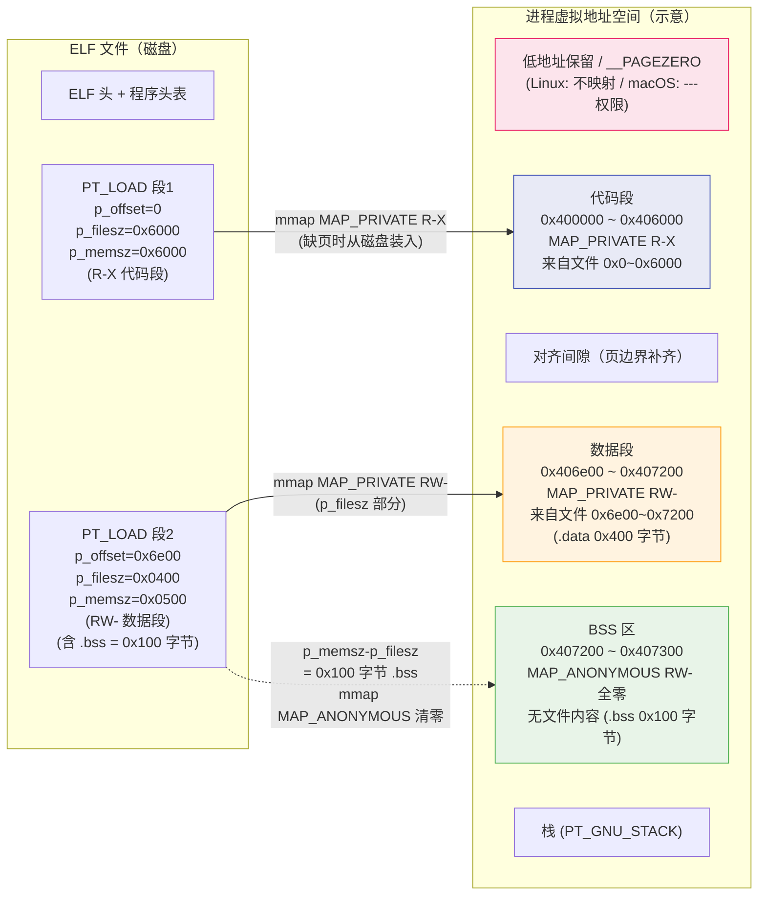

# 动态链接与加载器（4）· 可执行文件的内存映射

> [!abstract] TL;DR
> - **核心动作**：加载器（Linux 内核 / macOS XNU / Windows Loader）读取可执行文件的元数据，把文件中特定区域以**内存映射**的方式投影进进程的虚拟地址空间——不是一口气把整个文件读到内存，而是在页粒度上"按需" `mmap`，绝大多数物理内存读入由缺页中断驱动。
> - **Linux / ELF**：内核遍历 `PT_LOAD` 段，按 `p_vaddr`/`p_offset`/`p_filesz`/`p_memsz` 四字段做 `mmap`；`p_memsz > p_filesz` 的差额（`.bss`）额外映射匿名页并清零；`MAP_PRIVATE` 配合写时复制（CoW）让所有进程共享只读页的同一份物理内存。
> - **Windows / PE**：Loader 调用 `NtMapViewOfSection`；节的 `VirtualAddress`/`VirtualSize`/`SizeOfRawData` 控制映射，`SizeOfImage`/`SectionAlignment`/`FileAlignment` 决定地址空间布局；每个节按 `Characteristics` 设内存保护属性。
> - **macOS / Mach-O**：dyld 按段命令（`LC_SEGMENT_64`）映射；`__PAGEZERO` 用零权限的巨型段覆盖低地址、捕获空指针；`__TEXT` 只读可执行、`__DATA` 可写。
> - **共同安全基线**：W^X（可写不可执行）——可写段禁止可执行，可执行段禁止可写，是现代平台的默认要求。

本篇承接 [[03.动态链接器是谁]]——彼篇介绍了动态链接器"是谁"、如何自举，本篇专注于"它的第一项核心工作"：把可执行文件本身映射进内存，并把 `.bss` 清零、段权限设对。这是整个加载流程中**最接近操作系统的一层**，理解它既需要读文件格式（见 [[11.ELF文件详解/03.程序头表.md]]、[[12.Mach-O文件详解/12.Mach-O __PAGEZERO.md]]、[[13.PE文件详解/24-详解PE文件(二十四)：节表.md]]），也需要理解虚拟内存的 `mmap` 语义。随后的依赖解析（[[05.依赖解析与库搜索顺序]]）和重定位，都是在"主程序已映射就绪"的前提下进行的。

---

## 概述与定位

### 为什么是"映射"而非"复制"

朴素的做法是把文件整体 `read` 进一块 `malloc` 的堆内存，然后跳进去执行。这一做法有两个根本缺陷：

1. **浪费物理内存**：一个几十 MB 的可执行文件里，大量的代码段在一次运行中可能只覆盖到几个百分点的路径；如果全量 `read` 进内存，未被触达的代码白占物理页，造成极大浪费。`mmap` 把文件页和虚拟页建立映射关系后，**物理内存的实际读入由缺页中断（page fault）驱动**——进程执行到哪页、读到哪页，内核才把对应文件内容装进物理页，未触达的文件内容始终在磁盘上，不耗物理页。
2. **无法在多进程间共享代码**：若每个进程都 `malloc` + `read` 自己的副本，同一个共享库被十个进程加载就要十份物理内存。`mmap` 映射的同一文件的同一偏移、以 `MAP_PRIVATE` 标记，在没有写操作之前，多个进程的对应虚拟页**指向同一物理页**——物理内存中只有一份只读代码；一旦某进程试图写入（修改），内核触发写时复制（CoW），为该进程单独分配一页，其他进程的映射不受影响。

内存映射加载把"虚拟地址空间的布局"与"物理内存的实际占用"彻底解耦，是现代操作系统加载器的基石。

### 本篇在系列中的位置

| 步骤 | 工作 | 相关篇 |
|---|---|---|
| 0 | 内核 `exec`，读 `PT_INTERP`/PE 数据目录，将动态链接器映射进进程 | [[03.动态链接器是谁]] |
| **1（本篇）** | **映射主程序各段（`PT_LOAD`/段命令/节），设权限，清零 `.bss`** | **本篇** |
| 2 | 遍历 `DT_NEEDED`/`LC_LOAD_DYLIB`/导入目录，查找并映射依赖库 | [[05.依赖解析与库搜索顺序]] |
| 3 | 重定位（`GLOB_DAT`/`RELATIVE`/`JUMP_SLOT`/基址重定位） | [[07.重定位机制详解]] |
| 4 | PLT/GOT 延迟绑定，首次调用才解析函数地址 | [[08.PLT与GOT与延迟绑定]] |

---

## 原理与机制

### 四字段关系：`p_offset`、`p_vaddr`、`p_filesz`、`p_memsz`

ELF 的 `Elf64_Phdr` 中，`PT_LOAD` 段的这四个字段完整描述了"磁盘 → 虚拟地址空间"的映射关系（字段结构详见 [[11.ELF文件详解/03.程序头表.md]]）：

```c
typedef struct {
    Elf64_Word  p_type;    // PT_LOAD = 1
    Elf64_Word  p_flags;   // PF_R=4 / PF_W=2 / PF_X=1
    Elf64_Off   p_offset;  // 段数据在 ELF 文件中的起始偏移（字节）
    Elf64_Addr  p_vaddr;   // 段期望被映射到的虚拟地址
    Elf64_Addr  p_paddr;   // 物理地址（用户空间通常忽略）
    Elf64_Xword p_filesz;  // 段在文件中的字节数（≤ p_memsz）
    Elf64_Xword p_memsz;   // 段在内存中占用的字节数（≥ p_filesz）
    Elf64_Xword p_align;   // 对齐要求，必须是 2 的幂；p_vaddr ≡ p_offset (mod p_align)
} Elf64_Phdr;
```

四者的约束关系：

| 约束 | 含义 |
|---|---|
| `p_memsz >= p_filesz`（规范要求） | 内存大小永远不小于文件大小 |
| `p_memsz == p_filesz` | 段内容全部来自文件（典型代码/只读数据段） |
| `p_memsz > p_filesz` | 多出的 `p_memsz - p_filesz` 字节是"仅内存、无文件内容"的清零区，`.bss` 就住在这里 |
| `p_filesz == 0` | 整个段无文件内容（极端情况，如 `PT_GNU_STACK`） |
| `p_vaddr ≡ p_offset (mod p_align)` | 虚拟地址与文件偏移对页对齐的余数相同，保证 `mmap` 对齐 |

### `mmap` 调用的拆解

内核（或动态链接器加载共享库时）对每个 `PT_LOAD` 段做如下操作（伪代码，以 Linux x86-64 为例，地址均为示意）：

```c
// 对齐到页边界：向下取整
uintptr_t page_align_down(uintptr_t addr) {
    return addr & ~(PAGE_SIZE - 1);  // PAGE_SIZE = 0x1000
}

// 对每个 PT_LOAD phdr：
uintptr_t map_start = page_align_down(phdr.p_vaddr);
uintptr_t file_start = page_align_down(phdr.p_offset);
size_t    map_len    = phdr.p_vaddr + phdr.p_filesz - map_start;
int       prot       = prot_from_flags(phdr.p_flags);  // PROT_READ|PROT_EXEC 等

// 1. 映射文件内容部分（p_filesz 字节）
mmap((void *)map_start,
     map_len,
     prot,
     MAP_PRIVATE | MAP_FIXED,
     fd,
     file_start);

// 2. 若 p_memsz > p_filesz：额外 mmap 匿名页覆盖 .bss 区域
if (phdr.p_memsz > phdr.p_filesz) {
    uintptr_t bss_start = phdr.p_vaddr + phdr.p_filesz;
    uintptr_t bss_end   = phdr.p_vaddr + phdr.p_memsz;
    // 覆盖"上一 mmap 页尾 .bss 前缀"（同一物理页已映射，但尾部需清零）
    memset((void *)bss_start, 0, PAGE_SIZE - (bss_start & (PAGE_SIZE - 1)));
    // 对齐后剩余的 .bss 页（整页匿名映射，内核自动清零）
    uintptr_t anon_start = (bss_start + PAGE_SIZE - 1) & ~(PAGE_SIZE - 1);
    if (anon_start < bss_end)
        mmap((void *)anon_start,
             bss_end - anon_start,
             prot,
             MAP_PRIVATE | MAP_FIXED | MAP_ANONYMOUS,
             -1, 0);
}
```

> [!note] 为什么要先 `memset` 一段再匿名 `mmap`
> `p_filesz` 往往不在页边界结束。设 `p_filesz` 末尾落在某物理页的中间，这一页的前半段是文件内容（`.data` 最末几个字节），后半段属于 `.bss`（需要全零）。第一步 `mmap` 把文件内容映射进这一页；但 `MAP_PRIVATE` 的文件 `mmap` 只保证文件内容范围内是正确的，超出 `p_filesz` 的同一页内剩余字节**内核不保证是零**（可能有脏数据）。因此加载器需要手动 `memset` 把这"半个页"的 `.bss` 前缀清零，再对后续的整页匿名映射（`MAP_ANONYMOUS`，内核保证清零）。两步合起来，整个 `.bss` 区域才符合"加载时全零"的 C 语言语义。
> 需要强调：**这段 `memset` 只对可写段成立**。`.bss` 只会出现在数据段（恒为 `RW-`），其首部所在的页本就可写，`memset` 才能落地。只读代码段（`R-X`）几乎总是 `p_memsz == p_filesz`，不存在 `.bss` 尾部清零问题；即便某只读段出现 `p_memsz > p_filesz`，加载器也**不会**对只读页 `memset`（写只读页会直接 fault），其多出的部分只能靠匿名映射的零页承接。换言之，"页内 `memset` 清零"是数据段专属步骤。

### 写时复制（CoW）与多进程共享

`MAP_PRIVATE` 是实现多进程共享只读页的关键机制：

```
进程 A                进程 B
虚拟地址 → PA 物理页（代码段，只读）
                ↗
          同一个 PA 物理页  （两进程共享）
                ↗
进程 B 的虚拟地址
```

当进程 A 与进程 B 都 `mmap` 了同一个 ELF 文件的同一个代码段（`R-X`），内核可以让两个虚拟页映射到**同一物理页**，不需要为每个进程各占一份物理内存。只要这两个进程都只读，这种共享就能持续。

对 `RW-` 的数据段同样用 `MAP_PRIVATE` 映射——这一点初看反直觉。原因是：进程加载后，`.data` 里的初始化数据也来自文件，共享是有益的，直到某个进程第一次向数据页写入。写入触发 CoW：

1. 内核发现"对一个 `MAP_PRIVATE` 只读映射的写操作"，产生保护 fault。
2. 内核为当前进程分配一个新的物理页，把原物理页的内容**复制**进去。
3. 更新该进程的页表，让虚拟地址指向新页，新页标记为可写。
4. 其他进程的虚拟地址仍指向原页，彼此隔离。

CoW 带来了两个好处：进程启动时**不需要为所有数据段分配写时副本**（大多数全局变量在写操作发生前共享同一物理页），并且让进程 `fork` 后的内存几乎是免费的——子进程只在真正写入时才产生私有页。

### Mermaid：文件偏移到虚拟地址的映射全景



> 图说：左侧是磁盘上 ELF 文件的两个 `PT_LOAD` 段，右侧是映射后进程虚拟地址空间的布局。代码段（蓝色）整体从文件映射，`R-X` 只读可执行；数据段（橙色）`p_filesz` 部分有文件内容（`.data`），绿色的 `.bss` 区域由匿名映射补足且全零初始化——文件里没有这 `0x100` 字节，是 `MAP_ANONYMOUS` 在运行时凭空生成的零页。两段之间可能存在对齐间隙（由 `p_align` 决定，通常为页大小或 2MB 大页边界）。

---

## 三平台对照

### Linux（ELF / ld.so / 内核）

Linux 上可执行文件的初始映射由**内核**在 `execve` 系统调用中完成，动态链接器本身的映射也由内核负责（通过读取 `PT_INTERP`）；之后依赖库的映射由 `ld.so`（动态链接器）完成，机制与内核映射主程序相同，都是遍历 `PT_LOAD` 段调 `mmap`。

**关键字段**：

| 字段 | 作用 |
|---|---|
| `p_offset` | 文件偏移，`mmap` 的 `offset` 参数（必须页对齐） |
| `p_vaddr` | 目标虚拟地址（`ET_EXEC` 是绝对地址；`ET_DYN`/PIE 是基址偏移） |
| `p_filesz` | `mmap` 映射的文件字节数（`length` 参数含义范围） |
| `p_memsz` | 内存总大小；差额 `p_memsz - p_filesz` 对应 `.bss`，需额外匿名映射并清零 |
| `p_flags` | 段权限：`PF_R=4`、`PF_W=2`、`PF_X=1`；对应 `mmap` 的 `PROT_READ`/`PROT_WRITE`/`PROT_EXEC` |
| `p_align` | 对齐；`PT_LOAD` 通常为页大小（`0x1000` 或 `0x200000`）；决定文件偏移与虚拟地址的对齐余数相同 |

**段权限与 W^X（可写不可执行）**：

现代 Linux 内核强制 W^X 策略：代码段典型 `R-X`（`PF_R|PF_X`，无写权限），数据段典型 `RW-`（`PF_R|PF_W`，无执行权限）。`RWX`（`0x7`）组合出现时，现代工具链会警告；`PT_GNU_STACK` 无 `PF_X` 即为 NX 栈（不可执行栈，防止栈溢出 shellcode）。

W^X 由内核在 `mmap` 层面执行——若传入 `PROT_WRITE|PROT_EXEC`，SELinux/开启了 W^X 的内核会拒绝或产生审计告警；JIT 编译器则通过"先写再 `mprotect` 成只执行"的二阶段方式规避此限制。

**ASLR 与 PIE 的影响**：`ET_EXEC`（非 PIE）的 `p_vaddr` 是绝对虚拟地址，内核必须在那个确切地址映射（ASLR 不随机化文本段基址）；`ET_DYN`（PIE）的 `p_vaddr` 是相对偏移，内核选一个随机基址 `base`，实际映射地址 = `base + p_vaddr`。

### Windows（PE / Windows Loader）

Windows Loader（位于 `ntdll!LdrpMapViewOfSection` 等内部函数，最终调用 `NtMapViewOfSection`）用**截然不同的结构**描述同样的概念：不是 `PT_LOAD` 段，而是 `IMAGE_SECTION_HEADER` 数组（即节表，详见 [[13.PE文件详解/24-详解PE文件(二十四)：节表.md]]）。

**关键字段对照**：

| PE 字段 | ELF 对应 | 作用 |
|---|---|---|
| `IMAGE_OPTIONAL_HEADER.SizeOfImage` | — | 镜像在内存中的**总虚拟大小**（必须为 `SectionAlignment` 的整数倍），Loader 按此大小一次性预留虚拟地址空间 |
| `IMAGE_OPTIONAL_HEADER.SectionAlignment` | `p_align` | 节在内存中的对齐粒度（典型 `0x1000` = 4KB 页对齐） |
| `IMAGE_OPTIONAL_HEADER.FileAlignment` | — | 节在**文件**中的对齐粒度（典型 `0x200` = 512 字节，或 `0x1000`）；**文件对齐远小于内存对齐** |
| `IMAGE_SECTION_HEADER.VirtualAddress` | `p_vaddr`（相对 ImageBase） | 节在内存中的 RVA（相对虚拟地址，从镜像基址算起） |
| `IMAGE_SECTION_HEADER.VirtualSize` | `p_memsz` | 节在内存中的实际大小（可不对齐）；若大于 `SizeOfRawData`，超出部分清零（等价 `.bss`） |
| `IMAGE_SECTION_HEADER.SizeOfRawData` | `p_filesz`（向 `FileAlignment` 取整） | 文件中对齐后的大小 |
| `IMAGE_SECTION_HEADER.PointerToRawData` | `p_offset`（向 `FileAlignment` 取整） | 节数据在文件中的偏移 |
| `IMAGE_SECTION_HEADER.Characteristics` | `p_flags` | 节属性位掩码，含 `IMAGE_SCN_MEM_READ/WRITE/EXECUTE` 等 |

**`SizeOfImage` 与预留机制**的关键差异：PE Loader **不逐节调 `mmap`**，而是先用 `NtMapViewOfSection` 以 `SizeOfImage` 的大小一次性将整个文件映射（create section + map view），然后再按节表逐节设置内存保护属性（`VirtualProtect` 等价）。这与 ELF 的"逐 `PT_LOAD` 段 `mmap`"截然不同。

**`FileAlignment` vs `SectionAlignment` 的对齐双重性**：PE 文件在磁盘的节对齐（`FileAlignment`）远小于内存节对齐（`SectionAlignment`）——典型值分别是 `0x200`（512 B）和 `0x1000`（4 KB）。`SizeOfRawData` 是文件对齐的大小（如 `.text` 文件中为 `0x6200`），`VirtualSize` 是运行期内存大小（可为 `0x61A8`，不对齐）。Loader 把文件里的 `SizeOfRawData` 字节映射进去，若 `VirtualSize > SizeOfRawData`，超出部分清零（等价 `.bss`）；映射完成后再将内存按 `SectionAlignment` 取整。

**节权限（`Characteristics`）** 的典型值：

| 节名 | 常见 Characteristics | 内存保护 |
|---|---|---|
| `.text` | `IMAGE_SCN_CNT_CODE \| MEM_READ \| MEM_EXECUTE` | `PAGE_EXECUTE_READ` |
| `.rdata` | `IMAGE_SCN_CNT_INITIALIZED_DATA \| MEM_READ` | `PAGE_READONLY` |
| `.data` | `IMAGE_SCN_CNT_INITIALIZED_DATA \| MEM_READ \| MEM_WRITE` | `PAGE_READWRITE` |
| `.bss` | `IMAGE_SCN_CNT_UNINITIALIZED_DATA \| MEM_READ \| MEM_WRITE` | `PAGE_READWRITE`（内容全零） |

W^X 在 Windows 上通过 **DEP（Data Execution Prevention）/ NX** 实现：`PAGE_EXECUTE_READ` 是可执行不可写，`PAGE_READWRITE` 是可读写不可执行，`PAGE_EXECUTE_READWRITE` 是危险组合、默认受到 CFG/ACG 限制。

### macOS（Mach-O / dyld / XNU）

macOS 上可执行文件的初始映射由**内核 XNU** 在 `execve` 的 `exec_mach_imgact` 路径中完成，之后 dyld 负责共享库的映射。段命令 `LC_SEGMENT_64` 直接对应内存映射（详见 [[12.Mach-O文件详解/12.Mach-O __PAGEZERO.md]]）。

Mach-O 的段与 ELF 的 `PT_LOAD` 段一一对应（字段命名不同）：

| Mach-O 字段 | ELF 对应 | 说明 |
|---|---|---|
| `vmaddr` | `p_vaddr` | 段的虚拟起始地址 |
| `vmsize` | `p_memsz` | 段在内存中的大小 |
| `fileoff` | `p_offset` | 段数据在文件中的偏移 |
| `filesize` | `p_filesz` | 段数据在文件中的大小 |
| `initprot` | `p_flags`（运行期权限） | 初始内存保护：`VM_PROT_READ`/`WRITE`/`EXECUTE` |
| `maxprot` | — | 权限上限，运行时不能用 `mprotect` 超出此限 |

**`__PAGEZERO`：macOS 的空指针防护段**（详见 [[12.Mach-O文件详解/12.Mach-O __PAGEZERO.md]]）：

```
LC_SEGMENT_64 __PAGEZERO
  vmaddr  = 0x0000000000000000   ; 从最低地址开始
  vmsize  = 0x0000000100000000   ; 4 GB（64 位），覆盖整个低 32 位地址区
  fileoff = 0                    ; 无文件内容
  filesize= 0                    ; 不映射任何字节
  maxprot = 0x0  (VM_PROT_NONE)  ; 读写执行全禁，且运行期不可提权
  initprot= 0x0  (VM_PROT_NONE)
  nsects  = 0
```

`__PAGEZERO` 的设计哲学与 Linux "不映射低地址" 的惯例不同——Linux 只是约定不用低地址，并没有主动映射一个不可访问的大段；`__PAGEZERO` 则主动用一个 4 GB 的零权限段**占住**整个低 32 位地址空间，使得任何空指针解引用（包括 `NULL + 大偏移`）都硬件级触发 `EXC_BAD_ACCESS`，而不是软着陆到某个碰巧有效的地址。

arm64 上 XNU 内核**强制**校验：加载 64 位 ARM 可执行文件时，若没有覆盖完整低 4 GB 的 hard page zero，内核返回 `LOAD_BADMACHO`，拒绝启动。

**典型 64 位 Mach-O 可执行文件段布局**：

```text
虚拟地址（示意）         段              权限          说明
0x0000000000000000  __PAGEZERO       ---           空指针雷区（4 GB，无文件内容）
0x0000000100000000  __TEXT           r-x           代码+只读数据
0x0000000100008000  __DATA_CONST     rw-→r--       只读常量（启动后 dyld 降权）
0x000000010000c000  __DATA           rw-           可写数据（.data/.bss）
0x0000000100014000  __LINKEDIT       r--           符号表/签名/fixup 信息
```

`__DATA_CONST` 是 macOS 对 `.rodata` 的精细化处理：启动期由 dyld 填入（需可写），填完后 `mprotect` 降为只读——类似于 Linux 的 Partial RELRO。

---

## 数据结构 / 流程详解

### Linux 加载流程（逐步）

```
execve("./a.out", ...)
  │
  ├─ 内核读 ELF 头：确认 ET_EXEC 或 ET_DYN
  ├─ 读程序头表：查找 PT_INTERP（有则标记需要动态链接器）
  ├─ 对每个 PT_LOAD 段：
  │     mmap(p_vaddr[对齐], p_filesz, prot(p_flags), MAP_PRIVATE|MAP_FIXED, fd, p_offset[对齐])
  │     若 p_memsz > p_filesz：
  │         memset(.bss 前缀部分清零)
  │         mmap(bss 整页部分, MAP_ANONYMOUS|MAP_PRIVATE|MAP_FIXED, ...)
  ├─ 若有 PT_INTERP：内核也映射动态链接器本身（重复上述 PT_LOAD 过程），
  │   跳转入口 = 动态链接器入口（e_entry of ld.so）
  └─ （无 PT_INTERP）跳转到主程序入口 e_entry
```

`ld.so` 接管后，对每个共享库重复执行 PT_LOAD 遍历 + `mmap`，并处理段权限、`.bss` 清零、RELRO 等。

### Windows 加载流程（逐步）

```
CreateProcess → NtCreateUserProcess
  │
  ├─ 内核创建节（Section）对象：NtCreateSection(SEC_IMAGE, ...) 以镜像文件
  │   → 内核解析 PE 头，按 SizeOfImage 分配连续虚拟地址空间
  ├─ NtMapViewOfSection → 文件内容映射进进程地址空间（整体映射）
  ├─ 内核 / ntdll 初始化映射后，按节表逐节设置内存保护（VirtualProtect）：
  │     .text  → PAGE_EXECUTE_READ
  │     .data  → PAGE_READWRITE
  │     .bss（VirtualSize > SizeOfRawData 的部分）→ PAGE_READWRITE，内容清零
  ├─ ntdll!LdrpInitializeProcess 接管，读导入目录，加载依赖 DLL
  └─ 执行 TLS 回调、DllMain（PROCESS_ATTACH）、CRT 初始化，最终跳 WinMain/main
```

`SEC_IMAGE`（`0x1000000`）是 Windows 专属的"镜像节"标志，使内核以"PE 加载器语义"处理文件——自动应用节对齐、权限设置等，不同于普通 `SEC_COMMIT` 节的原始内存映射。

### `.bss` 为什么不需要在文件中占空间

`.bss` 存储"值为零的未初始化全局/静态变量"。按 C 语言标准，这些变量**在程序开始执行前就必须是零**，不需要显式初始化代码。如果文件里存储了 `.bss` 内容，它们都是零字节——全零数据纯属浪费磁盘空间（一个拥有 1 MB 全局数组的程序，不用为那 1 MB 零字节在文件里占 1 MB）。

ELF 的做法：`p_filesz` 不含 `.bss`，`p_memsz` 含 `.bss`。内核映射文件内容后，对 `p_memsz - p_filesz` 这段额外内存做匿名 `mmap`（`MAP_ANONYMOUS`），内核**保证匿名映射的物理页在首次使用前全为零**（从零页分配，或通过 CoW 的零填充页机制）。

PE 的做法相同但字段名不同：若某节 `VirtualSize > SizeOfRawData`，Loader 把超出 `SizeOfRawData` 的部分以零字节填充（通常也是通过匿名页机制，操作系统保证新分配的页全零）。

Mach-O 的做法：`filesize < vmsize` 的部分，dyld 用 `mmap(MAP_ANONYMOUS)` 或等价手段补全并清零——与 ELF 完全一致。

---

## 实操：用工具观察

> [!warning] 示例输出为示意
> 本节所有命令输出均为**代表性示意**，非本机实跑（本机 Windows 环境）；具体地址、偏移、节名随工具链版本、编译选项、ASLR 而变，**切勿据此断言任何真实运行期地址**。在自己的 Linux 或 macOS 环境中运行以获得准确输出。

### 1. Linux：`readelf -l a.out` 看 `PT_LOAD` 段映射

```bash
readelf -l a.out
```

```text
Elf file type is DYN (Position-Independent Executable file)
Entry point 0x1060
There are 13 program headers, starting at offset 64

Program Headers:
  Type           Offset   VirtAddr           PhysAddr           FileSiz  MemSiz   Flg Align
  PHDR           0x000040 0x0000000000000040 0x0000000000000040 0x0002d8 0x0002d8 R   0x8
  INTERP         0x000318 0x0000000000000318 0x0000000000000318 0x00001c 0x00001c R   0x1
      [Requesting program interpreter: /lib64/ld-linux-x86-64.so.2]
  LOAD           0x000000 0x0000000000000000 0x0000000000000000 0x000610 0x000610 R   0x1000
  LOAD           0x001000 0x0000000000001000 0x0000000000001000 0x0001c5 0x0001c5 R E 0x1000
  LOAD           0x002000 0x0000000000002000 0x0000000000002000 0x000128 0x000128 R   0x1000
  LOAD           0x002de8 0x0000000000003de8 0x0000000000003de8 0x000258 0x000268 RW  0x1000
  GNU_STACK      0x000000 0x0000000000000000 0x0000000000000000 0x000000 0x000000 RW  0x10
  GNU_RELRO      0x002de8 0x0000000000003de8 0x0000000000003de8 0x000218 0x000218 R   0x1
```

> [!warning] 示例输出为示意

关键解读：

- 第2个 `LOAD`（`R E`，`offset=0x1000`）：代码段，`FileSiz == MemSiz`，无 `.bss`，只读可执行。
- 第4个 `LOAD`（`RW`，`offset=0x2de8`）：数据段，`FileSiz=0x258`，`MemSiz=0x268`，差额 `0x10 = 16 字节`即 `.bss`，加载时清零。
- `GNU_STACK`：`p_flags=RW`（无 `E`），表示栈**不可执行**（NX 栈）。
- `GNU_RELRO`：标记 `vaddr=0x3de8` 起的 `0x218` 字节在重定位后变只读（Partial RELRO）。

`Flg` 列中 `R E` = `PF_R|PF_X`（代码），`RW` = `PF_R|PF_W`（数据），可直接对应 `mmap` 的 `PROT_READ|PROT_EXEC` / `PROT_READ|PROT_WRITE`。

### 2. Linux：`/proc/<pid>/maps` 看运行期实际映射

进程启动后，可以在 `/proc/<pid>/maps` 看到内核为每个 `mmap` 调用建立的 VMA（虚拟内存区域）：

```bash
cat /proc/$(pidof a.out)/maps
```

```text
555555554000-555555555000 r--p 00000000 fd:01 1234567  /home/user/a.out
555555555000-555555556000 r-xp 00001000 fd:01 1234567  /home/user/a.out
555555556000-555555557000 r--p 00002000 fd:01 1234567  /home/user/a.out
555555557000-555555558000 r--p 00002000 fd:01 1234567  /home/user/a.out  [GNU_RELRO]
555555558000-555555559000 rw-p 00003000 fd:01 1234567  /home/user/a.out
7ffff7fc0000-7ffff7fc3000 r--p 00000000 fd:01 2345678  /lib/x86_64-linux-gnu/libc.so.6
7ffff7fc3000-7ffff7fde000 r-xp 00003000 fd:01 2345678  /lib/x86_64-linux-gnu/libc.so.6
...（libc 更多段）
7ffff7ffd000-7ffff7fff000 rw-p 00000000 00:00 0        [stack]
```

> [!warning] 示例输出为示意
> 地址 `555555554000`、`7ffff7fc0000` 均为示意；实际因 ASLR 每次运行不同。列格式：`虚拟起止地址 权限(rwxp) 文件偏移 主:次设备号 inode 文件路径`。

重要字段解读：

| 权限列 | 含义 |
|---|---|
| `r--p` | 只读私有（文件映射，无写无执行） |
| `r-xp` | 只读可执行私有（代码段） |
| `rw-p` | 读写私有（数据段，含 `.bss` 对应的匿名映射） |
| `---p` | 无权限私有（不会出现在 maps；macOS `__PAGEZERO` 会出现在 vmmap 输出中） |
| 最后的 `p` | `MAP_PRIVATE`（CoW）；若为 `s` 则是 `MAP_SHARED` |

`/proc/<pid>/maps` 是诊断内存映射问题、分析进程内存布局的第一手工具。调试"地址 X 属于哪个库哪个段"时，根据地址范围与文件偏移即可反推对应的 `PT_LOAD` 段。

### 3. Windows：查看 PE 节的映射信息

PE 节信息可通过多种工具查看：

```powershell
# dumpbin（Visual Studio 工具集）
dumpbin /HEADERS a.exe
# 或 CFF Explorer（GUI）/ PEview / pe-bear（推荐 GUI 工具）
```

```text
SECTION HEADER #1
   .text name
   61A8 virtual size       （VirtualSize，实际代码字节数）
   1000 virtual address    （VirtualAddress = RVA，相对 ImageBase）
   6200 size of raw data   （SizeOfRawData，FileAlignment 对齐后的文件大小）
    400 file pointer to raw data （PointerToRawData）
       flags 60000020      （IMAGE_SCN_CNT_CODE | IMAGE_SCN_MEM_EXECUTE | IMAGE_SCN_MEM_READ）

SECTION HEADER #2
   .rdata name
    F80 virtual size
   8000 virtual address
   1000 size of raw data
   6600 file pointer to raw data
       flags 40000040      （IMAGE_SCN_CNT_INITIALIZED_DATA | IMAGE_SCN_MEM_READ）

SECTION HEADER #3
   .data name
    300 virtual size       （含 .bss：VirtualSize 300 > SizeOfRawData 200，差额 100 = .bss）
   A000 virtual address
    200 size of raw data
   7600 file pointer to raw data
       flags C0000040      （IMAGE_SCN_CNT_INITIALIZED_DATA | IMAGE_SCN_MEM_READ | IMAGE_SCN_MEM_WRITE）
```

> [!warning] 示例输出为示意

`SizeOfImage`（可选头字段）= 最后一节的 `VirtualAddress + VirtualSize`，向 `SectionAlignment` 取整。Loader 按 `SizeOfImage` 一次预留完整虚拟地址空间后，再逐节按 `Characteristics` 设内存保护——这是 PE 与 ELF "逐段 `mmap`" 策略的最大差异。

### 4. macOS：`otool -l` 看段映射

```bash
otool -l /bin/ls | grep -A 10 -E 'cmd LC_SEGMENT_64|segname'
```

```text
      cmd LC_SEGMENT_64
  cmdsize 72
  segname __PAGEZERO
   vmaddr 0x0000000000000000
   vmsize 0x0000000100000000
  fileoff 0
 filesize 0
  maxprot 0x00000000   (---)
 initprot 0x00000000   (---)
   nsects 0

      cmd LC_SEGMENT_64
  cmdsize 632
  segname __TEXT
   vmaddr 0x0000000100000000
   vmsize 0x000000000000c000
  fileoff 0
 filesize 49152
  maxprot 0x00000005   (r-x)
 initprot 0x00000005   (r-x)
   nsects 7

      cmd LC_SEGMENT_64
  cmdsize 312
  segname __DATA_CONST
   vmaddr 0x000000010000c000
   vmsize 0x0000000000004000
  fileoff 49152
 filesize 16384
  maxprot 0x00000003   (rw-)
 initprot 0x00000003   (rw-)
   nsects 3

      cmd LC_SEGMENT_64
  cmdsize 248
  segname __DATA
   vmaddr 0x0000000100010000
   vmsize 0x0000000000004000
  fileoff 65536
 filesize 12288
  maxprot 0x00000003   (rw-)
 initprot 0x00000003   (rw-)
   nsects 4
```

> [!warning] 示例输出为示意

注意 `__PAGEZERO`：`filesize=0`（无文件内容），`vmsize=0x100000000`（4 GB），`initprot=maxprot=0`（任何访问均触发 `EXC_BAD_ACCESS`）。`__TEXT` 紧随其后从 `0x100000000` 起，`r-x` 只读可执行。这正是 [[12.Mach-O文件详解/12.Mach-O __PAGEZERO.md]] 中描述的标准布局。

---

## 攻防 / 陷阱

### W^X 绕过：RWX 段的安全问题

W^X 与 RWX 段的危害、强制机制已在「三平台对照」的段权限小节给出；其完整的加固体系（NX/DEP、W^X 强制路径、绕过与防御）见 [[15.加载器视角的安全]]。本节只补充"映射阶段如何识别 RWX 段"这一实操视角。

RWX 段虽合法但应避免，现实中仍出现于几类场景：JIT 编译器（应改用"`mmap(RW)` 写入 → `mprotect(RX)`"的两阶段方式，避免 RWX 共存）、加壳/自解压程序、运行时解密代码的混淆/DRM 方案，以及手写链接器脚本误设 `PHDRS { text PT_LOAD FLAGS(7); }`。

检测映射中的 RWX 段：

```bash
# ELF：
readelf -l a.out | grep -E "LOAD.*RWE|LOAD.*7"
# 或
checksec --file=a.out    # NX 列若为 disabled，通常是 RWX 栈或 PT_GNU_STACK 有 PF_X
```

> [!warning] 示例输出为示意

### 段权限设置错误

ELF 中 `p_flags` 的三个位（`PF_R`/`PF_W`/`PF_X`）任何组合都合法，但以下组合在语义上危险或无意义：

| 组合 | 问题 |
|---|---|
| `PF_W \| PF_X`（无 `PF_R`，即 `-WX`） | 理论上可写可执行，但不可读——极少见，通常是错误配置 |
| `PF_R \| PF_W \| PF_X`（`RWX`）| W^X 违反，攻击面大；合法但应避免 |
| 无任何标志（`---`） | 仅 `__PAGEZERO` 这种保护段合法；普通段无意义 |

### `.bss` 清零遗漏（历史漏洞）

某些嵌入式加载器或简陋的 PE 解析实现，在把文件节内容复制进内存后，忘记对 `VirtualSize > SizeOfRawData` 的超出部分清零——导致 `.bss` 区域包含内核分配新页时的未定义内容（通常是零，但不保证）。C 语言标准要求全局变量在 `main` 前为零，这类遗漏会导致随机的未初始化变量 bug，且极难复现（取决于物理页回收/分配时机）。

Linux 内核、Windows Loader、macOS XNU 的实现均正确处理了这一问题（匿名页保证清零）；需要注意的是**自行实现加载器**时（如自定义 RTOS 加载器、手写 PE 注入工具）。

### ASLR 绕过与信息泄露

`/proc/<pid>/maps` 把进程的完整内存布局以可读文本暴露出来——对本进程可读（调试自己用），对其他进程默认无权限（需要 `ptrace` 权限或 `CAP_SYS_PTRACE`）。CVE 历史上出现过因竞态条件或权限检查不足，导致低权限进程读取高权限进程 `/proc/pid/maps` 泄露 ASLR 基址的漏洞。防御手段：`kernel.kptr_restrict`（限制内核地址暴露）、`proc_hidepid`（隐藏非本用户进程的 `/proc` 条目）。

---

## 小结

1. **内存映射 ≠ 复制**：加载器用 `mmap`（Linux/macOS）或 `NtMapViewOfSection`（Windows）把文件内容以**写时复制**的方式映射进虚拟地址空间，物理内存按需装入（缺页中断驱动），多进程共享只读页同一份物理内存——这是动态链接库低内存开销的根本原因。
2. **四字段关系是 ELF 的精髓**：`p_offset`→文件起点，`p_vaddr`→虚拟地址，`p_filesz`→有内容的部分，`p_memsz`→含清零区的总大小；`p_memsz > p_filesz` 的差额正是 `.bss`，匿名映射保证全零初始化，文件不浪费空间。
3. **三平台映射结构各异，但目标一致**：ELF 按 `PT_LOAD` 段逐个 `mmap`；PE 先以 `SizeOfImage` 整体预留虚拟空间再按节设权限；Mach-O 按 `LC_SEGMENT_64` 段命令映射，`__PAGEZERO` 用 4 GB 零权限段独特地实现空指针防护。
4. **`__PAGEZERO` 是 macOS 的安全地基**：ELF 靠"约定不使用低地址"，macOS 靠"主动圈占低 4 GB 零权限"——两者都防止空指针解引用软着陆，但 macOS 的防护更强（arm64 内核强制要求，不可绕过）。
5. **W^X 是安全基线**：代码段 `R-X`、数据段 `RW-`、两者不重叠——违反此原则（RWX 段）会把"写 shellcode"与"执行 shellcode"合并为一步，是漏洞利用的重要助力；现代加载器和工具链均默认执行 W^X，JIT 场景用两阶段 `mprotect` 规避。
6. **`/proc/<pid>/maps` 是 Linux 运行期映射的"X 光片"**：能看到每一个 VMA 的权限、文件偏移、来源文件；理解它的格式，是分析进程内存布局、ASLR 随机化效果、调试段映射问题的基础工具。

---

## 相关阅读

- **ELF 程序头表结构（本篇 Linux 映射的数据结构基础）**：[[11.ELF文件详解/03.程序头表.md]]
- **macOS `__PAGEZERO` 空指针防护段**：[[12.Mach-O文件详解/12.Mach-O __PAGEZERO.md]]
- **PE 节表（本篇 Windows 映射的数据结构基础）**：[[13.PE文件详解/24-详解PE文件(二十四)：节表.md]]
- **上一篇：动态链接器如何自举、接手控制权**：[[03.动态链接器是谁]]
- **下一篇：映射后如何找到依赖库**：[[05.依赖解析与库搜索顺序]]
- **GOT 与 RELRO（映射后只读化的机制）**：[[11.ELF文件详解/17.got节.md]]
- **延迟绑定（函数地址如何在运行时填入映射好的 GOT 槽位）**：[[08.PLT与GOT与延迟绑定]]
- **ASLR 与位置无关代码（映射基址随机化的前提）**：[[09.ASLR与位置无关代码]]
- **加载器视角的安全（RELRO/NX/W^X 加固体系）**：[[15.加载器视角的安全]]

---

⬅️ 上一篇 [[03.动态链接器是谁]] ｜ 🏠 [[00.动态链接与加载器总览]] ｜ 下一篇 [[05.依赖解析与库搜索顺序]] ➡️
