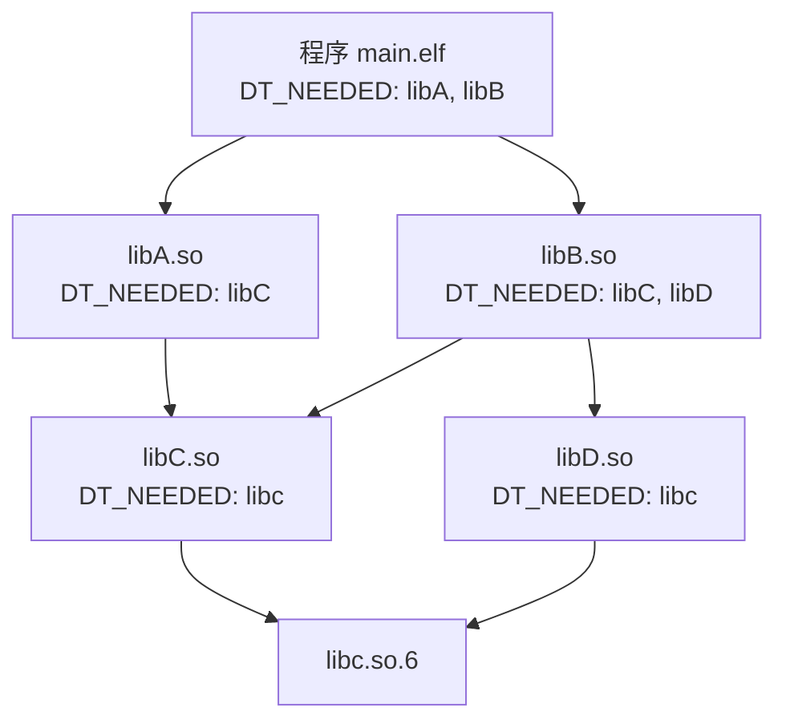
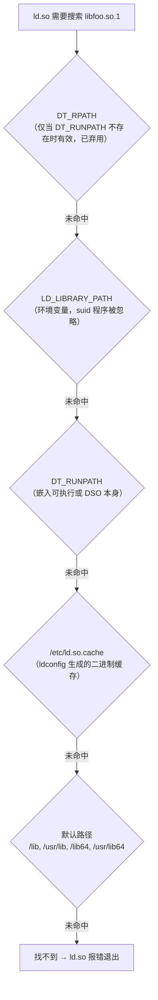
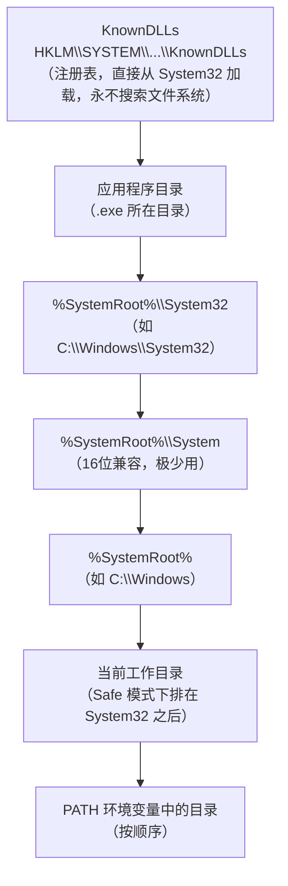

# 动态链接与加载器（5）· 依赖解析与库搜索顺序

> [!abstract] TL;DR
> - 动态链接器在加载可执行文件后，还必须递归地找到并加载它所有的依赖库——这一过程涉及 **依赖图的遍历**（Linux 广度优先）和 **库文件的搜索**（多级有优先顺序的路径列表）。
> - Linux 以 `DT_NEEDED` 标签描述直接依赖，搜索链为 `DT_RPATH` → `LD_LIBRARY_PATH` → `DT_RUNPATH` → `/etc/ld.so.cache` → 默认路径；`$ORIGIN` 等动态令牌让可重定位包成为可能。
> - Windows DLL 搜索顺序由 `SafeDllSearchMode`、`KnownDLLs`、应用目录等多个因素共同决定；SxS manifest 可强制绑定到特定版本。
> - macOS dyld 使用 `@rpath`/`@loader_path`/`@executable_path` 三种路径令牌与 `install_name`；现代版本通过 dyld shared cache 大幅缩短搜索。
> - 路径搜索中的"当前目录优先"和"可写目录优先"是 DLL 劫持与侧加载攻击的根本来源（详见 [[14.加载器劫持]]）。

本篇是「动态链接与加载器详解」系列的第五篇，承接 [[04.可执行文件的内存映射]] 讲清"可执行文件自身被映射进内存"之后，展开 **如何找到并加载它的全部依赖库**。下一篇 [[06.符号解析与符号查找]] 将在依赖图建立完成的基础上，深入符号的查找与绑定。

---

## 概述与定位

### 依赖解析：从单文件到依赖图

可执行文件加载进内存后，本身还无法运行——它引用了大量外部符号（`printf`、`malloc`、`pthread_create`……），这些符号分布在 `.so`/`.dylib`/`.dll` 里。动态链接器必须：

1. **读取可执行文件的依赖声明**，得到直接依赖的库名（如 `libc.so.6`、`libpthread.so.0`）。
2. **在文件系统上找到这些库**——这就是"库搜索"，也是本篇的核心。
3. **把找到的库递归映射进地址空间**，并对该库的依赖继续重复 1–2 步——直到依赖图的每个节点都已加载。
4. 当依赖图完整后，才进入 [[07.重定位机制详解]] 和 [[08.PLT与GOT与延迟绑定]] 所描述的重定位与符号绑定阶段。

依赖图的形状（宽度、深度、是否有环）直接决定了启动延迟与内存占用。Linux `ld.so` 对依赖图做**广度优先遍历（BFS）**；macOS dyld 和 Windows Loader 也是类似的层次化展开。

---

## 原理与机制

### 广度优先加载（Linux 视角）

Linux `ld.so` 用一个内部队列维护"待加载"库名，初始只有可执行文件本身。每弹出一个节点，就读取其 `.dynamic` 里所有 `DT_NEEDED` 条目，把尚未加载的库名加入队列末尾。已加载的库（按 SONAME 去重）不重复加载。



> BFS 保证先加载深度较浅的依赖；`libC.so` 和 `libc.so.6` 只被加载一次（SONAME 去重），无论有多少节点依赖它们。广度优先的另一个重要效果是：**符号查找时，越浅层（先加载）的库优先级越高**——这是 ELF 符号插入（symbol interposition）能工作的基础，详见 [[06.符号解析与符号查找]]。

### `DT_NEEDED` —— 依赖的声明方式

每个 ELF 共享库或可执行文件的 `.dynamic` 节中，可出现零个或多个 `DT_NEEDED` 条目：

```c
// .dynamic 节中的一条 DT_NEEDED（来自 ELF64_Dyn 结构）
// d_tag = 1（DT_NEEDED），d_val = .dynstr 中字符串偏移
// 字符串值示例：
//   "libpthread.so.0"
//   "libm.so.6"
//   "libc.so.6"
```

`DT_NEEDED` 存的是**库的 SONAME**（规范名），而非文件路径。SONAME 通常形如 `libfoo.so.N`（主版本号后缀）。动态链接器拿到这个字符串后，才去实际的文件系统路径中搜索——"按什么顺序搜索"就是下一节的主题。

关于 `.dynamic` 节的完整结构，参见 [[11.ELF文件详解/18.dynamic节.md]]。

---

## 三平台对照

| 维度 | Linux（ld.so） | macOS（dyld） | Windows（Loader） |
|---|---|---|---|
| 依赖声明格式 | `DT_NEEDED`（SONAME 字符串） | `LC_LOAD_DYLIB`（完整路径或令牌路径） | `IMAGE_IMPORT_DESCRIPTOR`（DLL 文件名） |
| 路径令牌 | `$ORIGIN`、`$LIB`、`$PLATFORM` | `@executable_path`、`@loader_path`、`@rpath` | 无显式令牌；路径相对于"应用目录" |
| 嵌入路径标签 | `DT_RPATH`（弃用）/ `DT_RUNPATH` | `install_name`（绝对路径或令牌路径） | 无（路径完全由搜索顺序决定） |
| 环境变量覆盖 | `LD_LIBRARY_PATH` | `DYLD_LIBRARY_PATH`、`DYLD_FALLBACK_LIBRARY_PATH` | 无直接等效（靠 `PATH` 末尾） |
| 系统缓存 | `/etc/ld.so.cache`（ldconfig 生成） | dyld shared cache（`/System/Library/dyld/`） | KnownDLLs 注册表键 |
| 默认路径 | `/lib`、`/usr/lib`（及架构目录） | `/usr/lib`、`/usr/local/lib`（fallback） | `%SystemRoot%\System32`、`%SystemRoot%` |
| DLL Hell 方案 | SONAME + ldconfig 软链 | 版本化 install_name + framework 包 | SxS/manifest + WinSxS 多版本共存 |
| 遍历方式 | BFS（广度优先） | 深度优先展开（Load Command 顺序） | 层次化展开（ImportDescriptor 链表） |

---

## 数据结构 / 流程详解

### Linux：库搜索的六级链路

Linux `ld.so` 按以下严格优先顺序搜索库（排名靠前的先胜出）：



> 上面的六级链路有一个重要历史演变：**`DT_RPATH` 与 `DT_RUNPATH` 的优先级关系曾发生过变化**。在 `DT_RUNPATH` 出现之前，`DT_RPATH` 是唯一的嵌入路径机制，它优先于 `LD_LIBRARY_PATH`（这被视为安全问题，因为应用可以绕过用户的路径覆盖）。引入 `DT_RUNPATH` 后，它的优先级被设计为低于 `LD_LIBRARY_PATH`（允许用户覆盖），因此 `DT_RPATH` 被标记为弃用。**当 `.dynamic` 中同时存在 `DT_RPATH` 和 `DT_RUNPATH` 时，`DT_RPATH` 被完全忽略**。

#### `DT_RPATH`（已弃用）

链接时用 `-rpath` 选项嵌入，落在 `.dynamic` 的 `DT_RPATH` 标签中：

```bash
# 链接时嵌入 DT_RPATH（已弃用写法）
gcc -o myapp main.o -L/opt/mylibs -lfoo -Wl,-rpath,/opt/mylibs
```

- 优先于 `LD_LIBRARY_PATH`（正因如此被废弃——安全上不可接受）
- 可包含多个冒号分隔路径
- 支持 `$ORIGIN` 令牌（但不推荐在 rpath 中使用）

#### `LD_LIBRARY_PATH`

用户（或打包系统）通过环境变量指定额外搜索路径：

```bash
export LD_LIBRARY_PATH=/opt/mylibs:/home/user/lib:$LD_LIBRARY_PATH
./myapp
```

- 冒号分隔多个目录
- **suid/sgid 可执行文件：`ld.so` 直接忽略 `LD_LIBRARY_PATH`**（防止权限提升攻击）
- 仅影响当前进程（及其子进程，因为子进程继承环境变量）

#### `DT_RUNPATH`（推荐的嵌入路径机制）

链接时用 `-rpath` + `-enable-new-dtags` 选项嵌入，落在 `DT_RUNPATH`：

```bash
# 链接时嵌入 DT_RUNPATH（现代推荐写法）
gcc -o myapp main.o -L./libs -lfoo \
    -Wl,-rpath,'$ORIGIN/libs' -Wl,--enable-new-dtags
```

- 优先级低于 `LD_LIBRARY_PATH`（用户可覆盖）
- 支持 `$ORIGIN`、`$LIB`、`$PLATFORM` 动态令牌
- 与 `DT_RPATH` 互斥：存在 `DT_RUNPATH` 时，`ld.so` 忽略 `DT_RPATH`

> [!note] `--enable-new-dtags` 的意义
> 链接器默认（`--disable-new-dtags`）写 `DT_RPATH`；加 `--enable-new-dtags` 后改写 `DT_RUNPATH`。检查方式：`readelf -d myapp | grep -E 'RPATH|RUNPATH'`。较老工具链默认产出 `DT_RPATH`；新版 binutils（约 ≥ 2.35）多已默认 `--enable-new-dtags`、直接产出 `DT_RUNPATH`，因此实际行为以本机 binutils 版本为准，不宜简单按发行版名臆断。

#### `/etc/ld.so.cache`（ldconfig 缓存）

`ldconfig` 是一个系统工具，它扫描系统库目录（`/etc/ld.so.conf` 及其 `include` 目录中声明的路径），把所有找到的共享库的 SONAME → 文件路径映射写入二进制缓存 `/etc/ld.so.cache`。`ld.so` 在运行时直接读这个缓存做快速查找，避免扫描目录。

```bash
# 安装新库后必须更新缓存
sudo ldconfig

# 查看缓存内容（管道过滤）
ldconfig -p | grep libssl
```

```text
# 示例输出（代表性，非本机实跑）
        libssl.so.3 (libc6,x86-64) => /lib/x86_64-linux-gnu/libssl.so.3
        libssl.so.1.1 (libc6,x86-64) => /lib/x86_64-linux-gnu/libssl.so.1.1
```

> [!warning] 示例输出为示意
> 具体路径、版本号随发行版与安装状态而变，**非本机实跑**。

#### 默认路径

若前五级均未命中，`ld.so` 尝试硬编码的默认目录：

| 架构 | 默认路径 |
|---|---|
| x86-64 | `/lib/x86_64-linux-gnu`、`/usr/lib/x86_64-linux-gnu`（Debian 多架构）；或 `/lib64`、`/usr/lib64` |
| x86（32位） | `/lib/i386-linux-gnu`、`/usr/lib/i386-linux-gnu` |
| 通用兜底 | `/lib`、`/usr/lib` |

### Linux：动态字符串令牌

`DT_RUNPATH`（和仍在使用的 `DT_RPATH`）支持三个展开令牌，运行时由 `ld.so` 替换为真实值：

| 令牌 | 展开为 | 典型用途 |
|---|---|---|
| `$ORIGIN` | 包含该库/可执行文件本身的目录（绝对路径） | 可重定位包（把依赖库放在同目录或相对子目录）；规避安装路径依赖 |
| `$LIB` | 平台相关库子目录（如 `lib64` 或 `lib`，由 ABI 决定） | 支持多架构共存（同一 rpath 在 x86-64 上展开为 `lib64`，在 i686 上展开为 `lib`） |
| `$PLATFORM` | CPU 平台字符串（如 `x86_64`、`i686`） | 按 CPU 特性选择优化库路径（较少见） |

```bash
# $ORIGIN 实例：把 libfoo 放在可执行文件同级的 lib/ 目录
# 无论安装到哪里都能找到，不依赖系统 ldconfig
gcc -o myapp main.o -L./lib -lfoo \
    -Wl,-rpath,'$ORIGIN/lib' -Wl,--enable-new-dtags

# 验证嵌入的 RUNPATH
readelf -d myapp | grep RUNPATH
```

```text
# 示例输出（代表性，非本机实跑）
 0x000000000000001d (RUNPATH) Library runpath: [$ORIGIN/lib]
```

> [!warning] 示例输出为示意

> [!note] `$ORIGIN` 的安全模型
> 即使对 suid 程序，`$ORIGIN` 在 `DT_RUNPATH` 中也受限制：glibc 会检查真实 uid/gid 与有效 uid/gid 是否一致，若程序是 setuid 的，则含 `$ORIGIN` 的 RUNPATH 会被忽略，防止用符号链接或复制攻击劫持特权程序加载路径。

### Windows：DLL 搜索顺序

Windows Loader 没有 SONAME 机制，只有**文件名**（如 `foo.dll`）。搜索顺序由注册表键 `HKLM\SYSTEM\CurrentControlSet\Control\Session Manager\SafeDllSearchMode` 控制，现代系统默认 `SafeDllSearchMode=1`（已开启）：

#### SafeDllSearchMode = 1（默认，推荐）

按以下顺序搜索：



#### SafeDllSearchMode = 0（已弃用，不安全）

当前工作目录（CWD）被提前到 `%SystemRoot%\System32` **之前**，紧接在应用程序目录后——这正是历史上"DLL 植入"攻击的根源之一（在 CWD 放一个同名 DLL 即可劫持加载），现代系统已弃用此模式。

> [!warning] 安全隐患
> 即使在 SafeDllSearchMode=1 下，**应用程序目录**仍排在 System32 之前。攻击者若能在 .exe 同目录写入恶意 DLL（如 `version.dll`、`winmm.dll` 等常见的"侧加载"目标），即可劫持。这是 DLL 侧加载（DLL Side-Loading）攻击的核心原理，详见 [[14.加载器劫持]]。

#### KnownDLLs

`KnownDLLs` 是一组预加载进内核会话空间的 DLL（如 `ntdll.dll`、`kernel32.dll`、`kernelbase.dll` 等），由注册表键 `HKLM\SYSTEM\CurrentControlSet\Control\Session Manager\KnownDLLs` 定义。Loader 对 KnownDLLs 直接从 `%SystemRoot%\System32` 映射，**绕过所有文件系统搜索路径**——这使得这些关键系统 DLL 无法被同名文件替换（除非攻击者能修改注册表）。

需澄清一个常见误解：KnownDLLs 的保护**不是靠"排在搜索顺序最前、先到先得"**。它的机制是——无论应用程序目录里是否放了同名 DLL，Loader 对 KnownDLLs 名单中的库**一律强制走 System32 的已映射副本**，根本不进入文件系统搜索流程。因此即便攻击者在应用目录植入了 `kernel32.dll`，对名单内的库也不会被加载，从根本上免疫了应用目录植入式劫持。

#### SxS / Manifest 机制

Windows XP 引入的**并行程序集（Side-by-Side Assembly，SxS）**允许多个版本的同一 DLL 共存于 `%SystemRoot%\WinSxS\` 下。程序通过嵌入 **manifest** 文件（XML 格式，可内嵌在 PE 资源节 `RT_MANIFEST` 里）声明依赖的精确版本：

```xml
<!-- 示例 manifest 片段（示意） -->
<assembly manifestVersion="1.0" xmlns="urn:schemas-microsoft-com:asm.v1">
  <dependency>
    <dependentAssembly>
      <assemblyIdentity type="win32"
        name="Microsoft.VC90.CRT"
        version="9.0.21022.8"
        processorArchitecture="x86"
        publicKeyToken="1fc8b3b9a1e18e3b" />
    </dependentAssembly>
  </dependency>
</assembly>
```

有 manifest 的程序，Loader 先检查 WinSxS 目录里是否有匹配版本，优先于普通搜索顺序。

#### `SetDllDirectory` / `AddDllDirectory` / `LOAD_LIBRARY_SEARCH_*`

Win32 API 提供了更精细的搜索路径控制：

| API / 标志 | 作用 |
|---|---|
| `SetDllDirectory("")` | 从搜索顺序中完全移除当前工作目录（缓解 CWD 劫持） |
| `SetDllDirectory(path)` | 把指定目录插入应用目录和 System32 之间 |
| `AddDllDirectory(path)` | 向进程的"DLL 目录列表"添加一个目录（不影响默认搜索顺序，需配合 `LOAD_LIBRARY_SEARCH_USER_DIRS` 使用） |
| `LoadLibraryEx(..., LOAD_LIBRARY_SEARCH_SYSTEM32)` | 仅搜索 System32，完全不查其他路径 |
| `LoadLibraryEx(..., LOAD_LIBRARY_SEARCH_APPLICATION_DIR)` | 仅搜索应用目录 |
| `LoadLibraryEx(..., LOAD_LIBRARY_SEARCH_USER_DIRS)` | 仅搜索 `AddDllDirectory` 添加的目录 |
| `LoadLibraryEx(..., LOAD_LIBRARY_SEARCH_DEFAULT_DIRS)` | System32 + Windows 目录 + 应用目录 + `AddDllDirectory` 列表（安全子集） |

推荐做法：在 `WinMain`/`DllMain` 最早期调用 `SetDllDirectory("")` 移除 CWD，并对所有 `LoadLibrary` 调用改用 `LoadLibraryEx` + `LOAD_LIBRARY_SEARCH_SYSTEM32` 或 `LOAD_LIBRARY_SEARCH_DEFAULT_DIRS`。

### macOS：dyld 路径令牌与搜索顺序

macOS 的依赖声明方式与 Linux/Windows 都不同：每个 Mach-O 文件通过若干 **`LC_LOAD_DYLIB`** Load Command 声明依赖，每个命令直接携带一个**完整路径字符串**（即 `install_name`），而非单纯的库名。

详见 [[12.Mach-O文件详解/07.Mach-O LC_LOAD_DYLIB.md]]。

```text
// LC_LOAD_DYLIB 结构（示意）
struct dylib_command {
    uint32_t cmd;          // LC_LOAD_DYLIB = 0xC
    uint32_t cmdsize;
    struct dylib {
        uint32_t name;             // 路径字符串偏移（相对命令头）
        uint32_t timestamp;
        uint32_t current_version;
        uint32_t compatibility_version;
    } dylib;
};
// name 字段值示例：
//   "/usr/lib/libSystem.B.dylib"
//   "@rpath/libfoo.1.dylib"
//   "@executable_path/../Frameworks/libbar.dylib"
```

#### macOS 三大路径令牌

| 令牌 | 展开为 | 等效 Linux 概念 |
|---|---|---|
| `@executable_path` | 宿主可执行文件（`.app/Contents/MacOS/myapp`）所在目录 | `$ORIGIN`（但只对 executable 有效） |
| `@loader_path` | **当前正在被加载的 Mach-O 文件**所在目录（对 dylib 而言即自身目录） | `$ORIGIN`（对 dylib 也有效的版本） |
| `@rpath` | 在**运行时路径列表（rpath 列表）**中依次搜索（rpath 由 `LC_RPATH` Load Command 提供，可多个） | `DT_RUNPATH`（支持多条） |

**`@rpath` 的工作方式**：如果 `LC_LOAD_DYLIB` 的路径以 `@rpath` 开头，dyld 会遍历宿主进程的 rpath 列表（由链接时 `-rpath` 嵌入的 `LC_RPATH` 组成），依次把 `@rpath` 替换为各个 rpath 目录，直到找到文件为止。

```bash
# macOS 链接：嵌入 rpath 并设置 install_name
clang -dynamiclib -o libfoo.1.dylib foo.c \
    -install_name @rpath/libfoo.1.dylib \
    -current_version 1.0 -compatibility_version 1.0

# 链接可执行文件，嵌入 LC_RPATH
clang -o myapp main.c -L. -lfoo \
    -Wl,-rpath,@executable_path/../Frameworks

# 查看
otool -l myapp | grep -A2 LC_RPATH
otool -l myapp | grep -A2 LC_LOAD_DYLIB
```

```text
# 示例输出（代表性，非本机实跑）
          cmd LC_RPATH
      cmdsize 48
         path @executable_path/../Frameworks (offset 12)

          cmd LC_LOAD_DYLIB
      cmdsize 56
         name @rpath/libfoo.1.dylib (offset 24)
```

> [!warning] 示例输出为示意

#### `install_name`

每个 dylib 在编译时通过 `-install_name` 标记自己的"规范路径"，这个字符串会被依赖方写入 `LC_LOAD_DYLIB`。`install_name` 可以是：

- 绝对路径（如 `/usr/lib/libSystem.B.dylib`）：系统库的典型用法
- `@rpath/...`：可重定位库的推荐用法
- `@executable_path/...` 或 `@loader_path/...`：嵌入 App Bundle 的私有库

修改已有二进制的 `install_name` 可以用 `install_name_tool`：

```bash
# 修改 dylib 自身的 install_name
install_name_tool -id @rpath/libfoo.1.dylib libfoo.1.dylib

# 修改依赖方记录的路径
install_name_tool -change /old/path/libfoo.1.dylib \
    @rpath/libfoo.1.dylib myapp

# 添加 rpath
install_name_tool -add_rpath @executable_path/../Frameworks myapp
```

```text
# 以上为工具命令示意，非本机实跑
```

> [!warning] 示例输出为示意

#### `DYLD_LIBRARY_PATH` 与 `DYLD_FALLBACK_LIBRARY_PATH`

macOS 提供两个环境变量：

| 变量 | 搜索时机 | 说明 |
|---|---|---|
| `DYLD_LIBRARY_PATH` | **优先**于 `@rpath`/`install_name` | 覆盖所有内嵌路径，用于调试 |
| `DYLD_FALLBACK_LIBRARY_PATH` | 所有内嵌路径失败后的**兜底** | 旧版默认含 `~/lib:/usr/local/lib:/usr/lib`，近版 macOS 已移除 `~/lib`，默认为 `/usr/local/lib:/usr/lib` |

> [!warning] SIP 限制
> 自 macOS 10.11（System Integrity Protection）起，对受保护的二进制（`/usr/bin`、`/bin`、`/sbin`、`/System` 下及 Apple 签名的进程），`DYLD_LIBRARY_PATH`/`DYLD_INSERT_LIBRARIES` 等 `DYLD_*` 环境变量会被**静默忽略**。这是 macOS 对加载器劫持的系统级防御。

#### dyld shared cache

macOS 系统 dylib（`libSystem.B.dylib`、Foundation、UIKit 等）被 `dyld` 在启动时预合并进 **dyld shared cache**（`/System/Library/dyld/` 下，Big Sur 后移入 `/private/var/db/dyld/` 或直接嵌入内核扩展），所有进程共享同一物理缓存页。对 cache 中的库，dyld **不再搜索文件系统**，直接从 cache 内部地址映射——这是 macOS 系统库加载极快的根本原因。

---

## 三平台搜索顺序对照表

以下模拟"程序想加载 `libfoo`"在三平台的完整查找链：

| 搜索级别 | Linux（找 `libfoo.so.1`） | macOS（找 `@rpath/libfoo.1.dylib`） | Windows（找 `foo.dll`） |
|---|---|---|---|
| 0（内核/缓存） | — | dyld shared cache（命中直接返回） | KnownDLLs 注册表（命中直接用 System32 版本） |
| 1（嵌入路径，高优先） | `DT_RPATH`（弃用，仅无 RUNPATH 时） | `DYLD_LIBRARY_PATH` 环境变量 | 应用程序目录（.exe 同级目录） |
| 2（用户环境） | `LD_LIBRARY_PATH` | 遍历 `LC_RPATH` 列表中的每个 rpath | %SystemRoot%\System32 |
| 3（嵌入路径，低优先） | `DT_RUNPATH` | `install_name` 绑定路径（绝对/令牌） | %SystemRoot%\System（16位） |
| 4（系统缓存） | `/etc/ld.so.cache` | `DYLD_FALLBACK_LIBRARY_PATH`（其默认值本身即下一层的默认路径） | %SystemRoot% |
| 5（默认路径） | `/lib`、`/usr/lib`（架构目录） | `/usr/local/lib`、`/usr/lib`（即 `DYLD_FALLBACK_LIBRARY_PATH` 的默认值） | 当前工作目录（SafeDllSearchMode=1） |
| 6（最终兜底） | 失败 → 报错退出 | 失败 → 报错退出 | PATH 环境变量各目录 |

---

## 实操：用工具观察

> [!warning] 示例输出为示意
> 本节所有命令输出均为**代表性示意**，非本机实跑（本机为 Windows）；具体路径、地址、符号数量随平台版本与编译选项而变，**切勿据此断言任何真实运行期状态**。读者应在对应平台自行复现。

### Linux：readelf 查看依赖与搜索路径

```bash
# 1. 查看直接依赖（DT_NEEDED）、SONAME、RUNPATH/RPATH
readelf -d /usr/bin/ls | grep -E 'NEEDED|SONAME|RUNPATH|RPATH'
```

```text
 0x0000000000000001 (NEEDED)   Shared library: [libselinux.so.1]
 0x0000000000000001 (NEEDED)   Shared library: [libc.so.6]
 0x000000000000000e (SONAME)   Library soname: [libselinux.so.1]
```

> [!warning] 示例输出为示意

```bash
# 2. 查看运行时实际加载的库及路径（ldd 展开整棵依赖树）
ldd /usr/bin/ls
```

```text
        linux-vdso.so.1 (0x00007ffee4b7d000)
        libselinux.so.1 => /lib/x86_64-linux-gnu/libselinux.so.1 (0x00007f8e1a2b0000)
        libc.so.6 => /lib/x86_64-linux-gnu/libc.so.6 (0x00007f8e1a0c0000)
        /lib64/ld-linux-x86-64.so.2 (0x00007f8e1a510000)
```

> [!warning] 示例输出为示意

`ldd` 实质上是设置 `LD_TRACE_LOADED_OBJECTS=1` 后运行目标程序，让 `ld.so` 打印加载路径而不真正执行 `main`。对不信任的程序**不要用 `ldd`**（它会执行程序的初始化代码），应改用 `readelf -d` 或 `objdump -p`。

```bash
# 3. 看 RUNPATH / RPATH（区分两者）
readelf -d myapp | grep -E 'RPATH|RUNPATH'
# 有 RUNPATH 行 → 用 DT_RUNPATH；有 RPATH 行 → 用弃用的 DT_RPATH

# 4. patchelf 修改已构建二进制的 RUNPATH（不必重新编译）
patchelf --print-rpath myapp
patchelf --set-rpath '$ORIGIN/lib' myapp
```

> [!warning] 示例输出为示意
> `patchelf --set-rpath` 会直接修改 ELF 文件；在生产二进制上操作前务必备份，且修改后需重新验证签名（如有）。`patchelf` 本身不是 GNU binutils 的标准工具，需单独安装。

```bash
# 5. 查看 ldconfig 缓存中的某个库
ldconfig -p | grep libssl
# 输出格式：  libssl.so.3 (libc6,x86-64) => /lib/x86_64-linux-gnu/libssl.so.3

# 6. 调试库搜索过程（LD_DEBUG）
LD_DEBUG=libs ./myapp 2>&1 | head -40
# 会打印 ld.so 尝试每个路径的过程，"find library=..."
```

> [!warning] 示例输出为示意

### macOS：otool / dyld_info 查看依赖

```bash
# 查看 LC_LOAD_DYLIB（依赖列表）和 LC_RPATH（rpath 列表）
otool -l /bin/ls | grep -A4 'LC_LOAD_DYLIB\|LC_RPATH'

# 更现代的工具（macOS 12+）
dyld_info -dependents /bin/ls
dyld_info -fixups /bin/ls
```

```text
# 示例输出（代表性，非本机实跑）
          cmd LC_LOAD_DYLIB
      cmdsize 56
         name /usr/lib/libutil.dylib (offset 24)
         ...
          cmd LC_LOAD_DYLIB
      cmdsize 56
         name /usr/lib/libncurses.5.4.dylib (offset 24)
```

> [!warning] 示例输出为示意

```bash
# DYLD_PRINT_LIBRARIES 跟踪实际加载（对普通程序有效，SIP 程序无效）
DYLD_PRINT_LIBRARIES=1 /usr/local/bin/myapp 2>&1 | head -20
```

> [!warning] 示例输出为示意

### Windows：Dependency Walker / Process Monitor / where

```powershell
# PowerShell：查看 PE 的导入 DLL 列表（需 dumpbin，Visual Studio 附带）
dumpbin /DEPENDENTS myapp.exe

# 或用 Python pefile
python -c "import pefile; pe=pefile.PE('myapp.exe'); [print(e.dll) for e in pe.DIRECTORY_ENTRY_IMPORT]"

# Process Monitor（Sysinternals）过滤 LoadImage + Path Contains .dll
# → 可看到 Loader 实际尝试过的每个路径及结果（NAME NOT FOUND / SUCCESS）

# where 命令（类似 which）查找 DLL 在 PATH 中的位置
where foo.dll
```

```text
# 示例输出（代表性，非本机实跑）
C:\Windows\System32\foo.dll
```

> [!warning] 示例输出为示意

---

## 攻防 / 陷阱

### 库搜索劫持的统一模式

三大平台的 DLL/dylib/so 劫持，无论具体机制如何不同，背后都是同一个模式：

```text
【攻击者可控路径】排在【合法库所在路径】前面
          ↓
Loader 找到攻击者的 libfoo，认为是合法的，直接加载
          ↓
攻击者代码随目标程序权限执行
```

#### Linux：`LD_LIBRARY_PATH` 注入

```bash
# 攻击者在 /tmp/evil/ 放一个 libc.so.6
LD_LIBRARY_PATH=/tmp/evil ./target   # 优先加载 /tmp/evil/libc.so.6
```

防御：suid 程序忽略 `LD_LIBRARY_PATH`；普通程序可用 `DT_RUNPATH` 配合绝对路径或只含可信 `$ORIGIN` 路径。

#### Linux：可写 `DT_RPATH` 目录

若嵌入的 `DT_RPATH` 包含攻击者可写的目录（如 `/tmp`、用户 `$HOME`），在该目录放一个同名库即可劫持。

> [!warning] 安全提示
> 生产二进制的 `DT_RPATH`/`DT_RUNPATH` **不应包含可写目录或 CWD（`.`）**。`$ORIGIN` 相对路径虽然便携，但如果可执行文件被部署到攻击者可写入的目录，同样危险。可用 `patchelf --print-rpath` 审计已有二进制。

#### Windows：DLL 侧加载（DLL Side-Loading）

最常被 APT 利用的技巧：找一个签名合法且有 DLL 劫持漏洞的可执行文件（搜索"应用目录"中不存在于 System32 的 DLL），把自定义 DLL 放在同一目录触发加载。

详细攻防分析见 [[14.加载器劫持]]。

#### macOS：`DYLD_INSERT_LIBRARIES`

```bash
# 注入自定义 dylib，先于所有依赖加载
DYLD_INSERT_LIBRARIES=/tmp/evil.dylib /usr/local/bin/target
```

防御：SIP 下受保护二进制静默忽略；开发者可在 Hardened Runtime 中关闭 `com.apple.security.cs.allow-dyld-environment-variables` 权利（Entitlement）。

---

## 小结

1. **依赖图而非依赖链**：可执行文件的依赖是一棵有向无环图（DAG）；Linux `ld.so` 用 BFS 展开，保证浅层库先加载，这直接决定了符号插入的优先级顺序。
2. **Linux 六级搜索链**：`DT_RPATH`（弃用）→ `LD_LIBRARY_PATH` → `DT_RUNPATH` → `/etc/ld.so.cache` → 默认路径；`DT_RUNPATH` 是现代推荐的嵌入路径机制，因为它允许 `LD_LIBRARY_PATH` 覆盖（用户可控），而 `DT_RPATH` 不行。
3. **`$ORIGIN` 令牌是可重定位包的基石**：让库搜索相对于程序自身位置，彻底摆脱绝对安装路径依赖；但需注意 suid 场景下被 glibc 主动禁用。
4. **Windows 搜索顺序的核心是"应用目录先于 System32"**：这在功能上合理（允许应用携带私有版本），但在安全上是 DLL 侧加载的根因；`SetDllDirectory("")` + `LOAD_LIBRARY_SEARCH_DEFAULT_DIRS` 是现代缓解手段。
5. **macOS `@rpath` 机制最灵活**：一个二进制可以携带多个 `LC_RPATH`，dyld 遍历查找；`@loader_path` 对内嵌 Framework 中的 dylib 互相引用尤其有用，因为 `@executable_path` 只指向宿主 .app 而非 Framework 自身目录。
6. **任何"可写目录排在可信路径前面"都是安全漏洞**：无论是 Linux 的 `LD_LIBRARY_PATH` 注入、Windows 的 CWD DLL 植入，还是 macOS 的 `DYLD_LIBRARY_PATH` 覆盖，本质相同——搜索顺序的滥用是 [[14.加载器劫持]] 的共同根源。

---

## 相关阅读

- **ELF `.dynamic` 节（含 `DT_NEEDED`/`DT_RPATH`/`DT_RUNPATH`/`DT_SONAME` 完整标签表）**：[[11.ELF文件详解/18.dynamic节.md]]
- **PE 导入表（Windows 依赖声明的底层结构）**：[[13.PE文件详解/08-详解PE文件(八)：导入表.md]]
- **Mach-O `LC_LOAD_DYLIB`（macOS 依赖声明命令）**：[[12.Mach-O文件详解/07.Mach-O LC_LOAD_DYLIB.md]]
- **前置：可执行文件自身如何映射进内存**：[[04.可执行文件的内存映射]]
- **后继：依赖图建好后符号如何查找与绑定**：[[06.符号解析与符号查找]]
- **加载器劫持的完整攻防分析**：[[14.加载器劫持]]
- **符号解析与重定位（依赖加载后的下一步）**：[[07.重定位机制详解]]
- **PLT/GOT 与延迟绑定**：[[08.PLT与GOT与延迟绑定]]

---

⬅️ 上一篇 [[04.可执行文件的内存映射]] ｜ 🏠 [[00.动态链接与加载器总览]] ｜ 下一篇 [[06.符号解析与符号查找]] ➡️
