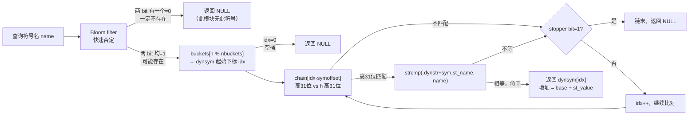

# 动态链接与加载器（6）· 符号解析与符号查找

> [!abstract] TL;DR
> - **核心问题**：可执行文件调用 `printf`，动态链接器如何在一堆已加载的共享库里找到它？
> - **全局作用域链**：加载器把所有已加载模块的符号表组成一条有序的"查找链"，可执行文件排第一，其后依赖库按加载顺序（广度优先）追加；查找时沿链走下去，**"先定义者赢"（first-definition wins）**，找到第一个匹配定义即停。
> - **哈希加速**：逐条扫 `.dynsym` 的 O(n) 开销不可接受；`.gnu.hash` 用 Bloom filter 快速否定 + bucket/chain + 预排序，把"绝大多数查找"的热路径压到几条整数操作。
> - **三平台分叉**：Linux 用全局作用域链（扁平命名空间）；macOS 旧版同理（flat namespace），新版默认两级命名空间（twolevel）——符号记录"来自哪个 dylib"，查找时直接打到目标库，不走扁平全局链；Windows 按 DLL 名字+序号/名字导入，IAT 填充在加载期完成，无运行期符号链。

本篇承接 [[05.依赖解析与库搜索顺序]]（找到了哪些库、按什么顺序加载它们），聚焦"库加载进来之后，符号名到地址的映射如何完成"。这一过程的输出（符号地址）是 [[07.重定位机制详解]] 的输入：只有先查到符号定义在哪、地址是多少，重定位才能把占位值改写成真实地址。哈希表的静态结构细节已在 [[11.ELF文件详解/37.hash节.md]] 和 [[11.ELF文件详解/15.dynsym节.md]] 中系统讲解，本篇与它们强相关、口径一致，但视角不同：那两篇讲"文件里这些节长什么样"，本篇讲"运行时这些节如何被查询、以及查询结果如何决定最终地址"。

---

## 概述与定位

### 符号解析发生在何时

动态链接分两个大阶段：**加载（load）** 与 **绑定（bind）**。[[05.依赖解析与库搜索顺序]] 完成的是"加载"——把依赖树上的每个 DSO 按正确路径找到、`mmap` 进地址空间。"绑定"则是本篇主题：把每个未定义符号（`SHN_UNDEF`，见 [[11.ELF文件详解/15.dynsym节.md]]）连接到某个 DSO 的已定义符号，取得其运行时地址，最终写进 GOT/IAT（重定位，见 [[07.重定位机制详解]]）。

对于数据符号（`GLOB_DAT`/`RELATIVE` 重定位），绑定在加载期立即发生；对于函数符号（`JUMP_SLOT` 重定位），Linux/旧版 macOS 默认延迟到首次调用——这是 [[08.PLT与GOT与延迟绑定]] 的主题，而"找到符号"这一核心操作，延迟绑定与立即绑定使用的是同一套查找逻辑，本篇专门讲清楚。

### 本篇在系列中的位置

| 维度 | 本篇聚焦 | 相邻篇章 |
|---|---|---|
| 输入 | 已加载的 DSO 集合与依赖顺序 | [[05.依赖解析与库搜索顺序]] |
| 核心操作 | 符号名→地址的查找与作用域规则 | 本篇 |
| 输出使用方 | 把查到的地址写进 GOT | [[07.重定位机制详解]] |
| 延迟场景 | 首次调用时触发的按需查找 | [[08.PLT与GOT与延迟绑定]] |
| 插入/劫持 | LD_PRELOAD 如何利用查找顺序 | [[14.加载器劫持]] |

---

## 原理与机制

### 全局符号作用域与查找序

Linux `ld.so` 把所有已加载模块维护成一条有序链表，称为 **全局符号作用域（global symbol scope）**，每个节点是一个 `struct link_map`（glibc 内部结构，持有本 DSO 的基址、`.dynsym` 指针、`.gnu.hash` 指针等）。查找顺序由加载顺序决定，遵循以下规则：

1. **可执行文件本身排第一**：它的导出符号（`SHN_UNDEF` 之外的 `STB_GLOBAL` 符号）在整条链中优先级最高。
2. **依赖库按广度优先（BFS）顺序追加**：先加载直接依赖（`DT_NEEDED` 列表中的顺序），再加载各直接依赖的间接依赖，依此类推。
3. **先定义者赢（first-definition wins）**：遍历链时，找到第一个绑定（binding）为 `STB_GLOBAL` 或 `STB_WEAK` 的定义就停，不再往后查。

```text
查找链示意（示意顺序，非真实运行期地址）：

[可执行文件 main] → [libA.so] → [libB.so] → [libC.so (libA 依赖)] → [libc.so] → …
        ↑ 最优先                                                              ↑ 最靠后
```

这个模型被称为 **扁平命名空间（flat namespace）**，与 macOS 两级命名空间（下文详述）形成对比。

> [!note] 为什么"先定义者赢"而不是"更近的定义赢"
> 在动态链接的扁平命名空间下，"先加载者"即"更近者"，两者等价。这一规则使得可执行文件可以覆盖任何共享库里的同名符号——这是 **符号插入（symbol interposition）** 的机制基础，也是 `LD_PRELOAD` 的原理所在（详见 [[14.加载器劫持]]）。

### 符号绑定（binding）的三种级别

`st_info` 高 4 位编码绑定属性（[[11.ELF文件详解/15.dynsym节.md]] 有完整字段解析），在符号查找中具有不同语义：

| 绑定 | 值 | 在查找中的行为 |
|---|---|---|
| `STB_LOCAL` | 0 | **不参与跨模块查找**；只在本 DSO 内部可见，不出现在 `.dynsym` 的跨模块候选中 |
| `STB_GLOBAL` | 1 | **强符号**；优先匹配，一旦找到即确定；两个 DSO 同时定义同名 `STB_GLOBAL` 符号，"先定义者赢"，后者在查找时不可见 |
| `STB_WEAK` | 2 | **弱符号**；若存在同名 `STB_GLOBAL` 定义，弱定义被跳过；只有整条作用域链里没有任何强定义时，弱定义才被采用；若弱引用完全无定义，动态链接器允许其为 0（即 `NULL` 地址），程序不会因此崩溃（但调用该地址仍会崩） |

**弱符号被强符号覆盖的经典场景**：

```c
// libfoo.so 中：
__attribute__((weak)) void hook(void) { /* 默认实现 */ }

// 应用程序 main.c 中：
void hook(void) { /* 用户自定义，会覆盖 libfoo.so 的弱定义 */ }
```

因为可执行文件排在全局作用域链第一，`hook` 的强定义会在查找链中被首先找到，`libfoo.so` 的弱定义永远不会被外部查找命中。这是提供"可被覆盖的默认实现"的标准 C 惯用法。

另一个常见弱符号：`STB_GNU_UNIQUE`（值 10，GNU 扩展）——进程全局唯一实例，用于 C++ 模板静态成员，防止多份 DSO 各自保有一份副本。动态链接器看到 `UNIQUE` 时，若进程里已有同名 `UNIQUE` 定义，后续加载的 DSO 共用已有定义，而不是各自保有副本。

---

## 符号插入（Symbol Interposition）

符号插入是"先定义者赢"规则的自然推论：**如果在全局查找链中，某个 DSO 先于"原本提供该符号的库"被找到，且该 DSO 也定义了同名强符号，则所有模块对该符号的引用都会绑定到插入者的定义**，而非原始定义。

最典型的应用是 **`LD_PRELOAD`**：通过环境变量 `LD_PRELOAD=/path/to/myhook.so`，`ld.so` 在构建查找链时把 `myhook.so` 插到可执行文件之后、所有其他依赖之前，使其所有导出符号在查找中优先于 `libc.so`、`libm.so` 等系统库。这样一来，`myhook.so` 中定义的 `malloc` 就会覆盖 `libc.so` 的 `malloc`，实现内存分配拦截、性能追踪、故障注入等用途。

```text
LD_PRELOAD 生效后的查找链（示意）：

[main] → [myhook.so ← LD_PRELOAD 注入] → [libA.so] → [libc.so] → …
               ↑ 在此定义的 malloc 优先于 libc 的 malloc
```

> 符号插入的攻击面与防御（`STV_HIDDEN`、版本脚本控制导出范围等）详见 [[14.加载器劫持]]。

**插入的范围限制**：并非所有符号都能被插入。若目标符号声明了 `STV_HIDDEN` 或 `STV_PROTECTED` 可见性（见 [[11.ELF文件详解/15.dynsym节.md]] 的可见性表），则：

- `STV_HIDDEN`：不进入 `.dynsym`，完全不对外可见，无法被插入。
- `STV_PROTECTED`：出现在 `.dynsym`（外部可看到），但**模块内部引用绑定到本模块定义，不可被外部插入**——即外部模块使用外部定义，本模块内部不受影响。

---

## 三平台对照

| 维度 | Linux（ELF / ld.so） | macOS（Mach-O / dyld） | Windows（PE / Loader） |
|---|---|---|---|
| 命名空间模型 | **扁平（flat）**：所有模块共享单一全局查找链 | 旧版 flat；现代默认 **两级（twolevel）**：符号记录"来自哪个 dylib" | **按 DLL 分区**：每个导入符号在编译期就绑定到特定 DLL，运行期查找不跨 DLL |
| 查找方向 | 全局作用域链，BFS 顺序，先定义者赢 | twolevel：直接查目标 dylib 的导出表（无链式搜索）；flat：同 ELF 逻辑 | 按 `IMAGE_IMPORT_DESCRIPTOR` 的 DLL+符号名/序号，一对一查找 |
| 哈希加速 | `.gnu.hash`（DT_GNU_HASH）+ 可选旧版 `.hash`（DT_HASH） | dylib 内部有类似 hash 表（`nlist` 结构，`LC_SYMTAB`/`LC_DYSYMTAB`）；两级命名空间使查找更直接 | PE 导出目录的 `AddressOfNames` 是已排序数组，加载器用**二分查找** |
| 符号绑定（默认时机） | 立即（GLOB_DAT）/ 延迟（JUMP_SLOT）；默认 lazy | 旧版 lazy（`dyld_stub_binder`）；现代 chained fixups 趋向加载期 | 加载期全量（IAT 加载即填满） |
| 符号插入 | `LD_PRELOAD` 注入到查找链最前 | `DYLD_INSERT_LIBRARIES`（flat namespace 下有效；twolevel 下通常无效，需 `-flat_namespace` 重链） | 无内建符号插入；DLL 侧加载/IAT hook 是替代手段（见 [[14.加载器劫持]]） |
| 弱符号语义 | `STB_WEAK`：强符号覆盖弱符号；弱引用无定义时地址为 0 | `N_WEAK_DEF`/`N_WEAK_REF`：同理，强定义覆盖弱定义 | MSVC 没有弱符号概念；MinGW 对 GCC 弱符号有限支持；通常用 `__declspec(selectany)` 替代 |
| 序号（ordinal）导入 | 无 | 无 | **有**：DLL 可按序号导出，导入方可用序号（而非名字）导入，节省比较开销（无需字符串比较） |

### macOS 两级命名空间（twolevel namespace）详解

macOS 默认链接选项 `-twolevel_namespace`（`dyld` 的默认模式）下，每个导入符号的元数据里都记录了**它来自哪个 dylib**（以 `BIND_SPECIAL_DYLIB_*` 编码在 `LC_DYLD_INFO` 的 bind opcode 流，或 chained fixups 的 `fixup_chain_entry`）。

```text
twolevel 记录示意（Mach-O bind opcode 语义）：

符号: _printf  → 来自 dylib ordinal 1（/usr/lib/libSystem.B.dylib）
符号: _CFRunLoopRun → 来自 dylib ordinal 2（CoreFoundation）
```

查找时，`dyld` **直接跳到对应 dylib 的导出表**查找，无需沿全局链遍历。这带来两个明显效果：

1. **更快**：省去了遍历其他 DSO 的开销，尤其对大量依赖的 App 启动性能影响显著。
2. **符号插入受阻**：`DYLD_INSERT_LIBRARIES` 注入的库**无法**覆盖 twolevel 符号——因为查找直接去目标 dylib，注入库的同名符号永远不会被看到。若需插入，必须以 `-flat_namespace` 重新链接目标 dylib（通常不可行）。

相比之下，macOS 的 **`-flat_namespace`** 链接选项（`dyld` 历史模式）等同 Linux 的扁平命名空间，符号插入和 `DYLD_INSERT_LIBRARIES` 均有效，代价是查找变慢。

### Windows 序号（ordinal）导入

PE 导出目录（`IMAGE_EXPORT_DIRECTORY`）同时支持按**名字**和按**序号**导出：

- **按名字导出**：`AddressOfNames` 数组存符号名指针（已排序），`AddressOfNameOrdinals` 做名字→序号的映射，加载器用二分查找定位名字，再取序号，再查 `AddressOfFunctions` 得地址。链：名字→序号→函数地址，**两次间接**。
- **按序号导入**：导入方直接在 `IMAGE_IMPORT_DESCRIPTOR` 里记录序号（高位置 1 标识为序号），加载器**直接**用序号索引 `AddressOfFunctions`，跳过字符串比较，理论上更快。代价是 DLL 必须保证序号稳定，否则更新 DLL 后序号偏移可能变化。

```text
PE 导出目录结构示意（示意，不含真实地址）：

AddressOfFunctions[0..N-1]:  各导出函数的 RVA
AddressOfNames[0..M-1]:      各命名导出的名字指针（排序后）
AddressOfNameOrdinals[0..M-1]: 名字到序号的映射

按名字查找 "CreateFile":
  1. 二分查找 AddressOfNames，找到下标 k
  2. ordinal = AddressOfNameOrdinals[k]
  3. addr = base + AddressOfFunctions[ordinal]

按序号 42 查找:
  addr = base + AddressOfFunctions[42]   ← 直接一步
```

---

## 数据结构 / 流程详解

### `.dynsym` + `.dynstr` + `.gnu.hash` 的协作关系

三者构成"查找三件套"（静态结构详见 [[11.ELF文件详解/15.dynsym节.md]] 和 [[11.ELF文件详解/37.hash节.md]]）：

- **`.dynsym`**（`SHT_DYNSYM`）：`Elf64_Sym` 条目数组，每条记录一个符号的地址、大小、绑定/类型/可见性；动态链接器遍历/定位后，从 `st_value` 取偏移（加模块基址得运行地址）。
- **`.dynstr`**（`SHT_STRTAB`）：符号名字符串池；`.dynsym` 每条的 `st_name` 是此池内的字节偏移。
- **`.gnu.hash`**（`SHT_GNU_HASH`）：索引加速结构，不存储符号本身，只存"用符号名能快速定位 `.dynsym` 下标"的数据。



> 图示为 `.gnu.hash` 单个 DSO 内的查找流程。完整符号解析流程还包含外层的"沿全局作用域链遍历每个 DSO"。

### `.gnu.hash` 查找算法逐步拆解

`.gnu.hash` 的内存布局（完整字段见 [[11.ELF文件详解/37.hash节.md]]）：

```c
struct gnu_hash_header {
    uint32_t nbuckets;    // 桶数
    uint32_t symoffset;   // .dynsym 中第一个参与哈希的符号下标
                          // [0, symoffset) 的符号（通常 STB_LOCAL）不放入哈希
    uint32_t bloom_size;  // Bloom 过滤器 word 数（必须是 2 的幂）
    uint32_t bloom_shift; // Bloom 第二哈希的移位量 shift2
    // 紧跟：
    // uintN_t  bloom[bloom_size];   N=64(ELF64)/32(ELF32)
    // uint32_t buckets[nbuckets];
    // uint32_t chain[];             长度 = dynsym_count - symoffset
};
```

**哈希函数 `dl_new_hash`**（djb2 变体）：

```c
static uint32_t dl_new_hash(const char *name) {
    uint32_t h = 5381;
    for (unsigned char c; (c = *name++) != '\0'; )
        h = (h << 5) + h + c;  // h = h * 33 + c
    return h;
}
```

相比旧版 `elf_hash`（SysV），`dl_new_hash` 无高位折叠操作、少一次条件分支，雪崩性更好，碰撞率更低。

**Bloom filter 快速否定**：

```c
// 查找时（伪代码，基于 ELF64 64 位 word）
uint32_t h1 = dl_new_hash(name);
uint32_t h2 = h1 >> bloom_shift;
uint32_t c  = 64;                              // ELF64 使用 64 位 word
uint32_t n  = (h1 / c) & (bloom_size - 1);    // 选哪个 bloom word
uint64_t bitmask = (1ULL << (h1 % c)) | (1ULL << (h2 % c));
if ((bloom[n] & bitmask) != bitmask)
    return NULL;   // 两个 bit 有一个为 0 → 此符号在此 DSO 中一定不存在
```

Bloom filter 的核心价值：符号查找中"当前 DSO 没有这个符号"是最常见结果（大部分 DSO 只导出少数符号）。Bloom filter 以极小代价（几十个 64 位 word）在 O(1) 内排除"一定没有"的查询，省去了进入 bucket/chain 的开销。

**bucket → chain 遍历**：

```c
uint32_t idx = buckets[h1 % nbuckets];
if (idx == 0) return NULL;  // 空桶
for (;;) {
    uint32_t h_stored = chain[idx - symoffset];
    if ((h_stored & ~1u) == (h1 & ~1u)) {     // 高 31 位匹配（先整数比较，廉价）
        const char *sym_name = dynstr + dynsym[idx].st_name;
        if (strcmp(sym_name, name) == 0)       // 再字符串比较（昂贵）
            return &dynsym[idx];               // 命中
    }
    if (h_stored & 1u) break;                  // stopper bit=1，链末
    idx++;
}
return NULL;
```

**与旧版 `.hash` 的关键区别**：

| 维度 | `.hash`（SysV） | `.gnu.hash`（GNU） |
|---|---|---|
| 哈希函数 | `elf_hash`（碰撞率较高，含条件分支） | `dl_new_hash`（djb2 变体，更优） |
| 早退机制 | 无，"不存在"必须走完整条链 | **Bloom filter**，O(1) 排除不存在 |
| chain 存储 | `.dynsym` 符号索引（随机跳转） | 高31位哈希 + stopper LSB（顺序访问，缓存友好） |
| 符号排序要求 | 无 | 必须按 `hash % nbuckets` 升序排列，同桶符号在 `.dynsym` 中连续 |
| 本地符号 | 全部含（nchain = dynsym 总数） | 只含全局符号（`[symoffset, end]`） |
| 动态条目 | `DT_HASH`（值 3） | `DT_GNU_HASH`（值 `0x6ffffef5`） |

动态链接器若同时看到 `DT_HASH` 和 `DT_GNU_HASH`，**优先使用 `DT_GNU_HASH`**。

### 跨 DSO 的完整查找流程

```text
输入：要查找的符号名 name，本模块的 l_scope（作用域链）

for each DSO in l_scope（按加载顺序）:
    1. 若 DSO 有 .gnu.hash：
       a. 计算 dl_new_hash(name)
       b. Bloom filter 否定 → 跳过此 DSO（continue）
       c. 查 bucket → chain，比对哈希高31位 + strcmp
    2. 否则用旧 .hash：
       a. elf_hash(name)
       b. bucket[hash%nbucket] → chain 链遍历 + strcmp
    3. 命中 → 返回 (定义所在 DSO, dynsym 条目)
    4. 未命中 → 继续下一个 DSO

若遍历完整条链仍无强定义：
    - 若有弱定义（STB_WEAK）→ 用最先找到的弱定义
    - 若弱引用（STB_WEAK 引用）完全无任何定义 → 地址设为 0
    - 若强引用（STB_GLOBAL）完全无定义 → 链接器报 undefined symbol 错误
```

---

## 代码与汇编

### `_dl_fixup` 中的符号查找调用点

在 [[08.PLT与GOT与延迟绑定]] 中已详细讲解，`_dl_fixup(link_map, reloc_index)` 是延迟绑定解析的 C 实现核心。其中调用 `_dl_lookup_symbol_x` 的片段（glibc `elf/dl-runtime.c`，简化伪代码）：

```c
DL_FIXUP_VALUE_TYPE _dl_fixup(struct link_map *l, ElfW(Word) reloc_arg) {
    // 1. 定位重定位条目和符号
    const ElfW(Rela) *reloc = &JMPREL[reloc_arg];
    const ElfW(Sym)  *sym   = &symtab[ELF64_R_SYM(reloc->r_info)];
    const char       *name  = strtab + sym->st_name;

    // 2. 符号查找（遍历 l->l_scope，即全局作用域链）
    const struct r_found_version *version = ...;   // 符号版本约束
    lookup_t result = _dl_lookup_symbol_x(
        name, l,        // 符号名、请求方 link_map
        &ref,           // 输出：命中的 sym 条目
        l->l_scope,     // 全局作用域链（按加载顺序排列的 link_map 数组）
        version,        // 版本过滤（如 GLIBC_2.17）
        ELF_RTYPE_CLASS_PLT,  // 查找类型：函数类
        0, NULL
    );

    // 3. 计算最终地址并回填 GOT
    DL_FIXUP_VALUE_TYPE value = DL_FIXUP_MAKE_VALUE(result, ref);
    *reloc_addr = value;   // 回填 .got.plt 槽位
    return value;
}
```

`l->l_scope` 是 `link_map` 上挂载的"作用域链数组"（`struct r_scope_elem *[]`），每个元素对应一组 DSO——通常全局作用域就是整个已加载 DSO 链表。`_dl_lookup_symbol_x` 按顺序遍历，对每个 DSO 调用 `do_lookup_x`，内部即是上面讲的 `.gnu.hash` 查找逻辑。

### 符号版本过滤

查找时，若符号带有版本信息（`.gnu.version_r`/`.gnu.version_d` 节，见 [[11.ELF文件详解/15.dynsym节.md]] §8），`_dl_lookup_symbol_x` 除了匹配名字，还会匹配版本。例如调用方需要 `GLIBC_2.17` 版本的 `memcpy`，即使 `libc.so` 同时有 `memcpy@@GLIBC_2.14` 和 `memcpy@@GLIBC_2.17`，查找只会命中版本匹配的那个。版本不匹配的条目被跳过，即使名字完全相同。这一机制详细展开在 [[13.符号版本与二进制兼容]]。

---

## 实操：用工具观察

> [!warning] 示例输出为示意
> 本节所有命令输出均为**代表性示意**，非本机实跑；具体地址、符号数量、哈希值随工具链版本、编译选项而变，**切勿据此断言任何真实运行期地址**。读者应在自己的 Linux 环境中复现，以本机实际输出为准。

### 1. 查看动态符号表

```bash
# 查看动态符号表（-W 加宽列，方便看完整名字）
readelf --dyn-syms -W a.out
```

```text
Symbol table '.dynsym' contains 5 entries:
   Num:    Value          Size Type    Bind   Vis      Ndx Name
     0: 0000000000000000     0 NOTYPE  LOCAL  DEFAULT  UND
     1: 0000000000000000     0 FUNC    GLOBAL DEFAULT  UND puts@GLIBC_2.2.5 (2)
     2: 0000000000000000     0 FUNC    GLOBAL DEFAULT  UND __libc_start_main@GLIBC_2.34 (3)
     3: 0000000000000000     0 NOTYPE  WEAK   DEFAULT  UND __gmon_start__
     4: 0000000000001149    26 FUNC    GLOBAL DEFAULT   15 main
```

> [!warning] 示例输出为示意
> `Ndx=UND` 的符号（`puts`/`__libc_start_main`）是本文件的导入符号，`Ndx=15` 的 `main` 是本文件的导出符号。`WEAK DEFAULT UND` 的 `__gmon_start__` 是弱引用——即使找不到定义，加载器也不会报错，只会让其地址保持 0。

### 2. 查看哈希表直方图

```bash
# -I / --histogram 显示 .gnu.hash 的桶使用分布
readelf -I /lib/x86_64-linux-gnu/libc.so.6
```

```text
Histogram for `.gnu.hash' bucket list length (total of 1031 buckets):
 Length  Number     % of total  Coverage
      0  312          ( 30.3%)
      1  469          ( 45.5%)     20.5%
      2  186          ( 18.0%)     36.8%
      3   52          (  5.0%)     44.6%
      4   10          (  1.0%)     46.3%
      5    2          (  0.2%)     46.5%
      ...
```

> [!warning] 示例输出为示意
> "Length 0" 的比例（空桶）反映哈希分布稀疏程度；多数桶链长为 0 或 1 说明哈希分布良好，平均查找接近 O(1)。`readelf -I` 同时会展示 `.hash` 和 `.gnu.hash` 的直方图（若两者都存在）。

### 3. 确认使用哪种哈希节

```bash
readelf -d a.out | grep -E '(GNU_HASH|HASH)'
```

```text
 0x000000006ffffef5 (GNU_HASH)    0x3b0
 0x0000000000000004 (HASH)        0x2f8
```

> [!warning] 示例输出为示意
> 两个条目都存在说明用 `--hash-style=both` 编译（兼顾兼容性与性能）；只有 `GNU_HASH` 说明用 `--hash-style=gnu`（现代发行版默认）；只有 `HASH` 说明用 `--hash-style=sysv`（旧版兼容）。动态链接器优先使用 `GNU_HASH`。

### 4. 用 `LD_DEBUG=symbols` 观察符号查找过程

```bash
LD_DEBUG=symbols ./a.out 2>&1 | head -20
```

```text
     12345:  symbol=puts;  lookup in file=./a.out [0]
     12345:  symbol=puts;  lookup in file=/lib/x86_64-linux-gnu/libc.so.6 [0]
     12345:  binding file ./a.out [0] to /lib/x86_64-linux-gnu/libc.so.6 [0]: normal symbol `puts' [GLIBC_2.2.5]
```

> [!warning] 示例输出为示意
> 每行 `lookup in file=X` 对应"在 X 这个 DSO 里查找"的一次尝试，若失败则看下一行（继续在下一个 DSO 查找）；`binding file A to B` 说明 A 中对 `puts` 的引用最终绑定到了 B 中的定义。这直接体现了全局作用域链的遍历过程：先查 `a.out` 自身（没有 `puts` 的定义），再查 `libc.so.6`（找到）。
>
> `LD_DEBUG=symbols,bindings` 还可同时看绑定结果；`LD_DEBUG=all` 输出更详细（含映射、初始化等所有阶段）。

### 5. 工具速查

| 目的 | 命令 | 看什么 |
|---|---|---|
| 查看动态符号表 | `readelf --dyn-syms -W file` | 符号名、绑定属性（GLOBAL/WEAK）、是否 UND |
| 查哈希分布质量 | `readelf -I file` | 桶链长直方图，判断哈希是否均匀 |
| 哈希节类型 | `readelf -d file \| grep HASH` | GNU_HASH / HASH / both |
| 观察查找过程 | `LD_DEBUG=symbols ./prog` | 逐步看"查到哪个 DSO 才命中" |
| 所有绑定结果 | `LD_DEBUG=bindings ./prog` | 每个符号绑定到哪个 DSO 的哪个版本 |
| 加载顺序 | `LD_DEBUG=libs ./prog` | DSO 被加载的顺序，即作用域链顺序 |
| macOS 两级信息 | `dyld_info -exports binary` | 各 dylib 的导出符号（需 macOS Ventura+ 的 `dyld_info`） |

---

## 攻防 / 陷阱

### 符号插入：工具还是攻击面

`LD_PRELOAD` 是合法强大的调试工具（内存检测、性能追踪、测试 mock），同时也是一个经典攻击向量：

- **攻击**：在 setuid 二进制中，若 `ld.so` 不清除 `LD_PRELOAD`，攻击者可注入恶意库覆盖 `getuid`/`geteuid` 等，实现权限提升。glibc 的 `ld.so` 对 setuid/setgid 程序会**忽略** `LD_PRELOAD`（及 `LD_DEBUG` 等所有 `LD_*` 变量）以防御此攻击。
- **防御**：除 setuid 保护外，库开发者应对内部实现符号使用 `__attribute__((visibility("hidden")))`，使其不出现在 `.dynsym`，从根本上断绝插入可能（无法被插入的符号不在全局查找链上）。

### STB_WEAK 陷阱：弱引用地址为 0

弱引用未被任何 DSO 定义时，动态链接器会将其 GOT 条目（或变量地址）设为 0，不报错。这意味着：

```c
extern __attribute__((weak)) void optional_feature(void);

if (optional_feature)           // 必须先判空！
    optional_feature();
```

若省略判空直接调用，`call *GOT[optional_feature]` 会跳到地址 0，立即触发 SIGSEGV。这是使用弱引用时最常见的运行期崩溃原因。

### 全局符号污染（Symbol Collision）

两个 DSO 同时导出同名 `STB_GLOBAL` 符号时，"先加载者赢"规则会静默地让后者的定义对全局作用域**不可见**。这在 C++ 中尤其危险：两个 DSO 各自编译了同名的 C++ 全局对象，后加载的 DSO 内代码构造的实际是"前者的地址区域"，类型不匹配、内存布局不一致，往往引发难以追踪的内存破坏。

**缓解**：
- 使用 `STV_HIDDEN`/`STV_PROTECTED` 或 `-fvisibility=hidden` 限制导出范围。
- 用版本脚本（`--version-script`）精确控制哪些符号导出。
- C++ 库用命名空间隔离（但 mangled name 中仍含命名空间，不同命名空间不会冲突）。

### GNU_UNIQUE 与双重初始化

`STB_GNU_UNIQUE`（glibc 扩展）在符号解析时有特殊处理：动态链接器查找到 `UNIQUE` 符号后，会在全局 unique symbol 表中注册；若后续加载的 DSO 也定义了同名 `UNIQUE` 符号，后者直接复用前者的地址（而不是"后者覆盖前者"也不是"后者静默丢失"，而是"共享同一实例"）。这用于 C++ 模板静态成员的单实例保证。但由于 `UNIQUE` 符号会被永久钉在全局表，即使 `dlclose` 卸载对应 DSO，该 `UNIQUE` 符号仍然有效，导致 DSO 无法真正从内存卸载（引用计数不归零），是某些插件系统内存泄漏的来源。

---

## 小结

1. **全局查找链是扁平命名空间的基石**：Linux `ld.so` 把所有已加载 DSO 组成一条 BFS 有序链，符号查找沿链推进，"先定义者赢"——可执行文件排第一，因此天然可覆盖任意共享库符号。
2. **`STB_WEAK` 的精确语义**：弱定义被强定义覆盖；弱引用允许无定义（地址为 0，调用前必须判空）；弱符号提供"可选功能检测"和"可覆盖默认实现"两大用途。
3. **`.gnu.hash` 的三级加速**：Bloom filter（O(1) 快速否定）→ bucket 定位 → chain 遍历（顺序访问，缓存友好，先整数比再 strcmp）；相比旧 `.hash` 在"查找不存在符号"场景下提速最显著。
4. **macOS twolevel 是范式转变**：符号记录"来自哪个 dylib"，查找直打目标库而非遍历全局链，性能更好，但 `DYLD_INSERT_LIBRARIES` 插入在 twolevel 下对多数符号无效。
5. **Windows 序号导入是设计选择**：按名字导入（字符串比较）与按序号导入（直接索引）各有权衡；序号更快但稳定性要求高，现代 DLL 通常同时导出名字（按名字导入更健壮）。
6. **符号插入是双刃剑**：`LD_PRELOAD` 的强大源于"先定义者赢"；防御措施是用 `STV_HIDDEN`/`-fvisibility=hidden` 让内部符号不进入全局查找链。

---

## 相关阅读

- **`.dynsym` 符号表结构（字段级细节、绑定/类型/可见性）**：[[11.ELF文件详解/15.dynsym节.md]]
- **`.hash` 与 `.gnu.hash` 静态结构（Bloom filter、chain 布局、elf_hash vs dl_new_hash）**：[[11.ELF文件详解/37.hash节.md]]
- **`.got` 与 GOT 回填（GLOB_DAT 重定位、RELRO）**：[[11.ELF文件详解/17.got节.md]]
- **上游：依赖解析与 DSO 加载顺序（决定了查找链的顺序）**：[[05.依赖解析与库搜索顺序]]
- **下游：符号地址如何被写进 GOT（重定位类型与流程）**：[[07.重定位机制详解]]
- **符号插入的攻击面与 `LD_PRELOAD` 劫持**：[[14.加载器劫持]]
- **符号版本（GLIBC_2.x）与 ABI 兼容**：[[13.符号版本与二进制兼容]]
- **延迟绑定中的符号查找触发（`_dl_fixup` 的完整流程）**：[[08.PLT与GOT与延迟绑定]]

---

⬅️ 上一篇 [[05.依赖解析与库搜索顺序]] ｜ 🏠 [[00.动态链接与加载器总览]] ｜ 下一篇 [[07.重定位机制详解]] ➡️
