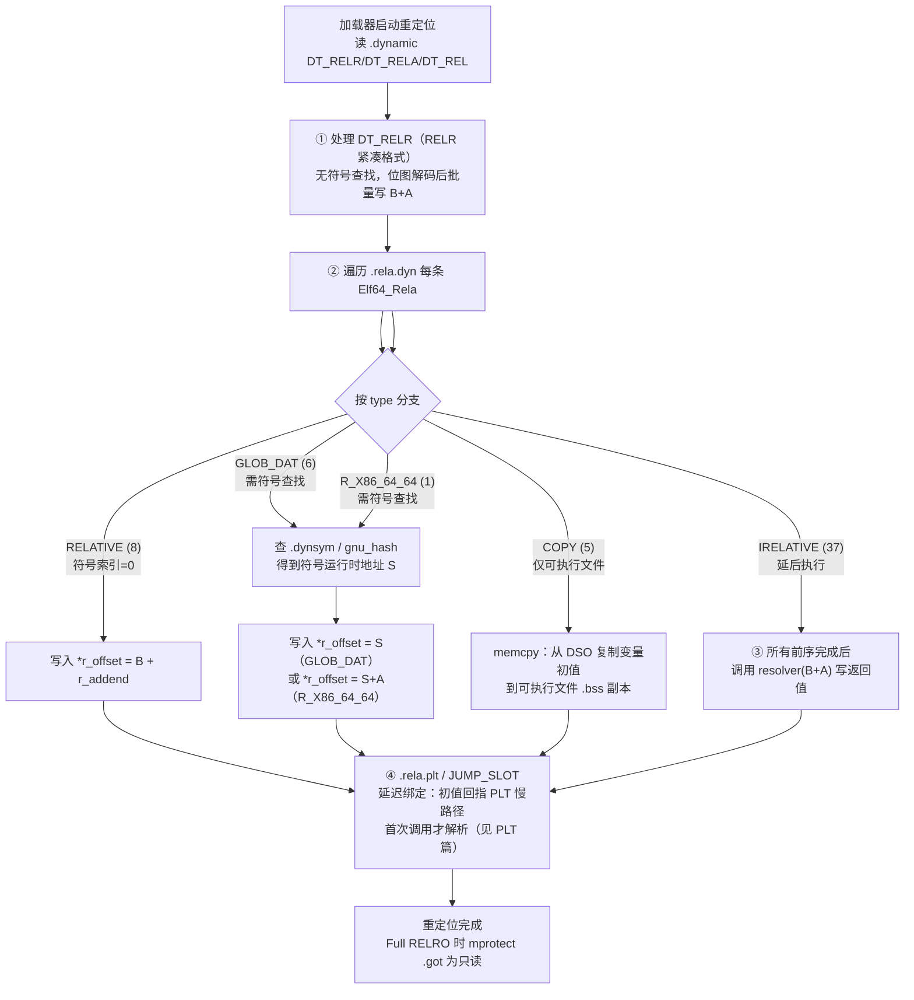

# 动态链接与加载器（7）· 重定位机制详解

## 概述与定位

> [!abstract] TL;DR
> - **重定位**是动态链接的"最后一公里"——共享库和 PIE 可执行文件在编译时不知道自己的加载地址，因此所有内部绝对指针都留有"占位值"，由动态链接器在加载时按实际地址逐一修正，这个过程就是**加载时重定位（load-time relocation）**。
> - ELF 用两套结构描述待修正信息：**REL**（隐式加数，从目标位置读）和 **RELA**（显式 `r_addend` 字段）；x86-64/AArch64 等 64 位平台以 `.rela.dyn` 为主。每条记录都编码了三件事：**修到哪**（`r_offset`）、**按哪个符号**（`r_info` 高位）、**加多少**（addend）。
> - 常见重定位类型语义一句话：`RELATIVE`=内部指针平移（B+A，无符号查找），`GLOB_DAT`=外部数据地址填 GOT（S），`JUMP_SLOT`=外部函数地址填 GOT（S，延迟绑定），`COPY`=从库里搬数据到 .bss（仅可执行文件），`IRELATIVE`=调用 resolver 选最优实现。
> - 三大平台形态迥异：ELF `.rela.dyn` 逐条遍历；Windows PE `.reloc` 按 delta 批量修正；macOS dyld 传统 rebase/bind opcode 正被**chained fixups**（指针内联成链）取代。

动态链接的核心任务是"把程序和库粘起来"，符号解析（[[06.符号解析与符号查找]]）找到了每个符号的运行时地址，**重定位**则负责把这些地址"写回"程序内存中所有引用该符号的位置。本篇在系列中处于承上启下的位置：

| 维度 | 本篇聚焦 | 相邻篇章 |
|---|---|---|
| 上游 | 符号解析已给出地址 | [[06.符号解析与符号查找]] |
| 核心 | 如何把地址写回内存 | 本篇 |
| 下游 | 函数 GOT 的延迟绑定通道 | [[08.PLT与GOT与延迟绑定]] |
| 结构细节 | `.rela.dyn` 节字段级说明 | [[11.ELF文件详解/14.rela.dyn节.md]] |
| PE 视角 | `.reloc` 节结构 | [[13.PE文件详解/13-详解PE文件(十三)：基址重定位表.md]] |

---

## 原理与机制

### 为什么需要重定位

共享库（`.so` / `.dylib` / `.dll`）和 PIE 可执行文件在编译期只知道自己"从 0 开始"的**链接时虚拟地址**，真正被加载到内存时，实际基址由操作系统和 ASLR 决定，每次可能都不同。这意味着：

- 所有指向本模块内部的**绝对指针**（vtable、字符串指针数组、函数指针等）在加载后都是"错的"。
- 所有引用**外部符号**（其他 DSO 的全局变量、函数）的 GOT 表项，加载前还没有填值。

重定位就是系统化地修正这两类问题的机制——加载器在交还控制权给程序入口之前，按照二进制文件里预留的"施工图"把所有待修正位置改写为正确值。

### 重定位的触发时机

不同类型的重定位在时机上有明确分工：

| 类别 | 时机 | 典型类型 |
|---|---|---|
| 内部指针平移 | 立即，加载时（无需符号查找） | `RELATIVE`、PE `DIR64/HIGHLOW` |
| 外部数据符号 | 加载时（需符号查找） | `GLOB_DAT`、`R_X86_64_64` |
| 函数调用（延迟绑定） | 默认首次调用时（见 [[08.PLT与GOT与延迟绑定]]） | `JUMP_SLOT` |
| 数据拷贝 | 加载时，最后执行 | `COPY` |
| IFUNC resolver | 加载时，所有 RELATIVE 之后 | `IRELATIVE` |

### 重定位处理流程（Mermaid）



> **图解**：加载器先处理无符号查找的 RELR/RELATIVE（最快），再按类型分流处理 GLOB_DAT/64/COPY，最后收尾 IRELATIVE（resolver 依赖 RELATIVE 已完成）。JUMP_SLOT 走延迟绑定通道，不在此图范围内。

---

## 数据结构 / 流程详解

### REL 与 RELA：两套结构的根本差异

ELF 规范定义了两种重定位记录格式，差别只在 addend 的来源：

| 项目 | REL（`Elf64_Rel`） | RELA（`Elf64_Rela`） |
|---|---|---|
| 节类型 | `SHT_REL` = 9 | `SHT_RELA` = 4 |
| 32 位大小 | 8 字节 | 12 字节 |
| 64 位大小 | 16 字节 | **24 字节** |
| addend 来源 | **隐式**：链接器把 addend 预写到 `r_offset` 所指内存，动态链接器先读出来再加 | **显式**：独立的 `r_addend` 字段，目标内存可任意初值（通常全零） |
| 典型平台 | i386、ARM32 | **x86-64**、AArch64、RISC-V64 |

```c
/* REL：16 字节（64 位） */
typedef struct {
    Elf64_Addr   r_offset;   // 8B：被修正的运行时虚拟地址
    Elf64_Xword  r_info;     // 8B：高32位=符号索引，低32位=重定位类型
} Elf64_Rel;

/* RELA：24 字节（64 位） */
typedef struct {
    Elf64_Addr   r_offset;   // 8B：被修正的运行时虚拟地址
    Elf64_Xword  r_info;     // 8B：高32位=符号索引，低32位=重定位类型
    Elf64_Sxword r_addend;   // 8B：有符号加数（可为负）
} Elf64_Rela;
```

**`r_info` 的拆分**（64 位）：

```c
#define ELF64_R_SYM(i)   ((i) >> 32)          // 高 32 位 = .dynsym 中的符号索引
#define ELF64_R_TYPE(i)  ((i) & 0xffffffff)   // 低 32 位 = 重定位类型常量
```

符号索引为 0 时表示该重定位**不涉及符号查找**（如 `RELATIVE`）；非 0 时动态链接器按索引在 `.dynsym` 取符号名后去各 DSO 查找真实地址。

> [!note] 为什么 x86-64 选 RELA 而非 REL
> REL 要求把 addend 提前写入目标位置，这意味着目标内存在加载前就含有链接期确定的值——对于 64 位地址这完全可行，但会让目标页不能以全零初始化，失去潜在的 COW 优化。RELA 把 addend 外置，目标内存可保持全零（加载前无需读），动态链接器直接按公式写，更干净。x86-64 ABI 规范明确要求使用 RELA。

### 重定位公式记号体系

下面所有公式使用 System V gABI 标准记号：

| 记号 | 含义 |
|---|---|
| **S** | Symbol value — 被引用符号的运行时地址（动态链接器解析结果） |
| **A** | Addend — `r_addend` 字段的值（RELA）或从目标内存读取的值（REL） |
| **B** | Base address — 本模块实际加载基址（ASLR 下每次不同） |
| **P** | Place — `r_offset` 处的运行时虚拟地址（即被写的地址） |
| **GOT** | `.got` 节的基地址 |

### 常见加载时重定位类型详解（x86-64）

#### R_X86_64_RELATIVE（类型值 = 8）

```
*P = B + A
```

- **符号索引 = 0**，不需要任何符号查找，是**最快的重定位类型**。
- `A`（`r_addend`）= 链接器计算的"若从地址 0 加载，目标应为多少"；`B` 是实际加载基址。
- **来源**：PIE 或共享库中所有指向本模块内部的绝对指针——`const char *arr[] = {"hello", "world"}` 中每个字符串指针，vtable 中每个函数指针等，都会产生一条 RELATIVE。
- 在大型 PIE（如 Chromium）中，这类条目可能有数十万条，是 DT_RELR 压缩的主要目标。

#### R_X86_64_GLOB_DAT（类型值 = 6）

```
*P = S
```

- 用于**外部数据符号**（全局变量）的 GOT 表项：动态链接器查找符号 S，把其运行时地址写入 `r_offset` 所指的 `.got` 槽位。
- `r_info` 低 32 位 = 6，高 32 位是 `.dynsym` 中该符号的索引。
- 加载后，代码通过 `mov reg, QWORD PTR [rip + symbol@GOTPCREL]` 间接获取变量地址。
- 参见 [[11.ELF文件详解/14.rela.dyn节.md]] 与 [[11.ELF文件详解/13.rel.dyn节.md]] 的 GLOB_DAT 深度解析。

#### R_X86_64_JUMP_SLOT（类型值 = 7）

```
*P = S
```

- 专用于 `.rela.plt`（PLT 函数 GOT 槽位），**延迟绑定**路径的核心重定位类型。
- 初值：链接器把 `.got.plt` 槽位写为回指 PLT 慢路径的地址，首次调用时 `_dl_runtime_resolve` 找到真实地址后回填，之后直达。
- 详细机制见 [[08.PLT与GOT与延迟绑定]]；本篇只列公式，不展开。

#### R_X86_64_64（类型值 = 1）

```
*P = S + A
```

- 64 位**绝对地址**：把符号地址加上加数写入目标位置（不一定是 GOT 表项）。
- 常见于共享库数据段中含有指向其他 DSO 符号的绝对指针（如 C++ 虚函数表里的跨 DSO 函数指针）。
- `r_addend` 通常为 0，若为非零则表示带偏移的指针（指向结构体字段等）。

#### R_X86_64_COPY（类型值 = 5）

```
memcpy(P, &symbol_in_lib, symbol_size)
```

- **仅限可执行文件**（`ET_EXEC` 或 PIE `ET_DYN`），**绝不出现在共享库**中。
- 产生原因：非 PIC 可执行文件直接用绝对地址访问外部全局变量，编译器无法插入 GOT 间接层，唯一办法是把变量数据**复制**到可执行文件自己的 `.bss` 空间，再让共享库里的 GLOB_DAT 也改指向这份副本——保证二者共享同一份数据。
- **执行顺序**：在所有 GLOB_DAT/RELATIVE 完成后才执行（需要先把库加载好才能读其数据）。
- **代价**：不同进程各自持有副本；共享库升级后副本不自动更新（载入时已复制）。PIE + GLOB_DAT 无需 COPY，是现代程序放弃 COPY 的推动力。

#### R_X86_64_IRELATIVE（类型值 = 37）

```
*P = (*(func_ptr_t)(B + A))()
```

- 与 `RELATIVE` 类似，但多一层**间接调用**：动态链接器计算 `B + A` 得到 resolver 函数地址，调用之，把**返回值**写入 `*P`。
- **用途**：GNU `STT_GNU_IFUNC`——`glibc` 中的 `memcpy`、`strlen`、`sin` 等，在加载时由 resolver 检测 CPU 特性（AVX2/SSE4 等），选出最优实现，把实现函数地址写进 GOT。
- **执行顺序**：必须在所有 `RELATIVE` 完成之后——因为 resolver 本身的代码可能依赖已平移的内部指针。

| 类型 | 值 | 公式 | 需符号查找 | 目标 |
|---|---|---|---|---|
| `R_X86_64_RELATIVE` | 8 | B + A | 否 | 内部指针 |
| `R_X86_64_GLOB_DAT` | 6 | S | 是 | .got（数据） |
| `R_X86_64_JUMP_SLOT` | 7 | S | 是（延迟） | .got.plt（函数） |
| `R_X86_64_64` | 1 | S + A | 是 | 任意绝对地址 |
| `R_X86_64_COPY` | 5 | memcpy | 是 | .bss 副本 |
| `R_X86_64_IRELATIVE` | 37 | indirect(B+A) | 否（调 resolver） | GOT/函数指针 |

### DT_RELR：紧凑相对重定位

随着 PIE 的普及，`.rela.dyn` 中 `R_X86_64_RELATIVE` 条目数量爆炸——每条 24 字节，大型 PIE 可有数十万条，占用数 MB 文件和内存空间，拖慢启动。**DT_RELR**（节名通常为 `.relr.dyn`，节类型 `SHT_RELR`）专门解决这个问题。

#### 编码规则（位图压缩）

```
字段宽度 = pointer_size（32位=4B，64位=8B）

偶数条目（最低位 = 0）：
  → 直接是一个需要 RELATIVE 重定位的虚拟地址
  → 同时设置 base = 该地址 + pointer_size

奇数条目（最低位 = 1）：
  → 位图，位 k（k ≥ 1）= 1 时表示地址 (base + (k-1)*pointer_size) 需要重定位
  → 处理完后 base += (word_bits - 1) * pointer_size（窗口滑动）
```

#### 压缩效果示例

```text
传统 .rela.dyn（4 条连续 RELATIVE，64 位，每条 24B）：
  0x1000  R_X86_64_RELATIVE  addend=0x800   → 24B
  0x1008  R_X86_64_RELATIVE  addend=0x900   → 24B
  0x1010  R_X86_64_RELATIVE  addend=0xA00   → 24B
  0x1018  R_X86_64_RELATIVE  addend=0xB00   → 24B
  合计 96 字节

RELR 编码（每项 8B）：
  0x1000   （偶数，表示 0x1000 需要重定位；base = 0x1008）
  0b0000...0111   （奇数位图，位1=1→0x1008，位2=1→0x1010，位3=1→0x1018）
  合计 16 字节，压缩率 83%
```

65 个连续 RELATIVE：RELA 需 1560 字节，RELR 仅需约 24 字节（**压缩率 ~98%**）。

**工具链支持**：

| 工具/库 | 最低版本 | 启用选项 |
|---|---|---|
| LLD | 全面支持 | `--pack-dyn-relocs=relr` |
| GNU binutils ld | 2.38+（2022） | `-z pack-relative-relocs` |
| glibc | 2.36+（2022） | 自动识别（须 binutils 2.38 生成） |
| musl libc | 1.2.3+ | 自动识别 |
| Android bionic | 较早支持 | 默认启用 |

RELR **不替代** `.rela.dyn`，只把其中的 RELATIVE 类型单独压缩；GLOB_DAT、COPY、IRELATIVE 等仍保留在 `.rela.dyn`。动态链接器处理顺序：先 RELR → 再 RELA/REL → 最后 PLT（JUMP_SLOT）。

---

## 三平台对照

重定位的本质在三大平台是相同的——"把加载时才确定的地址写回内存"——但数据结构、粒度、触发时机各不相同。

| 维度 | Linux ELF (ld.so) | macOS Mach-O (dyld) | Windows PE (Loader) |
|---|---|---|---|
| 重定位数据节 | `.rela.dyn` / `.relr.dyn` | `LC_DYLD_INFO` 中的 rebase/bind opcodes（旧）；`LC_DYLD_CHAINED_FIXUPS`（新） | `.reloc`（`IMAGE_BASE_RELOCATION` 块数组） |
| 内部指针平移 | `R_X86_64_RELATIVE`（B+A，逐条） | rebase opcode 流（旧）；chained fixups 链式遍历（新） | 遍历 `.reloc` 块，加 Delta（仅当 实际基址 ≠ `ImageBase` 时） |
| 外部符号绑定 | `GLOB_DAT`（写 GOT，加载时）；`JUMP_SLOT`（写 GOT.plt，延迟绑定） | bind opcode 流（旧）；chained fixup 内联指针（新） | 导入地址表 IAT 由加载器按导入目录填满（加载时全量） |
| 粒度 | 每条 24B（RELA）或 8B（RELR） | opcode 流（紧凑）；chained fixups 更紧凑 | 每条 2B（WORD TypeOffset）；4KB 一块 |
| 延迟绑定 | 默认启用（JUMP_SLOT 首次调用时） | 旧路径有；chained fixups 趋向加载时完成 | 普通导入无；`/DELAYLOAD` 显式启用 |
| 关闭延迟绑定 | `-z now` / `LD_BIND_NOW=1` | dyld 可配置；现代默认接近 now | 默认即 now（IAT 加载时全填） |
| 只读保护 | `Full RELRO`：重定位完成后 `mprotect(.got, PROT_READ)` | dyld 绑定后页保护；chained fixups 更易只读化 | IAT 通常可写（历史上是 IAT hook 目标） |
| 工具查看 | `readelf -r`、`objdump -R` | `otool -r`、`dyld_info -fixups` | `dumpbin /relocations`、PE 解析工具 |

### Linux ELF：本篇主角

见上方"数据结构 / 流程详解"章节全量描述。核心路径：`.dynamic` 的 `DT_RELA`/`DT_RELASZ` → 遍历 `.rela.dyn` → 按 type 分流处理。

### PE 基址重定位表（.reloc）

PE 文件的重定位机制与 ELF 有本质不同：**PE 只处理"内部绝对地址的 delta 修正"，外部符号由导入目录（IAT）单独处理，二者完全分离**。

#### 触发条件：仅当实际加载基址 ≠ ImageBase 时

链接器编译 PE 时，所有绝对地址以 `ImageBase`（可选头字段）为基准写死。加载器读取 `DataDirectory[5]`（`IMAGE_DIRECTORY_ENTRY_BASERELOC = 5`）定位 `.reloc` 节；若实际加载到 `ImageBase`（极少数情况，通常 ASLR 会打乱），则**整张表跳过，零开销**。

```
Delta = 实际加载基址 - ImageBase
修正后的值 = 修正前的值 + Delta
```

#### 块结构（IMAGE_BASE_RELOCATION）

`.reloc` 以 4KB 为粒度组织成块数组，每块覆盖一个内存页的所有修正点：

```c
typedef struct _IMAGE_BASE_RELOCATION {
    DWORD VirtualAddress;  // 本块覆盖页的起始 RVA（4KB 对齐）
    DWORD SizeOfBlock;     // 本块总字节数（含 8 字节头）
    // WORD TypeOffset[];  // 紧随块头的 2 字节修正项数组
} IMAGE_BASE_RELOCATION;
```

每个 `WORD` 修正项高 4 位 = 类型，低 12 位 = 页内偏移：

| 类型值 | 宏名 | 修正宽度 | 适用 |
|---|---|---|---|
| 0 | `IMAGE_REL_BASED_ABSOLUTE` | — | 对齐填充，忽略 |
| 3 | `IMAGE_REL_BASED_HIGHLOW` | 4 字节 | **32 位 PE 主力** |
| 10 | `IMAGE_REL_BASED_DIR64` | 8 字节 | **64 位 PE 主力** |

修正项实际 RVA = `块头 VirtualAddress + TypeOffset 低 12 位`。

#### 与 ELF RELATIVE 的异同

| 维度 | ELF `R_X86_64_RELATIVE` | PE `HIGHLOW`/`DIR64` |
|---|---|---|
| 描述粒度 | 每条 24B（RELA）或更紧凑（RELR） | 每条 2B（仅页内偏移）；块头 8B 给出页 RVA |
| 是否含 addend | 是（`r_addend` 编码链接期地址） | 否，直接读取目标内存中的旧值加 Delta |
| 触发条件 | 只要模块实际基址 ≠ 0（PIE 必须重定位） | 仅当 实际基址 ≠ `ImageBase` |
| 目标内存中旧值 | 通常为 0（RELA 不预写），addend 在结构里 | 直接是链接期绝对地址（类似 REL 的隐式 addend） |
| 覆盖 | 所有类型地址 | 仅绝对地址（外部符号走 IAT，不在此表） |

> [!note] PE 的 `.reloc` 类似 ELF 的 REL 而非 RELA
> PE 修正项直接把旧值加 Delta，相当于"从目标内存读 addend"，这与 ELF REL 的隐式 addend 逻辑一致；ELF RELA 把 addend 外置到结构体字段，目标内存可保持全零。现代 ELF 选 RELA 的原因之一正是为了让目标内存可以干净地全零初始化，便于 COW 共享。

### macOS dyld：rebase/bind opcode 与 chained fixups

macOS Mach-O 的重定位机制在近年发生了重大变化，理解两套机制的分工是关键。

#### 传统机制（dyld2 时代）：rebase + bind opcode 流

Mach-O 把重定位拆成两个独立的操作集合，编码在 `LC_DYLD_INFO_ONLY` / `LC_DYLD_INFO` 的 opcode 流里：

- **Rebase（基址平移）**：等价于 ELF 的 `R_*_RELATIVE`，把内部绝对指针加上 `slide`（实际基址与链接基址的差）。opcode 流紧凑，解释执行。
- **Bind（外部符号绑定）**：等价于 ELF 的 `GLOB_DAT`/`JUMP_SLOT`，按符号名在 dyld 符号表中查找，把地址写入 `__DATA,__got` 或 `__DATA,__la_symbol_ptr`。lazy bind opcode 另存，首次调用时才触发（类似 ELF lazy binding）。

#### 新版机制（dyld3/dyld4，arm64）：chained fixups

自 `LC_DYLD_CHAINED_FIXUPS` 引入后，Apple 彻底重设计了信息编码方式：

- **指针内联成链（chained）**：镜像加载前，每个需要修正的指针位置存放一个特殊编码值，其中内联了"重定位类型+下一个需修正指针的偏移"，形成链表。dyld 在扫描时只需按链遍历，无需独立的 opcode 流。
- **效果**：重定位信息紧凑（偏移差压缩存储），dyld 扫描效率高；加载完成后各指针可立即只读化；**运行期惰性符号解析基本退场**——arm64 + chained fixups 的二进制里，`dyld_stub_binder` 的经典 lazy 路径已大幅边缘化。
- **一句话类比**：chained fixups ≈ ELF DT_RELR（紧凑格式）+ BIND_NOW（趋向加载时全绑定）的组合，同时把指针的"待修正标记"内联进指针本身，省去了独立的重定位表。

```text
三平台"内部指针平移"的心智模型：

ELF RELA：  [r_offset → 目标地址] [r_addend = 链接期值]  （外置 addend，目标内存全零）
ELF RELR：  位图，隐式 addend（目标内存存链接期值，RELR 只记"哪些地方要 +B"）
PE .reloc：  TypeOffset 指向目标，addend 就是目标内存旧值（类 REL）
dyld chain:  目标内存存编码值（内联下一节点偏移 + 类型），遍历即修正
```

---

## 实操：用工具观察

> [!warning] 示例输出为示意
> 本节所有命令输出均为**代表性示意**，非本机实跑；具体地址、条目数、符号名随编译器版本、ASLR、工具链而变，**切勿据此断言任何真实运行期地址**。读者应在自己的 Linux/macOS 环境中复现，以本机实际输出为准。

### 1. readelf -r：查看全部重定位

```bash
readelf -r a.out
```

```text
# 示意输出（64 位 PIE 可执行文件）
Relocation section '.rela.dyn' at offset 0x5b0 contains 8 entries:
  Offset          Info           Type           Sym. Value    Sym. Name + Addend
000000003db8  000000000008 R_X86_64_RELATIVE                    1140
000000003dc0  000000000008 R_X86_64_RELATIVE                    12c0
000000003fc0  000200000006 R_X86_64_GLOB_DAT 0000000000000000 __libc_start_main@GLIBC_2.34 + 0
000000003fd8  000300000006 R_X86_64_GLOB_DAT 0000000000000000 stderr + 0

Relocation section '.rela.plt' at offset 0x670 contains 2 entries:
  Offset          Info           Type           Sym. Value    Sym. Name + Addend
000000404018  000100000007 R_X86_64_JUMP_SLOT 0000000000000000 printf@GLIBC_2.2.5 + 0
000000404020  000200000007 R_X86_64_JUMP_SLOT 0000000000000000 puts@GLIBC_2.2.5 + 0
```

> [!warning] 示例输出为示意
> 注意：`R_X86_64_RELATIVE` 条目的 `Sym. Name` 为空，`Info` 高 32 位 = 0（符号索引 = 0）——这是"无需符号查找"的直观体现。`R_X86_64_JUMP_SLOT` 的 `Info` 低 32 位 = 7（类型常量值），高 32 位为符号索引。

**`Info` 字段的手工解析**（以第一条 `GLOB_DAT` 为例）：

```text
Info = 000200000006
高 32 位 = 0x00000002  → .dynsym[2]（即 __libc_start_main）
低 32 位 = 0x00000006  → R_X86_64_GLOB_DAT（类型值 6）
```

### 2. objdump -R：查看动态重定位（简洁视图）

```bash
objdump -R a.out
```

```text
# 示意输出
a.out:     file format elf64-x86-64

DYNAMIC RELOCATION RECORDS
OFFSET           TYPE              VALUE
0000000000403fd8 R_X86_64_GLOB_DAT  stderr
0000000000403fc0 R_X86_64_GLOB_DAT  __libc_start_main@GLIBC_2.34
0000000000404018 R_X86_64_JUMP_SLOT  printf@GLIBC_2.2.5
0000000000404020 R_X86_64_JUMP_SLOT  puts@GLIBC_2.2.5
```

> [!warning] 示例输出为示意
> `objdump -R` 默认只显示有符号名的条目，`R_X86_64_RELATIVE` 因符号索引为 0 会被省略，不代表文件里没有 RELATIVE。若需完整列表（含 RELATIVE）请用 `readelf -r`。

`objdump -R` 适合快速确认"哪些符号需要动态绑定"，`readelf -r` 适合完整审计重定位表（含 RELATIVE 条目和精确的 `r_addend`）。

### 3. 查看 RELR 格式（现代 PIE）

```bash
# 若工具链支持 RELR，readelf -d 会看到 RELRSZ/RELR/RELRENT
readelf -d a.out | grep -E 'RELR|REL'
```

```text
# 示意输出（启用 -z pack-relative-relocs 后）
 0x0000000000000023 (RELRSZ)             120 (bytes)
 0x0000000000000024 (RELR)               0x403a80
 0x0000000000000025 (RELRENT)            8 (bytes)
 0x0000000000000007 (RELA)               0x400388
 0x0000000000000008 (RELASZ)             48 (bytes)
 0x0000000000000009 (RELAENT)            24 (bytes)
```

> [!warning] 示例输出为示意
> `RELRSZ=120` 表示 RELR 表 120 字节，替换了原本可能需要数千字节的 RELATIVE 条目。`RELA` 剩余的只是 GLOB_DAT/COPY/IRELATIVE 等无法压缩的类型。

### 4. 观察 .dynamic 中的重定位相关标签

```bash
readelf -d a.out | grep -E 'RELA|REL[^A]|RELR|PLTREL|JMPREL'
```

```text
# 示意输出
 0x0000000000000007 (RELA)               0x400388   ← .rela.dyn 地址
 0x0000000000000008 (RELASZ)             216 (bytes) ← .rela.dyn 总大小
 0x0000000000000009 (RELAENT)            24 (bytes)  ← 每条 Elf64_Rela 大小
 0x0000000000000017 (JMPREL)             0x400450   ← .rela.plt 地址
 0x0000000000000002 (PLTRELSZ)           48 (bytes)  ← .rela.plt 总大小
 0x0000000000000014 (PLTREL)             RELA        ← PLT 用 RELA 格式
```

> [!warning] 示例输出为示意
> `RELA/RELASZ/RELAENT` 三元组是动态链接器定位 `.rela.dyn` 的入口；`JMPREL/PLTRELSZ` 指向 `.rela.plt`。`RELASZ` 除以 `RELAENT`（24）= 条目总数。

### 工具速查

| 目的 | 命令 | 看什么 |
|---|---|---|
| 全量重定位（含 RELATIVE） | `readelf -r <file>` | 每条类型、r_offset、r_info、r_addend |
| 有名重定位（快速） | `objdump -R <file>` | 符号名 + 类型（省略 RELATIVE） |
| .dynamic 重定位标签 | `readelf -d <file>` | DT_RELA/RELASZ/RELAENT/JMPREL |
| RELR 支持 | `readelf -d <file> \| grep RELR` | RELRSZ/RELR/RELRENT |
| 节头确认格式 | `readelf -S <file>` | sh_type：SHT_RELA=4 / SHT_REL=9 / SHT_RELR |

---

## 攻防 / 陷阱

### RELRO 的边界：重定位完成才能上锁

RELRO（Relocation Read-Only）不是把 `.got` 一开始就设为只读，而是**等重定位完成之后**调用 `mprotect` 上锁：

- **Partial RELRO**（`-Wl,-z,relro`）：`.rela.dyn` 中的 GLOB_DAT/RELATIVE 完成后，把 `.got`（数据 GOT）设为只读。`.got.plt`（函数 GOT）**仍可写**（因为延迟绑定需要继续回填 JUMP_SLOT）。
- **Full RELRO**（`-Wl,-z,relro,-z,now`）：加载时一次性完成所有 JUMP_SLOT，再把整个 `.got.plt` 也设为只读。`mprotect` 覆盖范围由 `PT_GNU_RELRO` 程序头指定。

| 保护级别 | .got（GLOB_DAT） | .got.plt（JUMP_SLOT） | 延迟绑定 |
|---|---|---|---|
| 无 RELRO | 可写 | 可写 | 启用 |
| Partial RELRO | **只读** | 可写 | 启用 |
| Full RELRO | **只读** | **只读** | 禁用 |

### COPY 重定位的陷阱

`R_X86_64_COPY` 有几个反直觉的行为：

1. **数据不跟库更新**：副本在加载时复制，库版本升级后 `.so` 里变量的新默认值无法传播给已编译的可执行文件。
2. **多进程多副本**：每个可执行文件进程持有独立 `.bss` 副本，共享库本来"一份数据多进程共享"的优势消失。
3. **COPY + GLOB_DAT 协同**：动态链接器不仅向 `.bss` 复制数据，还要把共享库里原始 `GLOB_DAT` 槽位改指向可执行文件的副本，保证库内代码也访问同一份——这个"反向修正"容易被忘记。

> [!note] 为什么 PIE 能消灭 COPY
> PIE 可执行文件是 PIC，访问外部变量时编译器插入 GOT 间接层（`GOTPCREL(%rip)` 访问）。这样 `r_offset` 指向 GOT 槽位，用 `GLOB_DAT` 填入真实地址即可，无需把数据拖进 `.bss`。这是现代发行版要求 PIE 的一个附带好处。

### IRELATIVE resolver 顺序依赖

`R_X86_64_IRELATIVE` 的 resolver 是一段 C 函数，它在加载时运行时**内部可能访问本模块已完成 RELATIVE 的指针**（如全局变量、vtable）。动态链接器必须严格保证：**所有 RELATIVE 完成 → 所有 IRELATIVE resolver 被调用**，否则 resolver 访问的指针还是链接期占位值，行为未定义。这一顺序依赖是设计约束，工具链与动态链接器都须遵守。

### PE .reloc 遍历中的哑弹（Type=0）

PE 遍历 `.reloc` 时，`TypeOffset.Type == 0`（`IMAGE_REL_BASED_ABSOLUTE`）是对齐填充项，不代表任何修正——加载器必须跳过。若误将它当有效项，会把页 RVA + 0 处（往往是块头本身 `VirtualAddress` 字段！）加上 Delta，损坏重定位表本身，导致后续所有块解析错误。

---

## 小结

1. **重定位 = 把加载期才确定的地址写回内存**：内部指针平移（RELATIVE/PE DIR64）和外部符号绑定（GLOB_DAT/IAT）是两种不同的重定位，分别无需/需要符号查找。
2. **REL vs RELA 差在 addend 位置**：REL 隐式（从目标内存读），RELA 显式（独立字段）；x86-64 用 RELA，i386/ARM32 用 REL——RELA 让目标内存保持全零，利于 COW 共享。
3. **`r_info` 编码两件事**：高 32 位 = `.dynsym` 符号索引，低 32 位 = 重定位类型常量；索引 = 0 意味着无符号查找（RELATIVE/IRELATIVE）。
4. **六大常见类型各有分工**：RELATIVE（B+A，最快）、GLOB_DAT（S，写数据 GOT）、JUMP_SLOT（S，延迟绑定写函数 GOT）、R_X86_64_64（S+A，绝对地址）、COPY（仅可执行文件，搬数据）、IRELATIVE（resolver 返回值，最后执行）。
5. **DT_RELR 大幅压缩 RELATIVE**：位图编码，65 条连续 RELATIVE 从 1560B 压到约 24B（98% 压缩率），binutils 2.38+ 和 LLD 均已支持，是启动性能优化的重要手段。
6. **三平台形态各异但本质相同**：ELF 逐条处理 `.rela.dyn`；PE 按 delta 批量修正 `.reloc`（且仅当基址偏移时才执行）；macOS 从 opcode 流演进到 chained fixups（指针内联成链，趋向加载时全绑定，惰性路径退场）。

---

## 相关阅读

- **ELF 重定位表结构详解**：[[11.ELF文件详解/14.rela.dyn节.md]]、[[11.ELF文件详解/13.rel.dyn节.md]]
- **PE 基址重定位表**：[[13.PE文件详解/13-详解PE文件(十三)：基址重定位表.md]]
- **重定位目标——数据 GOT**：[[11.ELF文件详解/17.got节.md]]
- **符号解析（重定位的上游）**：[[06.符号解析与符号查找]]
- **函数 GOT 的延迟绑定（重定位的下游通道）**：[[08.PLT与GOT与延迟绑定]]

---

⬅️ 上一篇 [[06.符号解析与符号查找]] ｜ 🏠 [[00.动态链接与加载器总览]] ｜ 下一篇 [[08.PLT与GOT与延迟绑定]] ➡️
