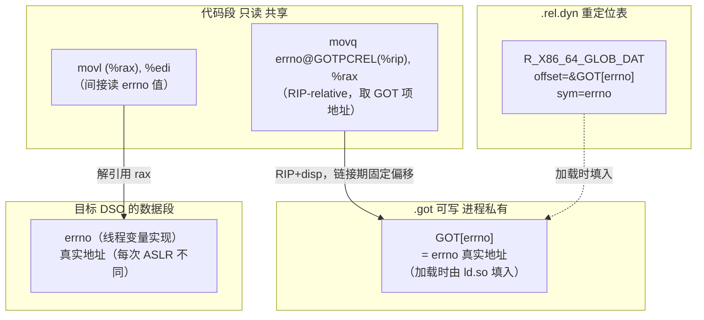

# 动态链接与加载器（9）· ASLR 与位置无关代码

> [!abstract] TL;DR
> - **PIC（Position-Independent Code）** 让代码段对加载地址不敏感：x86-64 以 `RIP`-relative 寻址直接访问 `.rodata`/函数，全局符号则通过 GOT 间接一跳——代码段自身一字节不改，加载到任何基址都能正确运行，多进程共享同一份物理页。
> - **PIE（Position-Independent Executable）** 是"把可执行文件做成共享库（`ET_DYN`）"的编译选项：传统可执行文件（`ET_EXEC`）基址写死，PIE 基址随机，才能真正享受 ASLR。
> - **ASLR** 在 Linux 上把主程序（PIE）、共享库、`mmap`、栈、堆/brk 分别随机化基址；实际熵受对齐粒度与架构位宽限制，x86-64 通常 28–30 bit（库/栈），brk 约 13 bit；`/proc/sys/kernel/randomize_va_space` 控制等级（0 关/1 部分/2 完全）。
> - **三平台**：Linux `ld.so` 独立随机化各 DSO；macOS `dyld` 以 **shared cache slide**（整体偏移）统一随机化系统库大镜像；Windows 以 `/DYNAMICBASE`（基础 ASLR）+ `IMAGE_DLLCHARACTERISTICS_HIGH_ENTROPY_VA`（64 位高熵 ASLR）为主，并支持强制 ASLR（EMET/CFG 策略）。

本篇是「动态链接与加载器详解」系列**安全与基础同等重要的机制篇**：[[08.PLT与GOT与延迟绑定]] 已解释"调用点为何不能写死目标地址"，其答案的根源就在本篇——ASLR 使加载基址每次都不同，PIC/PIE 是让代码段对此漠然的工程手段，而 GOT（[[11.ELF文件详解/17.got节.md]]）正是承接"地址会变"这件事的可写中间层。理解本篇之后，[[10.运行时动态加载]] 里 `dlopen` 加载任意路径 DSO 并获取其函数指针的做法，就能在这套基础上顺理成章地展开。

---

## 概述与定位

### 问题的起点：为什么不能写死地址

共享库被设计为"多进程共享同一份代码的物理内存页"。如果代码段里有一条 `movq $0x7ffff7a00020, %rax`（某个全局变量的绝对地址），那这条指令在 `libc.so` 被映射到地址 `0x7ffff7a00000` 时没问题——但另一个进程把同一个 `libc.so` 映射到 `0x7f0000000000`，那条指令就不对了，内核不得不给这个进程单独 copy-on-write 一份代码页来修正。这等于**所有进程的代码页都 CoW、不能共享**，物理内存的节省彻底落空。

解法是：**代码段里绝不出现绝对地址**，所有"随加载地址变化的量"统一放到可写的数据段（GOT 等），由动态链接器在加载时填入。代码段因此只读且无进程专属内容，所有映射同一 DSO 的进程共享同一批物理页——这正是 PIC 的物理意义。

ASLR 在此基础上更进一步：既然代码段天然无绝对地址，那每次加载干脆把基址随机化，让攻击者无法预判目标地址（缓解 return-to-libc、ROP 等攻击）。ASLR 与 PIC 是相互成就的关系：**PIC 使随机基址可行，ASLR 给 PIC 赋予了安全价值**。

### `ET_EXEC` 与 `ET_DYN`：两类 ELF 可执行文件

ELF 文件头的 `e_type` 字段决定了文件类型，也直接影响 ASLR 能否作用于可执行文件本身：

| `e_type` | 名称 | 基址 | ASLR 能随机化主程序基址？ | 编译方式 |
|---|---|---|---|---|
| `ET_EXEC`（2） | 普通可执行文件 | 链接期写死（如 x86-64 默认 `0x400000`） | **不能**——加载地址固定 | `gcc -no-pie`（老版默认） |
| `ET_DYN`（3） | 共享对象 / PIE 可执行 | 无固定基址，加载器自由选 | **能**——ld.so 随机选基址 | `gcc -pie`（现代 Linux 发行版默认） |

`ET_DYN` 可执行文件在内核看来和共享库没有本质区别——内核直接把它当"可自由映射的镜像"处理，ld.so 随即获得了自由选基址（并随机化）的能力。这正是 PIE（Position-Independent Executable）的机制根基：**PIE 不是说"代码段会自动重定位"，而是通过把文件类型从 `ET_EXEC` 改为 `ET_DYN` 来让加载器可以给它一个随机基址**。

> [!note] 检查文件类型
> `readelf -h binary | grep Type`：输出 `DYN` 说明是 PIE 或共享库；输出 `EXEC` 说明是传统可执行文件，ASLR 对其基址无效（库仍会随机化）。

---

## 原理与机制

### PIC 的三条访问路径

在 x86-64 + PIE / 共享库场景下，编译器生成 PIC 代码时，根据符号的类型和可见性，有三条不同路径：

#### 路径一：函数内部的局部静态地址 / `.rodata`

对只在本 DSO 内部使用的符号（函数、只读数据），编译器生成 **`RIP`-relative** 直接引用。这类指令的操作数是"当前指令地址 + 固定偏移"，偏移在链接期确定，与加载基址无关。

```nasm
; 访问本模块内的 .rodata 字符串（x86-64 PIE 或共享库）
lea    rdi, [rip + 0x1234]   ; rdi = &"hello\n"（RIP 相对，偏移 0x1234 是链接期算好的）
call   printf@plt             ; 调用外部 printf（走 PLT，见下）
```

`RIP`-relative 是 x86-64 ISA 的原生特性（`ModRM` 的 `[rip+disp32]` 寻址模式），32 位 x86 没有等价物，32 位 PIC 必须先用 `call __x86.get_pc_thunk.bx` 取 PC、再加偏移，繁琐得多（参见 [[11.ELF文件详解/17.got节.md]] §4 对两种模式的对比）。

#### 路径二：外部全局变量（跨 DSO 数据）

外部全局变量的地址不在本 DSO 内，运行期才知道——这正是 GOT 的用武之地。编译器生成 `GOTPCREL`（或 `GOT_PAGE`/`GOT_OFST`，AArch64）重定位，对应 `.rel.dyn` 里一条 `R_X86_64_GLOB_DAT`/`R_X86_64_RELATIVE` 条目，由动态链接器加载时填入真实地址：

```nasm
; 访问外部全局变量 `errno`（x86-64，共享库或 PIE）
movq    errno@GOTPCREL(%rip), %rax   ; rax = &GOT[errno]（GOT 槽位自身的地址）
movl    (%rax), %edi                  ; edi = *errno（通过 GOT 间接读取）
```

第一条指令是 `RIP`-relative，取的是 **GOT 表项的地址**（而非 `errno` 本身的地址）；第二条才是真正的内存访问。这两条合在一起就是"经 GOT 的一次间接"。

若链接器确认 `errno` 实际上在同一模块内定义（链接期可见），它可对 `GOTPCRELX` / `REX_GOTPCRELX` 做 **GOT 松弛优化（GOT relaxation）**，将两条指令合并为一条 `leaq var(%rip), %rax`，消除 GOT 表项（参见 [[11.ELF文件详解/17.got节.md]] §6 GOT 优化）。

#### 路径三：外部函数（跨 DSO 调用）

外部函数走 PLT + 函数 GOT（`.got.plt`），与 [[08.PLT与GOT与延迟绑定]] 一篇逐步拆解的延迟绑定机制完全一致，此处不再重复。从 PIC 视角看，**PLT stub 本身是 `RIP`-relative 引用 `.got.plt` 的一段跳板**，也属于"对加载地址不敏感的代码"。

### PIC 经 GOT 间接访问全局变量示意



> 代码段两条指令与加载基址完全无关——`RIP`-relative 偏移是链接期算好的常数，无论 DSO 加载到哪里都成立。可写的 GOT 是唯一随加载地址变化的部分，由 ld.so 在加载时用 `R_X86_64_GLOB_DAT` 重定位一次性填好。这就是"代码段可多进程共享物理页"的机制根源。

### 32 位 x86 的特殊处理：`get_pc_thunk`

x86（32 位）没有 `RIP`-relative 寻址，无法直接拿到当前 PC。编译器用一段特殊的小函数解决这个问题：

```nasm
; x86 32位 PIC 的"取当前PC"惯用模式
call    __x86.get_pc_thunk.bx   ; 把返回地址（= call 后一条指令地址）放进 ebx
addl    $_GLOBAL_OFFSET_TABLE_, %ebx    ; ebx += (GOT起始 - 当前PC) = GOT基址

; 之后访问 GOT 表项：
movl    var@GOT(%ebx), %eax     ; eax = &GOT[var]
movl    (%eax), %edx            ; edx = var 的值
```

`__x86.get_pc_thunk.bx` 的实现极简：`movl (%esp), %ebx; ret`——`call` 压栈的返回地址正好就是下条指令地址，`movl (%esp)` 取出后 `ret` 把它留在 `ebx`。这个"取 PC 的 trick"与 [[11.ELF文件详解/17.got节.md]] §4 描述完全一致；x86-64 消除了这个笨拙的 thunk，`RIP`-relative 直接可达。

---

## ASLR：随机化哪些区域

### Linux 随机化区域与熵

ASLR 在 Linux 内核里按**区域**分别随机化，每个区域的熵（entropy bits）受对齐粒度和虚拟地址空间大小限制：

| 区域 | 随机化前提 | x86-64 典型熵 | 备注 |
|---|---|---|---|
| **主程序基址** | 必须 `ET_DYN`（PIE） | ~28 bit | `ET_EXEC` 完全不随机 |
| **共享库基址** | 无需 PIE，mmap 区间随机 | ~28–30 bit | 每个 DSO 独立随机偏移 |
| **`mmap` 基址** | `mmap(NULL, ...)` | ~28–30 bit | 与库同区间 |
| **栈** | 始终随机（含 `randomize_va_space=1`） | ~20–22 bit（函数帧内还有 up-to-8B 额外随机） | 受 `ulimit -s` 对齐粒度影响 |
| **堆（brk）** | 需 `randomize_va_space=2` | ~13 bit | 对齐到 4KB/页，熵较低 |

> [!note] 熵的上限来自哪里
> x86-64 虚拟地址理论宽 48 bit（实际 canonical 地址 47 bit 用户空间），但库区间通常从固定高地址向下 mmap，加上 4KB 页对齐强制低 12 bit 为 0，以及内核保留的地址范围，实际可随机的 bit 数远小于理论值。AArch64 可用 `--randomize-va-space` + 更大 VA 范围，在 64 KB 页模式下熵甚至更低。熵越高，暴力猜测地址越难；但熵不是无限大，与 information-leak 漏洞结合后 ASLR 的保护效果会大幅削弱。

### `/proc/sys/kernel/randomize_va_space`

这是 Linux 控制 ASLR 级别的核心内核参数：

| 值 | 效果 |
|---|---|
| **0** | 关闭 ASLR：所有区域（库、栈、堆）均不随机化 |
| **1** | 部分随机化：共享库、栈、`mmap` 随机；**brk/堆不随机** |
| **2** | 完全随机化（默认）：在 1 的基础上 **brk 也随机化**（heap 基址随机） |

```bash
# 查看当前 ASLR 等级
cat /proc/sys/kernel/randomize_va_space

# 临时关闭（root，调试用）
echo 0 > /proc/sys/kernel/randomize_va_space

# 持久化（/etc/sysctl.conf）
kernel.randomize_va_space = 2
```

> [!warning] 示例输出为示意
> 上述命令需在 Linux 系统上执行；Windows/macOS 不存在该路径。生产环境勿将值改为 0，会削弱 ASLR 保护。

---

## 三平台对照

### Linux：ld.so 独立随机化每个 DSO

| 维度 | 行为 |
|---|---|
| 随机化单元 | 每个 DSO（含主程序 PIE）**独立随机**偏移 |
| 实现位置 | 内核 `mmap`（库/栈）+ `brk`（堆）均有随机偏移，`ET_DYN` 主程序由 ld.so 在映射时选基址 |
| 控制参数 | `/proc/sys/kernel/randomize_va_space`（0/1/2） |
| PIE 要求 | 主程序必须为 `ET_DYN` 才能随机化基址；`ET_EXEC` 主程序即使开 ASLR，其自身基址固定（0x400000），只有库/栈/堆随机 |
| 关闭 ASLR 运行 | `setarch $(uname -m) -R ./binary`（单次禁用，调试用） |
| 检查工具 | `checksec --file=binary`（看 PIE 列）、`ldd binary`（看库地址是否变化） |

### macOS：dyld shared cache + 整体 slide

macOS 的 ASLR 策略与 Linux 有根本性不同：

**Dyld Shared Cache（DSC）**：Apple 把 `/usr/lib`、`/System/Library` 里几百个系统库（`libSystem.B.dylib`、`CoreFoundation`、`AppKit` 等）在系统启动时**预链接**合并为一个大镜像文件（`/private/var/db/dyld/dyld_shared_cache_arm64e` 等），所有进程共享其物理内存。DSC 内部各库的**相互偏移是固定的**，整个 cache 作为一个整体被赋予一个随机 **slide**（偏移量）。

```
DSC 随机化示意：
  启动 → 随机 slide = 0x1234_0000
  libSystem   → DSC_base + 固定偏移_A + slide
  CoreFoundation → DSC_base + 固定偏移_B + slide
  （内部相互偏移不变，整体平移）
```

> [!warning] 示例输出为示意
> slide 值为示意，每次系统重启后改变（非每次进程启动）。可用 `dyld_info -shared_cache_slide` 或 `vmmap <pid>` 观察。

| 维度 | macOS 行为 |
|---|---|
| 随机化单元 | 系统库：**整个 DSC 整体一个 slide**；第三方 .dylib：独立随机（dyld4 per-process slide） |
| 主程序随机化 | 需编译为 `MH_PIE`（等价 PIE），Xcode 默认开启 |
| 每进程 vs 每启动 | DSC slide 每次**系统重启**随机（系统库），不是每次进程启动；第三方 dylib 通常每进程随机 |
| 工具 | `codesign -dvvv binary`（看 `pie`）、`vmmap <pid>`（看各段地址） |
| 关闭 ASLR | SIP 关闭后 `defaults write com.apple.security.no-aslr 1` 或 `arch -arch x86_64 ...`（部分场景） |

macOS 这种"大镜像 + 整体 slide"策略的优点是系统库的物理内存页**真正全局共享**（所有进程用同一份物理页，slide 相同）；代价是如果攻击者泄漏了任意系统库地址，**整个 DSC 内所有库的地址就全部暴露**（因为相互偏移固定）。

### Windows：`/DYNAMICBASE` + 高熵 ASLR

Windows ASLR 以 PE 文件的 `DllCharacteristics` 标志为开关，分两个层次：

#### 基础 ASLR：`/DYNAMICBASE`

链接时指定 `/DYNAMICBASE`，PE 文件头 `OptionalHeader.DllCharacteristics` 置位 `IMAGE_DLLCHARACTERISTICS_DYNAMIC_BASE`（`0x0040`）。Windows Loader 在加载此类镜像时会随机选择基址，而非使用 `ImageBase` 首选地址。

- 在 32 位进程里：随机化在 16 位（页级对齐后约 8 bit 左右，熵偏低）。
- 在 64 位进程里：可寻址范围大得多，但仍受限于对齐和兼容性需求。

#### 高熵 ASLR：`IMAGE_DLLCHARACTERISTICS_HIGH_ENTROPY_VA`

64 位专用，`DllCharacteristics` 置位 `IMAGE_DLLCHARACTERISTICS_HIGH_ENTROPY_VA`（`0x0020`）。在 Windows 8.1+ 上，64 位进程 + 高熵标志可把库/堆/栈的随机熵提升到 **~19 bit**（结合 `/DYNAMICBASE` 使用才生效）。

```
IMAGE_OPTIONAL_HEADER64.DllCharacteristics 常见标志（关 ASLR 安全的几位）：
  0x0020  IMAGE_DLLCHARACTERISTICS_HIGH_ENTROPY_VA   —— 64位高熵ASLR
  0x0040  IMAGE_DLLCHARACTERISTICS_DYNAMIC_BASE      —— 基础ASLR（/DYNAMICBASE）
  0x0100  IMAGE_DLLCHARACTERISTICS_NX_COMPAT         —— 启用DEP/NX
  0x4000  IMAGE_DLLCHARACTERISTICS_GUARD_CF           —— 控制流保护CFG
```

与 ASLR 强相关的加载配置（`IMAGE_LOAD_CONFIG_DIRECTORY`）见 [[13.PE文件详解/18-详解PE文件(十八)：加载配置表.md]]，其中含 `GuardFlags`（CFG 相关）和 SEH 表等配合防护机制的字段；ASLR 的本体在 `DllCharacteristics`，加载配置表则是配合加固的扩展信息源。

#### 强制 ASLR（Mandatory ASLR）

Windows 安全策略（通过 EMET/CFG/Windows Defender Exploit Guard 等）可启用"强制 ASLR"，强制对**未标记 `/DYNAMICBASE` 的老旧 DLL** 也进行地址随机化——即便 `DllCharacteristics` 里没有 `DYNAMIC_BASE` 位，Loader 也会给它一个随机基址。代价是该 DLL 本身未为 PIC 生成，所以还需要 Loader 做完整的重定位修正（`.reloc` 节）。

| 维度 | Windows 行为 |
|---|---|
| 控制标志 | `DllCharacteristics` 的 `DYNAMIC_BASE`（`0x0040`）+ `HIGH_ENTROPY_VA`（`0x0020`） |
| 熵（x86，32 bit） | 约 8 bit（较低） |
| 熵（x64，高熵） | 约 17–19 bit |
| 强制 ASLR | 通过系统策略对未标记 `/DYNAMICBASE` 的模块也随机化（需配套重定位表） |
| 检查工具 | `dumpbin /headers binary.exe`（看 `DllCharacteristics`）、`checksec`（PE 版）、`Process Explorer`（查进程基址） |
| PE 数据源 | `IMAGE_OPTIONAL_HEADER.DllCharacteristics`；加载配置 `IMAGE_LOAD_CONFIG_DIRECTORY` |

### 三平台 ASLR 对照表

| 维度 | Linux（ld.so） | macOS（dyld） | Windows（Loader） |
|---|---|---|---|
| **主程序随机化前提** | 必须 `ET_DYN`（PIE，`-fPIE -pie`） | 必须 `MH_PIE`（Xcode 默认开） | 必须 `/DYNAMICBASE` 标志 |
| **系统库随机化方式** | 每个 DSO 独立随机 mmap | DSC 整体一个 slide（每次系统重启） | 每个 DLL 独立随机（加载时） |
| **熵（64 位，库）** | ~28–30 bit | slide 约 20+ bit（整体） | ~17–19 bit（高熵模式） |
| **堆随机化** | `randomize_va_space=2` 时 brk 随机（约 13 bit） | dyld 管理的堆有随机偏移 | 堆基址随机（~8 bit，32b；更高，64b） |
| **栈随机化** | 始终随机（约 20–22 bit）+ 帧内额外随机 | 始终随机 | 随机（含 `/GS` stack cookie） |
| **控制方式** | `/proc/sys/kernel/randomize_va_space` | SIP 保护，正常不可关 | EMET / Exploit Protection 策略 |
| **关闭 ASLR（调试）** | `setarch -R` 或 `echo 0 > /proc/sys/...` | SIP off + `defaults write` | 链接 `/DYNAMICBASE:NO` 或 PE 标志清零 |
| **优化冲突（历史）** | prelink（已基本弃用） | DSC 预链接（活跃，但已适配 ASLR） | `/FIXED`（禁止重定位，不建议） |

---

## 数据结构 / 流程详解

### ELF 中 PIC 相关的重定位类型汇总

PIC/PIE 场景下常见的重定位类型（x86-64 ELF），理解这些类型才能读懂 `readelf -r` 的输出：

这里要先分清**两类语境完全不同的重定位**，否则极易混淆：

- **加载期 GOT 填充（动态重定位）**：`RELATIVE`/`GLOB_DAT`/`JUMP_SLOT` 等，位于 `.rela.dyn`/`.rela.plt`，目标是**数据段里的 GOT 槽位/指针**，由 **ld.so 在加载时写入**——这才是"随 ASLR 基址变化、运行期由动态链接器处理"的重定位。
- **链接期代码重定位（GOT 松弛对象）**：`GOTPCREL`/`REX_GOTPCRELX` 等，目标是**代码段里那条访问 GOT 的指令的 disp32 字段**，由**静态链接器（`ld`）在链接期消解**（并可做 GOT relaxation 把"经 GOT 间接"改写成"直接 PC-relative"，见 [[11.ELF文件详解/17.got节.md]] §6）。它们**不会**进入运行期动态重定位表，ld.so 加载时根本不处理它们。

| 重定位类型 | 常量值 | 处理阶段 | 适用对象 | 语义 |
|---|---|---|---|---|
| `R_X86_64_RELATIVE` | 8 | **加载期（ld.so）** | GOT 项、内部指针 | `*addr = base + addend`（纯地址调整） |
| `R_X86_64_GLOB_DAT` | 6 | **加载期（ld.so）** | `.got` 表项 | `*addr = sym_value`（写入符号地址） |
| `R_X86_64_JUMP_SLOT` | 7 | **加载期（ld.so）** | `.got.plt` 表项 | 同上，用于函数延迟绑定 |
| `R_X86_64_64` | 1 | 加载期（ld.so）/链接期 | 数据节内绝对指针 | `*addr = sym_value + addend` |
| `R_X86_64_GOTPCREL` | 9 | **链接期（ld）** | 代码段访问 GOT 的指令 | `disp32 = &GOT[sym] - rip + addend` |
| `R_X86_64_REX_GOTPCRELX` | 42 | **链接期（ld）** | 同上（可松弛优化） | 同 `GOTPCREL`，链接器可 relax 掉 GOT |

> [!note] 一句话区分
> `GLOB_DAT`/`RELATIVE`/`JUMP_SLOT` 修的是**数据段里的 GOT 槽位、加载期由 ld.so 填**；`GOTPCREL`/`REX_GOTPCRELX` 修的是**代码段里那条指令的偏移、链接期由 `ld` 消解**（且是 GOT 松弛的作用对象）。前者随 ASLR 每次加载而变，后者一旦链接完成就固化进只读代码段——这与 [[07.重定位机制详解]] 和 [[11.ELF文件详解/17.got节.md]] §6 的口径一致。

`R_X86_64_RELATIVE` 是 PIE 可执行文件里最常见的**加载期**重定位——它不需要符号查找，只需把加载基址加上编译期 addend 填入目标位置，动态链接器处理极快。`DT_RELR` 格式进一步把大量连续的 `RELATIVE` 重定位压缩编码，显著减小 `.relr.dyn` 节大小（参见 [[07.重定位机制详解]]）。

### PIE 可执行文件的加载流程（与 ET_EXEC 对比）

**`ET_EXEC`（传统可执行）**：内核 `execve` → `load_elf_binary` 按 `PT_LOAD` 把各段 mmap 到**程序头里写死的虚拟地址**（如 `0x400000`），不允许偏移 → ld.so 被映射到随机地址（ld.so 自身是 `ET_DYN`），处理库的重定位 → 主程序基址固定，无 ASLR。

**`ET_DYN`（PIE）**：内核 `execve` → `load_elf_binary` 发现 `ET_DYN`，用 `mmap` 把整个镜像映射到**内核自动选择的地址**（ASLR 随机化）→ ld.so 随机基址启动（它自己也是 `ET_DYN`，内核给它独立随机地址）→ ld.so 处理主程序的 `R_X86_64_RELATIVE`（用主程序真实加载基址修正所有内部指针）→ 处理各库依赖、填 GOT → 主程序 `_start`。

关键差异：**ld.so 对 PIE 主程序的第一件事就是处理 `R_X86_64_RELATIVE`**——这是所有内部函数指针、虚表指针、全局初始化指针等随加载地址平移的重定位；处理完这批之后，主程序内部的指针才正确，GOT 才能被正确填充。

### `_dl_relocate_object` 处理 RELATIVE 的时序

```
ld.so 自举完成后，对主程序（PIE）：
  1. 读 .dynamic → 获取 DT_RELR/DT_REL/DT_RELA 等
  2. _dl_relocate_object():
     a. 遍历 DT_RELR（压缩 RELATIVE 集，glibc 2.36+）→ *slot = base + addend
     b. 遍历 DT_RELA（.rela.dyn）→ 按类型处理：
        - R_X86_64_RELATIVE：同上
        - R_X86_64_GLOB_DAT：查符号 → 填 GOT 数据项
        - R_X86_64_COPY：把符号值从 DSO 复制到主程序 .bss（处理 copy reloc）
     c. 遍历 DT_JMPREL（.rela.plt）→ JUMP_SLOT：
        - BIND_NOW：立即填函数地址
        - lazy（默认）：填回指 PLT 慢路径地址（首次调用再解析）
  3. RELRO mprotect（若有 PT_GNU_RELRO）
```

在这个时序里，**ASLR 只影响第 2 步里 `base` 的取值**——`base` 就是实际加载基址。ld.so 用它加上每条 `R_RELATIVE` 的 `addend`，得到运行期真实地址。程序员/编译器写的"链接期绝对地址"全部变成了 addend，加载时再加上真实 base 才变成可用指针。这就是 PIE + ASLR 协作的数学本质：**PIE 把所有绝对地址变成 (base + addend) 的形式，ASLR 每次给 base 一个不同的随机值**。

### prelink：历史上试图固定基址的加速方案

**prelink** 是 2002 年 Red Hat 引入的一项优化工具（`/usr/sbin/prelink`），核心思路：

1. 分析系统中所有共享库，给它们**静态分配不重叠的固定加载地址**（称为 prelink 地址）。
2. 提前把各库的所有重定位处理完，直接把结果写进库文件的 `.got`、`.got.plt` 等节里。
3. 运行时 ld.so 检测到库已经 prelinkd，直接 mmap 到预分配地址、跳过重定位，**启动速度大幅提升**（老机器上改善明显）。

**与 ASLR 的根本矛盾**：prelink 把库的基址固定死了——恰恰是 ASLR 要随机化的那些地址。prelink 地址写进文件后，每次加载库必须 mmap 到同样地址，ASLR 对这些库失效（即使内核试图随机，ld.so 也会检测到"不在 prelink 地址"而重做全量重定位，或直接映射到固定地址）。

**结局**：随着 ASLR 成为主流安全基线，prelink 在现代 Linux 发行版（Fedora 18+、Debian/Ubuntu 16.04 后期）已基本弃用或被明确不推荐。现代高性能重定位方案（如 `DT_RELR` 压缩 RELATIVE、`gnu_hash` 快速符号查找）在不牺牲 ASLR 的前提下大幅降低了启动重定位开销，让 prelink 的历史使命彻底终结。

> [!note] prelink 与 DSC 的对比
> macOS 的 dyld shared cache 从外形上看颇似 prelink（预链接系统库），但关键差异在于：DSC **整体作为一个单元随机化 slide**，各库内部相对偏移固定、DSC 基址随机——ASLR 对 DSC 仍然有效（对整体）。Linux prelink 则把每个库的绝对基址固定写进文件，根本无随机化空间。

---

## 代码与汇编

### 验证 PIC：同一函数在不同进程的地址

```c
// addr_demo.c
#include <stdio.h>
#include <stdlib.h>
int global_val = 42;

int main(void) {
    printf("pid=%d  main=%p  global_val=%p  printf=%p\n",
           (int)getpid(), (void*)main, (void*)&global_val, (void*)printf);
    return 0;
}
```

```bash
# 编译为 PIE（现代 Linux 默认）
gcc -o addr_demo addr_demo.c        # 默认就是 -fPIE -pie
# 编译为非 PIE（固定基址，看对比）
gcc -no-pie -o addr_demo_nopie addr_demo.c

# 多次运行 PIE 版本
./addr_demo; ./addr_demo; ./addr_demo
```

```text
# PIE 版本（示意，每次地址不同）
pid=1234  main=0x55a3b2c01149  global_val=0x55a3b2e04010  printf=0x7f8abc123420
pid=1235  main=0x55c4f3d12149  global_val=0x55c4f3f15010  printf=0x7f9bcd234420
pid=1236  main=0x5611e2f83149  global_val=0x5611e3186010  printf=0x7faabc345420

# ET_EXEC 版本（示意，主程序基址固定，库地址仍随机）
pid=1237  main=0x401149        global_val=0x404010        printf=0x7f1234567420
pid=1238  main=0x401149        global_val=0x404010        printf=0x7f2345678420
```

> [!warning] 示例输出为示意
> 上述地址均为示意，非本机实跑。读者需在开启 ASLR（`randomize_va_space=2`）的 Linux 系统上自行验证；关键结论是：PIE 版本每次 `main`/`global_val` 的地址前缀都变，ET_EXEC 版本 `main` 和 `global_val` 固定，`printf`（来自 libc）每次都变。

### 用 `readelf` 确认 PIE 文件类型

```bash
# 检查 ELF 文件类型
readelf -h addr_demo    | grep Type
readelf -h addr_demo_nopie | grep Type
```

```text
# addr_demo（PIE）
  Type:                              DYN (Position-Independent Executable file)

# addr_demo_nopie（传统）
  Type:                              EXEC (Executable file)
```

> [!warning] 示例输出为示意

### 用 `checksec` 一次查看全部安全属性

```bash
checksec --file=addr_demo
checksec --file=addr_demo_nopie
```

```text
# addr_demo（PIE + Full RELRO 编译）
[*] '/tmp/addr_demo'
    Arch:        amd64-64-little
    RELRO:       Full RELRO
    Stack:       Canary found
    NX:          NX enabled
    PIE:         PIE enabled

# addr_demo_nopie（无 PIE）
[*] '/tmp/addr_demo_nopie'
    Arch:        amd64-64-little
    RELRO:       Partial RELRO
    Stack:       Canary found
    NX:          NX enabled
    PIE:         No PIE (0x400000)     ← 基址 0x400000 写死
```

> [!warning] 示例输出为示意
> `checksec` 需单独安装（`apt install checksec` 或 `pip install checksec`）。`PIE: No PIE (0x400000)` 正是 `ET_EXEC` 的固定基址印证。

### 观察 RELATIVE 重定位：PIE 主程序有大量内部指针重定位

```bash
readelf -r addr_demo | head -20
```

```text
Relocation section '.rela.dyn' at offset 0x438 contains 8 entries:
  Offset          Info           Type           Sym. Value    Sym. Name + Addend
000000003de8  000000000008 R_X86_64_RELATIVE                    11a0    ← 内部函数指针
000000003df0  000000000008 R_X86_64_RELATIVE                    1160
000000004008  000000000008 R_X86_64_RELATIVE                    4008    ← .got 中的自引用
000000004018  000200000006 R_X86_64_GLOB_DAT  0000000000000000 __libc_start_main@GLIBC_2.34 + 0
000000004020  000300000006 R_X86_64_GLOB_DAT  0000000000000000 printf@GLIBC_2.2.5 + 0
```

> [!warning] 示例输出为示意
> `R_X86_64_RELATIVE` 条目的 `Sym. Value` 列（实为 `addend`）是**链接期计算好的、相对文件基址 0 的偏移**；加载时 `ld.so` 把真实 `base` 加上这个 addend 填入对应地址。

---

## 攻防 / 陷阱

### ASLR 的局限：信息泄漏（information leak）

ASLR 本质是概率防御，依赖攻击者**不知道**地址。一旦程序存在**信息泄漏**漏洞（如格式化字符串读取栈上残留的 libc 地址、`printf %p` 泄漏指针、UAF 读取已释放 chunk 的 fd 指针指向 libc 的位置），攻击者可据此计算任意模块的实际基址，ASLR 彻底失效。

这也是为什么现代 exploit mitigation 讲究**纵深防御**：ASLR + PIE 缺少信息泄漏配合几乎无法绕过，但一旦有泄漏，单靠 ASLR 就不够，还需要 Full RELRO（防止 GOT 改写）、CFI/CFG（控制流完整性）、CET/Shadow Stack 等进一步加固。

### brk 熵偏低的风险

Linux 上堆（`malloc` 默认用 brk/`sbrk`）在 `randomize_va_space=2` 时随机化，但熵只有约 13 bit（约 8192 种可能的 brk 基址）。这意味着：

- 如果攻击者能**多次尝试**（如网络服务 fork 模型，子进程继承父进程地址空间），暴力猜测堆地址的成本不高。
- 对策之一：使用 `mmap` 分配大型缓冲区（mmap 区域熵更高），而非依赖 brk 堆。
- 对策之二：加固代码以防止信息泄漏，让攻击者连 13 bit 猜测也做不到。

### 子进程 fork 继承地址：ASLR 失效

`fork()` 子进程与父进程共享**完全相同**的地址空间布局（Copy-on-Write），所有地址（包括 libc 基址、GOT 等）与父进程完全一致。如果父进程是一个网络服务，每次请求 `fork` 出子进程、子进程崩溃后父进程继续：

```
fork-based server（如老版 Apache prefork）：
  子进程 A → 与父进程同地址 → 崩溃后父进程再 fork
  子进程 B → 与父进程同地址 → 再崩溃
  （只要父进程不重启，地址布局永远不变）
```

攻击者通过**崩溃探测**可暴力枚举地址。现代服务用 `exec` 而非纯 `fork`（exec 重建地址空间，触发新一轮 ASLR 随机化），或采用每连接独立进程 + 严格 crash 处理来缓解这一问题。

### `ET_EXEC` 的历史债务

大量老旧的系统工具（历史上编译为 `ET_EXEC`）在系统开启 ASLR 后，主程序基址仍然固定。攻击者无需猜测主程序地址，可直接利用其 `.text`/`.plt` 区域构建 ROP 链。现代发行版已把默认编译选项改为 `PIE`（GCC >= 6 / Clang >= 3.9 在大多数发行版默认 `-fPIE`）。检查方式：`file binary`（看 `ELF 64-bit LSB pie executable` 还是 `ELF 64-bit LSB executable`）或 `checksec`。

### Windows：未加 `/DYNAMICBASE` 的老旧 DLL 拖后腿

在 Windows 的混合加载场景（64 位进程加载 32 位或老版本 DLL），只要有一个模块不带 `/DYNAMICBASE`，强制 ASLR 策略才能（可能带代价地）补救它——但代价是需要 `.reloc` 节（基址重定位表），缺少该节的 DLL 强制随机化会失败，Loader 退回到 `ImageBase` 首选地址，此 DLL 基址固定暴露。因此对安全敏感的 Windows 应用，应确保所有自有 DLL 都带 `/DYNAMICBASE` + `/HIGHENTROPYVA`（64 位）。

---

## 实操：用工具观察

> [!warning] 示例输出为示意
> 本节所有命令及输出均在 Linux/macOS/Windows 对应平台执行，本机为 Windows，无法本机实跑 Linux 命令；所有输出为代表性示意，读者应在对应平台自行验证，以本机实际输出为准。

### Linux：观察 ASLR 随机化效果

```bash
# 1. 查看当前 ASLR 等级
cat /proc/sys/kernel/randomize_va_space
# 2（默认值）

# 2. 多次运行打印各区域地址（观察哪些随机）
for i in 1 2 3; do
    ./addr_demo
done
```

```text
pid=100  main=0x55a1234a1149  global_val=0x55a1234a4010  printf=0x7f1234567890
pid=101  main=0x56b2345b2149  global_val=0x56b2345b5010  printf=0x7f2345678901
pid=102  main=0x57c3456c3149  global_val=0x57c3456c6010  printf=0x7f3456789012
```

> [!warning] 示例输出为示意

### Linux：`checksec` 一键检查

```bash
checksec --file=/bin/ls
checksec --file=/usr/lib/x86_64-linux-gnu/libc.so.6
```

```text
[*] '/bin/ls'
    Arch:     amd64-64-little
    RELRO:    Full RELRO
    Stack:    Canary found
    NX:       NX enabled
    PIE:      PIE enabled

[*] '/usr/lib/x86_64-linux-gnu/libc.so.6'
    Arch:     amd64-64-little
    RELRO:    Partial RELRO
    Stack:    Canary found
    NX:       NX enabled
    PIE:      PIE enabled
```

> [!warning] 示例输出为示意
> `libc.so.6` 本身是共享库（`ET_DYN`），始终有 PIE；但它的 RELRO 通常是 Partial（`.got.plt` 支持延迟绑定，不全锁）。

### Linux：`ldd` 观察库地址随机化

```bash
ldd addr_demo; echo "---"; ldd addr_demo
```

```text
        linux-vdso.so.1 (0x00007ffd12345000)
        libc.so.6 => /lib/x86_64-linux-gnu/libc.so.6 (0x00007f1234560000)
        /lib64/ld-linux-x86-64.so.2 (0x00007f1234780000)
---
        linux-vdso.so.1 (0x00007ffc98765000)
        libc.so.6 => /lib/x86_64-linux-gnu/libc.so.6 (0x00007f9876540000)
        /lib64/ld-linux-x86-64.so.2 (0x00007f9876760000)
```

> [!warning] 示例输出为示意
> 两次 `ldd` 输出的库地址不同，直观印证共享库 mmap 地址随机化。

### macOS：观察 dyld shared cache slide

```bash
# 查看当前进程的 vmmap，找 libSystem
vmmap $$ | grep libSystem
# 查看 dyld 缓存 slide（需 SIP 关闭或有权限）
dyld_info -shared_cache_slide
```

```text
__TEXT   0x1b2c34000-0x1b2c3f000 [ 60K] r-x/r-x libSystem.B.dylib  (共享缓存中)
shared cache slide: 0x0000000012340000
```

> [!warning] 示例输出为示意
> `dyld_info` 不是所有 macOS 版本都内置，需 Xcode Command Line Tools；`shared cache slide` 每次系统重启后改变。

### Windows：`dumpbin` 查 DllCharacteristics

```powershell
dumpbin /headers notepad.exe | findstr "DLL characteristics"
```

```text
            C160 DLL characteristics
                   High Entropy Virtual Addresses
                   Dynamic base
                   NX compatible
                   Terminal Server Aware
```

> [!warning] 示例输出为示意
> `0xC160` 包含 `HIGH_ENTROPY_VA`（`0x0020`）+ `DYNAMIC_BASE`（`0x0040`）等多个标志的组合。

### 工具速查

| 目的 | 平台 | 命令 | 看什么 |
|---|---|---|---|
| ASLR 等级 | Linux | `cat /proc/sys/kernel/randomize_va_space` | 0/1/2 |
| 文件类型 | Linux | `readelf -h binary \| grep Type` | `EXEC` vs `DYN` |
| 安全属性汇总 | Linux/macOS | `checksec --file=binary` | PIE/RELRO/NX/Stack |
| 库地址随机化 | Linux | `ldd binary`（多次执行） | 地址是否每次不同 |
| 重定位表 | Linux | `readelf -r binary` | `R_X86_64_RELATIVE`/`GLOB_DAT` |
| DSC slide | macOS | `vmmap $$`、`dyld_info` | 库地址前缀 |
| DLL 特征标志 | Windows | `dumpbin /headers binary.exe` | `DYNAMIC_BASE`/`HIGH_ENTROPY_VA` |

---

## 小结

1. **PIC 的物理意义是"代码页共享"**：`RIP`-relative 寻址使代码段对加载基址不敏感，外部符号统一经 GOT 间接访问，GOT 是随加载地址变化的可写中间层；代码段因此只读且可多进程共享同一物理页。
2. **PIE = `ET_DYN` + 编译器 PIC 选项**：必须把可执行文件声明为 `ET_DYN`，加载器才能给它随机基址；`ET_EXEC` 主程序即使开了 ASLR 基址仍固定，是最常见的"ASLR 失效点"。
3. **ASLR 随机化各区域，熵差异大**：Linux 上库/mmap 熵约 28–30 bit，brk 堆仅约 13 bit；`randomize_va_space=2` 才包含 brk 随机化；fork 子进程继承父进程地址布局，是 ASLR 的常见绕过途径。
4. **三平台的随机化粒度不同**：Linux 每个 DSO 独立随机；macOS 以 DSC 整体 slide 随机化系统库（泄漏任意系统库地址即暴露全体）；Windows 以 `/DYNAMICBASE` + `HIGH_ENTROPY_VA` 为控制粒度。
5. **prelink 已入历史**：prelink 把库基址固定写进文件，与 ASLR 根本冲突，现代发行版已弃用；macOS DSC 是"适配了 ASLR 的预链接变体"，整体 slide 保留了随机化能力。
6. **ASLR 是概率防御，信息泄漏使其失效**：任何可以泄漏运行期地址的漏洞都会让 ASLR 失去保护意义；ASLR 必须与 Full RELRO、CFI/CFG、Stack Canary 等纵深防御组合才能构成有效的 exploit mitigation 体系。

---

## 相关阅读

- **GOT 的结构与 RELRO**（PIC 的数据层基础）：[[11.ELF文件详解/17.got节.md]]
- **Windows 加载配置表与 ASLR 配套的 CFG/SEH**：[[13.PE文件详解/18-详解PE文件(十八)：加载配置表.md]]
- **延迟绑定（PLT+GOT）**（PIC 在函数调用上的延伸）：[[08.PLT与GOT与延迟绑定]]
- **运行时动态加载**（dlopen 在 ASLR 环境下的基址随机化）：[[10.运行时动态加载]]
- **加载器视角的安全加固（RELRO/CFI/ret2dl-resolve）**：[[15.加载器视角的安全]]
- **重定位机制详解**（RELATIVE/GLOB_DAT 等类型的完整语义）：[[07.重定位机制详解]]

---

⬅️ 上一篇 [[08.PLT与GOT与延迟绑定]] ｜ 🏠 [[00.动态链接与加载器总览]] ｜ 下一篇 [[10.运行时动态加载]] ➡️
