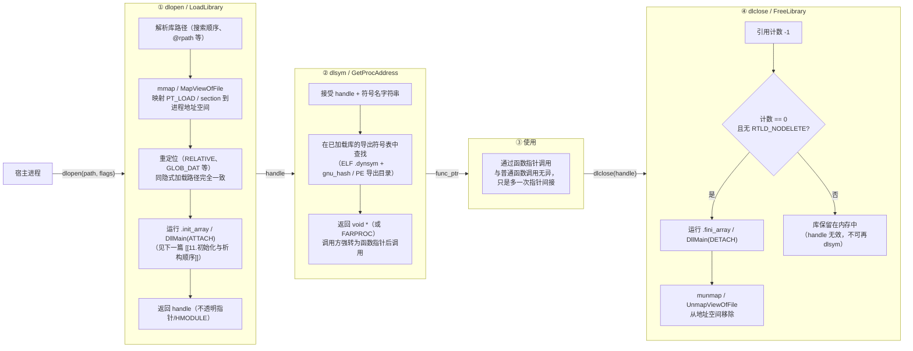

# 动态链接与加载器（10）· 运行时动态加载

> [!abstract] TL;DR
> - **静态依赖 vs 运行时加载**：前面所有章节讲的是"启动时自动加载"——可执行文件在 `DT_NEEDED` / `LC_LOAD_DYLIB` / 导入表里声明好依赖，动态链接器在程序入口前把它们全部装好。**运行时动态加载**（runtime dynamic loading）则截然不同：程序在**运行到某一时刻**，主动调用一组 API，按需把一个共享库从磁盘映射进地址空间、按符号名取函数指针、用完后卸载——整个过程完全由程序员控制，动态链接器只是一个被调用的服务。
> - **典型应用**：插件系统（宿主程序不知道插件类型）、热更新（不重启进程换模块）、跨平台"能力探测"（先 `dlopen` 试加载，失败再降级）、驱动按需加载。
> - **三平台 API**：Linux/macOS 均用 POSIX 的 `dl*` 系列（`dlopen`/`dlsym`/`dlclose`/`dlerror`），行为细节有差异；Windows 用 `LoadLibrary(Ex)`/`GetProcAddress`/`FreeLibrary`，思路一致、接口不同。
> - **核心陷阱**：`dlclose` 不保证真正卸载（引用计数 > 0 时或设了 `RTLD_NODELETE` 时，库一直留在内存里）；`RTLD_GLOBAL` 会把符号注入全局命名空间、影响符号查找顺序，与 [[32.hooks/03-linux-hook.md]] 里 `LD_PRELOAD` + `RTLD_NEXT` hook 技术紧密相关。

本篇承接 [[09.ASLR与位置无关代码]] 所讲的 PIC/PIE 基础（运行时加载的库同样必须是位置无关代码），聚焦"程序员主动调用的那层 API"——它如何触发动态链接器的加载逻辑、符号名如何变成可调用的函数指针、库的生命周期如何被引用计数管理。下一篇 [[11.初始化与析构顺序]] 会接着讲"这个被加载的库内部，`__attribute__((constructor))` / `DllMain` / `+load` 等初始化函数如何被触发、按什么顺序执行"——那是本篇"库被加载进内存"之后紧接着发生的事情。

---

## 概述与定位

### 两种动态链接路径的根本区别

动态链接有两条路径，它们用的底层机制几乎相同，但控制权归属不同：

| 维度 | 隐式（启动时）加载 | 显式（运行时）加载 |
|---|---|---|
| 何时触发 | 内核 `execve` / `CreateProcess` 后、程序入口前 | 程序运行时主动调用 API |
| 控制方 | **动态链接器**（`ld.so`/`dyld`/`ntdll`）自动完成 | **程序员**通过 `dlopen` / `LoadLibrary` 控制 |
| 依赖声明 | 编译链接时写入二进制（`DT_NEEDED`/`LC_LOAD_DYLIB`/导入表） | 运行时**字符串**（路径或文件名）传给 API |
| 符号绑定 | 动态链接器通过 PLT/GOT/IAT 自动绑定（见 [[08.PLT与GOT与延迟绑定]]） | 程序员用 `dlsym`/`GetProcAddress` 按名字手动取指针 |
| 失败处理 | 启动失败、进程无法运行 | `dlopen` 返回 NULL / `LoadLibrary` 返回 NULL，程序可自行处理 |
| 典型用途 | 固定依赖（libc、框架） | 插件、热更新、能力探测、驱动按需加载 |

两条路径底层都走动态链接器，只是"自动模式"和"手动模式"的差别。

### 典型使用场景

**插件系统**是最经典的用途。宿主程序定义一个插件接口（如 `struct PluginAPI { void (*init)(void); int (*run)(int); }`），插件是若干 `.so`/`.dylib`/`.dll` 文件，在启动时或用户操作时动态加载，各插件按接口约定导出符号。宿主不需要在编译时知道插件的存在。

**热更新**（Hot Patching）场景下，服务进程不重启、只换某个 `.so` 模块：`dlclose` 旧版本、`dlopen` 新版本、重新 `dlsym` 取函数指针。但这条路充满陷阱（`dlclose` 不保证卸载、运行中有线程在旧函数里……），工程上往往用其变种（新库加后缀版本号、旧库保留直到引用归零）。

**能力探测**则是"尝试加载，失败了降级"：

```c
void *handle = dlopen("libvulkan.so.1", RTLD_NOW | RTLD_LOCAL);
if (handle) {
    PFN_vkCreateInstance vkCreate =
        (PFN_vkCreateInstance)dlsym(handle, "vkCreateInstance");
    // 有 Vulkan，走高性能路径
} else {
    // 无 Vulkan，回落 OpenGL/软渲染
}
```

---

## 原理与机制

### 运行时加载插件的生命周期



> 图解：四个阶段在单次"插件生命周期"里串行发生。**open** 阶段和隐式加载走完全相同的底层路径（映射 + 重定位 + 初始化），只是触发时机不同、触发者从动态链接器变成了程序员的 API 调用。**sym** 阶段的查找直接走库的导出符号表，不经过 PLT/GOT（调用方自己持指针，无需跳板）。**close** 阶段的关键是引用计数——同一个库路径可被多次 `dlopen`，每次 +1，每次 `dlclose` -1，降到 0 才真正卸载；`RTLD_NODELETE` 可以让计数降到 0 时也不卸载。

---

## Linux：`dl*` API 深度解析

### `dlopen`：加载一个共享对象

```c
#include <dlfcn.h>
void *dlopen(const char *filename, int flags);
```

`filename` 为 `NULL` 时，返回指向**主程序**（可执行文件自身）的句柄，可用来查找主程序导出的符号。`filename` 非空时，走与 `LD_LIBRARY_PATH`/`DT_RUNPATH`/`/etc/ld.so.cache` 相同的搜索逻辑（详见 [[05.依赖解析与库搜索顺序]]）。

`flags` 是两类标志的组合：

#### `RTLD_LAZY` vs `RTLD_NOW`：符号解析时机

| 标志 | 行为 | 对应隐式加载的等价配置 |
|---|---|---|
| `RTLD_LAZY` | 函数符号（`JUMP_SLOT` 重定位）**延迟**到首次调用时解析；数据符号仍立即解析 | `-z lazy`（ELF 默认） |
| `RTLD_NOW` | **所有**符号立即解析；若有未定义符号，`dlopen` 直接返回 `NULL`，`dlerror()` 报"undefined symbol" | `-z now`（等价 `LD_BIND_NOW=1`） |

两者的权衡：`RTLD_LAZY` 让 `dlopen` 更快返回，但可能在运行深处才暴露"库依赖了某个不存在的符号"；`RTLD_NOW` 在 `dlopen` 时就发现这类问题，是调试和生产健壮性的首选。

> [!note] 用 `RTLD_NOW` 做"接口验证"
> 插件系统中，主程序往往对插件有版本要求：先 `dlopen(path, RTLD_NOW | RTLD_LOCAL)`，若返回 NULL 则版本/符号缺失，拒绝加载；若成功再正常使用。这等于把"运行时找不到函数"的问题提前到加载阶段暴露，避免在业务流程深处崩溃。

#### `RTLD_GLOBAL` vs `RTLD_LOCAL`：符号可见性

| 标志 | 行为 | 风险 |
|---|---|---|
| `RTLD_LOCAL` | 库的符号**仅对本句柄**的 `dlsym` 可见，不进全局符号表（**默认**） | 与其他库无符号冲突 |
| `RTLD_GLOBAL` | 库的符号**注入全局符号命名空间**，后续任何库的符号解析都能看到它 | 同名符号可能覆盖其他库的同名符号 |

`RTLD_GLOBAL` 是 hook 技术的关键。`LD_PRELOAD` 本质上就是"在搜索顺序最前面放一个 `RTLD_GLOBAL` 库"。更灵活地，可以在运行时用 `dlopen(hooklib, RTLD_NOW | RTLD_GLOBAL)` 把 hook 库注入全局命名空间，让后续所有未解析符号优先解析到 hook 实现——这是 [[32.hooks/03-linux-hook.md]] 里描述的"运行时注入"路径之一。

#### 引用计数与重复 `dlopen`

同一个路径（规范化后）被 `dlopen` 多次，内核映射页面**不重复**，只增加引用计数并返回同一个句柄（句柄值可能相同）。`flags` 在首次加载时生效；再次打开时，若已用 `RTLD_LOCAL` 加载，传 `RTLD_GLOBAL` 可以将其"升级"为全局可见。

### `dlsym`：符号名 → 函数指针

```c
void *dlsym(void *handle, const char *symbol);
```

返回 `void *`，调用方强转为具体函数指针类型后使用。

#### 伪句柄 `RTLD_DEFAULT` 与 `RTLD_NEXT`

这两个特殊值不是真实的库句柄，而是**符号查找策略**的指令：

| 伪句柄 | 查找范围 | 典型用途 |
|---|---|---|
| `RTLD_DEFAULT` | 按**全局符号搜索顺序**（所有 `RTLD_GLOBAL` 库 + 主程序）查找，等效于"正常的符号解析" | 在不知道符号属于哪个库时，按全局顺序找 |
| `RTLD_NEXT` | 在**当前库之后**的搜索顺序里继续查找，跳过当前库自身 | Hook 实现里调用"原始函数"的标准手法 |

`RTLD_NEXT` 是理解 Linux hook 的核心。在一个 `LD_PRELOAD` 库或运行时注入的 hook 库里：

```c
// hook_malloc.c
#define _GNU_SOURCE
#include <dlfcn.h>
#include <stdlib.h>

typedef void *(*malloc_fn_t)(size_t);

void *malloc(size_t size) {
    // RTLD_NEXT 跳过本库（hook 库），在后续库（libc）里找真实的 malloc
    static malloc_fn_t real_malloc = NULL;
    if (!real_malloc) {
        real_malloc = (malloc_fn_t)dlsym(RTLD_NEXT, "malloc");
    }
    // ... 插入自定义逻辑 ...
    return real_malloc(size);
}
```

`RTLD_NEXT` 依赖当前库在符号搜索顺序里的**位置**：它从"调用 `dlsym(RTLD_NEXT, ...)` 的那个库"出发，往后找。`RTLD_DEFAULT` 则从头找，通常会命中 hook 库自身（死循环），所以 hook 场景里必须用 `RTLD_NEXT`。完整的 `RTLD_NEXT` + `LD_PRELOAD` hook 机制见 [[32.hooks/03-linux-hook.md]]。

> [!note] `dlsym` 对函数与数据符号的差异
> `dlsym` 返回的 `void *` 对于函数符号是**代码指针**，对于数据符号是**数据地址**。严格来说，C 标准不允许把 `void *` 转为函数指针（它们大小可能不同），但 POSIX 允许这种转换（作为扩展），glibc 的实现也保证这一点。若确实需要跨平台严格 C89 代码，可用 union 中间转换：
> ```c
> union { void *obj; void (*fn)(void); } u;
> u.obj = dlsym(handle, "my_func");
> u.fn();  // 严格合法写法
> ```

### `dlclose`：减引用，不保证卸载

```c
int dlclose(void *handle);
```

`dlclose` 的关键认知：**它不保证立即从地址空间移除库**。精确语义是：将该句柄的引用计数减一。只有当引用计数降到 0，且不存在其他理由保留时（见下），才运行 `.fini_array`、最终 `munmap`。

**不被卸载的场景**：

1. **其他库依赖它**：若库 B 被 `dlopen` 加载，而库 A 是 B 的依赖（B 的 `DT_NEEDED` 里有 A），则 `dlclose(B)` 会把 A 的引用计数也减一，但只要 A 的计数 > 0，A 不会被卸载。
2. **多次 `dlopen`**：对同路径 `dlopen` 了 N 次，必须 `dlclose` N 次才能让引用计数降到 0。
3. **`RTLD_NODELETE`**：加载时带此标志，计数永远不会降到 0 处理——即使调用 `dlclose` 使引用计数归零，库也留在内存里，其符号一直有效，适合全局状态不能被析构的场景（如某些 C++ 静态变量、线程局部存储里的对象）。

> [!warning] `dlclose` 后继续使用函数指针
> `dlclose` 返回后，若引用计数确实降到 0 且库已被卸载，之前从 `dlsym` 拿到的函数指针立即变为**悬空指针**，调用会产生未定义行为（可能 SIGSEGV）。正确做法：在 `dlclose` 前，确保没有任何线程正在执行该库内的代码，并将所有相关函数指针置 NULL。

### `dlerror`：获取最近的错误信息

```c
char *dlerror(void);
```

`dlerror` 返回自上次 `dlerror` 调用或进程启动以来**最近一次** `dl*` API 失败的错误描述字符串。**注意**：每次成功的 `dl*` 调用会**清除**错误状态（不是叠加）。惯用写法是在调用 API 之前先清除一次，再在调用后立即检查：

```c
dlerror();              // 清除上一次错误
void *sym = dlsym(handle, "foo");
const char *err = dlerror();
if (err) {
    fprintf(stderr, "dlsym failed: %s\n", err);
}
```

不要把 `dlerror` 的返回值保存太久——它指向一块内部静态缓冲区，下一次 `dlerror` 调用后内容会被覆盖（线程安全版本每个线程有独立缓冲，但同样是下次调用后覆盖）。

---

## Windows：`LoadLibrary` / `GetProcAddress` / `FreeLibrary`

Windows 的运行时加载 API 在功能上与 `dl*` 系列一一对应，但接口更细分。

### `HMODULE`：即模块基址

```c
#include <windows.h>
HMODULE LoadLibrary(LPCTSTR lpLibFileName);
HMODULE LoadLibraryEx(LPCTSTR lpLibFileName, HANDLE hFile, DWORD dwFlags);
FARPROC GetProcAddress(HMODULE hModule, LPCSTR lpProcName);
BOOL    FreeLibrary(HMODULE hLibModule);
```

`HMODULE` 是一个**不透明句柄**，在实现上就是**模块在进程地址空间中的基地址**（即 `IMAGE_DOS_HEADER` 的起始虚拟地址）。可以把 `HMODULE` 直接当指针用来解析 PE 结构（但这是非官方用法，不建议在生产代码里依赖）。

`GetModuleHandle(NULL)` 返回当前可执行文件本身的 `HMODULE`，类似 `dlopen(NULL, ...)`。`GetModuleHandle("kernel32.dll")` 返回已加载的 kernel32 的句柄（不增加引用计数）。

### `LoadLibraryEx` 的 `LOAD_LIBRARY_SEARCH_*` 标志

`LoadLibraryEx` 的 `dwFlags` 可以精确控制 DLL 的搜索路径，这直接影响安全性——DLL 搜索顺序劫持（DLL Hijacking）是 Windows 上经典的权限提升/代码注入手法，合理设置 `dwFlags` 是防御的第一步：

| 标志 | 搜索范围 | 典型用途 |
|---|---|---|
| `LOAD_LIBRARY_SEARCH_APPLICATION_DIR` | 仅搜索**应用程序所在目录** | 应用自带的 DLL，不受环境影响 |
| `LOAD_LIBRARY_SEARCH_DEFAULT_DIRS` | 应用目录 + 系统加载的路径（`AddDllDirectory` 添加的目录）+ 系统目录 | 标准受控搜索 |
| `LOAD_LIBRARY_SEARCH_DLL_LOAD_DIR` | 仅搜索**被加载 DLL 所在的目录**（不是调用者目录） | DLL 侧依赖（DLL 自己带的子依赖） |
| `LOAD_LIBRARY_SEARCH_SYSTEM32` | 仅搜索 `%System32%` | 明确只要 Windows 系统 DLL |
| `LOAD_LIBRARY_SEARCH_USER_DIRS` | 通过 `AddDllDirectory` 注册的用户目录 | 可信第三方目录 |
| `LOAD_LIBRARY_AS_DATAFILE` | **不执行代码**，仅映射为资源文件 | 读取 DLL 内的资源（图标、版本信息），不初始化 |
| `LOAD_LIBRARY_AS_IMAGE_RESOURCE` | 以"图像资源"方式映射，返回的 `HMODULE` 低位被置标记（标识 mapped-as-data，需用 `RtlImageNtHeader` 等剥离后再解析） | 读取 PE 头/节而无需执行 |

> [!note] 防御 DLL 劫持的最小实践
> 第三方 DLL 的加载应**始终**传入 `LOAD_LIBRARY_SEARCH_DEFAULT_DIRS` 或更严格的标志，而不是使用默认的无 flags 调用（无 flags 的 `LoadLibrary` 会搜索当前目录，而当前目录可能被攻击者控制）。对安全敏感的场景，再结合 `SetDllDirectory("")`（清空当前目录搜索）和签名验证（`WinVerifyTrust`）。

### 引用计数与 `FreeLibrary`

Windows 的引用计数语义与 Linux 相同：每次 `LoadLibrary` +1，每次 `FreeLibrary` -1，降到 0 时触发 `DllMain(DLL_PROCESS_DETACH)`，从进程地址空间卸载。`GetModuleHandle` **不增加**引用计数，用它拿到的句柄可以调用 `GetProcAddress`，但不应调用 `FreeLibrary`（会把别人的引用计数错误减掉）。

### `GetProcAddress`：符号名或序号

```c
FARPROC GetProcAddress(HMODULE hModule, LPCSTR lpProcName);
```

`lpProcName` 可以是：
- **字符串**：在 DLL 导出目录的名称表里按名字查找。
- **序号**（用 `MAKEINTRESOURCE(n)` 宏，实为低 16 位为序号的整数）：按序号直接查导出地址表，不经名称表——更快但依赖 DLL 导出序号稳定，通常只在已知 DLL 内部使用（如 ntdll.dll 的未文档化 API）。

`FARPROC` 是指向函数的指针类型，使用前需强转为具体签名的函数指针类型。与 `dlsym` 的 `void *` 类似，在 Windows 上同样可能遇到"无法直接把函数指针赋给数据指针变量"的类型系统问题，通常用强制类型转换解决。

---

## macOS：`dlopen` 的行为差异

macOS 同样支持 POSIX `dl*` 接口（`<dlfcn.h>`），函数签名与 Linux 完全相同，但底层由 `dyld` 实现，存在以下差异点：

### `@rpath` 路径支持

macOS 的 `dlopen` 可以直接接受 `@rpath/xxx.dylib` 形式的路径，`dyld` 会按运行时搜索路径列表（`LC_RPATH` 给出的目录）逐个替换 `@rpath`——这是 Linux `dlopen` 不支持的特性（Linux 中 `@rpath` 不是 ld.so 能识别的特殊前缀）。

关于 `@rpath` 的完整机制，见 [[12.Mach-O文件详解/07.Mach-O LC_LOAD_DYLIB.md]]：库的 `install name` 是以 `@rpath/...` 开头的字符串，`dyld` 用进程的 rpath 列表逐一替换 `@rpath`，找到实际存在的文件为止。对运行时加载，`dlopen` 里传入的路径同样走这套逻辑，加载者（调用 `dlopen` 的那个模块）的 `LC_RPATH` 会被考虑进去。

### 库缓存（dyld shared cache）

系统库（`libSystem.B.dylib`、各 framework 等）在现代 macOS 上已预先合并进 **dyld shared cache**（位于 `/private/var/db/dyld/` 或 `/System/Library/dyld/`）。对这些库调用 `dlopen` 时，`dyld` 直接从 cache 中映射，而非磁盘上的独立 `.dylib` 文件（独立文件在 macOS 12+ 已不存在于磁盘上，只存在于 cache 内）。这对程序员透明，但影响工具链：`otool -L` / `dyld_info` 查看路径时看到的是 cache 内部路径，实际文件不可独立访问。

### Hardened Runtime 限制

macOS 的 **Hardened Runtime**（分发到 App Store 或使用 notarization 签名的程序启用）对 `dlopen` 有额外限制：无法加载来自任意路径的、未签名的 dylib。`DYLD_INSERT_LIBRARIES` / `DYLD_LIBRARY_PATH` 等环境变量在受限程序里被忽略，对应地，运行时 `dlopen` 加载未签名的插件也会失败。开发者需要在 entitlements 里显式开放 `com.apple.security.cs.disable-library-validation` 才能加载未签名的第三方 `.dylib`。

---

## 三平台 API 对照表

| 功能 | Linux | macOS | Windows |
|---|---|---|---|
| **头文件** | `<dlfcn.h>` | `<dlfcn.h>` | `<windows.h>` |
| **加载库** | `dlopen(path, flags)` | `dlopen(path, flags)` | `LoadLibrary(path)` / `LoadLibraryEx(path, NULL, flags)` |
| **获取符号** | `dlsym(handle, name)` | `dlsym(handle, name)` | `GetProcAddress(hModule, name)` |
| **卸载库** | `dlclose(handle)` | `dlclose(handle)` | `FreeLibrary(hModule)` |
| **错误信息** | `dlerror()` | `dlerror()` | `GetLastError()` + `FormatMessage` |
| **句柄类型** | `void *` | `void *` | `HMODULE`（= 模块基址） |
| **主程序句柄** | `dlopen(NULL, ...)` | `dlopen(NULL, ...)` | `GetModuleHandle(NULL)` |
| **全局搜索** | `dlsym(RTLD_DEFAULT, ...)` | `dlsym(RTLD_DEFAULT, ...)` | `GetProcAddress(GetModuleHandle(NULL), ...)` / 无精确等价 |
| **跳过当前库** | `dlsym(RTLD_NEXT, ...)` | `dlsym(RTLD_NEXT, ...)` | 无内置等价（需手动遍历模块列表） |
| **延迟解析** | `RTLD_LAZY` | `RTLD_LAZY` | 无（LoadLibrary 立即解析）|
| **立即全量解析** | `RTLD_NOW` | `RTLD_NOW` | 默认行为 |
| **本地符号** | `RTLD_LOCAL` | `RTLD_LOCAL` | 无（Windows 无符号命名空间概念） |
| **全局符号** | `RTLD_GLOBAL` | `RTLD_GLOBAL` | 无精确等价 |
| **禁止卸载** | `RTLD_NODELETE` | `RTLD_NODELETE` | 无（可用 `LoadLibrary` 多次增加引用计数来间接实现）|
| **搜索路径控制** | 通过 `LD_LIBRARY_PATH`/`rpath`/`ldconfig` | 通过 `@rpath`/`DYLD_LIBRARY_PATH` | `LOAD_LIBRARY_SEARCH_*` flags |
| **引用计数** | 有（`dlclose` N 次才真正卸载） | 有（同 Linux） | 有（`FreeLibrary` N 次才真正卸载）|
| **不卸载标志** | `RTLD_NODELETE` | `RTLD_NODELETE` | 多次 `LoadLibrary` 或不 `FreeLibrary` |
| **按序号查符号** | 不支持 | 不支持 | `GetProcAddress(h, MAKEINTRESOURCE(n))` |
| **仅查询是否已加载** | `RTLD_NOLOAD`（不真加载，仅查库是否已在内存、取其句柄） | `RTLD_NOLOAD` | `GetModuleHandle`（仅取已加载句柄，不加载） |
| **仅映射为数据（不执行）** | 无（可 `mmap` 文件自行解析） | 无 | `LOAD_LIBRARY_AS_DATAFILE` |

---

## 代码与汇编

### 示例一：Linux `dlopen` + `dlsym` 加载插件

#### 插件头文件

```c
// plugin_api.h
#ifndef PLUGIN_API_H
#define PLUGIN_API_H

typedef struct {
    const char *name;
    int  (*init)(void);
    int  (*process)(const char *input, char *output, int max_len);
    void (*cleanup)(void);
} PluginAPI;

/* 每个插件必须导出这个符号 */
extern PluginAPI PLUGIN_ENTRY;

#endif
```

#### 插件实现（被动态加载的 `.so`）

```c
// plugin_echo.c
#include <stdio.h>
#include <string.h>
#include "plugin_api.h"

static int echo_init(void) {
    printf("[echo] plugin init\n");
    return 0;
}

static int echo_process(const char *in, char *out, int max) {
    int n = snprintf(out, max, "ECHO: %s", in);
    return n;
}

static void echo_cleanup(void) {
    printf("[echo] plugin cleanup\n");
}

PluginAPI PLUGIN_ENTRY = {
    .name    = "echo",
    .init    = echo_init,
    .process = echo_process,
    .cleanup = echo_cleanup,
};
```

#### 宿主程序

```c
// host.c
#define _GNU_SOURCE
#include <stdio.h>
#include <stdlib.h>
#include <dlfcn.h>
#include "plugin_api.h"

int main(int argc, char *argv[]) {
    if (argc < 2) {
        fprintf(stderr, "Usage: %s <plugin.so>\n", argv[0]);
        return 1;
    }

    /* ① 加载插件：RTLD_NOW 立即发现未定义符号；RTLD_LOCAL 避免污染全局命名空间 */
    dlerror();  /* 清除上一次错误状态 */
    void *handle = dlopen(argv[1], RTLD_NOW | RTLD_LOCAL);
    if (!handle) {
        fprintf(stderr, "dlopen failed: %s\n", dlerror());
        return 1;
    }

    /* ② 获取插件入口结构体指针 */
    dlerror();
    PluginAPI *api = (PluginAPI *)dlsym(handle, "PLUGIN_ENTRY");
    const char *err = dlerror();
    if (err) {
        fprintf(stderr, "dlsym failed: %s\n", err);
        dlclose(handle);
        return 1;
    }

    /* ③ 使用插件 */
    printf("Loaded plugin: %s\n", api->name);
    if (api->init() != 0) {
        fprintf(stderr, "Plugin init failed\n");
        dlclose(handle);
        return 1;
    }

    char buf[256];
    api->process("hello world", buf, sizeof(buf));
    printf("Result: %s\n", buf);

    api->cleanup();

    /* ④ 卸载插件（引用计数 -1；此处只 dlopen 了一次，会真正卸载） */
    dlclose(handle);
    /* handle 从此无效，api 指针是悬空指针，不可再使用 */
    api = NULL;

    return 0;
}
```

#### 构建命令

```bash
# 编译插件为共享库（-fPIC 是必须的，见 [[09.ASLR与位置无关代码]]）
gcc -fPIC -shared -o plugin_echo.so plugin_echo.c

# 编译宿主程序（-ldl 链接动态链接器库）
gcc -o host host.c -ldl

# 运行
./host ./plugin_echo.so
```

> [!warning] 示例输出为示意
> 本机为 Windows 环境，以下输出为代表性示意，非本机实跑。

```text
Loaded plugin: echo
[echo] plugin init
Result: ECHO: hello world
[echo] plugin cleanup
```

> 说明：若 `plugin_echo.so` 里少导出了某个符号，因为用了 `RTLD_NOW`，错误会在 `dlopen` 时就暴露（返回 NULL + `dlerror` 有信息），而不是在 `api->process(...)` 时才 SIGSEGV。

---

### 示例二：Windows `LoadLibrary` + `GetProcAddress`

#### 插件 DLL

```c
// plugin_echo_win.c  (编译为 plugin_echo.dll)
#include <windows.h>
#include <stdio.h>
#include <string.h>

/* 使用 __declspec(dllexport) 导出符号；
   也可改用 .def 文件列出导出名，效果相同 */

__declspec(dllexport) int plugin_init(void) {
    printf("[echo-win] init\n");
    return 0;
}

__declspec(dllexport) int plugin_process(const char *in, char *out, int max) {
    /* 用标准 snprintf（MSVC 2015+/UCRT 与 MinGW 均支持，保证写入终止符 \0，
       与 Linux 示例行为一致；勿用旧式 _snprintf——缓冲区填满时不保证以 \0 结尾） */
    return snprintf(out, max, "ECHO: %s", in);
}

__declspec(dllexport) void plugin_cleanup(void) {
    printf("[echo-win] cleanup\n");
}

/* DLL 入口点（可选；不做任何事时可以省略） */
BOOL WINAPI DllMain(HINSTANCE hinstDLL, DWORD fdwReason, LPVOID lpvReserved) {
    (void)hinstDLL; (void)lpvReserved;
    return TRUE;
}
```

#### 宿主程序

```c
// host_win.c
#include <windows.h>
#include <stdio.h>

typedef int  (*init_fn_t)(void);
typedef int  (*process_fn_t)(const char *, char *, int);
typedef void (*cleanup_fn_t)(void);

int main(int argc, char *argv[]) {
    if (argc < 2) {
        fprintf(stderr, "Usage: %s <plugin.dll>\n", argv[0]);
        return 1;
    }

    /* ① 加载 DLL：LOAD_LIBRARY_SEARCH_DEFAULT_DIRS 防御 DLL 劫持 */
    HMODULE hMod = LoadLibraryExA(
        argv[1],
        NULL,
        LOAD_LIBRARY_SEARCH_DEFAULT_DIRS
    );
    if (!hMod) {
        fprintf(stderr, "LoadLibraryEx failed: error %lu\n", GetLastError());
        return 1;
    }

    /* ② 获取各函数指针 */
    init_fn_t    fn_init    = (init_fn_t)   GetProcAddress(hMod, "plugin_init");
    process_fn_t fn_process = (process_fn_t)GetProcAddress(hMod, "plugin_process");
    cleanup_fn_t fn_cleanup = (cleanup_fn_t)GetProcAddress(hMod, "plugin_cleanup");

    if (!fn_init || !fn_process || !fn_cleanup) {
        fprintf(stderr, "GetProcAddress failed: error %lu\n", GetLastError());
        FreeLibrary(hMod);
        return 1;
    }

    /* ③ 使用插件 */
    fn_init();
    char buf[256];
    fn_process("hello world", buf, (int)sizeof(buf));
    printf("Result: %s\n", buf);
    fn_cleanup();

    /* ④ 卸载（引用计数 -1，此处降至 0，触发 DllMain(DLL_PROCESS_DETACH)） */
    FreeLibrary(hMod);
    /* hMod 从此无效；fn_* 函数指针是悬空指针，不可再使用 */
    hMod = NULL;

    return 0;
}
```

#### 构建命令（MSVC + MSVC Toolchain）

```bat
:: 编译插件 DLL
cl /LD /Fe:plugin_echo.dll plugin_echo_win.c

:: 编译宿主程序
cl /Fe:host_win.exe host_win.c

:: 运行（plugin_echo.dll 必须在 PATH 或 LOAD_LIBRARY_SEARCH_DEFAULT_DIRS 搜索范围内）
host_win.exe plugin_echo.dll
```

#### 构建命令（MinGW gcc）

```bash
# 编译插件 DLL
gcc -shared -o plugin_echo.dll plugin_echo_win.c

# 编译宿主程序
gcc -o host_win.exe host_win.c

# 运行
./host_win.exe ./plugin_echo.dll
```

> [!warning] 示例输出为示意
> 以下输出为代表性示意，非本机实跑。

```text
[echo-win] init
Result: ECHO: hello world
[echo-win] cleanup
```

> 说明：Windows 没有类似 `RTLD_NOW` 的"加载时发现未定义符号"机制——`LoadLibrary` 总是立即解析所有导入（等效 `RTLD_NOW`）。若 DLL 导入了某个不存在的符号，`LoadLibrary` 本身会失败。但 DLL 对外"是否导出了某符号"只能通过 `GetProcAddress` 逐个检查（返回 NULL）。这正是示例里在 `GetProcAddress` 后立即检查 NULL 的原因。

---

## 实操：用工具观察

> [!warning] 示例输出为示意
> 本节所有命令输出均为代表性示意，非本机实跑。读者应在自己的 Linux/macOS/Windows 环境中复现。

### Linux：`LD_DEBUG` 观察 `dlopen` 加载

```bash
LD_DEBUG=libs,bindings ./host ./plugin_echo.so 2>&1 | head -40
```

```text
  12345: find library=plugin_echo.so [0]; searching
  12345:  search path=./           (RPATH from file ./host)
  12345:  trying file=./plugin_echo.so
  12345: calling init: ./plugin_echo.so
  12345: binding file ./plugin_echo.so [0] to ./plugin_echo.so [0]: normal symbol `echo_init'
```

> [!warning] 示例输出为示意
> 行首数字是进程标识；`calling init` 行对应 `plugin_echo.so` 的 `.init_array` 被调用（若有），**先于** `dlopen` 返回，在宿主程序看到句柄之前已完成。

### Linux：`ldd` 只看静态依赖，`/proc/<pid>/maps` 看运行时映射

```bash
ldd ./host          # 只显示静态依赖（host 本身 DT_NEEDED），看不到 dlopen 加载的库
                    # plugin_echo.so 不在 ldd 输出里

# 运行时查看进程的完整地址空间映射
cat /proc/$(pidof host)/maps | grep plugin_echo
```

```text
7f8a3c000000-7f8a3c001000 r--p 00000000 fd:01 123456 /path/to/plugin_echo.so
7f8a3c001000-7f8a3c002000 r-xp 00001000 fd:01 123456 /path/to/plugin_echo.so
7f8a3c002000-7f8a3c003000 r--p 00002000 fd:01 123456 /path/to/plugin_echo.so
7f8a3c003000-7f8a3c004000 rw-p 00003000 fd:01 123456 /path/to/plugin_echo.so
```

> [!warning] 示例输出为示意
> 这直接印证了 `dlopen` 在运行时把 `plugin_echo.so` 的各段映射进地址空间：只读代码段（`r-xp`）、只读数据段（`r--p`）、可写数据段（`rw-p`）——与隐式加载的共享库映射布局完全相同。

### Windows：Process Explorer / Process Monitor 观察 DLL 加载

在 Process Explorer 中选中 `host_win.exe` 进程，"DLLs" 标签页会实时显示已加载的所有 DLL；`LoadLibrary` 调用后立即刷新，`FreeLibrary` 后从列表消失。Process Monitor 配合"Process: host_win.exe"过滤，可以看到 `CreateFile`（打开 DLL 文件）和 `MapViewOfFile`（映射进地址空间）操作。

---

## 攻防 / 陷阱

### 运行时加载与符号命名空间安全

`RTLD_GLOBAL` 把插件的符号注入全局命名空间，这意味着：如果两个插件都导出了同名函数（如 `util_process`），后加载的会覆盖先加载的在全局命名空间的注册。后续任何通过 `RTLD_DEFAULT` 或 `dlsym(RTLD_DEFAULT, "util_process")` 的查找，都会命中后加载的插件。这是典型的**符号冲突**（Symbol Conflict）问题。

**防御**：除非明确需要 hook 语义，否则总用 `RTLD_LOCAL`，让插件符号只在其 handle 作用域内可见。

### `dlclose` 后使用悬空指针

最常见的运行时加载 bug。模式：宿主 `dlopen` 加载库 A，拿到函数指针 `fn`，某路径下 `dlclose(A)`，之后因为某些条件（另一线程、回调等）仍然调用 `fn`。若 `dlclose` 真正卸载了库，`fn` 指向的内存已被 `munmap`，调用产生 SIGSEGV。

**防御**：要么用 `RTLD_NODELETE` 让库不被卸载；要么维护严格的生命周期——在 `dlclose` 前置 NULL 所有相关指针，并确保所有线程都已退出该库的代码。

### Windows DLL 劫持

见上文 `LOAD_LIBRARY_SEARCH_*` 一节。核心是：默认无 flags 的 `LoadLibrary` 包含当前工作目录在搜索路径里，攻击者只需把恶意 DLL 放进当前目录，就能让程序加载到恶意代码。防御：始终用 `LoadLibraryEx` + `LOAD_LIBRARY_SEARCH_DEFAULT_DIRS` 或更严格的标志。

### macOS 运行时加载与 `RTLD_NEXT` 的 `_GNU_SOURCE` 依赖

Linux 的 `RTLD_NEXT` 和 `RTLD_DEFAULT` 定义在 `<dlfcn.h>` 里，但需要 `#define _GNU_SOURCE`（glibc 扩展）才能看到。忘记定义 `_GNU_SOURCE` 时，`RTLD_NEXT` 编译失败。macOS 上 `RTLD_NEXT` 是标准 `<dlfcn.h>` 的一部分，无需额外宏。

### C++ 运行时加载的额外注意事项

C++ 的名称改编（Name Mangling）意味着 `dlsym` / `GetProcAddress` 使用的字符串必须是**改编后的名称**，或者导出时用 `extern "C"` 去除改编：

```cpp
// plugin.cpp
extern "C" {
    // 导出时加 extern "C"，使 dlsym("plugin_process") 能直接找到它
    int plugin_process(const char *in, char *out, int max) { ... }
}
```

不加 `extern "C"` 的 C++ 成员函数或重载函数，其改编后的名字依赖编译器（g++ 与 MSVC 的改编方案不同），无法跨编译器使用 `dlsym` 按字符串查找。推荐的 C++ 插件模式：用 `extern "C"` 导出一个工厂函数返回接口指针（如 `IPlugin *create_plugin()`），内部用 C++ 实现。

---

## 小结

1. **运行时加载 = 程序员主动调用的动态链接器服务**：`dlopen`/`LoadLibrary` 触发与隐式加载完全相同的底层流程（映射 + 重定位 + 初始化），只是控制权在程序手里，失败可以优雅降级。
2. **`RTLD_NOW` + `RTLD_LOCAL` 是默认推荐组合**：`RTLD_NOW` 在加载时就暴露未定义符号问题，`RTLD_LOCAL` 防止污染全局命名空间、避免符号冲突；`RTLD_GLOBAL` 只在需要 hook 语义或插件需要被其他库看到时使用。
3. **`RTLD_NEXT` 是 Linux/macOS hook 的核心**：在当前库之后继续查找同名符号，配合 `LD_PRELOAD` 或运行时注入，是调用"原始函数"的标准手法；详情见 [[32.hooks/03-linux-hook.md]]。
4. **`dlclose` 不等于立即卸载**：引用计数、其他库依赖、`RTLD_NODELETE` 都会阻止真正卸载；`dlclose` 后必须将函数指针置 NULL，防止悬空指针。
5. **Windows 没有命名空间标志，但有搜索路径标志**：`LoadLibraryEx` 的 `LOAD_LIBRARY_SEARCH_*` 控制 DLL 搜索范围，是防御 DLL 劫持的第一道防线；Windows 导入总是立即解析（无 `RTLD_LAZY` 等价物）。
6. **C++ 插件必须用 `extern "C"` 导出**：名称改编使直接用改编后名字 `dlsym` 不具备可移植性；工厂函数模式（`extern "C" IPlugin *create()`）是 C++ 插件系统的标准做法。

---

## 相关阅读

- **运行时加载的基础：PIC/PIE 与 ASLR**：[[09.ASLR与位置无关代码]]
- **加载后立即发生的事：初始化与析构顺序**：[[11.初始化与析构顺序]]
- **`RTLD_NEXT` 与 LD_PRELOAD hook 机制全解**：[[32.hooks/03-linux-hook.md]]
- **macOS `@rpath` 与 `LC_LOAD_DYLIB`：`dlopen` 路径解析的底层**：[[12.Mach-O文件详解/07.Mach-O LC_LOAD_DYLIB.md]]
- **库搜索顺序（`dlopen` 找库走的逻辑）**：[[05.依赖解析与库搜索顺序]]
- **延迟绑定（`RTLD_LAZY` 对应的底层机制）**：[[08.PLT与GOT与延迟绑定]]
- **符号解析作用域（`RTLD_GLOBAL` 影响的全局符号命名空间）**：[[06.符号解析与符号查找]]
- **加载器劫持（DLL 劫持与 `LD_PRELOAD` 滥用的安全视角）**：[[14.加载器劫持]]
- **GOT 改写攻防（运行时改写函数指针表的经典手法）**：[[11.ELF文件详解/17.got节.md]]

---

⬅️ 上一篇 [[09.ASLR与位置无关代码]] ｜ 🏠 [[00.动态链接与加载器总览]] ｜ 下一篇 [[11.初始化与析构顺序]] ➡️
