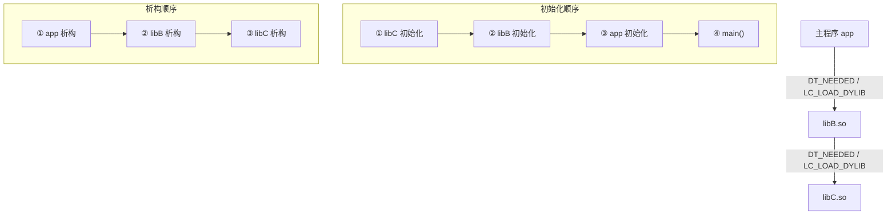

# 动态链接与加载器（11）· 初始化与析构顺序

> [!abstract] TL;DR
> - **初始化不从 `main` 开始**：动态链接器和 C 运行时在把控制权交给 `main` 之前，已经按照严格的拓扑顺序执行完所有依赖库和主程序的初始化函数——`.init`/`.init_array`（Linux）、`__mod_init_func`（macOS）、`DllMain(DLL_PROCESS_ATTACH)`（Windows）都发生在 `main` 之前。
> - **析构与初始化镜像对称**：Linux `.fini_array` 按初始化的逆序调用；C++ 全局对象的析构通过 `__cxa_atexit` 注册、以"后构造先析构"LIFO 顺序在 `exit()` 时触发，而不直接写入 `.fini_array`。
> - **依赖拓扑序是硬保证**：被依赖的库先初始化、后析构；依赖者相反——这是三大平台的共同承诺，但循环依赖会使保证失效。
> - **安全视角**：`.init_array` 是比 `main` 更早的代码执行点，既是攻击者植入持久化代码的目标，也是逆向分析必须关注的地方；Windows 的 `DllMain` 因运行在 loader lock 下，一旦在里面等待其他线程或加载更多 DLL，极易死锁。

上一篇 [[10.运行时动态加载]] 讲到，`dlopen`/`LoadLibrary` 把库映射进内存后，紧接着"运行初始化器"。本篇把这一步展开：这些初始化器是什么、存在哪里、由谁按什么顺序触发、析构对应什么、三大平台各有何差异。下一篇 [[12.TLS的实现]] 会在此基础上讲线程局部存储的初始化，那是另一层更细的构造时序。

---

## 概述与定位

### 为什么需要"main 之前的初始化"

一个非平凡的 C++ 程序，在 `main` 第一行代码执行之前，世界已经发生了很多事：

```cpp
// 全局对象——构造函数必须在 main 之前跑完
std::map<std::string, int> g_registry;
Logger g_logger("app.log");   // Logger 的构造函数打开文件

int main() {
    g_registry["key"] = 42;   // 若 g_registry 未构造，这里直接崩溃
    g_logger.info("started");  // 同理
    return 0;
}
```

C++ 标准要求：具有静态存储期且需要动态初始化的对象，必须在首次 ODR 使用之前完成构造。对文件作用域的全局对象，"首次使用"可能就是 `main` 里的第一行——因此构造必须在 `main` 之前完成。

这个需求与共享库组合后更复杂：`libfoo.so` 有自己的全局对象，它的构造函数在 `libfoo.so` 被加载时就要跑。动态链接器必须按照依赖关系图，以拓扑顺序依次初始化每个库。

### 本篇在系列中的位置

| 维度 | 本篇聚焦 | 相邻篇章 |
|---|---|---|
| 触发机制 | `__libc_start_main` / ld.so / dyld / ntdll 如何触发初始化 | 加载基础见 [[02.动态链接器的工作流程]] |
| 存储位置 | `.init`/`.init_array`（Linux）、`__mod_init_func`（macOS） | 节结构见 [[11.ELF文件详解/41.init节.md]]、[[11.ELF文件详解/43.init_array节.md]]、[[12.Mach-O文件详解/32.Mach-O __mod_init_func节.md]] |
| C++ 析构 | `__cxa_atexit` 注册机制 | C++ ABI 背景见 [[22.调用规约/00.总览.md]] |
| 运行时触发 | `dlopen` 后初始化器被调用 | 运行时加载见 [[10.运行时动态加载]] |
| 安全面 | `.init_array` 植入、DllMain 死锁 | 加固体系见 [[15.加载器视角的安全]] |

---

## 原理与机制

### 一句话模型

每个动态对象（可执行文件或共享库）都可以携带一张"入口前要做的事"的函数指针列表，由各平台的运行时/加载器负责在程序真正开始前把这张列表里的函数一一调用完。关键点有三：

1. **谁来调用**：Linux 上是 ld.so（对共享库）和 `__libc_start_main→__libc_csu_init`（对主程序旧 glibc）/ glibc 直接（glibc 2.34+）；macOS 是 dyld；Windows 是 ntdll 加载器（对 `DllMain`）。
2. **按什么顺序**：依赖拓扑序——被依赖者先初始化。
3. **析构时镜像翻转**：析构以初始化的逆序进行；C++ 的 `__cxa_atexit` 以 LIFO 顺序注册/执行，精确实现"后构造先析构"。

### 依赖拓扑序：核心保证

假设依赖关系为 `app → libB → libC`（app 依赖 libB，libB 依赖 libC）：



> 图解：**初始化顺序沿依赖树自底向上（bottom-up）**——被依赖者先初始化，这样每个初始化器运行时，它所依赖的库都已就绪。析构顺序完全相反，自顶向下（top-down）。循环依赖（`libA → libB → libA`）会打破这个保证，加载器以未定义的顺序处理循环中的节点。

---

## 三平台对照

| 维度 | Linux（ELF / ld.so） | macOS（Mach-O / dyld） | Windows（PE / ntdll） |
|---|---|---|---|
| 初始化函数表 | `.init_array`（`SHT_INIT_ARRAY`）+ `.init`（`DT_INIT` → `_init`） | `__DATA,__mod_init_func`（`S_MOD_INIT_FUNC_POINTERS`）/ 现代 `__init_offsets` | `DllMain(DLL_PROCESS_ATTACH)` |
| 析构函数表 | `.fini_array`（逆序）+ `.fini`（`DT_FINI` → `_fini`） | `__DATA,__mod_term_func`（`S_MOD_TERM_FUNC_POINTERS`） | `DllMain(DLL_PROCESS_DETACH)` |
| C++ 全局对象析构 | `__cxa_atexit` 注册（LIFO，不写 `.fini_array`） | `__cxa_atexit` 注册（LIFO） | `__cxa_atexit` / CRT `atexit`（LIFO） |
| 主程序初始化触发者 | `__libc_start_main` → `__libc_csu_init`（旧）/ 直接（glibc 2.34+） | dyld `runInitializers` | ntdll 加载器 → CRT `mainCRTStartup`(`_initterm`) |
| 共享库初始化触发者 | **ld.so** 在 `execve` 映射依赖库时，按拓扑序依次调用 | **dyld** 在 `dlopen` / 启动初始化阶段 | ntdll 加载器，`LoadLibrary` 时调 `DllMain` |
| 拓扑保证 | 被依赖者先初始化（`DT_NEEDED` 序） | 被依赖者先初始化（`LC_LOAD_DYLIB` 序） | 被依赖者先初始化（IAT 依赖序） |
| 优先级机制 | `__attribute__((constructor(N)))`，链接器按 N 排序 `.init_array` | `__attribute__((constructor(N)))`，链接器排序 `__mod_init_func` | 无标准优先级；依赖加载顺序隐式控制 |
| 线程初始化 | `__attribute__((constructor))` 不感知线程；TLS 由 `PT_TLS` 模板机制，详见 [[12.TLS的实现]] | 同 Linux | `DllMain(DLL_THREAD_ATTACH/DETACH)` 每线程创建/销毁时调用 |
| 运行时 `dlopen` 触发 | ld.so 在返回 `dlopen` 句柄前调完库的 `.init_array` | dyld 同样，返回前跑完 `__mod_init_func` | `LoadLibrary` 返回前触发 `DLL_PROCESS_ATTACH` |

---

## 数据结构 / 流程详解

### Linux：`.init` / `.init_array` / `.fini_array`

Linux ELF 的初始化机制由两个层次组成，参见 [[11.ELF文件详解/41.init节.md]] 和 [[11.ELF文件详解/43.init_array节.md]]：

#### 节结构

| 节 | 节类型 | 执行时机 | 顺序 |
|---|---|---|---|
| `.init` | `SHT_PROGBITS`（`DT_INIT`） | 先于 `.init_array` | — |
| `.init_array` | `SHT_INIT_ARRAY`（`DT_INIT_ARRAY`） | `.init` 之后，正序遍历 | 低 index 先执行 |
| `.preinit_array` | `SHT_PREINIT_ARRAY`（`DT_PREINIT_ARRAY`） | 所有 DSO 初始化**之前**（仅主程序有效） | 正序 |
| `.fini_array` | `SHT_FINI_ARRAY`（`DT_FINI_ARRAY`） | `exit()` 时，逆序遍历 | 高 index 先执行 |
| `.fini` | `SHT_PROGBITS`（`DT_FINI`） | `.fini_array` 之后 | — |

#### 主程序初始化调用链（glibc 2.34 前后对比）

**glibc < 2.34（旧式）**：

```
内核 execve → _start（crt1.o）
  → __libc_start_main(main, __libc_csu_init, __libc_csu_fini, ...)
      → __libc_csu_init():
          _init()                          // 调用 DT_INIT
          for fn in [__init_array_start .. __init_array_end]:
              fn(argc, argv, envp)         // 正序遍历 DT_INIT_ARRAY
      → main()
      → exit()
          → __libc_csu_fini():
              for fn in [__fini_array_end-1 .. __fini_array_start]:
                  fn()                     // 逆序遍历 DT_FINI_ARRAY
              _fini()                      // 调用 DT_FINI
```

**glibc 2.34+（新式）**：`__libc_csu_init` / `__libc_csu_fini` 从 `libc.a` 中彻底删除，glibc 的 `__libc_start_main` 直接通过 `DT_INIT_ARRAY` / `DT_FINI_ARRAY` 动态标签驱动，`_start` 传 NULL 而非 `__libc_csu_init` 地址。原理相同，只是调用层次更扁平。

#### 共享库初始化：ld.so 触发（与第 02 篇一致）

ld.so 在加载每个依赖库（`DT_NEEDED`）时，按 BFS/DFS 拓扑序，对每个 DSO 依次：

```
ld.so 加载 libfoo.so:
  1. mmap 各 PT_LOAD 段
  2. 处理重定位（RELATIVE / GLOB_DAT / JUMP_SLOT）
  3. if DT_INIT:  call _init()        // 先跑 _init
  4. if DT_INIT_ARRAY: 正序调用数组中每个指针
```

这发生在 `execve` 后、程序入口 `_start` 运行前，全程对 `main` 透明。通过 `dlopen` 运行时加载的库，ld.so 同样在返回句柄前完成上述第 3、4 步，因此 `dlopen` 返回时初始化器已执行完毕（详见 [[10.运行时动态加载]]）。

#### `DT_INIT_ARRAY` 的动态标签

链接器在 `.dynamic` 里生成这些标签，ld.so 靠它们定位初始化器数组：

| 标签 | 值（常量） | 含义 |
|---|---|---|
| `DT_INIT` | `0xc` | `_init` 函数的虚拟地址 |
| `DT_INIT_ARRAY` | `0x19` | `.init_array` 节的虚拟地址 |
| `DT_INIT_ARRAYSZ` | `0x1b` | `.init_array` 的字节大小（条目数 = 值 / 指针宽度） |
| `DT_FINI` | `0xd` | `_fini` 函数的虚拟地址 |
| `DT_FINI_ARRAY` | `0x1a` | `.fini_array` 节的虚拟地址 |
| `DT_FINI_ARRAYSZ` | `0x1c` | `.fini_array` 的字节大小 |
| `DT_PREINIT_ARRAY` | `0x20` | `.preinit_array` 虚拟地址（仅主程序） |
| `DT_PREINIT_ARRAYSZ` | `0x21` | `.preinit_array` 的字节大小 |

### C++：静态/全局对象构造与 `__cxa_atexit`

C++ 全局对象的构造和析构是 `.init_array` 机制最重要的用户之一，但析构路径并非直接写入 `.fini_array`，而是走 `__cxa_atexit`：

```cpp
// 编译器为 MyClass globalObj; 生成的伪代码（概念）
void __cxa_init_globalObj_wrapper(void) {
    globalObj.MyClass();                          // ① 调用构造函数
    __cxa_atexit(
        [](void *p) { ((MyClass*)p)->~MyClass(); }, // 析构 thunk
        &globalObj,                               // 对象指针
        __dso_handle                              // 本 DSO 的句柄
    );                                            // ② 注册析构
}
// 此包装函数的地址被放入 .init_array
```

`__cxa_atexit` 维护一个**全局 LIFO 栈**（按 C++ ABI 规定），`exit()` 时从栈顶往下依次调用析构。这意味着：

- 后构造的对象先析构——完全符合 C++ 标准对局部存储时期（static storage duration）对象析构顺序的要求。
- 析构不依赖 `.fini_array` 的顺序，而由注册时的入栈顺序决定，精度更高。
- `dlclose` 一个库时，ld.so 会只调用属于该 DSO 的 `__cxa_atexit` 注册项（靠 `__dso_handle` 区分），不影响其他 DSO。

与 `.fini_array` 的对比：

| 析构机制 | 触发方 | 顺序语义 | 典型用户 |
|---|---|---|---|
| `__cxa_atexit` | C++ ABI 运行时，`exit()` 时执行 | **LIFO（注册逆序）** | C++ 全局/静态对象析构 |
| `atexit` | POSIX 标准，`exit()` 时执行 | LIFO | C 语言注册的清理函数 |
| `.fini_array` 逆序 | ld.so / `__libc_csu_fini` | **数组逆序** | `__attribute__((destructor))` 函数 |
| `.fini` (`_fini`) | ld.so / `__libc_csu_fini` | `.fini_array` 之后 | 编译器生成的清理桩 |

> [!note] C++ 规定析构顺序，`.fini_array` 只是粗粒度逆序
> C++ 标准（[basic.start.term]）规定，具有静态存储期的对象析构顺序与其构造顺序相反。`__cxa_atexit` 以 LIFO 精确实现这一保证，而 `.fini_array` 只能做到"数组内逆序"——如果同一 DSO 内有两个全局对象的构造器都进了 `.fini_array`（这不是标准做法，GCC 实际上用 `__cxa_atexit`），逆序遍历并不保证构造/析构精确镜像。因此现代工具链为 C++ 全局对象使用 `__cxa_atexit` 而非 `.fini_array`。

#### Static Init Order Fiasco（静态初始化顺序问题）

跨翻译单元（translation unit）的全局对象初始化顺序是 C++ 最臭名昭著的陷阱之一：

```cpp
// a.cpp
extern int g_b_value;
int g_a_value = g_b_value + 1;   // 依赖 b.cpp 的 g_b_value

// b.cpp
int g_b_value = 42;
```

在链接成同一个二进制时，`g_a_value` 和 `g_b_value` 各自由编译器生成初始化器放入 `.init_array`。**C++ 标准不规定不同翻译单元全局对象的初始化顺序**——如果 `g_a_value` 的初始化器先跑，`g_b_value` 还是 0（或未初始化），结果将是 1 而不是 43。

这就是 **static initialization order fiasco**：两个全局对象在不同翻译单元，一个依赖另一个，但顺序不由程序员控制。

**经典解法**——以函数包裹的局部静态变量（Construct On First Use Idiom）：

```cpp
// b.h
int& get_b_value();   // 返回引用

// b.cpp
int& get_b_value() {
    static int b_value = 42;   // C++11 起保证线程安全初始化
    return b_value;
}

// a.cpp
int g_a_value = get_b_value() + 1;   // 首次调用时 b_value 确保已初始化
```

函数内的 `static` 局部变量在首次进入函数时初始化（C++11 §6.7，由编译器生成 guard 变量保证线程安全），从而把依赖关系转化为运行时调用时序，彻底绕开全局对象初始化顺序的不确定性。

### macOS：`__mod_init_func` 与 `+load`

macOS 的初始化器存储在 `__DATA,__mod_init_func` 节（类型 `S_MOD_INIT_FUNC_POINTERS = 0x9`），现代启用链式 fixups 的二进制改用 `__init_offsets`（`S_INIT_FUNC_OFFSETS = 0x16`，存 32 位相对偏移）。完整节结构见 [[12.Mach-O文件详解/32.Mach-O __mod_init_func节.md]]。

#### dyld 调用时机

dyld 在完成"映射段 → 加载依赖 → rebase/bind（或链式 fixups）"之后、跳转 `LC_MAIN` 之前，对每个镜像按节类型 `S_MOD_INIT_FUNC_POINTERS` 遍历初始化器：

```
dyld 启动序列（简化）：
  1. 自举（dyld 自身 rebase）
  2. 映射主程序各段
  3. 递归加载 LC_LOAD_DYLIB 依赖（自底向上）
  4. rebase / bind（或链式 fixups）
  5. 对每个镜像（依赖在前）：
       for ptr in __mod_init_func:
           ptr(argc, argv, envp, apple)     // 同 main 参数签名
  6. 跳 LC_MAIN 指定入口
```

#### ObjC `+load` 与 `__mod_init_func` 的区别

macOS 上还有一条 ObjC 专属的"入口前代码"路径——`+load` 方法，由 ObjC runtime 而非 dyld 直接驱动：

| 维度 | `__mod_init_func`（C/C++） | ObjC `+load` |
|---|---|---|
| 数据来源 | `__DATA,__mod_init_func` 指针表 | `__objc_nlclslist`（非惰性类列表） |
| 调用方 | **dyld 直接**读节、调指针 | **ObjC runtime** 的 `call_load_methods` |
| 函数签名 | `void(int, char**, char**, char**)` | `+ (void)load`（无参 ObjC 类方法） |
| 典型用途 | C++ 全局构造、`constructor` 函数 | ObjC 类/分类初始化、方法 swizzle |
| 与 `+initialize` 区别 | — | `+load` 在类被加载时调用；`+initialize` 在类**首次收到消息**时才调用，是惰性的 |

> [!note] `+load` vs `+initialize` 是 macOS 特有的重要区分
> `+load` 对每个类/分类**只调用一次**，在 dyld 加载该镜像时立即调用，无论类是否被使用——它是"积极的"；`+initialize` 是"惰性的"，在类首次收到任何 ObjC 消息时才由 runtime 调用一次，可以安全地在里面做依赖其他类已存在的初始化。`+load` 里尽量避免发送 ObjC 消息给其他类（那些类的 `+load` 可能还没跑完），是常见的坑。

### Windows：`DllMain` 与 Loader Lock

Windows 的 DLL 初始化由 `DllMain` 函数承载，是三大平台中语义最复杂、陷阱最多的机制。

#### `DllMain` 的四种调用场景

```c
BOOL WINAPI DllMain(
    HINSTANCE hinstDLL,   // DLL 的模块句柄（= 加载基址）
    DWORD     fdwReason,  // 调用原因
    LPVOID    lpvReserved // 保留（静态/动态加载标志）
) {
    switch (fdwReason) {
    case DLL_PROCESS_ATTACH:
        // DLL 被加载进进程（LoadLibrary 或进程启动时）
        // 此时只保证本 DLL 的 .text / .data 已映射、静态 CRT 已初始化
        break;
    case DLL_PROCESS_DETACH:
        // DLL 被卸载（FreeLibrary 或进程退出）
        // lpvReserved != NULL 时表示进程正在退出（不是 FreeLibrary），此时少做清理
        break;
    case DLL_THREAD_ATTACH:
        // 新线程在进程中创建（该 DLL 仍在进程中）
        // TLS 初始化在此进行，见下一篇 [[12.TLS的实现]]
        break;
    case DLL_THREAD_DETACH:
        // 线程退出（该 DLL 仍在进程中）
        break;
    }
    return TRUE;   // FALSE 表示 ATTACH 失败，进程/线程加载失败
}
```

#### Loader Lock（加载器锁）死锁

这是 `DllMain` 最危险的陷阱。Windows 的 DLL 加载/卸载由内核的 **loader lock**（`ntdll!LdrpLoaderLock`，一个递归临界区）保护——在 `DllMain` 的整个执行期间，loader lock 一直被持有。

因此，在 `DllMain` 里直接或间接触发以下操作，极易造成死锁：

```c
// 危险示例 1：在 DllMain 里再 LoadLibrary
case DLL_PROCESS_ATTACH:
    LoadLibrary("other.dll");   // ← 死锁：需要再次获取 loader lock，而当前线程已持有它
    break;

// 危险示例 2：在 DllMain 里创建线程并等待
case DLL_PROCESS_ATTACH:
    HANDLE hThread = CreateThread(NULL, 0, WorkerThread, NULL, 0, NULL);
    WaitForSingleObject(hThread, INFINITE);  // ← 死锁：
    // WorkerThread 若调用任何会触发 DLL_THREAD_ATTACH 的操作，
    // 都需要获取 loader lock，而主线程在 DllMain 里等待时持有它
    break;

// 危险示例 3：在 DllMain 里调用 CoInitialize / 任何可能加载 DLL 的 COM 函数
case DLL_PROCESS_ATTACH:
    CoInitializeEx(NULL, COINIT_MULTITHREADED);   // ← 可能内部触发 LoadLibrary
    break;
```

死锁模式的根本原因：

```
线程 A（在 DllMain 里）：持有 loader lock → 等待线程 B
线程 B：想做某件需要 loader lock 的事（如创建新线程触发 DLL_THREAD_ATTACH）→ 等待 loader lock
                                                                    ↑
                                              被线程 A 持有，线程 A 在等线程 B → 死锁
```

**DllMain 的安全做法**：

- `DLL_PROCESS_ATTACH` 里只做**最小量**的同步初始化：分配内存、初始化数据结构、读取环境变量。
- 把复杂初始化（网络连接、文件 I/O、等待对象、加载其他 DLL）推迟到第一次实际使用时（惰性初始化）。
- 如果必须在 `ATTACH` 里创建线程，**绝对不要等待线程完成**（`WaitForSingleObject` / `join` 等），让线程在后台独立运行。
- 可以用 `DisableThreadLibraryCalls(hinstDLL)` 禁止 `DLL_THREAD_ATTACH` / `DLL_THREAD_DETACH` 回调（适用于不关心线程事件的 DLL），减少不必要的 `DllMain` 调用开销。

> [!warning] `DLL_PROCESS_DETACH` 里清理的陷阱
> `lpvReserved != NULL` 时，进程正在退出（而非 `FreeLibrary`）。此时其他线程可能已被强制终止，许多全局资源（堆、文件句柄等）处于未知状态。在进程退出时的 `DLL_PROCESS_DETACH` 里，**不应该做复杂清理**——操作系统会在进程结束后回收所有资源。只在 `lpvReserved == NULL`（`FreeLibrary` 触发）时做真正的清理。

#### C++ 全局对象在 Windows DLL 中

Windows DLL 同样支持 C++ 全局对象，CRT 会在 `DllMain(DLL_PROCESS_ATTACH)` **调用之前**先跑 C++ 全局构造（通过 `.CRT$XCU` 等节），在 `DllMain(DLL_PROCESS_DETACH)` **之后**跑 C++ 全局析构。顺序为：

```
LoadLibrary 触发时序：
  1. ntdll 映射 DLL 段、处理重定位
  2. CRT 初始化（`_CRT_INIT`）：运行 .CRT$XI 节（全局初始化器，含 C++ 全局构造）
  3. DllMain(DLL_PROCESS_ATTACH)
  4. LoadLibrary 返回

FreeLibrary 触发时序（计数降至 0）：
  1. DllMain(DLL_PROCESS_DETACH)
  2. CRT 析构（`_CRT_INIT`）：运行 C++ 全局对象析构（`atexit` 注册顺序的逆序）
  3. ntdll 解除映射
```

---

## 代码与汇编

### `__attribute__((constructor)) / (destructor)` 的优先级机制

```c
#include <stdio.h>

// 优先级 101：最先初始化（数字越小越早）
__attribute__((constructor(101)))
void init_first(void) {
    printf("[init_first] priority=101\n");
}

// 优先级 102：第二个
__attribute__((constructor(102)))
void init_second(void) {
    printf("[init_second] priority=102\n");
}

// 无优先级：等同 65535，最后
__attribute__((constructor))
void init_last(void) {
    printf("[init_last] no priority\n");
}

// 析构：顺序与构造相反（后构造先析构）
__attribute__((destructor(101)))
void fini_first(void) {
    printf("[fini_first] priority=101 — 最后析构\n");
}

__attribute__((destructor(102)))
void fini_second(void) {
    printf("[fini_second] priority=102\n");
}

__attribute__((destructor))
void fini_last(void) {
    printf("[fini_last] no priority — 最先析构\n");
}

int main(void) {
    printf("[main]\n");
    return 0;
}
```

预期输出顺序（代表性，非实跑）：

```text
[init_first] priority=101
[init_second] priority=102
[init_last] no priority
[main]
[fini_last] no priority — 最先析构
[fini_second] priority=102
[fini_first] priority=101 — 最后析构
```

> [!note] 链接器如何实现优先级
> GCC 编译带优先级的 `constructor(N)` 时，把函数指针放入名为 `.init_array.NNNNN` 的输入节（如 `.init_array.00101`）。链接器合并时按数字升序排列，最终形成 `.init_array = .init_array.00101 .init_array.00102 ... .init_array`（无优先级的末尾）。ld.so 按数组下标正序执行，于是低数字先执行。优先级 0–100 由编译器/运行时保留，用户代码使用会触发 `-Wprio-ctor-dtor` 警告（GCC 默认开启该警告）。

### C++ 全局对象的 `__cxa_atexit` 注册

```cpp
#include <cstdio>

struct Counter {
    int id;
    Counter(int i) : id(i) { printf("Counter(%d) 构造\n", id); }
    ~Counter()              { printf("Counter(%d) 析构\n", id); }
};

Counter c1(1);   // .init_array 里先注册
Counter c2(2);   // 后注册

int main() {
    printf("[main]\n");
    return 0;   // exit() 按 __cxa_atexit LIFO 顺序析构：c2 先，c1 后
}
```

预期输出：

```text
Counter(1) 构造
Counter(2) 构造
[main]
Counter(2) 析构
Counter(1) 析构
```

编译器为 `c1` 和 `c2` 分别生成初始化器放入 `.init_array`，各初始化器在构造对象后立即调用 `__cxa_atexit` 注册析构 thunk。`exit()` 时，`__cxa_atexit` 注册列表以 LIFO 顺序弹出——`c2` 的析构先于 `c1`。

---

## 实操：用工具观察

> [!warning] 示例输出为示意
> 本节所有命令输出均为代表性示意，非本机实跑（本机为 Windows 环境）；具体地址、符号名随工具链版本和编译选项变化，请在自己的 Linux/macOS 环境中复现，以本机实际输出为准。

### 1. 查看 `.init_array` 内容（Linux）

```bash
# 以十六进制显示 .init_array 的原始内容
readelf -x .init_array a.out
```

```text
Hex dump of section '.init_array':
  0x00403e18 00114000 00000000 10114000 00000000  ..@.......@.....
```

> [!warning] 示例输出为示意
> 两个 8 字节小端指针：`0x0000000000401100` 和 `0x0000000000401110`，各对应一个构造函数入口（可用 `addr2line` 或 `nm` 反查符号名）。

### 2. 反汇编 `_init` 函数

> [!warning] 示例输出为示意，注意此处 `.init` 节直接写入已是历史遗留做法

```bash
objdump -d -j .init a.out
```

```text
Disassembly of section .init:

0000000000401000 <_init>:
  401000:  sub    $0x8,%rsp
  401004:  mov    0x2fed(%rip),%rax   # 403ff8 <__gmon_start__@got>
  40100b:  test   %rax,%rax
  40100d:  je     401014 <_init+0x14>
  40100f:  call   *%rax              # 若 __gmon_start__ 存在则调用（gprof 支持）
  401011:  nop
  401012:  add    $0x8,%rsp
  401013:  ret
```

> [!warning] 示例输出为示意
> 现代二进制的 `_init` 几乎只包含 `__gmon_start__` 探测逻辑，不再包含用户初始化代码——那部分已全部迁移到 `.init_array`。直接向 `.init` 注入代码（在 crtbegin.o 里插入自定义片段）是不推荐的历史用法，工具链视为"坑"。

### 3. 查看 `DT_INIT_ARRAY` 动态标签

```bash
readelf -d a.out | grep -E 'INIT|FINI'
```

```text
 0x000000000000000c (INIT)               0x401000
 0x0000000000000019 (INIT_ARRAY)         0x403e18
 0x000000000000001b (INIT_ARRAYSZ)       0x10 (bytes)
 0x000000000000000d (FINI)               0x401188
 0x000000000000001a (FINI_ARRAY)         0x403e28
 0x000000000000001c (FINI_ARRAYSZ)       0x8 (bytes)
```

> [!warning] 示例输出为示意
> `INIT_ARRAYSZ = 0x10 = 16` 字节，64 位指针 8 字节 → 2 个初始化器；`FINI_ARRAYSZ = 0x8` → 1 个析构器。ld.so 靠这些标签精确定位初始化器数组，无需符号查找。

### 4. GDB 观察初始化器执行顺序

```bash
gdb ./a.out
(gdb) break _init          # 第一个触发点
(gdb) break *0x401100      # 第一个 .init_array 里的初始化器（地址按实际改）
(gdb) run
(gdb) backtrace            # 可见调用栈：__libc_csu_init → _init
(gdb) continue
(gdb) backtrace            # 可见调用栈：__libc_csu_init → 初始化器函数
```

> [!warning] 示例输出为示意
> `backtrace` 在 `_init` 处会显示 `__libc_csu_init → _init`（旧 glibc）或 `__libc_start_main → <internal>`（glibc 2.34+）。关键是验证"初始化器确实在 `main` 之前、`__libc_start_main` 期间被调用"这一事实。

### 5. macOS：`otool` 查看 `__mod_init_func`

```bash
otool -s __DATA __mod_init_func /path/to/binary
```

```text
Contents of (__DATA,__mod_init_func) section
0000000100008040  10 12 00 00 01 00 00 00
0000000100008048  84 13 00 00 01 00 00 00
```

> [!warning] 示例输出为示意
> 两个 8 字节小端指针：`0x0000000100001210` 和 `0x0000000100001384`，各对应一个初始化器入口。节类型 `flags & 0xff = 0x9`（`S_MOD_INIT_FUNC_POINTERS`）可用 `otool -l` 确认。

---

## 攻防 / 陷阱

### `.init_array` 是比 `main` 更早的代码执行点

与第 02 篇（动态链接器工作流程）的攻击面分析口径一致：`.init_array` 里的函数在 `main` 之前运行，在 ld.so 的加载阶段即触发，任何调试器、沙箱、监控工具如果以 `main` 作为分析起点，都会错过这里发生的一切。

**常见的攻击/持久化手法**：

1. **植入恶意初始化器**：将恶意代码的函数指针写入（或注入到）二进制的 `.init_array` 中，使其在 `main` 前自动执行。`LD_PRELOAD` 加载的 `.so` 中的 `__attribute__((constructor))` 函数同样先于主程序的 `main` 运行。

2. **反调试代码藏在 constructor 里**：检测 `/proc/self/status` 中的 `TracerPid`、检测 `ptrace` 是否可用，在 `main` 前就执行。若被调试则自杀或走不同分支，躲过以 `main` 为起点的动态分析。

3. **GOT 改写 + 构造函数中毒**：通过任意写漏洞修改 `.init_array` 里的函数指针，在下次进程初始化时劫持控制流（适用于有持久化写能力的攻击场景）。

4. **macOS `__mod_init_func` 注入**：与 ELF `.init_array` 类似，往 `__DATA,__mod_init_func` 写入恶意函数指针，dyld 会在 `main` 前自动调用。

**逆向分析的正确起点**：

不要从 `main` 开始，要从 `_start` 或更早开始。对 ELF：先 `readelf -x .init_array` 看有哪些初始化器；对 Mach-O：先 `otool -s __DATA __mod_init_func` 或检查 `__init_offsets`；然后再进 `main`。对 Windows DLL：反汇编 `DllMain`，看 `DLL_PROCESS_ATTACH` 分支。

### RELRO 对 `.init_array` 的保护

`.init_array` 带 `SHF_WRITE` 标志（因为其中的指针需要重定位时修正），这使它在没有 RELRO 保护时可被运行时改写。启用 **Full RELRO**（`-Wl,-z,relro,-z,now`）时，ld.so 在完成重定位后把 `.init_array` 所在内存段 `mprotect` 为只读，防止运行时通过内存漏洞篡改初始化器指针。

```bash
checksec --file=a.out   # 查看 RELRO 状态
readelf -l a.out | grep GNU_RELRO   # 有输出则有 PT_GNU_RELRO
```

> [!warning] 示例输出为示意
> 加了 Full RELRO 的二进制，`checksec` 输出 `Full RELRO`，此后 `.init_array` 只读；无 RELRO 时，`.init_array` 可被写入，是 GOT 改写攻击之外的另一个控制流劫持目标。

### DllMain 死锁的实际场景

loader lock 死锁在大型 Windows 项目里频繁出现，典型触发路径：

```
线程 A：LoadLibrary("plugin.dll")
  → ntdll 获取 loader lock
  → 触发 plugin.dll 的 DllMain(DLL_PROCESS_ATTACH)
      → DllMain 内：CreateThread → WaitForSingleObject(newThread)
        ↓
线程 B（新线程启动）：
  → Windows 需要向所有已加载 DLL 发送 DLL_THREAD_ATTACH
  → 必须获取 loader lock ← 被线程 A 持有！
  → 线程 B 阻塞

线程 A 等线程 B，线程 B 等 loader lock = 死锁
```

调试 Windows 下的死锁时，WinDbg `~*kb` 命令可以看所有线程的调用栈；若某线程卡在 `ntdll!NtWaitForSingleObject` 而另一线程卡在 `ntdll!LdrpAcquireLoaderLock`，几乎可以确定是 loader lock 死锁。

---

## 小结

1. **初始化顺序由加载器按依赖拓扑序保证**：Linux ld.so、macOS dyld、Windows ntdll 三者都承诺"被依赖者先于依赖者初始化"；析构以初始化逆序进行。循环依赖打破这一保证，工程上应避免。
2. **Linux 三层初始化**：`.preinit_array`（仅主程序，最早）→ `DT_INIT`（`_init`）→ `DT_INIT_ARRAY`（正序）→ `main`；析构逆序：`DT_FINI_ARRAY`（逆序）→ `DT_FINI`（`_fini`）。主程序由 `__libc_start_main` 触发（glibc 2.34 前经 `__libc_csu_init`，之后直接经 `DT_INIT_ARRAY` 标签），共享库由 ld.so 触发。
3. **C++ 全局对象析构走 `__cxa_atexit`，不走 `.fini_array`**：`__cxa_atexit` 以 LIFO 精确实现"后构造先析构"；跨翻译单元的初始化顺序不由 C++ 标准保证（static init order fiasco），解法是 Construct On First Use 惯用法。
4. **Windows `DllMain` 在 loader lock 下运行**：`DLL_PROCESS_ATTACH` 里调 `LoadLibrary`、等待线程、调 COM/OLE 函数都可能引发死锁；正确做法是在 `ATTACH` 里只做最小量同步初始化，复杂逻辑推迟到惰性初始化。
5. **`.init_array` 是比 `main` 更早的代码执行点**：逆向分析必须从 `_start` 或更早开始，先扫 `.init_array`/`__mod_init_func`/`DllMain`，才能看到真正的"第一行代码"；攻击者和防御者都应关注这里。
6. **RELRO 可保护 `.init_array` 不被运行时篡改**：Full RELRO 在重定位完成后把 `.init_array` 设为只读，是防御"初始化器指针改写"攻击的关键加固手段。

---

## 相关阅读

- **Linux `.init_array` 节结构**：[[11.ELF文件详解/43.init_array节.md]]
- **Linux `.init` 节与 `_init` 函数**：[[11.ELF文件详解/41.init节.md]]
- **macOS `__mod_init_func` 节详解**：[[12.Mach-O文件详解/32.Mach-O __mod_init_func节.md]]
- **运行时 `dlopen` 后初始化器被调用的全流程**：[[10.运行时动态加载]]
- **下一篇：TLS 的初始化（`DLL_THREAD_ATTACH` 与 ELF TLS 初始化器）**：[[12.TLS的实现]]
- **ld.so 工作流程（共享库初始化器触发的完整上下文）**：[[02.动态链接器的工作流程]]
- **RELRO 与 `.init_array` 写保护**：[[11.ELF文件详解/17.got节.md]]
- **加载器视角的安全（初始化器植入、DllMain 滥用）**：[[15.加载器视角的安全]]

---

⬅️ 上一篇 [[10.运行时动态加载]] ｜ 🏠 [[00.动态链接与加载器总览]] ｜ 下一篇 [[12.TLS的实现]] ➡️
