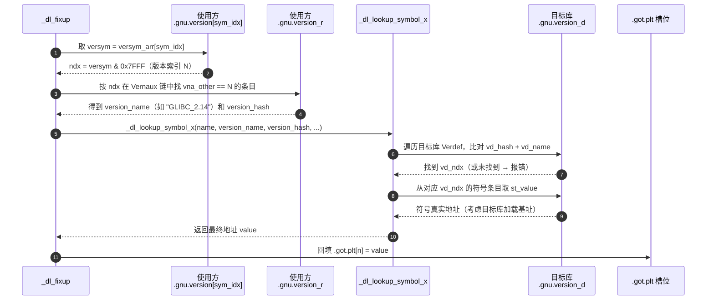

# 动态链接与加载器（13）· 符号版本与二进制兼容

> [!abstract] TL;DR
> - **核心问题**：共享库升级后，老程序应当继续运行（向后兼容），但库中某些接口的语义或行为可能已改变——符号版本机制正是解决这个矛盾的 ELF 级方案。
> - **三节协作**：`.gnu.version` 给每个动态符号打版本索引，`.gnu.version_r` 记录"我需要哪个库的哪个版本"（需求方），`.gnu.version_d` 记录"我提供哪些版本"（提供方）；动态链接器据此在运行时精确匹配。
> - **典型案例**：同一个 `libc.so.6` 文件里同时存在 `memcpy@GLIBC_2.2.5`（旧兼容实现）和 `memcpy@@GLIBC_2.14`（新默认实现），老程序绑定旧版、新程序绑定新版，两者共存零冲突。
> - **SONAME 是 ABI 边界**：主版本号变化（`libfoo.so.1` → `libfoo.so.2`）表示 ABI 不兼容，加载器按 `DT_SONAME` 区分，符号版本无法挽救跨主版本号的破坏。
> - **Windows 无 ELF 式符号版本**，靠 WinSxS 并行程序集 / DLL 版本资源 / `manifest` 绑定，历史上"DLL Hell"正是缺乏细粒度版本约束的代价。

动态链接带来了代码复用，也带来了"接口演化"的难题：库要迭代，旧程序却不能重新编译。本篇系统讲解 ELF 符号版本控制的数据结构、解析流程、SONAME 命名约定，以及三平台的兼容策略差异。与 ELF 三节的静态描述（[[11.ELF文件详解/38.gnu.version节.md]]、[[11.ELF文件详解/39.gnu.version_r节.md]]、[[11.ELF文件详解/40.gnu.version_d节.md]]）互补——那三篇讲"文件里的数据结构"，本篇讲"运行时动态链接器如何驱动这三节完成精确绑定、如何与 SONAME 配合构成完整的二进制兼容体系"。

---

## 概述与定位

### 为什么需要符号版本

动态链接的根本诉求是：**库可以原地升级，依赖它的程序无需重新编译**。但这个诉求隐含了一个假设——接口语义不变。一旦语义变了（例如 `memcpy` 在 glibc 2.14 改变了对重叠内存的行为保证，`realpath` 在 glibc 2.3 增加了动态分配语义），旧程序若盲目绑定新版本符号就会出错。

最朴素的解法是"改 SONAME（主版本号）"，但这要求所有下游同时重新链接，代价极高。符号版本控制提供了更细粒度的方案：**在同一个 `.so` 文件里同时保留新旧两份实现，旧程序绑定旧版本、新程序绑定新版本，共用一个加载实例，零运行时开销**。

这正是 glibc 自 2.1 开始大量使用的技术：同一个 `libc.so.6` 可以同时回答"我有 `GLIBC_2.2.5` 时代的 `memcpy`，也有 `GLIBC_2.14` 时代的 `memcpy`"，动态链接器根据每个可执行文件编译时的版本需求精确路由。

### 本篇在系列中的位置

| 维度 | 本篇聚焦 | 相邻篇章 |
|---|---|---|
| 符号解析阶段 | 版本约束如何介入符号查找 | 基础符号查找见 [[06.符号解析与符号查找]] |
| 运行期绑定 | 符号版本如何绑定到具体 `.got.plt` 槽位 | PLT/GOT 机制见 [[08.PLT与GOT与延迟绑定]] |
| TLS 扩展 | 版本化的线程局部存储接口（如 `__tls_get_addr`） | 见 [[12.TLS的实现]] |
| 安全面 | 伪造版本结构绕过版本检查 | 加固体系见 [[14.加载器劫持]] |
| ELF 节静态结构 | 三节字段级细节 | 见 [[11.ELF文件详解/38.gnu.version节.md]]、[[11.ELF文件详解/39.gnu.version_r节.md]]、[[11.ELF文件详解/40.gnu.version_d节.md]] |

---

## 原理与机制

### 符号版本控制的整体架构

ELF 符号版本控制由三节协作完成，加上 `.dynsym` 和 `.dynstr` 作为基础：

```mermaid
graph TD
    subgraph 使用者一侧（可执行文件/调用方.so）
        VR[".gnu.version_r\nVerneed 链表\n「我需要 libc.so.6 的 GLIBC_2.14」"]
        GV[".gnu.version\nElf_Versym 数组\n每个动态符号 → 版本索引 N"]
        DS[".dynsym\n动态符号表"]
    end

    subgraph 提供者一侧（libc.so.6）
        VD[".gnu.version_d\nVerdef 链表\n「我提供 GLIBC_2.2.5、GLIBC_2.14…」"]
        DS2[".dynsym\nmemcpy@GLIBC_2.2.5\nmemcpy@@GLIBC_2.14"]
    end

    RTLD["动态链接器 ld.so\n_dl_fixup 中执行版本匹配"]

    GV -->|版本索引 N| VR
    VR -->|vna_other = N| GV
    DS -->|sym_idx| GV
    RTLD -->|查找 memcpy| DS2
    RTLD -->|校验版本| VD
    VR -->|告诉 ld.so: 需要 GLIBC_2.14| RTLD
    VD -->|告诉 ld.so: 我有 GLIBC_2.14 (vd_ndx=8)| RTLD
```

> 图解：动态链接器在 `_dl_fixup` 解析符号时，不止查名字（`memcpy`），还查版本（`GLIBC_2.14`）。版本信息通过 `.gnu.version[sym_idx]` 得到版本索引 N，再到使用者的 `.gnu.version_r` 里找对应 `Vernaux.vna_name`（字符串 `GLIBC_2.14`），然后去 `libc.so.6` 的 `.gnu.version_d` 中比对 `Verdef.vd_ndx`，最终确认绑定到哪个实现。

### 版本索引的完整语义

`.gnu.version` 中每个 `Elf_Versym`（16 位）的值决定如何路由：

| 值 | 含义 | 动态链接器行为 |
|---|---|---|
| `0x0000`（`VER_NDX_LOCAL`） | 本地符号，对外不可见 | 不做版本匹配 |
| `0x0001`（`VER_NDX_GLOBAL`） | 全局符号，无显式版本 | 按名字匹配，接受任意版本 |
| `0x0002` – `0x7FFF` | 版本索引 N，到 `.gnu.version_r`/`.gnu.version_d` 中找 `N` | 精确版本匹配 |
| `0x8000 \| N` | HIDDEN 标志：非默认版本（`foo@VER`，旧/兼容版） | N 用于匹配，但链接器不会把新程序默认绑定到此版本 |

**关键区别：`@@` 与 `@`**

```
foo@@GLIBC_2.14   ← 默认版本（bit 15 = 0）：
                    新编译的程序若引用 foo，链接器自动绑定到此版本
                    一个符号只能有一个 @@ 版本

foo@GLIBC_2.2.5   ← 非默认版本（bit 15 = 1，HIDDEN）：
                    老程序的 .gnu.version_r 明确记录了 GLIBC_2.2.5 需求，
                    动态链接器会把它精确路由到此实现；
                    新程序链接时不会被默认选中
```

同一符号名 `foo` 在 `.dynsym` 里可同时存在多条记录，版本索引不同，地址（`st_value`）不同——这就是"同一 `.so` 多版本共存"的底层机制。

### `memcpy@GLIBC_2.14` 事件：真实案例剖析

这是符号版本发挥作用最著名的案例，值得深入展开。

**背景**：glibc 2.14 对 `memcpy` 的实现做了重要优化——原来 glibc 的 `memcpy` 在 x86 上实际用的是向后（backward）拷贝，对有一定偏移的重叠区间是安全的。glibc 2.14 引入了 SSE 优化版，改为向前（forward）拷贝，对重叠内存区间的行为发生了本质变化。这不是 ABI 破坏（因为 C 标准规定 `memcpy` 不得用于重叠区域），但大量历史代码错误地依赖了旧行为。

**glibc 的解决方案**：

```c
// glibc 内部 sysdeps/x86_64/memcpy.S（简化示意）

// 绑定到旧版本（兼容性符号，@GLIBC_2.2.5）
__asm__(".symver __memcpy_sse2, memcpy@GLIBC_2.2.5");
// __memcpy_sse2 是向后兼容的实现

// 绑定到新版本（默认符号，@@GLIBC_2.14）
__asm__(".symver __memcpy_sse2_unaligned, memcpy@@GLIBC_2.14");
// __memcpy_sse2_unaligned 是新的 SSE 优化实现
```

**结果**：编译于 glibc 2.14 之前环境的程序，其 `.gnu.version_r` 中记录的是 `memcpy` 需要 `GLIBC_2.2.5`；编译于 glibc 2.14 之后的程序记录的是 `GLIBC_2.14`。两者在同一台运行新 glibc 的机器上都能正确运行，且绑定到各自期望的实现，不会相互干扰。

**`.gnu.version_r` 里的证据**（程序在 glibc 2.14 之前编译时）：

```text
# 示例输出（代表性，非本机实跑）
$ readelf -V old_program
Version needs section '.gnu.version_r' contains 1 entry:
  000000: Version: 1  File: libc.so.6  Count: 3
    Name: GLIBC_2.2.5  Flags: none  Version: 3
    Name: GLIBC_2.3    Flags: none  Version: 4
    Name: GLIBC_2.3.2  Flags: none  Version: 5
```

> [!warning] 示例输出为示意
> 上述输出为代表性示意，非本机实跑。具体版本集合随程序实际依赖而变。

没有 `GLIBC_2.14`——因为这个老程序编译时根本不知道 glibc 2.14 的存在；它只记录了实际用到的符号对应的版本。运行时 ld.so 按 `.gnu.version_r` 中的版本名精确路由，把 `memcpy` 绑定到 `memcpy@GLIBC_2.2.5` 的旧实现。

### `.symver` 汇编指令：把实现绑定到版本

库开发者用 `.symver` 汇编指令（GNU as 扩展）在源码级声明"哪个函数实现对应哪个版本符号"：

```c
/* mylib.c — 同一库中提供两个版本的 realpath */

/* 旧版本：MYLIB_1.0，非默认（@） */
__asm__(".symver realpath_v1, realpath@MYLIB_1.0");
char *realpath_v1(const char *path, char *resolved) {
    /* 旧实现：resolved 必须由调用方分配，NULL 则返回 NULL */
    if (!resolved) return NULL;
    /* ... 旧逻辑 ... */
    return resolved;
}

/* 新版本：MYLIB_2.0，默认（@@） */
__asm__(".symver realpath_v2, realpath@@MYLIB_2.0");
char *realpath_v2(const char *path, char *resolved) {
    /* 新实现：resolved 为 NULL 时动态分配，调用方负责 free */
    if (!resolved) resolved = malloc(PATH_MAX);
    /* ... 新逻辑 ... */
    return resolved;
}
```

配套的版本脚本（version script）：

```ld
/* mylib.map */
MYLIB_2.0 {
    global:
        realpath;   /* 导出为 MYLIB_2.0 默认版本 */
    local:
        *;           /* 其余实现符号设为 local，不泄漏 */
};

MYLIB_1.0 {
    global:
        realpath;   /* 保留旧版本兼容性 */
};
```

编译命令：

```bash
gcc -shared -fPIC -Wl,--version-script=mylib.map -o libmylib.so.2 mylib.c
```

最终 `libmylib.so.2` 的 `.dynsym` 里同时存在：
- `realpath@MYLIB_1.0`（`Elf_Versym = 0x8003`，HIDDEN，旧实现入口）
- `realpath@@MYLIB_2.0`（`Elf_Versym = 0x0002`，默认，新实现入口）

### 版本解析的完整流程

动态链接器在符号解析（`_dl_fixup` 调用 `_dl_lookup_symbol_x`）时，版本约束如何介入：



> 图解：版本索引 N 是整条链的钥匙——`.gnu.version[sym_idx]` 给出 N，`.gnu.version_r` 里 `vna_other == N` 的条目给出版本名字符串，最后在目标库的 `.gnu.version_d` 里找到匹配的 `Verdef`，确认绑定目标。如果目标库没有所需版本（且不是 `VER_FLG_WEAK`），ld.so 报 `version 'GLIBC_2.14' not found` 并终止加载。

---

## 三平台对照

| 维度 | Linux（ELF / ld.so） | macOS（Mach-O / dyld） | Windows（PE / Loader） |
|---|---|---|---|
| 符号版本机制 | `.gnu.version` + `.gnu.version_r` + `.gnu.version_d`；精确到符号粒度 | **无 ELF 式符号版本**；靠 `@rpath` + 库版本号（`LC_ID_DYLIB` 的 `current_version`/`compatibility_version`）；版本粒度为整个库 | **无符号级版本**；靠 DLL 版本资源（`VERSIONINFO`，`FileVersion`/`ProductVersion`）+ SxS 并行程序集 |
| ABI 边界标识 | `DT_SONAME`（如 `libc.so.6`）；主版本号变化 = ABI 不兼容 | `LC_ID_DYLIB` 的 `compatibility_version`；加载时校验 | DLL 文件名（如 `msvcp140.dll` vs `msvcp140_1.dll`）；无统一规范，靠命名约定 |
| 向后兼容方案 | 同文件多版本符号（`@@`/`@`）；旧程序绑定旧版本实现 | 旧接口保留（deprecate 而不删除）；极少见符号别名 | 保留旧 DLL（如 `msvcp140.dll`）；新版本用新文件名（如 `msvcp140_1.dll`） |
| 版本验证时机 | 加载时（`_dl_load_object`）严格验证 `.gnu.version_r`；不匹配则 fatal | 加载时校验 `compatibility_version`；不匹配则拒绝加载 | 加载时不做符号级版本校验；链接时校验 import library 中的导入声明 |
| 历史事故 | memcpy 行为变更（glibc 2.14）/ realpath 语义变更（glibc 2.3）：均靠符号版本消解 | `dyld: Library not loaded` + `Reason: image not found` | **DLL Hell**（见下文） |
| 工具观察 | `readelf -V` / `objdump -T` / `nm -D` | `otool -L`（库版本）/ `dyld_info -rebase_info` | `dumpbin /IMPORTS` / `dumpbin /VERSION` |

### macOS：库级版本 vs 符号级版本

macOS Mach-O 没有 ELF 式的符号版本控制，依赖两个版本号字段：

- `current_version`（`LC_ID_DYLIB`）：库的当前实现版本，用于诊断
- `compatibility_version`：ABI 兼容性版本；链接时记录到使用方的 `LC_LOAD_DYLIB` 里，加载时 dyld 确认系统库的 `compatibility_version >= 链接时记录值`，否则拒绝加载

```bash
# 查看库声明的版本（示意）
otool -L /usr/lib/libSystem.B.dylib
```

```text
# 示例输出（代表性，非本机实跑）
/usr/lib/libSystem.B.dylib:
        /usr/lib/libSystem.B.dylib
          (compatibility version 1.0.0, current version 1319.0.0)
```

> [!warning] 示例输出为示意
> otool 输出随 macOS 版本而变，上述为代表性示意。

macOS 的版本控制粒度是"整个库"，无法像 glibc 那样在同文件里同时提供 `memcpy` 的两个不同实现。Apple 的策略是**永不删除已发布的公开 API**，并通过 SDK 中的 `__API_DEPRECATED` / `__API_AVAILABLE` 宏在编译期给出警告。

### Windows：DLL Hell 与 WinSxS

**DLL Hell 的根源**：早期 Windows（Win9x/NT 时代）没有 DLL 版本管理机制——不同程序会把自己捆绑的 DLL 版本覆盖 `System32` 里的同名 DLL，导致某个程序升级后其他程序崩溃。症状包括：

- 程序 A 安装时把 `comctl32.dll 5.0` 覆盖成 `6.0`；
- 程序 B 依赖 `5.0` 的 ABI 行为，立即崩溃；
- 卸载程序 A 不一定恢复原来的 DLL；

**WinSxS（Windows Side-by-Side）**：Vista 起 Windows 引入"并行程序集"机制——每个版本的 DLL 独立存储在 `C:\Windows\WinSxS\` 下的隔离目录中，应用程序通过 **application manifest**（XML，嵌入资源或 `.manifest` 文件）声明需要哪个版本的程序集：

```xml
<!-- app.exe.manifest（声明依赖的 VC++ 运行库版本） -->
<assembly xmlns="urn:schemas-microsoft-com:asm.v1" manifestVersion="1.0">
  <dependency>
    <dependentAssembly>
      <assemblyIdentity
        type="win32"
        name="Microsoft.VC90.CRT"
        version="9.0.21022.8"
        processorArchitecture="amd64"
        publicKeyToken="1fc8b3b9a1e18e3b"/>
    </dependentAssembly>
  </dependency>
</assembly>
```

Windows Loader 解析 manifest，从 WinSxS 中找到对应版本的程序集并加载，不同程序可以同时使用不同版本的同名 DLL 而互不干扰。

**DLL 版本资源**：`VERSIONINFO` 资源块（`FileVersion`、`ProductVersion`、`FileDescription` 等）是 DLL 的元数据，可用 `dumpbin /VERSION` 或资源管理器查看，但加载器本身**不校验这些字段**——它们是给人看的，而非运行时约束。

**与 ELF 的本质差异**：Windows 没有"同一 DLL 文件内多版本符号"的概念；要兼容旧接口，只能保留旧 DLL 文件（如 Microsoft 同时发布 `msvcp140.dll` 和 `msvcp140_1.dll`），或在函数内部做版本分支。这使得每次 MSVC 版本升级都需要重新分发新的运行库。

---

## 数据结构 / 流程详解

### SONAME、real name、linker name：三级命名

Linux 共享库文件名有三个层级，理解它们是理解"主版本号变更 = ABI 不兼容"的基础：

```
real name      libfoo.so.2.3.1      ← 实际磁盘文件，含完整版本号
SONAME         libfoo.so.2          ← 嵌入 DT_SONAME，ld.so 加载时按此名查找
linker name    libfoo.so            ← 符号链接，供编译期 -lfoo 使用
```

三级关系示例：

```bash
# /usr/lib 下的典型布局（示意）
libfoo.so.2.3.1    # real name，实际二进制
libfoo.so.2 → libfoo.so.2.3.1   # SONAME 符号链接，ld.so 按此加载
libfoo.so   → libfoo.so.2        # linker name，编译期 -lfoo 找到此链接
```

**`DT_SONAME` 的作用**：共享库在 ELF `.dynamic` 节中通过 `DT_SONAME` 标签嵌入自己的 SONAME（如 `libc.so.6`）。链接可执行文件时，链接器把所有依赖库的 SONAME 记录到可执行文件的 `DT_NEEDED` 列表里（不是 real name，也不是链接命令里的路径）。ld.so 加载时按 `DT_NEEDED` 里的 SONAME 查找。

```text
# 示例：readelf -d /bin/ls | grep NEEDED（示意）
 0x0000000000000001 (NEEDED)  Shared library: [libselinux.so.1]
 0x0000000000000001 (NEEDED)  Shared library: [libcap.so.2]
 0x0000000000000001 (NEEDED)  Shared library: [libc.so.6]
```

> [!warning] 示例输出为示意
> 具体依赖库随系统版本和编译配置而变，上述为代表性示意。

**主版本号变更意味着 ABI 不兼容**：当库的 ABI 发生不可兼容的变化时，惯例是把 SONAME 的主版本号加一（`libfoo.so.2` → `libfoo.so.3`）。此时 `DT_NEEDED` 里的字符串变了，ld.so 找的是不同的文件，旧程序和新程序**可以同时安装**（因为 SONAME 不同），但旧程序不会意外加载新版本——符号版本机制完全无法跨越 SONAME 边界。符号版本只能在**同一 SONAME 范围内**做精细兼容，SONAME 是更粗粒度的 ABI 边界。

### 三节的内存视图（运行时）

加载时 ld.so 通过 `.dynamic` 的四个动态标签定位三节：

| 动态标签 | 类型值 | 指向 |
|---|---|---|
| `DT_VERSYM` | `0x6FFFFFF0` | `.gnu.version` 运行时地址（`Elf_Versym[]`） |
| `DT_VERNEED` | `0x6FFFFFFE` | `.gnu.version_r` 运行时地址（Verneed 链表头） |
| `DT_VERNEEDNUM` | `0x6FFFFFFF` | Verneed 条目数（库的数量） |
| `DT_VERDEF` | `0x6FFFFFFC` | `.gnu.version_d` 运行时地址（Verdef 链表头） |
| `DT_VERDEFNUM` | `0x6FFFFFFD` | Verdef 条目数（版本定义数量） |

ld.so 加载一个模块时，先遍历其 `.gnu.version_r`，逐个检查依赖库是否提供了所需版本（`_dl_check_map_versions`）；检查通过后，每次符号解析时再用 `DT_VERSYM` 取当前符号的版本索引，精确路由到目标实现。

### 版本不匹配的错误路径

```text
# 典型错误（在旧 glibc 上跑编译于新 glibc 的程序）
./a.out: /lib/x86_64-linux-gnu/libc.so.6: version `GLIBC_2.34' not found
  (required by ./a.out)
```

这条错误的产生链：

1. `a.out` 的 `.gnu.version_r` 中有 `GLIBC_2.34` 的 Vernaux 条目；
2. 系统 `libc.so.6` 的 `.gnu.version_d` 中最高只有 `GLIBC_2.17`；
3. 动态链接器在 `_dl_check_map_versions` 里遍历完所有 Verdef 后未找到匹配；
4. 因为 `VER_FLG_WEAK` 未置位，报致命错误并退出。

解决方案不是"删掉版本节"（会导致运行到不兼容实现），而是：

- 在更旧的发行版上重新编译（sysroot 隔离）；
- 使用 `__asm__(".symver")` 主动降低版本绑定（见实操节）；
- 使用 musl libc 等无版本控制的 libc 替代（但会失去 glibc 扩展）。

---

## ABI 破坏点清单

维护二进制兼容性需要明确哪些改动会破坏 ABI。以下是常见破坏点：

### 结构体相关

| 破坏点 | 原因 | 示例 |
|---|---|---|
| 增加/删除/移动结构体成员 | 改变成员偏移，调用方按旧偏移访问错位 | 在 `struct stat` 中插入新字段 |
| 改变成员类型（扩大/缩小） | 改变结构体大小和对齐 | `int` → `long long` |
| 改变 `#pragma pack` 或对齐属性 | 改变成员实际偏移 | 去掉 `__attribute__((packed))` |
| 改变结构体的继承或虚基类 | C++ 对象布局变化 | 给 `class Foo` 加虚基类 |

### 函数签名相关

| 破坏点 | 原因 | 示例 |
|---|---|---|
| 改变参数类型（包括隐式转换） | 调用约定 / 寄存器分配变化 | `int` → `long` 在 ILP32 vs LP64 下不同 |
| 改变返回类型 | 返回寄存器 / 内存语义变化 | `int` → `long long` |
| 改变函数调用约定 | 压栈/清栈方式不同 | cdecl → stdcall（Windows） |
| 增加/删除默认参数（C++） | 默认参数由调用方填充，ABI 实际传递参数数变化 | `void f(int x, int y=0)` → 改默认值 |
| 改变异常规格说明（C++） | 影响 unwind table | `throw()` → `noexcept` |

### C++ 特有

| 破坏点 | 原因 |
|---|---|
| 增加/删除/重排虚函数 | vtable 偏移变化；调用方按旧偏移索引到错误函数 |
| 改变虚函数为非虚（或反之） | vtable 有无该项变化 |
| 改变基类列表（加/删/换序） | 基类子对象偏移变化 |
| 改变模板特化的内联展开 | ODR 语义变化（One Definition Rule） |
| 改变枚举的底层类型或值 | `enum class Foo : uint8_t` → `uint16_t` 改变大小 |
| 增加新的静态数据成员（非 `constexpr`） | 符号导出列表变化（可能 OK 如果不删现有符号） |

> [!note] "只加不删"是安全的最低下限
> 对于 C 接口库，新增函数（不改旧函数签名）通常是安全的——旧程序不知道新函数存在，但也不会崩溃。符号版本机制的价值在于：即使**接口语义变化**（如 `realpath` 的内存分配行为），也能靠多版本符号同时服务新旧程序，而不必改 SONAME。

---

## 代码与汇编

### 用 `.symver` 降低版本绑定（实用技巧）

当在新系统编译、但需要在旧系统（如 glibc 2.17）运行时，可以用 `.symver` 强制绑定到旧版本符号：

```c
/* compat.c — 在编译期强制绑定到旧版 glibc 符号 */

/* 强制 memcpy 绑定到 GLIBC_2.2.5（而非新系统默认的 GLIBC_2.14）*/
__asm__(".symver memcpy, memcpy@GLIBC_2.2.5");

/* 强制 realpath 绑定到 GLIBC_2.2.5 */
__asm__(".symver realpath, realpath@GLIBC_2.2.5");
```

> [!note] `.symver` 的语法说明
> `.symver <实现函数名>, <公开符号名>@[<版本>]` — 单 `@` 表示绑定到非默认（旧）版本；
> `.symver <实现函数名>, <公开符号名>@@<版本>` — 双 `@@` 表示声明为默认版本（仅用于库开发者定义新版本）。
> 对使用方降版本场景，只需单 `@`。

**效果验证**：编译后，该目标文件引入的 `memcpy` 在 `.gnu.version` 中的对应版本索引会指向 `GLIBC_2.2.5` 而非 `GLIBC_2.14`，最终可执行文件的 `.gnu.version_r` 也只会记录 `GLIBC_2.2.5` 需求。

### IFUNC 与符号版本的交叉

`STT_GNU_IFUNC`（间接函数）是另一种运行时选择实现的机制——通过 resolver 函数在首次解析时按 CPU 特性选择实现，常与符号版本结合用于 glibc 的 CPU 优化分发：

```c
/* glibc 内部（简化示意） */

/* resolver：根据 CPU 特性选择 memcpy 实现 */
static memcpy_func_t memcpy_ifunc_resolver(void) {
    if (cpu_has_avx512())
        return __memcpy_avx512;
    if (cpu_has_sse2())
        return __memcpy_sse2;
    return __memcpy_generic;
}

/* 声明为 IFUNC，且绑定到 GLIBC_2.14 */
__attribute__((ifunc("memcpy_ifunc_resolver")))
void *memcpy(void *dst, const void *src, size_t n);
__asm__(".symver memcpy, memcpy@@GLIBC_2.14");
```

IFUNC 的解析发生在 `_dl_fixup` 内——解析到的地址不是 `st_value` 本身，而是调用 resolver 后的返回值。与符号版本机制正交：版本机制决定选哪个版本入口，IFUNC 决定那个入口返回哪个具体实现。两者结合，使 glibc 能对同一函数同时提供多版本兼容和多实现优化。

---

## 实操：用工具观察

> [!warning] 示例输出为示意
> 本节所有命令输出均为**代表性示意**，非本机实跑；具体符号数量、地址、版本集合随工具链版本、glibc 版本和目标二进制而变，**切勿据此断言任何真实运行期地址**。读者应在自己的 Linux 环境中复现，以本机实际输出为准。

### 1. `readelf -V`：一次看完三节

```bash
readelf -V a.out
```

```text
Version symbols section '.gnu.version' contains 8 entries:
 Addr: 0x400286  Offset: 000286  Link: 5 (.dynsym)
  000:   0 (*local*)    2 (GLIBC_2.5)   3 (GLIBC_2.2.5)   1 (*global*)
  004:   2 (GLIBC_2.5)   3 (GLIBC_2.2.5)   2 (GLIBC_2.5)   0 (*local*)

Version needs section '.gnu.version_r' contains 1 entry:
 Addr: 0x4002a0  Offset: 0002a0  Link: 6 (.dynstr)
  000000: Version: 1  File: libc.so.6  Count: 2
  0x0010:   Name: GLIBC_2.5    Flags: none  Version: 2
  0x0020:   Name: GLIBC_2.2.5  Flags: none  Version: 3
```

> [!warning] 示例输出为示意

读法：
- `.gnu.version` 的第 2 个条目（`dynsym[1]`）值为 `2`，意味着该符号需要版本索引 2；
- `.gnu.version_r` 里版本索引 2 对应 `GLIBC_2.5`；
- 因此 `dynsym[1]` 这个符号在运行时会绑定到 `libc.so.6` 里版本为 `GLIBC_2.5` 的实现。

### 2. `objdump -T`：动态符号表含版本字符串

```bash
objdump -T a.out
```

```text
a.out:     file format elf64-x86-64

DYNAMIC SYMBOL TABLE:
0000000000000000      DF *UND*  0000000000000000 (GLIBC_2.2.5) puts
0000000000000000      DF *UND*  0000000000000000 (GLIBC_2.5)   __stack_chk_fail
0000000000000000 w   D  *UND*  0000000000000000 (GLIBC_2.2.5) __gmon_start__
```

> [!warning] 示例输出为示意

括号内即版本名称字符串，来自 `.gnu.version_r` 中对应 `Vernaux.vna_name`。`w` 标志表示弱符号，`DF` 表示函数（`STT_FUNC`）且非本地。

**查看库侧的多版本导出**（`@@` 与 `@` 的区分）：

```bash
objdump -T /lib/x86_64-linux-gnu/libc.so.6 | grep memcpy
```

```text
# 示例输出（代表性，非本机实跑）
0000000000179dc0  w   DF .text  0000000000000009  GLIBC_2.2.5  memcpy
0000000000179dc0 g    DF .text  0000000000000061  GLIBC_2.14   memcpy
```

> [!warning] 示例输出为示意

第一行 `w`（弱符号绑定）+ `GLIBC_2.2.5` 是非默认旧版本；第二行 `g`（全局默认）+ `GLIBC_2.14` 是新默认版本。两行符号名相同但版本不同，地址（`st_value`）也不同——这就是"同文件双实现"的二进制证据。

### 3. `nm -D`：查看未解析符号的版本需求

```bash
nm -D a.out | grep @@
```

> [!warning] 示例输出为示意
> `nm -D` 默认不显示版本字符串；用 `nm --with-symbol-versions -D a.out` 或直接用 `objdump -T` 查看带版本的符号更可靠。`nm -D` 适合快速确认符号存在性，不是版本分析的首选工具。

### 4. `readelf -d`：确认版本相关动态标签

```bash
readelf -d a.out | grep -E 'VERSYM|VERNEED|VERDEF'
```

```text
 0x000000006ffffff0 (VERSYM)     0x4006b8
 0x000000006ffffffe (VERNEED)    0x4006e8
 0x000000006fffffff (VERNEEDNUM) 0x1
```

> [!warning] 示例输出为示意

没有 `VERDEF`/`VERDEFNUM` 说明这是可执行文件（不导出版本化符号），只有 `VERNEED`（消费方）。共享库则两组标签都会出现。

### 5. `LD_DEBUG` 观察版本检查时机

```bash
LD_DEBUG=versions ./a.out 2>&1 | head -20
```

```text
# 示例输出（代表性，非本机实跑）
     12345: checking for version `GLIBC_2.5' in file /lib/x86_64-linux-gnu/libc.so.6
     12345:   checking for version `GLIBC_2.2.5' in file /lib/x86_64-linux-gnu/libc.so.6
     12345: checking for version `GLIBC_2.5' in file /lib/x86_64-linux-gnu/libc.so.6
```

> [!warning] 示例输出为示意

`LD_DEBUG=versions` 会在加载期打印每次版本校验操作，可以观察哪些库需要哪些版本以及校验顺序。

### 工具速查表

| 目的 | 命令 | 看什么 |
|---|---|---|
| 查三节全貌 | `readelf -V <file>` | 版本索引 + 需求 + 定义 |
| 查动态符号含版本 | `objdump -T <file>` | 每个动态符号的版本字符串 |
| 查版本动态标签 | `readelf -d <file>` | `VERSYM`/`VERNEED`/`VERDEF` |
| 查 SONAME | `readelf -d <lib.so> \| grep SONAME` | `DT_SONAME` 值 |
| 查版本校验过程 | `LD_DEBUG=versions ./prog` | 加载期版本检查日志 |
| 排查版本不匹配 | `readelf -V <prog>` + `readelf -V <lib.so>` | 对比需求与定义的版本集合 |

---

## 攻防 / 陷阱

### 伪造版本结构：`ret2dl-resolve` 的版本绕过

`_dl_runtime_resolve` 在解析符号时会做版本检查（`_dl_lookup_symbol_x` 内调 `_dl_check_map_versions`）。高级 `ret2dl-resolve` 攻击构造伪 `Elf64_Rela` 时，可以把 `r_info` 的符号索引指向 `sym_idx = 0`（哑符号），此时对应的 `.gnu.version[0]` 为 `VER_NDX_LOCAL`（值 0），版本检查路径会直接跳过——动态链接器对 LOCAL 符号不做版本匹配，直接按名字查找 `dynstr` 里的字符串。

这使得攻击者无需伪造版本结构就能绕过版本验证，只要伪造的符号名（如 `"system"`）在全局符号搜索链上可见即可。现代 glibc 的缓解措施（如 `DL_SYMBOL_ADDRESS` 边界校验、`reloc_index` 范围检查）主要针对索引越界，对"合法索引但伪造内容"的防御依赖于 Full RELRO（使重定位节只读，伪造无处落地）。

### 版本脚本遗漏 `local: *;`

这是库开发中最常见的版本控制错误：版本脚本没有加 `local: *;` 兜底，导致所有内部实现符号（如 `foo_v1`/`foo_v2`）都以无版本全局符号导出，既泄漏了内部接口，也违反了"单一名字只有一个默认版本"的约定。

```ld
/* 错误示例：缺少 local: * */
MYLIB_2.0 {
    global: foo;
};
MYLIB_1.0 {
    global: foo;
};
/* foo_v1, foo_v2 都变成全局导出！ */

/* 正确示例 */
MYLIB_2.0 {
    global: foo;
    local: *;     /* 必须加：其余符号设为本地 */
};
MYLIB_1.0 {
    global: foo;
};
```

### 跨主版本号混用符号版本

如果有人同时安装了 `libfoo.so.1` 和 `libfoo.so.2`，并尝试用 `.symver` 让程序的某些符号绑到 v1 版本、另一些绑到 v2 版本——这不会报错，但会导致同一进程加载两份不同 SONAME 的库，各自维护独立的全局状态，可能引发微妙的双初始化 / 锁竞争问题。SONAME 是 ABI 隔离边界，不应跨越。

### `VER_FLG_WEAK` 的安全隐患

如果库版本需求被标记为 `VER_FLG_WEAK`，动态链接器找不到该版本时只发出警告、继续加载，调用方得到的是**未匹配版本的符号**（或第一个同名符号）。在安全敏感场景下，弱版本需求等于允许降级绑定到未知实现，若被攻击者预先注入同名库（`LD_PRELOAD` + 伪造版本），可以静默劫持弱版本需求。

---

## 小结

1. **三节协作，索引是纽带**：`.gnu.version` 的 16 位索引 N 是核心——需求方通过 `.gnu.version_r` 里 `vna_other == N` 的条目得到版本名字符串，提供方通过 `.gnu.version_d` 里 `vd_ndx == N` 的 Verdef 被匹配，动态链接器沿这条索引链精确路由，无需任何运行期字符串扫描开销。
2. **`@@` 是默认，`@` 是兼容**：`foo@@VER` 让新程序自动绑定；`foo@VER` 保留旧实现给老程序；HIDDEN bit（`0x8000`）编码在 `Elf_Versym` 里，链接器不会把新程序默认绑到 HIDDEN 符号——这是"同文件多版本不干扰"的机制保证。
3. **SONAME 是更粗的边界**：符号版本解决"同 SONAME 内语义演化"的兼容问题；主版本号变更（SONAME 改变）是"宣布 ABI 不兼容"，两者分层互补，不能用符号版本替代 SONAME 版本控制。
4. **三平台差异显著**：Linux 精确到符号粒度（ELF 三节）；macOS 精确到库粒度（`compatibility_version`）但不能多版本共存于单文件；Windows 曾靠 DLL Hell 的血泪发展出 WinSxS 并行程序集，但始终没有符号级版本控制，ABI 兼容靠"永不删接口"和运行库多版本共存。
5. **ABI 破坏有清单**：结构体大小/布局变化、虚函数表变化、枚举底层类型变化、函数签名变化——任何一项都可能静默崩溃而非编译报错，符号版本机制是事后补救，不能替代仔细的 ABI 设计。
6. **实操核心工具**：`readelf -V` 看三节全貌、`objdump -T` 看带版本的符号导出、`readelf -d | grep SONAME` 确认 SONAME、`LD_DEBUG=versions` 观察版本校验过程——这四条命令可覆盖 90% 的版本兼容性排查场景。

---

## 相关阅读

- **ELF 版本索引数组（字段级细节）**：[[11.ELF文件详解/38.gnu.version节.md]]
- **ELF 版本需求（导入侧）**：[[11.ELF文件详解/39.gnu.version_r节.md]]
- **ELF 版本定义（导出侧）**：[[11.ELF文件详解/40.gnu.version_d节.md]]
- **符号版本如何介入符号查找流程**：[[06.符号解析与符号查找]]
- **PLT/GOT 延迟绑定与 `_dl_fixup`（版本匹配在此处发生）**：[[08.PLT与GOT与延迟绑定]]
- **TLS 接口版本化（`__tls_get_addr` 的多版本实现）**：[[12.TLS的实现]]
- **版本结构伪造与加载器安全**：[[14.加载器劫持]]
- **SONAME 与加载路径全图**：[[05.依赖解析与库搜索顺序]]

---

⬅️ 上一篇 [[12.TLS的实现]] ｜ 🏠 [[00.动态链接与加载器总览]] ｜ 下一篇 [[14.加载器劫持]] ➡️
