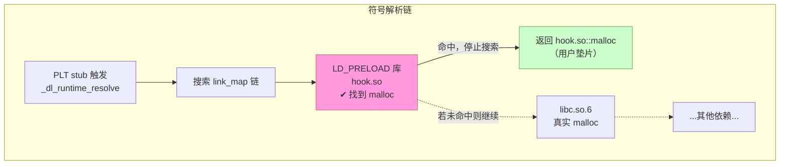
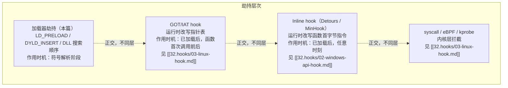

# 动态链接与加载器（14）· 加载器劫持

> [!abstract] TL;DR
> - **加载器劫持**是指在符号解析/库搜索阶段注入自定义代码，让动态链接器优先（或替代）加载攻击者/工具控制的共享库，从而包装或替换目标函数——而无需修改任何已有二进制文件或进程内存。
> - Linux 的 `LD_PRELOAD` 和 macOS 的 `DYLD_INSERT_LIBRARIES` 利用了"加载器按序搜索符号、先找到就用"的核心机制；Windows 则依托 DLL 搜索顺序（CWD 优先于 System32）实现侧加载。
> - 这一机制天然双面：性能 profiling、兼容垫片、沙箱、故障注入等合法场景与恶意持久化/信息拦截并存；现代平台通过 SIP、Hardened Runtime、setuid 忽略策略和完整性签名来收窄滥用面。
> - 本篇聚焦"**加载器/符号解析层面的劫持**"；IAT hook、GOT 改写等"运行时内存改写层面的劫持"是正交的不同技术层，详见 [[32.hooks/00.总览.md]] 及其子篇。

---

## 概述与定位

动态链接器在解析符号时，会按一套确定性的搜索顺序遍历各候选库——哪个库先被搜到、哪个库中的符号先被找到，就用哪个。**加载器劫持（Loader Hijacking）**的核心思想就是通过合法或非法手段，将自己的共享库插入这条搜索路径的最前面，使动态链接器在到达"真实库"之前就先命中"劫持库"，从而把目标进程对某个函数（乃至整个 API 集）的调用全部转发到劫持者控制的代码。

与 [[32.hooks/00.总览.md]] 讨论的 inline hook（改写目标函数机器码的首指令）或 IAT/GOT 改写（直接修改已加载进程的指针表）不同，加载器劫持工作在**更早的阶段**：它改变的是"**哪个库里的哪个符号被解析器选中**"，而非"已解析地址之后的跳转去向"。两者的区别如下表所示——理解这一区分对正确使用 [[32.hooks/03-linux-hook.md]]、[[32.hooks/02-windows-api-hook.md]] 以及本篇的技术至关重要。

| 维度 | 加载器劫持（本篇） | Inline / IAT / GOT hook |
|---|---|---|
| 作用时机 | 符号解析阶段（进程启动时或 `dlopen` 时） | 目标已加载后（运行时改写内存） |
| 需要修改已有二进制/内存 | 不需要 | 需要（改写指令字节或指针） |
| 典型媒介 | 环境变量、系统配置文件、目录布局 | `mprotect` + memcpy、VirtualProtect + WriteProcessMemory |
| 可被 Full RELRO 阻挡 | 否（作用在 RELRO 生效前） | GOT 改写被 Full RELRO 阻挡；Inline hook 不受 RELRO 影响 |
| 检测手段 | 审计 `LD_*`/`/proc/<pid>/maps`/签名 | 代码段完整性扫描、影子副本比对 |

---

## 原理与机制

### 符号搜索顺序是劫持的根基

Linux `ld.so` 在解析一个符号时，按以下顺序遍历**已加载的共享库列表**（`link_map` 链，见 [[08.PLT与GOT与延迟绑定]]）：

1. `LD_PRELOAD` 指定的库（按空格/冒号分隔的顺序）
2. `/etc/ld.so.preload` 中列出的库（逐行）
3. 可执行文件本身（`NEEDED` 之前）
4. `DT_NEEDED` 列出的直接依赖（如 `libc.so.6`）
5. 间接依赖（`DT_NEEDED` 的 `DT_NEEDED`，深度优先）
6. `LD_LIBRARY_PATH` 指定的额外搜索路径
7. `/etc/ld.so.conf` 及编译时 `-rpath` 指定的路径

**先找到即停**：一旦在某个库里找到了符号名匹配（且版本约束满足）的导出符号，查找立即终止，后面的库中即使有同名符号也不会被选中。`LD_PRELOAD` 库正是利用这一点排在最前面，让自己的 `malloc`、`open` 等把同名的 libc 版本"遮蔽"掉。

### 可视化：preload 库如何抢先



> 图中红色节点（`hook.so`）被插入 `link_map` 链头部，符号解析在此即告终止，libc 版本永远不被到达。蓝色虚线路径只在 hook.so 未定义该符号时才继续。当 hook.so 内部需要调用原版 `malloc` 时，应使用 `dlsym(RTLD_NEXT, "malloc")`——它让解析器从 hook.so **之后**的下一个库继续，精确找到 libc 版本。

---

## 三平台对照

| 维度 | Linux | macOS | Windows |
|---|---|---|---|
| **主要机制** | `LD_PRELOAD` 环境变量；`/etc/ld.so.preload` 全局配置 | `DYLD_INSERT_LIBRARIES`；`__interpose` section | DLL 搜索顺序劫持；`AppInit_DLLs` 注册表键；`SetWindowsHookEx` |
| **触发方式** | 启动进程前设置环境变量；或写全局配置文件 | 启动前设置环境变量；或修改二进制的 Mach-O `__DATA,__interpose` | 将劫持 DLL 放入应用程序目录（或 CWD）；或写注册表 |
| **搜索顺序** | LD_PRELOAD → 可执行自身 → DT_NEEDED → rpath/LD_LIBRARY_PATH | DYLD_INSERT_LIBRARIES → 二进制自身 → dylib 依赖 | 应用程序目录 → CWD → System32 → Path 变量 |
| **平台限制** | setuid/setgid 程序忽略 `LD_*`；SELinux 可策略禁止 | SIP 启用时系统 binary 完全忽略 `DYLD_*`；Hardened Runtime 同理 | 受保护目录（System32 等）的写入需提权；AppInit_DLLs 在 Win8+ 受签名限制 |
| **检测线索** | `LD_PRELOAD` 环境变量；`/proc/<pid>/maps` 的非预期路径 | `DYLD_INSERT_LIBRARIES` 变量；`vmmap` / `dyld_info` 查库列表 | `Process Monitor` 检测 DLL 加载路径；`sigcheck` 验证签名 |
| **典型合法用途** | tcmalloc/jemalloc 替换、AddressSanitizer、strace 垫片 | LSAN、动态库 interpose 测试 | Windows App Verifier、兼容性 shim |
| **典型滥用** | 凭证嗅探、沙箱逃逸准备 | 绕过 API 记录 | APT 侧加载攻击（DLL side-loading） |

---

## 详细机制：三平台分述

### Linux：`LD_PRELOAD` 与全局预加载

#### 环境变量级预加载

```bash
LD_PRELOAD=./hook.so ./app
```

`ld.so` 在 `execve` 后的自举阶段（`_dl_init` 之前）读取 `LD_PRELOAD`，将指定库添加到 `link_map` 链的最前端。库可以有多个，用空格或冒号分隔：

```bash
LD_PRELOAD="./libA.so ./libB.so" ./app   # libA 优先于 libB
```

#### `/etc/ld.so.preload`：全局级预加载

`/etc/ld.so.preload` 是一个文本文件，每行一个绝对路径，作用与 `LD_PRELOAD` 相同但**对所有进程全局生效**（包括 root 运行的进程），是 rootkit 实现持久化驻留的经典技术：

```
/usr/lib/libaudit_hook.so   # 合法：审计垫片
/tmp/evil.so                 # 若有此行，每个新进程都会预加载恶意库
```

> [!warning] 安全注意
> `/etc/ld.so.preload` 的修改通常需要 root 权限，但一旦被写入恶意路径，后果影响全系统所有动态链接程序（`setuid` 程序除外，见下文）。审计该文件是 Linux 应急响应的标准检查项之一。

#### `dlsym(RTLD_NEXT, ...)` 实现函数包装

仅仅"拦截"不够用——绝大多数合法垫片需要**先做自己的逻辑，再调真实函数**。`RTLD_NEXT` 是 glibc 扩展，它让 `dlsym` 从当前库之后的下一个库继续搜索，精确找到"被遮蔽的那个真实版本"：

```c
/* open_counter.c —— 统计 open(2) 调用次数的合法垫片示例 */
#define _GNU_SOURCE
#include <dlfcn.h>
#include <fcntl.h>
#include <stdarg.h>
#include <stdatomic.h>
#include <stdio.h>

typedef int (*open_fn_t)(const char *, int, ...);

static open_fn_t  real_open  = NULL;
static atomic_int open_count = 0;

/* 重入保护：防止垫片内部调用 fprintf 又触发 open */
static __thread int in_hook = 0;

static void init_once(void) {
    if (!real_open)
        real_open = (open_fn_t)dlsym(RTLD_NEXT, "open");
}

int open(const char *path, int flags, ...) {
    init_once();

    mode_t mode = 0;
    if (flags & O_CREAT) {
        va_list ap;
        va_start(ap, flags);
        mode = va_arg(ap, int);
        va_end(ap);
    }

    int fd = real_open(path, flags, mode);  /* 调真实 open */

    if (!in_hook) {
        in_hook = 1;
        int cnt = atomic_fetch_add(&open_count, 1) + 1;
        fprintf(stderr, "[open#%d] %s -> fd=%d\n", cnt, path, fd);
        in_hook = 0;
    }
    return fd;
}

/* 程序退出时打印统计 */
__attribute__((destructor))
static void report(void) {
    fprintf(stderr, "[open_counter] total open() calls: %d\n",
            atomic_load(&open_count));
}
```

编译与使用：

```bash
gcc -shared -fPIC -o open_counter.so open_counter.c -ldl
LD_PRELOAD=./open_counter.so ls /usr/bin
```

> [!warning] 示例输出为示意
> 以上命令在本机（Windows）无法直接运行，输出示意如下：
> ```
> [open#1] /etc/ld.so.cache -> fd=3
> [open#2] /lib/x86_64-linux-gnu/libc.so.6 -> fd=3
> [open#3] /usr/bin -> fd=3
> ...
> [open_counter] total open() calls: 12
> ```

#### 关键：setuid/setgid 程序对 `LD_*` 完全免疫

Linux `ld.so` 在自举时会检测进程的真实 UID/GID 与有效 UID/GID 是否相同：

```c
/* glibc elf/rtld.c（简化逻辑）*/
if (uid != euid || gid != egid)
    /* setuid/setgid 进程：清除所有 LD_* 环境变量 */
    _dl_secure = 1;
```

若 `_dl_secure == 1`，`LD_PRELOAD`、`LD_LIBRARY_PATH`、`LD_DEBUG` 等全部被忽略。这是 Linux 防止权限提升的核心保障：即使攻击者能设置环境变量，也无法对 setuid root 的 `sudo`、`passwd` 等程序实施 LD_PRELOAD 注入。（`AT_SECURE` 的完整机制与加固详见 [[15.加载器视角的安全]]）

> [!note] 这也是为什么沙箱逃逸场景里，攻击者一旦拿到任意写能力后，优先目标是非 setuid 的普通进程，而非直接注入特权程序。

---

### macOS：`DYLD_INSERT_LIBRARIES` 与 Interpose

#### 基本用法

```bash
DYLD_INSERT_LIBRARIES=./hook.dylib DYLD_FORCE_FLAT_NAMESPACE=1 ./app
```

`dyld` 的搜索顺序与 Linux `ld.so` 类似：`DYLD_INSERT_LIBRARIES` 指定的库被插入符号搜索链首部。`DYLD_FORCE_FLAT_NAMESPACE=1` 在某些场景下让所有库共享同一符号命名空间，使拦截更可靠（但现代二进制默认双层命名空间，是否需要此标志视情况而定）。

#### macOS Interpose：更精确的符号替换

macOS 提供了一种比 `DYLD_INSERT_LIBRARIES` 更精确的机制：在插入库里声明 `__DATA,__interpose` 段，直接声明"将符号 A 替换为符号 B"的映射：

```c
/* interpose_malloc.c —— macOS interpose 示例 */
#include <malloc/malloc.h>
#include <stdio.h>
#include <stdlib.h>

static void *my_malloc(size_t size) {
    void *p = malloc(size);   /* 这里 malloc 已被 interpose 替换，会死循环！
                                  正确做法见下文 */
    fprintf(stderr, "malloc(%zu) = %p\n", size, p);
    return p;
}

/* 正确写法：用 dyld 的 RTLD_NEXT 等价物获取原版 */
#include <dlfcn.h>
typedef void *(*malloc_fn_t)(size_t);

static void *my_malloc_safe(size_t size) {
    static malloc_fn_t real_malloc = NULL;
    if (!real_malloc)
        real_malloc = (malloc_fn_t)dlsym(RTLD_NEXT, "malloc");
    void *p = real_malloc(size);
    fprintf(stderr, "[interpose] malloc(%zu) = %p\n", size, p);
    return p;
}

/* __interpose section：声明替换关系 */
typedef struct { const void *replacement; const void *replacee; } interpose_t;

__attribute__((used))
static const interpose_t interpositions[]
    __attribute__((section("__DATA,__interpose"))) = {
    { (const void *)my_malloc_safe, (const void *)malloc },
};
```

`__interpose` 机制优势是精确（只替换指定符号、不影响其他），且不依赖 `DYLD_FORCE_FLAT_NAMESPACE`，在系统框架替换中更常用。

#### SIP、Hardened Runtime 与 platform binary 的限制

这是 macOS 加载器劫持与 Linux 最大的差别所在：

| 保护机制 | 覆盖范围 | 效果 |
|---|---|---|
| **SIP（System Integrity Protection）** | `/System`、`/usr`、`/bin`、`/sbin` 下的 **platform binary**（由 Apple 签名） | 完全忽略 `DYLD_INSERT_LIBRARIES`、`DYLD_LIBRARY_PATH` 等所有 `DYLD_*` 环境变量 |
| **Hardened Runtime** | 开启了 Hardened Runtime 权利的第三方应用 | 默认忽略 `DYLD_*`；需要显式添加 `com.apple.security.cs.allow-dyld-environment-variables` 权利才允许 |
| **platform binary 标记** | dyld 自身识别的系统二进制 | 即使 SIP 被禁用，platform binary 也会主动忽略 `DYLD_*` |

**为何系统二进制不受影响**：`dyld` 在加载每个二进制时会检查 `mach_header` 中的 `MH_DYLDLINK` 标志以及代码签名中是否携带 Apple 的 platform 证书。对于 platform binary，`dyld` 内部直接跳过环境变量处理逻辑，这一检查无法被用户态代码绕过（内核强制执行代码签名验证）。

> [!note] 实践含义
> 在启用了 SIP 的 macOS 上，对 `/bin/ls`、`/usr/bin/curl` 等系统命令使用 `DYLD_INSERT_LIBRARIES` 完全无效。这使得 macOS 上的加载器劫持只能针对第三方、未启用 Hardened Runtime 的应用程序。

---

### Windows：DLL 搜索顺序劫持与侧加载

#### DLL 搜索顺序

Windows 加载器（`ntdll.dll` 的 `LdrLoadDll`）在查找一个 DLL 时，按以下顺序搜索（假设未启用 `SafeDllSearchMode` 的特定例外）：

1. 进程的**应用程序目录**（EXE 所在目录）
2. 系统目录（`%SystemRoot%\System32`）
3. 16 位系统目录（`%SystemRoot%\System`）
4. Windows 目录（`%SystemRoot%`）
5. **当前工作目录（CWD）**（当 `SafeDllSearchMode=1` 时移至第 5 位；= 0 时在第 2 位）
6. `PATH` 环境变量中的各目录

**DLL 搜索顺序劫持（DLL Search Order Hijacking）**：当应用程序尝试加载一个只给出文件名（不含路径）的 DLL，而该 DLL 在应用程序目录不存在时，攻击者在 CWD 或 PATH 中靠前的目录放置同名 DLL，即可被优先加载。

#### DLL 侧加载（Side-Loading）

侧加载是搜索顺序劫持的特例，利用了**应用程序目录优先于 System32** 这一规则：

1. 目标应用（通常是合法的、有数字签名的软件）在启动时 `LoadLibrary("foo.dll")` 加载某个 DLL。
2. 攻击者将恶意 `foo.dll` 放置在**与合法 EXE 相同的目录**。
3. 加载器在应用程序目录命中，加载恶意 DLL，而 System32 里的真实 `foo.dll` 从未被到达。

侧加载的特点：**合法应用被利用为"运载工具"**，其可信签名使安全软件误以为进程可信，而恶意 DLL 在其保护伞下运行。这是 APT 组织最常用的持久化手法之一（大量案例见 MITRE ATT&CK T1574.002）。

```
典型攻击场景：
合法目录：C:\Program Files\VendorApp\
    VendorApp.exe   （有效数字签名）
    version.dll     ← 攻击者放置的恶意 DLL（系统原版在 System32\）

加载时序：
  VendorApp.exe 启动
  → LoadLibrary("version.dll")
  → 搜索：C:\Program Files\VendorApp\version.dll ← 命中，加载恶意版本
  → System32\version.dll 从未被尝试
```

#### `AppInit_DLLs`

`HKEY_LOCAL_MACHINE\SOFTWARE\Microsoft\Windows NT\CurrentVersion\Windows\AppInit_DLLs` 是一个注册表键，值中列出的 DLL 会在每个加载了 `user32.dll` 的进程中自动注入（通过 `user32.dll` 的 `DllMain`）。

历史上是合法的全局 hook 机制，现状：
- **Windows 8 及以后**：若启用了 Secure Boot，`AppInit_DLLs` 中的 DLL 必须经过**代码签名验证**，未签名 DLL 被忽略。
- 仍可被有签名能力的恶意软件利用，或在关闭 Secure Boot 的系统上无限制使用。
- 现代开发中建议用 `SetWindowsHookEx`（或更高层的机制）替代。

#### `SetWindowsHookEx` 注入概述

`SetWindowsHookEx` 是 Windows 提供的消息链注入机制，其全局钩子（`dwThreadId=0`）要求 hook 函数位于 DLL 内，OS 会将该 DLL **自动注入**到目标进程。这是操作系统主动执行的 DLL 注入，其本质是"OS 帮你完成加载器劫持"——详细原理与 14 种钩子类型见 [[32.hooks/02-windows-api-hook.md]]。

---

## 合法用途 vs 恶意滥用

| 场景 | 描述 | 典型工具 |
|---|---|---|
| **性能 profiling** | 替换 `malloc`/`free` 为带计数的版本，测量分配热点 | tcmalloc、jemalloc、gperftools |
| **内存错误检测** | 包装内存函数，在分配/释放前后插入 guard bytes | AddressSanitizer（`LD_PRELOAD=libasan.so`）、Valgrind |
| **兼容垫片** | 在旧系统上模拟新 API，或修复第三方库 bug | glibc `libSegFault.so`、各种 compatibility shim |
| **沙箱 / 隔离** | 拦截 `open`/`connect` 等系统调用包装，实现进程级访问控制 | Firejail（部分机制）、各类 seccomp 辅助垫片 |
| **故障注入 / 混沌测试** | 让 `malloc` 随机失败，测试程序的错误处理路径 | libfiu、自定义 LD_PRELOAD 垫片 |
| **凭证嗅探** | 拦截 `getpwnam`/`PAM` 调用，截获用户密码 | 恶意 rootkit |
| **持久化植入** | 写 `/etc/ld.so.preload` 或 Windows `AppInit_DLLs` 实现每进程加载 | APT 工具集 |
| **DLL 侧加载** | 将恶意 DLL 放置在合法应用旁，随合法进程加载 | APT（如 ShadowPad、各类 Loader） |
| **反沙箱** | 检测到 `LD_PRELOAD` 已被设置则不展示恶意行为 | 恶意软件自我保护 |

---

## 实操：观察加载器劫持

### 1. 最小垫片：`LD_PRELOAD` 让 open 计数

```bash
# 编译垫片（见上文 open_counter.c）
gcc -shared -fPIC -o open_counter.so open_counter.c -ldl

# 挂载垫片运行
LD_PRELOAD=./open_counter.so ls /
```

> [!warning] 示例输出为示意
> 此命令在 Linux 环境运行，本机（Windows）无法直接执行。

### 2. `ldd` 验证库的加载顺序

```bash
ldd ./app
```

```text
# 示例输出（示意，非本机实跑）
        linux-vdso.so.1 (0x00007ffd12345000)
        libdl.so.2 => /lib/x86_64-linux-gnu/libdl.so.2 (0x00007f1234560000)
        libc.so.6 => /lib/x86_64-linux-gnu/libc.so.6 (0x00007f1200000000)
        /lib64/ld-linux-x86-64.so.2 (0x00007f1256780000)
```

> [!warning] 示例输出为示意
> `ldd` 只显示静态依赖链，不含 `LD_PRELOAD` 注入的库。要看完整加载列表（含 preload），须查 `/proc/<pid>/maps`。

加 `LD_PRELOAD` 后，preload 库会出现在 `LD_DEBUG=libs` 的输出首位：

```bash
LD_DEBUG=libs LD_PRELOAD=./hook.so ./app 2>&1 | head -20
```

> [!warning] 示例输出为示意

```text
   12345:     find library=hook.so [0]; searching
   12345:      search path=...
   12345:      trying file=./hook.so
   12345:     find library=libc.so.6 [0]; searching   ← hook.so 已优先命中
```

### 3. 查看 `/proc/<pid>/maps` 确认实际加载库

> [!warning] 此操作在生产系统上请谨慎，maps 文件含进程敏感信息

```bash
LD_PRELOAD=./hook.so ./app &
PID=$!
cat /proc/$PID/maps | grep -E '\.so'
```

```text
# 示例输出（示意，非本机实跑）
7f1111000000-7f1111001000 r-xp 00000000 fd:01 12345  /path/to/hook.so    ← 劫持库
7f1122000000-7f1122200000 r-xp 00000000 fd:01 67890  /lib/x86_64-linux-gnu/libc.so.6
...
```

> [!warning] 示例输出为示意
> `hook.so` 出现在 maps 靠前位置，且路径可能是 `/tmp/` 或非标准路径——这是安全扫描的重要信号。

### 4. 检查 `/etc/ld.so.preload`（应急响应）

```bash
cat /etc/ld.so.preload
```

正常情况该文件不存在或为空。若发现非预期内容：

> [!warning] 应急响应注意
> 发现 `/etc/ld.so.preload` 中存在非标准路径时，应立即：
> 1. 记录文件内容（取证）
> 2. 检查列出 `.so` 文件的来源、时间戳、签名
> 3. 检查系统是否有其他 rootkit 指标（`/proc/<pid>/maps` 异常、`lsmod` 可疑模块等）
> 4. 不要轻易删除文件本身（可能影响取证），优先隔离系统

---

## 检测与防御

### Linux 平台

| 防御/检测手段 | 原理 | 局限 |
|---|---|---|
| **setuid 自动忽略 `LD_*`** | glibc 检测 uid ≠ euid，清零 `LD_*` 环境变量 | 仅保护 setuid 程序；普通程序不受保护 |
| **审计 `/etc/ld.so.preload`** | 该文件正常应不存在或为空；出现非白名单路径即告警 | 需要定期检查或 inotify 监控 |
| **扫描 `/proc/<pid>/maps`** | 检查已加载 `.so` 路径是否在可信目录之外（如 `/tmp`、`/dev/shm`）| 需要实时或周期扫描；攻击者可用 bind mount 伪造路径 |
| **环境变量审计** | 监控进程启动时的环境变量，告警 `LD_PRELOAD`/`LD_LIBRARY_PATH` 非空 | 合法用途（ASan 等）也会触发；需白名单 |
| **文件完整性校验** | 对 libc、ld.so 等关键库做 SHA256 签名验证（如 AIDE、Tripwire） | 不能检测加载路径被重定向的场景 |
| **SELinux / AppArmor 策略** | 禁止特定域的进程在非授权目录加载共享库 | 策略编写复杂；需覆盖所有受保护目标 |
| **Full RELRO + BIND_NOW** | 关闭 lazy binding，`.got.plt` 在启动后只读；不阻止 preload 但使 GOT 改写无效 | 不直接阻止 LD_PRELOAD；阻止的是后续 GOT 层面的劫持（见第 15 篇 [[15.加载器视角的安全]]） |

### `/proc/self/maps` bind-mount 规避

#### 为什么 `/proc/<pid>/maps` 检测不够可靠

上表把"扫描 `/proc/<pid>/maps`"列为一种检测手段，同时在"局限"列标注了"攻击者可用 bind mount 伪造路径"——这句话值得展开，因为它揭示了一个常被忽视的绕过路径。

**`/proc/<pid>/maps` 显示的是内核维护的 VMA（Virtual Memory Area）记录，其中路径信息来自文件的 `dentry` 路径，而非 `inode` 本身的物理磁盘位置。** 如果攻击者在恶意库文件已映射到进程后（或映射前）通过 bind mount 把一个合法目录挂载到恶意库所在路径，内核的 VMA 记录将反映挂载后的路径，检测工具读到的就是"看起来合规"的路径。

#### 典型攻击场景

```
前提：攻击者已拥有足够权限（通常需要 CAP_SYS_ADMIN）执行 bind mount。

场景步骤：
1. 攻击者在 /tmp/evil.so 存放恶意库
2. 将 /tmp/evil.so bind-mount 到某个白名单路径，例如：
   mount --bind /tmp/evil.so /usr/lib/liblegit_override.so
3. 通过 LD_PRELOAD=/usr/lib/liblegit_override.so 启动目标进程
4. /proc/<pid>/maps 显示：
      7f... /usr/lib/liblegit_override.so     ← 看起来在白名单路径内
   而实际加载的内容是 /tmp/evil.so 的恶意代码

攻击完成后，umount /usr/lib/liblegit_override.so 消除痕迹。
```

即使用路径前缀白名单（`/usr/lib/`、`/lib/`）来过滤 maps，bind mount 也能让恶意库"披上"白名单路径的外衣。

#### 防御视角：如何对抗 bind-mount 规避

**方法一：基于 `inode` 而非路径做完整性验证**

路径可伪造，`inode` 和文件内容哈希不能。从 `/proc/<pid>/maps` 拿到路径后，追加以下验证：

```bash
# 从 maps 取路径
MAP_PATH="/usr/lib/liblegit_override.so"

# 取真实设备 + inode
STAT_INFO=$(stat -L "$MAP_PATH" 2>/dev/null)

# 取文件内容哈希（与已知可信哈希比对）
SHA256=$(sha256sum "$MAP_PATH" | awk '{print $1}')

# 检查是否在已知可信库的哈希白名单中
grep -qF "$SHA256" /etc/trusted_libs.sha256 || echo "ALERT: $MAP_PATH hash mismatch"
```

`-L` 让 `stat` 跟随符号链接；`sha256sum` 读取文件真实内容（bind mount 下读到的就是被挂载文件的内容，哈希会与原始文件不同）。

**方法二：通过 `/proc/<pid>/map_files/` 拿设备号与 inode**

Linux 内核还提供了 `/proc/<pid>/map_files/` 目录，每个条目是以 VMA 地址范围命名的符号链接，指向被映射文件的真实路径（内核按 `inode` 解析，不受 bind mount 欺骗）：

```bash
PID=12345
# 遍历 map_files 中每个映射条目
for link in /proc/$PID/map_files/*; do
    REAL_PATH=$(readlink "$link" 2>/dev/null)
    # 这里 REAL_PATH 是内核按 inode 解析的"真实"路径
    # 即使 /proc/$PID/maps 被 bind mount 欺骗，map_files 更可靠
    echo "$link -> $REAL_PATH"
done
```

> [!note] `map_files` 的权限要求
> `/proc/<pid>/map_files/` 默认只有进程自身（或 root）可读。安全监控工具（如 EDR Agent）通常以 root 运行，可直接使用；非特权监控需 `ptrace` 权限。

**方法三：结合 eBPF LSM 钩子做实时检测**

最彻底的方案是在内核层挂 eBPF LSM 钩子，在 `security_mmap_file` 事件时校验被映射文件的 `inode` 是否在可信集合内，而不是事后扫描 maps 文件：

```c
/* eBPF LSM 伪代码示意（需 Linux 5.7+ CONFIG_BPF_LSM） */
SEC("lsm/mmap_file")
int BPF_PROG(check_mmap_file, struct file *file, unsigned long reqprot,
             unsigned long prot, unsigned long flags) {
    struct inode *inode = BPF_CORE_READ(file, f_inode);
    u64 ino = BPF_CORE_READ(inode, i_ino);
    u32 dev = BPF_CORE_READ(inode, i_sb, s_dev);
    // 查 BPF map：{dev, ino} 是否在可信 inode 集合
    struct trusted_key key = {.dev = dev, .ino = ino};
    if (!bpf_map_lookup_elem(&trusted_inodes, &key)) {
        bpf_printk("ALERT: untrusted mmap inode=%llu dev=%u\n", ino, dev);
        return -EPERM;  // 或仅告警不阻断
    }
    return 0;
}
```

这一方案完全绕过路径层面——bind mount 改变的是路径解析，但 `inode` 和设备号不会变。这是 EDR 产品对抗库注入的现代技术方向。

> [!warning] bind mount 的权限门槛
> 执行 `mount --bind` 通常需要 `CAP_SYS_ADMIN`，在容器环境中被严格限制。因此该绕过路径更多出现在：已经提权到 root 的攻击者试图清理痕迹、或在拥有 user namespace + mount namespace 的 rootless 容器中。对于普通权限下的加载器劫持检测，路径扫描仍是有效的第一道防线；bind mount 规避只是需要纳入威胁模型的进阶场景。

### GNU Audit 接口

Linux 动态链接器在劫持检测与安全分析领域还有一个常被忽视的合法可观测性机制——**GNU rtld Audit 接口**（`LD_AUDIT`），它是 ELF 标准的扩展，允许一个"审计库"以观察者身份注册到 `ld.so` 的加载/符号解析过程中，在不修改目标二进制的前提下获得细粒度的加载事件回调。

> 详细规范与所有回调函数原型见 [[18.GNU_Audit接口]]，本节只讲"它是什么、为什么属于合法的可观测性机制、与 LD_PRELOAD 劫持的本质区别"。

#### 核心思想：旁观者而非劫持者

`LD_PRELOAD` 把库插入符号解析链的最前端，通过"抢先命中"来替换符号——它是**主动介入者**。`LD_AUDIT` 则不同：审计库通过注册一系列**回调函数**（如 `la_objopen`、`la_symbind64`、`la_activity`），让 `ld.so` 在特定加载事件发生时**主动通知**它，但不会改变符号解析的结果（除非审计库显式修改回调参数）。

| 维度 | `LD_PRELOAD` | `LD_AUDIT` |
|---|---|---|
| 对符号解析的影响 | 替换符号（主动劫持） | 仅观察，默认不改变（除非审计库显式修改） |
| 介入时机 | 符号查找时（名称匹配即返回劫持库的实现） | 回调事件：对象打开、符号绑定、活动切换等 |
| 典型用途 | 函数包装、替换实现、故障注入 | 调试、性能追踪、安全审计、动态分析 |
| 被 AT_SECURE 清除 | 是（secure-execution 下 `LD_PRELOAD` 无效） | 是（`LD_AUDIT` 在 AT_SECURE=1 下同样被忽略） |
| 合法性 | 双刃剑（合法用途与恶意滥用并存） | 设计目标是合法可观测性；滥用门槛更高 |

#### 使用示例：观察符号绑定事件

```c
/* audit_observer.c — 最小 GNU Audit 库示例 */
#define _GNU_SOURCE
#include <link.h>
#include <stdio.h>
#include <stdint.h>

/* la_version：必须实现，返回接受的审计接口版本 */
unsigned int la_version(unsigned int version) {
    return LAV_CURRENT;  /* LAV_CURRENT 即当前 glibc 支持的最新版本 */
}

/* la_objopen：每个共享对象被加载时回调 */
unsigned int la_objopen(struct link_map *map, Lmid_t lmid, uintptr_t *cookie) {
    fprintf(stderr, "[audit] loaded: %s (base=0x%lx)\n",
            map->l_name[0] ? map->l_name : "<main>",
            map->l_addr);
    /* 返回值控制哪些事件继续通知本审计库 */
    return LA_FLG_BINDTO | LA_FLG_BINDFROM;
}

/* la_symbind64：每次符号绑定（首次解析）时回调 */
uintptr_t la_symbind64(Elf64_Sym *sym, unsigned int ndx,
                        uintptr_t *refcook, uintptr_t *defcook,
                        unsigned int *flags, const char *symname) {
    fprintf(stderr, "[audit] bind: %s -> 0x%lx\n",
            symname, (unsigned long)sym->st_value);
    /* 返回 sym->st_value 不修改地址；若想重定向，返回别的地址 */
    return sym->st_value;
}
```

编译与使用：

```bash
gcc -shared -fPIC -o audit_observer.so audit_observer.c
LD_AUDIT=./audit_observer.so ./app
```

> [!warning] 示例输出为示意

```text
[audit] loaded: <main> (base=0x555555554000)
[audit] loaded: /lib/x86_64-linux-gnu/libc.so.6 (base=0x7f8b12000000)
[audit] bind: puts -> 0x7f8b1234a380
[audit] bind: printf -> 0x7f8b12310c00
```

#### 安全与攻防视角

**合法用途**：GNU Audit 接口是动态分析框架（如 ltrace 的某些实现）、安全审计工具、性能 profiler 的理想基础——它在不破坏进程正常运行的前提下提供完整的加载事件流。

**滥用面**：`la_symbind64` 的返回值可以任意修改符号绑定地址——这意味着审计库从功能上**完全可以实现 LD_PRELOAD 的符号替换效果**，甚至更隐蔽（`LD_AUDIT` 不出现在 maps 的前端，也不会被简单的 `LD_PRELOAD` 检测规则告警）。

**防御含义**：
- `AT_SECURE=1`（setuid/setgid 程序）会同时忽略 `LD_PRELOAD` 和 `LD_AUDIT`，两者受同等保护。
- 非 setuid 程序的检测应把 `LD_AUDIT` 环境变量纳入监控白名单，与 `LD_PRELOAD` 一同审查。
- eBPF LSM `security_mmap_file` 方案对 `LD_AUDIT` 注入的审计库同样有效（审计库也需要 mmap 映射进进程）。

### macOS 平台

| 防御手段 | 保护对象 | 说明 |
|---|---|---|
| **SIP（System Integrity Protection）** | `platform binary` | 系统二进制完全免疫 `DYLD_*`；SIP 本身由内核强制，用户态无法绕过 |
| **Hardened Runtime** | 第三方应用 | 开发者在签名时启用；默认拒绝 `DYLD_INSERT_LIBRARIES` |
| **代码签名 + 公证（Notarization）** | 分发的应用 | 保证 dylib 来自已知开发者；通过 `codesign -v` 验证完整性 |
| **`dyld_info` 检查** | 已加载库列表 | `dyld_info -libraries <pid>` 可列出进程加载的所有 dylib 并验证签名 |

### Windows 平台

| 防御手段 | 针对的劫持类型 | 说明 |
|---|---|---|
| **`SafeDllSearchMode=1`（默认启用）** | CWD 劫持 | 将 CWD 移到 System32 之后，降低 CWD 劫持风险 |
| **`SetDefaultDllDirectories`** | 搜索路径收窄 | 仅搜索应用目录 + System32 + User32 路径；去除 CWD 和 `PATH` |
| **代码签名验证** | AppInit_DLLs、侧加载 | Windows 8+ Secure Boot 下 AppInit_DLLs 必须签名；应为可疑 DLL 加载告警 |
| **Process Monitor / Sysmon** | DLL 侧加载 | 监控 `ImageLoad` 事件，告警非 System32 路径加载的系统 DLL（如 `version.dll`、`wintrust.dll` 等） |
| **应用程序白名单（AppLocker / WDAC）** | 所有注入 | 只允许指定路径/签名的 DLL 加载，阻断未知 DLL |
| **将敏感 DLL 提前显式加载** | 搜索顺序劫持 | 程序启动时用绝对路径 `LoadLibraryEx(..., LOAD_WITH_ALTERED_SEARCH_PATH)` 加载关键 DLL，绕过搜索顺序 |

---

## 与 hooks 系列的层次关系

本篇讨论的是**加载器/符号解析层面**的劫持——在进程启动阶段（或 `dlopen` 时）干预"哪个库的哪个符号被选中"。[[32.hooks/00.总览.md]] 所描述的其他 hook 技术工作在完全不同的层：



> 四层技术各自独立，可以单独使用，也可叠加——例如恶意软件可以同时使用 `LD_PRELOAD`（符号解析层）+ Inline hook（指令层）双重保障。理解层次有助于选择正确的检测点：加载器劫持靠检查"加载了什么库"来发现，而 Inline hook 要靠"代码段完整性校验"。

---

## 小结

1. **核心机制是搜索顺序**：三平台的加载器劫持本质都是"把自己的库插到动态链接器搜索路径的前面"——Linux 靠 `LD_PRELOAD`/`/etc/ld.so.preload`，macOS 靠 `DYLD_INSERT_LIBRARIES`/`__interpose`，Windows 靠应用程序目录优先于 System32 的 DLL 搜索顺序。
2. **`dlsym(RTLD_NEXT, ...)` 是合法包装的关键**：劫持库在调用真实函数前必须用 `RTLD_NEXT` 绕过自身找到下一个版本，同时需要线程局部重入保护标志防止递归死锁。
3. **平台保护深度不同**：Linux 仅对 setuid 程序自动免疫；macOS SIP + Hardened Runtime 使系统二进制和启用该特性的第三方应用对环境变量劫持完全免疫；Windows 的防御更依赖配置（`SafeDllSearchMode`、代码签名、AppLocker）。
4. **合法与恶意共用同一机制**：`LD_PRELOAD` 既是 AddressSanitizer、jemalloc 的实现基础，也是 rootkit 的经典持久化手段；差别在于路径、签名、加载内容是否在管理员预期之内。
5. **检测的核心是可见性**：审计 `/etc/ld.so.preload`、监控 `/proc/<pid>/maps`（含非标准路径库）、Sysmon `ImageLoad` 事件是三平台对应的检测基础——攻击者往往会先删除痕迹，因此实时监控优于事后检查。
6. **本篇是加载器安全的序章**：RELRO、BIND_NOW、CFI、代码签名的系统性加固论述延伸到下一篇 [[15.加载器视角的安全]]；本篇讲的加载器劫持与 [[32.hooks/03-linux-hook.md]]、[[32.hooks/02-windows-api-hook.md]] 的 inline/IAT hook 是正交的不同技术层，综合全景见 [[32.hooks/00.总览.md]]。

---

## 相关阅读

- **与本篇正交的运行时 hook 技术全景**：[[32.hooks/00.总览.md]]
- **Linux LD_PRELOAD 深度实现与 eBPF 对比**：[[32.hooks/03-linux-hook.md]]
- **Windows IAT hook / Inline hook / SetWindowsHookEx 详解**：[[32.hooks/02-windows-api-hook.md]]
- **上游：符号解析的搜索作用域机制**：[[06.符号解析与符号查找]]
- **上游：延迟绑定与 GOT 槽位被填充前的可写窗口**：[[08.PLT与GOT与延迟绑定]]
- **上游：符号版本与二进制兼容性**：[[13.符号版本与二进制兼容]]
- **下游：RELRO/BIND_NOW/CFI 的系统性加固**：[[15.加载器视角的安全]]
- **ELF GOT 改写攻防（与本篇机制正交）**：[[11.ELF文件详解/17.got节.md]]

---

⬅️ 上一篇 [[13.符号版本与二进制兼容]] ｜ 🏠 [[00.动态链接与加载器总览]] ｜ 下一篇 [[15.加载器视角的安全]] ➡️
