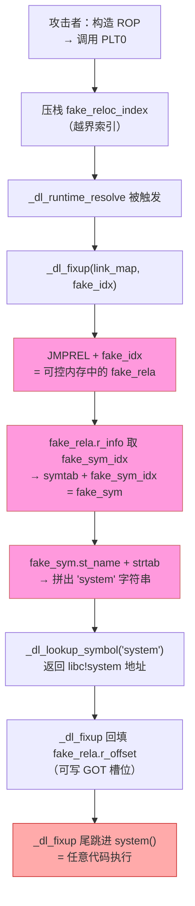

# 动态链接与加载器（15）· 加载器视角的安全

> [!abstract] TL;DR
> - **RELRO** 是加载器在重定位完成后把特定内存区域 `mprotect` 成只读的机制：Partial RELRO 只保护 `.got`（数据 GOT），Full RELRO（`-z relro -z now`）还要关掉延迟绑定、在启动期解析全部 `JUMP_SLOT`，才能把 `.got.plt`（函数 GOT）也锁成只读。
> - **`ret2dl-resolve`** 在目标不启用 Full RELRO 时，伪造 `Elf64_Rela`/`Elf64_Sym`/符号名字符串去欺骗 `_dl_runtime_resolve`，使其解析出攻击者指定的任意符号（如 `system`）并执行——全程借加载器之手，完全绕过传统的 GOT 改写防线。Full RELRO + `BIND_NOW` 使 `_dl_runtime_resolve` 在运行期不再被调用，是最彻底的缓解。
> - **AT_SECURE（secure-execution 模式）** 让加载器在 setuid/setgid 或能力提升场景下自动忽略 `LD_PRELOAD`/`LD_LIBRARY_PATH` 等危险环境变量，堵住第 14 篇讲的加载器劫持路径。
> - **现代加固清单** = Full RELRO + PIE + `BIND_NOW` + Fortify Source + Stack Canary + NX（不可执行栈/堆），`checksec` 一条命令全可见。
> - 三平台在"函数指针表写保护"上殊途同归：Windows 的 CFG + IAT 保护、macOS 的 Hardened Runtime + chained fixups 只读化，都与 Linux Full RELRO 指向同一个安全目标。

本篇是「动态链接与加载器详解」系列的**防御加固专篇**，视角从"加载器做了什么"切换到"加载器怎样被用于加固"。前置知识：[[08.PLT与GOT与延迟绑定]] 讲清了延迟绑定的机制和 `ret2dl-resolve` 的前情；[[14.加载器劫持]] 讲清了攻击面（`LD_PRELOAD` 劫持、`rpath` 注入等）；本篇在此基础上系统梳理防御方、给出可操作的加固清单与 `checksec` 读法，并与 Windows/macOS 对应机制横向比较。

---

## 概述与定位

动态链接器（`ld.so`）是程序启动时第一个获得完整用户态权限的代码，它在用户代码运行前独立完成内存映射、重定位、符号解析。这个"特权窗口"正是安全机制的施力点：加载器能在交还控制权之前，把一部分可写内存**锁成只读**，把危险环境变量**清除或忽略**，把延迟绑定路径**彻底关闭**——这些都是程序本身代码无法做到的，因为程序连 `main` 都还没进入。

本篇以 **Linux `ld.so`** 为主线，深入三个层次：

1. **RELRO**：把"需要重定位后才能只读"的内存区域实际锁定的完整机制（Partial vs Full，以及 `.data.rel.ro`、`.got`、`.got.plt` 各自的位置）。
2. **`ret2dl-resolve`**：最能说明"为什么 Full RELRO 如此重要"的攻击路径——它不改 GOT，而是骗解析器。
3. **AT_SECURE / secure-execution**：加载器对 setuid 等提权程序的自保机制，堵住环境变量注入。

---

## 原理与机制

### RELRO：Partial 与 Full 的本质差异

RELRO（Relocation Read-Only）的实现分三步，每步都在加载器内完成：

1. **链接期标记**：`-z relro` 让链接器生成 `PT_GNU_RELRO` 程序头，描述"重定位完成后应该只读"的虚拟内存范围（`p_vaddr`/`p_memsz`）。这个范围按**页对齐**扩充，以满足 `mprotect` 的整页粒度要求。
2. **运行期重定位**：`ld.so` 正常完成所有需要写入的重定位（`GLOB_DAT`、`RELATIVE`、`JUMP_SLOT` 等）——此时目标内存仍可写。
3. **上锁**：`_dl_protect_relro()` 读取 `PT_GNU_RELRO` 的范围，调用 `mprotect(addr, size, PROT_READ)` 把覆盖到的页设为只读。此后任何写入触发 `SIGSEGV`。

这三步中，**第 2 步"全部 JUMP_SLOT 重定位完成"是 Full RELRO 与 Partial RELRO 的分叉点**：

```
Partial RELRO (-z relro, 默认):
  PT_GNU_RELRO 覆盖范围：.init_array / .fini_array / .dynamic / .got / .data.rel.ro
  .got.plt 不在此范围（延迟绑定要继续用它）
  → .got (GLOB_DAT/RELATIVE) 只读，.got.plt 可写

Full RELRO (-z relro -z now):
  -z now → 设置 DT_FLAGS(DF_BIND_NOW) 或 DT_FLAGS_1(DF_1_NOW)
  ld.so 解读该标志 → 启动时立即解析全部 JUMP_SLOT（等价 LD_BIND_NOW=1 但更彻底）
  解析完所有函数 GOT 槽位后，ld.so 扩大 PT_GNU_RELRO 覆盖范围至 .got.plt
  → .got 只读 + .got.plt 也只读
```

> [!note] 为什么 Partial RELRO 无法保护 .got.plt
> 延迟绑定的本质是"首次调用时 `_dl_fixup` 回写 `.got.plt[n]`"——如果 `.got.plt` 提前只读，回写就会崩溃。因此只要延迟绑定还在，`.got.plt` 就必须保持可写，`PT_GNU_RELRO` 就不能覆盖它。**关掉延迟绑定（`-z now`）才是让 `.got.plt` 可以被只读化的前提**，这两个选项必须同时使用。

RELRO 与 [[11.ELF文件详解/51.data.rel.ro节.md]] 和 [[11.ELF文件详解/17.got节.md]] 紧密相关：`.data.rel.ro`（vtable、全局 const 指针等"重定位后不应改变"的数据）在 Partial RELRO 下即受保护；`.got`（`GLOB_DAT` 数据 GOT）也在 Partial RELRO 范围内。只有 `.got.plt` 是延迟绑定的最后一道可写屏障，Full RELRO 才把它纳入。

```mermaid
graph TD
    subgraph "加载期（ld.so 控制）"
        A[映射 LOAD 段<br/>全部 PROT_READ|WRITE] --> B[应用 .rela.dyn<br/>GLOB_DAT / RELATIVE 重定位]
        B --> C{-z now?}
        C -- 否，lazy --> D[保留 .got.plt 可写<br/>（首次调用时按需回填）]
        C -- 是，BIND_NOW --> E[遍历全部 JUMP_SLOT<br/>立即解析函数地址]
        E --> F[.got.plt 全部填好]
        D --> G[mprotect PT_GNU_RELRO 范围<br/>仅含 .got / .data.rel.ro 等<br/>Partial RELRO]
        F --> H[mprotect 扩展覆盖 .got.plt<br/>Full RELRO]
    end
    subgraph "用户代码期"
        G --> I[.got 只读<br/>.got.plt 可写 → GOT 改写仍有效]
        H --> J[.got + .got.plt 均只读<br/>GOT 改写失效]
    end
```

> **图解**：从"映射 LOAD 段"到"交还用户代码控制权"，加载器按需完成重定位后调用 `mprotect`。左分支（Partial RELRO）只锁数据 GOT，`.got.plt` 留下攻击面；右分支（Full RELRO）先把函数 GOT 填满，才一并上锁。

### `ret2dl-resolve`：骗解析器而非改 GOT

#### 攻击前提

攻击者已拥有**任意写**原语（格式化字符串 `%n`、堆溢出等），但目标**未开 Full RELRO**，即 `.got.plt` 可写——或者更进一步，在研究"Full RELRO 下的后备路径"。

核心思路是：既然 `_dl_runtime_resolve(link_map, reloc_index)` 会"按 `reloc_index` 去 `.rela.plt` 取重定位条目、按 `r_info` 去 `.dynsym` 取符号名、解析后回填"，那攻击者可以**伪造这条链上的任意一节**，让解析器最终解析出 `system`（或其他目标函数）的地址，并自动执行 `_dl_fixup` 的回填+尾跳动作。

#### 伪造链详解

完整攻击需要在可写内存（典型地点：`.bss`、栈上可控区域）构造三层伪造数据：

```c
/* 1. 伪造 Elf64_Rela（放在攻击者控制的可写内存） */
Elf64_Rela fake_rela = {
    .r_offset = (Elf64_Addr) writable_got_slot,   // 回填目标：可写地址（让 fixup 把 system 地址写进来）
    .r_info   = ELF64_R_INFO(fake_sym_idx, R_X86_64_JUMP_SLOT),  // 高32位=fake符号索引；低32=7
    .r_addend = 0
};

/* 2. 伪造 Elf64_Sym（.dynsym 条目）*/
Elf64_Sym fake_sym = {
    .st_name  = offset_to_system_str,  // 在伪造串表中 "system" 的偏移
    .st_info  = ELF64_ST_INFO(STB_GLOBAL, STT_FUNC),
    .st_other = 0,
    .st_shndx = 0,                     // SHN_UNDEF → 触发外部符号查找
    .st_value = 0,
    .st_size  = 0
};

/* 3. 伪造字符串（就是 "system\0"，紧跟在 fake_sym 后） */
char fake_str[] = "system";
```

然后构造 ROP/控制流让目标走到 PLT0（`push link_map; jmp _dl_runtime_resolve`），并把 `reloc_index` 设为**让 `_dl_fixup` 定位到 `fake_rela` 的值**（可以是越界索引，让 `JMPREL + index` 指向可控内存）：

```
PLT0 入口：
  push GOT[1]           → link_map（不伪造，用真实的）
  jmp *GOT[2]           → _dl_runtime_resolve

_dl_fixup 内部执行：
  reloc = &JMPREL[reloc_index]    // 越界 → 命中 fake_rela
  sym   = &symtab[fake_sym_idx]   // 越界 → 命中 fake_sym
  name  = strtab + sym->st_name   // 串表基址 + offset → "system"
  addr  = _dl_lookup_symbol("system", ...)  → 查到 libc!system
  *reloc->r_offset = addr          // 把 system 写入可写 got_slot
  尾跳 → addr（即 system）
  → 执行 system("/bin/sh")         ← 若调用方参数是 "/bin/sh"
```

#### Full RELRO + BIND_NOW 的缓解逻辑

Full RELRO + `BIND_NOW` 的缓解并非"检测 reloc_index 越界"，而是从根本上**消除运行期 `_dl_runtime_resolve` 调用路径**：

- 启动时已解析全部 `JUMP_SLOT` → PLT 慢路径（`push reloc_index; jmp PLT0`）永远不会被执行。
- `.got.plt` 只读 → `fake_rela.r_offset` 回填写入真实 `.got.plt` 会 `SIGSEGV`（即使用可写的 `fake_got_slot` 仍可让 `_dl_fixup` 写进去，但没有自动尾跳的 shell 了——这一微妙差异使攻击复杂度大幅上升）。
- 更关键的是：由于 `.got.plt[GOT[2]]`（`_dl_runtime_resolve` 指针）本身只读，攻击者无法通过改写 `GOT[2]` 来重定向解析器。

> [!note] 现代 glibc 的额外硬化
> 即便目标是 Partial RELRO，新版 glibc（2.35+）的 `_dl_fixup` 也增加了：
> - 对 `reloc_index` 与 `.rela.plt` 合法条目数（`DT_PLTRELSZ / sizeof(Elf64_Rela)`）的边界检查；
> - 对 `sym->st_shndx == SHN_UNDEF` 且符号名为空字符串的过滤；
> - `_dl_runtime_resolve` 的版本在 `GLIBC_PRIVATE` 命名空间，不被正常符号查找命中。
>
> 但这些是深度防御，**不能替代 Full RELRO**。`ret2dl-resolve` 的变体仍在 CTF / 真实漏洞利用中出现，尤其是针对旧版 glibc 或无法升级的嵌入式环境。



> **图解**：红色节点是攻击者伪造的数据（`fake_rela`、`fake_sym`、`"system"` 字符串），橙色是解析链被重定向的关键跳跃，红色末端是任意代码执行。Full RELRO + BIND_NOW 使"_dl_runtime_resolve 被触发"这一步在正常运行中永远不发生，整条链从源头截断。

### AT_SECURE：secure-execution 模式

当程序以提权方式运行（setuid/setgid 二进制、或被赋予 `CAP_SETUID` 等 Linux capability），内核会在辅助向量（auxiliary vector）中设置 **`AT_SECURE=1`**。`ld.so` 启动时读取该值，若为 1 则进入 **secure-execution 模式**：

```c
/* glibc elf/rtld.c（简化，含 AT_SECURE 判断逻辑） */
if (GLRO(dl_secure)) {   /* GLRO(dl_secure) 由 AT_SECURE 初始化 */
    /* 清除/忽略对安全有影响的环境变量 */
    unsetenv("LD_PRELOAD");
    unsetenv("LD_LIBRARY_PATH");
    unsetenv("LD_DEBUG");
    unsetenv("LD_AUDIT");
    unsetenv("LD_ORIGIN_PATH");
    /* ... 还有十余个 LD_* 变量 */
}
```

这直接封堵了 [[14.加载器劫持]] 里讲的环境变量注入路径：`LD_PRELOAD` 注入无效，`LD_LIBRARY_PATH` 劫持无效，`LD_AUDIT` 无效。具体忽略的变量列表由 glibc 版本决定，核心逻辑在 `_dl_init_paths` / `_dl_important_hwcaps` 处理之前完成。

> [!note] AT_SECURE 的局限
> - AT_SECURE 保护的是"进程启动阶段"的环境变量处理；**已加载的恶意库**（若攻击者在 setuid 调用前已注入）不受此保护。
> - 若程序调用 `system()` / `popen()` 启动子进程，子进程继承环境变量，子进程的 `ld.so` 则会重新检查 `AT_SECURE`（新进程无 setuid 则为 0，环境变量重新有效——这是提权场景下的漏洞来源之一）。
> - macOS 的 **System Integrity Protection（SIP）** 在更广范围内剥夺环境变量控制，相当于对系统二进制全量 AT_SECURE 化。

---

## 三平台对照

三大平台在"函数指针表 / 调用间接层的写保护"上殊途同归，实现路径各异：

| 维度 | Linux（ELF / ld.so） | macOS（Mach-O / dyld） | Windows（PE / Loader） |
|---|---|---|---|
| 函数指针表 | `.got.plt`（`JUMP_SLOT`） | `__DATA,__got` / `__la_symbol_ptr` | **IAT**（`IMAGE_IMPORT_DESCRIPTOR`） |
| "只读化"机制 | Full RELRO：`mprotect` + BIND_NOW | dyld chained fixups 绑定后页保护；Hardened Runtime 防 dylib 注入 | ASLR + DEP；IAT 通常可写但 CFG 限制间接调用落点 |
| 延迟绑定 | 默认 lazy；`-z now` 关掉 | 现代 dyld（arm64）靠 chained fixups 趋向即时绑定，`__la_symbol_ptr` 路径退场 | **无**（普通导入加载时全量绑定 IAT）；延迟加载 = `/DELAYLOAD` opt-in |
| 等效"Full RELRO" | `-Wl,-z,relro,-z,now` | Hardened Runtime + chained fixups 默认；`DYLD_INSERT_LIBRARIES` 受限 | IAT 本身无"只读 IAT"；CFG 从另一维度防间接调用劫持 |
| 提权时环境变量 | `AT_SECURE=1`，清除 `LD_*` | SIP + `AMFI`（Apple Mobile File Integrity）禁止 `DYLD_INSERT_LIBRARIES` | 进程完整性级别（`PROCESS_MITIGATION_POLICY`）；`TOKEN_ELEVATION` 下 DLL 注入路径收窄 |
| `ret2dl-resolve` 等价 | `ret2dl-resolve`（伪造 ELF 重定位结构） | 历史上有 dyld opcode 伪造类攻击；chained fixups 结构更难伪造 | 无直接等价（IAT 改写不经解析器；有 DLL 劫持变体） |
| 控制流完整性 | IBT/CET（`-fcf-protection`）+ Shadow Stack | PAC（Pointer Authentication，arm64）+ BIT | **CFG**（Control Flow Guard）：`/guard:cf` |
| 攻击面综合评分 | Partial RELRO（默认）下 `.got.plt` 可写，历史漏洞多 | arm64 + chained fixups 默认强保护；x86_64 macOS 略弱 | IAT 可写但 ASLR + CFG 拉高了利用门槛 |

### Linux：Full RELRO 是关键门槛

Linux 上 Partial RELRO 是 GCC 默认，`.got.plt` 可写。Fedora 23+ 对所有系统包强制 Full RELRO，Ubuntu 从 22.04 起对官方包也基本默认 Full RELRO；但开发者自建二进制、嵌入式 Linux 很可能仍是 Partial RELRO，是高频漏洞利用目标。

### macOS：Hardened Runtime + chained fixups

macOS 的 **Hardened Runtime**（Xcode 签名选项 `com.apple.security.cs.allow-dyld-environment-variables` 等）默认禁止 `DYLD_INSERT_LIBRARIES` 对签名二进制生效，与 Linux `AT_SECURE` 功能等价但粒度更细（per-entitlement）。

**chained fixups**（`LC_DYLD_CHAINED_FIXUPS`）在 arm64 macOS 上几乎已取代传统 lazy bind opcode：镜像内所有需要修补的指针被组织成"链表"，dyld 在加载/页错误时统一修补，修补后的页可以被 `mprotect` 为只读——结构上类似 Full RELRO 的做法，且对二进制格式的控制更彻底（伪造 chained fixup 数据比伪造 ELF 重定位表更难）。

### Windows：CFG 与 IAT 保护

Windows PE 的 IAT 在加载时全量填充（相当于默认 `BIND_NOW`），但 IAT **通常可写**——传统 IAT hook 手法正是利用这一点（直接改写 IAT 表项）。Windows 在两个维度上弥补：

1. **ASLR + DEP**：所有 DLL 的 IAT 地址随机化，结合 DEP（NX 等价）提高利用门槛。
2. **CFG（Control Flow Guard）**：`/guard:cf` 编译选项让间接调用（`call [rax]`、`call rax` 等）在运行期检查目标地址是否在合法函数入口集合中；即使 IAT 被改写，跳到非法地址的 CFG 检查会触发进程终止。这是从"防止间接调用劫持"角度补足"IAT 可写"的缺口，与 Linux IBT/CET 的思路相近但实现方式不同。

> [!note] "只读 IAT" 在 Windows 上不是标准
> Windows 没有等价于 Full RELRO 的"加载后 mprotect IAT 只读"机制；IAT 保护主要依赖 CFG + 进程隔离。少数特殊场景（如 Windows Defender 的受保护进程）会用更激进的内存保护，但这不是通用 ABI 特性。

---

## 数据结构 / 流程详解

### PT_GNU_RELRO 的内存布局

`PT_GNU_RELRO` 程序头指向的内存范围，在典型 x86-64 ELF 二进制里包含以下节（从低地址到高地址排列，位于 `PT_LOAD(RW)` 段内的前半部分）：

```text
PT_GNU_RELRO 范围（Partial RELRO 典型布局，地址为示意）：
  0x403d60  .init_array    ← 初始化函数指针数组（已执行完，不再需要写）
  0x403d70  .fini_array    ← 析构函数指针数组
  0x403d80  .dynamic       ← DT_* 动态标签数组
  0x403e00  .got           ← GLOB_DAT / RELATIVE 数据 GOT
  0x403e40  .data.rel.ro   ← vtable、全局 const 指针等
  -------------------- mprotect 边界（页对齐）
  0x404000  .got.plt       ← Full RELRO 才纳入（Partial RELRO 不覆盖到这里）
  0x404030  .data          ← 普通可读写数据（始终在 RELRO 范围外）
  0x404060  .bss
```

> [!warning] 示例输出为示意
> 地址、节大小、顺序随工具链版本和编译选项而变；关键是"`.got.plt` 紧跟 `.data.rel.ro` 后面，恰好跨越 RELRO 边界"这一空间关系，Partial RELRO 就是在这里留下了缺口。

链接器排布这个顺序是刻意的：把"重定位后可以只读"的节集中在一段，方便 `PT_GNU_RELRO` 的 `p_vaddr+p_memsz` 覆盖到它们而不触碰 `.data`。`-z now` 把 `.got.plt` 提前填满后，链接器可以把 `PT_GNU_RELRO` 的边界延伸过来。

### DT_FLAGS 与 DT_FLAGS_1 中的 BIND_NOW

`-z now` 在 `.dynamic` 中设置两个标志（见 [[11.ELF文件详解/18.dynamic节.md]] 对 `.dynamic` 的讨论，以及 [[11.ELF文件详解/17.got节.md]]）：

| 标签 | 值 | 含义 |
|---|---|---|
| `DT_FLAGS(DF_BIND_NOW)` | `0x8` in `DT_FLAGS(0x1e)` | 触发 ld.so 加载时立即绑定全部 `JUMP_SLOT` |
| `DT_FLAGS_1(DF_1_NOW)` | `0x00000001` in `DT_FLAGS_1(0x6ffffffb)` | glibc 私有扩展，效果同上，优先级更高 |

`ld.so` 初始化时检查 `.dynamic` 中的这两个标签（二者有其一即触发），在处理 `_dl_relocate_object` 阶段把所有 `R_X86_64_JUMP_SLOT` 重定位提前完成，而不等到 PLT 首次调用触发。

### Elf64_Sym 在 ret2dl-resolve 中的关键字段

攻击者伪造 `Elf64_Sym` 时，最关键的三个字段：

```c
typedef struct {
    Elf64_Word    st_name;   // 指向（伪造）字符串表中目标函数名的偏移
    unsigned char st_info;   // ELF64_ST_INFO(STB_GLOBAL, STT_FUNC)
    unsigned char st_other;  // STV_DEFAULT = 0
    Elf64_Section st_shndx;  // SHN_UNDEF(0) → 外部符号，触发跨 DSO 查找
    Elf64_Addr    st_value;  // 0（未定义，由查找填入）
    Elf64_Xword   st_size;   // 0
} Elf64_Sym;
```

`st_shndx = SHN_UNDEF` 是关键：`_dl_lookup_symbol_x` 看到 `SHN_UNDEF` 才会跨 DSO 查找——这正是"借解析器找 `system`"的触发条件。若 `st_shndx != SHN_UNDEF` 且 `st_value != 0`，`_dl_fixup` 会认为符号已有定义，直接用 `st_value` 加上模块基址（可能是攻击者控制的地址，但 gadget 选择更受限），走的是另一条路。

---

## 代码与汇编

### 对比：有无 Full RELRO 时的 .dynamic 差异

```bash
# 无 Full RELRO（默认 lazy）
readelf -d demo_lazy | grep -E 'BIND_NOW|FLAGS'
```

```text
（无输出）
```

> [!warning] 示例输出为示意

```bash
# Full RELRO（-z relro -z now）
readelf -d demo_now | grep -E 'BIND_NOW|FLAGS'
```

```text
 0x000000000000001e (FLAGS)       BIND_NOW
 0x000000006ffffffb (FLAGS_1)     Flags: NOW
```

> [!warning] 示例输出为示意
> `FLAGS BIND_NOW` 和 `FLAGS_1 NOW` 同时出现是 Full RELRO 的标志性特征；只有 Partial RELRO 时二者均不出现。

### 对比：PT_GNU_RELRO 的覆盖范围

```bash
readelf -l demo_partial | grep -A3 GNU_RELRO
```

```text
  GNU_RELRO      0x0000000000002d60 0x0000000000403d60 0x0000000000403d60
                 0x00000000000002a0 0x00000000000002a0  R      0x1
```

> [!warning] 示例输出为示意
> `memsz = 0x2a0`，覆盖到 `.got` 末尾（不含 `.got.plt`）。

```bash
readelf -l demo_full | grep -A3 GNU_RELRO
```

```text
  GNU_RELRO      0x0000000000002d60 0x0000000000403d60 0x0000000000403d60
                 0x00000000000002c8 0x00000000000002c8  R      0x1
```

> [!warning] 示例输出为示意
> `memsz` 更大，覆盖到 `.got.plt` 末尾（含 `GOT[0..2]` 保留项和全部函数槽位）。

---

## 实操：用工具观察

> [!warning] 示例输出为示意
> 本节所有命令输出均为代表性示意，非本机实跑（本机 Windows）；具体地址、偏移、行数随工具链版本、编译选项、ASLR 而变，读者应在自己的 Linux 环境复现。

### 1. checksec：一条命令读加固状态

```bash
checksec --file=./target
```

```text
[*] './target'
    Arch:     amd64-64-little
    RELRO:    Full RELRO
    Stack:    Canary found
    NX:       NX enabled
    PIE:      PIE enabled
    Fortify:  Enabled
```

> [!warning] 示例输出为示意

各字段含义：

| 字段 | 强值 | 弱值 | 说明 |
|---|---|---|---|
| `RELRO` | `Full RELRO` | `Partial RELRO` / `No RELRO` | `.got.plt` 是否只读 |
| `Stack` | `Canary found` | `No canary found` | 栈溢出检测 |
| `NX` | `NX enabled` | `NX disabled` | 不可执行内存（`PT_GNU_STACK` 无 `PF_X`） |
| `PIE` | `PIE enabled` | `No PIE (0x400000)` | 代码段基址随机化 |
| `Fortify` | `Enabled` | `Disabled` | `_FORTIFY_SOURCE` 对危险函数的边界检查 |

`checksec` 的判断逻辑（简化）：
- **Full RELRO**：`PT_GNU_RELRO` 存在 **且** `DT_FLAGS` 含 `DF_BIND_NOW`（或 `DT_FLAGS_1` 含 `DF_1_NOW`）；只有前者为 Partial RELRO。
- **PIE**：ELF type = `ET_DYN`（动态可执行，而非 `ET_EXEC`）。
- **NX**：`PT_GNU_STACK` 程序头的 `p_flags` 不含 `PF_X`（可执行位）。

### 2. readelf 手动验证 BIND_NOW

```bash
readelf -d ./target | grep -E 'BIND_NOW|FLAGS'
```

```text
 0x000000000000001e (FLAGS)       BIND_NOW
 0x000000006ffffffb (FLAGS_1)     Flags: NOW
```

> [!warning] 示例输出为示意

```bash
readelf -l ./target | grep GNU_RELRO
```

```text
  GNU_RELRO      0x0000000000002d60 0x0000000000403d60 0x0000000000403d60
                 0x00000000000002c8 0x00000000000002c8  R      0x1
```

> [!warning] 示例输出为示意

两条命令同时有输出 → Full RELRO。只有 `GNU_RELRO` 行、没有 `BIND_NOW` → Partial RELRO。两者都没有 → No RELRO（高风险）。

### 3. 验证 .got.plt 在 Full RELRO 下不可写

```bash
# 用 GDB 在 main 断点后，尝试写 .got.plt（Full RELRO 场景）
gdb ./demo_now
(gdb) break main
(gdb) run
(gdb) info proc mappings   # 找到 .got.plt 所在页的权限
(gdb) set {long}0x404000 = 0xdeadbeef   # 尝试写
```

```text
# 预期输出：
Cannot access memory at address 0x404000
```

> [!warning] 示例输出为示意
> Full RELRO 下 `mprotect` 已把该页设为 `r--`，GDB 的写操作会报"Cannot access memory"；Partial RELRO 下则会成功写入（但不影响 `.got`，因为数据 GOT 也已只读）。

### 4. 查看 AT_SECURE（setuid 场景）

```bash
# 在 GDB 中以 setuid 二进制为目标，查看辅助向量
gdb /usr/bin/passwd   # passwd 是 setuid 二进制
(gdb) run
(gdb) info auxv | grep AT_SECURE
```

```text
33   AT_SECURE    Secure mode boolean            1
```

> [!warning] 示例输出为示意
> `AT_SECURE = 1` 即进入 secure-execution，`LD_PRELOAD` 等变量均被忽略。普通非 setuid 二进制此项为 0。

---

## 攻防

### 加固清单与取舍

| 机制 | 链接/编译参数 | 防御目标 | 代价 |
|---|---|---|---|
| **Full RELRO** | `-Wl,-z,relro,-z,now` | GOT 改写、`ret2dl-resolve` | 启动期解析所有函数符号，增加启动延迟（通常 <10ms） |
| **PIE** | `-fPIE -pie` | 代码/数据地址随机化，泄漏前无法硬编码地址 | 代码略大，性能有细微影响（<1%） |
| **Stack Canary** | `-fstack-protector-strong` | 栈缓冲区溢出覆盖返回地址 | 每函数进出各一次 `xor %gs:0x28` 检查 |
| **NX（不可执行栈/堆）** | 默认（`PT_GNU_STACK` 无 `PF_X`）/ `-z noexecstack` | 不能在栈/堆上直接跑 shellcode | 无明显性能代价 |
| **Fortify Source** | `-D_FORTIFY_SOURCE=2 -O1+` | `strcpy`/`sprintf` 等危险函数调用加边界检查 | 极小运行时开销，少量代码膨胀 |
| **BIND_NOW** | `-Wl,-z,now`（Full RELRO 的一半） | 关掉延迟绑定，`_dl_runtime_resolve` 运行期不再被调用 | 启动延迟同 Full RELRO |
| **CET/IBT** | `-fcf-protection=branch` (GCC) | 间接调用/跳转只能落在合法 `endbr64` 指令处 | 需 CPU 支持（Ice Lake+）；略微代码膨胀 |
| **Shadow Stack** | `-fcf-protection=return` (GCC) | 返回地址完整性（影子栈与实际栈 ret addr 必须一致） | 需 CPU 支持；性能影响 < 2% |

**最小强制推荐**：Full RELRO + PIE + `BIND_NOW` + Stack Canary + NX。这五项在现代工具链上的总性能代价极小，但攻击面收缩显著。Fortify Source 几乎没有代价，也应默认开启。

### 绕过路径与对策

即使全量加固，仍有残余攻击面：

1. **libc/DSO 自身的 GOT**：主程序享有 Full RELRO，但 `libc.so` 加载到进程时，其自身的 `.got.plt` 可能只有 Partial RELRO（取决于 libc 编译方式；现代发行版通常也是 Full RELRO，但不保证所有第三方 DSO）。可用 `checksec --file=/lib/x86_64-linux-gnu/libc.so.6` 确认。

2. **`.data`/`.bss` 中的函数指针**：Full RELRO 不保护这些区域，回调函数指针改写仍是有效攻击面。对策：CET/CFI 限制间接调用落点。

3. **`__malloc_hook`/`__free_hook`（glibc < 2.34）**：这两个钩子在 `.bss` 可写段，经典利用目标。glibc 2.34 移除了这两个钩子。升级 glibc 是最直接的对策。

4. **信息泄露前提**：ASLR + PIE 使 GOT 地址随机，但一旦存在信息泄露漏洞（如 `%p` 格式化字符串读取 libc 指针），攻击者可重建地址空间布局。对策：降低信息泄露面（关闭格式化字符串漏洞来源、限制 `/proc/PID/maps` 访问）。

---

## 小结

1. **RELRO = 加载器最后一把锁**：加载器在完成重定位后、交还用户代码前，把 `PT_GNU_RELRO` 覆盖到的内存页调用 `mprotect(PROT_READ)` 锁定。Partial RELRO 只覆盖 `.got`（数据 GOT）；Full RELRO（`-z relro -z now`）先用 `BIND_NOW` 提前解析全部函数 GOT，再把 `.got.plt` 也纳入覆盖，彻底锁死 GOT 改写路径。
2. **`ret2dl-resolve` = 骗解析器而非改 GOT**：攻击者在可写内存伪造 `Elf64_Rela`/`Elf64_Sym`/符号名，让 `_dl_runtime_resolve` 解析出任意符号（典型：`system`）并自动执行。Full RELRO + `BIND_NOW` 从根本上消除这条路：启动后 `_dl_runtime_resolve` 不再被调用，`.got.plt` 只读，无法回填伪造地址。
3. **AT_SECURE 是环境变量注入的守门人**：setuid/setgid 程序的加载器在检测到 `AT_SECURE=1` 后主动清除 `LD_PRELOAD`/`LD_LIBRARY_PATH` 等，堵死第 14 篇讲的加载器劫持路径。提权场景下的子进程继承与 SIP/CFG 是三平台的对应机制。
4. **三平台殊途同归**：Linux Full RELRO 的 `mprotect`、macOS chained fixups 的页保护 + Hardened Runtime、Windows CFG 的间接调用检查，都在"锁定函数指针表"或"限制间接调用落点"这两个维度上汇聚，各有取舍但安全目标一致。
5. **`checksec` 是最快的一览表**：`RELRO: Full RELRO` + `PIE: PIE enabled` + `NX: NX enabled` + `Stack: Canary found` + `Fortify: Enabled`——五绿才是最低基线，缺任何一项都应有意识地评估漏洞利用门槛。
6. **全量加固不等于无漏洞**：DSO 自身的 Partial RELRO、`.data`/`.bss` 中的函数指针、旧版 glibc 的 malloc hook、信息泄露前提——残余攻击面仍需 CET/CFI、版本升级、代码审计共同应对。加固是"提高利用成本"而非"消灭漏洞"。

---

## 相关阅读

- **Full RELRO 的核心保护对象——数据 GOT**：[[11.ELF文件详解/17.got节.md]]
- **Full RELRO 扩展保护的关键节——函数 GOT**：[[11.ELF文件详解/21.got.plt节.md]]
- **`.data.rel.ro`：vtable 等重定位后只读数据**：[[11.ELF文件详解/51.data.rel.ro节.md]]
- **`ret2dl-resolve` 利用的解析路径——PLT/GOT/延迟绑定机制**：[[08.PLT与GOT与延迟绑定]]
- **`JUMP_SLOT` 重定位条目（`ret2dl-resolve` 伪造目标）**：[[11.ELF文件详解/19.rel.plt节.md]]
- **加载器劫持（本篇防御的攻击面）**：[[14.加载器劫持]]
- **实战观察加载全过程（含 RELRO 的加载器时序）**：[[16.实战观察加载全过程]]

---

⬅️ 上一篇 [[14.加载器劫持]] ｜ 🏠 [[00.动态链接与加载器总览]] ｜ 下一篇 [[16.实战观察加载全过程]] ➡️
