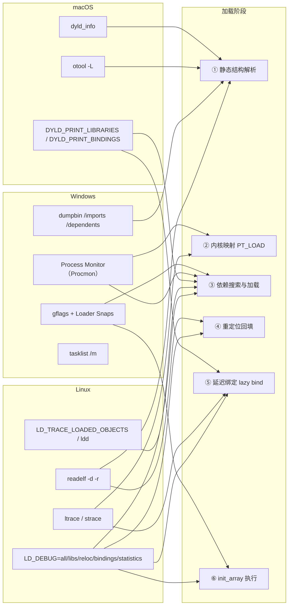
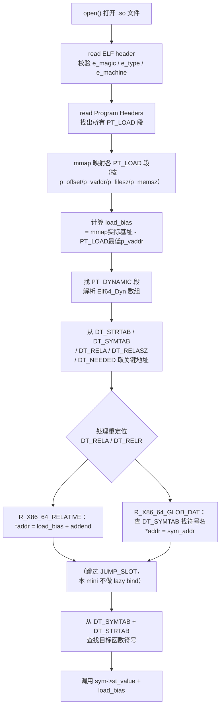

# 动态链接与加载器（16）· 实战观察加载全过程

> [!abstract] TL;DR
> 前 15 篇把加载的每个环节都解剖了一遍：内核映射、ld.so 自举、依赖递归、符号查找、重定位回填、lazy binding、ASLR/PIE、TLS、init_array、安全加固……本篇是**收官实战篇**，把视角切换到"观察者"——用真实工具一步步把这些机制在运行时"看见"。三平台（Linux / macOS / Windows）的主力工具逐一拆解，然后串成一份"从启动到首次 lazy bind"的完整观察脚本，最后以**手写 mini 动态加载器**收尾：用最少的代码把系列全程串起来，理解真实 ld.so 还要做哪些你没做的事。

---

## 概述与定位

加载器是一个"运行时黑盒"，源码不在你的工程里，日志默认静默，调用链埋在内核态与动态链接器之间。想真正理解加载发生了什么，光读文档不够——**必须动手观察**。

本篇聚焦的问题是：**给定一个可执行文件，如何用工具把加载全过程的每一个环节都"照出来"？**

需要观察的环节与前面各篇一一对应：

| 加载阶段 | 对应系列篇章 | 本篇工具切入点 |
|---|---|---|
| 文件结构静态读取 | [[02.程序加载全景]]、[[11.ELF文件详解/18.dynamic节.md]] | `readelf -d/-r`、`dumpbin /imports` |
| 内核映射 PT_LOAD | [[04.可执行文件的内存映射]] | `strace -e mmap,mprotect`、Procmon |
| 依赖库搜索与加载 | [[05.依赖解析与库搜索顺序]] | `LD_DEBUG=libs`、`ldd`、`DYLD_PRINT_LIBRARIES`、Procmon |
| 重定位回填 | [[07.重定位机制详解]] | `LD_DEBUG=reloc`、`readelf -r` |
| 延迟绑定 lazy bind | [[08.PLT与GOT与延迟绑定]] | `LD_DEBUG=bindings`、`ltrace` |
| 符号解析 | [[06.符号解析与符号查找]] | `LD_DEBUG=symbols`、`ltrace -S` |
| init_array 执行 | [[11.初始化与析构顺序]] | `LD_DEBUG=all` 过滤 `calling init` |
| 安全加固状态 | [[15.加载器视角的安全]] | `checksec`、`LD_DEBUG=statistics` |

---

## 原理与机制

### 加载各阶段与观察工具的映射关系

下图是本篇的全景——每一行工具覆盖哪些阶段，一目了然：



> 图中每条箭头代表"该工具能观察到该阶段的信息"。横跨最多阶段的是 Linux 的 `LD_DEBUG=all` 和 Windows 的 Procmon，它们是对应平台的全景式观察工具。

---

## Linux 工具详解

### `LD_DEBUG`：动态链接器的日志开关

`LD_DEBUG` 是 glibc `ld.so` 内置的诊断接口，通过环境变量控制输出级别，**无需重编译、无需 root**。输出走 `stderr`（可用 `LD_DEBUG_OUTPUT=<file>` 重定向到文件）。

#### 各档输出说明

| 值 | 输出内容 | 对应加载阶段 |
|---|---|---|
| `libs` | 库搜索路径、找到的 .so 路径、`DT_RUNPATH/RPATH` 展开、找不到时的搜索轨迹 | 依赖搜索 |
| `symbols` | 每次符号查找：查哪个名字、在哪个 DSO 里找到（或找不到的失败路径） | 符号解析 |
| `bindings` | 符号绑定完成时机：文件名、目标库名、符号名、版本 | 延迟绑定首次发生 |
| `reloc` | 重定位处理：类型、目标地址、填入值 | 重定位回填 |
| `statistics` | 加载完成后统计摘要：搜索了多少符号、命中率、重定位计数 | 汇总分析 |
| `all` | 以上全部（含 `files`/`versions`/`scopes` 等更多子系统） | 全程 |

基本用法：

```bash
# 最常用：观察依赖加载
LD_DEBUG=libs ./app

# 观察首次 lazy bind 发生在哪
LD_DEBUG=bindings ./app

# 观察重定位全过程（输出量巨大，建议重定向到文件）
LD_DEBUG=reloc LD_DEBUG_OUTPUT=/tmp/reloc.log ./app

# 全量日志到文件（可能几十 MB，仅用于调试 ld.so 自身）
LD_DEBUG=all LD_DEBUG_OUTPUT=/tmp/ld-all.log ./app

# 加载统计（短小精悍，适合对比优化前后）
LD_DEBUG=statistics ./app
```

> [!warning] 示例输出为示意
> 以下所有 `LD_DEBUG` 输出均为代表性示意，非本机实跑；进程号、地址、路径随环境而变。

**`LD_DEBUG=libs` 示意输出（观察依赖搜索路径）**：

```text
     12345:    find library=libpthread.so.0 [0]; searching
     12345:     search path=/usr/lib/x86_64-linux-gnu/glibc-hwcaps/x86-64-v3  (system search path)
     12345:     search path=/lib/x86_64-linux-gnu        (system search path)
     12345:      trying file=/lib/x86_64-linux-gnu/libpthread.so.0
     12345:    calling init: /lib/x86_64-linux-gnu/libpthread.so.0
```

搜索路径按 `DT_RPATH → LD_LIBRARY_PATH → DT_RUNPATH → ldconfig 缓存 → 默认路径` 顺序尝试（详见 [[05.依赖解析与库搜索顺序]]）。

**`LD_DEBUG=bindings` 示意输出（观察 lazy bind 时机）**：

```text
     12345:    binding file ./app [0] to /lib/x86_64-linux-gnu/libc.so.6 [0]: normal symbol `puts' [GLIBC_2.2.5]
```

这一行**只在首次调用 `puts` 那一刻打印**，而非加载时。若加 `LD_BIND_NOW=1`，全部 binding 行会集中在程序输出之前（加载期全量绑定）。两者对比，lazy vs now 的时机差异一目了然。

**`LD_DEBUG=statistics` 示意输出（加载统计）**：

```text
     12345:    runtime linker statistics:
     12345:      total startup time in dynamic loader: 1523851 cycles
     12345:                       time needed for relocation: 756402 cycles (49.6%)
     12345:                    number of relocations performed: 182
     12345:          number of relocations from cache: 94
     12345:           number of relative relocations: 45
```

重定位占启动时间近半——这是 Full RELRO 的"税"，也是为什么 GOT 松弛优化（RELATIVE 型重定位比 GLOB_DAT 更快，见 [[11.ELF文件详解/17.got节.md]]）值得做的动机。

---

### `ltrace`：库调用追踪

`ltrace` 拦截动态链接的库函数调用（和 `strace` 拦截系统调用是对称的），输出格式为 `函数名(参数) = 返回值`。对观察"程序调用了哪些 libc 函数、入参是什么"极为直观：

```bash
# 基本用法：追踪所有库调用
ltrace ./app

# 只看特定函数（正则过滤）
ltrace -e malloc ./app

# 同时显示系统调用（-S）和库调用
ltrace -S ./app

# 显示时间戳（-t）和调用栈（-n 2 缩进嵌套深度）
ltrace -t -n 2 ./app
```

> [!warning] 示例输出为示意

```text
puts("hello world")                                   = 1
malloc(64)                                            = 0x55ab12340
free(0x55ab12340)                                     = <void>
+++ exited (status 0) +++
```

`ltrace` 的原理是在 PLT 入口处打断点（或通过 `LD_PRELOAD` 拦截），因此它天然与 [[08.PLT与GOT与延迟绑定]] 的延迟绑定机制挂钩——**每次 PLT 首次被触发时 `ltrace` 能捕到**。注意：`ltrace` 自身注入会干扰延迟绑定时机，不宜用于精确性能测量。

---

### `strace -e trace=openat,mmap,mprotect`：系统调用层观察加载

`strace` 追踪系统调用，下面三个 syscall 直接对应加载行为：

| syscall | 加载阶段含义 |
|---|---|
| `openat` | 动态链接器在磁盘上打开 `.so` 文件（含多路径探测失败的 `ENOENT`） |
| `mmap` | 把 `.so` 的 PT_LOAD 段映射到进程地址空间（见 [[04.可执行文件的内存映射]]） |
| `mprotect` | 设置段页保护（`PROT_READ|PROT_EXEC` for `.text`；RELRO 完成后 `mprotect(.got, PROT_READ)`） |

```bash
strace -e trace=openat,mmap,mprotect ./app 2>&1 | less
```

> [!warning] 示例输出为示意

```text
openat(AT_FDCWD, "/etc/ld.so.cache", O_RDONLY|O_CLOEXEC) = 3
openat(AT_FDCWD, "/lib/x86_64-linux-gnu/libc.so.6", O_RDONLY|O_CLOEXEC) = 3
mmap(NULL, 2029568, PROT_READ, MAP_PRIVATE|MAP_DENYWRITE, 3, 0) = 0x7f8b12000000
mmap(0x7f8b12022000, 1540096, PROT_READ|PROT_EXEC, MAP_PRIVATE|MAP_FIXED|MAP_DENYWRITE, 3, 0x22000) = 0x7f8b12022000
mmap(0x7f8b1219a000, 356352, PROT_READ, MAP_PRIVATE|MAP_FIXED|MAP_DENYWRITE, 3, 0x19a000) = 0x7f8b1219a000
mmap(0x7f8b121f2000, 24576, PROT_READ|PROT_WRITE, MAP_PRIVATE|MAP_FIXED|MAP_DENYWRITE, 3, 0x1f1000) = 0x7f8b121f2000
mprotect(0x7f8b121f2000, 12288, PROT_READ) = 0   ← Partial RELRO 把 .got 设为只读
```

重点解读：
- 多个 `mmap` 对应同一个 fd（libc.so.6），权限各不同——这正是 ELF PT_LOAD 段按节分类映射的直接体现（代码段 `PROT_READ|EXEC`，只读数据 `PROT_READ`，可写数据 `PROT_READ|WRITE`）。
- 末行 `mprotect(..., PROT_READ)` 没有 `PROT_WRITE`——这就是 Partial RELRO 完成后把 `.got` 锁成只读的那一刻。

---

### `readelf -d` / `readelf -r`：静态剖析 .dynamic 与重定位

这两个命令在程序运行前对 ELF 文件做静态解析，是观察"预设了什么"的起点：

```bash
# 查看 .dynamic 全部条目（等价于加载器的"工作清单"）
readelf -d ./app

# 查看全部重定位（含 .rela.dyn 的 GLOB_DAT 和 .rela.plt 的 JUMP_SLOT）
readelf -r ./app

# 过滤出所有 JUMP_SLOT（即将被 lazy bind 的函数 GOT 项）
readelf -r ./app | grep JUMP_SLOT

# 检查 BIND_NOW / RELRO 状态
readelf -d ./app | grep -E 'FLAGS|BIND'
readelf -l ./app | grep GNU_RELRO
```

> [!warning] 示例输出为示意

```text
$ readelf -d ./app
Dynamic section at offset 0x2db8 contains 27 entries:
  Tag                Type        Name/Value
 0x0000000000000001 (NEEDED)    Shared library: [libc.so.6]
 0x000000000000000c (INIT)      0x1000
 0x0000000000000005 (STRTAB)    0x420
 0x0000000000000006 (SYMTAB)    0x2f8
 0x0000000000000003 (PLTGOT)    0x3fb8
 0x0000000000000017 (JMPREL)    0x588
 0x0000000000000007 (RELA)      0x4c8
 0x0000000000000000 (NULL)      0x0

$ readelf -r ./app | grep JUMP_SLOT
000000403fe0  000100000007 R_X86_64_JUMP_SLOT  0000000000000000 puts@GLIBC_2.2.5 + 0
```

`DT_NEEDED` 列出所有运行时依赖（对应 [[11.ELF文件详解/18.dynamic节.md]] 的依赖管理功能）；`R_X86_64_JUMP_SLOT` 的 `Offset` 列就是首次 `puts` 调用后 `_dl_fixup` 回填的 `.got.plt` 槽位地址。

---

### `LD_TRACE_LOADED_OBJECTS`：列出依赖库（ldd 的本质）

```bash
# 直接用 ldd（封装了 LD_TRACE_LOADED_OBJECTS）
ldd ./app

# 等价的原始形式
LD_TRACE_LOADED_OBJECTS=1 ./app
```

> [!warning] 示例输出为示意

```text
        linux-vdso.so.1 (0x00007ffd8b1a3000)
        libc.so.6 => /lib/x86_64-linux-gnu/libc.so.6 (0x00007f3b22000000)
        /lib64/ld-linux-x86-64.so.2 (0x00007f3b2220a000)
```

> [!note] ldd 安全警告
> `ldd` 实际上会**执行目标程序**（在受控环境下），而非仅静态解析。对不信任的二进制应改用 `readelf -d ./app | grep NEEDED` 做纯静态分析，避免触发恶意代码。

---

## macOS 工具详解

### `DYLD_PRINT_LIBRARIES` 与 `DYLD_PRINT_BINDINGS`

macOS 的 `dyld` 也内置了类似 `LD_DEBUG` 的环境变量开关，覆盖加载与绑定两大阶段：

```bash
# 打印加载的所有库（含路径）
DYLD_PRINT_LIBRARIES=1 ./app

# 打印每次符号绑定（含 chained fixups 绑定和传统 lazy stub binder 绑定）
DYLD_PRINT_BINDINGS=1 ./app

# 打印 dyld 搜索路径细节
DYLD_PRINT_SEARCHING=1 ./app

# 打印段映射（对应 strace mmap）
DYLD_PRINT_SEGMENTS=1 ./app
```

> [!warning] 示例输出为示意

```text
# DYLD_PRINT_LIBRARIES 示例
dyld[12345]: <9FC8AEAB-...> /usr/lib/libSystem.B.dylib
dyld[12345]: <4B312C0F-...> /usr/lib/libc++.1.dylib

# DYLD_PRINT_BINDINGS 示例（chained fixups 时代，绑定集中在加载时）
dyld[12345]: bind: libSystem.B.dylib:printf = 0x00007fff20350a80
dyld[12345]: bind: libSystem.B.dylib:malloc = 0x00007fff203501c0
```

> [!note] macOS SIP 与 DYLD 变量限制
> 在受 **SIP（System Integrity Protection）** 保护的系统二进制（`/usr/bin/*` 等）上，`DYLD_PRINT_*` 变量会被 dyld 静默忽略。需用自编译的二进制测试，或临时关闭 SIP（不推荐生产环境）。

---

### `dyld_info`：静态解析 Mach-O 动态链接信息

`dyld_info` 是 macOS 12+ 提供的命令行工具，对应 Linux 的 `readelf -d/-r` 组合：

```bash
# 查看所有依赖库
dyld_info -dependents ./app

# 查看导入符号（fixups）——包括 chained fixups 和传统 lazy bind
dyld_info -fixups ./app

# 查看导出符号
dyld_info -exports ./libfoo.dylib

# 查看 Rebase 信息（对应 ELF 的 RELATIVE 重定位）
dyld_info -rebase ./app
```

> [!warning] 示例输出为示意

```text
$ dyld_info -fixups ./app
/path/to/app:
    segment         section          address        type   target
    __DATA_CONST    __got            0x100008010    bind   libSystem.B.dylib/dyld_stub_binder
    __DATA_CONST    __got            0x100008018    bind   libSystem.B.dylib/printf
    __DATA          __la_symbol_ptr  0x100010000    lazy   libSystem.B.dylib/puts
```

`bind` 类型在加载时立即绑定；`lazy` 类型（传统 `__la_symbol_ptr`）延迟到首次调用。现代 arm64 Mach-O 几乎全是 `bind`（chained fixups 策略），这与 ELF 默认 lazy 的策略形成对比（见 [[08.PLT与GOT与延迟绑定]] 三平台对照一节）。

---

### `otool -L`：列出依赖动态库

```bash
# 等价于 Linux ldd（但是纯静态解析，更安全）
otool -L ./app

# 查看 Mach-O load commands（含 LC_LOAD_DYLIB 等）
otool -l ./app | grep -A4 LC_LOAD_DYLIB
```

> [!warning] 示例输出为示意

```text
$ otool -L ./app
./app:
    /usr/lib/libSystem.B.dylib (compatibility version 1.0.0, current version 1319.0.0)
    /usr/lib/libc++.1.dylib (compatibility version 1.0.0, current version 1300.23.0)
```

---

## Windows 工具详解

### Process Monitor（Procmon）：观察 DLL 探测路径

Procmon 是 Sysinternals 套件中最适合观察 Windows 加载器行为的工具——它在内核层拦截文件系统操作，能完整记录加载器依次尝试了哪些路径才找到 DLL。

**配置 Procmon 观察 DLL 加载**：

1. 打开 Procmon，菜单 **Filter → Filter...**
2. 添加过滤器：`Process Name` - `is` - `app.exe` - `Include`
3. 添加过滤器：`Operation` - `is` - `CreateFile` - `Include`（或 `Path` - `ends with` - `.dll` - `Include`）
4. 启动目标程序，观察 `CreateFile` 和 `ReadFile` 事件

> [!warning] 示例输出为示意

```text
app.exe  CreateFile  C:\Windows\System32\kernel32.dll        SUCCESS
app.exe  CreateFile  C:\Users\user\AppData\Local\foo.dll     NAME NOT FOUND
app.exe  CreateFile  C:\Windows\System32\foo.dll             NAME NOT FOUND
app.exe  CreateFile  C:\Windows\foo.dll                      NAME NOT FOUND
app.exe  CreateFile  C:\app_dir\foo.dll                      SUCCESS
```

Windows DLL 搜索顺序（默认 SafeDllSearchMode）：`KnownDLLs` → 应用程序目录 → `%SystemRoot%\System32` → `%SystemRoot%` → `PATH` 中各目录（详见 [[05.依赖解析与库搜索顺序]] Windows 一节）。`NAME NOT FOUND` 的连续探测正是搜索顺序在磁盘上的物理痕迹，对理解 DLL 劫持（DLL Hijacking）的成因至关重要。

---

### `dumpbin /imports` 与 `/dependents`

`dumpbin` 是 MSVC 工具链提供的 PE 文件分析工具，对应 Linux `readelf -d/-r` + macOS `dyld_info`：

```cmd
:: 查看导入表（对应 readelf -r 的 JUMP_SLOT）
dumpbin /imports app.exe

:: 只查第一层依赖 DLL 名（对应 ldd / otool -L）
dumpbin /dependents app.exe

:: 查看文件头摘要
dumpbin /headers app.exe

:: 查看反汇编（含 IAT 间接调用地址）
dumpbin /disasm app.exe
```

> [!warning] 示例输出为示意

```text
C:\> dumpbin /imports app.exe

  Section contains the following imports:

    KERNEL32.dll
                4001A0 Import Address Table
                4003C8 Import Name Table
                     0 time date stamp
                     0 Index of first forwarder reference

                       ExitProcess
                       GetModuleHandleA
                       VirtualAlloc

    USER32.dll
                4001B8 Import Address Table
                       MessageBoxA
```

`Import Address Table`（IAT）地址在程序加载时被写入真实函数地址（见 [[13.PE文件详解/08-详解PE文件(八)：导入表.md]] 的 INT/IAT 双表设计）。对比 ELF：`dumpbin /imports` 的 IAT 相当于 `.got.plt`，`Import Name Table` 相当于 `.rela.plt` 的符号名来源。

---

### `gflags` + Loader Snaps：Windows 加载器级调试日志

`gflags.exe`（WDK/Debugging Tools for Windows）可为特定进程开启 **Loader Snaps**——Windows 加载器的详细诊断输出，原理类似 `LD_DEBUG=all`：

```cmd
:: 为 app.exe 开启 Loader Snaps（写入注册表）
gflags /p /enable app.exe /full

:: 运行目标程序（在 WinDbg 或 cdb 下捕获 Loader Snaps 输出）
windbg app.exe

:: 关闭 Loader Snaps
gflags /p /disable app.exe /full
```

在 WinDbg 中 Loader Snaps 输出为 `LDR:` 前缀的调试字符串：

> [!warning] 示例输出为示意

```text
LDR: LdrLoadDll, loading USER32.DLL from C:\Windows\System32\USER32.DLL
LDR: LdrpFindKnownDll, found: NTDLL.DLL
LDR: LdrpMapDll: Mapping ntdll.dll
LDR: Snapping imports for APP.EXE from KERNEL32.dll
LDR: LdrpSnapThunk: USER32.DLL!MessageBoxA => 0x7FF9E0123456
```

`Snapping imports` 一行对应 IAT 回填（等价于 ELF 的重定位回填阶段）；`LdrpMapDll` 对应 ELF 的 `mmap` PT_LOAD 阶段。Loader Snaps 是 Windows 侧最接近 `LD_DEBUG=all` 的工具，但需要调试器环境，日常用 Procmon 即可。

---

### `tasklist /m`：运行时查看已加载 DLL

```cmd
:: 列出当前进程加载的所有 DLL（等价于 /proc/<pid>/maps 的 Windows 版）
tasklist /m /fi "IMAGENAME eq app.exe"

:: 或用 PowerShell 更详细
Get-Process -Name app | Select-Object -ExpandProperty Modules | Select-Object ModuleName, BaseAddress, FileName
```

> [!warning] 示例输出为示意

```text
Image Name     PID   Modules
============== ===== ========================================
app.exe        4512  ntdll.dll, KERNEL32.dll, USER32.dll, ...
```

---

## 三平台观察工具对照表

| 观察目标 | Linux | macOS | Windows |
|---|---|---|---|
| 依赖库列表（静态） | `readelf -d \| grep NEEDED` | `otool -L` | `dumpbin /dependents` |
| 依赖库列表（运行时） | `ldd` / `LD_TRACE_LOADED_OBJECTS=1` | `DYLD_PRINT_LIBRARIES=1` | `tasklist /m` |
| 库搜索路径探测 | `LD_DEBUG=libs` | `DYLD_PRINT_SEARCHING=1` | Procmon（`CreateFile` 过滤） |
| 内存映射（mmap/段映射） | `strace -e mmap,mprotect` | `DYLD_PRINT_SEGMENTS=1` | Procmon（`ReadFile`/`VirtualAlloc`） |
| 重定位信息（静态） | `readelf -r` | `dyld_info -fixups` | `dumpbin /imports`（IAT 地址） |
| 重定位执行（运行时） | `LD_DEBUG=reloc` | `DYLD_PRINT_BINDINGS=1` | Loader Snaps（`Snapping imports`） |
| Lazy bind 时机 | `LD_DEBUG=bindings` | `DYLD_PRINT_BINDINGS=1`（传统 lazy） | 无（IAT 加载时全量填满） |
| 符号查找过程 | `LD_DEBUG=symbols` | `DYLD_PRINT_BINDINGS=1` | Loader Snaps |
| 加载统计 | `LD_DEBUG=statistics` | `DYLD_PRINT_STATISTICS=1` | ETW Performance Counter |
| 库函数调用追踪 | `ltrace` | `dtruss` / `dtrace` | API Monitor / Frida |
| 安全加固状态 | `checksec --file=` | `codesign -dvvv` | `dumpbin /headers`（DLL Characteristics） |

---

## 完整观察流程脚本：从启动到首个 lazy bind

以下脚本把前面各工具串成一条完整观察链，目标是**亲眼看到"程序从启动到首次调用外部函数"全过程的每一个环节**。以 Linux + x86-64 为主，附 macOS 对应命令。

> [!warning] 示例输出为示意
> 下述脚本中所有注释了"示意输出"的代码块，均为代表性示意，非本机实跑；地址、进程号、路径随环境而变。

### 准备一个最小测试程序

```c
/* demo.c — 故意触发 lazy bind 的最小程序 */
#include <stdio.h>
#include <string.h>

void early_init(void) __attribute__((constructor));
void early_init(void) {
    /* 这个函数会在 init_array 阶段被调用，早于 main() */
    fprintf(stderr, "[constructor] called\n");
}

int main(int argc, char *argv[]) {
    puts("=== first puts call (lazy bind here) ===");
    printf("strlen=%zu\n", strlen("hello"));
    return 0;
}
```

```bash
# 编译：默认 lazy（不加 -z now），加 -g 方便 GDB
gcc -g demo.c -o demo_lazy

# 也编译一个 Full RELRO 版本做对照
gcc -g demo.c -o demo_now -Wl,-z,relro,-z,now

# 验证 RELRO 状态
checksec --file=demo_lazy demo_now
```

> [!warning] 示例输出为示意

```text
demo_lazy:
    Arch:     amd64-64-little   RELRO:   Partial RELRO   PIE: PIE enabled
demo_now:
    Arch:     amd64-64-little   RELRO:   Full RELRO      PIE: PIE enabled
```

---

### Step 1：静态读取 .dynamic 和重定位表

```bash
# 静态快照：.dynamic 工作清单
readelf -d demo_lazy | grep -E 'NEEDED|PLTGOT|JMPREL|PLTREL|INIT|BIND'
```

> [!warning] 示例输出为示意

```text
 0x0000000000000001 (NEEDED)    Shared library: [libc.so.6]
 0x000000000000000c (INIT)      0x1050
 0x0000000000000003 (PLTGOT)    0x3fb8
 0x0000000000000017 (JMPREL)    0x508
 0x0000000000000014 (PLTREL)    RELA
```

`DT_JMPREL` 指向 `.rela.plt`（函数 GOT 的重定位表）；`DT_PLTGOT` 指向 `.got.plt` 起始（含三保留项，见 [[08.PLT与GOT与延迟绑定]] 三保留项一节）。

```bash
# 枚举所有将被 lazy bind 的函数 GOT 项
readelf -r demo_lazy | grep JUMP_SLOT
```

> [!warning] 示例输出为示意

```text
000000403fc8  000200000007 R_X86_64_JUMP_SLOT  0000000000000000 puts@GLIBC_2.2.5 + 0
000000403fd0  000300000007 R_X86_64_JUMP_SLOT  0000000000000000 printf@GLIBC_2.2.5 + 0
000000403fd8  000400000007 R_X86_64_JUMP_SLOT  0000000000000000 strlen@GLIBC_2.2.5 + 0
000000403fe0  000500000007 R_X86_64_JUMP_SLOT  0000000000000000 fprintf@GLIBC_2.2.5 + 0
```

---

### Step 2：strace 看内核映射阶段

```bash
strace -e trace=openat,mmap,mprotect -o /tmp/strace.log ./demo_lazy
grep -E 'openat|libc|ld-linux|mprotect' /tmp/strace.log | head -30
```

> [!warning] 示例输出为示意

```text
openat(AT_FDCWD, "/etc/ld.so.cache", O_RDONLY|O_CLOEXEC) = 3
openat(AT_FDCWD, "/lib/x86_64-linux-gnu/libc.so.6", O_RDONLY|O_CLOEXEC) = 4
mmap(NULL, 1982592, PROT_READ, MAP_PRIVATE|MAP_DENYWRITE, 4, 0) = 0x7f0a12200000
mmap(0x7f0a12222000, 1462272, PROT_READ|PROT_EXEC, ...) = 0x7f0a12222000   # .text
mmap(0x7f0a12388000, 311296, PROT_READ, ...) = 0x7f0a12388000              # .rodata
mmap(0x7f0a123d5000, 24576, PROT_READ|PROT_WRITE, ...) = 0x7f0a123d5000   # .data + .got
mprotect(0x7f0a12200000, 4096, PROT_READ) = 0                              # ← RELRO 上锁
[constructor] called                                                         # init_array
=== first puts call (lazy bind here) ===                                     # lazy bind 在此触发
strlen=5
```

注意 `mprotect` 在 `[constructor]` 之前（RELRO 在 init 之前完成），在 `first puts call` 之前（lazy bind 在第一次调用时发生）。

---

### Step 3：LD_DEBUG 看依赖加载和重定位

```bash
# 看库搜索（输出定向到文件，不污染 demo 的 stdout）
LD_DEBUG=libs LD_DEBUG_OUTPUT=/tmp/libs.log ./demo_lazy && cat /tmp/libs.log
```

> [!warning] 示例输出为示意

```text
     42001:    find library=libc.so.6 [0]; searching
     42001:     search path=/usr/lib/x86_64-linux-gnu  (system search path)
     42001:      trying file=/usr/lib/x86_64-linux-gnu/libc.so.6
     42001:    calling init: /lib/x86_64-linux-gnu/libc.so.6
     42001:    calling init: ./demo_lazy        ← demo_lazy 自身的 init_array
```

---

### Step 4：LD_DEBUG=bindings 捕获首次 lazy bind

```bash
# 关键步骤：亲眼看 lazy bind 在哪一刻发生
LD_DEBUG=bindings ./demo_lazy 2>&1
```

> [!warning] 示例输出为示意

```text
[constructor] called
=== first puts call (lazy bind here) ===
     42001:    binding file ./demo_lazy [0] to /lib/x86_64-linux-gnu/libc.so.6 [0]: normal symbol `puts' [GLIBC_2.2.5]
     42001:    binding file ./demo_lazy [0] to /lib/x86_64-linux-gnu/libc.so.6 [0]: normal symbol `printf' [GLIBC_2.2.5]
strlen=5
     42001:    binding file ./demo_lazy [0] to /lib/x86_64-linux-gnu/libc.so.6 [0]: normal symbol `strlen' [GLIBC_2.2.5]
```

关键现象：binding 行出现**在程序输出之后**——`puts` 的 binding 在第一次 `puts(...)` 调用打印完后才记录，而非加载时。这直接证明了 lazy binding 的时机。

对比 Full RELRO 版本：

```bash
LD_DEBUG=bindings ./demo_now 2>&1
```

> [!warning] 示例输出为示意

```text
     42002:    binding file ./demo_now [0] to /lib/x86_64-linux-gnu/libc.so.6 [0]: normal symbol `puts' [GLIBC_2.2.5]
     42002:    binding file ./demo_now [0] to /lib/x86_64-linux-gnu/libc.so.6 [0]: normal symbol `printf' [GLIBC_2.2.5]
     42002:    binding file ./demo_now [0] to /lib/x86_64-linux-gnu/libc.so.6 [0]: normal symbol `strlen' [GLIBC_2.2.5]
     42002:    binding file ./demo_now [0] to /lib/x86_64-linux-gnu/libc.so.6 [0]: normal symbol `fprintf' [GLIBC_2.2.5]
[constructor] called
=== first puts call (lazy bind here) ===
strlen=5
```

Full RELRO 下，所有 binding 行在程序第一行输出**之前**——加载时全量绑定，init_array 也在绑定完成后才执行。

---

### Step 5：GDB 实证 .got.plt 槽位翻转

```bash
gdb -q ./demo_lazy
```

```text
(gdb) break main
(gdb) run
Breakpoint 1, main (...) in demo_lazy

# 先查 puts 的 .got.plt 槽位地址（从 readelf -r 拿到 0x403fc8）
(gdb) x/gx 0x403fc8
0x403fc8:    0x0000000000401036    ← 首次调用前：回指 .plt 慢路径 push 指令（示意地址）

# 单步越过第一次 puts
(gdb) next
=== first puts call (lazy bind here) ===

(gdb) x/gx 0x403fc8
0x403fc8:    0x00007f0a1234a380    ← 首次调用后：已是 libc 中 puts 真实地址（示意地址）
```

> [!warning] 示例输出为示意
> `0x401036` 和 `0x00007f0a1234a380` 均为示意值；真实地址随 ASLR 每次运行不同。关键是"前后两次 `x/gx` 同一地址，值从镜像内 PLT 区翻转到 libc 高地址区"这一现象本身（与 [[08.PLT与GOT与延迟绑定]] GDB 实证一节口径一致）。

---

### Step 6：ltrace 确认库调用轨迹

```bash
ltrace -e puts,printf,strlen ./demo_lazy
```

> [!warning] 示例输出为示意

```text
[constructor] called
puts("=== first puts call (lazy bind here) ===") = 43
strlen("hello") = 5
printf("strlen=%zu\n", 5) = 9
+++ exited (status 0) +++
```

`ltrace` 同时记录了参数和返回值，是"黑盒测试"时理解程序行为的快速工具。

---

### macOS 对应命令

```bash
# 对应 Step 3（库列表 + bindings）
DYLD_PRINT_LIBRARIES=1 DYLD_PRINT_BINDINGS=1 ./demo 2>&1

# 对应 Step 1（静态结构）
dyld_info -fixups ./demo
otool -L ./demo
```

---

## 手写一个 mini 动态加载器

这是本系列的收官节——把前 15 篇讲过的每个机制，用最少的代码"亲自过一遍"。mini 加载器的目标：**给定一个共享库路径，把它映射进内存、做基本重定位、找到一个符号并调用它**。不依赖 `dlopen`，直接用系统调用手工实现。

这既是最好的验收方式，也能让你体会真实 ld.so 有多复杂。

### 完整流程概览



### 核心代码片段（C，仅主干逻辑）

```c
/*
 * mini_loader.c — 演示性 mini 动态加载器
 * 仅处理 x86-64 ELF shared object，仅做 RELATIVE + GLOB_DAT 重定位
 * 依赖：Linux + glibc（用了 open/mmap/mprotect syscall 语义）
 */
#include <sys/mman.h>
#include <sys/stat.h>
#include <fcntl.h>
#include <elf.h>
#include <string.h>
#include <stdio.h>
#include <stdint.h>
#include <unistd.h>

/* ---------- 辅助：查找 PT_DYNAMIC 内的特定 d_tag ---------- */
static Elf64_Dyn *find_dyn(Elf64_Dyn *dyn, Elf64_Sxword tag) {
    for (; dyn->d_tag != DT_NULL; dyn++)
        if (dyn->d_tag == tag) return dyn;
    return NULL;
}

void *mini_load(const char *path, const char *symbol) {
    /* ① open + 读 ELF header */
    int fd = open(path, O_RDONLY);
    if (fd < 0) { perror("open"); return NULL; }

    Elf64_Ehdr ehdr;
    read(fd, &ehdr, sizeof(ehdr));
    if (memcmp(ehdr.e_ident, ELFMAG, 4) != 0) { close(fd); return NULL; }

    /* ② 读 Program Headers，找 PT_LOAD 的地址范围 */
    Elf64_Phdr phdrs[64];
    pread(fd, phdrs, ehdr.e_phnum * sizeof(Elf64_Phdr), ehdr.e_phoff);

    Elf64_Addr vaddr_min = UINT64_MAX, vaddr_max = 0;
    for (int i = 0; i < ehdr.e_phnum; i++) {
        if (phdrs[i].p_type != PT_LOAD) continue;
        if (phdrs[i].p_vaddr < vaddr_min) vaddr_min = phdrs[i].p_vaddr;
        Elf64_Addr end = phdrs[i].p_vaddr + phdrs[i].p_memsz;
        if (end > vaddr_max) vaddr_max = end;
    }

    /* ③ 预留整块地址空间（匿名 mmap，后续各段 MAP_FIXED 覆盖） */
    size_t total = vaddr_max - vaddr_min;
    void *base = mmap(NULL, total, PROT_NONE,
                      MAP_PRIVATE | MAP_ANONYMOUS, -1, 0);
    if (base == MAP_FAILED) { close(fd); return NULL; }

    Elf64_Addr load_bias = (Elf64_Addr)base - vaddr_min;

    /* ④ 逐个 PT_LOAD 段 mmap */
    for (int i = 0; i < ehdr.e_phnum; i++) {
        Elf64_Phdr *ph = &phdrs[i];
        if (ph->p_type != PT_LOAD) continue;

        int prot = 0;
        if (ph->p_flags & PF_R) prot |= PROT_READ;
        if (ph->p_flags & PF_W) prot |= PROT_WRITE;
        if (ph->p_flags & PF_X) prot |= PROT_EXEC;

        void *seg_addr = (void *)(ph->p_vaddr + load_bias);
        /* 文件内容部分 */
        mmap(seg_addr, ph->p_filesz, prot,
             MAP_PRIVATE | MAP_FIXED, fd, ph->p_offset);
        /* BSS 部分（p_memsz > p_filesz，补零页） */
        if (ph->p_memsz > ph->p_filesz) {
            size_t bss_sz = ph->p_memsz - ph->p_filesz;
            void *bss = (char *)seg_addr + ph->p_filesz;
            mmap(bss, bss_sz, prot,
                 MAP_PRIVATE | MAP_FIXED | MAP_ANONYMOUS, -1, 0);
        }
    }
    close(fd);

    /* ⑤ 找 PT_DYNAMIC，解析 Elf64_Dyn 数组 */
    Elf64_Dyn *dyn = NULL;
    for (int i = 0; i < ehdr.e_phnum; i++) {
        if (phdrs[i].p_type == PT_DYNAMIC) {
            dyn = (Elf64_Dyn *)(phdrs[i].p_vaddr + load_bias);
            break;
        }
    }
    if (!dyn) return NULL;

    /* ⑥ 取关键地址 */
    Elf64_Dyn *d;
    Elf64_Sym  *symtab  = NULL;
    char       *strtab  = NULL;
    Elf64_Rela *rela    = NULL;
    size_t      relasz  = 0;

    if ((d = find_dyn(dyn, DT_SYMTAB)))  symtab = (Elf64_Sym *)(d->d_un.d_ptr + load_bias);
    if ((d = find_dyn(dyn, DT_STRTAB)))  strtab = (char *)(d->d_un.d_ptr + load_bias);
    if ((d = find_dyn(dyn, DT_RELA)))    rela   = (Elf64_Rela *)(d->d_un.d_ptr + load_bias);
    if ((d = find_dyn(dyn, DT_RELASZ)))  relasz = d->d_un.d_val;

    /* ⑦ 处理重定位（仅 RELATIVE + GLOB_DAT） */
    size_t nrela = relasz / sizeof(Elf64_Rela);
    for (size_t i = 0; i < nrela; i++) {
        Elf64_Rela *r = &rela[i];
        uint64_t *target = (uint64_t *)(r->r_offset + load_bias);
        int rtype = ELF64_R_TYPE(r->r_info);

        if (rtype == R_X86_64_RELATIVE) {
            /* 纯地址调整：target = load_bias + addend（无需查符号表） */
            *target = load_bias + r->r_addend;
        } else if (rtype == R_X86_64_GLOB_DAT) {
            /* 数据 GOT 项：需查符号表（简化：只处理本模块已解析的符号） */
            int symidx = ELF64_R_SYM(r->r_info);
            Elf64_Sym *sym = &symtab[symidx];
            if (sym->st_shndx != SHN_UNDEF) {
                *target = sym->st_value + load_bias;
            }
            /* 真实 ld.so 还会跨 DSO 查找 — 本 mini 跳过 */
        }
        /* JUMP_SLOT 重定位本 mini 不处理（不实现 lazy bind / PLT 机制） */
    }

    /* ⑧ 查找目标符号 */
    for (Elf64_Sym *sym = symtab;
         sym->st_name != 0 || sym->st_value != 0;
         sym++) {
        if (sym->st_name == 0) continue;
        if (strcmp(strtab + sym->st_name, symbol) == 0) {
            return (void *)(sym->st_value + load_bias);
        }
    }
    return NULL; /* 未找到 */
}
```

### 使用方式

```c
int main(void) {
    /* 调用 mini_load 加载 libm.so，找到 sin 函数地址并调用 */
    void *sin_fn = mini_load("/lib/x86_64-linux-gnu/libm.so.6", "sin");
    if (!sin_fn) { fprintf(stderr, "load failed\n"); return 1; }

    double (*sin_ptr)(double) = sin_fn;
    printf("sin(3.14) = %f\n", sin_ptr(3.14));
    return 0;
}
```

> [!note] 局限性说明：真实 ld.so 还要做什么
> mini 加载器只实现了最核心的三步（映射→解析 PT_DYNAMIC→RELATIVE/GLOB_DAT 重定位），真实 `ld.so` 还要做：
>
> | 能力 | 本 mini 的处理 | 真实 ld.so 的处理 |
> |---|---|---|
> | 依赖递归 | 未做（忽略 `DT_NEEDED`） | 递归加载所有 `DT_NEEDED`，构建 `link_map` 链（[[05.依赖解析与库搜索顺序]]） |
> | 跨 DSO 符号解析 | GLOB_DAT 只处理本模块符号 | 按作用域链在所有 DSO 的 `gnu_hash` 中查找（[[06.符号解析与符号查找]]） |
> | PLT/JUMP_SLOT（lazy bind） | 未实现 | 设置 GOT 三保留项，首次调用时触发 `_dl_runtime_resolve`（[[08.PLT与GOT与延迟绑定]]） |
> | TLS 初始化 | 未处理 | 分配 TLS 块、处理 `PT_TLS` 和 `DT_TLSDESC_*`（[[12.TLS的实现]]） |
> | `init_array` / `.init` | 未调用 | 按逆拓扑顺序调用所有 DSO 的 `DT_INIT`/`DT_INIT_ARRAY`（[[11.初始化与析构顺序]]） |
> | RELRO 上锁 | 未做 | 完成重定位后 `mprotect(PT_GNU_RELRO 覆盖范围, PROT_READ)`（[[15.加载器视角的安全]]） |
> | 符号版本 | 忽略 | 校验 `GLIBC_x.y` 版本标签，避免旧/新符号歧义（[[13.符号版本与二进制兼容]]） |
> | IFUNC 解析 | 未处理 | `STT_GNU_IFUNC`：运行 resolver 按 CPU 特性选实现 |
> | DT_RELR（压缩相对重定位） | 未处理 | 解码位图格式，处理高密度 RELATIVE 条目 |

每一项都在系列对应篇章里有完整讲解——mini 加载器是最好的导航索引。

---

## 小结

1. **Linux `LD_DEBUG` 是最全面的加载观察接口**：`libs`（依赖搜索）、`bindings`（lazy bind 时机）、`reloc`（重定位）、`statistics`（统计摘要）四个档各司其职；`LD_DEBUG=bindings` 配合 `LD_BIND_NOW=1` 对比，是验证 lazy vs now 时机差异最直接的方法。
2. **strace -e trace=openat,mmap,mprotect 是看内核侧加载的利器**：`openat` 揭示库搜索路径探测轨迹，多次 `mmap` 对应 PT_LOAD 分段映射，`mprotect` 标志 RELRO 上锁时机。
3. **三平台观察重点各异**：Linux 有丰富的 `LD_DEBUG`/`strace`/`ltrace` 组合；macOS 以 `DYLD_PRINT_*` 和 `dyld_info` 为主（新版 chained fixups 下 lazy bind 基本退场）；Windows 以 Procmon 观察 DLL 探测路径、`dumpbin` 静态分析、Loader Snaps 调试器级诊断。
4. **完整观察流程 = 静态快照 + 运行时跟踪 + GDB 实证**：先 `readelf -d/-r` 了解预设，再 `strace`/`LD_DEBUG` 看运行过程，最后 GDB `x/gx` 亲眼看 `.got.plt` 槽位翻转——三步组合才能把机制和现象对上。
5. **mini 动态加载器是最好的系列收官**：`open → mmap PT_LOAD → 解析 PT_DYNAMIC → RELATIVE/GLOB_DAT 重定位 → 查符号跳 e_entry`，五步走完加载主干；真实 ld.so 额外的依赖递归、跨 DSO 符号查找、lazy PLT、TLS、init_array、RELRO 上锁，每一项都指回系列对应篇章。

---

## 相关阅读

- **加载全景与内核交接**：[[02.程序加载全景]]
- **.dynamic 节——加载器的工作清单**：[[11.ELF文件详解/18.dynamic节.md]]
- **PLT/GOT 与延迟绑定（本篇观察的核心对象）**：[[08.PLT与GOT与延迟绑定]]
- **PE 导入表——Windows 侧对照**：[[13.PE文件详解/08-详解PE文件(八)：导入表.md]]
- **安全加固体系（RELRO/BIND_NOW/ret2dl-resolve）**：[[15.加载器视角的安全]]
- **依赖搜索顺序（LD_DEBUG=libs 观察的对象）**：[[05.依赖解析与库搜索顺序]]
- **符号解析作用域链（LD_DEBUG=symbols 观察的对象）**：[[06.符号解析与符号查找]]
- **重定位类型全览（RELATIVE/GLOB_DAT/JUMP_SLOT 的由来）**：[[07.重定位机制详解]]
- **TLS 实现（mini 加载器未覆盖的部分）**：[[12.TLS的实现]]
- **初始化顺序（init_array 的执行时机）**：[[11.初始化与析构顺序]]
- **符号版本与二进制兼容**：[[13.符号版本与二进制兼容]]

---

⬅️ 上一篇 [[15.加载器视角的安全]] ｜ 🏠 [[00.动态链接与加载器总览]] ｜ 下一篇 [[00.动态链接与加载器总览]] ➡️
