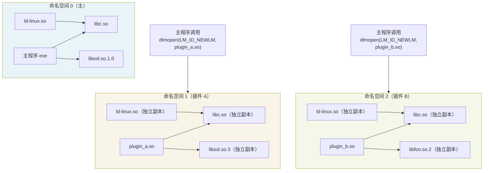

# 动态链接与加载器（17）· dlmopen 与链接器命名空间

> [!abstract] TL;DR
> - **核心问题**：`dlopen` 在同一进程的全局符号空间里加载 DSO，多个插件之间的符号天然可见、互相污染；同一个库的两个不同版本无法共存——后加载的会直接复用先加载版本的符号。
> - **解决方案**：`dlmopen(lmid, path, flags)` 在一个**独立的链接器命名空间（link-map namespace）**里加载 DSO，该命名空间有自己独立的 `link_map` 链，符号查找严格限制在本命名空间内，对外部世界完全不可见。
> - **三种命名空间入口**：`LM_ID_BASE`（主命名空间，等价于 `dlopen`）、`LM_ID_NEWLM`（新建一个空命名空间，最常用）、已有 `Lmid_t` 值（把新库加入一个已存在的命名空间）。
> - **上限**：glibc 默认 `DL_NNS = 16`，超过则 `dlmopen` 返回 `NULL` 并置 `ENOMEM`；每个命名空间至少要载入一份 libc，因此命名空间是稀缺资源。
> - **核心陷阱**：命名空间在符号层面隔离，但**不隔离地址空间、文件描述符、信号处理器**；多份 libc 实例各自维护独立的内存分配器、TLS、`errno`，跨命名空间传递 `FILE*`/`pthread_mutex_t` 是未定义行为。
> - **跨命名空间桥接**：`dlinfo(handle, RTLD_DI_LMID, &lmid)` 查询某 `handle` 所在命名空间 ID；`dlmopen(lmid, path, RTLD_GLOBAL)` 在指定命名空间内把符号升为全局——但 `RTLD_GLOBAL` 在非主命名空间里语义受限，慎用。

本篇是「动态链接与加载器详解」系列的**隔离与沙箱专题**：前面 [[16.实战观察加载全过程]] 从 `strace`/`ltrace` 视角把加载过程的每一步都观察了一遍，本篇切换到**设计视角**，分析 glibc 提供的最强隔离原语 `dlmopen` 及其内部数据结构 `link_map namespace`。与 [[10.符号查找与绑定]] 的全局查找逻辑相对，命名空间机制是在那套查找逻辑之上加的**作用域边界**。

---

## 概述与定位

### dlopen 的全局命名空间问题

`dlopen(path, RTLD_LOCAL)` 把一个 DSO 加载进当前进程，但哪怕指定了 `RTLD_LOCAL`，其内部对其他已加载 DSO 的**依赖**仍然是全局解析的：动态链接器会沿着进程的 `link_map` 链从头扫描，找到第一个匹配的符号定义即视为解析成功。这意味着：

- 插件 A 和插件 B 都依赖 `libssl.so.1.0`，它们会共享同一份已加载实例，其中任何一方的全局状态改动（如 `SSL_CTX_set_options` 修改的配置）都会影响另一方。
- 同一个进程里无法同时持有 `libfoo.so.1` 与 `libfoo.so.2`——两者都提供 `foo_init` 符号，第一个加载的会"占住"该符号，第二个的 `foo_init` 会被解析到第一个版本。
- 当一个插件调用 `malloc` 然后把指针返回给主程序时，若未来插件被卸载（`dlclose`），其 `malloc` 的来源库可能也随之卸载，导致悬挂指针——只要两者共享同一份 allocator 实例，这种问题就是隐性的。

这些问题的根源在于：`dlopen` 的世界是**一个平坦的 `link_map` 链**，所有已加载 DSO 排成一排，全局符号查找就是沿着这条链线性扫描。

### dlmopen 的命名空间模型

`dlmopen` 把"平坦的一条链"升级为"多条独立的链"。每条链就是一个**链接器命名空间（link-map namespace）**，glibc 内部用 `struct link_namespaces _dl_ns[DL_NNS]` 这个数组来维护。每个命名空间有：

- 独立的 `_ns_loaded`（`link_map` 链表头）
- 独立的 `_ns_nloaded`（已加载 DSO 计数）
- 独立的 `_ns_main_searchlist`（符号查找列表）
- 独立的 GLIBC 实例（每个命名空间自动加载一份 `ld.so` 和 `libc`）

符号查找被严格限制在**同一命名空间内**：当命名空间 N 里的代码调用 `malloc`，动态链接器只会在命名空间 N 的 `link_map` 链里查找 `malloc`，永远不会跑到命名空间 M 里去找。这就是隔离的本质。

### 与 dlopen 的接口对比

```c
/* 标准 dlopen：加载进主命名空间（或 RTLD_LOCAL 的本地空间） */
void *dlopen(const char *filename, int flags);

/* dlmopen：指定命名空间 */
void *dlmopen(Lmid_t lmid, const char *filename, int flags);
```

`Lmid_t` 是 `long int` 的 typedef，取值含义：

| 值 | 含义 |
|---|---|
| `LM_ID_BASE`（0） | 主命名空间，等价于 `dlopen` |
| `LM_ID_NEWLM`（-1） | 新建一个空命名空间并把该 DSO 作为第一个载入 |
| 已有 `Lmid_t` N | 把该 DSO 载入第 N 个已存在的命名空间 |

返回的 `void *handle` 与 `dlopen` 完全相同，可传给 `dlsym`/`dlclose`/`dlinfo`，不需要区分来源。

---

## 原理与机制

### link_map 链与命名空间的数据结构

在 glibc 源码（`sysdeps/generic/ldsodefs.h`）里，链接器命名空间的核心结构是：

```c
struct link_namespaces {
    struct link_map *_ns_loaded;       /* 本命名空间的 link_map 链表头 */
    unsigned int     _ns_nloaded;      /* 已加载 DSO 数量 */
    struct r_scope_elem *_ns_main_searchlist; /* 符号查找作用域列表 */
    unsigned int     _ns_global_scope_pending_adds;
    struct r_debug   _ns_debug;        /* 本命名空间的 r_debug（供调试器用） */
};

/* 全局命名空间数组 */
struct link_namespaces _dl_ns[DL_NNS];
```

`DL_NNS` 是编译期常量，glibc 默认值为 **16**。每当调用 `dlmopen(LM_ID_NEWLM, ...)` 时，动态链接器会从 `_dl_ns` 数组里找一个未使用的槽位（`_ns_nloaded == 0`）分配出去；若 16 个槽位全满，返回 `NULL` 并设 `errno = ENOMEM`。

每个 `link_map` 节点有 `l_ns` 字段记录自己属于哪个命名空间（`Lmid_t`），使得从单个 DSO 句柄反向查询命名空间 ID 成为 O(1) 操作。

### 命名空间的 libc 实例化

这是 `dlmopen` 区别于 `dlopen` 最重要、也最容易被误解的一点：**每个新命名空间会自动加载一份独立的 `ld-linux.so` 和 `libc.so`**，不复用主命名空间的版本。

为什么必须如此？命名空间内部的 DSO 依赖 `malloc`、`pthread`、`errno`、TLS 等基础设施，这些全部由 libc 提供。若与主命名空间共享 libc，命名空间内的 `malloc` 就会与主程序的 `malloc` 使用同一个 heap——隔离立刻失效。所以每个命名空间必须有自己的 libc 实例，维护独立的 `malloc` arena、独立的 `pthread` 线程局部存储、独立的 `stdio` 缓冲区。

这带来两个直接后果：

1. **内存开销**：每个命名空间至少额外消耗一份 libc 的私有映射（text 段可共享只读页，data/BSS 段不能共享），典型 glibc 约 1–2 MB 私有内存。
2. **命名空间是稀缺资源**：`DL_NNS = 16` 的上限并不只是随便设的数字——维持 16 个并发命名空间意味着最多 16 份 libc 实例，内存和初始化代价都不低。

### 符号查找的作用域边界

glibc 的符号查找使用 `r_scope_elem` 结构的列表来定义"查哪些 DSO"。`dlmopen` 创建的命名空间的 `_ns_main_searchlist` 只包含本命名空间内的 DSO，不包含其他命名空间的任何成员。

查找流程伪代码如下：

```
lookup_symbol(name, namespace N):
    for dso in N._ns_main_searchlist:
        if dso.symbol_table contains name:
            return dso.symbol_address(name)
    # 找不到 → 报 undefined symbol 错误
    return NOT_FOUND
```

关键点：这里的迭代对象是 `N._ns_main_searchlist`，**硬编码绑定到命名空间 N**，动态链接器无法"越界"到其他命名空间去查找。这与 `RTLD_LOCAL` 的语义完全不同——`RTLD_LOCAL` 仅阻止该 DSO 自身的符号向外导出，但它自身依赖的符号仍走全局查找链；而命名空间隔离是**双向的**，既不向外导出，也不向外查找。

### LM_ID_NEWLM 的初始化序列

当调用 `dlmopen(LM_ID_NEWLM, "libfoo.so", RTLD_NOW)` 时，glibc 内部的初始化序列大致如下：

```
1. 分配新命名空间槽位 N（从 _dl_ns 数组里找空闲槽）
2. 在命名空间 N 里加载 ld-linux.so（解释器自身）
3. 在命名空间 N 里加载 libc.so（基础库）
4. 递归解析 libfoo.so 的所有依赖，全部加载到命名空间 N
5. 在命名空间 N 内完成所有重定位
6. 依序调用各 DSO 的 .init_array
7. 返回 libfoo.so 的 handle
```

步骤 2、3 是自动的，用户无需手动加载 libc。这也意味着即使用户只想加载一个"没有外部依赖"的极简 DSO，命名空间里也必然有 libc 存在（因为 `ld.so` 本身依赖 libc 的内部接口）。

---

## 结构与算法详解

### 多命名空间隔离示意



三个命名空间里各有独立的 `link_map` 链，符号查找彼此不交叉。NS1 和 NS2 可以各自加载不同版本的 `libssl`，不会产生任何冲突。

### dlinfo 查询命名空间 ID

```c
#include <dlfcn.h>
#include <link.h>

void *handle = dlmopen(LM_ID_NEWLM, "libplugin.so", RTLD_NOW | RTLD_LOCAL);
if (!handle) {
    fprintf(stderr, "dlmopen 失败: %s\n", dlerror());
    return;
}

/* 查询 handle 所在命名空间的 Lmid_t */
Lmid_t lmid;
if (dlinfo(handle, RTLD_DI_LMID, &lmid) != 0) {
    fprintf(stderr, "dlinfo 失败: %s\n", dlerror());
    return;
}
printf("插件加载在命名空间 %ld\n", (long)lmid);

/* 向同一命名空间追加另一个库 */
void *handle2 = dlmopen(lmid, "libhelper.so", RTLD_NOW | RTLD_LOCAL);
```

`RTLD_DI_LMID` 是 `dlinfo` 的查询类型，要求第三个参数是 `Lmid_t *`。这是唯一能从外部获取命名空间 ID 的标准接口。

### 插件沙箱的完整示例

```c
#include <dlfcn.h>
#include <stdio.h>
#include <link.h>

typedef int (*plugin_init_t)(void);
typedef void (*plugin_run_t)(const char *);
typedef void (*plugin_fini_t)(void);

struct plugin {
    void         *handle;
    Lmid_t        lmid;
    plugin_init_t init;
    plugin_run_t  run;
    plugin_fini_t fini;
};

int plugin_load(struct plugin *p, const char *path)
{
    /* 每个插件独占一个新命名空间 */
    p->handle = dlmopen(LM_ID_NEWLM, path, RTLD_NOW | RTLD_LOCAL);
    if (!p->handle) {
        fprintf(stderr, "加载插件失败: %s\n", dlerror());
        return -1;
    }

    dlinfo(p->handle, RTLD_DI_LMID, &p->lmid);

    /* 查找插件入口 */
    p->init = (plugin_init_t)dlsym(p->handle, "plugin_init");
    p->run  = (plugin_run_t) dlsym(p->handle, "plugin_run");
    p->fini = (plugin_fini_t)dlsym(p->handle, "plugin_fini");

    if (!p->init || !p->run || !p->fini) {
        fprintf(stderr, "插件接口不完整: %s\n", dlerror());
        dlclose(p->handle);
        return -1;
    }
    return 0;
}

void plugin_unload(struct plugin *p)
{
    if (p->fini) p->fini();
    dlclose(p->handle);
    p->handle = NULL;
}
```

### 多版本库共存的典型场景

同一进程内加载 `libssl.so.1.0`（旧版）和 `libssl.so.3`（新版）的方法：

```c
/* 旧版 SSL 给遗留插件用 */
void *h_old = dlmopen(LM_ID_NEWLM, "/opt/openssl10/lib/libssl.so.1.0", RTLD_NOW);

/* 新版 SSL 给现代组件用 */
void *h_new = dlmopen(LM_ID_NEWLM, "/usr/lib/libssl.so.3", RTLD_NOW);

/* 两者在独立命名空间中，SSL_new/SSL_CTX_new 等符号互不干扰 */
```

若用 `dlopen`，第二次加载会发现 `libssl` 已在 `link_map` 链里，直接返回已有 handle 的引用计数加一版本，根本无法加载新版本。`dlmopen` 从根本上解决了这个问题。

---

## 工具视角与实战

### 观察命名空间的工具链

**`/proc/<pid>/maps` 查看多份 libc 映射**：

```bash
# 若进程使用了 dlmopen，会看到同一个 libc.so.6 的多段独立映射
grep libc /proc/$(pgrep myapp)/maps
# 输出示例（三个命名空间 = 三组映射）：
# 7f1a000-7f1b000 r--p ... /lib/x86_64-linux-gnu/libc.so.6
# 7f2a000-7f2b000 r--p ... /lib/x86_64-linux-gnu/libc.so.6
# 7f3a000-7f3b000 r--p ... /lib/x86_64-linux-gnu/libc.so.6
```

text 段（`r-xp`）会共享同一物理页（只读内存可 CoW 合并），但 data/BSS 段（`rw-p`）会各自独立，这就是内存开销来自的地方。

**`gdb` 查看 `_dl_ns` 数组**：

```
(gdb) p _dl_ns[0]._ns_nloaded
$1 = 12
(gdb) p _dl_ns[1]._ns_nloaded
$2 = 8
(gdb) p _dl_ns[1]._ns_loaded->l_name
$3 = 0x... "/path/to/plugin_a.so"
```

**`LD_DEBUG=all` 观察命名空间分配**（glibc 调试输出会标注 `[lmid=N]`）：

```bash
LD_DEBUG=libs,symbols ./myapp 2>&1 | grep lmid
```

### 编译与链接注意事项

使用 `dlmopen` 时，程序需要链接 `-ldl`，头文件包含 `<dlfcn.h>` 和 `<link.h>`（后者提供 `Lmid_t` 类型定义）。在某些旧版 glibc 上，`LM_ID_NEWLM` 可能需要 `#define _GNU_SOURCE`：

```c
#define _GNU_SOURCE
#include <dlfcn.h>
#include <link.h>
```

链接时：

```bash
gcc -o myapp myapp.c -ldl
```

### 与 Python 的 ctypes 结合

Python 3 的 `ctypes.CDLL` 底层走 `dlopen`，不支持命名空间。若需要在 Python 里实现类似命名空间隔离的效果，只能在 C 扩展模块里封装 `dlmopen`，再通过 Python 的 C API 暴露接口。这是 Python 原生 import 系统与 `dlmopen` 生态的主要鸿沟之一。

### glibc 2.35+ 的变化

glibc 2.35 起，`dlmopen` 在部分架构上的 TLS 行为有所调整，修复了若干命名空间内 `pthread_key_create` 与 `__thread` 变量混用时的竞争条件。若项目需要在命名空间内使用 TLS，建议锁定 glibc 最低版本要求并在 CI 里显式测试。

---

## 安全性与正确使用

> [!caution]
> **命名空间隔离≠安全沙箱。** 以下几类场景会让隔离失效，使用前必须逐一评估。

### 符号泄漏与意外共享

命名空间隔离仅限于**动态链接符号**。以下内容**不被隔离**：

1. **地址空间**：所有命名空间共享同一个进程的虚拟地址空间。命名空间内的代码可以通过原始指针读写主程序的任意内存——`dlmopen` 对内存越界无任何防护。
2. **文件描述符**：`open()`/`socket()` 返回的 fd 是进程级资源，命名空间内的 DSO 可以直接读写主程序打开的文件。
3. **信号处理器**：`sigaction` 修改的是进程级信号向量表，命名空间内的 DSO 可以覆盖主程序的信号处理器。
4. **`/proc/self`、`ptrace`**：命名空间内的代码可以访问 `/proc/self` 的所有信息，包括 maps、mem、fd 等。

**结论**：`dlmopen` 提供的是**符号作用域隔离**，不是操作系统级沙箱（`seccomp`/`namespaces`/`capabilities` 才是）。把 `dlmopen` 当作安全沙箱来抵御恶意插件是错误的。

### 多份 libc 的状态分裂问题

每个命名空间有独立的 libc 实例，这导致以下跨命名空间操作是**未定义行为**：

- 在命名空间 N 里 `malloc` 的内存，传给命名空间 M 里的 `free`——两个 allocator 的 heap 元数据不兼容，必然崩溃或静默损坏。
- 在命名空间 N 里 `fopen` 得到的 `FILE*`，传给命名空间 M 的 `fclose`——各自的 `stdio` 缓冲区、锁状态不同。
- 在命名空间 N 里 `pthread_mutex_init` 得到的互斥锁，跨命名空间传给 M 去锁定——pthread 的 futex 实现可能跨实例不兼容。

**实践建议**：跨命名空间传递的数据结构只应是 **POD（Plain Old Data）**——纯整数、纯指针、纯字节数组。所有 libc 对象（锁、文件句柄、分配器指针）必须在创建它的命名空间内销毁。

> [!caution]
> **TLS 与命名空间的组合是高危区域。** 若插件在新命名空间内使用 `__thread` 或 `pthread_key_create`，而线程是由主命名空间创建的，TLS 分配的索引空间可能冲突。glibc 的 TLS 实现在多命名空间场景下经历了多次 bug 修复，在 glibc 2.32 之前该组合存在已知竞争条件。

### DL_NNS 上限与资源耗尽

```c
void *handles[20];
for (int i = 0; i < 20; i++) {
    handles[i] = dlmopen(LM_ID_NEWLM, "libplugin.so", RTLD_NOW);
    if (!handles[i]) {
        /* 第 17 次（i=16）开始，errno = ENOMEM，dlerror() 说 "cannot create namespace" */
        fprintf(stderr, "第 %d 次失败: %s\n", i + 1, dlerror());
        break;
    }
}
```

可以通过重新编译 glibc 修改 `DL_NNS`，但这在生产环境中是不现实的。正确的应对方式是：**复用命名空间**（用 `dlinfo` 获取已有命名空间的 `lmid`，把新插件加到同一命名空间里），而非无限制地创建新命名空间。

### RTLD_GLOBAL 在非主命名空间的语义

`dlmopen` 不支持与 `RTLD_GLOBAL` 组合使用（至少在 glibc 2.36 及以前）——若传入 `RTLD_GLOBAL`，glibc 会忽略它或报错（行为版本相关）。这意味着命名空间内的 DSO 的符号**永远不会升为进程全局可见**，也无法被其他命名空间的代码直接引用。这是设计上的刻意选择：命名空间的存在意义就是隔离，让其符号全局可见会破坏这个语义。

---

## 跨生态对比

`dlmopen` 的"命名空间内独立符号空间"思想并非 Linux 独有，在其他系统和运行时里有相似的设计：

**Windows `LoadLibraryEx`**：Windows 不提供等价的链接器命名空间机制。`LoadLibraryEx` 的 `LOAD_LIBRARY_AS_DATAFILE`/`LOAD_WITH_ALTERED_SEARCH_PATH` 只影响加载路径和内存映射方式，不隔离符号作用域。多版本 DLL 共存只能通过 SxS（Side-by-Side Assemblies）机制，在不同的 WinSxS 目录里各放一个版本，通过 manifest 指定绑定——是文件系统层面的隔离，而非运行时动态链接器层面的隔离。

**Java ClassLoader**：`ClassLoader` 的层次结构提供了类似命名空间的隔离——子 ClassLoader 加载的类对父 ClassLoader 的代码不可见，两个子 ClassLoader 可以各自加载同一个类的不同版本。JVM 的类解析（`Class.forName`）会在当前 ClassLoader 的作用域内查找，不会跨越 ClassLoader 边界。这与 `dlmopen` 的命名空间查找语义高度类似，但 Java 的整个 GC 堆是共享的（类似于 dlmopen 的共享地址空间），对象跨 ClassLoader 传递也有同样的类型不兼容风险。

**Python subinterpreter（`Py_NewInterpreter`）**：Python 的子解释器有独立的 `sys.modules`，允许同一进程里存在多个 Python 模块命名空间。但 C 扩展（`.so`）在 CPython 3.11 之前不支持多解释器实例——扩展里的全局 C 状态会被所有子解释器共享，语义与 `dlmopen` 的多 libc 实例问题高度类似。CPython 3.12 引入的 Per-Interpreter GIL 和多相位初始化（PEP 489/630/687）正是在尝试修复这个问题，思路与 glibc 给每个命名空间独立 libc 实例如出一辙。

这个横向对比说明："给每个隔离单元独立的运行时状态实例"是所有想做动态加载隔离的系统共同面临的核心挑战，它的代价（额外内存、跨边界传递限制）也高度相似。

---

## 小结

`dlmopen` 在 `dlopen` 的基础上引入了**链接器命名空间**这一抽象层：每个命名空间拥有独立的 `link_map` 链和独立的 libc 实例，符号查找严格限制在命名空间内，从根本上解决了同一进程内多版本库共存和插件符号污染的问题。

使用 `dlmopen` 时最关键的两点认知：第一，**隔离边界只在符号/动态链接层**，地址空间、文件描述符、信号处理器等进程级资源依然共享，`dlmopen` 不是安全沙箱；第二，**多 libc 实例带来了跨命名空间传递 libc 对象的禁区**，`malloc`/`free`、`FILE*`、`pthread` 对象必须在各自命名空间内生灭，永远不要跨命名空间交换这类对象的所有权。

在合规使用的范围内——插件系统的符号隔离、同一进程多版本库共存、依赖冲突规避——`dlmopen` 是 Linux 平台上目前最优雅的解决方案，且无需任何内核特性支持，纯用户态即可实现。

---

## 相关阅读

- [[16.实战观察加载全过程]]——在 `strace`/`ltrace` 下逐步观察 `dlmopen` 触发的实际系统调用序列
- [[10.符号查找与绑定]]——命名空间作用域边界之下的符号查找算法细节
- [[07.重定位机制详解]]——命名空间内完成独立重定位的底层过程
- [[09.ASLR与位置无关代码]]——每个命名空间的 DSO 各自有独立的加载基址偏移
- [[15.加载器视角的安全]]——为什么 `dlmopen` 不是安全沙箱，真正的沙箱需要什么
- [[18.GNU_Audit接口]]——`LD_AUDIT` 接口如何跨越命名空间边界观测符号绑定事件

---

⬅️ 上一篇 [[16.实战观察加载全过程]] ｜ 🏠 [[00.动态链接与加载器总览]] ｜ 下一篇 [[18.GNU_Audit接口]] ➡️
