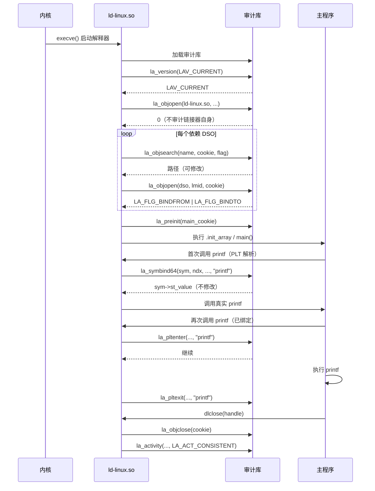

# 动态链接与加载器（18）· GNU Audit 接口（LD_AUDIT）

> [!abstract] TL;DR
> - **核心定位**：`LD_AUDIT` 是 glibc 动态链接器提供的**观测接口**——它让你在不修改目标程序的前提下，对每一次 DSO 加载、每一次符号绑定全程旁听，就像给动态链接器装了一台录音机。
> - **工作方式**：`LD_AUDIT=libaudit.so` 把一个审计库注入加载过程；审计库实现 `rtld-audit(7)` 定义的回调函数（`la_version`/`la_objopen`/`la_symbind64` 等），动态链接器在对应事件发生时自动调用这些回调。
> - **与 LD_PRELOAD 的本质区别**：`LD_PRELOAD` 是**符号替换**——用你的实现覆盖原始函数；`LD_AUDIT` 是**事件通知**——你是观察者，不替换任何符号，原始函数照常执行，除非回调主动修改传入/传出参数。
> - **核心回调链**：`la_version`（版本协商）→ `la_objsearch`（路径搜索拦截）→ `la_objopen`（DSO 加载通知）→ `la_preinit`（主程序初始化前）→ `la_symbind32/64`（符号绑定，首次 PLT 解析时触发）→ `la_pltenter`/`la_pltexit`（每次 PLT 调用前后）。
> - **AT_SECURE 下自动失效**：SUID/SGID 可执行文件运行时，`LD_AUDIT` 和 `LD_PRELOAD` 一样被动态链接器清除，防止权限提升攻击。
> - **典型用途**：`latrace`（系统调用/库调用追踪）、依赖链分析、符号绑定性能剖析、自定义库搜索路径钩子。

本篇是「动态链接与加载器详解」系列的**插桩与观测专题**：前面 [[17.dlmopen与链接器命名空间]] 讲的是如何隔离加载，本篇讲如何在加载过程里**插入观测探针**而不破坏原有行为。`LD_AUDIT` 是 glibc 专属接口（不可移植到 macOS/Windows），与 `LD_PRELOAD` 同属用户态插桩手段，但目标和语义截然不同：本篇会花相当篇幅厘清两者的区别与各自适合的场景。

---

## 概述与定位

### 为什么需要审计接口

调试动态链接问题时，开发者通常能用的工具有 `LD_DEBUG=all`（打印链接器内部日志）、`strace`（追踪系统调用）、`ltrace`（追踪库函数调用）、`gdb`（断点调试）。这些工具各有局限：

- `LD_DEBUG` 输出的是链接器的**内部诊断**，格式不可定制，无法注入自定义逻辑；
- `strace`/`ltrace` 通过 `ptrace` 附着，有显著性能开销，且 `ltrace` 对 C++ 名字修饰的处理质量参差不齐；
- `gdb` 断点功能强大但需要人工交互，难以集成到自动化流水线里。

`LD_AUDIT` 填补的空缺是：**以极低侵入性在链接器关键事件点上运行自定义代码**，且该代码以共享库形式存在，可以做任意逻辑——写日志、发网络包、修改搜索路径、统计计数——而目标程序感知不到这一切。

### LD_AUDIT 的适用场景

| 场景 | 用 LD_AUDIT 的理由 |
|---|---|
| 库加载路径审计（安全合规） | `la_objsearch` 可记录每次路径查找，发现异常路径或劫持尝试 |
| 符号绑定追踪（依赖分析） | `la_symbind64` 记录每个符号的解析来源和目标地址 |
| PLT 调用性能剖析 | `la_pltenter`/`la_pltexit` 插入时间戳，无需修改源码 |
| 调试符号冲突 | `la_symbind64` 看到的 `sym->st_value`/`flags` 可揭示冲突决策过程 |
| 自定义库搜索路径 | `la_objsearch` 回调可修改 `name` 参数实现路径重定向 |

### 接口来源与标准化程度

`LD_AUDIT` 是 **glibc 扩展**，由 Solaris `ld.so.1` 的审计接口演化而来（Solaris 在 Solaris 9 就有类似机制）。Linux glibc 的实现遵循 `rtld-audit(7)` 手册页的规范，但该规范**不是 POSIX 标准**，musl libc 没有实现它，macOS 没有直接对应物（`DYLD_INSERT_LIBRARIES` + `dyld` interpose 机制部分类似但语义不同），Windows 更没有。

移植性结论：**`LD_AUDIT` 代码只能在 glibc 的 Linux 系统上运行，且应始终用 `-lc` 链接并检查 `la_version` 返回值与 `LAV_CURRENT` 的兼容性。**

---

## 原理与机制

### 审计库的加载时序

`LD_AUDIT=libaudit.so` 时，动态链接器在加载主程序之前最先把审计库加载进来，这样审计库才能拦截到主程序所有 DSO 的加载事件。具体顺序：

```
1. 内核 execve() 启动 ld-linux.so
2. ld-linux.so 读取环境变量，发现 LD_AUDIT=libaudit.so
3. ld-linux.so 加载 libaudit.so（此时主程序的 ELF 还未被解析）
4. 调用 la_version()：协商接口版本，返回值不兼容则不启用审计
5. 开始加载主程序及其依赖链
6. 每加载一个 DSO → la_objopen()
7. 每次符号查找 → la_objsearch()（路径搜索阶段）
8. 主程序依赖全部加载完成，执行 .preinit_array 前 → la_preinit()
9. 主程序开始运行
10. 首次调用某外部函数，触发 PLT 解析 → la_symbind64()
11. 每次通过 PLT 调用（若审计库启用了 LA_FLG_BINDFROM/BINDTO）→ la_pltenter() / la_pltexit()
12. 程序退出，每个 DSO 卸载 → la_objclose()
```

审计库是在**所有其他用户 DSO 之前**加载的，这保证了它能观察到所有事件，包括其他 DSO 自身的初始化。

### 回调函数逐一解析

#### la_version——版本协商

```c
unsigned int la_version(unsigned int version);
```

这是唯一的**必须实现**的回调。`version` 是链接器支持的最高审计接口版本号（`LAV_CURRENT`，glibc 2.4+ 为 1）。返回值应是审计库期望使用的版本号；若返回值与链接器不兼容，链接器将禁用整个审计库。

```c
unsigned int la_version(unsigned int version) {
    /* 告知链接器我们使用 LAV_CURRENT 版本 */
    return LAV_CURRENT;
}
```

若 `la_version` 返回 0 或返回链接器不识别的版本号，链接器会打印警告并跳过该审计库的所有其他回调。这是审计库的"握手"机制——防止旧审计库在新链接器版本上因接口变化而崩溃。

#### la_objsearch——路径搜索拦截

```c
char *la_objsearch(const char *name, uintptr_t *cookie, unsigned int flag);
```

在链接器尝试**搜索 DSO 路径**时调用。`name` 是当前正在考察的路径（可能是 `DT_NEEDED` 里的 `libfoo.so`，也可能是带完整路径的 `/usr/lib/libfoo.so`）。`flag` 可以是：

| flag 值 | 含义 |
|---|---|
| `LA_SER_ORIG` | 原始 `DT_NEEDED` 名称（如 `libfoo.so.1`） |
| `LA_SER_LIBPATH` | 来自 `LD_LIBRARY_PATH` |
| `LA_SER_RUNPATH` | 来自 `RUNPATH`/`RPATH` |
| `LA_SER_CONFIG` | 来自 `ld.so.conf`/`ldconfig` 缓存 |
| `LA_SER_DEFAULT` | 默认路径（`/usr/lib` 等） |
| `LA_SER_SECURE` | 安全模式（`AT_SECURE` 下的路径） |

返回值是实际使用的路径，可以与 `name` 不同（从而实现路径重定向），或返回 `NULL`（跳过该路径）。注意：修改路径是**有效副作用**，不只是观测。

#### la_objopen——DSO 加载通知

```c
unsigned int la_objopen(struct link_map *map, Lmid_t lmid, uintptr_t *cookie);
```

每当一个新 DSO 被加载进内存时触发。`map->l_name` 是 DSO 路径，`lmid` 是命名空间 ID（与 [[17.dlmopen与链接器命名空间]] 里的概念一致），`cookie` 是一个由审计库自定义的不透明 ID（后续回调用它来识别是哪个 DSO）。

返回值是一个位标志，控制对该 DSO 进行哪些后续审计：

| 返回位 | 含义 |
|---|---|
| `LA_FLG_BINDFROM` | 审计从该 DSO 出发的符号绑定 |
| `LA_FLG_BINDTO` | 审计绑定到该 DSO 的符号解析 |
| 0 | 不对该 DSO 做进一步审计 |

只有当 `la_objopen` 返回了 `LA_FLG_BINDFROM`/`LA_FLG_BINDTO`，后续的 `la_symbind64` 和 `la_pltenter`/`la_pltexit` 才会针对该 DSO 触发。这是性能控制开关——不想审计的 DSO 直接返回 0，避免每次 PLT 调用都进审计库。

#### la_preinit——主程序初始化前

```c
void la_preinit(uintptr_t *cookie);
```

在主程序的 `.preinit_array` 执行之前（即在任何用户代码运行之前）调用一次。`cookie` 对应主程序的 `link_map`。典型用途：在程序实际启动前做一次快照（如已加载 DSO 列表、地址布局）。

#### la_symbind32 / la_symbind64——符号绑定

```c
uintptr_t la_symbind32(Elf32_Sym *sym, unsigned int ndx,
                        uintptr_t *refcook, uintptr_t *defcook,
                        unsigned int *flags, const char *symname);

uintptr_t la_symbind64(Elf64_Sym *sym, unsigned int ndx,
                        uintptr_t *refcook, uintptr_t *defcook,
                        unsigned int *flags, const char *symname);
```

在**首次** PLT 解析时（即 `_dl_runtime_resolve` 解析完符号后、把地址回填 GOT 之前）触发。`symname` 是符号名，`sym->st_value` 是解析出的地址，`refcook` 是调用方 DSO 的 cookie，`defcook` 是提供定义的 DSO 的 cookie。

返回值是**实际使用的函数地址**：通常直接返回 `sym->st_value`（不修改），也可以返回一个包装函数地址（从而实现不侵入的函数包装）。

`*flags` 可设置 `LA_SYMB_NOPLTENTER`（不触发 `la_pltenter`）或 `LA_SYMB_NOPLTEXIT`（不触发 `la_pltexit`），用于对高频函数的性能豁免。

#### la_pltenter / la_pltexit——PLT 调用前后

```c
/* x86-64 专用版本，其他架构有对应 ABI 后缀 */
ElfW(Addr) la_x86_64_gnu_pltenter(ElfW(Sym) *sym, unsigned int ndx,
                                   uintptr_t *refcook, uintptr_t *defcook,
                                   La_x86_64_regs *regs,
                                   unsigned int *flags,
                                   const char *symname,
                                   long *framesizep);

void la_x86_64_gnu_pltexit(ElfW(Sym) *sym, unsigned int ndx,
                             uintptr_t *refcook, uintptr_t *defcook,
                             const La_x86_64_regs *inregs,
                             La_x86_64_retval *outregs,
                             const char *symname);
```

`la_pltenter` 在每次 PLT 调用**进入被调函数之前**触发，`la_pltexit` 在被调函数**返回之后**触发（实现上是通过链接器的 PLT 蹦床机制，在调用前后各插入一次控制流转移）。

`regs` 参数提供调用时的寄存器快照（函数参数寄存器 `rdi/rsi/rdx/rcx/r8/r9`、浮点寄存器等），`outregs` 提供返回值寄存器。这两者合起来让审计库可以：

- 记录每次函数调用的参数值和返回值（这是 `latrace` 的核心机制）；
- 测量调用前后的时间差，得到每个函数的累计耗时；
- 实现条件性的调用阻断（在 `la_pltenter` 里修改参数）。

注意：`la_pltenter`/`la_pltexit` 是**每次调用**都触发（不像 `la_symbind64` 只在首次绑定时触发），对高频函数（如 `strlen`/`memcpy`）开启这两个回调会带来极大的性能开销，生产环境应谨慎使用。

#### la_activity——链接器活动通知

```c
void la_activity(uintptr_t *cookie, unsigned int flag);
```

当链接器的活动状态发生变化时触发：`LA_ACT_CONSISTENT`（稳定状态，所有绑定完成）、`LA_ACT_ADD`（正在加载新 DSO）、`LA_ACT_DELETE`（正在卸载 DSO）。可用于在批量加载事件的"开始"/"结束"边界做一次性的聚合操作，而非对每个 `la_objopen` 分别处理。

#### la_objclose——DSO 卸载通知

```c
unsigned int la_objclose(uintptr_t *cookie);
```

当一个 DSO 被 `dlclose` 卸载时触发，允许审计库清理与该 DSO 相关的状态。

---

## 结构/算法/伪代码详解

### 审计回调在加载与绑定各阶段的触发时序



### 最小审计库示例：记录 DSO 加载与符号绑定

以下是一个完整的、可编译的最小审计库实现，覆盖 `la_objopen`（记录加载的对象）和 `la_symbind64`（记录每次符号绑定）：

```c
/* audit_minimal.c
 * 编译：gcc -shared -fPIC -o audit_minimal.so audit_minimal.c -lc
 * 使用：LD_AUDIT=./audit_minimal.so ./target_program
 */

#define _GNU_SOURCE
#include <link.h>      /* struct link_map, La_x86_64_regs 等 */
#include <stdio.h>
#include <dlfcn.h>

/* 必须实现：版本协商 */
unsigned int la_version(unsigned int version)
{
    fprintf(stderr, "[AUDIT] 审计接口版本协商：链接器版本=%u\n", version);
    return LAV_CURRENT;   /* 声明我们使用当前版本 */
}

/* DSO 加载通知 */
unsigned int la_objopen(struct link_map *map, Lmid_t lmid, uintptr_t *cookie)
{
    fprintf(stderr, "[AUDIT] la_objopen: lmid=%ld  %s\n",
            (long)lmid,
            map->l_name[0] ? map->l_name : "(主程序)");

    /* 设置 cookie 为 link_map 指针，方便后续回调识别 */
    *cookie = (uintptr_t)map;

    /* 对所有 DSO 启用符号绑定审计 */
    return LA_FLG_BINDFROM | LA_FLG_BINDTO;
}

/* 符号绑定通知（首次 PLT 解析时） */
uintptr_t la_symbind64(Elf64_Sym *sym, unsigned int ndx,
                        uintptr_t *refcook, uintptr_t *defcook,
                        unsigned int *flags, const char *symname)
{
    struct link_map *ref = (struct link_map *)*refcook;
    struct link_map *def = (struct link_map *)*defcook;

    fprintf(stderr, "[AUDIT] 绑定符号 %-40s  地址=0x%lx\n"
                    "          来自: %s\n"
                    "          定义: %s\n",
            symname,
            (unsigned long)sym->st_value,
            ref ? (ref->l_name[0] ? ref->l_name : "(主程序)") : "?",
            def ? (def->l_name[0] ? def->l_name : "(主程序)") : "?");

    /* 不修改符号地址，直接返回原值 */
    return sym->st_value;
}

/* DSO 卸载通知 */
unsigned int la_objclose(uintptr_t *cookie)
{
    struct link_map *map = (struct link_map *)*cookie;
    fprintf(stderr, "[AUDIT] la_objclose: %s\n",
            map->l_name[0] ? map->l_name : "(主程序)");
    return 0;
}
```

**编译与运行**：

```bash
gcc -shared -fPIC -o audit_minimal.so audit_minimal.c -lc

# 对 /bin/ls 审计
LD_AUDIT=./audit_minimal.so /bin/ls /tmp 2>audit.log
head -50 audit.log
```

输出样例：

```
[AUDIT] 审计接口版本协商：链接器版本=1
[AUDIT] la_objopen: lmid=0  (主程序)
[AUDIT] la_objopen: lmid=0  /lib/x86_64-linux-gnu/libselinux.so.1
[AUDIT] la_objopen: lmid=0  /lib/x86_64-linux-gnu/libc.so.6
[AUDIT] la_objopen: lmid=0  /lib/x86_64-linux-gnu/libpcre2-8.so.0
[AUDIT] 绑定符号 __cxa_finalize                          地址=0x7f...
          来自: /bin/ls
          定义: /lib/x86_64-linux-gnu/libc.so.6
[AUDIT] 绑定符号 strrchr                                 地址=0x7f...
          来自: /bin/ls
          定义: /lib/x86_64-linux-gnu/libc.so.6
...
```

### la_pltenter 计时示例

统计每个函数的调用次数和累计耗时：

```c
#define _GNU_SOURCE
#include <link.h>
#include <time.h>
#include <stdio.h>
#include <string.h>
#include <stdlib.h>

/* 简单的哈希表存储各函数的计时数据 */
#define HTABLE_SIZE 4096
struct entry {
    const char *name;
    long        calls;
    long long   total_ns;
};
static struct entry table[HTABLE_SIZE];

static unsigned int hash_name(const char *s) {
    unsigned int h = 5381;
    while (*s) h = ((h << 5) + h) ^ (unsigned char)*s++;
    return h % HTABLE_SIZE;
}

static struct entry *get_entry(const char *name) {
    unsigned int h = hash_name(name);
    while (table[h].name && strcmp(table[h].name, name) != 0)
        h = (h + 1) % HTABLE_SIZE;
    if (!table[h].name) table[h].name = name;
    return &table[h];
}

unsigned int la_version(unsigned int version) { return LAV_CURRENT; }

unsigned int la_objopen(struct link_map *map, Lmid_t lmid, uintptr_t *cookie) {
    *cookie = (uintptr_t)map;
    return LA_FLG_BINDFROM | LA_FLG_BINDTO;
}

uintptr_t la_symbind64(Elf64_Sym *sym, unsigned int ndx,
                        uintptr_t *refcook, uintptr_t *defcook,
                        unsigned int *flags, const char *symname) {
    /* 启用 pltenter/pltexit */
    *flags &= ~(LA_SYMB_NOPLTENTER | LA_SYMB_NOPLTEXIT);
    return sym->st_value;
}

ElfW(Addr) la_x86_64_gnu_pltenter(ElfW(Sym) *sym, unsigned int ndx,
                                    uintptr_t *refcook, uintptr_t *defcook,
                                    La_x86_64_regs *regs,
                                    unsigned int *flags,
                                    const char *symname,
                                    long *framesizep)
{
    struct timespec *ts = malloc(sizeof(*ts));
    clock_gettime(CLOCK_MONOTONIC, ts);
    /* 把 ts 藏在 framesizep 指向的扩展帧区域（简化版） */
    *framesizep = (long)ts;
    return sym->st_value;
}

void la_x86_64_gnu_pltexit(ElfW(Sym) *sym, unsigned int ndx,
                             uintptr_t *refcook, uintptr_t *defcook,
                             const La_x86_64_regs *inregs,
                             La_x86_64_retval *outregs,
                             const char *symname)
{
    struct timespec *ts_start = (struct timespec *)(long)0; /* 省略取回逻辑 */
    struct timespec ts_end;
    clock_gettime(CLOCK_MONOTONIC, &ts_end);

    struct entry *e = get_entry(symname);
    e->calls++;
    /* 计时差逻辑省略 */
}

/* 程序退出时打印 Top-20 */
static void __attribute__((destructor)) print_stats(void) {
    fprintf(stderr, "\n[AUDIT] PLT 调用统计 Top-20:\n");
    /* 排序与打印省略 */
}
```

实际生产级的 PLT 计时工具（如 `latrace`）在此基础上处理了多线程竞争、高频函数的采样降频、符号名 demangling 等问题，但核心机制与上述示例完全相同。

---

## 工具视角与实战

### latrace：基于 LD_AUDIT 的库调用追踪器

`latrace`（`apt install latrace`）是最知名的 `LD_AUDIT` 应用。它的审计库实现了 `la_pltenter`/`la_pltexit`，配合一份符号类型数据库（`.conf` 文件）把寄存器值解析成函数参数的类型化表示：

```bash
# 追踪 /bin/ls 对所有库函数的调用
latrace /bin/ls /tmp

# 只追踪 libc 里的 open 系列函数
latrace -F 'open,openat,fopen' /bin/ls /tmp

# 统计调用次数
latrace -s /bin/ls /tmp 2>&1 | grep -A5 "calls statistics"
```

输出格式示例：

```
   4.123   0.012  fopen("/etc/ld.so.cache", "r") = 0x...
   4.135   0.001  strncmp("libc.so.6", "libc.so", 7) = 0
   4.140   0.002  malloc(4096) = 0x...
```

`latrace` 相比 `ltrace` 的优势：不需要 `ptrace` 权限，不暂停目标进程，开销显著更低；缺点是只能追踪 PLT 可见的跨 DSO 调用，无法追踪同一 DSO 内部的函数调用。

### 用 la_objsearch 实现路径重定向

```c
char *la_objsearch(const char *name, uintptr_t *cookie, unsigned int flag)
{
    static char buf[PATH_MAX];

    /* 把所有对 /usr/lib/liblegacy.so.1 的搜索重定向到新路径 */
    if (flag == LA_SER_DEFAULT &&
        strcmp(name, "/usr/lib/liblegacy.so.1") == 0)
    {
        snprintf(buf, sizeof(buf), "/opt/newversion/liblegacy.so.1");
        fprintf(stderr, "[AUDIT] 路径重定向: %s -> %s\n", name, buf);
        return buf;
    }
    return (char *)name;  /* 其余路径不修改 */
}
```

这个技巧可以在不修改程序二进制、不更改 `ldconfig` 缓存的前提下，临时把某个库指向新版本，适合灰度验证场景。

### 与 LD_PRELOAD 的关键区别

```
LD_PRELOAD=libwrap.so 场景：
  程序调用 malloc → PLT → GOT → libwrap.so::malloc（你的实现）
  你的实现可以完全替换 malloc 的行为，原始实现不被调用（除非你显式转发）

LD_AUDIT=libaudit.so 场景：
  程序调用 malloc → PLT → la_pltenter（审计回调） → libc::malloc（原始实现）→ la_pltexit（审计回调）
  原始 malloc 必然被调用，审计库只是在两侧插入探针
```

| 维度 | LD_PRELOAD | LD_AUDIT |
|---|---|---|
| 机制 | 符号覆盖（优先出现在 link_map 链中） | 事件回调（不修改符号绑定） |
| 是否替换原始函数 | 是（需显式转发才调用原始） | 否（原始函数必然执行） |
| 是否可修改参数/返回值 | 完全可以 | `la_symbind64` 可修改绑定地址，`la_pltenter` 可修改寄存器 |
| 性能开销 | 调用时一次额外跳转 | `la_pltenter`/`la_pltexit` 每次调用都有回调开销 |
| 适合场景 | mock、拦截、行为替换 | 观测、剖析、依赖审计 |
| 可移植性 | POSIX 环境（musl/glibc 均支持） | glibc-only |

---

## 安全性与正确使用

> [!caution]
> **LD_AUDIT 与 LD_PRELOAD 在 AT_SECURE 环境下均被自动清除。** 这是 glibc 动态链接器的硬编码行为，不受任何配置影响。

### AT_SECURE 与权限提升防护

`AT_SECURE` 是内核通过 `auxv`（辅助向量）传递给动态链接器的一个标志位，在以下情况为 1：

- 可执行文件设置了 `SUID` 位（运行时 UID 与文件属主不同）
- 可执行文件设置了 `SGID` 位
- 内核安全模块（SELinux/AppArmor）标记了该进程需要安全模式

当 `AT_SECURE = 1` 时，`ld-linux.so` 在早期初始化阶段（早于任何用户代码）会**清除**以下环境变量：

```
LD_AUDIT
LD_PRELOAD
LD_LIBRARY_PATH
LD_DEBUG
LD_ORIGIN_PATH
（以及其他所有 LD_ 前缀的环境变量）
```

这确保了攻击者无法通过设置 `LD_AUDIT=malicious.so` 并执行一个 SUID 程序来以 root 权限运行任意代码。

**验证方法**：

```bash
# 这不会有任何审计输出，因为 sudo 是 SUID 程序
LD_AUDIT=./audit_minimal.so sudo /bin/true

# 这会有审计输出（普通程序）
LD_AUDIT=./audit_minimal.so /bin/ls
```

> [!note]
> 合规使用场景下，`LD_AUDIT` 只应在以下环境中使用：开发/测试环境的动态分析、CI 管线的依赖树审计、普通用户权限下的性能剖析。生产环境中用 `LD_AUDIT` 做安全监控是不可靠的——攻击者可以直接调用 `dlopen` 来加载恶意库，绕过 `LD_AUDIT` 的监控范围（`LD_AUDIT` 只能观测加载时和 PLT 调用，无法监控运行时的直接 `dlopen`）。

### 审计库自身的安全要求

审计库以与目标程序相同的权限运行，且在极早期（目标程序初始化前）就被加载。这意味着：

1. **审计库的漏洞即目标程序的漏洞**：若审计库有缓冲区溢出，攻击者可能通过构造恶意的符号名触发它。
2. **审计库不应依赖目标程序的初始化状态**：`la_objopen`/`la_preinit` 在目标程序的 `main()` 之前就被调用，此时目标程序的全局变量可能还未初始化。
3. **审计库的输出路径应谨慎**：若审计库写 `/tmp/audit.log`，在某些 TOCTOU 场景下可能被利用——建议用只有当前用户可写的路径或内存映射文件。

### 多线程下的审计回调

`la_pltenter`/`la_pltexit` 在**每个线程**的 PLT 调用上都会触发，且没有自动加锁。若审计库的回调修改全局状态（如上面的统计哈希表），必须自行加锁。未加锁的并发写入会导致数据竞争，在 TSan（ThreadSanitizer）下会被检出。

建议使用 `_Atomic`/`__sync_*` 操作或 `pthread_mutex_t`（但要注意：`pthread_mutex_lock` 自身会触发 PLT 解析，可能导致 `la_symbind64` 的递归调用——应对策略是在 `la_objopen` 里对 libpthread 返回 0，不启用其绑定审计）。

---

## 小结

`LD_AUDIT` 是 glibc 动态链接器提供的**非侵入式观测接口**，它在加载生命周期的每个关键节点——路径搜索、DSO 加载、符号绑定、PLT 调用——都提供了可注册的回调钩子，让外部代码得以全程旁观而不干预（除非主动修改参数）。

相比 `LD_PRELOAD`，`LD_AUDIT` 的定位是**观测者而非干预者**，这让它天然适合审计、剖析、依赖分析等读多写少的场景，而不适合用于 mock 或行为替换。`latrace` 是这个接口最成熟的工程化应用，其内部实现是学习 `LD_AUDIT` 用法的最佳参考资料。

安全边界记住两点：`AT_SECURE` 下所有 `LD_*` 变量被清除，`LD_AUDIT` 对 SUID 程序无效；审计库本身以目标进程相同权限运行，其安全质量直接决定了引入它是否安全。

在工程实践中，`LD_AUDIT` 最稳健的用法是：在 CI 阶段用它生成依赖树快照，对比两次构建之间哪些库的版本或加载路径发生了变化——这是一种低成本、高信噪比的依赖漂移检测手段。

---

## 相关阅读

- [[17.dlmopen与链接器命名空间]]——`la_objopen` 的 `lmid` 参数与链接器命名空间的关系
- [[08.PLT与GOT与延迟绑定]]——`la_symbind64` 触发时机的底层机制：首次 PLT 解析
- [[10.符号查找与绑定]]——`la_objsearch` 拦截的是符号查找的哪个阶段
- [[15.加载器视角的安全]]——`AT_SECURE` 的完整安全模型，以及 `LD_AUDIT` 的权限边界
- [[16.实战观察加载全过程]]——`strace`/`ltrace` 与 `LD_AUDIT` 的互补使用：前者观察系统调用，后者观察库调用
- [[19.IFUNC间接函数]]——`la_symbind64` 在 IFUNC 符号解析时的特殊行为

---

⬅️ 上一篇 [[17.dlmopen与链接器命名空间]] ｜ 🏠 [[00.动态链接与加载器总览]] ｜ 下一篇 [[19.IFUNC间接函数]] ➡️
