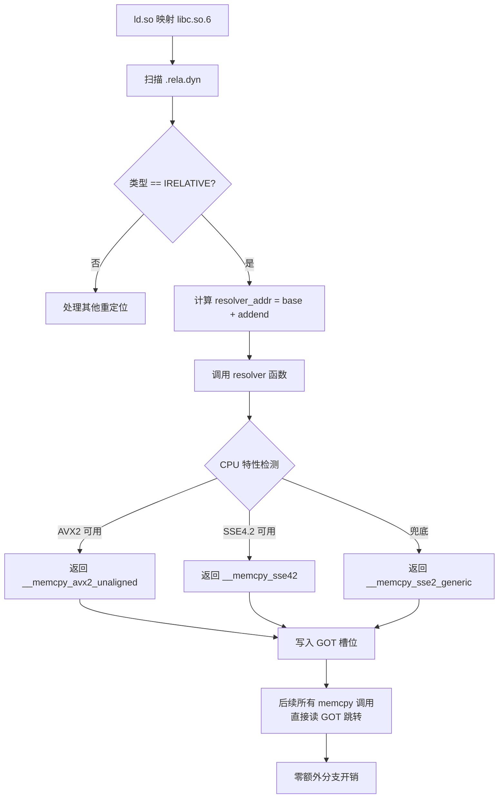

# 动态链接与加载器（19）· IFUNC（STT_GNU_IFUNC）间接函数

> [!abstract] TL;DR
> - **IFUNC 是什么**：`STT_GNU_IFUNC` 是 GNU 扩展的一种 ELF 符号类型，允许在加载期（而非编译期）动态选择某函数的实际实现版本，通过一个 **resolver 函数**返回最终要调用的函数指针。
> - **核心机制**：resolver 由动态链接器在处理 `R_X86_64_IRELATIVE`（或经 PLT `R_X86_64_JUMP_SLOT` 的 IFUNC 变体）时调用，resolver 返回的函数指针被回填到对应 GOT 槽位，之后所有调用都直达该实现版本，无额外开销。
> - **最典型用途**：glibc 用 IFUNC 实现 `memcpy`、`strlen`、`memset` 等热路径函数的 CPU 特性分发——resolver 在运行时通过 `__builtin_cpu_supports("avx2")` 等检查选择 AVX2/SSE4.2/SSE2/generic 实现，一次选择、永久生效。
> - **逆向挑战**：`R_X86_64_IRELATIVE` 重定位不携带符号名，逆向工具在解析之前看到的 GOT 槽里是"一个 resolver 函数地址"而非最终目标；需要手动执行 resolver 逻辑才能还原实际跳转目标。
> - **安全与陷阱**：resolver 在极早期（甚至早于 `_start` 用户空间初始化）运行，不能依赖尚未建立的 libc、TLS、`errno` 等基础设施；musl libc 明确不支持 IFUNC。

本篇聚焦一个在 glibc 源码里无处不在、却很少被系统性讲解的机制——**IFUNC 间接函数**。它是 ELF 符号类型扩展与动态链接器协作的产物，理解它需要同时掌握重定位类型（参见 [[07.重定位机制详解]]）、PLT/GOT 机制（参见 [[08.PLT与GOT与延迟绑定]]）和动态链接器的启动流程（参见 [[03.动态链接器启动流程]]）。IFUNC 与 TLSDESC（[[17.TLS线程本地存储]]）在设计哲学上高度类似：都是"在 GOT/描述符槽里存一个间接层，加载时解析一次换掉它"。

---

## 概述与定位

### 问题背景：同一函数，不同 CPU 要不同实现

现代 x86-64 处理器的 SIMD 能力差异极大：2010 年的 Core 2 没有 AVX，2013 年的 Haswell 有 AVX2，2017 年的 Skylake-X 有 AVX-512。对于 `memcpy` 这类极度热路径的函数，使用 AVX2 向量化实现与通用 SSE2 实现的性能差距可达 2～4 倍。

在没有 IFUNC 之前，glibc 的解决方案是**运行时 ifunc dispatch**——把 `memcpy` 做成一个普通函数，函数体第一件事就是检查 CPU 特性、用一个函数指针变量记住"真正的实现"，之后每次调用都走这个指针。这个方案有一个显而易见的缺陷：**每次调用都要多一次间接跳转和 CPU 特性变量的读取**，对热循环来说这不可接受。

IFUNC 的设计目标是**把这个"选一次"的代价精确地摊销到加载时、后续调用零额外开销**：动态链接器在加载阶段调用 resolver，得到最终函数地址，直接写入 GOT 槽位，之后所有调用路径直接读 GOT 拿地址，与普通符号解析后的效果完全等价。

### IFUNC 在符号体系中的位置

ELF 标准定义了若干符号类型（`st_info` 低 4 位）：

| 类型值 | 名称 | 含义 |
|--------|------|------|
| 0 | `STT_NOTYPE` | 类型未指定 |
| 1 | `STT_OBJECT` | 数据对象 |
| 2 | `STT_FUNC` | 函数 |
| 10 | `STT_GNU_IFUNC` | GNU 扩展：间接函数 |

`STT_GNU_IFUNC` 是 GNU 对 ELF 规范的扩展，值为 10（十六进制 `0xa`）。当链接器或动态链接器遇到此类型符号时，**其地址不是最终调用目标，而是一个 resolver 函数的地址**。

---

## 原理与机制

### `__attribute__((ifunc("resolver")))` 写法

在 C/C++ 源码层面，通过 GCC/Clang 的 `ifunc` 属性声明间接函数：

```c
/* 声明一个 ifunc 符号 my_memcpy，resolver 名为 my_memcpy_resolver */
void *my_memcpy(void *dst, const void *src, size_t n)
    __attribute__((ifunc("my_memcpy_resolver")));

/* resolver：必须返回函数指针，类型需与 ifunc 符号完全一致 */
static void *(*my_memcpy_resolver(void))(void *, const void *, size_t) {
    if (__builtin_cpu_supports("avx2"))
        return my_memcpy_avx2;
    if (__builtin_cpu_supports("sse4.2"))
        return my_memcpy_sse42;
    return my_memcpy_generic;
}
```

**resolver 函数签名规则**（这是最容易出错的地方）：
- resolver 本身**无参数**（`void`），或在某些 ABI 下接受 `uint64_t hwcap` 参数（ARM/AArch64 会把硬件能力向量作为参数传入）。
- resolver 的**返回值类型**是"与 ifunc 符号具有相同签名的函数指针"，即 `返回类型 (*)(参数列表)`。
- resolver 本身是 `static` 的，不需要导出；编译器会在编译单元内生成对应的 `STT_GNU_IFUNC` 符号条目和必要的重定位条目。

### 重定位类型：`R_X86_64_IRELATIVE`

IFUNC 引入了一个专门的重定位类型 `R_X86_64_IRELATIVE`（类型编号 37，`0x25`）。其语义是：

> **计算 `B + A`（其中 B 是加载基址，A 是重定位条目的 addend），得到 resolver 函数在内存中的地址，调用它，把返回的函数指针写入重定位位置（GOT 槽）。**

与普通 `R_X86_64_RELATIVE`（仅做 `*loc = B + A`）的关键差别在于：IRELATIVE **多一步调用**，让 resolver 在运行时决定最终值。

`R_X86_64_IRELATIVE` 条目存放在 `.rela.dyn` 节（不是 `.rela.plt`），因为它必须在加载早期、其他代码执行前处理完毕——包括 `_start` 之前。重定位条目结构：

```
Elf64_Rela {
    r_offset: GOT 槽位地址（运行时绝对地址）
    r_info:   R_X86_64_IRELATIVE（sym = 0，因为没有符号引用）
    r_addend: resolver 函数相对于文件基址的偏移
}
```

注意 `r_info` 中符号索引为 0——**IRELATIVE 不绑定任何符号名**，这正是逆向工具看不到符号名的根本原因。

### 经由 PLT 的 IFUNC 路径

除了 `.rela.dyn` 中的 `IRELATIVE` 外，IFUNC 符号还可以通过 PLT 进行延迟解析（类似普通函数的 `JUMP_SLOT`）。此时重定位类型为 `R_X86_64_JUMP_SLOT`，但对应的符号类型为 `STT_GNU_IFUNC`，动态链接器遇到时知道需要额外调用 resolver。

两种路径的对比：

| 路径 | 重定位类型 | 位置 | 解析时机 |
|------|-----------|------|---------|
| `.rela.dyn` 直接解析 | `R_X86_64_IRELATIVE` | 可执行文件/DSO 自身 | 加载阶段（早于 `_start`）|
| 经 PLT 延迟解析 | `R_X86_64_JUMP_SLOT` + `STT_GNU_IFUNC` | 跨 DSO 引用 | 首次调用时（或 `BIND_NOW` 下在加载时）|

glibc 内部自用的 `memcpy` 等多采用第一种路径（IRELATIVE），因为 libc.so 自身内部调用，不走跨 DSO 的 PLT。

---

## 结构与算法与伪代码详解

### 动态链接器处理 IRELATIVE 的流程

```
function process_irelative_relocations(load_base, rela_dyn):
    for each rela in rela_dyn where type == R_X86_64_IRELATIVE:
        resolver_addr = load_base + rela.r_addend   // resolver 在内存中的地址
        resolver_fn   = (FuncPtr(*)())resolver_addr  // 强转为 resolver 函数指针
        result        = resolver_fn()                // 调用 resolver，得到实际实现地址
        *rela.r_offset = result                      // 把实际实现写入 GOT 槽
```

这个过程在动态链接器完成自身重定位（self-relocation）之后、执行任何用户代码之前运行。对于 glibc 的 `memcpy` 来说，整个链路如下：

1. `ld.so` 将 `libc.so.6` 映射入内存。
2. `ld.so` 扫描 `libc.so.6` 的 `.rela.dyn`，发现若干 `IRELATIVE` 条目。
3. 对每个条目：计算 `resolver = base + addend`，调用 resolver，获得实际 `memcpy` 实现地址（如 `__memcpy_avx_unaligned`），写入对应 GOT 槽。
4. 之后所有对 `memcpy` 的调用（通过该 GOT 槽的间接 call）直达 AVX 版本，无任何额外分支。

### glibc 中 `memcpy` IFUNC resolver 的结构（简化）

glibc 源码位于 `sysdeps/x86_64/multiarch/memcpy.c` 附近，resolver 的逻辑大致为：

```c
/* glibc ifunc resolver 伪代码（简化自实际源码） */
static __typeof(memcpy) *
memcpy_ifunc_resolver(void) {
    const struct cpu_features *features = __get_cpu_features();

    if (CPU_FEATURE_USABLE_P(features, AVX512F)
        && !PREFER_NO_AVX512(features))
        return __memcpy_avx512_no_vzeroupper;

    if (CPU_FEATURE_USABLE_P(features, AVX))
        return __memcpy_avx_unaligned;

    if (CPU_FEATURE_USABLE_P(features, SSSE3))
        return __memcpy_ssse3_back;

    return __memcpy_sse2_unaligned;   /* 兜底 */
}
```

注意 glibc 内部用的是 `__get_cpu_features()` 而非简单的 `__builtin_cpu_supports()`，后者背后也会走 CPUID 缓存，但 glibc 有自己更精细的特性查询机制。**关键约束是**：resolver 调用时 glibc 的 `__cpu_features` 全局变量必须已经初始化——这由 `ld.so` 在处理 IRELATIVE 之前先做 CPU 特性探测来保证。

### Mermaid：IFUNC resolver 解析与 GOT 填充流程



### ARM64 的 hwcap 参数变体

在 AArch64 上，IFUNC resolver 的签名有所不同：

```c
/* AArch64 resolver 接受 hwcap 参数 */
static void *(*aarch64_memcpy_resolver(uint64_t hwcap))(void *, const void *, size_t) {
    if (hwcap & HWCAP_ASIMD)
        return memcpy_asimd_impl;
    return memcpy_generic;
}
```

动态链接器会把 AT_HWCAP（来自内核的辅助向量）作为参数传给 resolver。这是 AArch64 ABI 的扩展，x86-64 的 resolver 无参数。

---

## 工具视角与实战

### 用 `readelf` 查看 IRELATIVE 重定位

```bash
# 查看 libc.so.6 的 .rela.dyn，过滤 IRELATIVE
$ readelf -r /lib/x86_64-linux-gnu/libc.so.6 | grep IRELATIVE | head -20
0000000001e09460  0000000000000025 R_X86_64_IRELATIVE                 16a8e0
0000000001e09468  0000000000000025 R_X86_64_IRELATIVE                 16a990
0000000001e09470  0000000000000025 R_X86_64_IRELATIVE                 16b380
# addend 列（最右）是 resolver 的文件偏移
```

注意 `r_info` 的符号部分为 0，没有符号名——这就是"IRELATIVE 不携带符号名"的直接体现。

### 用 `objdump` 查看 IFUNC 符号

```bash
# 查看 glibc 源码编译后的 memcpy.o，观察 STT_GNU_IFUNC
$ objdump -t sysdeps/x86_64/multiarch/memcpy.o | grep IFUNC
0000000000000000 g     F .text  0000000000000000 .hidden memcpy [IFUNC]
```

`[IFUNC]` 标记说明该符号类型为 `STT_GNU_IFUNC`，其地址是 resolver 地址而非实际 memcpy 实现。

### 用 GDB 调试 resolver 调用

```bash
# 在 resolver 被调用时打断点
(gdb) break __memcpy_ifunc_resolver
# 或直接在 ld.so 处理 IRELATIVE 时捕获
(gdb) catch load libc.so.6
(gdb) run
# 此时 libc 刚加载，resolver 尚未执行
(gdb) watch *(void**)&memcpy_got_slot
```

实际调试时，resolver 在 `ld-linux-x86-64.so.2` 的 `elf_ifunc_invoke` 函数内被调用（glibc 源码 `sysdeps/generic/dl-irel.h`）。

### 逆向识别 IFUNC 符号

在 IDA Pro 或 Ghidra 中分析未符号化的二进制时，IFUNC 的特征是：

1. **GOT 槽位在加载前后值不同**：加载前 GOT 槽指向某个"看起来像函数序言"的地址（resolver），加载后变成另一个地址（实际实现）。
2. **IRELATIVE 重定位条目无符号名**：`readelf -r` 显示 sym=0，无法从重定位表直接知道函数名。
3. **resolver 函数体特征**：通常包含 CPUID 指令或对 CPU 特性缓存结构体的读取，最后 `ret` 返回一个函数指针。

逆向恢复步骤：
1. 找到 `IRELATIVE` 重定位条目，记录其 addend（resolver 偏移）。
2. 跳转到 `base + addend`，分析 resolver 逻辑，找出所有可能的返回值（各实现版本地址）。
3. 根据运行环境的 CPU 特性，推断实际生效的实现版本。
4. 在 IDA/Ghidra 中手动给 GOT 槽打上"实际实现名"的注释。

---

## 安全性与正确使用

> [!caution]
> **IFUNC resolver 的极早期执行环境**
>
> IFUNC resolver（特别是 `R_X86_64_IRELATIVE` 路径）在动态链接器处理重定位期间被调用，此时：
> - **TLS（线程本地存储）尚未建立**：不能访问 `errno`、`__thread` 变量等任何 TLS 存储。
> - **libc 初始化尚未完成**：不能调用 `malloc`、`printf` 或任何依赖 libc 内部状态的函数（即使 resolver 在 libc 自身内部）。
> - **C++ 全局构造函数尚未运行**：不能依赖任何全局对象的初始化状态。
> - **唯一安全的操作**：读 CPUID（或 AT_HWCAP 辅助向量），访问编译期已知的常量，返回函数指针。
>
> 违反这些约束会导致启动期段错误或静默数据损坏，且极难调试，因为崩溃发生在调试器符号系统建立之前。

> [!note]
> **BIND_NOW 下 IFUNC 的行为**
>
> 当设置 `LD_BIND_NOW=1` 或链接时启用 `-z now`（Full RELRO 的一部分），所有 PLT 路径的 IFUNC（`JUMP_SLOT` + `STT_GNU_IFUNC`）都在加载时被解析——即 resolver 在启动期就被调用，不等首次调用。这意味着：
> - 安全上，所有间接层在程序运行前就已消除，无法通过 GOT 改写劫持 IFUNC。
> - 性能上，启动时多了 resolver 调用开销，但数量通常很少（一个 resolver 对应一类函数），可忽略。
> - `.rela.dyn` 中的 `IRELATIVE` 条目本来就在加载时处理，不受 BIND_NOW 影响（它不走 PLT 的延迟路径）。

### IFUNC 与 GOT 改写攻击

在 CTF 和实际漏洞利用中，IFUNC 带来了一个额外的攻击面：如果攻击者能在 resolver 执行之前（即 libc 加载阶段）覆写 resolver 指针（`rela.r_addend` 对应的内存），可以让 resolver 指向任意地址。不过由于 resolver 在 `ld.so` 内部执行时内存布局尚未完全建立，实际利用非常复杂，通常不作为首选攻击路径。

### musl 不支持 IFUNC

musl libc 明确拒绝实现 `STT_GNU_IFUNC` 支持，其设计哲学是"不引入 glibc 的复杂性扩展"。在 musl 系统（Alpine Linux 等）上：
- 链接使用 IFUNC 的 glibc 编译的共享库会失败（`undefined symbol` 或 relocation 错误）。
- musl 的 `memcpy` 等使用编译器自动向量化，而非运行时分发。
- 如果需要 CPU 特性分发，musl 建议使用 `ifunc`-free 的方案（如函数指针全局变量在 `__attribute__((constructor))` 中初始化）。

### IFUNC 与 TLSDESC 的类比

TLSDESC（[[17.TLS线程本地存储]] 详述）与 IFUNC 共享同一设计模式：

| 维度 | IFUNC | TLSDESC |
|------|-------|---------|
| 槽内容（初始）| resolver 函数指针 | `_dl_tlsdesc_resolve` + 重定位信息 |
| 槽内容（解析后）| 实际实现函数指针 | `_dl_tlsdesc_return` + TLS 偏移 |
| 触发解析的时机 | 加载期（IRELATIVE）或首次调用（PLT）| 首次访问该 TLS 变量时 |
| 解析后开销 | 零（单次间接 call）| 极低（两条指令：call + ret）|

两者都体现了"**在 GOT/描述符里放一个函数指针，加载/首次调用时把它换成高效的直接值**"的统一设计哲学。

---

## 小结

`STT_GNU_IFUNC` 是动态链接器与编译器工具链协作实现**运行时 CPU 特性分发**的机制，它把"选择哪个实现版本"的代价精确地摊销到加载阶段，后续调用与普通符号解析后的效果完全等价——单次 GOT 间接跳转。

核心要点：
- **符号类型** `STT_GNU_IFUNC`：地址是 resolver，不是实现本身。
- **重定位类型** `R_X86_64_IRELATIVE`：无符号名，动态链接器调用 resolver 后写入 GOT 槽。
- **resolver 约束**：极早期执行，不能依赖 TLS、libc 初始化状态，只能做 CPUID 查询和指针返回。
- **glibc 用例**：`memcpy`/`strlen`/`memset` 等通过 IFUNC 在 AVX512/AVX2/SSE4.2/SSE2/generic 间按 CPU 能力自动分发。
- **逆向挑战**：IRELATIVE 不携带符号名，需分析 resolver 逻辑才能还原实际跳转目标。
- **musl 不支持**：IFUNC 是 GNU 扩展，不在 musl 设计范围内。

---

## 相关阅读

- **重定位机制全貌（IRELATIVE 上下文）**：[[07.重定位机制详解]]
- **PLT/GOT 延迟绑定（IFUNC 经 PLT 的路径）**：[[08.PLT与GOT与延迟绑定]]
- **动态链接器启动流程（resolver 被调用的时机）**：[[03.动态链接器启动流程]]
- **TLS 与 TLSDESC（与 IFUNC 类比的间接层设计）**：[[17.TLS线程本地存储]]
- **GNU Audit 接口（同属 GNU 扩展的动态链接钩子）**：[[18.GNU_Audit接口]]
- **静态 PIE（IRELATIVE 在 static-pie 自举中的核心地位）**：[[20.静态PIE]]
- **RELRO 与 BIND_NOW（关闭延迟绑定影响 IFUNC 的加载时机）**：[[15.加载器视角的安全]]

---

⬅️ 上一篇 [[18.GNU_Audit接口]] ｜ 🏠 [[00.动态链接与加载器总览]] ｜ 下一篇 [[20.静态PIE]] ➡️