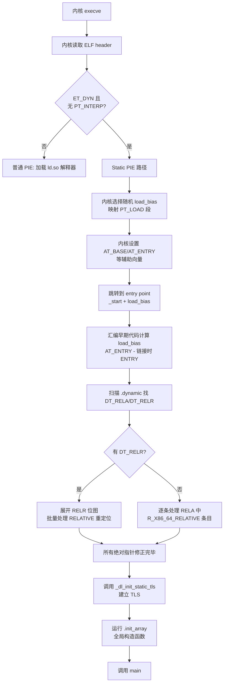

# 动态链接与加载器（20）· 静态 PIE（Static PIE）

> [!abstract] TL;DR
> - **Static PIE 是什么**：静态链接 + 位置无关可执行文件。与普通静态可执行文件不同，static-pie 输出 `ET_DYN` 类型 ELF，没有 `PT_INTERP`（不依赖外部 `ld.so`），但在 `_start` 执行用户代码前，**由可执行文件自身完成对自己的重定位**（self-relocation），因此可以被内核加载到随机基址（ASLR）。
> - **自举核心**：`_start` 的最早期代码（或专用的 `_dl_relocate_static_pie` 函数）扫描自身的 `.rela.dyn`，处理所有 `R_*_RELATIVE` 重定位，将加载偏移（`load_bias`）加到每个需要修正的指针上，使程序内部的绝对指针全部正确，之后才能调用 C 函数、设置 TLS、运行全局构造函数。
> - **为何需要**：容器镜像中去掉 `ld.so` 的最小化部署、内核级工具（早于 `ld.so` 初始化）、以及需要 ASLR 保护却无动态链接环境的场景。
> - **DT_RELR 压缩**：static-pie 的重定位表可能包含数千条 `RELATIVE` 条目，`DT_RELR` 压缩格式将这些条目以位图形式编码，显著减小二进制体积（对 glibc 自身编译影响可达数百 KB）。
> - **三方对比**：普通静态非 PIE（无重定位、无 ASLR）、普通动态 PIE（依赖 `ld.so` 做重定位）、static-pie（自举重定位、ASLR、无 `ld.so`）构成三个正交象限。
> - **glibc 与 musl**：glibc 从 2.30 起正式支持 `-static-pie`；musl 对 static-pie 支持更早且更彻底，其 `libc.a` 本身就按 PIE 思路设计。

本篇是「动态链接与加载器详解」系列中专注**边界情形**的一篇：它把"完全静态"与"位置无关"两个通常对立的特性合并在一起，迫使我们重新理解"动态链接器做了什么"——因为 static-pie 必须把其中最关键的部分（`RELATIVE` 重定位处理）搬进可执行文件自身。理解 static-pie 需要先掌握 [[07.重定位机制详解]] 的 `RELATIVE` 重定位类型，以及 [[09.ASLR与位置无关代码]] 的 PIE 基础概念。

---

## 概述与定位

### 三种可执行文件类型的坐标轴

理解 static-pie，最清晰的方式是先建立一个二维坐标系：

| | **位置相关（non-PIE）** | **位置无关（PIE）** |
|---|---|---|
| **动态链接（依赖 ld.so）** | 传统动态可执行文件 `ET_EXEC` | 普通 PIE `ET_DYN` + `PT_INTERP` |
| **静态链接（无 ld.so）** | 传统静态可执行文件 `ET_EXEC` | **Static PIE** `ET_DYN` 无 `PT_INTERP` |

- **传统静态可执行文件**（`gcc -static`）：链接时所有符号地址固定，内核按 `PT_LOAD` 的 `p_vaddr` 精确加载到固定地址，没有任何重定位需要在运行时处理，也没有 ASLR（或仅有有限的 stack/mmap ASLR）。
- **普通 PIE**（`gcc -pie`）：输出 `ET_DYN`，依赖 `PT_INTERP` 指向 `ld.so`，由 `ld.so` 在加载时处理所有重定位（`RELATIVE`/`GLOB_DAT`/`JUMP_SLOT` 等），代码可被加载到任意基址。
- **Static PIE**（`gcc -static-pie`）：输出 `ET_DYN`，**没有** `PT_INTERP`，**没有**外部符号依赖，但有 `R_*_RELATIVE` 重定位需要在运行时处理。这部分工作由可执行文件自身的启动代码完成——这就是**自举（bootstrap）重定位**。

### 为什么需要 Static PIE

1. **容器/最小镜像**：`scratch` 镜像（Docker 空基础镜像）不包含 `/lib/x86_64-linux-gnu/ld-linux-x86-64.so.2`。传统静态可执行文件虽然能跑，但没有 ASLR，是安全上的退步。Static PIE 填补了这个空白——无需 `ld.so`，同时保留 ASLR。

2. **内核辅助工具与 VDSO**：Linux 内核的 `vdso.so`（虚拟动态共享对象）本身就是一种 static-pie 变体——它是内核映射入每个进程的共享库，没有对应的 `ld.so` 可以解析它，必须自举。

3. **安全强化基线**：CVE 分析显示大量漏洞利用依赖可预测的代码地址。将原本静态链接的安全工具改为 static-pie，无需改动功能代码，即可获得地址随机化保护。

4. **嵌入式/低层固件**：某些环境有文件系统但无 `ld.so`，或 `ld.so` 版本与可执行文件不兼容，static-pie 提供了一种不依赖版本匹配的部署方案。

---

## 原理与机制

### 内核如何加载 Static PIE

内核的 ELF 加载器（`fs/binfmt_elf.c`）处理一个 ELF 文件时，判断逻辑如下：

```
if (ELF header type == ET_DYN):
    if (PT_INTERP program header exists):
        动态可执行文件：加载 ld.so 作为解释器，控制权交给 ld.so
    else:
        static-pie 或共享库直接执行：
        内核选择随机加载基址（ASLR），映射所有 PT_LOAD 段，
        把控制权交给 ELF entry point（e_entry + load_bias）
if (ELF header type == ET_EXEC):
    固定地址加载，不做地址随机化（除非内核强制 ASLR 所有类型）
```

关键点：**内核不处理 `RELATIVE` 重定位**，它只负责按 `PT_LOAD` 映射内存页，设置 `AT_BASE`（加载基址）等辅助向量，然后跳转到 entry point。所有重定位是 entry point 代码（即 `_start` 的最早期部分）的责任。

### 自举重定位（Self-Relocation）

Static PIE 的 `_start` 最早期代码（汇编写的，因为此时 C 运行时尚未建立）的职责：

```
_start:
    // 1. 从辅助向量（AT_PHDR, AT_PHNUM, AT_ENTRY, AT_BASE）读取加载信息
    //    或通过 PC 相对寻址计算 load_bias：
    //    load_bias = &_start（运行时地址）- &_start（链接时地址）
    
    // 2. 找到自身的 PT_DYNAMIC program header
    //    PT_DYNAMIC 给出 .dynamic 节的运行时地址
    
    // 3. 从 .dynamic 读取 DT_RELA / DT_RELAENT / DT_RELASZ
    //    （或 DT_RELR / DT_RELRSZ 用于压缩格式）
    
    // 4. 遍历重定位表，处理 R_*_RELATIVE：
    for each rela in .rela.dyn where type == R_X86_64_RELATIVE:
        *rela.r_offset += load_bias
    
    // 5. 如有 DT_RELR（压缩相对重定位），展开并处理
    
    // 6. 至此，所有绝对指针已正确，可以调用 C 函数
    //    → 调用 __libc_start_main 或等价初始化函数
    //    → 运行 .init_array（全局构造函数）
    //    → 调用 main()
```

glibc 将上述步骤封装为 `_dl_relocate_static_pie` 函数（位于 `sysdeps/x86_64/dl-machine.h` 等平台相关文件），在 glibc 的 static-pie 启动路径中被调用。

### 为什么 RELATIVE 重定位是瓶颈

普通 PIE 依赖 `ld.so` 处理的重定位类型包括 `RELATIVE`、`GLOB_DAT`、`JUMP_SLOT`、`COPY` 等多种。Static PIE **只需要处理 `RELATIVE`**，原因是：
- 没有外部符号依赖，故无 `GLOB_DAT`（数据符号）、`JUMP_SLOT`（函数符号）。
- 没有 `.bss` 的 `COPY` 重定位（因为没有其他 DSO 可以复制）。
- 所有指针都是"程序内部绝对地址"，只需加上 `load_bias` 即可修正。

对一个中等规模的 C++ 程序，`RELATIVE` 重定位可能有数千至数万条（每个需要重定位的指针都有一条）。这正是引入 `DT_RELR` 压缩的动机。

---

## 结构与算法与伪代码详解

### load_bias 的计算

在汇编层面计算加载偏移的经典技巧是利用 PC 相对寻址：

```asm
; x86-64 汇编：计算 load_bias
; 链接时 _start 的地址已知（符号值），运行时 IP 可用 lea+rip 读取
_start:
    lea  rax, [rip + 0]         ; rax = 运行时 _start 地址（近似）
    ; 更精确：
    call .Lgetpc
.Lgetpc:
    pop  rax                    ; rax = 运行时 .Lgetpc 的地址
    sub  rax, OFFSET(.Lgetpc)   ; 减去链接时地址，得到 load_bias
```

或者利用内核传递的辅助向量 `AT_BASE`（对于 static-pie，AT_BASE 就是加载基址）以及 `AT_ENTRY`（运行时 entry point 地址）来计算：

```c
// 伪代码：从辅助向量计算 load_bias
uint64_t load_bias = at_entry - LINK_TIME_ENTRY_ADDR;
// 其中 LINK_TIME_ENTRY_ADDR 是链接时的 e_entry，
// 可以通过 GOT[0]（_DYNAMIC 的链接时地址）之类的标记间接获得
```

glibc 的实际实现使用 `.Ldynamic_start` 标记（汇编中定义的链接时基准地址）与运行时 PC 的差来确定 `load_bias`，细节见 `glibc/sysdeps/x86_64/dl-machine.h: RTLD_START`。

### DT_RELR 压缩相对重定位

`DT_RELR` 是 2018 年由 Cary Coutant 提出（后被 Android linker 率先采用，glibc 2.36 起支持）的压缩格式，专门针对 `R_*_RELATIVE` 的批量编码。

**普通 `.rela.dyn` 中 `RELATIVE` 条目的开销**：每条 24 字节（`r_offset` 8 + `r_info` 8 + `r_addend` 8），数千条共耗数百 KB。

**RELR 的编码思路**：观察到 `RELATIVE` 重定位通常密集分布于固定区域（`.data`、`.data.rel.ro`），可以用**位图**表示"在当前页的哪些指针位置有重定位"：

```
RELR 表由若干"词（word）"组成：
- 偶数词（LSB == 0）：绝对地址，表示当前位图从此地址开始
- 奇数词（LSB == 1）：位图，每一位对应当前指针大小倍数的偏移处是否有 RELATIVE 重定位
```

压缩效率：在密集情况下，RELR 比 RELA 节省约 80%~90% 的空间。对 glibc 自身，使用 RELR 后 `libc.so` 体积减少约 10%（主要是重定位节减小）。

对 static-pie 尤为重要：因为 static-pie 把所有代码/数据合并在一个二进制里，`RELATIVE` 条目数量是普通 PIE 共享库的数倍，RELR 的空间节省效果更显著。

**RELR 处理伪代码（static-pie 自举中展开 RELR）**：

```c
void apply_relr(uint64_t *relr_start, size_t relr_count, uint64_t load_bias) {
    uint64_t *where = NULL;   // 当前处理的绝对地址（位图基准）
    for (size_t i = 0; i < relr_count; i++) {
        uint64_t entry = relr_start[i];
        if ((entry & 1) == 0) {
            /* 偶数词：新的基准地址 */
            where = (uint64_t *)(entry + load_bias);
            *where += load_bias;   /* 基准地址本身也是一个重定位 */
            where++;               /* 下一个指针位置 */
        } else {
            /* 奇数词：位图，最低位已用于标志，跳过 */
            uint64_t bitmap = entry >> 1;   /* 去掉标志位，63个有效位 */
            uint64_t *scan = where;
            while (bitmap) {
                int bit = __builtin_ctzll(bitmap);   /* 最低置位的位号 */
                scan[bit] += load_bias;
                bitmap &= bitmap - 1;                /* 清除最低置位 */
            }
            where += 63;   /* 每个位图词覆盖 63 个指针大小的槽位 */
        }
    }
}
```

### Mermaid：Static PIE 自举重定位流程



---

## 工具视角与实战

### 编译 Static PIE

```bash
# GCC 编译 static-pie（需要 glibc >= 2.30 或 musl）
$ gcc -static-pie -o hello_spie hello.c

# 验证输出类型
$ file hello_spie
hello_spie: ELF 64-bit LSB pie executable, x86-64, dynamically linked ...
# 注意：file 命令仍说 "dynamically linked"，因为 ET_DYN，但没有 PT_INTERP

$ readelf -l hello_spie | grep -E "INTERP|DYNAMIC"
  DYNAMIC        0x...    ...    # 有 .dynamic（包含重定位表信息）
# 没有 INTERP 行——这就是 static-pie 的标志

$ readelf -d hello_spie | grep -E "RELA|RELR"
 0x0000000000000007 (RELA)      0x...
 0x0000000000000023 (RELRCOUNT) ...   # 若工具链支持 RELR
```

### 识别 Static PIE 的逆向特征

| 特征 | 普通动态 PIE | 普通静态 | Static PIE |
|------|-------------|---------|------------|
| ELF type | `ET_DYN` | `ET_EXEC` | `ET_DYN` |
| `PT_INTERP` | 有 | 无 | **无** |
| `PT_DYNAMIC` | 有 | 无 | 有 |
| `DT_NEEDED` | 有（列出依赖库）| 无 | **无**（无外部依赖）|
| `.rela.dyn` RELATIVE 条目 | 少量 | 无 | 大量 |
| `_dl_relocate_static_pie` 符号 | 无 | 无 | 通常有（glibc 路径）|

在 IDA Pro 中，static-pie 会被识别为共享库（因为 `ET_DYN`），但所有代码都在一个文件里，没有外部符号引用。Ghidra 会识别 `_dl_relocate_static_pie` 函数，可以以此为切入点找到 self-relocation 逻辑。

### 验证 ASLR 效果

```bash
# 多次运行观察加载地址变化
$ for i in $(seq 5); do
    cat /proc/$(./hello_spie & echo $!)/maps 2>/dev/null | head -1
  done
# 每次输出的起始地址应不同，证明 ASLR 生效
```

### glibc 与 musl 支持差异

**glibc**：
- `gcc -static-pie` 从 glibc 2.30（2019 年）起正式支持。
- 需要 `libc_nonshared.a`、`crt1.o` 等辅助文件的 PIE 变体。
- `_dl_relocate_static_pie` 位于 `elf/dl-reloc-static-pie.c`（glibc 源码）。
- glibc 2.36 起支持 `DT_RELR`（`--enable-relr` 编译选项）。

**musl**：
- musl 的 `libc.a` 天然按 PIE 友好方式构建，`-static-pie` 支持更早（musl 1.2.0+）。
- musl 的静态链接 libc 本身就处理自举重定位，代码位于 `ldso/dlstart.c`（即使用于静态链接时也参与早期初始化）。
- musl 不支持 `STT_GNU_IFUNC`（[[19.IFUNC间接函数]]），因此其 static-pie 二进制中不会出现 `IRELATIVE` 重定位。

---

## 安全性与正确使用

> [!note]
> **Static PIE 的 ASLR 强度**
>
> Static PIE 的地址随机化强度取决于内核的 ASLR 实现。在 x86-64 Linux 上：
> - `ET_DYN` 的加载基址随机化熵为约 28 位（`/proc/sys/kernel/randomize_va_space` 为 2 时）。
> - 与普通 PIE（动态链接）的 ASLR 强度相同——内核对 `ET_DYN` 一视同仁，不区分是否有 `PT_INTERP`。
> - 传统静态 `ET_EXEC` 的代码段地址固定（部分内核可强制随机化，但不普遍）。
>
> 因此，从 `-static` 迁移到 `-static-pie` 在 ASLR 保护上有实质提升，且无需任何功能代码改动。

> [!note]
> **自举代码的编写约束**
>
> Static PIE 的自举（self-relocation）代码必须在"自身重定位完成之前"正确运行，这产生一个鸡生蛋的问题：自举代码本身不能包含需要重定位的绝对指针——否则它们在被修正之前就被读取，结果是无效地址。
>
> 实际约束：
> - 自举代码必须用纯 PC 相对寻址（`RIP-relative` 在 x86-64 上，`.text` 中的局部引用自动如此）。
> - 自举代码不能调用 C 标准库函数（因为函数指针在 `libc.a` 里可能包含需要重定位的绝对地址）。
> - 自举代码本身通常用汇编写，或用 `__attribute__((noinline))` + `-fno-plt` 等方式严格控制代码生成。

> [!caution]
> **Static PIE 与 C++ 全局对象的陷阱**
>
> C++ 程序的全局对象（`static MyClass obj;`）的构造函数通过 `.init_array` 在 `main()` 之前执行。但 `.init_array` 中存放的是函数指针——这些指针必须在 self-relocation 之后才有效。
>
> 如果自举代码有 bug（重定位未完全处理），`.init_array` 中的函数指针会指向错误地址，导致启动期段错误，且崩溃地址完全随机，极难调试。
>
> 调试技巧：在 GDB 中设置 `set disable-randomization off`（保留 ASLR），在 `_dl_relocate_static_pie` 入口打断点，逐步确认重定位处理是否正确。

### Static PIE 与 IFUNC 的交互

Static PIE 中可以包含 `R_X86_64_IRELATIVE` 重定位（IFUNC）——但处理顺序很关键：

1. 先处理所有 `R_X86_64_RELATIVE`（普通指针修正）。
2. 再处理 `R_X86_64_IRELATIVE`（调用 resolver），因为 resolver 本身是一个函数，其地址可能是被第一步修正的对象。

如果顺序颠倒，在 `R_X86_64_RELATIVE` 处理之前调用 resolver，resolver 自身的函数指针可能还未修正，导致 resolver 跳到错误地址。glibc 的 `_dl_relocate_static_pie` 代码严格保证了这个顺序。

---

## 小结

Static PIE 将"静态链接的自给自足"与"动态链接的地址随机化"融合为一体，代价是可执行文件自身必须承担原本属于 `ld.so` 的 `RELATIVE` 重定位处理职责。

核心要点：
- **ET_DYN 无 PT_INTERP**：这是 static-pie 的逆向识别特征，也是内核走"自举路径"的触发条件。
- **self-relocation**：`_start` 最早期代码扫描自身 `.rela.dyn`/`.relr.dyn`，对所有 `RELATIVE` 条目加 `load_bias`，使程序内部所有绝对指针在 C 代码运行前已正确。
- **DT_RELR 的必要性**：数千条 `RELATIVE` 条目用传统 RELA 格式代价昂贵，RELR 位图编码可节省 80%+ 空间。
- **三方对比**：普通静态（无重定位，无 ASLR）、普通 PIE（依赖 ld.so，有 ASLR）、static-pie（自举重定位，有 ASLR，无 ld.so）。
- **glibc vs musl**：glibc 2.30 起支持 `-static-pie`；musl 支持更早，且天然不含 IFUNC（无 IRELATIVE 重定位）。
- **IFUNC 处理顺序**：static-pie 中必须先处理 `RELATIVE` 再处理 `IRELATIVE`，避免 resolver 函数指针未修正时被调用。

---

## 相关阅读

- **R_*_RELATIVE 重定位的原理**：[[07.重定位机制详解]]
- **PIE 与 ASLR 的基础概念**：[[09.ASLR与位置无关代码]]
- **DT_RELR 压缩格式的完整介绍**：[[10.RELR压缩相对重定位]]
- **IFUNC 与 IRELATIVE（static-pie 中的处理顺序问题）**：[[19.IFUNC间接函数]]
- **动态链接器启动流程（ld.so 做了 static-pie 自己做的事）**：[[03.动态链接器启动流程]]
- **RELRO 与 BIND_NOW（static-pie 的安全加固组合）**：[[15.加载器视角的安全]]
- **musl 动态链接器（musl 对 static-pie 的不同实现路径）**：[[21.musl动态链接器]]

---

⬅️ 上一篇 [[19.IFUNC间接函数]] ｜ 🏠 [[00.动态链接与加载器总览]] ｜ 下一篇 [[21.musl动态链接器]] ➡️