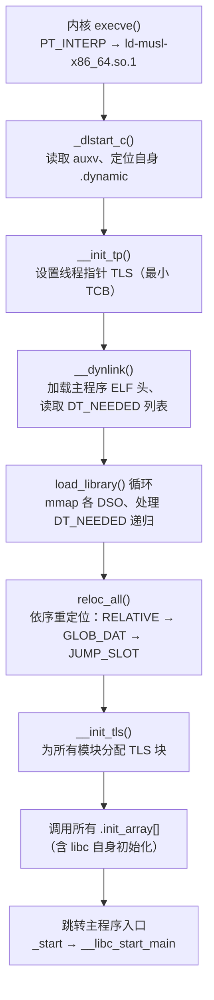

# 动态链接与加载器（21）· musl libc 的动态链接器

> [!abstract] TL;DR
> - musl libc 采用"**动态链接器即 libc 本身**"的一体化设计：`ld-musl-<arch>.so.1` 是一个自我解释器（ELF interpreter），它既是 C 标准库，也是动态链接器，二者共享同一个 `.so` 文件，无需像 glibc 那样维护独立的 `ld.so`。
> - musl 的设计哲学是**简单、小、正确**，并以静态链接为第一公民——Alpine Linux、嵌入式系统普遍用 musl 静态编译来获得体积极小、无外部依赖的二进制。
> - musl **有意不实现** glibc 的多个高级动态链接特性：不支持 `STT_GNU_IFUNC`（见 [[19.IFUNC间接函数]]）、无 GNU Audit 接口（见 [[18.GNU_Audit接口]]）、无 `dlmopen` / 链接器命名空间（见 [[17.dlmopen与链接器命名空间]]）、TLS 实现更简单（无 TLSDESC 优化）、符号版本控制支持有限。
> - 支持 `DT_RELR` 打包重定位格式（ABI 稳定后逐步跟进），符号解析与重定位流程与 glibc 类似但代码远更精简；逆向 musl 二进制时会遇到符号少、无 `.gnu.version*` 节、错误信息风格不同等差异，需要专门的分析思路。
> - 理解 musl 动态链接器的边界，是判断一段代码"在 Alpine/嵌入式上能否正常工作"的必要前提。

本篇是「动态链接与加载器详解」系列的**跨实现横向篇**：前面各篇以 glibc/Linux 为基准讲清了动态链接机制，本篇把视角切换到 musl libc，重点梳理 musl 动态链接器的设计选择、与 glibc 的关键差异、以及在静态优先定位下对逆向分析造成的影响。与本篇关系最密切的是 [[19.IFUNC间接函数]]、[[18.GNU_Audit接口]]、[[17.dlmopen与链接器命名空间]]，读这三篇后再回头看本篇的"不支持"清单，会理解得更透彻。

---

## 概述与定位

### musl libc 是什么

musl（读音 muscle）是一个以 MIT 许可证发布的 C 标准库实现，最初由 Rich Felker 在 2011 年发起。它的核心目标只有三个词：**简单（simple）、小（small）、正确（correct）**。

与 glibc 的发展路径不同，glibc 的历史积累跨越三十余年，兼容层、GNU 扩展、Hurd 遗留、跨平台兼容代码层层叠加，源码体积庞大；musl 则从头重写，以 POSIX/C99/C11 标准为边界，只在有明确需求时才引入扩展，拒绝为了性能而增加代码复杂度。这一哲学直接影响了它的动态链接器实现。

musl 目前支持的架构包括 x86、x86-64、ARM（32/64）、MIPS、RISC-V、PowerPC、S390x 等主流平台，对应的动态链接器文件名形如：

```
ld-musl-x86_64.so.1
ld-musl-aarch64.so.1
ld-musl-arm.so.1
ld-musl-mips.so.1
ld-musl-riscv64sf.so.1   # RISC-V 软浮点变体
```

### 动态链接器即 libc：一体化设计

glibc 的动态链接器（`/lib64/ld-linux-x86-64.so.2`）与 C 标准库（`libc.so.6`）是两个独立的 `.so` 文件。ELF 可执行文件的 `PT_INTERP` 段指向前者，加载器先把它映射到内存，它再自举、解析依赖、加载 `libc.so.6`，最后把控制权交给程序入口。这意味着在运行一个动态链接的 C 程序时，操作系统实际上要处理两个独立的系统库。

musl 采用了完全不同的策略：**`ld-musl-<arch>.so.1` 本身就是 libc**。同一个文件既提供 `malloc`/`printf`/`pthread_create` 等标准库函数，也承担动态链接器的职责。它的 ELF 类型是 `ET_DYN`（共享对象），同时在 ELF 头里设置了合法的入口点——当内核把它作为解释器启动时，它以动态链接器模式运行；当它被 `dlopen` 加载或作为普通共享库链接时，它提供标准库符号。

这种一体化设计的优势是：

1. **体积更小**：不需要维护两套初始化代码和两套内存分配器，共用同一套即可。
2. **引导更简洁**：自举阶段不需要"动态链接器加载动态链接器"的递归问题，musl 的自举代码逻辑比 glibc 短得多。
3. **静态链接无需特殊处理**：静态编译时直接把 `libc.a` 链进去，不存在"把动态链接器打包进静态二进制"的奇怪需求。

一体化设计的代价是：musl 被作为动态链接器使用时，它本身不能有动态依赖（否则就无限递归了）。musl 通过在编译时把自身的所有依赖都内部化（包括汇编实现的底层 syscall 包装）来解决这个问题。

### 在系列中的位置

| 维度 | 本篇聚焦 | 相邻篇章 |
|---|---|---|
| 实现对比 | musl 与 glibc 动态链接器的设计差异 | glibc 流程见 [[02.动态链接器启动流程]] |
| 不支持特性 | IFUNC / Audit / dlmopen / TLSDESC | 各特性专篇见 [[19.IFUNC间接函数]] [[18.GNU_Audit接口]] [[17.dlmopen与链接器命名空间]] |
| 重定位 | DT_RELR、基本重定位流程 | 重定位类型总览见 [[07.重定位机制详解]] |
| 逆向分析 | musl 二进制与 glibc 二进制的识别差异 | 逆向工具见 [[20.静态PIE]] |

---

## 原理与机制

### 设计哲学：简单优先，拒绝复杂性

musl 的动态链接器与 glibc 的根本分歧不在于技术能力，而在于**设计原则**：glibc 倾向于通过复杂机制获取极致性能（TLSDESC、IFUNC、per-namespace 链接器状态……），musl 倾向于通过简洁代码获取可理解的正确性。两种取舍没有绝对优劣，但决定了哪些特性会存在。

musl 动态链接器的核心源码集中在：

- `ldso/dynlink.c`：主要逻辑，包括自举、`__dynlink_load`、重定位、TLS 初始化
- `arch/<arch>/reloc.h`：架构相关重定位处理宏
- `src/env/__init_tls.c`：TLS 初始化
- `src/ldso/dlerror.c`、`dlopen.c`、`dlsym.c`：POSIX dlopen API

相比 glibc 的 `elf/dl-*.c`（数十个文件，数万行），musl 的动态链接器约在 3000 行以内（`dynlink.c` 单文件为主），这本身就是设计哲学的体现。

### musl 的加载与自举流程

musl 动态链接器的自举（bootstrap）过程：



与 glibc 相比有几个明显差异：

1. **无 `_dl_start` 独立入口**：musl 用 `_dlstart_c` 作为统一入口，直接用汇编获取栈指针和 `auxv`，代码更扁平。
2. **RELATIVE 重定位先于符号解析**：`reloc_all` 按重定位类型分两轮，先处理不需要符号查找的 `R_*_RELATIVE`，再处理需要符号表查找的 `GLOB_DAT`/`JUMP_SLOT`，实现清晰。
3. **无内置 `ld.so.cache`**：musl 的库搜索路径只看 `LD_LIBRARY_PATH`、`DT_RPATH`/`DT_RUNPATH`、以及硬编码的默认路径（通常 `/usr/local/lib:/lib:/usr/lib`），**不读 `/etc/ld.so.cache`**——这个 glibc 用来加速库发现的缓存文件对 musl 完全无效。Alpine Linux 因此不需要 `ldconfig`。

### 符号解析策略

musl 的符号解析逻辑与 glibc 基本兼容：遵循 ELF 规范的全局符号插入（global symbol interposition）语义，按照 DSO 加载顺序（BFS）搜索符号。

但 musl 的符号搜索实现更简单：不使用 glibc 的 `gnu_hash`（Bloom filter + 分桶哈希）优化路径，而是在有 `DT_GNU_HASH` 的情况下才用，否则退回 `DT_HASH`（SysV 哈希）。由于 musl 自身编译产出的 DSO 包含 `DT_GNU_HASH`，在现代工具链下性能影响不大。

**关键差异：无符号版本控制（symbol versioning）完整支持**

glibc 大量使用符号版本（`@@GLIBC_2.17`、`@GLIBC_2.2.5`）来向后兼容——同一个函数名可以有多个版本，旧程序调旧版，新程序调新版，两者共存于同一个 `libc.so.6`。musl **不提供符号版本**：

- musl 导出的符号无 `@@MUSL_*` 版本标注，均为 `@` 无版本（base version）。
- 对于链接了版本化符号的 glibc 程序，musl 在解析时会**忽略**版本信息，直接按名字匹配（`dlvsym` 对版本参数不做区分）。这意味着 glibc 编译的二进制通常**不能**直接在 musl 上运行——符号名可能找到，但 ABI（调用规约、结构体布局）可能已经不同。
- 从反向看：musl 程序在 glibc 系统上一般能运行，因为 glibc 提供 base version 符号。

---

## 结构/算法/伪代码详解

### musl 不支持的 glibc 高级特性全景

下表是 musl 与 glibc 动态链接特性的系统对比：

| 特性 | glibc | musl | musl 的处理 |
|---|---|---|---|
| `STT_GNU_IFUNC` | 完整支持，PLT 跳转到 resolver | **不支持** | 遇到 IFUNC 重定位直接报错退出 |
| GNU Audit 接口（`la_*` 钩子）| 完整支持 `LD_AUDIT=` | **不支持** | `LD_AUDIT` 环境变量被忽略 |
| `dlmopen` / 链接器命名空间 | 支持 `dlmopen(LM_ID_NEWLM,...)` | **不支持** | `dlmopen` 存根，调用即返回 NULL |
| TLSDESC（TLS Descriptor） | x86-64/AArch64 支持 | **不支持** | 只用传统 `tls_index` 模型 |
| 符号版本控制 | 核心机制 | **忽略版本** | 按名字匹配，不区分版本 |
| `ld.so.cache` | 使用（需 `ldconfig`）| 不使用 | 只查路径 |
| `DT_RELR` 打包重定位 | 支持（较新版本）| 支持（musl 1.2.4+）| 与 glibc 一致 |
| `ld.so.preload` | 支持 | 支持（`/etc/ld-musl-<arch>.path`）| 路径文件名不同 |
| 延迟绑定（lazy binding）| 默认开启 | 支持 | 支持 `RTLD_LAZY` |
| `dlopen` / `dlsym` | 完整 | 基本完整 | 不支持 `RTLD_NEXT` 跨命名空间 |
| `dl_iterate_phdr` | 支持 | 支持 | ABI 兼容 |
| `_r_debug` / GDB 接口 | 支持 | 支持 | ABI 兼容 |
| `backtrace()` GNU 扩展 | 支持 | **不支持** | 无此函数 |
| `execinfo.h` | 提供 | **不提供** | 需要第三方库 |

### STT_GNU_IFUNC 不支持详解

`STT_GNU_IFUNC`（见 [[19.IFUNC间接函数]]）是 glibc 用来实现 CPU 特性分发的机制——同一个符号名（如 `memcpy`）在运行时由一个 resolver 函数根据 CPU 能力选择最优实现（SSE2/AVX2/AVX-512 版本）。这个机制要求动态链接器在完成基本重定位后额外调用 resolver，并把返回的函数指针回填到 GOT。

musl 明确拒绝实现这个特性，原因包括：

1. **破坏了"符号绑定时间可预测"的简单模型**：IFUNC resolver 必须在重定位阶段被调用，但 resolver 本身可能依赖其他已重定位的符号，顺序依赖关系复杂。
2. **GNU 专有扩展，不在 ELF 标准中**：musl 只实现标准定义的行为。
3. **静态链接场景下的成本**：musl 的静态链接器脚本需要特殊处理 IFUNC，增加复杂度。

实践影响：将 glibc 编译的包含 IFUNC 符号的 `.so` 在 musl 系统上用 `dlopen` 加载时，musl 会在处理 `R_X86_64_IRELATIVE`/`R_X86_64_JUMP_SLOT（IFUNC）` 重定位时失败，打印类似 `unsupported relocation type` 的错误并返回 NULL。

### DT_RELR 支持

`DT_RELR` 是一种高效的打包重定位格式，专门用于压缩大量 `R_*_RELATIVE` 重定位条目（相对重定位在 PIE/PIC 中占主导）。传统的 `REL`/`RELA` 每条 16/24 字节，`RELR` 通过位图编码把密集的相对重定位压缩到 8 字节/条目级别，加载速度和文件体积都有改善。

musl 在 1.2.4 版本（2023 年）起支持 `DT_RELR`。处理逻辑在 `dynlink.c` 的 `do_relocs` 函数中，识别 `DT_RELR` / `DT_RELRSZ` / `DT_RELRENT` tag，并用专门的解码循环展开位图。

### TLS：简单但正确的实现

glibc 对 TLS（线程本地存储）进行了多轮优化，其中最重要的是 **TLSDESC**（TLS Descriptor，见 [[10.线程本地存储TLS]]）：在 x86-64 和 AArch64 上用特殊的 `R_*_TLSDESC` 重定位和 `__tls_get_addr` 的替代调用约定，把 TLS 访问从两次函数调用缩减为一次间接跳转，大幅降低动态 TLS 的开销。

musl 不实现 TLSDESC，原因依然是复杂性。musl 的 TLS 访问全部走传统路径：

- **局部执行模型（LE）**：可执行文件内的 TLS 变量，编译器直接生成相对于线程指针的偏移，无运行时开销。
- **初始执行模型（IE）**：主可执行文件 `dlopen` 时已确定的 DSO 内的 TLS 变量，从 `GOT` 读偏移加线程指针。
- **全局动态模型（GD）**：动态加载的 DSO 内的 TLS 变量，调用 `__tls_get_addr(tls_index *)`——musl 实现了这个函数，但没有 TLSDESC 变体。

对于嵌入式和 Alpine 场景，TLS 变量使用频率通常不高，这个简化的实现不会造成明显性能损失。

### 重定位处理伪代码

```c
// musl dynlink.c do_relocs() 的简化逻辑（概念层次）
void do_relocs(struct dso *dso, size_t *rel, size_t rel_size, size_t stride) {
    for (each reloc entry in [rel, rel + rel_size)) {
        uintptr_t *loc = dso->base + rel[i].r_offset;
        int type = ELF_R_TYPE(rel[i].r_info);
        int sym_idx = ELF_R_SYM(rel[i].r_info);
        uintptr_t sym_val = 0;

        if (sym_idx != 0) {
            // 全局符号搜索：遍历 dso->deps[] 链
            sym_val = find_sym(dso->deps, sym_name(dso, sym_idx));
            if (!sym_val && !STB_WEAK)
                die("undefined symbol: %s", sym_name(dso, sym_idx));
        }

        switch (type) {
        case R_RELATIVE:
            *loc = dso->base + rel[i].r_addend;   // 无需符号
            break;
        case R_GLOB_DAT:
        case R_JUMP_SLOT:
            *loc = sym_val;
            break;
        case R_COPY:
            memcpy((void*)loc, (void*)sym_val, sym_size(dso, sym_idx));
            break;
        // R_IRELATIVE (IFUNC) → musl 直接 die()
        default:
            die("unsupported relocation type %d", type);
        }
    }
}
```

注意：musl 不像 glibc 那样把重定位分为"加载时"和"延迟"两种路径加以特殊处理——延迟绑定依然通过 PLT/GOT 机制支持，但代码路径统一在 `do_relocs` 和 PLT stub 中。

---

## 工具视角与实战

### 识别 musl 链接的二进制

在逆向分析场景中，判断目标二进制是 musl 还是 glibc 链接，通常通过以下几步：

**步骤一：查看 PT_INTERP**

```bash
readelf -l <binary> | grep interpreter
# glibc:  [Requesting program interpreter: /lib64/ld-linux-x86-64.so.2]
# musl:   [Requesting program interpreter: /lib/ld-musl-x86_64.so.1]
```

解释器路径包含 `musl` 字样即可确认。

**步骤二：检查动态符号表的版本信息**

```bash
readelf -V <binary>   # 查看 .gnu.version / .gnu.version_r / .gnu.version_d
```

glibc 链接的二进制几乎都有 `.gnu.version_r` 节，里面记录了对 `GLIBC_2.x` 版本的依赖；musl 链接的二进制通常**没有**这些节，或者节内容为空。这是逆向工具快速判断的最直接特征。

**步骤三：检查符号特征**

```bash
nm -D <binary> | grep -E "(IFUNC|__libc_start_main)"
```

- glibc 的 `__libc_start_main` 版本化为 `GLIBC_2.x`，签名在不同版本有变化（glibc 2.34 开始合并了 `__libc_start_main` 与 `main` 的调用方式）；
- musl 的 `__libc_start_main` 签名固定为 `int __libc_start_main(int (*main)(int,char**,char**), int argc, char **argv)`，无版本尾缀。

**步骤四：检查是否有 IFUNC 符号**

```bash
readelf --syms --wide <library> | grep IFUNC
```

musl 自身编译的库不会有 `IFUNC` 类型符号；若看到 IFUNC 则几乎肯定是 glibc 或使用了 GNU 扩展的代码。

### Alpine Linux 与嵌入式场景

Alpine Linux 是最广泛使用 musl 的 Linux 发行版，其特点：

- 默认使用 musl + BusyBox 替代 glibc + GNU coreutils
- `/etc/ld-musl-x86_64.path` 代替 `/etc/ld.so.conf` 和 `/etc/ld.so.cache`，格式是简单的冒号/换行分隔路径列表，无需 `ldconfig`
- 静态编译的 Go/Rust/C 程序在 Alpine 基础镜像上完美运行，镜像体积通常在 5 MB 以下

嵌入式场景（OpenWrt、Buildroot 等）也大量使用 musl，原因是 musl 静态库（`libc.a`）远小于 glibc：

```
musl libc.a (x86-64):  ~900 KB
glibc libc.a (x86-64): ~5 MB+
```

最终静态链接产出的 hello world 差异：

```bash
# glibc 静态
$ gcc -static hello.c -o hello_glibc && ls -lh hello_glibc
-rwxr-xr-x 1 root root 872K hello_glibc

# musl 静态（通过 musl-gcc wrapper）
$ musl-gcc -static hello.c -o hello_musl && ls -lh hello_musl
-rwxr-xr-x 1 root root 14K hello_musl
```

体积差距主要来自 glibc 静态库包含了大量 locale、NSS、iconv 等即使不用也被链入的模块。

### 调试 musl 链接程序的实用命令

```bash
# 追踪动态链接器行为（musl 用 LD_DEBUG，格式与 glibc 略有不同）
LD_DEBUG=1 ./my_binary 2>&1 | head -50

# 检查 musl 的库搜索路径
cat /etc/ld-musl-x86_64.path

# 列出二进制依赖的 DSO
ldd ./my_binary
# musl 的 ldd 是 /lib/ld-musl-x86_64.so.1 --list 的别名

# 检查是否有 gnu hash
readelf -d ./my_binary | grep -E "(HASH|GNU_HASH)"

# 验证无 .gnu.version_r（musl 特征）
readelf -S ./my_binary | grep gnu.version
```

---

## 安全性与正确使用

> [!note]
> musl 因设计简洁，攻击面相对于 glibc 更小：没有 GNU Audit 钩子（无法通过 `LD_AUDIT` 注入运行时拦截）、没有 IFUNC resolver 被劫持的可能、没有链接器命名空间逃逸的攻击面。但这不代表 musl 无漏洞，只是减少了若干 glibc 专有的利用路径。

### 兼容性陷阱与常见 Bug

**陷阱一：`__libc_start_main` 签名差异**

glibc 2.34 之前，`__libc_start_main` 有第四个参数 `void (*init)(void)`（用于 `__init_array` 的初始化回调）。部分手写汇编入口（`_start`）显式调用了这个四参数版本。musl 的 `__libc_start_main` 只有标准的三个参数，多传的参数会导致行为未定义（不一定崩溃，但可能静默忽略初始化）。

**陷阱二：`strerror_r` 变体**

glibc 在 `_GNU_SOURCE` 定义时，`strerror_r` 返回 `char *`（GNU 变体），而非 POSIX 的 `int`。musl 只提供 POSIX 变体（返回 `int`）。如果代码依赖 `char *r = strerror_r(errno, buf, sizeof(buf));` 的 GNU 行为，在 musl 上会得到截断的指针值。

**陷阱三：`pthread_attr_setstacksize` 最小值**

musl 对线程栈大小有更严格的最小值限制（`PTHREAD_STACK_MIN`），部分 glibc 上"恰好够用"的栈设置在 musl 上会返回 `EINVAL`。

**陷阱四：`mallopt` 不支持**

musl 的 `malloc` 实现与 glibc 的 ptmalloc 完全不同，不接受 `mallopt(M_TRIM_THRESHOLD, ...)` 等调优参数。调用不报错，但静默无效。

**陷阱五：`backtrace()` 缺失**

glibc 提供 `execinfo.h` 中的 `backtrace()`/`backtrace_symbols()`，musl 不提供。依赖这些函数的崩溃处理、性能分析代码需要替换为 `libunwind` 或 `libbacktrace`。

### 逆向分析的安全含义

在对 Alpine 容器镜像或嵌入式固件做安全分析时：

1. **无 GOT 改写通过 Audit 回调** ：glibc 的 `LD_AUDIT` 提供了一种在不修改二进制的情况下拦截所有符号解析的机制，常被安全工具利用。musl 下这条路完全不存在。
2. **无 IFUNC resolver 投毒**：利用写 IFUNC resolver 地址到 GOT 来劫持控制流的手法（需要 `STT_GNU_IFUNC` 机制支持）在 musl 下不适用。
3. **符号版本缺失简化了 LD_PRELOAD 攻击**：musl 忽略版本信息，`LD_PRELOAD` 注入只需提供同名符号即可覆盖，不需要处理版本兼容。这是双刃剑——防御层面版本保护失效，但攻击层面劫持更容易。
4. **`LD_DEBUG` 输出格式**：musl 的调试输出格式与 glibc 不同，自动化解析脚本需要区分目标平台。

---

## 小结

musl 的动态链接器是"简单即美"哲学的集中体现：通过拒绝 IFUNC、Audit、dlmopen、TLSDESC 等复杂特性，把动态链接器核心代码控制在数千行以内，同时保持完整的 POSIX 兼容性。其一体化设计（链接器即 libc）在静态编译场景下带来极小的体积，是 Alpine Linux、OpenWrt、嵌入式系统的首选。

理解 musl 的边界清单，对于以下场景至关重要：
- 判断 glibc 代码能否无修改移植到 Alpine
- 分析容器镜像的依赖特征（有无 `.gnu.version*` 节是快速识别的钥匙）
- 在嵌入式安全审计中理解缺失的攻击面（Audit/IFUNC/命名空间）
- 编写同时支持 glibc 和 musl 的可移植 C 代码（避免 GNU 扩展、execinfo、mallopt）

musl 不是 glibc 的功能裁剪版，而是一个有明确价值观的独立实现，在它选择支持的范围内，正确性得到了充分保证。

---

## 相关阅读

- [[00.动态链接与加载器总览]]
- [[02.动态链接器启动流程]]
- [[07.重定位机制详解]]
- [[10.线程本地存储TLS]]
- [[17.dlmopen与链接器命名空间]]
- [[18.GNU_Audit接口]]
- [[19.IFUNC间接函数]]
- [[20.静态PIE]]
- [[22.macOS_dyld与chained_fixups]]

---

⬅️ 上一篇 [[20.静态PIE]] ｜ 🏠 [[00.动态链接与加载器总览]] ｜ 下一篇 [[22.macOS_dyld与chained_fixups]] ➡️
