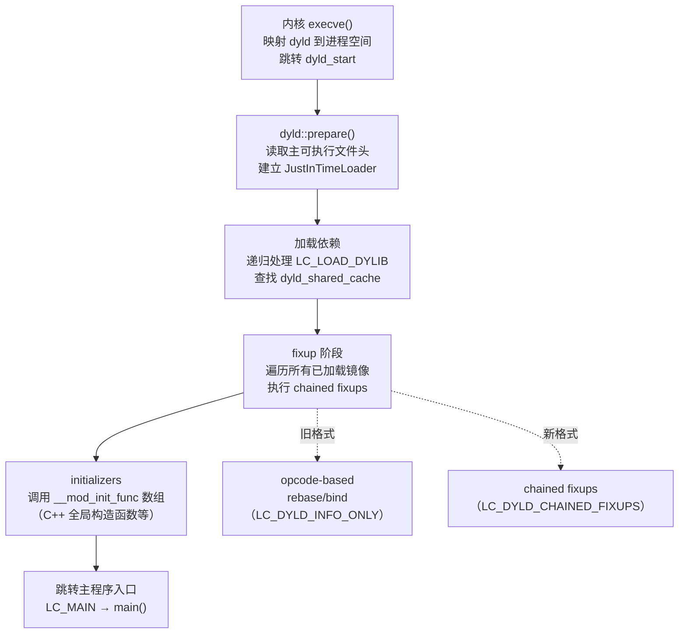
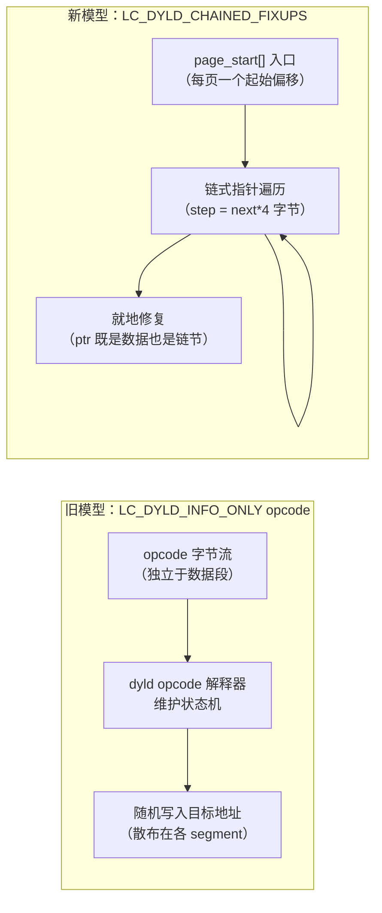

# 动态链接与加载器（22）· macOS dyld 与 chained fixups

> [!abstract] TL;DR
> - macOS 的动态链接器是 `dyld`（Dynamic Link Editor），当前主流版本为 **dyld4**（macOS 12 Monterey 起）。它负责将 Mach-O 格式的可执行文件与动态库（`.dylib`）加载到进程地址空间并完成符号绑定。
> - 传统 dyld 用 `LC_DYLD_INFO_ONLY` 中的 opcode 序列描述 rebase（ASLR 基址重定位）和 bind（符号绑定）操作；dyld4 引入 **`LC_DYLD_CHAINED_FIXUPS`** 加载命令，改用**链式指针（chained fixups）**格式——把所有待修复指针编码成一个单向链表，加载器遍历一遍即可完成全部修复。
> - 链式指针的核心创新：每个待修复的指针字段高位存放"到下一个 fixup 的偏移步长"，低位存放 rebase delta 或 bind 信息。这使得 fixup 描述信息**内嵌于指针本身**，无需额外的 opcode 表，结构紧凑、cache 友好。
> - 在 arm64e（Apple Silicon）上，chained fixups 与 **PAC（Pointer Authentication Code）** 叠加：`dyld_chained_ptr_arm64e_auth_rebase` 等结构在存储 fixup 信息的同时预留 PAC 签名字段，加载器修复后立即签名，伪造或篡改链式指针极为困难。
> - 逆向工具链：`dyld_info`（Apple 官方）、`otool -l`、`jtool2`、LLDB 的 `image dump sections` 可解析 chained fixups 数据；理解链式结构是分析 dyld4 时代 macOS/iOS 二进制的基础门票。

本篇是「动态链接与加载器详解」系列的**macOS/iOS 专篇**，聚焦于 dyld4 最具代表性的 chained fixups 机制。Mach-O 文件格式的全貌（加载命令、段布局、符号表、`__TEXT`/`__DATA_CONST` 的权限设计）在 [[12.Mach-O文件详解/00.Mach-O文件详解总览]] 有系统介绍；本篇以该系列为基础，把视角对准**加载时修复**这一动态链接的核心动作，重点讲清链式结构的编解码、与旧 opcode 模型的对比、以及安全含义。

---

## 概述与定位

### macOS 动态链接的历史演进

macOS 动态链接器的演化经历了几个明显的阶段：

**dyld 1（Classic dyld，macOS 10.0–10.5）**：基于最原始的 Mach-O 符号表和重定位，加载速度慢，每次启动都要重新解析符号。

**dyld 2（macOS 10.6–10.15）**：引入 `LC_DYLD_INFO`/`LC_DYLD_INFO_ONLY` 加载命令，用紧凑的 opcode 序列描述 rebase/bind/export；引入 dyld 共享缓存（`dyld_shared_cache`），把系统库预链接到固定基址，大幅加速启动——绝大多数逆向分析工具和文章描述的是这一时期的格式。

**dyld 3（macOS 10.14–11，部分）**：引入启动闭包（launch closure）缓存，把 dyld2 的工作结果预先序列化到磁盘（`/var/db/dyld/`），进程启动时直接反序列化跳过重新解析。

**dyld 4（macOS 12 Monterey+，iOS 15+）**：在 dyld3 的基础上引入 `LC_DYLD_CHAINED_FIXUPS` 和 `LC_DYLD_EXPORTS_TRIE`，完全替代 `LC_DYLD_INFO`。编译器工具链（`ld`）在链接阶段直接产出链式 fixup 数据，加载器的工作从"解析 opcode 执行修复"简化为"遍历链表修复指针"。

### 本篇在系列中的位置

| 维度 | 本篇聚焦 | 相邻篇章 |
|---|---|---|
| 文件格式 | `LC_DYLD_CHAINED_FIXUPS` 结构体布局 | Mach-O 全貌见 [[12.Mach-O文件详解/00.Mach-O文件详解总览]] |
| 加载流程 | dyld4 初始化与 fixup 阶段 | ELF 对应流程见 [[02.动态链接器启动流程]] |
| 安全机制 | PAC 签名、two-level namespace | ASLR/PIE 见 [[09.ASLR与位置无关代码]] |
| 逆向工具 | `dyld_info`、`otool`、LLDB | ELF 工具对比见 [[04.动态链接工具链]] |
| 对比参照 | 与 ELF PLT/GOT lazy bind 的对比 | ELF 延迟绑定见 [[08.PLT与GOT与延迟绑定]] |

---

## 原理与机制

### dyld4 加载流程概述

当 macOS 内核（XNU）通过 `execve()` 启动一个动态链接的 Mach-O 可执行文件时，内核读取 `LC_LOAD_DYLINKER` 命令找到解释器（通常是 `/usr/lib/dyld`），把 dyld 映射到进程地址空间，然后将控制权交给 `dyld_start`（汇编入口）。

dyld4 的启动过程分为以下几个阶段：



关键点：dyld4 区分两种来源的镜像——

1. **dyld_shared_cache 中的系统库**：已预链接（预 rebase），dyld 只需做最少量的调整（如 ASLR 滑动量已统一应用），不走 chained fixups 路径。
2. **来自磁盘的应用程序和第三方 dylib**：需要在加载时完整执行 fixup。

### 传统 opcode-based 绑定（LC_DYLD_INFO_ONLY）

在理解 chained fixups 之前，需要知道它要取代的是什么。

`LC_DYLD_INFO_ONLY` 包含若干个字节流（opcode 序列），分别描述：

- **rebase**：由于 ASLR，二进制被加载到随机基址，所有指向"本镜像内部地址"的指针需要加上 slide（滑动量）。opcode 流记录了哪些地址需要 rebase。
- **bind**：指向其他 dylib 符号的指针，需要在运行时查找目标符号的地址并写入。opcode 流记录了目标 dylib 序号（two-level namespace）、符号名、写入位置。
- **lazy bind**：函数指针的延迟绑定，与 ELF PLT/GOT 类似——`__la_symbol_ptr` 中的槽位初始指向 stub helper，首次调用触发 `dyld_stub_binder` 完成绑定后回填。
- **export**：本镜像导出的符号，用前缀树（trie）编码。

opcode 是一种字节码，dyld 需要实现一个解释器来执行这些字节码。这意味着：

- 每次加载都要解释执行，无法预先编译为原生操作
- opcode 序列是独立于被修复内存的额外数据，需要额外的 I/O 和 cache 压力
- 格式相对灵活但不利于快速随机访问

### Chained Fixups 的核心创新

`LC_DYLD_CHAINED_FIXUPS` 彻底改变了信息的**存储位置**：

> **把 fixup 元数据从独立的 opcode 流，移入每个待修复的指针字段本身。**

待修复的指针（尚未应用 ASLR slide 或尚未绑定到目标符号的位置）在文件中不存储最终地址，而是存储一个经过特殊编码的"链式指针"值。这个值同时携带两类信息：

1. **到下一个 fixup 的步长**（stride，以字节为单位除以 pointer size，编码在高位）
2. **本 fixup 的操作数据**（低位：rebase 的 target delta，或 bind 的符号表索引）

通过这种编码，所有待修复的指针形成一条**单向链表**：知道链表头（segment 中第一个 fixup 的偏移），就能通过 stride 字段逐个跳到下一个 fixup，直到 stride 为 0 表示链尾。加载器遍历一次链表即完成所有修复，无需独立的 opcode 流，也无需维护解释器状态机。

---

## 结构/算法/伪代码详解

### 数据结构层次

`LC_DYLD_CHAINED_FIXUPS` 是一个 `linkedit_data_command`，`dataoff` 指向 `__LINKEDIT` 段中的 fixup 数据区。数据区的层次结构如下：

```
dyld_chained_fixups_header          （固定头，描述整体布局）
    └─ dyld_chained_starts_in_image  （图像级入口，包含各 segment 的偏移数组）
         ├─ [segment 0] dyld_chained_starts_in_segment
         │       └─ page_start[] 数组（每页第一个 fixup 的偏移，0xFFFF 表示本页无 fixup）
         ├─ [segment 1] dyld_chained_starts_in_segment
         │       └─ page_start[] ...
         └─ ...
```

各主要结构的字段：

```c
// 整体头部
struct dyld_chained_fixups_header {
    uint32_t fixups_version;      // 格式版本，目前为 0
    uint32_t starts_offset;       // 到 dyld_chained_starts_in_image 的偏移
    uint32_t imports_offset;      // 到 imports 表（bind 符号列表）的偏移
    uint32_t symbols_offset;      // 到符号字符串池的偏移
    uint32_t imports_count;       // bind 符号数量
    uint32_t imports_format;      // DYLD_CHAINED_IMPORT, _ADDEND, _ADDEND64
    uint32_t symbols_format;      // 0=uncompressed, 1=zlib compressed
};

// 图像级入口
struct dyld_chained_starts_in_image {
    uint32_t seg_count;
    uint32_t seg_info_offset[1];  // seg_count 个偏移，指向各 segment 的 starts_in_segment
};

// 段级入口
struct dyld_chained_starts_in_segment {
    uint32_t size;                // 本结构的完整大小
    uint16_t page_size;           // 通常 0x1000（4KB）或 0x4000（16KB，Apple Silicon）
    uint16_t pointer_format;      // 链式指针的编码格式，见下表
    uint64_t segment_offset;      // 本 segment 在文件中的偏移（用于计算 fixup 位置）
    uint32_t max_valid_pointer;   // x86_64 非 ASLR 时有用，通常为 0
    uint16_t page_count;          // 本 segment 的页数
    uint16_t page_start[1];       // page_count 个入口，每页第一个 fixup 的页内偏移
                                  // 0x8000（DYLD_CHAINED_PTR_START_NONE）表示本页无 fixup
};
```

### pointer_format 枚举

`pointer_format` 字段决定了链式指针字段如何解码，常见取值：

| 枚举值 | 数值 | 说明 |
|---|---|---|
| `DYLD_CHAINED_PTR_ARM64E` | 1 | arm64e，支持 PAC，重定位/绑定二合一 |
| `DYLD_CHAINED_PTR_64` | 2 | x86-64 及非 PAC arm64，标准 64 位链式指针 |
| `DYLD_CHAINED_PTR_32` | 4 | 32 位平台（已基本退出舞台）|
| `DYLD_CHAINED_PTR_ARM64E_USERLAND` | 12 | arm64e 用户态，arm64e 链接器产出 |
| `DYLD_CHAINED_PTR_ARM64E_USERLAND24` | 13 | arm64e，bind ordinal 扩展到 24 位 |
| `DYLD_CHAINED_PTR_64_OFFSET` | 6 | 64 位，target 存相对段偏移而非绝对地址 |

### 链式指针结构（DYLD_CHAINED_PTR_64）

对于 `pointer_format = DYLD_CHAINED_PTR_64`，每个链式指针是一个 64 位整数，按最高位 bit[63] 区分两种类型：

**Rebase 指针（bit[63] = 0）**：

```
bit[63]   bit[62:32]    bit[31:0]
  0       next (26 bits) target (32 bits) [高位保留]

实际布局：
struct dyld_chained_ptr_64_rebase {
    uint64_t target   : 36;   // 目标运行时地址（相对于 preferredLoadAddress，低 36 位）
    uint64_t high8    :  8;   // 目标地址的高 8 位（vm addr 空间 > 36 位时使用）
    uint64_t reserved :  7;
    uint64_t next     : 12;   // 到下一个 fixup 的步长（单位：4 字节）
    uint64_t bind     :  1;   // =0 表示 rebase
};
```

加载器处理：`runtime_addr = dso_slide + target`，写回此指针位置，然后跳 `next * 4` 字节到下一个 fixup。

**Bind 指针（bit[63] = 1）**：

```
struct dyld_chained_ptr_64_bind {
    uint64_t ordinal  : 24;   // imports 表索引（对应符号名 + dylib 序号）
    uint64_t addend   :  8;   // 符号地址加数（小范围）
    uint64_t reserved : 19;
    uint64_t next     : 12;   // 到下一个 fixup 的步长（单位：4 字节）
    uint64_t bind     :  1;   // =1 表示 bind
};
```

加载器处理：从 imports 表取出符号信息，在对应 dylib 中查找符号地址，写回此指针位置，然后跳 `next * 4` 字节。

### arm64e 下的 PAC 扩展（DYLD_CHAINED_PTR_ARM64E）

arm64e 平台（Apple Silicon）的链式指针结构更复杂，融入了 PAC 签名字段：

```c
// arm64e rebase（含 PAC 认证）
struct dyld_chained_ptr_arm64e_auth_rebase {
    uint64_t target    : 32;  // 目标地址低 32 位（相对于 preferredLoadAddress）
    uint64_t diversity : 16;  // PAC diversity value（签名数据的一部分）
    uint64_t addrDiv   :  1;  // 是否把地址自身混入 diversity
    uint64_t key       :  2;  // PAC key 选择（IA/IB/DA/DB）
    uint64_t next      : 11;  // 到下一个 fixup 的步长（单位：8 字节）
    uint64_t auth      :  1;  // =1 表示这是 authenticated 指针
    uint64_t bind      :  1;  // =0 表示 rebase
};

// arm64e bind（含 PAC 认证）
struct dyld_chained_ptr_arm64e_auth_bind {
    uint64_t ordinal   : 16;
    uint64_t zero      : 16;
    uint64_t diversity : 16;
    uint64_t addrDiv   :  1;
    uint64_t key       :  2;
    uint64_t next      : 11;
    uint64_t auth      :  1;  // =1
    uint64_t bind      :  1;  // =1
};
```

加载器在写回修复后的指针时，立即用 `pacia`/`pacib`/`pacda`/`pacdb` 等 ARMv8.3-A 指令对指针进行签名，写入的是**已签名的指针值**，而非裸地址。程序在访问这类指针时，处理器会用 `autia`/`autib` 等指令验证签名，若签名不匹配则指针高位被故意破坏，导致访问异常。这使得链式 fixup 数据的伪造在 arm64e 上极为困难——即使攻击者能控制 fixup 结构中的 target 字段，最终写入的指针也会因签名错误而无法使用。

### 链表遍历算法（伪代码）

```c
// dyld4 chained fixups 遍历修复（简化伪代码）
void apply_chained_fixups(const dyld_chained_starts_in_image *starts,
                          uintptr_t slide,
                          const ImportEntry *imports,
                          size_t imports_count) {
    for (uint32_t seg = 0; seg < starts->seg_count; seg++) {
        const dyld_chained_starts_in_segment *seg_info =
            (void*)starts + starts->seg_info_offset[seg];
        if (!seg_info) continue;

        uintptr_t seg_base = /* segment 在内存中的加载地址 */;

        for (uint16_t page = 0; page < seg_info->page_count; page++) {
            uint16_t start = seg_info->page_start[page];
            if (start == DYLD_CHAINED_PTR_START_NONE) continue;  // 本页无 fixup

            // 链表头：本页起始地址 + 页内偏移
            uintptr_t *ptr = (uintptr_t*)(seg_base + page * seg_info->page_size + start);

            while (true) {
                uint64_t raw = *ptr;
                bool is_bind = (raw >> 63) & 1;
                uint32_t next = (raw >> 51) & 0xFFF;  // DYLD_CHAINED_PTR_64 的 next 字段位置

                if (is_bind) {
                    // Bind：从 imports 表查符号
                    uint32_t ord = raw & 0xFFFFFF;  // ordinal
                    uintptr_t sym_addr = resolve_import(imports[ord]);
                    int64_t addend = (raw >> 24) & 0xFF;
                    *ptr = sym_addr + addend;
                } else {
                    // Rebase：目标地址 + slide
                    uint64_t target = raw & 0xFFFFFFFFF;  // 36 位 target
                    uint64_t high8  = (raw >> 36) & 0xFF;
                    *ptr = (high8 << 56) | target | slide;
                }

                if (next == 0) break;           // 链尾
                ptr = (uintptr_t*)((uint8_t*)ptr + next * 4);  // 步进到下一个 fixup
            }
        }
    }
}
```

### 与传统 opcode 模型的对比



| 维度 | 旧 opcode 模型 | chained fixups |
|---|---|---|
| 元数据位置 | `__LINKEDIT` 独立 opcode 流 | 内嵌于指针值本身 |
| 加载器复杂度 | 需要状态机解释器 | 简单链表遍历 |
| 内存访问模式 | opcode 流（顺序）+ 目标地址（随机）| 链表遍历（近似顺序）|
| 延迟绑定支持 | 有（`__la_symbol_ptr` + stub binder）| 默认无（dyld4 鼓励全量预绑定）|
| PAC 集成 | 无 | arm64e 原生支持 |
| 工具链生成 | 链接器生成 opcode | 链接器直接编码链式指针 |

### Two-level Namespace

macOS 动态链接器的符号绑定使用 **two-level namespace**（两级命名空间）：每个 bind 操作不仅指定符号名，还指定来自哪个 dylib（通过 `dylib_ordinal` 索引到 `LC_LOAD_DYLIB` 列表）。

这与 ELF 的单一全局符号空间（symbol interposition）形成鲜明对比。ELF 下，任何先加载的 DSO 都可以通过提供同名符号来覆盖（插入）后加载的 DSO 的实现；macOS 下，符号绑定在链接时就确定了来源 dylib，运行时的 `LD_PRELOAD` 等机制无法覆盖已经 two-level 绑定的符号（除非目标二进制用 flat namespace 编译）。

两级命名空间的优势：
1. **消除符号名冲突**：不同 dylib 可以有同名的内部符号而不互相干扰。
2. **加速符号查找**：dyld 不需要遍历所有已加载 dylib，直接跳到指定 dylib 的导出表。
3. **安全性**：`LD_PRELOAD` 注入对 two-level 绑定的符号无效（glibc 上 `LD_PRELOAD` 可以轻易覆盖任何符号）。

在 chained fixups 中，two-level namespace 体现在 bind 条目的 `ordinal` 字段：imports 表中每条 `dyld_chained_import` 同时记录符号名（通过 string pool 偏移）和 `lib_ordinal`（dylib 序号），二者共同唯一确定目标。

---

## 工具视角与实战

### dyld_info 命令

Apple 从 Xcode 13 起提供了 `dyld_info` 工具，专门用于解析 dyld4 格式：

```bash
# 列出所有 fixup（rebase + bind）
dyld_info -fixups /path/to/binary

# 只看 bind 操作（符号绑定）
dyld_info -bind /path/to/binary

# 查看 exports trie
dyld_info -exports /path/to/binary

# 完整信息
dyld_info -all /path/to/binary
```

输出示例（`-fixups`）：

```
rebase:
  __DATA_CONST/__got  0x100008000  dyld_stub_binder

bind:
  __DATA_CONST/__got  0x100008010  libSystem.B.dylib  ___stack_chk_guard
  __DATA_CONST/__got  0x100008018  libSystem.B.dylib  _printf
  __DATA_CONST/__got  0x100008020  libSystem.B.dylib  _exit
```

### otool 传统路径

`otool -l` 可以显示加载命令，确认是 `LC_DYLD_CHAINED_FIXUPS` 还是 `LC_DYLD_INFO_ONLY`：

```bash
otool -l /path/to/binary | grep -A 8 "LC_DYLD_CHAINED_FIXUPS"

# 如果是旧格式：
otool -l /path/to/binary | grep -A 8 "LC_DYLD_INFO"

# 查看 rebase/bind（旧格式）
otool -bind /path/to/binary
otool -rebase /path/to/binary
```

判断二进制用哪种格式：

```bash
otool -l binary | grep -E "(LC_DYLD_INFO|LC_DYLD_CHAINED)"
# 有 LC_DYLD_CHAINED_FIXUPS → dyld4 链式格式
# 有 LC_DYLD_INFO_ONLY → 旧 opcode 格式
# 两者都没有 → 静态链接或 dyld 缓存中的预链接版本
```

### 用 Python 解析 chained fixups

```python
import struct

def parse_chained_fixups_header(data, offset):
    """解析 dyld_chained_fixups_header"""
    fmt = "<IIIIIII"  # 7 个 uint32_t
    fields = struct.unpack_from(fmt, data, offset)
    return {
        'fixups_version': fields[0],
        'starts_offset':  fields[1],
        'imports_offset': fields[2],
        'symbols_offset': fields[3],
        'imports_count':  fields[4],
        'imports_format': fields[5],
        'symbols_format': fields[6],
    }

def parse_imports(data, base_offset, count, fmt_type):
    """解析 imports 表（DYLD_CHAINED_IMPORT 格式）"""
    imports = []
    for i in range(count):
        val = struct.unpack_from("<I", data, base_offset + i * 4)[0]
        lib_ordinal = (val >> 24) & 0xFF
        weak_import = (val >> 23) & 0x1
        name_offset  = val & 0x7FFFFF
        imports.append((lib_ordinal, weak_import, name_offset))
    return imports
```

### LLDB 调试

```bash
# 在 LLDB 中查看已加载镜像的 fixup 信息
(lldb) image dump sections <module-name>

# 查看 GOT/stub 内容
(lldb) x/20xg `<module-name>`.__DATA_CONST.__got

# 跟踪 dyld fixup 阶段（需要开发者签名的 dyld）
(lldb) break set -n dyld4::Loader::applyFixups
```

### 识别 dyld4 格式 vs 旧格式

逆向分析时快速判断二进制的 fixup 格式：

```bash
# 检查加载命令
python3 - << 'EOF'
import sys, struct

with open(sys.argv[1], 'rb') as f:
    data = f.read()

# 跳过 FAT header（如果有）
magic = struct.unpack_from(">I", data)[0]
if magic == 0xcafebabe:  # FAT
    print("FAT binary, check slices")
else:
    # 扫描加载命令
    ncmds = struct.unpack_from("<I", data, 16)[0]
    offset = 32  # MH_MAGIC_64 头之后
    for _ in range(ncmds):
        cmd, cmdsize = struct.unpack_from("<II", data, offset)
        if cmd == 0x80000034:  # LC_DYLD_CHAINED_FIXUPS
            print("dyld4 chained fixups format")
        elif cmd == 0x22:     # LC_DYLD_INFO_ONLY
            print("legacy opcode format")
        offset += cmdsize
EOF binary_to_check
```

---

## 安全性与正确使用

> [!caution]
> chained fixups 在 arm64e 上与 PAC 深度结合，是 Apple 平台防御链的一部分。以下内容仅供安全研究和逆向分析教学使用，描述攻击原理用于理解防御，不构成对具体系统的渗透建议。

### chained fixups 的防篡改属性

**传统 opcode 模型的弱点**：`LC_DYLD_INFO_ONLY` 的 opcode 数据在 `__LINKEDIT` 中，如果攻击者能修改二进制文件（不触碰代码签名验证的文件范围），可能通过修改 bind opcode 来改变符号绑定目标。macOS 的代码签名（`LC_CODE_SIGNATURE`）会阻止这种修改，但这是一道附加的外部保护，不是 fixup 格式本身的内在特性。

**chained fixups 的内在特性**：

1. **PAC 签名内嵌（arm64e）**：链式指针在加载后立即被签名，签名值依赖于指针地址、diversity value、以及 PAC key。攻击者即使能读取修复后的指针值，也无法构造任意目标地址的有效签名（PAC 密钥存储在不可读的系统寄存器中）。
2. **链表结构的自一致性**：每个 fixup 位置都由前一个 fixup 的 next 字段决定，修改链表中间的 next 会导致链表遍历错过后续 fixup（但不一定立即 crash，可能产生未绑定的空指针，在调用时才暴露）。
3. **与 `__DATA_CONST` 只读配合**：macOS 上 GOT 等间接指针通常位于 `__DATA_CONST` 段，在所有 fixup 完成后被标记为只读（类似 ELF Full RELRO）。chained fixups 的设计使"fixup 完成"这一时刻边界清晰，更容易实现精确的只读化。

### 安全研究：解析 chained fixups 查找 bind 目标

对固件或应用程序进行静态分析时，解析 chained fixups 可以重建完整的导入表（与 ELF 的 `.dynsym` 等价），用于：

- 识别程序使用的私有框架 API（`_`前缀的内部符号）
- 在混淆后的二进制中定位关键函数（通过 imports 中的符号名仍保留的情况下）
- 对比不同版本的二进制，查找新增/移除的 imports（漏洞分析）

### ELF RELRO 与 macOS chained fixups + DATA_CONST 的对比

| 维度 | ELF Full RELRO | macOS chained fixups + `__DATA_CONST` |
|---|---|---|
| 机制 | `BIND_NOW` + `mprotect(PROT_READ)` | fixup 完成后 `mprotect` 只读 |
| 覆盖范围 | `.got`（数据 GOT）+ `.got.plt`（函数 GOT）| `__got`（flat binding）整体只读 |
| 运行时修改 | 攻击者需要绕过 NX 保护 | 同上，arm64e 还需伪造 PAC 签名 |
| 延迟绑定 | 关闭（`BIND_NOW`）| dyld4 基本消除 lazy bind |
| 攻击难度 | 需要任意写 + 绕过 NX | 更难：需要任意写 + PAC 伪造（arm64e）|

---

## 小结

macOS dyld4 的 chained fixups 是现代动态链接器设计中最具代表性的创新之一：把 fixup 元数据从独立的解释型 opcode 流，迁移到内嵌于每个待修复指针字段的链式编码中，既简化了加载器实现，又改善了内存访问局部性，还为 PAC 签名的无缝集成提供了理想的结构钩点。

理解 chained fixups 的关键认知：

1. **指针即元数据**：在磁盘文件中，待修复位置存储的不是垃圾，而是精心编码的链式指针，携带 stride（链表链接）和操作数（rebase target 或 bind ordinal）。
2. **格式分叉**：用 `otool -l` 确认 `LC_DYLD_CHAINED_FIXUPS` vs `LC_DYLD_INFO_ONLY` 是逆向 macOS 二进制的第一步，两者解析方式完全不同。
3. **PAC 叠加（arm64e）**：chained fixups 在 Apple Silicon 上与硬件指针认证深度融合，使得单纯的 GOT 覆写攻击在 arm64e 上失效——这是与 ELF RELRO 安全语义最大的区别。
4. **Two-level namespace**：macOS 的符号绑定在链接时就确定来源 dylib，运行时无法通过符号插入覆盖——这是 macOS 和 Linux 动态链接安全模型的根本性差异。
5. **工具首选 `dyld_info`**：Apple Xcode 13+ 提供的 `dyld_info` 是解析 dyld4 格式的官方工具，旧工具（`otool -bind`、`machoview`）对 chained fixups 的支持参差不齐。

---

## 相关阅读

- [[00.动态链接与加载器总览]]
- [[08.PLT与GOT与延迟绑定]]
- [[09.ASLR与位置无关代码]]
- [[12.Mach-O文件详解/00.Mach-O文件详解总览]]
- [[21.musl动态链接器]]

---

⬅️ 上一篇 [[21.musl动态链接器]] ｜ 🏠 [[00.动态链接与加载器总览]]
