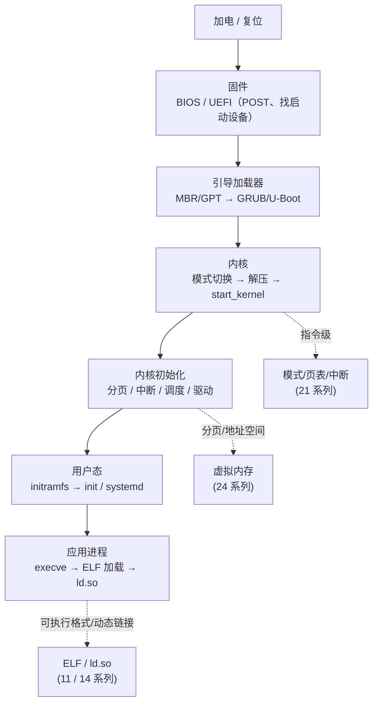

# 操作系统加载与启动 · 系列总览

> 作者原创系列，共 **13** 篇。系统拆解 **从加电到用户态：操作系统是如何被加载并启动的**：从 **固件（BIOS/UEFI）**、**引导扇区（MBR/GPT）**、**引导加载器（GRUB/U-Boot）**，到 **CPU 模式切换（实模式→保护模式→长模式）**、**内核解压与早期初始化**，再到 **分页/页表**、**虚拟内存子系统**、**中断/异常**、**系统调用机制**、**init/systemd**、**ELF 程序加载执行**，最后落到 **可信启动**。基准平台 **x86-64 + Linux + UEFI/GRUB**。启动是一场"接力赛"，每一棒都按约定把控制权交给下一棒——本系列与 [[21.Asm/00 总览|汇编与架构]]（模式/页表/中断的指令级实现）、[[24.内存管理与堆分配器/00.内存管理与堆分配器总览|内存管理与堆分配器]]（分页与地址空间）、[[14.动态链接与加载器详解/00.动态链接与加载器总览|动态链接与加载器]]（用户态加载）、[[11.ELF文件详解/00.ELF文件详解总览|ELF 文件详解]]（可执行格式）深度互补。

## 一、固件与引导

| # | 章节 | 说明 |
| --- | --- | --- |
| 01 | [[01.加电到用户态的启动全景]] | 启动接力全景：固件→引导→内核→init→用户态 |
| 02 | [[02.BIOS与UEFI固件]] | BIOS/POST vs UEFI（ESP、PE32+ 应用、Boot/Runtime Services、Secure Boot） |
| 03 | [[03.MBR与GPT与引导扇区]] | MBR 512 字节/0x55AA、分区表、GPT 布局、引导阶段 |
| 04 | [[04.引导加载器GRUB与U-Boot]] | GRUB 多阶段/multiboot、U-Boot 嵌入式、加载内核与 initramfs |

## 二、CPU 模式与内核

| # | 章节 | 说明 |
| --- | --- | --- |
| 05 | [[05.从实模式到保护模式到长模式]] | 16/32/64 位、GDT 分段、`CR0.PE`/`EFER.LME`、A20 |
| 06 | [[06.内核解压与早期初始化]] | bzImage/setup 头、`startup_64`→`start_kernel`、解压 |

## 三、内存与分页

| # | 章节 | 说明 |
| --- | --- | --- |
| 07 | [[07.分页与页表机制]] | x86-64 四级页表、`CR3`、PTE 标志、4KB/2MB/1GB、TLB |
| 08 | [[08.虚拟内存子系统]] | 按需调页、缺页 `#PF`/CR2、COW、swap、OOM |

## 四、内核机制

| # | 章节 | 说明 |
| --- | --- | --- |
| 09 | [[09.中断异常与IDT]] | IDT 256 项、向量 0–31 异常、中断门、APIC/IRQ |
| 10 | [[10.系统调用机制]] | `syscall`/`sysret`、LSTAR/STAR、号在 RAX/参数 R10、`int 0x80`、vDSO |

## 五、进程与安全

| # | 章节 | 说明 |
| --- | --- | --- |
| 11 | [[11.init与systemd启动]] | PID 1、initramfs→`switch_root`、systemd target、起服务 |
| 12 | [[12.ELF程序的加载与执行]] | `execve`→`load_elf_binary`、`PT_LOAD`/`PT_INTERP`、auxv |
| 13 | [[13.可信启动与启动安全]] | Secure Boot（PK/KEK/db）、Measured Boot/TPM、信任链（防御） |

## 启动接力的四个交接点

> 一句话：操作系统的启动是一场**接力赛**——固件点亮硬件并找到启动设备，引导加载器把内核读进内存，内核把 CPU 从实模式切到长模式、解压自己、建好分页与中断、起好调度器，再挂载根文件系统、把控制权交给用户态的 init/systemd，最后由它 `execve` 出一个个应用进程。读懂每一棒的交接契约（启动协议、GDT/页表、IDT、syscall 入口、auxv），你就能在 QEMU + gdb 里看着一台机器"从零醒来"，也能定位启动故障、理解可信启动如何环环验签。
