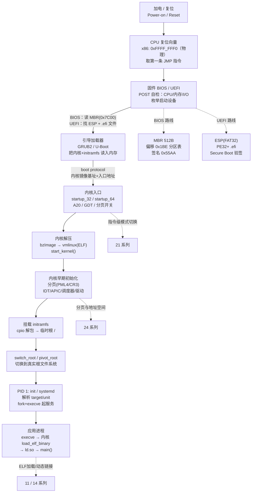

# OS启动（01）· 加电到用户态的启动全景

## 概述与定位

> [!abstract] TL;DR
> 计算机上电后，CPU 从**复位向量**取出第一条指令，由固件（BIOS/UEFI）完成硬件自检并找到启动设备，再把控制权交给引导加载器（GRUB/U-Boot），引导加载器把内核与 initramfs 读入内存，内核完成模式切换（实模式→保护模式→长模式）、解压、早期初始化（分页/中断/调度/驱动），挂载根文件系统后把控制权交给用户态的 init/systemd，最终由 init `execve` 出各类应用进程。全程是一场**接力赛**，每一棒都有明确的"交接契约"。

本篇是《操作系统加载与启动》系列的**开篇全景图**，目标是在读完后对整条启动链有清晰的感性认知，知道每一棒"从哪里接、交什么"。后续 12 篇将对每个环节深挖细节。

> **系列边界**：本系列聚焦固件→内核→init 的 OS 启动链 + 内核态机制；用户态动态链接/加载器（ld.so）见 [[14.动态链接与加载器详解/00.动态链接与加载器总览|14 系列]]；堆分配器与分页背景见 [[24.内存管理与堆分配器/00.内存管理与堆分配器总览|24 系列]]；汇编与 CPU 指令级实现见 [[21.Asm/00 总览|21 系列]]。三者大量互链但不重复。

---

## 原理与机制

### 启动接力全景

下图给出从加电到应用进程的完整接力链，节点内用 `<br/>` 换行以便 Obsidian Mermaid 正确渲染。



### 两条固件路线对比

| 维度 | BIOS + MBR | UEFI + GPT + ESP |
|---|---|---|
| 固件运行模式 | 16 位实模式 | 32/64 位保护/长模式 |
| 引导介质 | 磁盘 MBR（扇区 0，512 字节，签名 `0x55AA`） | ESP 分区（FAT32），加载 `.efi`（PE32+）可执行 |
| 分区表 | MBR 分区表（4 项，偏移 `0x1BE`，每项 16 字节） | GPT（保护 MBR + LBA1 GPT 头 + 128 项分区表数组） |
| 安全启动 | 无原生机制 | **Secure Boot**（PK/KEK/db/dbx 验签链） |
| 现代主流 | 遗留（Legacy）模式 | 当前标准 |

---

## 结构 / 流程详解

### 第一棒：固件（BIOS/UEFI）

**职责**：CPU 复位后，`CS:IP = F000:FFF0`（物理地址 `0xFFFF_FFF0`），第一条指令是跳转到固件 ROM 的入口。固件执行 **POST（Power-On Self-Test）**：检查 CPU 状态寄存器、内存控制器、关键 I/O，并枚举启动设备。

**BIOS 路线**：
1. 读取第一块启动磁盘的 **MBR**（512 字节）到物理地址 `0x7C00`。
2. 验证偏移 `0x1FE` 处的引导签名 `0x55 0xAA`，跳转执行。
3. MBR 代码（446 字节）负责加载第二阶段引导器。

**UEFI 路线**：
1. 固件初始化 **Boot Services**（内存分配、协议、设备路径）和 **Runtime Services**（时钟、变量）。
2. 遍历 **ESP（EFI System Partition，FAT32）**，查找 `/EFI/BOOT/BOOTX64.EFI` 或 `BootOrder` 变量指定的 `.efi` 文件。
3. 若启用 **Secure Boot**，先验证 `.efi` 签名（db 白名单 vs dbx 黑名单）再执行。
4. 调用 `ExitBootServices()` 将控制权交给引导加载器，后者接管物理内存映射。

**交接物**：启动设备句柄 + 引导代码入口（MBR `0x7C00` 或 UEFI 镜像入口点）。

---

### 第二棒：引导加载器（GRUB/U-Boot）

**职责**：引导加载器是固件与内核之间的"翻译官"，负责把内核镜像和 initramfs 从磁盘读进内存，并按照 **boot protocol** 告诉内核它们的加载地址与参数。

**GRUB2 多阶段**：
- **Stage 1**（MBR 引导代码/UEFI shim）：找到 GRUB core image。
- **Stage 2**（`core.img`/`grub.efi`）：加载 GRUB 模块，展示菜单，读取 `grub.cfg`，`linux` 命令指定内核，`initrd` 命令指定 initramfs，`boot` 命令触发引导。

**U-Boot（嵌入式）**：类似地，通过 `bootcmd` 环境变量把内核（uImage/FIT）和 DTB（设备树）加载到指定内存地址，再 `bootm/booti` 跳转。

**Linux boot protocol（x86）**：引导加载器把内核镜像 `bzImage` 的**实模式 setup 头**（`linux/arch/x86/include/uapi/asm/bootparam.h`，`struct boot_params`）填充好后，跳转到内核入口：
- 实模式入口：`0x7C00 + 512`（legacy）
- 保护模式入口：`startup_32`（32 位压缩 stub）
- 64 位入口：`startup_64`（EFI stub 可直接进入）

关键 `boot_params` 字段：

| 字段 | 说明 |
|---|---|
| `setup_sects` | 实模式 setup 扇区数 |
| `kernel_alignment` | 内核对齐要求 |
| `cmd_line_ptr` | 命令行参数物理地址 |
| `ramdisk_image` | initramfs 物理基址 |
| `ramdisk_size` | initramfs 大小 |
| `e820_table` | 物理内存映射（E820 内存表） |

**交接物**：`boot_params` 结构 + 内核镜像在内存的物理地址 + initramfs 地址/大小 + 命令行参数。

---

### 第三棒：内核（模式切换 → 解压 → 早期初始化）

**职责**：内核接手后要完成 CPU 模式切换、自身解压、建立内核运行环境，这是整条链中机制最密集的一棒。详见 [[05.从实模式到保护模式到长模式]] 和 [[06.内核解压与早期初始化]]。

**模式切换路径（x86-64）**：

```
实模式（16 bit, 段:偏移, 1 MB）
  │  开保护模式：置 CR0.PE
  ▼
保护模式（32 bit, GDT 段描述符）
  │  置 CR4.PAE=1 → EFER.LME=1 → CR0.PG=1，CPU 置 EFER.LMA=1
  ▼
长模式（64 bit, RIP-relative, 4 级分页 PML4）
```

关键寄存器操作：
- `CR0.PE = 1`：进入保护模式
- `A20` 地址线使能：解除 1 MB 回绕限制
- `EFER.LME = 1` + `CR0.PG = 1`：进入长模式，`EFER.LMA` 由 CPU 自动置 1
- `CR3`：存放 PML4（Page Map Level 4）物理基址，建立 4 级页表

**内核解压**：`bzImage` = 实模式 setup（setup.bin）+ 压缩内核（piggy.o，通常 gzip/zstd/lzma 压缩）。`startup_32` 将压缩内核解压到内存，跳转到 `startup_64`，再跳转到 `start_kernel()`（`init/main.c`）。

**`start_kernel()` 早期初始化（部分关键调用）**：

```
start_kernel()
├── setup_arch()          # 架构初始化：解析 boot_params / E820 / ACPI
├── mm_core_init()        # 伙伴系统（Buddy allocator）初始化
├── trap_init()           # 设置 IDT（256 项异常/中断描述符）
├── init_IRQ()            # 初始化 PIC/APIC/IRQ
├── time_init()           # 初始化计时器
├── sched_init()          # 调度器初始化（CFS/idle task）
├── vfs_caches_init()     # VFS 缓存（inode/dentry）
├── rest_init()           # 创建 kernel_init 线程 + idle 线程
│   └── kernel_thread(kernel_init, ...)
└── cpu_startup_entry()   # 当前 CPU 进入 idle 循环
```

**`kernel_init` 线程**（最终成为 PID 1 的父）：
1. 并行初始化驱动与子系统（`do_initcalls()`）。
2. 挂载 initramfs（`prepare_namespace()`）。
3. 执行 initramfs 中的 `/init`（或内核参数指定的 `init=`）。

**交接物**：内核完整运行环境（分页 + IDT + 调度器 + 驱动）+ 根文件系统挂载点。

---

### 第四棒：init/systemd（用户态 PID 1）

**职责**：内核 `execve("/sbin/init", ...)` 后，`init`（通常是 systemd）成为所有用户态进程的祖先。详见 [[11.init与systemd启动]]。

**initramfs 过渡**：
- 内核先把 cpio 格式的 **initramfs**（Init RAM File System）解包到一个临时根 `/`（内存中）。
- initramfs 内的 `/init` 脚本/二进制负责：加载必要驱动模块（`modprobe`）、发现并挂载真实根分区（可能在 LVM/RAID/LUKS 上）。
- 调用 `switch_root`（或 `pivot_root`）把根切换为真实磁盘上的文件系统。

**systemd 启动序列**（简化）：
```
PID 1: /sbin/init (systemd)
  │  解析 /etc/systemd/system/*.target
  ├── basic.target
  ├── network.target
  ├── multi-user.target
  │   ├── sshd.service    (fork + execve)
  │   ├── crond.service   (fork + execve)
  │   └── ...
  └── graphical.target
      └── display-manager.service (fork + execve)
```

- systemd 把 SysV runlevel 替换为 **target**（`multi-user.target` ≈ runlevel 3，`graphical.target` ≈ runlevel 5）。
- 每个 `.service` 单元最终通过 **`fork()` + `execve()`** 起子进程。

**交接物**：`fork()` 返回子进程 PID + `execve()` 加载 ELF 可执行文件（触发 [[12.ELF程序的加载与执行]]）。

---

### 第五棒：应用进程（ELF 加载 → main）

**职责**：`execve` 系统调用触发内核的 `load_elf_binary()`，解析 ELF program header，把 `PT_LOAD` 段映射到进程虚拟地址空间，若有 `PT_INTERP` 则加载 `ld.so`，构建初始栈 + **auxv**（auxiliary vector），最终跳转到 ld.so 入口（或静态链接的 `_start`）。详见 [[14.动态链接与加载器详解/02.程序加载全景]] 和 [[12.ELF程序的加载与执行]]。

auxv 关键条目：

| auxv 类型 | 说明 |
|---|---|
| `AT_PHDR` | ELF program header 地址 |
| `AT_ENTRY` | 程序入口地址 |
| `AT_BASE` | ld.so 加载基址 |
| `AT_RANDOM` | 16 字节随机种子（ASLR 用） |

---

## 本系列地图

本系列共 13 章，覆盖从固件到可信启动的完整路径：


五大主题块：**固件与引导**（01-04）→ **CPU 与内核**（05-06）→ **内存与分页**（07-08）→ **内核机制**（09-10）→ **进程与安全**（11-13）。每章读完即可在 QEMU + gdb 里验证对应的断点/寄存器/内存结构。

---

## 实战：观察启动全链路

### dmesg —— 内核启动日志

```bash
# 查看内核启动日志（按时间戳排序）
dmesg --time-format=reltime | head -80

# 过滤特定子系统
dmesg | grep -E "BIOS|UEFI|ACPI|pci|initrd|VFS|init"
```

```text
# 示例输出（代表性，非本机实跑）
[    0.000000] Linux version 6.8.0-45-generic ...
[    0.000000] BIOS-provided physical RAM map:
[    0.000000]  BIOS-e820: [mem 0x0000000000000000-0x000000000009fbff] usable
[    0.000000] ACPI: RSDP 0x00000000000F05B0 000024 (v02 BOCHS )
[    0.149322] PCI: Using configuration type 1 for base access
[    0.863115] NET: Registered PF_INET protocol family
[    1.023417] Unpacking initramfs...
[    1.441825] Freeing initrd memory: 8196K freed
[    1.998003] VFS: Mounted root (ext4 filesystem) readonly on device 8:1.
[    2.101544] /sbin/init: init process started
```

> [!warning] 示例输出为示意
> 以上 dmesg 内容为示意，实际时间戳和信息因内核版本、硬件、发行版而不同。

---

### systemd-analyze —— 启动耗时分析

```bash
# 总启动时间（固件 → 内核 → userspace → 完成）
systemd-analyze

# 各 unit 耗时瀑布图（critical chain）
systemd-analyze critical-chain

# 各 unit 耗时排行（SVG）
systemd-analyze plot > boot.svg
```

```text
# 示例输出（代表性，非本机实跑）
Startup finished in 3.823s (firmware) + 1.287s (loader) + 6.214s (kernel) + 8.431s (userspace) = 19.756s
graphical.target reached after 8.411s in userspace.
```

> [!warning] 示例输出为示意
> 实际耗时因机器和配置差异较大，固件阶段时间在虚拟机中通常极短。

---

### QEMU + gdb —— 调试启动全链路

QEMU + gdb 是研究启动链最强的工具组合，可以在任意一棒下断点，观察寄存器/内存/页表状态。

```bash
# 1. 启动 QEMU（暂停等待 gdb 连接，-S 挂起，-s 监听 tcp:1234）
qemu-system-x86_64 \
  -kernel /boot/vmlinuz \
  -initrd /boot/initrd.img \
  -append "console=ttyS0 nokaslr" \
  -nographic \
  -S -s

# 2. 另开终端连接 gdb
gdb vmlinux
(gdb) target remote :1234

# 3. 在 start_kernel 下断点
(gdb) break start_kernel
(gdb) continue

# 4. 观察 CR3（PML4 基址）
(gdb) info registers cr3

# 5. 在 kernel_init 下断点，观察 initramfs 挂载
(gdb) break kernel_init
(gdb) continue
```

```text
# 示例输出（代表性，非本机实跑）
Breakpoint 1, start_kernel () at init/main.c:927
927        char *command_line;
(gdb) info registers cr3
cr3            0x1000   [ PDBR=1 PCID=0 ]
```

> [!warning] 示例输出为示意
> 实际断点位置和寄存器值因内核版本而异。`nokaslr` 参数关闭 KASLR 以便 gdb 符号地址匹配。

与 QEMU 配合的汇编级调试详见 [[21.Asm/43 启动流程与Bootloader.md]] 和 [[21.Asm/38 MMU与页表设置实战.md]]。

---

## 安全性与正确使用

### 启动链是信任的基础，也是攻击面

启动链的每一环都是**信任链**的一节——任何一环被篡改，上层的安全假设就会崩塌：

| 环节 | 信任锚 | 典型攻击面 |
|---|---|---|
| 固件（UEFI） | BIOS 闪存 / Secure Boot 密钥 | Bootkit（固件级恶意软件）、物理访问刷固件 |
| 引导加载器（GRUB） | Secure Boot 签名 / shim | Boothole（CVE-2020-10713）GRUB2 缓冲区溢出 |
| 内核 | 内核签名 / kernel lockdown | 未签名模块加载、早期 initramfs 篡改 |
| initramfs | 磁盘加密（LUKS）/ 完整性校验 | 恶意替换 initramfs 以绕过密码输入 |
| init/systemd | 根文件系统完整性 | 替换 `/sbin/init`、服务单元注入 |

### 可信启动概览

**Secure Boot**（UEFI 层）：固件内置平台密钥 **PK**（Platform Key），PK 签发 **KEK**（Key Enrollment Key），KEK 维护 **db**（信任白名单）和 **dbx**（吊销黑名单）。固件加载 `.efi` 前先验证其签名在 db 中且未在 dbx 中——这是验签链的第一环。详见 [[13.可信启动与启动安全]]。

**Measured Boot**（TPM 层）：每一环的哈希值被扩展（Extend）进 **TPM PCR**（Platform Configuration Register），形成不可伪造的度量日志。远程证明（Remote Attestation）可以验证机器启动了预期的软件栈。

**kernel lockdown**：内核可在 Secure Boot 环境下启用 lockdown 模式，禁止向内核内存写入（阻断 `/dev/mem`、未签名模块等），防止运行时绕过 Secure Boot 约束。

> **一句话原则**：不要把启动链的任何一环当作黑盒——理解每一棒的交接契约，才能在启动失败时快速定位，也才能正确评估启动安全配置的防护范围。

---

## 小结

| 棒次 | 角色 | 输入 | 输出（交接物） |
|---|---|---|---|
| 0→1 | CPU 复位向量 | 上电信号 | 第一条指令（跳入固件） |
| 1→2 | 固件（BIOS/UEFI） | POST 通过 | 启动设备 + 引导代码入口 |
| 2→3 | 引导加载器（GRUB） | 引导代码入口 | `boot_params` + 内核/initramfs 内存地址 |
| 3→4 | 内核（模式切换/解压/初始化） | `boot_params` + 物理内存 | 分页+IDT+调度器 + 根文件系统 |
| 4→5 | init/systemd（PID 1） | 根文件系统 | `fork` + `execve` 出子进程 |
| 5→∞ | 应用进程 | ELF 可执行文件 | `_start` → `main()` → 业务逻辑 |

**核心思想**：操作系统的启动是一场**接力赛**，每一棒都按"交接契约"把控制权与必要信息传给下一棒。理解每个契约（boot protocol / GDT / PML4 / IDT / execve + auxv），你就能在 QEMU + gdb 里"看着一台机器从零醒来"，也能在出问题时精准定位是哪一棒交接失败了。

---

## 相关阅读

- 汇编与架构视角（模式/页表/中断指令级实现）：[[21.Asm/43 启动流程与Bootloader.md]]、[[21.Asm/38 MMU与页表设置实战.md]]、[[21.Asm/29 异常中断处理对比.md]]
- 程序加载与动态链接（用户态 ELF 加载 + ld.so）：[[14.动态链接与加载器详解/02.程序加载全景.md]]、[[14.动态链接与加载器详解/00.动态链接与加载器总览.md]]
- ELF 文件格式全解：[[11.ELF文件详解/00.ELF文件详解总览.md]]
- 分页与地址空间（用户态视角）：[[24.内存管理与堆分配器/02.进程地址空间与虚拟内存.md]]
- 可信启动与防护机制：[[34.现代二进制防护机制/00.现代二进制防护机制总览.md]]

---

🏠 [[00.操作系统加载与启动总览]] ｜ 下一篇 [[02.BIOS与UEFI固件]] ➡️
