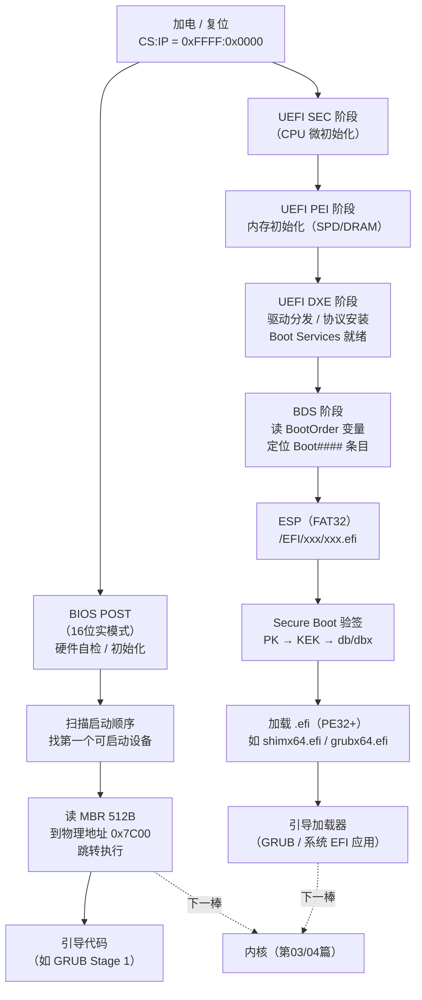

# OS启动（02）· BIOS与UEFI固件

固件是加电后 CPU 执行的**第一段代码**，它的职责是"点亮硬件、找到可信代码、把控制权交出去"。理解 BIOS 与 UEFI 的差异，是读懂整条启动链的基础。

## 概述与定位

> [!abstract] TL;DR
> **BIOS（传统固件）**：16 位实模式运行；完成 POST 硬件自检；从启动设备第一个扇区（MBR，512B）读入物理地址 `0x7C00` 并跳转执行；提供 `INT 10h/13h/16h` 中断服务；只认 MBR 分区，硬盘上限 2TB。
>
> **UEFI（现代固件标准）**：取代 BIOS；从 ESP（FAT32 分区）加载 `.efi`（PE32+ 格式）引导程序；提供 Boot Services 与 Runtime Services；配套 GPT 分区；Secure Boot 通过 PK→KEK→db/dbx 密钥层级验证签名。
>
> 本篇在系列启动链的位置：**加电 → 固件（本篇）→ 引导扇区 → 引导加载器 → 内核**。

固件存储在主板 ROM/NOR Flash 上，是 CPU 复位后 `CS:IP = 0xF000:0xFFF0`（IP=0xFFF0，物理地址 `0xFFFFFFF0`，映射到固件 ROM 末端）处的第一段可执行代码。本篇聚焦"固件做了什么、两代固件的架构差异、Secure Boot 的信任根"，不重复 MBR 格式细节（见 [[03.MBR与GPT与引导扇区]]）。

---

## 原理与机制

### 启动路径对比

两代固件的核心差异在于"用什么格式存引导程序、在哪里找它、怎么验它"：



> [!note] 四个 UEFI 阶段
> UEFI 固件内部分四阶段：**SEC**（安全初始化，CPU cache-as-RAM）→ **PEI**（Pre-EFI Init，DRAM 初始化）→ **DXE**（Driver Execution Environment，驱动与协议）→ **BDS**（Boot Device Select，找并启动引导程序）。Boot Services 在 DXE/BDS 期间可用，内核调用 `ExitBootServices()` 后只保留 Runtime Services。

---

## 结构详解

### BIOS 流程与中断服务

#### POST（Power-On Self-Test）

BIOS 加电后第一件事是 **POST**：

1. CPU 寄存器初始化，验证自身状态（16 位实模式，`CS=0xF000`）。
2. 检测 ROM BIOS 校验和。
3. 初始化内存控制器，做 RAM 基础测试（故障时有蜂鸣码）。
4. 枚举并初始化 PCI/ISA 设备（显卡最先，以便显示错误信息）。
5. 按 CMOS 中存储的**启动顺序**（Boot Order）扫描设备——软盘/光驱/硬盘/网络 PXE。

POST 通过后，BIOS 把找到的第一个可启动设备的**第一个扇区（512 字节，即 MBR）**读入物理地址 `0x7C00`，校验偏移 `0x1FE` 处的引导签名是否为 `0x55 0xAA`，然后 `jmp 0x0000:0x7C00` 把控制权交出去。

```
物理内存布局（加电后 BIOS 阶段，1MB 以内）：
  0x00000 – 0x003FF   IVT（中断向量表，256 个 BIOS 中断向量）
  0x00400 – 0x004FF   BDA（BIOS Data Area）
  0x07C00 – 0x07DFF   MBR（BIOS 从设备读入，512 字节）
  0x0A000 – 0x0BFFF   VGA/显存
  0x0C000 – 0x0FFFF   ROM 扩展（显卡 BIOS、网卡 PXE ROM 等）
  0xF0000 – 0xFFFFF   BIOS ROM（系统固件）
```

#### BIOS 中断服务

BIOS 通过**中断向量表（IVT）**暴露硬件服务，引导代码在 16 位实模式下可直接调用：

| 中断号 | 功能 | 常用子功能（AH） |
|--------|------|----------------|
| `INT 10h` | 视频服务（显示字符、设置视频模式） | `AH=0Eh` 字符输出；`AH=00h` 设置视频模式 |
| `INT 13h` | 磁盘 I/O | `AH=02h` 读扇区；`AH=42h` 扩展读（LBA，>8GB） |
| `INT 15h` | 系统服务（内存探测、A20、APM） | `AH=E820h` 探测内存图；`AH=2401h` 使能 A20 |
| `INT 16h` | 键盘服务 | `AH=00h` 读键；`AH=01h` 检测键盘缓冲 |

> [!note] A20 地址线
> 8086 有 20 位地址总线，地址回绕行为被某些程序依赖。80286 引入 21 位物理线后，为兼容在 8042 键盘控制器上增加 **A20 Gate**。BIOS 在进入保护模式前必须打开 A20（`INT 15h AX=2401h` 或直接操作 0x92 端口），否则奇数 MB 地址无法访问。详见 [[05.从实模式到保护模式到长模式]]。

BIOS 进入保护/长模式后**不再可用**（IVT 依赖实模式中断机制）。引导加载器需要在模式切换前利用完所有 BIOS 服务，或在之后自己驱动硬件。

#### BIOS 的局限

| 限制 | 原因 |
|------|------|
| 硬盘 ≤ 2TB | MBR 分区表使用 32 位 LBA，最大寻址 `2^32 × 512B = 2TB` |
| 引导代码 ≤ 446 字节 | MBR 中只有前 446 字节是引导代码区 |
| 运行于 16 位实模式 | 无内存保护，无 64 位指令 |
| 无验签机制 | 任何写入 MBR 的代码都会被信任执行 |

---

### UEFI：ESP、服务、变量与 PE32+

#### ESP（EFI System Partition）

ESP 是一个独立的 **FAT32 分区**（通常 100–500MB），存储所有 EFI 引导程序：

```
ESP 典型目录结构：
  /EFI/
    BOOT/
      BOOTX64.EFI       ← 默认启动项（Removable Media Boot Path）
    ubuntu/
      grubx64.efi       ← Ubuntu GRUB 引导程序
      shimx64.efi       ← Secure Boot 垫片（发行版签名）
      MokManager.efi    ← MOK 密钥管理器
    Microsoft/
      Boot/
        bootmgfw.efi    ← Windows 引导管理器
```

ESP 用 GPT 分区类型 GUID `C12A7328-F81F-11D2-BA4B-00A0C93EC93B` 标识。UEFI 固件内置 FAT32 驱动，直接解析 ESP 文件系统——无需外部引导加载器就能定位 `.efi` 文件。

#### .efi 是 PE32+ 可执行文件

UEFI 应用（包括 GRUB、shim、Windows 引导管理器）是标准的 **PE32+（Portable Executable，64位变体）**格式，与 Windows `.exe`/`.dll` 格式相同：

```
.efi 文件布局（PE32+）：
  [DOS 头]  MZ 魔数（0x4D5A），e_lfanew 指向 PE 头
  [PE 签名] "PE\0\0"（0x50450000）
  [COFF 头] Machine=0x8664（x86-64），NumberOfSections 等
  [可选头]  Magic=0x020B（PE32+），AddressOfEntryPoint，
             Subsystem=0x000A（EFI_APPLICATION）
             DataDirectory[4] = IMAGE_DIRECTORY_ENTRY_SECURITY
             （指向 WIN_CERTIFICATE，存放 Authenticode 签名）
  [节表]    .text / .data / .reloc 等
  [节数据]  代码与数据
  [签名块]  Authenticode（WIN_CERTIFICATE，pkcs#7 签名数据）
```

UEFI 固件的 PE 加载器（`LoadImage`）负责将 `.efi` 读入内存、处理 `.reloc` 重定位、验证 Authenticode 签名（若 Secure Boot 启用），然后调用入口点 `EFI_IMAGE_ENTRY_POINT(ImageHandle, SystemTable)`。

> [!note] 为什么用 PE32+ 而不是 ELF？
> UEFI 规范由 Intel 主导，最初为 Itanium 设计，选用微软已成熟的 PE/COFF 格式作为可移植二进制格式。这也使 Windows 引导程序与 Linux shim/GRUB 共用同一套固件加载路径，降低了固件实现复杂度。

#### Boot Services 与 Runtime Services

UEFI 通过 `EFI_SYSTEM_TABLE` 向引导程序暴露两套服务接口：

**Boot Services**（`EFI_BOOT_SERVICES`，仅在调用 `ExitBootServices()` 前可用）：

| 类别 | 典型函数 | 说明 |
|------|---------|------|
| 内存管理 | `AllocatePool` / `FreePool` / `AllocatePages` | 堆分配与页分配 |
| 映像加载 | `LoadImage` / `StartImage` / `UnloadImage` | 加载并执行 .efi |
| 协议 | `InstallProtocol` / `LocateProtocol` / `HandleProtocol` | 驱动/设备能力注册与发现 |
| 事件/计时器 | `CreateEvent` / `SetTimer` / `WaitForEvent` | 异步通知机制 |
| 内存映射 | `GetMemoryMap` | 获取物理内存布局（内核启动前必须调用） |

**Runtime Services**（`EFI_RUNTIME_SERVICES`，调用 `ExitBootServices()` + `SetVirtualAddressMap()` 后仍可用）：

| 类别 | 典型函数 | 说明 |
|------|---------|------|
| 变量 | `GetVariable` / `SetVariable` | 读写 UEFI 持久化变量 |
| 时间 | `GetTime` / `SetTime` | 硬件时钟 |
| 复位 | `ResetSystem` | 重启或关机 |
| 虚拟地址 | `SetVirtualAddressMap` | 内核切换到虚拟地址后通知固件重映射 |

> [!note] `ExitBootServices()` 是关键交接点
> 内核调用 `ExitBootServices()` 后，固件释放所有 Boot Services 占用的内存，Boot Services 指针失效；内核调用 `SetVirtualAddressMap()` 将物理地址重映射为内核虚拟地址，Runtime Services 随即以新虚拟地址运行。详见 [[06.内核解压与早期初始化]]。

#### UEFI 变量：BootOrder 与 Boot####

UEFI 用**非易失性变量（NV NVRAM）**存储启动配置，通过 `{GUID, VariableName}` 唯一标识：

| 变量名 | 命名空间 GUID | 含义 |
|--------|-------------|------|
| `BootOrder` | `EFI_GLOBAL_VARIABLE` | `UINT16[]`，启动项优先级列表 |
| `Boot0001`…`Boot####` | `EFI_GLOBAL_VARIABLE` | 各启动项：设备路径 + 描述 + 属性 |
| `BootCurrent` | `EFI_GLOBAL_VARIABLE` | 本次实际使用的启动项编号 |
| `SecureBoot` | `EFI_GLOBAL_VARIABLE` | 1=Secure Boot 启用 |
| `SetupMode` | `EFI_GLOBAL_VARIABLE` | 1=Setup 模式（PK 未注册） |
| `PK` | `EFI_IMAGE_SECURITY_DATABASE_GUID` | Platform Key |
| `KEK` | `EFI_IMAGE_SECURITY_DATABASE_GUID` | Key Exchange Key(s) |
| `db` | `EFI_IMAGE_SECURITY_DATABASE_GUID` | 允许的签名/哈希数据库 |
| `dbx` | `EFI_IMAGE_SECURITY_DATABASE_GUID` | 吊销的签名/哈希数据库 |

`efibootmgr` 在 Linux 下通过 `/sys/firmware/efi/efivars/` 接口读写这些变量。

---

### Secure Boot：密钥层级与验签流程

Secure Boot 是 UEFI 规范中定义的固件层代码签名验证机制，目标是确保固件只执行经过信任链验证的引导代码。

#### 密钥层级

```
信任根（ROM 中的证书/PK）
        │
        ▼
  PK（Platform Key）
  ─────────────────────────────────────────────────
  由主板厂商（OEM/ODM）持有私钥，公钥注册到固件中。
  PK 用于签署/授权 KEK 的更新。每块主板只有一个 PK。
        │
        ▼
  KEK（Key Exchange Key，可多个）
  ─────────────────────────────────────────────────
  由操作系统厂商或发行商持有私钥（如 Microsoft KEK、Red Hat KEK）。
  KEK 用于签署 db/dbx 数据库的更新。
        │
        ├──► db（Authorized Signature Database，允许数据库）
        │       • 存储允许执行的签名证书或文件哈希
        │       • 固件验证 .efi 签名时，检查证书链是否可信于 db 中的 CA
        │
        └──► dbx（Forbidden Signature Database，吊销数据库）
                • 存储已知被吊销的签名或文件哈希
                • 匹配 dbx 的 .efi 即使签名有效也拒绝加载
```

#### shim：发行版签名垫片

Linux 发行版（Ubuntu/Fedora/SUSE 等）的引导程序（GRUB）通常**未被 Microsoft 的 KEK 直接签名**，而是通过 `shim` 机制：

```
固件验签（Secure Boot ON）
  └─► shimx64.efi
        ├─ 由 Microsoft UEFI CA 签名（db 中存在）→ 固件允许加载
        ├─ shim 内含发行版自己的证书（MOK，Machine Owner Key）
        └─► grubx64.efi
              ├─ 由发行版证书签名 → shim 验签通过
              └─► vmlinuz（内核）← 由发行版证书或 DKMS 模块签名
```

用户可以通过 `MokManager.efi` 向 shim 注册自定义密钥（MOK），用于签名自编译内核或第三方内核模块，而无需触及固件的 PK/KEK/db 层级。

#### CSM（兼容支持模块）

UEFI 可选内置 **CSM（Compatibility Support Module）**，模拟传统 BIOS 行为（16 位实模式、INT 13h 磁盘服务、MBR 启动），以兼容旧操作系统和引导程序。启用 CSM 时通常**必须关闭 Secure Boot**，因为 CSM 无法对传统 MBR 代码做验签。现代 Linux/Windows 均支持纯 UEFI 启动，建议关闭 CSM。

---

## 实战与观察

### 判断系统是否以 UEFI 模式启动

```bash
# 目录存在 → UEFI 启动；目录不存在 → BIOS/Legacy 启动
ls /sys/firmware/efi
```

```text
# 示例输出（UEFI 启动的系统）：
config_table  efivars  fw_platform_size  fw_vendor  runtime  runtime-map  systab  tables
```

> [!warning] 示例输出为示意

如果在 BIOS 启动的系统上执行上述命令，会得到 `ls: cannot access '/sys/firmware/efi': No such file or directory`。

### 查看 UEFI 启动项

```bash
# 查看所有启动项及当前 BootOrder
efibootmgr -v
```

```text
# 示例输出（代表性，非本机实跑）：
BootCurrent: 0003
Timeout: 2 seconds
BootOrder: 0003,0000,0001,0002
Boot0000* Windows Boot Manager	HD(1,GPT,xxxxxxxx-xxxx-xxxx-xxxx-xxxxxxxxxxxx,0x800,0x100000)/File(\EFI\Microsoft\Boot\bootmgfw.efi)
Boot0001* ubuntu	HD(1,GPT,xxxxxxxx-xxxx-xxxx-xxxx-xxxxxxxxxxxx,0x800,0x100000)/File(\EFI\ubuntu\shimx64.efi)
Boot0003* UEFI: USB	HD(1,MBR,0x00000000,0x0,0x2000)/CDROM(...)
```

> [!warning] 示例输出为示意

```bash
# 修改启动顺序（将 Boot0001 ubuntu 置为第一项）
sudo efibootmgr --bootorder 0001,0003,0000,0002

# 添加新启动项
sudo efibootmgr --create --disk /dev/sda --part 1 \
  --label "My GRUB" --loader '\EFI\mygrub\grubx64.efi'

# 删除启动项
sudo efibootmgr --delete-bootnum --bootnum 0004
```

### 查看 Secure Boot 状态

```bash
# 查看 Secure Boot 是否启用
mokutil --sb-state
```

```text
# 示例输出：
SecureBoot enabled
```

> [!warning] 示例输出为示意

```bash
# 查看 db/dbx 数据库中的证书
mokutil --db       # 允许数据库
mokutil --dbx      # 吊销数据库
mokutil --list-enrolled   # 列出 MOK 中的用户注册密钥

# 查看 EFI 变量原始值（需 efivarfs 挂载）
ls /sys/firmware/efi/efivars/ | grep -E "^(Boot|SecureBoot|BootOrder)"
cat /sys/firmware/efi/efivars/SecureBoot-8be4df61-93ca-11d2-aa0d-00e098032b8c | xxd
```

```text
# 示例输出（SecureBoot 变量，前4字节为属性，第5字节为值 1=启用）：
00000000: 0700 0000 01                             .....
```

> [!warning] 示例输出为示意

### 验证 .efi 文件格式

```bash
# 确认 .efi 是 PE32+ 格式
file /boot/efi/EFI/ubuntu/grubx64.efi

# 查看 PE 头（需要 binutils 或 llvm）
objdump -f /boot/efi/EFI/ubuntu/grubx64.efi
objdump -p /boot/efi/EFI/ubuntu/grubx64.efi | head -30

# 验证 Authenticode 签名（需要 sbverify）
sbverify --list /boot/efi/EFI/ubuntu/shimx64.efi
```

```text
# 示例输出（file 命令）：
/boot/efi/EFI/ubuntu/grubx64.efi: PE32+ executable (EFI application) x86-64, for MS Windows
```

> [!warning] 示例输出为示意

---

## 安全性与正确使用

### Secure Boot 的信任根与绕过面

Secure Boot 的安全性依赖以下假设，任何一个被破坏都构成绕过面：

1. **PK 私钥安全**：OEM 出厂后 PK 私钥不外泄。若泄漏，攻击者可伪造 KEK/db 更新。
2. **db 数据库无弱证书**：`db` 中不能存在已被撤销或被入侵的 CA 证书。2023 年的 "BlackLotus" 利用了一个旧版 Windows 引导加载器的签名未被 `dbx` 吊销，绕过了 Secure Boot。
3. **物理安全**：攻击者若能物理接触主板，可清除 PK（进入 Setup 模式），绕过全部验签。
4. **shim 安全**：shim 本身的代码漏洞可被利用（如 BootHole CVE-2020-10713），需要及时更新 `dbx` 吊销受影响版本的哈希。
5. **CSM 与 Secure Boot 不共存**：打开 CSM 即关闭 Secure Boot，MBR 路径绕过验签。

> [!note] 信任链视角
> Secure Boot 本质上是**代码签名在固件层的延伸**，与 [[13.可信启动与启动安全]] 中的 Measured Boot（TPM PCR 扩展）互补：Secure Boot 做"阻断不可信代码"，Measured Boot 做"记录启动过程的度量值"，两者合用才构成完整的可信启动方案。

### 固件更新的风险

固件更新（UEFI/BIOS 刷写）是双刃剑：

- **必要性**：修复固件安全漏洞（如 CVE-2020-10713 BootHole、Intel CSME 漏洞）、更新 CPU 微码（Spectre/Meltdown 缓解）。
- **风险**：
  - 更新途中断电可导致固件损坏，主板变砖（部分主板有双 BIOS 或 Recovery Flash 机制）。
  - 恶意固件更新（供应链攻击）可植入持久化后门（Bootkit），即使重装操作系统也无法清除。
- **防御建议**：
  - 固件更新使用厂商官方工具（`fwupdmgr`，Linux Vendor Firmware Service/LVFS）。
  - 重要系统启用 Secure Boot + `dbx` 定期更新。
  - 考虑 TPM + Measured Boot 检测固件是否被篡改。

```bash
# Linux 下使用 fwupd 检查/更新固件
fwupdmgr get-devices     # 列出可通过 LVFS 更新的设备
fwupdmgr refresh         # 刷新元数据
fwupdmgr get-updates     # 查看可用固件更新
fwupdmgr update          # 执行更新（系统重启后应用）
```

---

## 小结

| 维度 | BIOS（Legacy） | UEFI（现代） |
|------|--------------|------------|
| CPU 模式 | 16 位实模式（全程） | 32/64 位保护/长模式 |
| 硬盘上限 | ≤ 2TB（MBR 32位LBA） | ≥ 8 ZB（GPT 64位LBA） |
| 引导文件格式 | MBR 446 字节原始代码 | PE32+ `.efi` 可执行 |
| 引导文件存储 | 设备第一个扇区（MBR） | ESP（FAT32）分区 |
| 接口标准 | INT 10h/13h/16h BIOS 中断 | Boot Services / Runtime Services |
| 启动配置 | CMOS 顺序（无标准接口） | UEFI NVRAM 变量（`BootOrder`/`Boot####`） |
| 代码验签 | 无 | Secure Boot（PK→KEK→db/dbx） |
| 分区表 | MBR（最多4个主分区） | GPT（默认128个分区） |
| 可持续服务 | 无（模式切换后失效） | Runtime Services（`SetVirtualAddressMap` 后仍用） |

启动链的第一棒——固件——决定了引导程序必须满足的接口契约：BIOS 要求引导代码在 `0x7C00` 处开始、以 16 位实模式运行；UEFI 要求引导程序是合法的 PE32+ `.efi`、位于 ESP 的标准路径下、符合 Boot Services API 调用约定。后续每一棒（GRUB、内核、init）都是在这个约定之上叠加的。

---

## 相关阅读

- **MBR 与 GPT 结构详解**：[[03.MBR与GPT与引导扇区]]
- **GRUB 引导加载器**：[[04.引导加载器GRUB与U-Boot]]
- **CPU 模式切换（实模式→长模式）**：[[05.从实模式到保护模式到长模式]]
- **内核启动：ExitBootServices 之后**：[[06.内核解压与早期初始化]]
- **可信启动与 TPM Measured Boot**：[[13.可信启动与启动安全]]
- **PE32+ 格式详解**：[[13.PE文件详解/00-合集总览-PE文件详解.md]]
- **二进制防护机制（RELRO/Secure Boot 对比视角）**：[[34.现代二进制防护机制/00.现代二进制防护机制总览.md]]
- **汇编与 x86 架构基础**：[[21.Asm/43 启动流程与Bootloader.md]]

---

⬅️ 上一篇 [[01.加电到用户态的启动全景]] ｜ 🏠 [[00.操作系统加载与启动总览]] ｜ 下一篇 [[03.MBR与GPT与引导扇区]] ➡️
