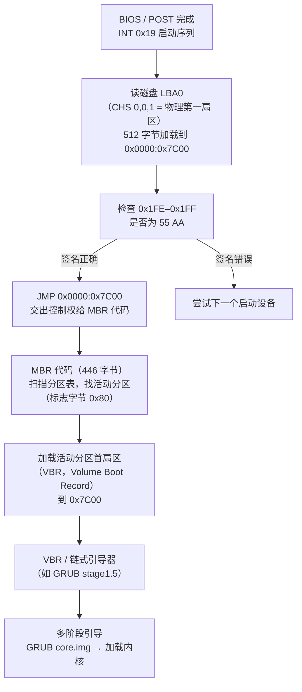
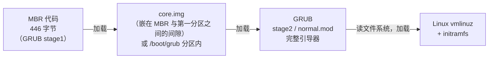
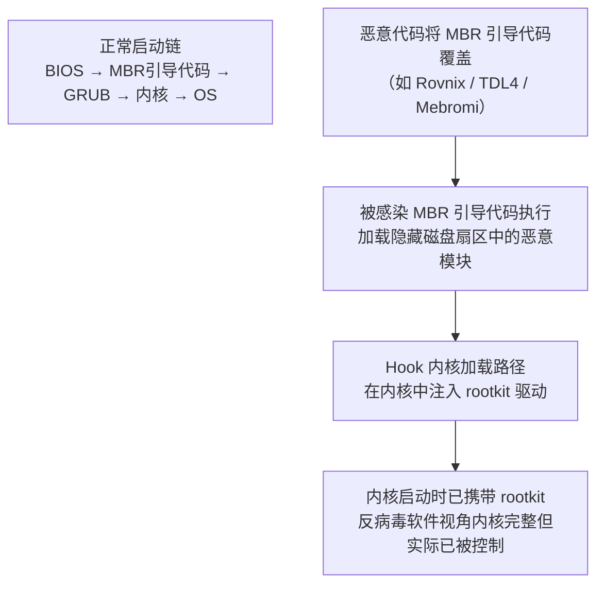

# OS启动（03）· MBR与GPT与引导扇区

## 概述与定位

> [!abstract] TL;DR
> BIOS 上电自检（POST）结束后，需要从磁盘找到"第一段可执行代码"——这就是引导扇区机制存在的原因。**MBR（Master Boot Record）** 是传统 BIOS 时代的方案：磁盘第一扇区的 512 字节，`0x000–0x1BD` 是引导代码，`0x1BE` 起是 4 个 16 字节分区表项，`0x1FE–0x1FF` 是引导签名 `55 AA`。BIOS 把它读到物理地址 `0x7C00` 并跳转执行。MBR 只能描述 4 个主分区、最大 2 TB 磁盘。**GPT（GUID Partition Table）** 是 UEFI 时代的替代：LBA0 放保护性 MBR（防旧工具误写），LBA1 放 GPT 头（签名 "EFI PART"），随后是默认 128 个 128 字节的分区表项，末尾还有备份副本，支持 >2 TB 磁盘和多达 128 个分区。理解这两种布局是理解"固件如何找到引导加载器"的基础。

本篇在启动链的位置：

```
固件（BIOS/UEFI）→ [本篇] 引导扇区（MBR/GPT）→ 引导加载器（GRUB）→ 内核
```

- 上游：[[02.BIOS与UEFI固件]]（固件如何触发对 MBR 的读取）
- 下游：[[04.引导加载器GRUB与U-Boot]]（GRUB 如何从 MBR/GPT 信息找到内核）
- 汇编/硬件视角互补：[[21.Asm/43 启动流程与Bootloader.md]]

---

## 原理与机制

### BIOS 时代的引导链

BIOS 完成 POST 后，按 Boot Order 枚举设备，对磁盘设备执行以下动作：



> [!note] 为什么是 0x7C00？
> 早期 IBM PC 将 32 KB（0x8000）RAM 的尾部留给引导代码：`0x7C00` = 0x8000 − 512（MBR）− 512（保留栈空间）。这是历史遗留的固定约定，BIOS 无条件写入此地址。

### UEFI 时代的引导链

UEFI 不依赖 MBR 引导代码，而是直接读 GPT 分区表，找到 ESP（EFI System Partition，FAT32），加载其中的 `.efi` 文件（PE32+ 格式）执行。详见 [[02.BIOS与UEFI固件]]。

### MBR 446 字节装不下完整引导器 → 多阶段引导



MBR 的 446 字节只够放一段"跳转器"，真正的引导逻辑（文件系统驱动、菜单、内核加载）需分多阶段加载。GRUB 2 的 `core.img` 嵌在 MBR 与第一分区之间的空隙扇区（对 MBR 磁盘通常是 LBA1–LBA2047）。

---

## 结构 / 字节详解

### MBR 512 字节逐字节布局

```
偏移（十六进制）  大小（字节）  内容
0x000            446          引导代码（Bootstrap Code）
                              ├── 真实模式 x86 机器码
                              ├── 通常含磁盘错误信息字符串
                              └── 末尾 GRUB/Syslinux 签名字符串

0x1BE            16           分区表项 #1（见下表）
0x1CE            16           分区表项 #2
0x1DE            16           分区表项 #3
0x1EE            16           分区表项 #4

0x1FE             1           引导签名字节低位  = 0x55
0x1FF             1           引导签名字节高位  = 0xAA
                              （磁盘上字节序：55 AA，小端）
```

> [!tip] 记忆口诀
> `0x1BE = 446 = 0x1BE`；四表项各 16 字节共 64 字节；`446 + 64 + 2 = 512`，加法闭合。

### 分区表项（16 字节）详解

每个分区表项的内部布局（偏移相对于该项起始）：

| 字节偏移 | 大小 | 字段名 | 说明 |
|---|---|---|---|
| 0x00 | 1 | `Status` | 活动/引导标志：`0x80` = 可引导，`0x00` = 非引导，其他值无效 |
| 0x01 | 3 | `First CHS` | 分区起始扇区的 CHS 地址（已过时，LBA > 1024 柱时无意义） |
| 0x04 | 1 | `Type` | 分区类型字节（`0x83`=Linux，`0x82`=Linux swap，`0x0C`=FAT32，`0xEE`=GPT 保护性 MBR，等） |
| 0x05 | 3 | `Last CHS` | 分区末尾扇区的 CHS 地址（同上，已过时） |
| 0x08 | 4 | `First LBA` | 分区起始扇区的 LBA 地址（32 位无符号，小端） |
| 0x0C | 4 | `Sectors` | 分区扇区总数（32 位无符号，小端） |

> [!note] 为什么 MBR 最大支持 2 TB？
> `First LBA` 和 `Sectors` 均为 32 位无符号整数，最大值 2³² − 1 = 4,294,967,295 个扇区。每扇区 512 字节 → 最大寻址范围 = 4,294,967,295 × 512 ≈ **2.199 TB**，即约 2 TB 上限。

### 引导签名 0x55AA 详解

```
物理磁盘字节（LBA0 偏移 0x1FE 起）：
  偏移 0x1FE: 0x55
  偏移 0x1FF: 0xAA

x86 小端读为 16 位值：0xAA55
（BIOS 代码通常检查 AX == 0xAA55 或直接检查两个字节）
```

> [!info] 历史来源
> 0x55 = `01010101b`，0xAA = `10101010b`——二者逐位互补，是最早期磁盘校验"存在可读扇区"的简单标记，并非有深刻含义的魔数。

### MBR 局限总结

| 局限 | 原因 | 影响 |
|---|---|---|
| 最多 4 个主分区 | 分区表仅 4 项 | 需"扩展分区 + 逻辑分区"绕过 |
| 最大 2 TB | 32 位 LBA × 512B = 2.199 TB | 大磁盘须用 GPT |
| 无冗余校验 | MBR 无 CRC | 损坏难恢复 |
| 引导代码固定 512B | 扇区硬限制 | 需多阶段链式引导 |

---

### GPT（GUID Partition Table）布局

GPT 把分区表信息分散在磁盘头部和尾部，支持大磁盘和多分区：

```
LBA  0  : 保护性 MBR（Protective MBR）
           ├── 引导代码区：全零或警告字符串
           └── 分区表：仅一项，Type=0xEE，跨越整盘，防旧工具误操作

LBA  1  : GPT 头（Primary GPT Header，92 字节）
           ├── 签名 "EFI PART"（8 字节，ASCII）
           ├── 版本 0x00010000（4 字节）
           ├── 头大小（4 字节，通常 92）
           ├── 头 CRC32（4 字节，计算时此字段置零）
           ├── 保留（4 字节，必须为 0）
           ├── 本头 LBA（8 字节，= 1）
           ├── 备份头 LBA（8 字节，= 磁盘最后一个 LBA）
           ├── 分区可用区域起始 LBA（8 字节）
           ├── 分区可用区域结束 LBA（8 字节）
           ├── 磁盘 GUID（16 字节）
           ├── 分区表项起始 LBA（8 字节，= 2）
           ├── 分区表项数量（4 字节，默认 128）
           ├── 每项大小（4 字节，默认 128）
           └── 分区表 CRC32（4 字节）

LBA  2  : 分区表项数组起始
LBA  2 ~ LBA 33 : 128 个分区表项（每项 128 字节，共 128×128=16384 字节=32 扇区）

LBA 34  : 可用数据区（第一个分区通常从此开始，实际受对齐影响）

…（数据分区）…

LBA N-33: 备份分区表项数组（32 扇区）
LBA N-1 : 备份 GPT 头（Secondary GPT Header）
LBA N   : 磁盘最后一个 LBA
```

### GPT 分区表项（128 字节）字段

| 字节偏移 | 大小 | 字段名 | 说明 |
|---|---|---|---|
| 0x00 | 16 | `PartitionTypeGUID` | 分区类型 GUID（如 EFI SP = `C12A7328-F81F-11D2-BA4B-00A0C93EC93B`；Linux data = `0FC63DAF-8483-4772-8E79-3D69D8477DE4`） |
| 0x10 | 16 | `UniquePartitionGUID` | 分区唯一 GUID，每个分区独一无二 |
| 0x20 | 8 | `StartingLBA` | 分区起始 LBA（64 位，小端） |
| 0x28 | 8 | `EndingLBA` | 分区结束 LBA（含，64 位，小端） |
| 0x30 | 8 | `Attributes` | 分区属性标志（bit 2 = Legacy BIOS bootable，bit 60–63 由类型 GUID 定义） |
| 0x38 | 72 | `PartitionName` | 分区名称（UTF-16LE，最多 36 个字符） |

> [!note] GPT 为何支持 >2 TB？
> `StartingLBA` 和 `EndingLBA` 均为 64 位，最大可寻址 2⁶⁴ 个扇区。64 位 LBA × 512B = 9.4 × 10²¹ 字节（约 8.5 ZB），远超当前磁盘容量上限。

### MBR vs GPT 对比表

| 特性 | MBR | GPT |
|---|---|---|
| 最大磁盘容量 | ≈ 2 TB（32 位 LBA） | > 8 ZB（64 位 LBA） |
| 最大分区数 | 4 个主分区（可扩展分区绕过） | 默认 128 个，理论无限 |
| 冗余 / 备份 | 无 | 头部 + 尾部双份 GPT 头；分区表有 CRC32 |
| 完整性校验 | 无 | GPT 头 CRC32 + 分区表 CRC32 |
| 配套固件 | BIOS（传统） | UEFI（现代）；亦可在 BIOS+GRUB 下使用（需 BIOS Boot 分区） |
| 分区标识 | 1 字节分区类型码 | 128 位 GUID |
| 分区名称 | 无 | UTF-16LE 最多 36 字符 |
| 引导方式 | MBR 引导代码（446 字节）→ VBR | UEFI 直接从 ESP 加载 `.efi`；或 GRUB + BIOS Boot 分区 |
| 防误操作 | 无 | 保护性 MBR（Type=0xEE）让旧工具识别磁盘为"已用" |

---

## 实战 / 观察

### 用 dd + xxd 看 MBR 签名

```bash
# 读取 /dev/sda 第一扇区（512 字节）并以十六进制显示
sudo dd if=/dev/sda bs=512 count=1 2>/dev/null | xxd | tail -4
```

```text
00001f0: 0000 0000 0000 0000 0000 0000 0000 0000  ................
00001fe: 55aa                                     U.
```

> [!warning] 示例输出为示意

引导签名出现在偏移 `0x1FE`，字节为 `55 AA`。

```bash
# 只看偏移 0x1BE 起的 64 字节（分区表区域）
sudo dd if=/dev/sda bs=1 skip=446 count=64 2>/dev/null | xxd
```

```text
00000000: 00fe ffff ee00 0800 00a0 0f00 00ff ffff  ................
00000010: 0000 0000 0000 0000 0000 0000 0000 0000  ................
00000020: 0000 0000 0000 0000 0000 0000 0000 0000  ................
00000030: 0000 0000 0000 0000 0000 0000 0000 0000  ................
```

> [!warning] 示例输出为示意

第一项 `Type=0xEE`（字节偏移 0x04），表明这是 GPT 保护性 MBR。`First LBA=0x00000001`（小端：`01 00 00 00`，即 LBA 1），`Sectors=0x000FA000`（示意值）。

### 用 xxd 看 GPT 头签名

```bash
# LBA1 起始（偏移 512）读 92 字节（GPT 头大小）
sudo dd if=/dev/sda bs=512 skip=1 count=1 2>/dev/null | xxd | head -6
```

```text
00000000: 4546 4920 5041 5254 0000 0100 5c00 0000  EFI PART....\...
00000010: 2f5a 8f9c 0000 0000 0100 0000 0000 0000  /Z..............
00000020: ffe7 e87d 0000 0000 2200 0000 0000 0000  ...}....".......
00000030: dee7 e87d 0000 0000 e9c1 b4f2 1fe4 7a40  ...}..........z@
00000040: ad54 2b7a 5e09 7f4e 0200 0000 0000 0000  .T+z^..N........
00000050: 8000 0000 8000 0000 a1e3 f5bb           ............
```

> [!warning] 示例输出为示意

- 偏移 `0x00–0x07`：`45 46 49 20 50 41 52 54` = `"EFI PART"`（8 字节 ASCII 签名）
- 偏移 `0x08–0x0B`：`00 00 01 00` = 版本 1.0
- 偏移 `0x22`（十进制 34）开始可见分区可用区域起始 LBA `0x22 = 34`

### fdisk 查看分区表

```bash
# 查看所有磁盘的分区信息（MBR 和 GPT 均可识别）
sudo fdisk -l /dev/sda
```

```text
Disk /dev/sda: 476.9 GiB, 512110190592 bytes, 1000215216 sectors
Disk model: Samsung SSD 870
Units: sectors of 1 * 512 = 512 bytes
Sector size (logical/physical): 512 bytes / 512 bytes
I/O size (minimum/optimal): 512 bytes / 512 bytes
Disklabel type: gpt
Disk identifier: B4F2E9C1-E41F-407A-AD54-2B7A5E097F4E

Device          Start        End    Sectors   Size Type
/dev/sda1        2048    1050623    1048576   512M EFI System
/dev/sda2     1050624  106037247  104986624    50G Linux filesystem
/dev/sda3   106037248 1000214527  894177280 426.4G Linux filesystem
```

> [!warning] 示例输出为示意

`Disklabel type: gpt` 说明使用 GPT 布局；`/dev/sda1` 类型为 `EFI System`，对应分区类型 GUID `C12A7328-...`。

### gdisk 查看 GPT 详情

```bash
sudo gdisk -l /dev/sda
```

```text
GPT fdisk (gdisk) version 1.0.8

Partition table scan:
  MBR: protective
  BSD: not present
  APM: not present
  GPT: present

Found valid GPT with protective MBR; using GPT.
Disk /dev/sda: 1000215216 sectors, 476.9 GiB
Sector size (logical/physical): 512/512 bytes
Disk identifier (GUID): B4F2E9C1-E41F-407A-AD54-2B7A5E097F4E
Partition table holds up to 128 entries
Main partition table begins at sector 2 and ends at sector 33
First usable sector is 34, last usable sector is 1000215182
Partitions will be aligned on 2048-sector boundaries

Number  Start (sector)    End (sector)  Size       Code  Name
   1            2048         1050623   512.0 MiB   EF00  EFI System Partition
   2         1050624       106037247   50.0 GiB    8300  Linux filesystem
   3       106037248      1000214527   426.4 GiB   8300  Linux filesystem
```

> [!warning] 示例输出为示意

`MBR: protective` 表明 LBA0 的保护性 MBR 已被识别；`Code EF00` 即 EFI System 分区类型；`Main partition table begins at sector 2 and ends at sector 33` 验证了分区表项占 LBA2–33（32 扇区 = 128 项 × 128 字节 / 512 字节/扇区 = 32）。

### 用 Python 解析 MBR 分区表项（脚本示意）

```python
import struct

with open("/dev/sda", "rb") as f:
    mbr = f.read(512)

sig = struct.unpack_from("<H", mbr, 0x1FE)[0]
print(f"引导签名: 0x{sig:04X}")  # 期望 0xAA55

for i in range(4):
    off = 0x1BE + i * 16
    status, _, _, ptype, _, _, lba_start, lba_size = struct.unpack_from(
        "BBBBBBsI", mbr, off
    )
    lba_start = struct.unpack_from("<I", mbr, off + 8)[0]
    lba_size  = struct.unpack_from("<I", mbr, off + 12)[0]
    print(f"项 {i+1}: status=0x{status:02X} type=0x{ptype:02X} "
          f"lba_start={lba_start} sectors={lba_size}")
```

> [!warning] 示例输出为示意

---

## 安全性与正确使用

### Bootkit：MBR 感染的分析与防御视角

**Bootkit** 是在 MBR 或 VBR 阶段植入的恶意代码，在操作系统内核加载前运行，因此能绕过所有内核级安全机制。

#### 典型感染原理



感染路径通常有两种：
1. **运行时写入**：利用已取得 `root` 权限的进程直接 `write()` `/dev/sda` 的前 512 字节。
2. **物理访问**：Evil Maid 攻击，离线挂载磁盘后写入恶意 MBR。

#### 防御层次

| 防御措施 | 原理 | 效果 |
|---|---|---|
| **UEFI Secure Boot** | 固件用 PK/KEK/db 密钥链验签引导器（shim/GRUB/内核），MBR 代码在 Secure Boot 下不被信任 | 阻止未签名 Bootkit 在 UEFI 系统上执行 |
| **Measured Boot + TPM** | 每个引导阶段将哈希扩展（extend）到 TPM PCR 寄存器；远程证明可检测 MBR 被篡改 | 事后可检测，但不阻止执行 |
| **UEFI + GPT 替代 MBR** | 完全不依赖 MBR 引导代码；UEFI 直接从 ESP 加载 `.efi` | 消除 MBR 代码被执行的路径 |
| **最小权限 + 写保护** | 生产系统禁止 `/dev/sda` 的直接写访问（`CAP_SYS_RAWIO` 限制） | 减少运行时感染面 |
| **定期校验 MBR 哈希** | `sha256sum /dev/sda` 首 512 字节并与基准比对 | 检测静态篡改 |

> [!tip] 分析视角
> 逆向 Bootkit 时，重点关注：（1）MBR 偏移 `0x000–0x1BD` 的代码是否与 GRUB/Syslinux 签名特征匹配；（2）是否有额外扇区被标记为"隐藏"或未被任何分区表项覆盖（TDL4 就是把恶意代码写在磁盘末尾的未分配区域）；（3）使用 `dd` 提取 MBR + 几十个扇区后，用 IDA/Ghidra 以 16 位实模式反汇编 `0x7C00` 处的代码。

### GPT 备份头的容错价值

GPT 在磁盘最后一个 LBA 保存完整的备份 GPT 头，在 LBA N-33 至 LBA N-2 保存备份分区表项数组。当主 GPT 头（LBA1）损坏时：

```bash
# 从备份 GPT 恢复主 GPT（gdisk 内置修复能力）
sudo gdisk /dev/sda
# 进入 gdisk 后选 r（recovery）→ d（use main GPT header） 或 e（use backup GPT header）
```

> [!warning] 示例输出为示意

```bash
# testdisk 也可自动扫描并修复 GPT
sudo testdisk /dev/sda
```

> [!warning] 示例输出为示意

### 常见启动故障排查

| 故障现象 | 可能原因 | 排查手段 |
|---|---|---|
| `Missing operating system` | MBR 引导代码损坏或引导签名不是 `55 AA` | `xxd /dev/sda \| head` 确认 `55 AA`；`grub-install` 重写 MBR |
| `GRUB` 停在 `rescue>` | GRUB core.img 找不到 `/boot/grub` | `ls` 命令枚举分区；设置 `prefix` 后 `insmod normal` |
| 分区表全丢失 | GPT 头 CRC32 不匹配 | `gdisk -l` 查错；从备份 GPT 恢复 |
| UEFI 无法找到启动项 | ESP 损坏或 `.efi` 路径不对 | `efibootmgr -v`；挂载 ESP 确认 `EFI/ubuntu/shimx64.efi` 等存在 |

---

## 小结

| 概念 | 关键事实 |
|---|---|
| MBR 大小 | **512 字节**，偏移 `0x000–0x1BD` 引导代码（446 B），`0x1BE` 起 4 × 16B 分区表项，`0x1FE–0x1FF` = `55 AA` |
| MBR 执行地址 | BIOS 加载到物理地址 **`0x7C00`** 并跳转 |
| MBR 局限 | 4 个主分区；磁盘上限 ≈ **2 TB**（32 位 LBA）；无冗余 |
| GPT 签名 | LBA1 偏移 `0x00` 起 8 字节 = **`"EFI PART"`** |
| GPT 分区表 | 默认 **128 项**，每项 **128 字节**；含分区类型 GUID、唯一 GUID、起止 LBA、名称 |
| GPT 容错 | 头部 + 尾部**双份**；CRC32 校验 |
| GPT 容量 | 64 位 LBA，理论支持 **>8 ZB** |
| 保护性 MBR | LBA0 的分区类型 `0xEE`，保护 GPT 磁盘不被旧工具误识 |
| 安全威胁 | Bootkit 感染 MBR；防御：UEFI Secure Boot + Measured Boot + TPM |

启动链的第一棒（固件 → 引导扇区）至此交接完毕：BIOS 或 UEFI 找到磁盘，验证签名/GUID，把控制权交给引导代码或 `.efi` 文件，下一棒由 [[04.引导加载器GRUB与U-Boot]] 接手——加载内核与 initramfs。

---

## 相关阅读

- 本系列上下文：[[01.加电到用户态的启动全景]] · [[02.BIOS与UEFI固件]] · [[04.引导加载器GRUB与U-Boot]]
- 汇编/启动流程互补：[[21.Asm/43 启动流程与Bootloader.md]] · [[21.Asm/15 x86(64).md]]
- 启动安全延伸：[[13.可信启动与启动安全]] · [[34.现代二进制防护机制/00.现代二进制防护机制总览.md]]

---

⬅️ 上一篇 [[02.BIOS与UEFI固件]] ｜ 🏠 [[00.操作系统加载与启动总览]] ｜ 下一篇 [[04.引导加载器GRUB与U-Boot]] ➡️
