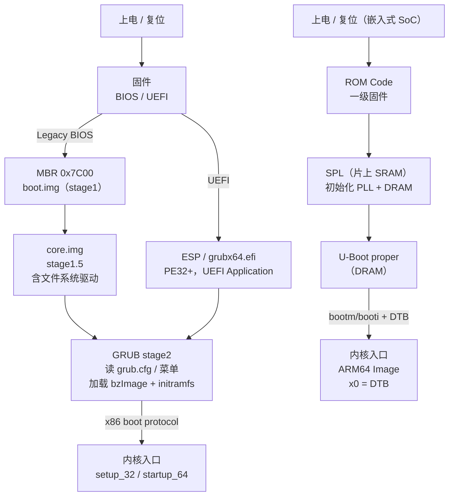

# OS启动（04）· 引导加载器GRUB与U-Boot

## 概述与定位

> [!abstract] TL;DR
> 引导加载器（Bootloader）是固件与内核之间的"桥接者"：它从磁盘/闪存读取内核映像和 initramfs，把它们装入内存，向内核传递启动参数（cmdline、内存图、DTB），最后跳转内核入口——把一台"刚点完灯的机器"移交给操作系统。
> - **GRUB2**（x86/x86-64）：多阶段加载，`boot.img → core.img → stage2`；UEFI 下直接以 `.efi` 形式在 ESP 上运行；读 `/boot/grub/grub.cfg` 呈现菜单并加载内核。
> - **U-Boot**（嵌入式 ARM/MIPS/RISC-V）：SPL（Secondary Program Loader）初始化 DRAM → U-Boot proper；通过环境变量 `bootcmd`/`bootargs` 驱动启动；通过 DTB（设备树 Blob）向内核描述硬件拓扑。
> - 本篇与 [[02.BIOS与UEFI固件]]、[[03.MBR与GPT与引导扇区]] 衔接，把"BIOS/UEFI 找到了启动设备"之后的过程讲透；第 [[06.内核解压与早期初始化]] 篇接续"内核拿到控制权后如何解压与初始化"。

启动接力的第三棒：

```
固件（BIOS/UEFI）
  └─→ [BIOS] 把 MBR/boot.img 读到 0x7C00 执行
  └─→ [UEFI] 在 ESP 上找并加载 grubx64.efi / bootaa64.efi
         └─→ 引导加载器（GRUB2 / U-Boot）
                  读文件系统 / 网络 / 闪存
                  把内核 + initramfs 装入内存
                  设好 cmdline / DTB / boot protocol
                  跳转内核入口
```

---

## 原理与机制

### GRUB2 多阶段加载链（BIOS Legacy 模式）

BIOS 只能把磁盘第一个 512 字节（MBR）读到 `0x7C00` 并跳过去。446 字节的引导代码根本塞不下文件系统驱动——于是 GRUB2 将自己拆为**三个阶段**，逐步"引导"出功能更强的下一阶段：

```
MBR（512 B，boot.img）
  ├─ 偏移 0x000–0x1BD：stage1 代码（446 B）
  ├─ 偏移 0x1BE–0x1FD：MBR 分区表（4 × 16 B）
  └─ 偏移 0x1FE–0x1FF：引导签名 0x55AA
```

stage1 代码唯一的使命：**找到并加载 `core.img`**（stage1.5，驻在 MBR 后的间隙扇区或分区起始处）。

`core.img`（stage1.5）尺寸可达数十 KB，已内嵌基本的文件系统驱动（ext4/xfs/btrfs 等），使 GRUB2 可以：
1. 挂载 `/boot` 分区。
2. 读取 `/boot/grub/grub.cfg`。
3. 向用户呈现启动菜单。
4. 加载内核映像（`bzImage`）+ initramfs 到内存。
5. 向内核传递 cmdline 与 boot protocol，跳转内核入口。

### GRUB2 在 UEFI 模式下

UEFI 下不存在"只能 512 B"的限制——固件直接把 ESP（FAT32 分区）上的 PE32+ 可执行文件作为 UEFI Application 加载：

```
ESP (FAT32)
  └─ /EFI/
       ├─ BOOT/
       │    └─ BOOTX64.EFI     ← fallback（Secure Boot 路径）
       └─ ubuntu/
            ├─ grubx64.efi     ← GRUB2 UEFI 可执行（PE32+）
            └─ shimx64.efi     ← Shim（Secure Boot 中间层）
```

`grubx64.efi` 是完整的 GRUB2，直接调用 UEFI Boot Services 读取文件系统、分配内存、加载内核，无需三阶段链。

### U-Boot SPL 链（嵌入式）

嵌入式 SoC 片上 SRAM 通常只有数十 KB，无法运行完整的 U-Boot proper——于是引入 **SPL（Secondary Program Loader）**：

```
上电复位（ROM Code 或一级固件）
  └─ 从 SPI NOR / eMMC boot partition / SD 卡加载 SPL（片上 SRAM，< 32 KB）
       ├─ 初始化时钟树（PLL）
       ├─ 初始化 DRAM 控制器（DDR 训练，最耗时）
       └─ 从存储加载 U-Boot proper 到 DRAM
            └─ U-Boot proper（大 DRAM 空间）
                 ├─ 初始化更多外设（网口 / USB / 显示）
                 ├─ 读环境变量（bootcmd / bootargs）
                 ├─ 加载内核 + DTB (+ initramfs) 到 DRAM
                 └─ bootm / booti → 跳转内核入口
```

### 整体 Mermaid 流程图



---

## 结构 / 流程详解

### GRUB2 stage1 — boot.img

`boot.img` 安装在 MBR 前 446 字节，由 `grub-install` 写入。其职责极简：

| 字段 | 偏移 | 大小 | 说明 |
|---|---|---|---|
| 引导代码 | `0x000` | 446 B | 定位并加载 core.img 第一扇区 |
| 分区表 | `0x1BE` | 64 B | 4 个 16 字节分区表项 |
| 引导签名 | `0x1FE` | 2 B | `0x55 0xAA`（小端），BIOS 验证此标志 |

`boot.img` 中硬编码了 `core.img` 所在的磁盘 LBA 地址（由 `grub-install` 写入）。实模式下用 BIOS INT 13h 读磁盘扇区。

### GRUB2 stage1.5 — core.img

`core.img` 通常写在 MBR 后的"MBR gap"（LBA 1 到分区起始之间，一般 1–2047 扇区 = 1 MiB 间隙），也可写在 BIOS Boot 分区（GPT 布局下专留的无文件系统分区）。

```
core.img 构成（按顺序打包）：
  diskboot.img   ← 第一扇区，被 boot.img 加载，接着读后续扇区
  lzma_decompress.img  ← LZMA 解压器（其余部分压缩存储）
  kernel.img     ← GRUB 内核（模块框架、命令解释器）
  modules        ← 文件系统驱动（ext4.mod、xfs.mod 等），内嵌在 core.img 中
```

`core.img` 加载并解压后，GRUB 进入保护模式（32 位），挂载 `/boot` 分区读取模块和配置。

### GRUB2 stage2 — 模块化阶段

stage2 是运行时动态加载的 GRUB 模块层：

```
/boot/grub/
  ├─ grub.cfg          ← 主配置文件（menuentry、linux、initrd 命令）
  ├─ grubenv           ← 持久环境变量（512 字节固定格式）
  └─ x86_64-efi/       ← （UEFI）或 i386-pc/ （BIOS），存放 .mod 文件
       ├─ normal.mod
       ├─ linux.mod     ← 加载 Linux 内核（boot protocol）
       ├─ ext2.mod      ← ext4 文件系统驱动（复用 ext2 代码）
       └─ ...
```

典型 `grub.cfg` menuentry 示例：

```bash
menuentry "Ubuntu 24.04 LTS" {
    load_video
    insmod gzio
    insmod part_gpt
    insmod ext2
    search --no-floppy --fs-uuid --set=root <UUID>
    linux   /vmlinuz-6.8.0-39-generic \
            root=UUID=<UUID> ro quiet splash
    initrd  /initrd.img-6.8.0-39-generic
}
```

- `linux` 命令：调用 `linux.mod`，将 `bzImage` 加载到适当地址，解析 **boot protocol**（setup 头），把 cmdline 写入 boot_params 结构体。
- `initrd` 命令：将 initramfs（cpio.gz）加载到内存，把地址+长度写入 boot_params。
- 菜单选定后，GRUB 切换到长模式（x86-64），跳转 `bzImage` 的入口 `startup_32`（实模式 setup code）。详见 [[06.内核解压与早期初始化]]。

### Multiboot 规范

GRUB 原创的 **Multiboot 规范**（Multiboot 1 / Multiboot 2）定义了引导加载器与内核之间的通用接口，使任何符合规范的内核都能被 GRUB 引导：

| 字段 | Multiboot 1 | Multiboot 2 |
|---|---|---|
| Magic 号（内核 ELF 中） | `0x1BADB002` | `0xE85250D6` |
| 加载地址 | 内核头部声明 | 更灵活的 tag 结构 |
| 内存图 | 基本 mmap | 扩展 mmap（UEFI 兼容） |
| 模块（initrd 等） | 支持 | 支持 |
| DTB | 不支持 | 支持 |
| UEFI | 不支持 | 支持（Multiboot 2） |

GRUB 通过 `multiboot` / `multiboot2` 命令加载符合规范的内核；通过 `module` / `module2` 命令加载附加模块（如 initrd）：

```bash
menuentry "GRUB Multiboot 示例" {
    multiboot2 /boot/mykernel.elf
    module2    /boot/initrd.img
    boot
}
```

引导时 GRUB 把 Multiboot Information Structure（MBI）的物理地址存入 `ebx`，magic `0x2BADB002` 存入 `eax`，内核据此找到内存图、模块列表等信息。

Linux 内核自身使用私有的 **Linux boot protocol**（`boot_params`/`struct setup_header`），并非 Multiboot。

### U-Boot SPL — 初始化 DRAM

SPL 是 U-Boot 的迷你版本，专为在片上 SRAM 运行而裁剪：

```
SPL 代码流程（ARM64 为例）：
  _start（reset vector）
    → lowlevel_init()     # 关中断、设 VBAR、CPU 基本初始化
    → spl_init()
    → board_init_f()
        → dram_init()     # 初始化 DDR PHY / 训练，最关键一步
    → spl_load_image()    # 从 SPI/eMMC/SD 读取 u-boot.img 到 DRAM
    → jump_to_image()     # 跳转 U-Boot proper 入口
```

**DDR 训练**（calibration）是 SPL 最耗时的操作——需要调整信号时序参数使 DRAM 稳定，通常需数百毫秒。

### U-Boot 环境变量

U-Boot 的"配置文件"是一组持久化的 **环境变量（environment variables）**，存于 SPI NOR Flash / eMMC 的固定分区：

| 变量 | 典型值 | 说明 |
|---|---|---|
| `bootcmd` | `run distro_bootcmd` | 自动启动时执行的命令序列 |
| `bootargs` | `root=/dev/mmcblk0p2 rw console=ttyS0,115200` | 传给内核的 cmdline |
| `bootdelay` | `2` | 自动启动前等待秒数（0=立即，-1=禁止） |
| `fdtfile` | `rockchip/rk3588-rock5b.dtb` | DTB 文件名 |
| `kernel_addr_r` | `0x02000000` | 内核加载地址 |
| `fdt_addr_r` | `0x01F00000` | DTB 加载地址 |
| `ramdisk_addr_r` | `0x06000000` | initramfs 加载地址 |

### U-Boot 关键命令

| 命令 | 说明 |
|---|---|
| `fatload mmc 0:1 ${kernel_addr_r} Image` | 从 eMMC 第 1 分区（FAT）加载内核 |
| `tftpboot ${kernel_addr_r} Image` | 从 TFTP 服务器网络加载内核 |
| `ext4load mmc 0:2 ${fdt_addr_r} /boot/dtb` | 从 ext4 分区加载 DTB |
| `booti ${kernel_addr_r} - ${fdt_addr_r}` | 启动 ARM64 Image（`-` 表示无 initramfs） |
| `bootm ${kernel_addr_r} ${ramdisk_addr_r} ${fdt_addr_r}` | 启动 uImage 格式内核 |
| `printenv` | 打印所有环境变量 |
| `setenv bootargs "..."` | 修改 bootargs |
| `saveenv` | 把环境变量持久化到存储 |

**`booti` vs `bootm`**：
- `bootm`：加载旧式 **uImage**（带 64 字节 U-Boot 头），支持压缩，多用于 32 位 ARM。
- `booti`：加载 **ARM64 Image**（Linux 标准内核格式，带 64 字节 ARM64 头），现代 ARM64 平台首选。

### 设备树 DTB — U-Boot 传给内核的硬件描述

**DTB（Device Tree Blob）** 是设备树源文件（`.dts`）编译后的二进制形式（`.dtb`），描述 SoC 上所有外设的寄存器基址、中断号、时钟域等硬件拓扑——使内核可以在运行时"发现"硬件，而不是硬编码。

```
DTB 内存结构（简化）：
  struct fdt_header {
      uint32_t magic;          // 0xD00DFEED，大端
      uint32_t totalsize;
      uint32_t off_dt_struct;  // 结构块偏移
      uint32_t off_dt_strings; // 字符串块偏移
      uint32_t off_mem_rsvmap; // 保留内存映射偏移
      uint32_t version;        // 当前 17
      ...
  };
```

U-Boot 加载 DTB 到 `fdt_addr_r` 后，`booti` 命令将其物理地址写入 `x0`（ARM64 约定）或通过 RISC-V 的 `a1` 寄存器传给内核：

```
ARM64 内核入口约定（Linux boot protocol）：
  x0 = DTB 物理地址（页对齐）
  x1 = 0（保留）
  x2 = 0（保留）
  x3 = 0（保留）
  CPU 处于 EL2 或 EL1，MMU 关，cache 关或 clean
```

内核 `head.S` 第一件事就是检查 DTB magic，然后进行 MMU 初始化，最终调用 `start_kernel()`。

### 内核 + initramfs 加载地址与移交

GRUB 或 U-Boot 需要把内核加载到**正确的物理地址**，否则内核无法运行：

| 平台 | 内核格式 | 典型加载地址 | 说明 |
|---|---|---|---|
| x86-64（BIOS） | `bzImage` | 实模式头 `0x10000`，保护模式 `0x100000` | boot protocol 中声明 |
| x86-64（UEFI） | `bzImage`（EFI Stub） | EFI allocate | 直接由 UEFI 分配 |
| ARM64 | `Image` | `TEXT_OFFSET`（通常 0x80000 or 0x200000） | ARM64 Image 头声明 |
| RISC-V | `Image` | 链接地址，通常 DRAM 基址 + 偏移 | |
| ARM（32 位） | `zImage` / `uImage` | 0x8000（以 DRAM 基址为基准） | |

**initramfs**（initial RAM filesystem）是 cpio 格式的临时文件系统，内核在挂载真实根文件系统前用它运行 `/init`，完成驱动加载、磁盘解密、`switch_root` 等操作（详见 [[11.init与systemd启动]]）。引导加载器需把 initramfs 地址和大小告知内核：
- x86：写入 `boot_params.hdr.ramdisk_image` + `ramdisk_size`。
- ARM64：`booti` 的第二个参数（`${ramdisk_addr_r}:${filesize}`）。

---

## 实战 / 观察

### 查看 grub.cfg

```bash
cat /boot/grub/grub.cfg
```

```text
# 示例输出（节选，示意）
menuentry "Ubuntu 24.04.1 LTS (6.8.0-39-generic)" --class ubuntu {
    insmod gzio
    insmod part_gpt
    insmod ext2
    search --no-floppy --fs-uuid --set=root abc123de-...
    linux   /vmlinuz-6.8.0-39-generic \
            root=UUID=abc123de-... ro quiet splash
    initrd  /initrd.img-6.8.0-39-generic
}
```

> [!warning] 示例输出为示意

### 查看 GRUB 安装信息

```bash
# 查看 GRUB 安装到了哪个磁盘
grub-install --version
dpkg -l grub-efi-amd64    # UEFI 模式

# 查看 ESP 内容（UEFI 模式）
ls /boot/efi/EFI/
ls /boot/efi/EFI/ubuntu/
```

```text
# 示例输出（示意）
$ ls /boot/efi/EFI/ubuntu/
grub.cfg  grubx64.efi  shimx64.efi  mmx64.efi
```

> [!warning] 示例输出为示意

### 查看 MBR 的 GRUB boot.img（BIOS 模式）

```bash
# 读 MBR 前 512 字节（需 root）
sudo dd if=/dev/sda bs=512 count=1 | xxd | head -30

# 检查引导签名（最后两字节）
sudo dd if=/dev/sda bs=1 skip=510 count=2 | xxd
```

```text
# 示例输出（示意）
00000000: eb63 9010 8ed0 bc00 b0b8 0000 8ed8 8ec0  .c..............
...
000001f0: 0000 0000 0000 0000 0000 0000 0000 55aa  ..............U.
                                                                ^^^^
                                                          引导签名 0x55AA
```

> [!warning] 示例输出为示意

### U-Boot 串口控制台 — 观察 printenv

将 USB-UART 适配器接到开发板调试串口，波特率通常 115200：

```bash
# U-Boot 串口控制台交互
U-Boot 2024.01 (Jan 10 2024)

Hit any key to stop autoboot: 2

=> printenv
bootcmd=run distro_bootcmd
bootargs=root=/dev/mmcblk1p2 rw console=ttyS2,1500000n8 earlycon
bootdelay=2
fdtfile=rockchip/rk3588-rock5b.dtb
kernel_addr_r=0x02000000
fdt_addr_r=0x01F00000
ramdisk_addr_r=0x06000000

=> setenv bootdelay 5
=> saveenv
Saving Environment to MMC... OK
```

> [!warning] 示例输出为示意

### U-Boot 手动加载内核（网络 TFTP）

```bash
# 在 U-Boot 串口控制台手动网络启动
=> dhcp
DHCP client bound to address 192.168.1.100

=> tftpboot ${kernel_addr_r} Image
Filename 'Image'.
Load address: 0x2000000
done

=> tftpboot ${fdt_addr_r} rk3588-rock5b.dtb
Filename 'rk3588-rock5b.dtb'.
Load address: 0x1f00000
done

=> setenv bootargs "root=/dev/nfs nfsroot=192.168.1.1:/nfsroot rw console=ttyS2,1500000"
=> booti ${kernel_addr_r} - ${fdt_addr_r}
## Flattened Device Tree blob at 01f00000
   Booting using the fdt blob at 0x1f00000
   ...
Starting kernel ...
```

> [!warning] 示例输出为示意

### 调试技巧

```bash
# 查看 GRUB 模块列表
ls /boot/grub/x86_64-efi/*.mod | head -20

# 验证 grub.cfg 语法（不实际运行）
grub-script-check /boot/grub/grub.cfg

# 更新 grub.cfg（重新生成）
sudo update-grub
# 或
sudo grub-mkconfig -o /boot/grub/grub.cfg

# 检查 GRUB 环境块
sudo grub-editenv /boot/grub/grubenv list
```

```text
# 示例输出（示意）
$ sudo grub-editenv /boot/grub/grubenv list
saved_entry=0
boot_success=1
```

> [!warning] 示例输出为示意

---

## 安全性与正确使用

### GRUB 密码保护

GRUB2 支持对 menuentry 设置密码，防止攻击者在启动时修改内核 cmdline（例如追加 `init=/bin/sh` 进入单用户模式）：

```bash
# 生成 PBKDF2 哈希密码
grub-mkpasswd-pbkdf2
# Enter password: xxxxxx
# PBKDF2 hash of your password is grub.pbkdf2.sha512.10000.XXXX...
```

在 `/etc/grub.d/40_custom` 中配置：

```bash
set superusers="admin"
password_pbkdf2 admin grub.pbkdf2.sha512.10000.XXXX...

menuentry "Ubuntu" --unrestricted {
    # --unrestricted 允许普通用户启动此条目
    linux /vmlinuz ...
}
```

> [!tip] `--unrestricted` 允许无需密码启动默认条目，仅编辑/新增条目需要密码——这是常见的最佳实践。

### UEFI Secure Boot 链

Secure Boot 是一个**信任链**验证机制，确保每一阶段加载的代码都经过签名验证：

```
UEFI 固件（内置 PK/KEK/db 密钥库）
  └─ 验证 shimx64.efi 的签名（用 Microsoft KEK 签名，已在 db 中）
       └─ Shim 验证 grubx64.efi（用发行版 MOK/grub 密钥）
            └─ GRUB 验证内核（用发行版内核签名密钥）
                 └─ 内核验证模块（模块签名，kernel lockdown）
```

| 密钥 | 全称 | 作用 |
|---|---|---|
| PK | Platform Key | 固件厂商最高密钥，签 KEK |
| KEK | Key Exchange Key | 签 db/dbx 更新 |
| db | Signature Database | 信任的签名者列表 |
| dbx | Revocation Database | 已吊销的签名/哈希 |
| MOK | Machine Owner Key | 用户自签密钥（由 Shim 管理） |

若关闭 Secure Boot，则整个验证链失效，攻击者可替换任意阶段的引导程序。

### U-Boot 串口可改 bootargs 的物理攻击面

> [!danger] U-Boot 默认配置存在物理访问下的安全风险

U-Boot 控制台通常通过**串口**（UART）访问，且默认**无需任何认证**。拥有物理访问权的攻击者可以：

1. 在 `Hit any key to stop autoboot` 窗口内按任意键**中断自动启动**。
2. 修改 `bootargs`，例如追加 `init=/bin/bash` 或 `rw` 使只读根文件系统可写。
3. 通过 `tftpboot` 从网络加载任意内核镜像。
4. 通过 `md`（memory display）/`mw`（memory write）命令**直接读写物理内存**。

**防御措施**：

| 防御手段 | 说明 |
|---|---|
| U-Boot 密码保护 | `CONFIG_USE_BOOTCOMMAND` + `CONFIG_BOOTCOUNT_LIMIT`；或在 U-Boot 编译时锁定控制台 |
| 禁用串口控制台 | 量产固件去掉 `CONFIG_SERIAL`（丧失调试能力，需权衡） |
| `bootdelay=-1` | 禁止自动启动中断（但急救困难） |
| U-Boot Falcon 模式 | SPL 直接启动内核（跳过 U-Boot proper），减少攻击窗口 |
| Secure Boot（ARM TrustZone） | OP-TEE + U-Boot 验签，拒绝未签名内核 |
| 物理安全 | UART 接口不外露，外壳加密封，设备间仓储检测 |

对于 IoT / 固件逆向（与 [[34.现代二进制防护机制/00.现代二进制防护机制总览.md|34 系列防护机制]] 呼应），U-Boot 串口控制台往往是固件提取的第一入口点：通过 `bootargs` 追加 `init=/bin/sh` 或直接 `md` 读取 Flash 内容，是常见的测试手段。**安全设备必须在量产前关闭或加密此入口。**

### 内核 cmdline 篡改与防御

无论 GRUB 还是 U-Boot，攻击者在有物理访问或 bootloader 控制台访问权时都可以任意修改 `cmdline`：

```bash
# 典型攻击：追加 init=/bin/sh 获取 root shell
linux /vmlinuz root=UUID=... rw init=/bin/sh

# 或追加 systemd.unit=rescue.target 进入救援模式
linux /vmlinuz root=UUID=... rw systemd.unit=rescue.target
```

防御层次：
1. GRUB 密码：防止修改 menuentry。
2. 磁盘加密（LUKS）：即使获得 shell，数据仍加密，需解密密钥。
3. Measured Boot（TPM PCR）：记录每次启动各阶段的哈希，若 cmdline 被改则 PCR 值变化，远程证明（attestation）可发现篡改。

---

## 小结

| 对比维度 | GRUB2（x86） | U-Boot（嵌入式） |
|---|---|---|
| 主要平台 | x86 / x86-64，服务器/桌面 | ARM / MIPS / RISC-V，嵌入式/IoT |
| 加载链 | boot.img → core.img → stage2 | ROM → SPL → proper |
| 配置文件 | `/boot/grub/grub.cfg` | 环境变量（`bootcmd` / `bootargs`） |
| 硬件描述传参 | boot_params（x86 boot protocol） | DTB（设备树 Blob） |
| 内核格式 | `bzImage`（+ EFI Stub） | `Image`（ARM64）/ `uImage` |
| 内核入口约定 | `boot_params` 物理地址 in `esi`（x86） | `x0` = DTB 物理地址（ARM64） |
| Secure Boot | Shim → GRUB → 内核签名链 | U-Boot 验签 + OP-TEE（平台相关） |
| 物理攻击面 | GRUB 菜单编辑（需加密码） | 串口 UART 控制台（无认证） |

引导加载器是内核信任链最关键的一棒：它决定**哪个内核**以**哪些参数**被启动。GRUB 多阶段设计解决了"引导代码放不下"的历史困境；U-Boot SPL 链解决了"SRAM 太小跑不下完整 bootloader"的嵌入式困境。理解它们的结构，不仅能排查启动故障，更能评估系统的物理攻击面与信任边界。

---

## 相关阅读

- [[21.Asm/43 启动流程与Bootloader.md]] — 汇编/架构视角：复位向量、ARM TF-A、OpenSBI、各架构复位状态对比
- [[06.内核解压与早期初始化]] — GRUB 跳转内核后：`startup_32`/`startup_64`、`bzImage` 解压、`start_kernel`
- [[02.BIOS与UEFI固件]] — GRUB 的上游：固件 POST、ESP、Boot Services、Secure Boot 密钥库
- [[03.MBR与GPT与引导扇区]] — `boot.img` 所在的 MBR 结构与 GPT BIOS Boot 分区
- [[11.init与systemd启动]] — GRUB 加载的 initramfs 里的 `/init` 与 `switch_root`
- [[13.可信启动与启动安全]] — Secure Boot 全链路、TPM Measured Boot、kernel lockdown
- [[34.现代二进制防护机制/00.现代二进制防护机制总览.md]] — 用户态层面的防护（与引导层防护互补）

---

⬅️ 上一篇 [[03.MBR与GPT与引导扇区]] ｜ 🏠 [[00.操作系统加载与启动总览]] ｜ 下一篇 [[05.从实模式到保护模式到长模式]] ➡️
