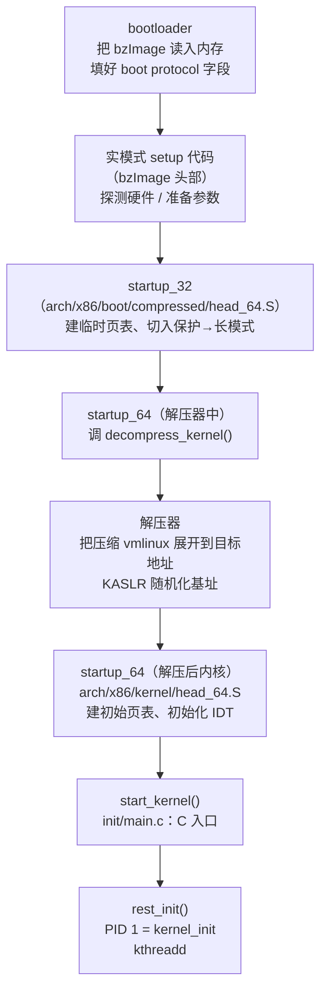

# OS启动（06）· 内核解压与早期初始化

内核不是"直接跑"的——它被压缩后打包进 `bzImage`，由一段小巧的**解压 stub** 在内存里自展开，再跳入真正的 64 位入口。这一棒是 bootloader 与内核 C 代码之间最关键的"过渡仪式"：从实模式 setup 头，经 `startup_32`/`startup_64` 汇编序章，到 `start_kernel()` 那行 C 函数，整条链路环环相扣、每步都有严格契约。

## 概述与定位

> [!abstract] TL;DR
> - **`bzImage`** = 实模式 setup 代码 + 压缩内核（vmlinux 压缩体）+ 解压 stub；bootloader 把它读进内存后，按 **boot protocol** 填好 setup 头字段，跳入实模式入口。
> - 内核自身完成 **`startup_32`（建临时页表 / 切换）→ `startup_64`（64 位入口）→ 解压器展开 vmlinux → 跳入解压后内核的 `startup_64`** 这条汇编链。
> - 汇编链出口是 **`start_kernel()`**——内核唯一的 C 入口，它依次建页表、初始化中断/内存/调度，最后通过 `rest_init` 创建 **PID 1（`kernel_init`）** 与 `kthreadd`，把 CPU 控制权交给用户态 init。
> - **KASLR** 在解压阶段随机化内核基址；**earlyprintk** 让最早的内核消息可观察。

本篇衔接 [[05.从实模式到保护模式到长模式]]（CPU 模式切换）与 [[07.分页与页表机制]]（内核最终页表建立）；指令级细节见 [[21.Asm/43 启动流程与Bootloader.md]]。

---

## 原理与机制

### `bzImage` 到 `start_kernel` 的完整链路



整条链路可归纳为四段：
1. **bootloader → 实模式 setup**：把压缩镜像载入 + 按协议传参。
2. **`startup_32` → `startup_64`（解压器）**：CPU 从 32 位切入 64 位，调用 `decompress_kernel`。
3. **解压器 → 解压后 `startup_64`**：vmlinux 被展开，跳入真内核 64 位入口。
4. **`startup_64` → `start_kernel()`**：汇编完成末尾收尾，跳入 C 世界。

---

## 结构与流程详解

### 1. `bzImage` 的物理组成

`bzImage`（"big zImage"）是 Linux 内核的标准发行镜像格式，由三层叠加组成：

```
bzImage 文件布局（字节级简图）
┌─────────────────────────────────────────────┐  偏移 0x000
│  实模式 setup 代码（arch/x86/boot/）          │
│  含 boot protocol setup 头（magic / 字段）   │
├─────────────────────────────────────────────┤  偏移 0x200*n（setup_sects 决定）
│  保护模式内核入口（startup_32 汇编）           │
│  + 压缩的 vmlinux 数据（gzip/bz2/lz4/zstd） │
│  + 解压 stub（decompress_kernel）            │
└─────────────────────────────────────────────┘
```

- `vmlinux`：编译输出的原始 ELF 文件（含调试信息、可读节名），**不能直接引导**。
- `vmlinuz`：`vmlinux` 压缩后的通称（各发行版命名不同）。
- `bzImage`：`vmlinuz` + 实模式 setup 头 + 解压 stub，**是 bootloader 实际加载的目标**。

### 2. Boot Protocol 与 setup 头

`bzImage` 起始的 **512 字节实模式 setup 代码**中，偏移 `0x01F1` 处嵌入 **setup 头（setup header）**——这是 bootloader 与内核之间的契约界面：

| 偏移（setup 头内） | 字段名 | 说明 |
|---|---|---|
| `0x01F1` | `setup_sects` | 实模式 setup 代码段数（每段 512 B） |
| `0x01FE` | `boot_flag` | 魔数 `0xAA55`（引导标志） |
| `0x0202` | `header` | 魔数 `0x53726448`（`HdrS`） |
| `0x0206` | `version` | boot protocol 版本（如 `0x020F` = v2.15） |
| `0x0218` | `cmd_line_ptr` | cmdline 字符串的 32 位物理地址 |
| `0x0228` | `initrd_addr_max` | initramfs 可放置的最高物理地址 |
| `0x0230` | `kernel_alignment` | 内核对齐（KASLR 用） |
| `0x0236` | `xloadflags` | 扩展加载标志（64 位入口、EFI 等） |
| `0x0258` | `init_size` | 内核展开后需要的内存大小 |

**bootloader 的工作**：读入 `bzImage` → 检查 `boot_flag`/`header` 魔数 → 按协议填写 `cmd_line_ptr`（命令行参数地址）、`ramdisk_image`/`ramdisk_size`（initramfs 位置）等字段 → 跳入实模式入口。

GRUB 通过 `linux` 命令加载 bzImage、`initrd` 命令加载 initramfs，完成上述填写后执行跳转。

### 3. 实模式 setup → `startup_32`

实模式 setup 代码（`arch/x86/boot/header.S` + `main.c`）在 16 位实模式下运行，主要负责：

- 探测内存（`e820`）、显示器、磁盘参数等硬件信息，填写 `boot_params` 结构体（即"零页"，zero page）。
- 切换到**保护模式**（置 `CR0.PE`），跳入 `arch/x86/boot/compressed/head_64.S` 的 `startup_32`。

### 4. `startup_32`：建临时页表与切入长模式

`startup_32` 运行在保护模式（32 位），核心任务：

```nasm
; arch/x86/boot/compressed/head_64.S（示意，Intel 语法）
startup_32:
    ; 1. 建立 GDT（临时段描述符：代码段 / 数据段）
    lgdt    [rip + gdt]

    ; 2. 建立 4 级页表（临时身份映射：VA == PA，保证代码能继续执行）
    ;    PML4 → PDPT → PD（2MB 大页，PS=1）
    mov     eax, cr4
    or      eax, X86_CR4_PAE   ; 开启 PAE（CR4.PAE）
    mov     cr4, eax

    ; 3. 置 EFER.LME（Long Mode Enable）
    mov     ecx, MSR_EFER
    rdmsr
    or      eax, EFER_LME
    wrmsr

    ; 4. 置 CR0.PG（开分页）→ CPU 进入长模式（EFER.LMA 由硬件置位）
    mov     eax, cr0
    or      eax, X86_CR0_PG
    mov     cr0, eax

    ; 5. 远跳（far jump）到 64 位代码段，刷新 CS
    ljmp    $__KERNEL_CS, $startup_64
```

这与 [[05.从实模式到保护模式到长模式]] 中描述的模式切换序列完全对应——CPU 模式切换的"最后一跳"就发生在这里。

### 5. `startup_64`（解压器）：调用 `decompress_kernel`

进入 64 位后，`startup_64`（解压器版本）完成以下工作：

1. 初始化堆栈、清零 BSS 段。
2. **KASLR（内核地址空间随机化）**：调用 `choose_random_location()` 确定解压目标地址（随机偏移，防御内核地址预测攻击）。
3. 调用 `decompress_kernel()`，把压缩数据（gzip/bzip2/lzma/lz4/zstd）展开到目标物理地址。
4. 跳入解压后内核的 `startup_64`（`arch/x86/kernel/head_64.S`）。

### 6. 解压后的 `startup_64`：真内核汇编序章

`arch/x86/kernel/head_64.S` 的 `startup_64` 是真正 vmlinux 的 64 位入口，它建立内核运行所需的初始环境：

| 步骤 | 操作 |
|---|---|
| 1 | 建立**正式的恒等映射 + 内核虚拟地址映射**（`__PAGE_OFFSET` 基址） |
| 2 | 加载正式 GDT / 初始 IDT |
| 3 | 设置 `CR3`（指向初始 PML4 页表） |
| 4 | 设置 `FS`/`GS`（per-CPU 基础） |
| 5 | 建立初始内核栈（`init_thread_union`） |
| 6 | 清零 BSS，调用 `x86_64_start_kernel()` |
| 7 | `x86_64_start_kernel()` 最终调用 `start_kernel()` |

### 7. `start_kernel()`：C 世界的第一行

`init/main.c: start_kernel()` 是内核第一个完整 C 函数，按顺序调用数十个初始化子系统：

```
start_kernel()
├── lockdep_init()           # 死锁检测初始化
├── set_task_stack_end_magic # 初始 task 栈溢出保护
├── smp_setup_processor_id() # 获取 CPU 编号
├── boot_cpu_init()          # 标记 boot CPU
├── setup_arch()             # ★ 架构初始化：解析 e820 内存图、建最终页表、初始化 ACPI
├── parse_early_param()      # 解析 cmdline 早期参数（如 earlyprintk=）
├── setup_per_cpu_areas()    # per-CPU 变量区域
├── trap_init()              # ★ IDT 初始化（安装异常处理向量 0–31）
├── mm_init()                # ★ 内存管理初始化（buddy allocator、vmalloc 区）
├── init_IRQ()               # ★ IRQ 初始化（APIC、中断描述符）
├── timekeeping_init()       # 时钟初始化
├── time_init()              # hrtimer / 时钟源
├── sched_init()             # ★ 调度器初始化（runqueue、idle task）
├── softirq_init()           # 软中断初始化
├── console_init()           # 控制台初始化（早期 tty）
├── kmem_cache_init()        # slab 分配器
├── calibrate_delay()        # BogoMIPS 测量
└── rest_init()              # ★★ 创建 PID 1 & kthreadd，CPU 成为 idle
```

**关键子系统速览**：

- **`setup_arch()`**：解析 `e820` 内存图（来自 BIOS/UEFI，存于 boot_params），调用 `init_memory_mapping()` 建立内核直接映射（`PAGE_OFFSET` 开始的线性映射区），初始化 NUMA 拓扑。
- **`trap_init()`**：安装 IDT 256 项——向量 0–31 为 CPU 异常（`#PF`=14、`#GP`=13、`#DF`=8 等），32–255 为外部中断/IRQ。见 [[09.中断异常与IDT]]。
- **`mm_init()`**：初始化 buddy 系统（物理页帧管理）、`vmalloc` 区、slab 初级分配器。
- **`sched_init()`**：为每个 CPU 初始化运行队列（`rq`），设置 idle task（`swapper/0`，PID 0）。
- **`rest_init()`**：内核初始化的终点，也是用户态的起点（见下节）。

### 8. PID 1 的诞生：`rest_init` 与 `kernel_init`

```c
// init/main.c（简化）
static noinline void __ref rest_init(void)
{
    // 1. 创建 kernel_init 线程 → PID 1
    pid = kernel_thread(kernel_init, NULL, CLONE_FS);

    // 2. 创建 kthreadd → PID 2（内核线程守护进程）
    pid = kernel_thread(kthreadd, NULL, CLONE_FS | CLONE_FILES);

    // 3. 当前线程（PID 0，swapper/idle）进入 cpu_idle_loop()，
    //    空转等待调度
    cpu_startup_entry(CPUHP_ONLINE);
}
```

**`kernel_init`（PID 1）的工作**：

```
kernel_init()
├── kernel_init_freeable()
│   ├── do_basic_setup()       # 初始化驱动子系统（PCI、USB、块设备等）
│   ├── 挂载 initramfs（cpio 解包到 rootfs）
│   └── prepare_namespace()    # 挂载真实根文件系统（按 root= 参数）
└── 执行用户态 init：
    run_init_process("/sbin/init")   # ← execve 跳入用户态
    run_init_process("/init")
    run_init_process("/bin/sh")      # 最后备用
```

`kernel_init` 通过 `execve` 把自身替换为用户态的 `/sbin/init`（通常是 systemd），完成从内核态到用户态的最终交接。initramfs 与 PID 1 的完整故事见 [[11.init与systemd启动]]。

---

## 实战与观察

### 1. `dmesg` 读取内核早期日志

```bash
dmesg | head -60
```

```text
[    0.000000] Linux version 6.8.0 (gcc version 13.2.0) #1 SMP ...
[    0.000000] Command line: BOOT_IMAGE=/boot/vmlinuz-6.8.0 root=UUID=... quiet splash
[    0.000000] BIOS-provided physical RAM map:
[    0.000000] BIOS-e820: [mem 0x0000000000000000-0x000000000009ffff] usable
[    0.000000] BIOS-e820: [mem 0x00000000000f0000-0x00000000000fffff] reserved
[    0.000000] Kernel command line: ...
[    0.000000] KASLR enabled
[    0.000000] Allocated new RAMDISK: [mem 0x...]
[    0.000000] x86/fpu: Supporting XSAVE feature 0x001: 'x87 floating point registers'
[    0.000000] ACPI: IRQ0 used by override.
[    0.000000] PID hash table entries: 4096
...
[    0.200000] Freeing SMP alternatives memory: 40K
[    0.300000] Brought up 8 CPUs
```

> [!warning] 示例输出为示意

关键行解读：
- `KASLR enabled`：内核已在随机化基址下启动。
- `BIOS-e820`：来自 boot_params 的内存图，`setup_arch()` 解析。
- `Allocated new RAMDISK`：initramfs 已定位。
- `Brought up N CPUs`：SMP 初始化完成。

### 2. 开启 `earlyprintk` 观察最早消息

内核在 `console_init()` 之前就可通过 `earlyprintk` 输出，需在 cmdline 加参数：

```
# GRUB 配置（/etc/default/grub）
GRUB_CMDLINE_LINUX="earlyprintk=ttyS0,115200 console=ttyS0,115200"
```

重建 GRUB 配置后重启，可在串口看到比 `dmesg` 更早的消息（`setup_arch` 之前）。

### 3. `extract-vmlinux`：从 `bzImage` 提取原始 ELF

```bash
# 内核源码树工具
scripts/extract-vmlinux /boot/vmlinuz-$(uname -r) > vmlinux.elf

# 验证是否为 ELF
file vmlinux.elf
# vmlinux.elf: ELF 64-bit LSB executable, x86-64, ...

# 查看内核符号（函数地址）
readelf -s vmlinux.elf | grep start_kernel
```

> [!warning] 示例输出为示意

### 4. 通过 `/proc/kallsyms` 查看运行时内核符号

```bash
# 需 root 或 CAP_SYSLOG
sudo cat /proc/kallsyms | grep -E "start_kernel|startup_64|kernel_init"
```

```text
ffffffff81000000 T startup_64
ffffffff82000000 T start_kernel
ffffffff82001234 T kernel_init
```

> [!warning] 示例输出为示意

开启 KASLR 时，每次启动地址会随机偏移（可用 `/proc/kallsyms` 实时查看当次基址）。

### 5. QEMU + GDB 在 `start_kernel` 下断点

```bash
# 启动 QEMU（暂停等待 gdb）
qemu-system-x86_64 -kernel bzImage -initrd initramfs.cpio \
    -append "console=ttyS0 nokaslr" -nographic \
    -s -S   # -s 开 gdbstub:1234，-S 暂停

# 另一终端 gdb
gdb vmlinux
(gdb) target remote :1234
(gdb) break start_kernel
(gdb) continue
# 程序在 start_kernel 入口暂停
(gdb) bt      # 查看调用栈（可看到 startup_64 → x86_64_start_kernel → start_kernel）
```

> [!warning] 示例输出为示意

`nokaslr` 选项禁用 KASLR，使符号地址与 vmlinux 中一致，便于调试。

---

## 安全性与正确使用

### KASLR：内核地址随机化

**KASLR（Kernel Address Space Layout Randomization）** 在解压阶段（`choose_random_location()`）将内核展开到随机物理基址，同时在 `startup_64` 阶段完成对应的虚拟地址映射偏移。

```
无 KASLR：内核总在固定基址（如 0xffffffff81000000）加载
有 KASLR：加载基址 = 默认基址 + 随机偏移（基于 RDRAND / TSC）
```

**防御意义**：攻击者无法预知内核函数/数据的绝对地址，阻断大量 ROP（Return-Oriented Programming）利用链。

**局限性与绕过风险**：
- 若内核存在**信息泄漏漏洞**（如通过 `/proc/kallsyms`、`dmesg`、旁路攻击泄漏地址），KASLR 可被绕过。
- 嵌入式系统 / QEMU 调试时常用 `nokaslr` 禁用，**生产环境务必保持 KASLR 开启**。
- 与用户态 ASLR（`/proc/sys/kernel/randomize_va_space`）互补，共同构成地址随机化防御体系。见 [[34.现代二进制防护机制/00.现代二进制防护机制总览.md]]。

### cmdline 注入风险

boot protocol 中的 `cmd_line_ptr` 字段由 bootloader 填写并直接传递给内核，内核无任何签名验证——这意味着**能控制 bootloader 的攻击者可以任意修改内核命令行**：

- 注入 `init=/bin/sh` → 跳过 init/systemd，直接获得 root shell。
- 注入 `single` → 单用户模式，绕过认证。
- 注入 `nokaslr`、`nopti`、`nosmep` → 关闭内核安全特性，为后续利用铺路。

**防御**：
- **Secure Boot**（UEFI 验签 bootloader/shim/内核）确保只有受信任的 bootloader 运行，防止攻击者篡改 cmdline。见 [[13.可信启动与启动安全]]。
- **GRUB 密码保护**：防止物理访问者修改 GRUB 菜单/cmdline。
- **Measured Boot + TPM**：通过 PCR 扩展测量，若 cmdline 被修改，TPM 封存的密钥无法解封，系统拒绝启动（或告警）。

### 早期内核代码的可信性

`start_kernel()` 之前的汇编代码（`startup_32/64`、解压器）运行在**无任何安全防护**的环境中：

- 无 SMEP/SMAP（此时尚未建好正式页表）。
- 无栈金丝雀（`startup_32` 尚未建栈保护）。
- 内存映射处于临时恒等映射状态。

这段代码是内核信任链最脆弱的环节——因此 **Secure Boot 的验签在 bootloader 侧完成**（对整个 bzImage 验签），而不是在内核进入 `startup_32` 之后再验。一旦 CPU 进入 `startup_32`，内核便假设自身代码是可信的。

### SMP 辅助处理器唤醒

现代 x86 系统通常有多个逻辑/物理核心，但加电后只有 **BSP（Boot Strap Processor，引导处理器）** 执行固件和早期内核代码，其余核心处于**等待（Wait-for-SIPI）**状态，称为 **AP（Application Processor，应用处理器）**。内核在 `smp_init()` 阶段通过 **Local APIC 的 INIT-SIPI-SIPI 序列**逐一唤醒各个 AP。

#### INIT-SIPI-SIPI 序列

这是 Intel 规范定义的 CPU 多核初始化协议，BSP 通过向目标 AP 的 **ICR（Interrupt Command Register，APIC 寄存器 `0xFEE00300`）**写入中断投递消息触发：

```
BSP 执行的 INIT-SIPI-SIPI 序列（示意）：

Step 1: 发送 INIT IPI（初始化 AP，令其复位进入等待状态）
  ICR[12:8] = 0b00101 (Delivery Mode = INIT)
  ICR[11]   = 0       (Physical Mode)
  ICR[10:8] = 目标 AP 的 APIC ID（写 ICR[63:32]）
  → AP 收到 INIT 后进入 Wait-for-SIPI 状态

Step 2: 等待 10ms（规范要求，AP 复位需要时间）

Step 3: 发送第一个 SIPI（Startup IPI，携带 trampoline 代码页号）
  ICR[12:8] = 0b00110 (Delivery Mode = Start-Up)
  ICR[7:0]  = 向量号（8位），AP 将从物理地址 向量号×0x1000 开始执行
              例如向量 = 0x08 → 物理地址 0x8000（trampoline 代码所在页）

Step 4: 等待 200μs（第一个 SIPI 处理时间）

Step 5: 发送第二个 SIPI（若 AP 未响应第一个则重试）

Step 6: BSP 等待 AP 完成初始化（自旋等待 AP 设置 cpu_online_mask 中的对应位）
```

```c
/* 内核实现位置（简化）：arch/x86/kernel/smpboot.c */
static int do_boot_cpu(int apicid, int cpu, ...)
{
    /* 写 trampoline 代码到低内存（< 1MB，实模式可访问） */
    copy_trampoline_code();          /* arch/x86/realmode/rm/ */

    /* 发 INIT */
    apic->send_IPI(apicid, INIT_VECTOR);
    udelay(10 * 1000);              /* 等 10ms */

    /* 发两次 SIPI */
    for (int i = 0; i < 2; i++) {
        apic->send_IPI(apicid, START_UP_VECTOR);  /* 向量含 trampoline 页地址 */
        udelay(300);
    }
    /* 等待 AP 上线 */
    wait_for_AP_to_set_bit(cpu);
}
```

#### AP 的启动路径

AP 接收到 SIPI 后，CPU 硬件将 `CS:IP` 设为 `向量号:0000`（实模式），开始从 **trampoline 代码**执行：

```
AP 启动路径（完整过渡链路）：

┌─────────────────────────────────────────┐
│  实模式（16-bit）trampoline              │
│  arch/x86/realmode/rm/trampoline_64.S   │
│  ● 设置临时栈                            │
│  ● 开启 A20 地址线                       │
│  ● 加载 BSP 准备好的 GDT/IDT            │
│  ● 置 CR0.PE → 进入保护模式              │
│  ● 跳入 startup_32（AP 版本）            │
└──────────────────┬──────────────────────┘
                   │ 保护模式（32-bit）
┌──────────────────▼──────────────────────┐
│  startup_32（AP）                        │
│  arch/x86/kernel/head_64.S              │
│  ● 复用 BSP 建好的初始页表（PML4）        │
│  ● 置 CR4.PAE + EFER.LME + CR0.PG      │
│  ● 远跳进入 64-bit 长模式                │
└──────────────────┬──────────────────────┘
                   │ 长模式（64-bit）
┌──────────────────▼──────────────────────┐
│  secondary_startup_64                   │
│  arch/x86/kernel/head_64.S             │
│  ● 初始化 AP 自己的 GS/FS base          │
│  ● 加载 AP 的独立 IDT                   │
│  ● 调用 cpu_init()（per-CPU 数据初始化） │
│  ● 进入 start_secondary()              │
└──────────────────┬──────────────────────┘
                   │
┌──────────────────▼──────────────────────┐
│  start_secondary()                       │
│  arch/x86/kernel/smpboot.c              │
│  ● cpu_up() → 通知 BSP AP 已上线         │
│  ● 进入调度器 cpu_startup_entry()        │
│    → AP 开始参与任务调度                 │
└─────────────────────────────────────────┘
```

#### per-CPU 区初始化

AP 上线时需要建立自己的 **per-CPU 数据区（per-CPU area）**，这是 Linux 内核为每个 CPU 预留的独立数据副本，通过 `GS` 段寄存器的 base 地址寻址：

```c
/* per-CPU 变量的使用（内核代码示意） */
DEFINE_PER_CPU(int, cpu_number);         /* 每 CPU 独立的整数变量 */
per_cpu(cpu_number, smp_processor_id()); /* 读当前 CPU 的副本 */
this_cpu_read(cpu_number);               /* 等价，通过 GS: 寻址 */
```

- **BSP**：在 `setup_per_cpu_areas()`（`start_kernel` 中）完成，把静态 `.data..percpu` 节复制到动态分配的内存区，并设置 `GS_BASE` MSR 指向本 CPU 的区域
- **AP**：在 `secondary_startup_64` → `cpu_init()` 中，从 `BSP` 准备好的映射中为自己分配 per-CPU 区，并用 `wrmsrl(MSR_GS_BASE, ...)` 设置 `GS` 基址
- **访问 per-CPU 变量**时，CPU 自动通过 `GS:偏移` 访问自己的数据副本，无需锁保护，是 Linux 内核的重要无锁数据结构模式

#### smp_init / cpu_up 调用链

```
rest_init()
  └── kernel_init (PID 1)
        └── kernel_init_freeable()
              └── smp_init()                   ← 并行唤醒所有 AP
                    └── cpu_up(cpu_id)          ← 逐个 CPU 上线
                          ├── _cpu_up()
                          │     ├── cpuhp_kick_ap()  ← 状态机驱动 AP 初始化
                          │     └── 等待 AP 进入 ONLINE 状态
                          └── do_boot_cpu()    ← 发 INIT-SIPI-SIPI
                                └── secondary_startup_64 → start_secondary
```

`start_secondary()` 完成后 AP 进入调度循环，从此可以被调度器分配任务，SMP 系统正式启动。

```bash
# 观察 SMP 启动过程
dmesg | grep -E "(smp|cpu|APIC|Brought up|SMP|processor)"
```

```text
# 示例输出（示意）
[    0.000000] smpboot: Allowing 8 CPUs, 0 hotplug CPUs
[    0.000000] MPS: CPUID(0) LocalAPIC(0x00)
[    0.186000] x86: Booting SMP configuration:
[    0.186000] .... node  #0, CPUs:  #1  #2  #3  #4  #5  #6  #7
[    0.450000] Brought up 8 CPUs
[    0.451000] smpboot: Max logical packages: 1
```

> [!warning] 示例输出为示意

> [!note] ARM64 SMP 唤醒
> ARM64 无 APIC 硬件，AP 唤醒通过 **PSCI（Power State Coordination Interface）** 固件调用（`CPU_ON` 函数）或直接操作 `MPIDR`（处理器亲和性寄存器）+ `CPU_RELEASE_ADDR`（通过旋转等待内存写入）来实现，trampoline 入口在 `arch/arm64/kernel/head.S` 的 `secondary_entry`。

### kernel lockdown

Linux `lockdown` LSM（Linux Security Module）在内核运行期提供额外约束，防止有 root 权限的用户态进程破坏内核完整性（如通过 `/dev/mem`、`/proc/kcore` 读写内核内存）。`lockdown=confidentiality` 模式下即便 root 也无法绕过内核内存保护。

---

## 小结

| 阶段 | 入口 | 主要工作 |
|---|---|---|
| bootloader → 实模式 setup | `arch/x86/boot/header.S` | 填 boot_params（e820/cmdline/initrd），切保护模式 |
| 保护模式 → 长模式 | `startup_32` | 建临时页表、开 PAE+LME+PG，跳 64 位 |
| 解压阶段 | `startup_64`（解压器） | KASLR 随机化基址，调 `decompress_kernel` 展开 vmlinux |
| 真内核 64 位入口 | `startup_64`（vmlinux） | 建正式页表（`CR3`）、安装 IDT、建 per-CPU，跳 C |
| C 入口 | `start_kernel()` | `setup_arch`/`trap_init`/`mm_init`/`sched_init`，最终 `rest_init` |
| 用户态交接 | `rest_init` → `kernel_init` | PID 1 挂载 initramfs，`execve("/sbin/init")` |

整条链路的核心契约：
- bootloader 必须按 **boot protocol** 填好 `cmd_line_ptr`、`ramdisk_image` 等字段。
- `startup_32` 建临时页表时必须覆盖内核自身所在的物理范围（恒等映射），保证代码能继续执行。
- 解压器必须在 KASLR 随机化之后、跳转之前完成地址重定位（`kaslr_relocate_kernel`）。
- `start_kernel()` 依赖 `setup_arch()` 完成内存图解析才能初始化 buddy 分配器。

---

## 相关阅读

- **本系列**：[[05.从实模式到保护模式到长模式]] | [[07.分页与页表机制]] | [[11.init与systemd启动]] | [[00.操作系统加载与启动总览]]
- **指令级启动汇编**：[[21.Asm/43 启动流程与Bootloader.md]]
- **页表建立细节**：[[21.Asm/38 MMU与页表设置实战.md]]
- **中断/IDT**：[[21.Asm/29 异常中断处理对比.md]]
- **ELF 格式（vmlinux 是 ELF）**：[[11.ELF文件详解/00.ELF文件详解总览.md]]
- **防护机制（KASLR/lockdown）**：[[34.现代二进制防护机制/00.现代二进制防护机制总览.md]]
- **用户态分页背景**：[[24.内存管理与堆分配器/02.进程地址空间与虚拟内存.md]]

---

⬅️ 上一篇 [[05.从实模式到保护模式到长模式]] ｜ 🏠 [[00.操作系统加载与启动总览]] ｜ 下一篇 [[07.分页与页表机制]] ➡️
