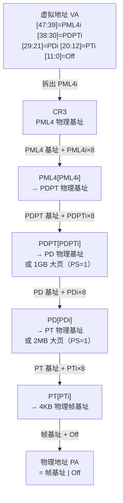

# OS启动（07）· 分页与页表机制

## 概述与定位

> [!abstract] TL;DR
> x86-64 分页通过 **四级页表（PML4 → PDPT → PD → PT）** 将 48 位虚拟地址翻译为物理地址：每级用 9 位索引、页内偏移 12 位，共覆盖 256 TB 用户/内核地址空间。**`CR3`** 寄存器存当前进程 PML4 表的物理基址，进程切换即换 CR3。每个 **PTE（64 位）** 含物理页帧号与标志位（P/RW/US/PS/G/NX 等）；`PS=1` 可开启 **2MB / 1GB 大页** 减少 TLB 压力。翻译结果由 **TLB** 缓存；修改页表需 `invlpg` 或刷新 CR3。规范地址（canonical）要求高 16 位是 bit47 的符号扩展；违规访问/权限不符触发 `#PF`（第 08 章）。本篇聚焦**内核视角的页表机制**（CR3/PTE/TLB/大页），地址空间的分区布局见 [[24.内存管理与堆分配器/02.进程地址空间与虚拟内存.md]]。

本篇在系列中的定位：

- 第 06 篇（[[06.内核解压与早期初始化]]）完成了 `start_kernel` 前的内存自举（早期恒等映射、解压区）。
- **本篇（第 07 篇）**：拆解 x86-64 四级页表结构、PTE 标志位、大页、TLB、规范地址、5 级分页，以及如何在 QEMU/`/proc` 观察翻译细节。
- 第 08 篇（[[08.虚拟内存子系统]]）将承接缺页异常（`#PF`）、COW、按需调页、swap、OOM 的上层机制。

---

## 原理与机制

### 为什么需要分页

| 需求 | 分页的解法 |
|---|---|
| **虚拟→物理映射** | MMU 按页表把 VA 翻译为 PA，代码/数据不需要连续物理内存 |
| **进程隔离** | 每个进程有独立页表（不同 CR3）；进程 A 的 `0x401000` 与进程 B 的 `0x401000` 映射到不同物理帧 |
| **按页权限控制** | PTE 标志位 `RW`/`US`/`NX` 可对每页独立设置读写执行权限，实现 W^X、内核/用户隔离 |
| **按需分配（lazy allocation）** | 页表项 `P=0` 表示"尚未分配"，首次访问触发 `#PF`，内核再懒分配物理页 |
| **大内存高效管理** | 大页（2MB/1GB）减少页表层数与 TLB 条目，提升内存密集型负载性能 |

### 虚拟地址的构成（48 位 canonical）

x86-64 基础分页（IA-32e，4 级）使用 **48 位有效虚拟地址**（bits 47:0），高 16 位（bits 63:48）必须是 bit47 的**符号扩展**，否则 CPU 触发 `#GP`——这就是**规范地址（canonical address）**规则：

```
63          48 47      39 38      30 29      21 20      12 11        0
┌─────────────┬──────────┬──────────┬──────────┬──────────┬───────────┐
│  符号扩展×16 │  PML4 idx│  PDPT idx│   PD idx │   PT idx │ 页内偏移  │
│  (bit47 复制) │  [47:39] │  [38:30] │  [29:21] │  [20:12] │  [11:0]   │
│   16 位      │   9 位   │   9 位   │   9 位   │   9 位   │   12 位   │
└─────────────┴──────────┴──────────┴──────────┴──────────┴───────────┘
```

- 每级 9 位索引 → 每级最多 **512 个表项**（2⁹）
- 页大小 2¹² = **4096 字节 = 4 KB**
- 用户态地址（bit47=0）：`0x0000_0000_0000_0000` ~ `0x0000_7FFF_FFFF_FFFF`
- 内核态地址（bit47=1）：`0xFFFF_8000_0000_0000` ~ `0xFFFF_FFFF_FFFF_FFFF`
- 中间的非规范"空洞"：任何访问均触发 `#GP`（通用保护错误）

### 地址翻译流程（VA → PA）



> [!note]
> 每一级的表项均为 **8 字节（64 位）**；每张表恰好 512 项 × 8 字节 = **4096 字节 = 恰好一页**，方便对齐分配。

---

## 结构详解

### 四级页表层次

| 层级 | 名称 | 缩写 | 覆盖 VA 范围 | 每项覆盖大小 |
|---|---|---|---|---|
| 第 0 级（根） | Page Map Level 4 | **PML4** | `[47:39]` 9 位 | 512 GB |
| 第 1 级 | Page Directory Pointer Table | **PDPT** | `[38:30]` 9 位 | 1 GB |
| 第 2 级 | Page Directory | **PD** | `[29:21]` 9 位 | 2 MB |
| 第 3 级（叶） | Page Table | **PT** | `[20:12]` 9 位 | 4 KB |

每张表物理上是一个 4 KB 页，存 512 个 64 位表项。`CR3` 存放当前进程 PML4 表的**物理地址**（低 12 位为标志/PCID，不参与寻址）。

### PTE（Page Table Entry）标志位

以下适用于 PT 叶级表项，中间级（PML4/PDPT/PD）中含义类似，但部分位有差异（如 PD/PDPT 中 `PS=1` 表示大页终结）：

```
63  62          52 51       12 11  9  8  7  6  5  4  3  2  1  0
┌───┬────────────┬────────────┬─────┬──┬──┬──┬──┬──┬──┬──┬──┬──┐
│NX │  保留/忽略  │   PFN      │保留 │G │PS│D │A │PCD│PWT│US│RW│P │
└───┴────────────┴────────────┴─────┴──┴──┴──┴──┴──┴──┴──┴──┴──┘
```

| 位 | 名称 | 含义 |
|---|---|---|
| **bit0** `P` | **Present** | 1 = 页存在于物理内存；0 = 触发 `#PF` |
| **bit1** `RW` | **Read/Write** | 0 = 只读；1 = 可读写 |
| **bit2** `US` | **User/Supervisor** | 0 = 仅内核（ring 0）可访问；1 = 用户态（ring 3）也可访问 |
| **bit3** `PWT` | Page-level Write-Through | 控制 cache 写穿/写回策略 |
| **bit4** `PCD` | Page-level Cache Disable | 1 = 禁止 cache（MMIO 常用） |
| **bit5** `A` | **Accessed** | CPU 访问（读或写）后由硬件置 1，OS 用于页面置换 |
| **bit6** `D` | **Dirty** | 写操作后由硬件置 1（仅叶级），OS 用于判断页是否被修改 |
| **bit7** `PS` | **Page Size** | 中间级（PD/PDPT）置 1 → 终结为大页；叶级 PT 中固定为 0 |
| **bit8** `G` | **Global** | 1 = 全局页，切换 CR3 时 TLB **不刷新**此条目（常用于内核页） |
| **bits 11:9** | 保留/OS 自定义 | OS 可用这 3 位存软件状态（如 swapped-out 标记） |
| **bits 51:12** | **PFN** | 物理页帧号（Physical Frame Number），与 `[11:0]` 页内偏移拼出物理地址 |
| **bit63** `NX` | **No-Execute** | 1 = 该页**不可执行**（需开启 EFER.NXE）；是 DEP/W^X 的硬件基础 |

> [!important]
> `NX` 位（bit63）依赖 `IA32_EFER.NXE=1`（长模式下内核启动时设置）。未开启 NXE 时 bit63 被视为保留位，置 1 会触发 `#PF`。

### 大页（Huge Page）

`PS`（Page Size）标志在**中间级**页表项中使用，直接终止地址翻译，跳过后续层级：

| `PS=1` 所在级 | 大页大小 | 对齐要求 | 跳过的层级 |
|---|---|---|---|
| **PD（第 2 级）** | **2 MB** | 物理地址对齐 2 MB | 不走 PT |
| **PDPT（第 1 级）** | **1 GB** | 物理地址对齐 1 GB | 不走 PD 和 PT |

大页的 PTE 中，**2MB 大页**（PD 表项 `PS=1`）：页内偏移为 bits[20:0]（21 位），其余高位为物理页帧；**1GB 大页**（PDPT 表项 `PS=1`）：页内偏移为 bits[29:0]（30 位），其余高位为物理页帧。

**大页的优势**：
- 同等内存覆盖所需的 TLB 条目数大幅减少（2 MB 大页替代 512 个 4 KB 条目）
- 减少页表游走（walk）层数，降低 cache miss
- Linux 通过 **hugepages**（静态大页）或 **THP（Transparent Huge Pages，透明大页）** 使用

### CR3 寄存器

```
63      52 51          12 11   5 4   3  2  1  0
┌─────────┬──────────────┬──────┬───┬──┬──┬──┐
│ 保留/忽略 │  PML4 物理基址│ 保留  │保留│PWT│PCD│
│ (PCID区) │  [51:12]     │      │   │   │   │
└─────────┴──────────────┴──────┴───┴──┴──┴──┘
```

- `CR3[51:12]`：PML4 表物理基址（页对齐，低 12 位为 0）
- `CR3[3]` `PWT`，`CR3[4]` `PCD`：控制 PML4 表本身的 cache 策略
- **`PCID`（Process-Context Identifier）**：若 `CR4.PCIDE=1`，`CR3[11:0]` 存 12 位 PCID，允许在切换 CR3 时保留 TLB 条目（按 PCID 区分），减少 TLB 刷新开销

**进程上下文切换时**，内核将新进程的 PML4 物理地址写入 `CR3`，MMU 随即使用新的页表体系——这是进程隔离的硬件执行点。

```nasm
; 内核切换进程（示意，Intel 语法）
mov  rax, [new_task + TASK_PGD]   ; 取新进程 PML4 物理地址
mov  cr3, rax                      ; 切换页表，同时（默认）刷新 TLB
```

### TLB（Translation Lookaside Buffer）

每次内存访问若都要四级页表游走，需要 **4 次额外内存读**，性能不可接受。**TLB** 是 CPU 内置的地址翻译缓存：

| 属性 | 说明 |
|---|---|
| 缓存内容 | VA → PA 的映射结果（含权限位） |
| 命中 | 直接得到 PA，无需页表游走 |
| 缺失（miss） | 硬件 Page Table Walker 自动游走四级页表并填充 TLB |
| 刷新时机 | 写 CR3（进程切换）；执行 `invlpg <va>`（使单条目失效）；改写 `CR4`/`CR0` 某些位 |

**`invlpg`** 指令使指定虚拟地址的 TLB 条目失效（ring 0 专用）：

```nasm
invlpg [rax]     ; 使 rax 所指虚拟地址对应的 TLB 条目失效（Intel 语法）
```

**`G`（Global）位**：页表项 `G=1` 表示该页映射在所有进程间共享（典型如内核页），切换 CR3 时 CPU **不刷新** Global 页的 TLB 条目，减少内核态翻译开销。只有显式 `invlpg` 或修改 `CR4.PGE` 才能清除 Global TLB 条目。

**PCID（Process-Context Identifier）**：

- 需要 `CR4.PCIDE=1`
- CR3 切换时附带 PCID，TLB 保留所有进程的条目（按 PCID 标记），仅过滤不属于新 PCID 的条目
- Linux 从内核 4.14 起启用 PCID 优化，显著降低进程切换时的 TLB 刷新开销（尤其是 Meltdown 补丁 KPTI 之后）

### 走表例子（具体地址）

设虚拟地址 **`0x0000_7FFF_ABCD_1234`**，逐位拆分（十六进制 → 二进制）：

```
VA = 0x0000_7FFF_ABCD_1234
二进制（48 位有效部分）：
  0000 0000 0000 0000  0111 1111 1111 1111  1010 1011 1100 1101  0001 0010 0011 0100
                       ^^^^^^^^^ ^^^^^^^^  ^^^^^^^^^ ^^^^^^^^   ^^^^^^^^^^^^^^^^^^^^

拆分：
  [47:39] PML4i = 0b 0_1111_1111 = 0xFF = 255
  [38:30] PDPTi = 0b 1_1111_1111 = 0x1FF = 511     ← 注意跨字节
  [29:21]   PDi = 0b 0_1010_1011 = 0x55 = 85
  [20:12]   PTi = 0b 1_1100_1101 = 0xCD = 205
  [11:0]    Off = 0x234 = 564
```

翻译过程（假设 CR3 = `0x0010_0000`，各级表基址示意）：

```
1. PML4 基址 = 0x0010_0000
   PML4[255] 地址 = 0x0010_0000 + 255×8 = 0x0010_07F8
   PML4[255] → PDPT 基址 = 0x0020_0000（示意）

2. PDPT[511] 地址 = 0x0020_0000 + 511×8 = 0x0020_0FF8
   PDPT[511] → PD 基址 = 0x0030_0000（示意）

3. PD[85] 地址  = 0x0030_0000 + 85×8 = 0x0030_02A8
   PD[85] → PT 基址 = 0x0040_0000（示意，PS=0，4KB 页）

4. PT[205] 地址 = 0x0040_0000 + 205×8 = 0x0040_0668
   PT[205] → PFN = 0x12345（示意）

5. PA = (0x12345 << 12) | 0x234 = 0x1234_5234
```

> [!warning] 示例输出为示意
> 以上地址数值均为说明性示例，非真实系统数据。

### ARM64 分页体系

ARM64（AArch64）的 MMU 分页机制与 x86-64 结构类似但设计更灵活，核心差异在于**双页表基址寄存器**和可配置的地址位宽与页粒度。

#### 双 TTBR：用户空间与内核空间分离

x86-64 只有一个 `CR3` 寄存器，内核靠"规范地址空洞"划分用户/内核区；ARM64 则为两者配备独立的**页表基址寄存器（Translation Table Base Register）**：

| 寄存器 | 覆盖地址范围 | 用途 |
|---|---|---|
| **`TTBR0_EL1`** | 高位全为 `0`，即 `0x0000_0000_0000_0000` ~ `0x0000_xxxx_xxxx_xxxx` | 用户空间（进程上下文，每个进程切换时更新） |
| **`TTBR1_EL1`** | 高位全为 `1`，即 `0xFFFF_xxxx_xxxx_xxxx` ~ `0xFFFF_FFFF_FFFF_FFFF` | 内核空间（系统全局，长期不变） |

MMU 根据虚拟地址高位是否全为 `0` 或全为 `1` 自动选择对应 TTBR：
- 访问用户态地址（高位为 0）→ 用 `TTBR0_EL1` walk 页表
- 访问内核态地址（高位为 1）→ 用 `TTBR1_EL1` walk 页表
- 中间"空洞"（高位既不全 0 也不全 1）→ 地址无效，触发翻译异常

进程上下文切换时，内核只需更新 `TTBR0_EL1`（用户空间页表），`TTBR1_EL1` 始终指向内核全局页表，无需切换。

```asm
// 切换进程时更新用户页表基址（AArch64，示意）
msr  ttbr0_el1, x0      // x0 = 新进程 L0 页表的物理地址
isb                      // 指令同步屏障，确保后续 walk 使用新值
```

#### TCR_EL1：控制翻译粒度与地址位宽

`TCR_EL1`（Translation Control Register EL1）是分页机制的"旋钮"，决定 TTBR0/TTBR1 各自的地址位宽、页粒度和 walk 属性：

```
TCR_EL1 关键字段（64 位寄存器）：
  [5:0]   T0SZ   — 决定 TTBR0 的有效地址位数：有效 VA 位数 = 64 - T0SZ
  [21:16] T1SZ   — 决定 TTBR1 的有效地址位数：有效 VA 位数 = 64 - T1SZ
  [15:14] TG1    — TTBR1 的页粒度：0b01=4KB, 0b10=16KB, 0b11=64KB
  [15:14] TG0    — TTBR0 的页粒度（同上，字段位置不同）
  [9:8]   IRGN0  — TTBR0 walk 内存的内层缓存属性（Inner Cacheability）
  [11:10] ORGN0  — TTBR0 walk 内存的外层缓存属性（Outer Cacheability）
  [13:12] SH0    — TTBR0 walk 的共享性属性（Non/Inner/Outer Shareable）
  [37:36] IPS    — 中间物理地址大小（4GB/64GB/1TB/...）
  [38]    TBI0   — TTBR0 地址的 Top-Byte Ignore（用于指针标签，MTE/PAC）
  [23]    EPD1   — 1 = 禁用 TTBR1 walk（可用于关闭内核映射，KPTI 实现）
```

Linux 内核典型配置（4KB 粒度，48 位 VA）：
- `T0SZ = 16` → 用户态有效 VA = 48 位，范围 `0x0000_0000_0000_0000` ~ `0x0000_FFFF_FFFF_FFFF`
- `T1SZ = 16` → 内核态有效 VA = 48 位，范围 `0xFFFF_0000_0000_0000` ~ `0xFFFF_FFFF_FFFF_FFFF`

若配置 `T0SZ = 25`（39 位 VA），则只需**三级翻译（L1→L2→L3）**，适合资源受限设备。

#### 四级翻译：L0 → L1 → L2 → L3

以 4KB 粒度、48 位 VA（T0SZ=16）为例，虚拟地址按如下方式拆分：

```
63          48 47      39 38      30 29      21 20      12 11        0
┌─────────────┬──────────┬──────────┬──────────┬──────────┬───────────┐
│ 符号扩展     │  L0 idx  │  L1 idx  │  L2 idx  │  L3 idx  │ 页内偏移  │
│ (全0或全1)  │  [47:39] │  [38:30] │  [29:21] │  [20:12] │  [11:0]   │
│  16 位       │   9 位   │   9 位   │   9 位   │   9 位   │   12 位   │
└─────────────┴──────────┴──────────┴──────────┴──────────┴───────────┘
```

| 级别 | ARM64 名称 | 每项覆盖大小 | 对应 x86-64 |
|---|---|---|---|
| L0（根，来自 TTBR） | PGD | 512 GB | PML4 |
| L1 | PUD | 1 GB | PDPT |
| L2 | PMD | 2 MB | PD |
| L3（叶） | PTE | 4 KB | PT |

**粒度决定级数**：
- 4KB 粒度 + 48 位 VA → 四级（L0-L3），每级 9 位索引，512 项/表
- 16KB 粒度 + 48 位 VA → 四级（L0-L3），每级 11 位索引，2048 项/表，L0 仅 2 项
- 64KB 粒度 + 48 位 VA → 三级（L1-L3），L1 索引 13 位，8192 项/表

**块描述符（Block Descriptor）**：类似 x86-64 的 `PS` 大页：
- L1（PUD）表项置 Block bit → **1 GB 块映射**（跳过 L2/L3）
- L2（PMD）表项置 Block bit → **2 MB 块映射**（跳过 L3）

#### 页表项（PTE）关键属性位

ARM64 的 PTE 格式与 x86-64 不同，关键属性字段：

```
63  59  55  51  12 11 10  9  8  7  6  5  4  2  1  0
┌───┬───┬───┬───┬──┬──┬──┬──┬──┬──┬──┬──┬──┬──┬──┐
│UXN│PXN│保留│物理帧号(PFN)│nG│AF│SH│AP│NS│保留│Indx│valid│
└───┴───┴───┴───┴──┴──┴──┴──┴──┴──┴──┴──┴──┴──┴──┘
```

| 位/字段 | 名称 | 含义 |
|---|---|---|
| **bit[0]** `valid` | Valid | 1 = 表项有效；0 = 翻译失败（等价于 x86 P=0） |
| **bit[1]** | Table/Block/Page | 中间级：1=下一级表指针，0=块映射；叶级：固定为 1（页描述符） |
| **bits[4:2]** `AttrIndx` | 内存属性索引 | 引用 MAIR_EL1 寄存器中 8 个预定义内存属性（Device-nGnRnE / Normal / Normal-NC 等） |
| **bits[8:7]** `SH` | Shareability | 00=Non-shareable, 10=Outer, 11=Inner（控制 cache 一致性域） |
| **bits[9:6]** `AP` | Access Permission | AP[2:1]：00=EL1 RW, 01=EL1/0 RW, 10=EL1 RO, 11=EL1/0 RO |
| **bit[10]** `AF` | Access Flag | 首次访问由硬件（或软件 fault + 置位）设为 1；用于页面替换 |
| **bit[11]** `nG` | not Global | 1 = 进程私有（ASID 标记），0 = 全局（内核页，不受 ASID 过滤） |
| **bit[53]** `PXN` | Privileged Execute-Never | 1 = EL1（内核态）不可执行此页 |
| **bit[54]** `UXN/XN` | Unprivileged Execute-Never | 1 = EL0（用户态）不可执行此页 |
| **bits[51:12]** | 物理帧号 PFN | 实际物理页帧基址（4KB 对齐） |

> [!note] MAIR_EL1 与 AttrIndx
> x86-64 直接在 PTE 中设置 PCD/PWT/PAT 控制 cache 策略；ARM64 将内存属性（Normal/Device/Write-Through/Write-Back 等）集中预配置在 `MAIR_EL1` 寄存器的 8 个槽位中，PTE 的 `AttrIndx[2:0]` 只需填 0-7 索引即可引用，保持 PTE 本身紧凑。

#### EL0/1/2/3 分级页表

ARM64 有四个异常级别（Exception Level），各自维护独立的系统寄存器与页表：

| 异常级别 | 角色 | 页表寄存器 | 说明 |
|---|---|---|---|
| **EL0** | 用户态应用 | 使用 EL1 配置的 `TTBR0_EL1` | 无独立控制寄存器，受 EL1 管辖 |
| **EL1** | 操作系统内核 | `TTBR0_EL1`（用户）/ `TTBR1_EL1`（内核）+ `TCR_EL1` | Linux 内核运行于此级别 |
| **EL2** | Hypervisor（虚拟机监视器） | `TTBR0_EL2`（非VHE）或 `TTBR0/1_EL2`（VHE）+ `TCR_EL2` | 增加**第二阶段翻译（Stage-2）**：将 Guest PA 翻译为 Host PA |
| **EL3** | Secure Monitor（TrustZone） | `TTBR0_EL3` + `TCR_EL3` | 控制 Secure/Non-Secure 状态切换 |

**两阶段翻译（EL2 Virtualization）**：
- Stage-1：Guest OS 的 VA → IPA（Intermediate Physical Address，即 Guest Physical Address）
- Stage-2：IPA → Host PA，由 Hypervisor 控制（`VTTBR_EL2` + `VTCR_EL2`），Guest 无法绕过

#### ARM64 与 x86-64 四级页表对照

| 特性 | x86-64 | ARM64（4KB/48位） |
|---|---|---|
| **页表基址寄存器** | `CR3`（单个，用户/内核共用） | `TTBR0_EL1`（用户）+ `TTBR1_EL1`（内核），双寄存器 |
| **地址划分方式** | 规范地址高 16 位符号扩展（空洞隔离） | TTBR 自动选择（高位全 0 → TTBR0，高位全 1 → TTBR1） |
| **翻译级别** | PML4 → PDPT → PD → PT（4 级） | L0(PGD)→L1(PUD)→L2(PMD)→L3(PTE)（4 级） |
| **页大小选项** | 4KB / 2MB / 1GB（`PS` 位） | 4KB / 16KB / 64KB（`TCR_EL1.TG0/TG1` 配置） |
| **大块映射** | `PS=1`（PD→2MB，PDPT→1GB） | Block Descriptor（L2→2MB，L1→1GB） |
| **不可执行位** | `NX`（bit63，需 `EFER.NXE=1`） | `PXN`（内核）+ `UXN`（用户），独立位 |
| **全局页（跨进程共享 TLB）** | `G` 位（bit8） | `nG=0` 表示全局 |
| **进程标识（TLB 标签）** | `PCID`（12 位，`CR4.PCIDE=1`） | `ASID`（8 或 16 位，内含于 `TTBR0/1_EL1`[63:48]） |
| **TLB 失效指令** | `invlpg [va]`（单条目）/ 写 CR3（全刷） | `TLBI VAE1IS va`（单条目）/ `TLBI VMALLE1IS`（全刷，含 Inner Shareable 域广播） |
| **内核态保护** | SMEP/SMAP（`CR4` 控制） | `PXN` + `UAO`（User Access Override）+ `PAN`（Privileged Access Never） |

> [!tip] ASID 与 PCID 类比
> ARM64 的 ASID（Address Space ID）是 TTBR0 寄存器的高 8/16 位。TLB 条目被 ASID 标记，进程切换时只需更换 TTBR0（含新 ASID），不必无效化旧 TLB 条目，与 x86-64 的 PCID 机制异曲同工。Linux ARM64 从内核 4.15 起为每个进程分配独立 ASID，显著降低 TLB 刷新开销。

### 5 级分页（LA57）

可选特性，通过 `CR4.LA57=1` 开启：

| 项目 | 4 级分页（默认） | 5 级分页（LA57） |
|---|---|---|
| 页表层级 | PML4 → PDPT → PD → PT | **PML5** → PML4 → PDPT → PD → PT |
| 有效虚拟地址位数 | 48 位 | **57 位** |
| 用户态地址上限 | ~128 TB | **~64 PB** |
| 每级索引位 | 9 位（不变） | 9 位（不变） |
| 规范地址规则 | 高 16 位 = bit47 扩展 | 高 7 位 = bit56 扩展 |

Linux 从 5.5 版本起支持 LA57；需要 CPU 硬件支持（`CPUID.7.0:ECX[bit16]`），且需在内核配置中开启 `CONFIG_X86_5LEVEL`。

---

## 实战与观察

### QEMU 中查看 TLB 与页表

在 QEMU monitor（`Ctrl-A C` 或 `-monitor stdio`）中：

```
(qemu) info tlb
```

```
# 示例输出（示意）
0000000000400000: 0000000001200000 -G-DA--UWP
0000000000401000: 0000000001201000 -G-DA--UWP
00007fff12340000: 000000000ab01000 ----A--UWP
```

> [!warning] 示例输出为示意
> 以上 TLB 条目均为说明性示例，非真实 QEMU 输出。实际输出格式因 QEMU 版本而异。

含义：`虚拟地址: 物理地址 标志位`（标志从高到低对应 NX/G/PS/D/A/PCD/PWT/US/RW/P）。

```
(qemu) info mem
```

```
# 示例输出（示意）
0000000000000000-0000000000001000 0000000000000000 -r-
0000000000001000-0000000000100000 0000000000001000 ur-
0000000000100000-00000000c0000000 0000000000100000 urw
```

> [!warning] 示例输出为示意

```
(qemu) xp /4gx 0x0010_07F8
```

（`xp` 读物理地址，用于检查页表项内容）

### GDB 中读取 CR3

```bash
# QEMU + GDB 远程调试（-s -S 启动 QEMU）
$ gdb vmlinux
(gdb) target remote :1234
(gdb) p/x $cr3             # 读当前 CR3（即当前进程 PML4 物理基址）
```

```
# 示例输出（示意）
$1 = 0x10a3c000
```

> [!warning] 示例输出为示意

### `/proc/<pid>/pagemap` 查看物理帧

`/proc/<pid>/pagemap` 为每个虚拟页提供 8 字节条目，描述该页的物理帧号与状态：

```bash
# 读取进程 <pid> 虚拟地址 0x400000 对应的 pagemap 条目
python3 - <<'EOF'
import struct, os, sys

pid  = int(sys.argv[1]) if len(sys.argv) > 1 else os.getpid()
va   = 0x400000
page = va >> 12          # 页号
with open(f"/proc/{pid}/pagemap", "rb") as f:
    f.seek(page * 8)
    entry = struct.unpack("<Q", f.read(8))[0]

present = (entry >> 63) & 1
swapped = (entry >> 62) & 1
pfn     = entry & ((1 << 55) - 1)
print(f"VA=0x{va:016x}  present={present}  swapped={swapped}  PFN=0x{pfn:x}")
if present:
    pa = (pfn << 12) | (va & 0xFFF)
    print(f"PA=0x{pa:016x}")
EOF
```

```
# 示例输出（示意）
VA=0x0000000000400000  present=1  swapped=0  PFN=0x1a3b5
PA=0x0000001a3b50000
```

> [!warning] 示例输出为示意
> 以上输出为说明性示例。实际值依进程、内核版本、ASLR 而异。读取 `/proc/<pid>/pagemap` 需要 `root` 权限或对应进程的 `CAP_SYS_ADMIN`（内核 4.0+ 限制 PFN 读取）。

### 内核日志中的分页初始化信息

内核启动时会打印页表与内存映射摘要：

```bash
dmesg | grep -E "(pgtable|page table|mapping|4 level|5 level|CR3)"
```

```
# 示例输出（示意）
[    0.000000] x86/mm: Using 4-level page tables
[    0.000000] init_memory_mapping: [mem 0x00000000-0x000fffff]
[    0.000000] [mem 0x100000-0xbfffffff] page 4k
[    0.000000] BRK [0x0e6e8000, 0x0e6e8fff] PGTABLE
[    0.000000] mapped low ram: 0 - b0000000
```

> [!warning] 示例输出为示意

---

## 安全性与正确使用

### NX/US 权限位是防护基石

分页权限位是现代系统防御体系的硬件基础：

**`NX`（bit63，No-Execute）**：
- `NX=1` 阻止 CPU 从该页取指（Instruction Fetch），即使页内有合法代码字节
- 是 **DEP（Data Execution Prevention）** 的硬件实现，防止攻击者注入 shellcode 到数据页后执行
- 内核数据页、用户栈、堆均设 `NX=1`；内核代码页和用户 `.text` 段设 `NX=0`
- 参见 [[34.现代二进制防护机制/02.DEP与NX.md]]

**`US`（bit2，User/Supervisor）**：
- `US=0`（Supervisor-only）：ring 3 访问触发 `#PF`，这是内核空间对用户态的隔离屏障
- `US=1`（User-accessible）：ring 3 程序可访问；内核代码访问此类页时受 **SMAP/SMEP** 额外约束（见下）

**W^X（Write XOR Execute）原则**：
- 内核策略确保任意页不同时具有写权限（`RW=1`）和执行权限（`NX=0`）
- 违反 W^X 的映射是 ROP 之外最直接的代码注入跳板，内核 `CONFIG_STRICT_KERNEL_RWX` 强制执行此约束

### 页表本身的保护

页表页自身也需要被保护，否则修改页表即可篡改任意映射：

| 机制 | 说明 |
|---|---|
| **SMEP**（Supervisor Mode Execution Prevention） | `CR4.SMEP=1`：ring 0 不能执行 `US=1`（用户页）的代码，防止内核漏洞跳转到用户态 shellcode |
| **SMAP**（Supervisor Mode Access Prevention） | `CR4.SMAP=1`：ring 0 不能意外访问 `US=1` 的页（需显式 `stac`/`clac`），防御内核数据指针被用户空间覆盖 |
| **页表页 `US=0`** | 内核将所有页表页本身标记为 Supervisor-only（`US=0`），用户态进程无法读写自己的页表 |
| **`CR0.WP=1`**（Write Protect） | ring 0 也不能写 `RW=0` 的页，防止内核代码意外修改只读映射（如 `.text` 段） |

### Meltdown 类侧信道与 KPTI

**Meltdown（CVE-2017-5754）** 利用的正是分页权限检查的时序窗口：

- CPU 推测执行（speculative execution）可能在权限检查完成前，已将 `US=0` 内核数据加载到 cache line
- 攻击者通过 cache 侧信道（Flush+Reload）读出这些本应无权访问的数据

**缓解：KPTI（Kernel Page-Table Isolation）**：

- 在用户态运行时，只保留**最小内核映射**（仅 syscall 入口等少数页）；进入内核态后切换到完整内核页表
- 实质是维护两套页表（用户态"影子"页表 vs 内核态完整页表），进出内核时切换 CR3
- PCID 被用于避免每次 CR3 切换都完全刷新 TLB，减轻 KPTI 的性能损失
- 参见 [[34.现代二进制防护机制/00.现代二进制防护机制总览.md]]

> [!tip] 关键原则
> 分页不仅是"地址翻译"——正确设置 `US`/`RW`/`NX`/`G` 标志位、开启 SMEP/SMAP/WP，是系统安全基线的硬件执行层。内核漏洞利用的大多数路径（内核写用户栈执行、用户页提权等）都以绕过这些位为首要目标。

---

## 小结

- x86-64 采用 **四级页表（PML4 → PDPT → PD → PT）**，每级 512 项（9 位索引），覆盖 **48 位虚拟地址**（规范地址要求高 16 位是 bit47 的符号扩展）。
- **`CR3`** 存当前进程 PML4 表的物理基址，进程切换即换 CR3；`CR4.PCIDE` 开启 PCID 可减少 TLB 刷新。
- **PTE 关键标志**：`P`（存在）、`RW`（读写）、`US`（用户/监管）、`A`（已访问）、`D`（脏）、`PS`（大页终结）、`G`（全局，不随 CR3 刷新）、**`NX`（bit63，不可执行）**。
- **大页**：`PS=1` 于 PD → **2 MB 页**；于 PDPT → **1 GB 页**；减少 TLB 压力，适用于内存密集场景。
- **TLB** 缓存 VA→PA 翻译；改页表/换进程需 `invlpg` 或刷新 CR3；`G=1` 页跨进程共享 TLB 条目。
- **5 级分页（LA57）**：可选，加 PML5、57 位 VA、约 64 PB 用户地址空间。
- 安全层面：`NX`/`US`/`RW` 是 DEP、W^X、内核隔离的硬件基石；KPTI 以双套页表应对 Meltdown 侧信道。
- 翻译失败/权限不符 → **`#PF`**（缺页异常），交由第 08 章虚拟内存子系统处理。

---

## 相关阅读

- [[24.内存管理与堆分配器/02.进程地址空间与虚拟内存.md]] — 进程地址空间分区布局（本篇聚焦页表机制，地址空间结构详见此篇）
- [[21.Asm/38 MMU与页表设置实战.md]] — 汇编/架构视角的 MMU 与页表设置（与本篇互补）
- [[34.现代二进制防护机制/02.DEP与NX.md]] — NX 位与 DEP 的防御机制详解
- [[34.现代二进制防护机制/00.现代二进制防护机制总览.md]] — KPTI/SMEP/SMAP 防护全景
- [[08.虚拟内存子系统]] — 下一篇：缺页异常、COW、swap、OOM 的上层机制
- [[21.Asm/15 x86(64).md]] — x86-64 寄存器与控制寄存器（CR0/CR3/CR4/EFER）

---

⬅️ 上一篇 [[06.内核解压与早期初始化]] ｜ 🏠 [[00.操作系统加载与启动总览]] ｜ 下一篇 [[08.虚拟内存子系统]] ➡️
