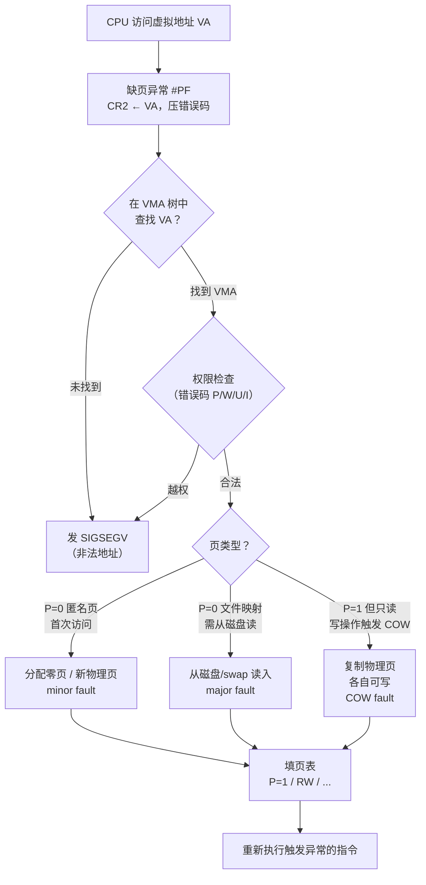

# OS启动（08）· 虚拟内存子系统

## 概述与定位

> [!abstract] TL;DR
> 虚拟内存子系统是内核与物理内存之间的"合同中介"：`mmap`/`brk` 等系统调用只建立 **VMA（虚拟内存区域）**，不立刻给物理页；首次访问触发 **缺页异常 `#PF`（向量 14）**，CPU 把故障地址存入 `CR2` 并压入错误码，内核 `do_page_fault` 据 VMA 决定分配新页（**minor fault**）、从磁盘换入（**major fault**）还是发 `SIGSEGV`。`fork` 依赖 **COW（写时复制）** 让父子共享物理页直到任一方写入；内存紧张时 **`kswapd`** 按 **LRU active/inactive** 链表回收，匿名页写到 **swap**，文件页回写磁盘；极端情况触发 **OOM killer**。理解这条链路，就能读懂 `/proc/meminfo`、`vmstat` 的每一个数字，也能排查缺页风暴、OOM 被杀等生产问题。

本篇衔接 [[07.分页与页表机制]]（硬件页表结构）与 [[09.中断异常与IDT]]（异常向量框架），专注于 Linux 内核软件层面如何运营虚拟内存：VMA 树、缺页处理决策、COW、LRU 回收、swap、OOM killer 以及 page cache。

与 [[24.内存管理与堆分配器/02.进程地址空间与虚拟内存.md]]（用户态视角的地址空间布局）和 [[24.内存管理与堆分配器/03.mmap与brk内核内存接口.md]]（`brk`/`mmap` 系统调用语义）形成内核-用户态两侧的完整覆盖。

---

## 原理与机制

### 按需调页与 VMA

进程的地址空间由一棵 **VMA（`vm_area_struct`）红黑树**描述，每个节点记录一段虚拟地址区间的权限、映射类型（匿名/文件）、后备文件等元数据，但**不保证对应物理页已存在**。

`mmap`、`brk`、ELF 加载（`load_elf_binary` 中的 `do_mmap`）都只是在这棵树上插入新 VMA——这是**按需调页（demand paging）**的基础：映射建立时不分配物理页，首次访问时才触发缺页。

```
进程发出 mmap(size) / brk()
         │
         ▼
    内核在 VMA 树插入新节点
    （无物理页，页表项 P=0）
         │
    首次 CPU 访问该虚拟地址
         │
         ▼
    缺页异常 #PF → 分配物理页 → 填页表 → 重新执行
```

### 缺页处理决策 + COW



---

## 机制详解

### 缺页异常 `#PF`：向量 14 与错误码

`#PF` 是 x86 异常向量 **14**（见 [[09.中断异常与IDT]]）。CPU 处理 `#PF` 的硬件行为：

1. **`CR2` ← 故障虚拟地址**（Page Fault Linear Address，精确到字节）。
2. 在当前特权级切换或保持，压入 `SS`/`RSP`/`RFLAGS`/`CS`/`RIP`（跨特权级时还压 `SS`/`RSP`）。
3. 压入 **32 位错误码**（`#PF` 独有，非所有异常都有）。
4. 跳转到 IDT 第 14 项处理程序（Linux 中为 `asm_exc_page_fault` → `exc_page_fault` → `do_page_fault`）。

#### 错误码位定义

| 位 | 符号 | 含义 |
|----|------|------|
| 0 | **P** | `0`=页不存在（未映射）；`1`=页存在但权限违规 |
| 1 | **W/R** | `0`=读访问触发；`1`=写访问触发 |
| 2 | **U/S** | `0`=内核态访问；`1`=用户态访问 |
| 3 | **RSVD** | PTE 保留位被置位（页表损坏） |
| 4 | **I/D** | `0`=数据访问；`1`=取指（代码执行） |
| 5 | **PK** | Protection Key 违反（PKU 机制） |
| 15 | **SGX** | SGX enclave 违规 |

错误码含义举例：

```
错误码 0x03 = 0b00000011 → P=1, W=1  → "页存在但写保护"（典型 COW 触发）
错误码 0x04 = 0b00000100 → P=0, U=1  → "用户态访问未映射页"（典型匿名缺页）
错误码 0x07 = 0b00000111 → P=1, W=1, U=1 → "用户态写只读页"（COW 或非法写）
```

#### `do_page_fault` 决策流

```c
/* 伪代码，内核真实路径更复杂 */
void do_page_fault(pt_regs, error_code) {
    va = read_cr2();                        // 故障地址
    vma = find_vma(current->mm, va);        // 在红黑树中查找

    if (!vma || va < vma->vm_start) {
        send_sigsegv(SEGV_MAPERR);          // 未映射：SIGSEGV
        return;
    }
    if (!check_access(vma, error_code)) {
        send_sigsegv(SEGV_ACCERR);          // 权限不符：SIGSEGV
        return;
    }
    // 合法缺页：根据 PTE 状态和错误码分派
    handle_mm_fault(vma, va, flags);
}
```

`handle_mm_fault` 最终会调用：
- `do_anonymous_page`：匿名区首次写 → 分配零填充物理页
- `do_read_fault` / `do_cow_fault` / `do_shared_fault`：文件映射的各路径
- `do_wp_page`：写保护（P=1, W=1）→ COW

### Minor fault vs Major fault

| 类型 | 触发条件 | 是否涉及 I/O | 典型延迟 |
|------|----------|-------------|---------|
| **Minor fault**（次缺页）| 物理页已在内存（page cache 命中）或首次匿名分配 | 否 | 微秒级 |
| **Major fault**（主缺页）| 物理页需从磁盘（文件/swap）读取 | 是 | 毫秒级 |

`/proc/<pid>/status` 中的 `VmRSS` 反映已分配物理页；`/proc/<pid>/stat` 第 10/11 字段分别是进程的 minor/major fault 累计值。`vmstat` 的 `si`/`so` 列反映 swap in/out 流量（都是 major fault 的一种）。

### 写时复制（COW）

`fork` 是 Linux 中最依赖 COW 的场景：

```
父进程 fork()
    │
    ▼
子进程（clone task_struct + mm_struct）
    └── 所有页表项标记为"只读"（即使原来可写）
    └── 物理页引用计数 +1，父子共享同一份

任一方写 → #PF（错误码 P=1, W=1）
    → do_wp_page：
        引用计数 == 1？直接改为 RW（无其他共享者）
        引用计数 > 1？
            alloc_page → copy_page（复制内容）
            旧页引用计数 -1
            当前进程页表指向新页，标记 RW
    → 继续写入新页
```

COW 带来的效益：`fork` 后立刻 `execve` 的场景（shell 运行命令），父子进程几乎不发生 COW，因为 `execve` 会直接替换整个地址空间（`do_exec` 调用 `exec_mmap` 释放旧 mm，建新 mm）。

`vfork` 则更激进：连 mm 都共享，子进程在父进程的地址空间里执行，直到 `execve` 或 `_exit`——没有 COW，但也没有任何隔离。

### LRU 页面回收与 swap

内核维护两条 **LRU 链表**：

| 链表 | 含义 | 内容 |
|------|------|------|
| `active` | 最近被访问 | 热页（频繁 access bit=1） |
| `inactive` | 未被最近访问 | 冷页，优先回收候选 |

页在两条链表之间流动（`mark_page_accessed` / `deactivate_page`）。回收时优先从 `inactive` 末尾取页：

- **文件页（page cache）**：若干净（与磁盘同步）直接回收；若脏则先写回（`writeback`）再回收。
- **匿名页**：必须先写到 **swap 设备**（`swap_out_page`）再回收。写出后 PTE 中的物理页号替换为 **swap entry**（编码了 swap 设备号和 slot 偏移），P=0，下次访问触发 major fault 换入。

```
swap entry 格式（x86-64 PTE，P=0 时）：
bit 0    = 0（P=0，与正常页区分）
bits 1-4 = swap type（设备号）
bits 5-63= swap offset（在 swap 区的页槽编号）
```

#### `kswapd`

**`kswapd`** 是内核回收线程（每个 NUMA 节点一个），在可用内存低于 `watermark_low` 时被唤醒，目标是把可用内存回补到 `watermark_high` 以上：

```
可用内存：
  ┌─────────────────────────────────────────────────────┐
  │    used    │   inactive   │   active   │   free     │
  └─────────────────────────────────────────────────────┘
         ↑ watermark_min    ↑ watermark_low  ↑ watermark_high
  
  free < watermark_low → 唤醒 kswapd 异步回收
  free < watermark_min → 内存分配路径直接同步回收（direct reclaim）
```

`MADV_*` 提示：

| 提示 | 语义 |
|------|------|
| `MADV_DONTNEED` | 内核立即丢弃物理页，下次访问获得零页 |
| `MADV_FREE` | 页在内存压力下才被回收，访问前原内容可能保留 |
| `MADV_WILLNEED` | 预读提示，内核预先换入 |
| `MADV_SEQUENTIAL` | 顺序访问提示，激进预读 |

### OOM Killer

当系统内存彻底耗尽（`direct reclaim` 也无法满足分配，且 swap 已满），内核触发 **OOM（Out-Of-Memory）Killer**：

1. 遍历所有进程，计算 **`oom_score`**（0–1000）：
   - 基础分：进程 RSS 占物理内存比例（越大分越高）
   - 调整项：`oom_score_adj`（-1000~+1000，可由用户/服务调整）
   - 内核线程、进程组 leader 有额外保护
2. 选择 `oom_score` 最高的进程发送 `SIGKILL`。
3. 被杀进程释放其所有内存，系统恢复。

```bash
# 查看某进程的 oom_score
cat /proc/<pid>/oom_score

# 调整（-1000 = 永不被 OOM 杀；+1000 = 最高优先级被杀）
echo -500 > /proc/<pid>/oom_score_adj
```

#### `overcommit` 机制

内核通过 `vm.overcommit_memory` 控制是否允许超额承诺：

| 值 | 策略 |
|----|------|
| `0`（默认）| 启发式：允许适度 overcommit，拒绝明显过量请求 |
| `1` | 始终允许，`mmap` 任意大小总成功 |
| `2` | 严格：提交总量 ≤ swap + RAM × `overcommit_ratio` |

Overcommit 使 `mmap(1GB)` 可能立刻成功但物理内存不够，等到真正访问时才暴露问题——这是 OOM 风险的根源。

### Page Cache

**page cache** 是内核维护的文件数据缓存，本质是一棵以 `(inode, page_index)` 为键的 **XArray（基数树）**，缓存文件页。

`mmap` 映射文件时，进程的 PTE 直接指向 page cache 中的物理页，多进程映射同一文件页只需一份物理页（只读或 MAP_SHARED）；写文件经 page cache 先写入内存，由 `writeback` 线程异步刷盘（write-back 模式）。

```
用户态 read(fd, buf, n)
    → VFS → 文件系统 → page cache 查找
    │  命中（clean page）→ 直接拷贝，minor fault
    └  未命中 → 分配 page cache 页 → 从磁盘读（major fault）→ 拷贝

mmap 映射文件
    → VMA 关联 page cache
    → 首次访问：缺页 → 在 page cache 中找/建页 → 填 PTE
    → 多进程共享同一 cache 页（MAP_SHARED）
```

---

## 实战 / 观察

### `/proc/<pid>/status` 看内存占用

```bash
grep -E 'VmRSS|VmSize|VmSwap|VmPeak' /proc/<pid>/status
```

```text
VmPeak:   204800 kB     # 虚拟地址空间峰值（VMA 总量）
VmSize:   196608 kB     # 当前虚拟地址空间大小
VmRSS:     12288 kB     # 物理内存（Resident Set Size）
VmSwap:     2048 kB     # 已换出到 swap 的大小
```

> [!warning] 示例输出为示意
> 以上数值仅为说明性示意，真实数字因进程、系统内存和负载不同而差异巨大。

- `VmSize - VmRSS` ≈ 尚未触发缺页（按需调页尚未"用到"）的页数
- `VmSwap > 0` 说明进程有页已被换出，下次访问触发 major fault

### `/proc/<pid>/stat` 看缺页计数

```bash
# 字段 10=minor_faults, 11=major_faults（从进程创建累计）
awk '{print "minor="$10, "major="$11}' /proc/<pid>/stat
```

```text
minor=84231 major=47
```

> [!warning] 示例输出为示意
> 实际数字取决于进程运行时长和访问模式。minor fault 在大多数进程远多于 major fault。

### `/proc/meminfo` 看系统内存全貌

```bash
grep -E 'MemTotal|MemFree|MemAvailable|Cached|SwapTotal|SwapFree|Active|Inactive' /proc/meminfo
```

```text
MemTotal:       16384000 kB
MemFree:          512000 kB
MemAvailable:    4096000 kB   # 实际可用（含可回收 cache）
Cached:          6144000 kB   # page cache 占用
Active:          3072000 kB   # active LRU 链表
Inactive:        2048000 kB   # inactive LRU 链表
SwapTotal:       4194304 kB
SwapFree:        3145728 kB
```

> [!warning] 示例输出为示意
> 以上内存数字仅为说明性示意，真实系统因硬件配置和当前负载不同。

关键指标：**`MemAvailable`**（而非 `MemFree`）才是实际可分配内存的估算——内核计算时把可回收的 `Cached` 和 `Inactive` 都纳入估算。

### `vmstat` 看实时缺页与 swap 流量

```bash
vmstat 1 5
```

```text
procs -----------memory---------- ---swap-- -----io---- -system-- ------cpu-----
 r  b   swpd   free   buff  cache   si   so    bi    bo   in   cs us sy id wa st
 2  0  20480 512000  65536 6144000    0    0     0     0  300  800  5  2 93  0  0
 0  0  20480 510000  65536 6145000    0    0     0     0  250  700  3  1 96  0  0
```

> [!warning] 示例输出为示意
> 实际数字随系统负载动态变化。

关键列：
- `swpd`：已使用 swap 总量（KB）
- `si`（swap in）：每秒从 swap 换入的页数 → **major fault 频率**
- `so`（swap out）：每秒换出到 swap 的页数 → **内存压力**
- `bi` / `bo`：磁盘块 in/out，file-backed major fault 体现在此

### `ps` 看进程级 fault 统计

```bash
ps -o pid,comm,minflt,majflt -p <pid>
```

```text
  PID COMMAND         MINFLT MAJFLT
 1234 myserver        184920     52
```

> [!warning] 示例输出为示意

`majflt` 持续增长 + `vmstat si` 较高，说明系统频繁换页，是内存不足或 working set 过大的信号。

### GDB/QEMU 中观察缺页

在 QEMU + GDB 调试内核时可在 `exc_page_fault` 打断点，观察 `CR2` 和错误码：

```bash
# QEMU 启动内核后，gdb 连接
(gdb) break exc_page_fault
(gdb) continue
# 触发缺页后
(gdb) info register cr2    # 查看故障地址
(gdb) print $rdi           # error_code（Linux x86-64 调用约定第一参数）
```

---

## 安全性与正确使用

### 缺页侧信道（Rowhammer / Spectre 变体）

缺页异常的时序本身可作为侧信道：

- **`FLUSH+RELOAD` / `EVICT+RELOAD`**：攻击者通过 page cache 共享（两个进程映射同一文件页），观察访问延迟判断受害者是否访问了特定页，从而推断密钥或内存布局。防御：`seccomp` 过滤 `perf_event_open`；内核 `CONFIG_SPECULATION_MITIGATIONS`。
- **`KASLR` 与缺页信息泄漏**：某些 `#PF` 路径在用户可观察的信息（如错误码或信号内容）中可能泄漏内核地址偏移量。现代内核通过 **KPTI（Kernel Page-Table Isolation）** 分离用户态/内核态页表，使 `#PF` 处理路径无法通过时序推断内核 KASLR 偏移。

### Swap 中的敏感数据泄漏

匿名页被换出到 swap 后：

- 即使进程退出，swap 页内容（密钥、密码、私钥）**不会自动被内核清零或加密**（除非启用内核 `CONFIG_PAGE_POISONING` 或 swap 加密）。
- 防御：
  - 重要数据 `mlock(ptr, len)` 锁定到物理内存（`CAP_IPC_LOCK` 能力），防止被换出。
  - 使用后 `explicit_bzero` 擦除后再 `munlock`。
  - 系统级：启用 **swap 加密**（`dm-crypt` + swap partition，或 `zswap` 压缩加密）。
  - 敏感服务（如 SSH daemon、密钥管理服务）常在启动时 `mlockall(MCL_CURRENT | MCL_FUTURE)` 锁全部内存。

```bash
# 检查某进程是否有 mlock 的 VMA
grep -i "locked" /proc/<pid>/status
# VmLck:    4096 kB  →  有 4MB 被 mlock
```

> [!warning] 示例输出为示意

### OOM Killer 导致服务被杀的排查

**现象**：服务突然消失，`dmesg` 或 `/var/log/kern.log` 出现 `Out of memory: Kill process`。

```bash
# 排查步骤
dmesg | grep -i "oom\|killed process"
# 典型输出：
# [12345.678] Out of memory: Kill process 1234 (myservice) score 623 or sacrifice child
# [12345.679] Killed process 1234 (myservice) total-vm:2097152kB, anon-rss:1048576kB, file-rss:4096kB
```

> [!warning] 示例输出为示意

排查清单：

1. **确认 OOM 而非 OOM score 调整**：检查 `oom_score_adj`，确保关键服务设为较低值（如 `-500`）。
2. **分析内存泄漏**：OOM 时的 `dmesg` 包含所有进程内存快照，找出 RSS 异常大的进程。
3. **swap 是否耗尽**：`vmstat` 的 `swpd` 是否接近 `SwapTotal`；swap 太小或无 swap 会使 OOM 更快触发。
4. **overcommit 策略是否合理**：生产环境建议 `vm.overcommit_memory=2` + 合理的 `overcommit_ratio`，避免内核承诺了无法兑现的内存。
5. **容器环境**：cgroup v2 `memory.max` 触发的 OOM 只杀该 cgroup 内进程（不影响宿主），但同样写 `dmesg`。

```bash
# 防止 critical 服务被 OOM 杀
echo -1000 > /proc/$(pidof sshd)/oom_score_adj   # -1000 = 永不被杀
# 或通过 systemd unit
# OOMScoreAdjust=-1000
```

### `mlock` / `madvise` 正确使用

```c
#include <sys/mman.h>

/* 锁定敏感数据页，防换出 */
mlock(secret_buf, secret_len);
/* ... 使用 secret_buf ... */
explicit_bzero(secret_buf, secret_len);   /* 先擦除 */
munlock(secret_buf, secret_len);          /* 再解锁 */

/* 预读大文件，减少 major fault 频率 */
madvise(file_map, map_size, MADV_SEQUENTIAL);

/* 主动标记暂时不用的缓冲区，释放物理页 */
madvise(cache_buf, cache_size, MADV_DONTNEED);
```

---

## 小结

| 机制 | 关键点 |
|------|--------|
| **按需调页** | `mmap`/`brk` 只建 VMA；首次访问触发 `#PF`（向量 14） |
| **`#PF` 错误码** | `CR2` = 故障地址；位 P/W/U/I 区分存在/权限/读写/取指 |
| **Minor / Major fault** | Minor = 无 I/O；Major = 需磁盘/swap，毫秒级延迟 |
| **COW** | `fork` 共享只读物理页；写触发 `#PF`（P=1,W=1）→ 复制页 |
| **LRU 回收** | active/inactive 双链表；匿名页 → swap；文件页 → writeback |
| **`kswapd`** | 低于 `watermark_low` 时异步回收；`watermark_min` 时同步 |
| **OOM killer** | 按 `oom_score` 选受害者；`oom_score_adj` 可保护关键服务 |
| **overcommit** | `vm.overcommit_memory` 0/1/2；overcommit 是 OOM 的根源 |
| **page cache** | 文件页缓存；`mmap` 文件共享物理页；write-back 异步刷盘 |

---

## 相关阅读

- **系列内**：[[07.分页与页表机制]]（CR3 / PTE 标志 / 4 级页表，本篇缺页的硬件基础）、[[09.中断异常与IDT]]（IDT 第 14 项，`#PF` 异常门框架）
- **用户态侧互补**：[[24.内存管理与堆分配器/03.mmap与brk内核内存接口.md]]（`brk`/`mmap` 系统调用语义与 ptmalloc 决策）、[[24.内存管理与堆分配器/02.进程地址空间与虚拟内存.md]]（用户态地址空间布局与 `/proc/maps`）
- **汇编与架构互补**：[[21.Asm/38 MMU与页表设置实战.md]]（页表设置指令级实战）、[[21.Asm/29 异常中断处理对比.md]]（ARM/x86 异常处理对比）

---

⬅️ 上一篇 [[07.分页与页表机制]] ｜ 🏠 [[00.操作系统加载与启动总览]] ｜ 下一篇 [[09.中断异常与IDT]] ➡️
