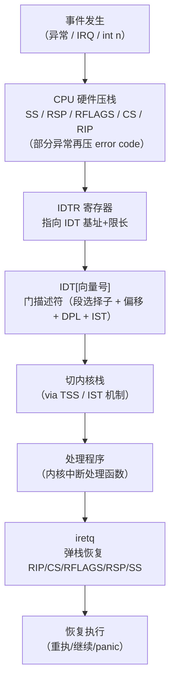

# OS启动（09）· 中断异常与IDT

## 概述与定位

> [!abstract] TL;DR
> 内核在 `start_kernel` 早期调用 `trap_init` 建好 **IDT（中断描述符表）**，之后才开启 `sti` 打开中断——这是内核从"静止"到"可被外界打断"的关键一跳。IDT 共 **256 项**门描述符，向量 **0–31** 保留给 CPU 异常（`#PF`=14、`#GP`=13、`#DF`=8…），**32–255** 留给外部中断与软中断；每次异常或中断触发，CPU 硬件自动压栈返回现场、切内核栈，跳到 IDT 指定的处理程序，处理完后 `iretq` 弹栈返回。

**在启动链上的位置**：承接第 08 章的虚拟内存子系统——缺页 `#PF` 就是一条经 IDT 路由的异常；向前衔接第 10 章的系统调用机制——`int 0x80` 是 IDT[0x80] 的软中断，而现代 `syscall` 指令则绕开 IDT（详见第 10 章）。

```
第 07 章：分页/页表
  └─ 第 08 章：虚拟内存（缺页 #PF）
       └─ 第 09 章：IDT 与中断/异常  ← 本章
            └─ 第 10 章：系统调用（syscall/int 0x80）
```

---

## 原理与机制

### 三类事件：异常 / 中断 / 软中断

x86-64 架构把所有"打断正常执行流"的事件统一通过 IDT 路由，但来源与行为不同：

| 类别 | 来源 | 同步性 | CPU 行为 | 典型例子 |
|------|------|--------|----------|----------|
| **异常（exception）** | CPU 执行指令本身触发 | **同步** | 立即处理 | `#PF` 缺页、`#GP` 一般保护 |
| - **Fault（故障）** | 可恢复，返回重执本指令 | 同步 | 恢复后重试 | `#PF`=14、`#GP`=13、`#DE`=0 |
| - **Trap（陷阱）** | 执行后触发，返回下一条 | 同步 | 继续执行 | `#BP`=3 断点 |
| - **Abort（中止）** | 不可恢复的严重错误 | 同步 | 内核 panic | `#DF`=8 双重错误 |
| **中断（interrupt）** | 外设异步信号（IRQ） | **异步** | 当前指令完成后处理 | 定时器、键盘、网卡 |
| **软中断 / 陷阱门** | `int n` 指令主动触发 | 同步 | 同 Trap | `int 0x80` 系统调用 |

> 三类术语说明：**Fault 可恢复**——处理程序修好后 CPU 重新执行触发那条指令（如缺页后映射好物理页再重执访存）；**Trap 不重执**——`#BP` 断点是陷入调试器而非重试；**Abort 永不返回**——内核检测到 `#DF` 通常直接 panic。

### 中断/异常分发流程



---

## 结构详解

### IDT 与 IDTR

**IDT（Interrupt Descriptor Table）** 是一个内存中的表，共 **256 项**，每项是一个 **16 字节的门描述符**。`IDTR` 寄存器存放 IDT 的基地址与限长（类似 GDTR/LDTR 对 GDT 的关系），由 `lidt` 指令加载：

```nasm
; Intel 语法示例
lidt [idt_ptr]    ; idt_ptr = { limit: 16*256-1, base: idt_addr }
```

**三类门描述符**：

| 门类型 | IF 标志 | 用途 |
|--------|---------|------|
| **中断门（Interrupt Gate）** | 进入时自动清零（关中断） | 硬件 IRQ 处理，防止嵌套中断 |
| **陷阱门（Trap Gate）** | 不修改 IF | 软中断/调试陷阱，允许中断嵌套 |
| **任务门（Task Gate）** | （已废弃，x86-64 不支持） | 仅保护模式遗留 |

**门描述符（64 位格式，16 字节）**：

```
字节偏移   字段
 0– 1     处理程序偏移 [15:0]
 2– 3     段选择子（指向内核代码段，通常 0x10）
 4        IST 索引（低 3 位）；高 5 位保留
 5        类型与属性（P=1 存在位、DPL、Type=0xE 中断/0xF 陷阱）
 6– 7     处理程序偏移 [31:16]
 8–11     处理程序偏移 [63:32]
12–15     保留为 0
```

**DPL（Descriptor Privilege Level）**：门描述符的 DPL 决定哪个特权级的代码可以通过 `int n` 触发该门。内核异常门 DPL=0（仅 Ring 0 可触发，用户态 `int 0x80` 需要 DPL=3）；外部硬件中断则由 CPU 绕过 DPL 检查直接进入。

### 向量 0–31：CPU 预留异常

| 向量 | 助记符 | 名称 | 类别 | 错误码 | 备注 |
|------|--------|------|------|--------|------|
| 0  | `#DE` | 除法错误（Divide Error）       | Fault | 无 | 整数除以零 |
| 1  | `#DB` | 调试（Debug）                  | Fault/Trap | 无 | 单步/断点（硬件） |
| 2  | —     | 不可屏蔽中断（NMI）            | —     | 无 | 硬件错误、Watchdog |
| 3  | `#BP` | 断点（Breakpoint）             | **Trap** | 无 | `int3` 指令，调试器用 |
| 4  | `#OF` | 溢出（Overflow）               | Trap  | 无 | `into` 指令 |
| 5  | `#BR` | 边界检查（BOUND Range Exceeded）| Fault | 无 | `bound` 指令 |
| 6  | `#UD` | 无效操作码（Undefined Opcode） | **Fault** | 无 | 非法指令 |
| 7  | `#NM` | 协处理器不可用（Device Not Available）| Fault | 无 | FPU/SSE 状态切换 |
| 8  | `#DF` | 双重错误（Double Fault）       | **Abort** | 有（0） | 处理异常时再异常 |
| 9  | —     | 协处理器段溢出（已废弃）        | Fault | 无 | 保护模式遗留 |
| 10 | `#TS` | 无效 TSS                       | Fault | 有 | 任务切换错误 |
| 11 | `#NP` | 段不存在（Segment Not Present） | Fault | 有 | 段描述符 P=0 |
| 12 | `#SS` | 栈段错误（Stack Segment Fault）| Fault | 有 | 栈操作越界 |
| 13 | `#GP` | 一般保护错误（General Protection）| **Fault** | 有 | 特权级、段限长违规 |
| 14 | `#PF` | 缺页（Page Fault）             | **Fault** | 有 | 地址未映射/权限错 |
| 15 | —     | Intel 保留                     | — | — | — |
| 16 | `#MF` | x87 浮点错误（FPU Math Fault） | Fault | 无 | — |
| 17 | `#AC` | 对齐检查（Alignment Check）    | Fault | 有（0）| 非对齐访问 |
| 18 | `#MC` | 机器检测（Machine Check）      | Abort | 无 | 硬件错误 |
| 19 | `#XM` | SIMD 浮点异常                  | Fault | 无 | SSE 指令 |
| 20 | `#VE` | 虚拟化异常（VMX）              | Fault | 无 | Intel VT |
| 21 | `#CP` | 控制流保护（CET）              | Fault | 有 | Intel CET shadow stack |
| 22–31 | — | Intel 保留                   | — | — | 未来扩展 |

> [!tip] 重点记忆
> `#DE`=**0**（除零，Fault）、`#BP`=**3**（断点，Trap）、`#UD`=**6**（非法指令，Fault）、`#DF`=**8**（双重错误，Abort）、`#GP`=**13**（一般保护，Fault）、`#PF`=**14**（缺页，Fault）——这六个最常在内核日志、漏洞报告和调试中出现。

**缺页（`#PF`=14）** 额外传递两类信息：
- **错误码**（压栈，bit0=P（页是否存在）、bit1=W/R（写/读）、bit2=U/S（用户/内核）、bit3=RSVD（保留位被置）、bit4=I/D（1=取指触发））
- **`CR2` 寄存器**：保存触发缺页的**线性地址**，内核 `do_page_fault` 读 `CR2` 后决定是映射新页、写时复制还是 SIGSEGV。

**向量 32–255**：外部中断（由 8259 PIC 或 APIC 分发的 IRQ 映射到此范围）以及软中断（如 `int 0x80`=向量 128=系统调用入口）。

### 进入与退出：TSS、IST 与 iretq

**进入时 CPU 硬件自动做的事**：

```
1. 从 IDTR 找到 IDT[向量号] 的门描述符
2. 检查 DPL（软中断时；硬件中断绕过）
3. 若特权级切换（用户态→内核态）：
   a. 从 TSS.RSP0 加载内核栈 RSP
   b. 若 IST 索引非零：从 TSS.IST[n] 加载独立栈
4. 压栈（高地址→低地址）：
     SS
     RSP
     RFLAGS
     CS
     RIP
     [错误码（部分异常）]
5. 清 RFLAGS.IF（中断门），不清（陷阱门）
6. 加载 CS:RIP = 门描述符中的段选择子:偏移，跳入处理程序
```

**TSS（Task State Segment）**：x86-64 中 TSS 主要用途是存储特权级切换时的栈指针。字段 `RSP0`（Ring 0 栈）、`RSP1`、`RSP2` 以及 **`IST1–IST7`**（Interrupt Stack Table，7 个独立紧急栈）。

**IST（Interrupt Stack Table）** 机制：某些关键异常（`#DF`、`#MC`、`#NMI` 等）使用 IST 独立栈而非 RSP0，即使当前内核栈本身已损坏也能进入处理程序。Linux 为 `#DF` 分配专用 IST 栈正是因此。

**退出（`iretq`）**：

```nasm
; 处理程序末尾
iretq    ; 弹出 RIP、CS、RFLAGS、RSP、SS，恢复执行
         ; 若弹出的 CS.RPL < 当前 CPL，则切回用户态并切栈
```

Linux 内核的处理程序通常用汇编 stub 保存全部通用寄存器（`pushq %rax` 等）、再调 C 函数，返回后弹寄存器再 `iretq`。

### 中断控制器：8259 PIC → APIC → MSI/MSI-X

**8259 PIC（Programmable Interrupt Controller）**：
- 两片级联（主 PIC + 从 PIC），共 **15 条 IRQ 线**（IRQ0=定时器、IRQ1=键盘、IRQ2=级联从、IRQ14=IDE…）
- 早期 PC BIOS 初始化时将 IRQ0–7 映射到向量 **0x08–0x0F**（与 CPU 异常冲突！），OS 初始化时必须重新编程 8259 将 IRQ 映射到向量 **0x20–0x2F**（32–47）
- 用 `in`/`out` 指令读写端口 `0x20`/`0x21`（主）、`0xA0`/`0xA1`（从）；每处理完 IRQ 须发 EOI（End Of Interrupt）
- 现代系统：`cli` 指令清 `IF` 可屏蔽所有可屏蔽中断；NMI 不受 `IF` 影响

**APIC（Advanced Programmable Interrupt Controller）**：

```
[设备] ──MSI──► IO-APIC ──► Local APIC（每颗核各一个）──► CPU
                              ├── 定时器（LAPIC timer）
                              ├── IPI（核间中断，SMP 必需）
                              └── LINT0/LINT1（本地外部中断）
```

- **Local APIC（LAPIC）**：每个 CPU 核内各一个，MMIO 映射（xAPIC：0xFEE00000；x2APIC：MSR 方式）。管理本核的中断优先级（TPR）、EOI、核间中断（IPI）、LAPIC 定时器。
- **IO-APIC**：系统级，收集设备 IRQ 并路由到目标 CPU 的 LAPIC。**重定向表（Redirection Table）** 每项指定向量号、目标 CPU、触发模式（电平/边沿）。
- **MSI（Message Signaled Interrupts）/ MSI-X**：PCIe 设备直接通过写内存地址（LAPIC 地址空间）发中断，绕开 IRQ 物理引脚，支持每设备多个中断向量，延迟更低、并发性更好。

**中断屏蔽**：

```nasm
cli      ; 清 RFLAGS.IF，屏蔽所有可屏蔽中断（临界区保护）
sti      ; 置 RFLAGS.IF，开中断
```

内核在修改 IDT、切换栈等关键时刻会 `cli`，操作完再 `sti`。

---

## 实战 / 观察

### trap_init 与 IDT 初始化

Linux 内核在 `start_kernel`（`init/main.c`）中调用 `trap_init`（`arch/x86/kernel/traps.c`），按向量号逐一注册处理程序，随后调用 `cpu_init` 加载 TSS 并执行 `lidt`。

```c
// 简化示意（非精确代码，原始见 arch/x86/kernel/traps.c）
void __init trap_init(void)
{
    set_intr_gate(X86_TRAP_DE,  asm_exc_divide_error);    // #DE=0
    set_intr_gate(X86_TRAP_DB,  asm_exc_debug);           // #DB=1
    set_intr_gate(X86_TRAP_NMI, asm_exc_nmi);             // NMI=2，IST
    set_trap_gate(X86_TRAP_BP,  asm_exc_int3);            // #BP=3，陷阱门
    set_intr_gate(X86_TRAP_UD,  asm_exc_invalid_op);      // #UD=6
    set_intr_gate(X86_TRAP_DF,  asm_exc_double_fault);    // #DF=8，IST
    set_intr_gate(X86_TRAP_GP,  asm_exc_general_protection); // #GP=13
    set_intr_gate(X86_TRAP_PF,  asm_exc_page_fault);      // #PF=14
    // … 其余向量 …
    load_idt(&idt_descr);   // lidt 加载 IDTR
}
```

### /proc/interrupts 观察 IRQ 分发

```bash
cat /proc/interrupts
```

```text
           CPU0       CPU1       CPU2       CPU3
  0:         51          0          0          0   IO-APIC    2-edge      timer
  1:          0          0          1          0   IO-APIC    1-edge      i8042
  8:          0          0          0          1   IO-APIC    8-edge      rtc0
 16:          0          0          0          0   IO-APIC   16-fastedge
 19:          0          0         32          0   IO-APIC   19-fastedge
 23:          0          0          0          0   IO-APIC   23-fastedge
 24:          0       1234          0          0   PCI-MSI 327680-edge    xhci_hcd
NMI:          2          1          2          1   Non-maskable interrupts
LOC:      81234      79012      82345      78901   Local timer interrupts
ERR:          0
MIS:          0
```

> [!warning] 示例输出为示意

- 第一列：IRQ 号（如 0/1/8…）；在 PIC/APIC 下经偏移映射到 IDT 向量（传统 8259 把 IRQ0–15 重映射到向量 32–47），并非直接 IDT[IRQ 号]
- 后续列：各 CPU 核处理该中断的次数
- 最右：中断控制器类型与名称
- `NMI`：不可屏蔽中断（NMI=向量 2）
- `LOC`：LAPIC 本地定时器中断

### QEMU/GDB 观察 IDT

```bash
# 启动 QEMU 调试
qemu-system-x86_64 -kernel vmlinuz -append "nokaslr" -s -S &
gdb vmlinux
(gdb) target remote :1234
(gdb) break trap_init
(gdb) continue
# 在 trap_init 返回后：
(gdb) monitor info idt        # QEMU monitor 打印 IDT（需 Ctrl-A C 进入 monitor）
```

```bash
# 内核启动后观察 IDTR（在内核 gdb 或 /dev/mem 工具）
(gdb) maintenance packet Qqemu.idt   # 部分 QEMU 版本支持
```

> [!warning] 示例输出为示意

---

## 安全性与正确使用

### IDT Hooking：分析视角

**IDT Hooking** 是 rootkit 与内核漏洞利用的经典手法：通过修改内核内存中 IDT 的某个门描述符（如 `#PF`=14 的处理程序指针），将其替换为恶意代码地址——此后每次缺页都先经过恶意处理程序。

分析时关注点：
- 读取当前 IDTR：`sidt` 指令或 `/proc/kcore`；比对 IDT 各项与已知符号地址
- Linux 内核启用 **`CONFIG_X86_VSYSCALL_EMULATION`** 等功能时，IDT 向量布局在不同版本有差异
- 现代防御：**内核页表隔离（KPTI）** 使 IDT 本身映射在仅内核可访问的页，用户态无法读写；**KASLR** 使内核地址随机化，增加定位 IDT 的难度

### 中断处理中的竞态

中断处理程序（ISR）与正常内核代码共享数据结构时存在竞态：

```c
// 错误示例：中断处理与内核线程都写共享队列，可能并发
extern struct irq_queue q;
void irq_handler(void) {
    enqueue(&q, item);   // 若此时线程也在操作 q → 竞态
}
```

正确做法：
- 单核：进入 ISR 前 CPU 已自动关中断（中断门 IF=0）；若用陷阱门需手动 `cli`
- SMP：仅关本核中断不够，须用**自旋锁 + `spin_lock_irqsave`**（关中断+获锁）保护跨核共享结构
- 内核驱动代码分为**上半部（ISR，快速、不可阻塞）** 与**下半部（softirq/tasklet/workqueue，可延迟）**，减少关中断时间

### DPL 防止用户态触发特权门

设想用户程序执行 `int 13`（向量 13，`#GP`）：若 IDT[13] 的 DPL=0，CPU 会触发一个新的 `#GP`（DPL 拒绝），而非进入内核 GP 处理程序——这正是防御性设计。

- **内核异常门**（`#DE`/`#PF`/`#GP` 等）DPL=**0**，用户代码不能通过 `int n` 直接触发，只能由 CPU 异常本身触发
- **系统调用门**（`int 0x80`，向量 128）DPL=**3**，用户态可主动触发，进入内核 syscall 处理程序
- 错误配置（如将关键异常门 DPL 设为 3）会允许用户态用 `int 13` 进入内核 `#GP` 处理程序，形成特权提升漏洞

**SMEP/SMAP 与中断**：
- SMEP（Supervisor Mode Execution Prevention）：阻止 Ring 0 执行用户态页面的代码；即使 IDT 处理程序跳到用户态地址，CPU 也会 `#PF`
- SMAP（Supervisor Mode Access Prevention）：阻止 Ring 0 随意读写用户态内存，防止内核漏洞通过构造用户态 payload 实现提权

---

## 小结

| 要点 | 核心内容 |
|------|----------|
| IDT 大小 | 256 项，每项 16 字节门描述符 |
| 向量分配 | 0–31：CPU 异常（`#DE`=0、`#BP`=3、`#UD`=6、`#DF`=8、`#GP`=13、`#PF`=14）；32–255：IRQ/软中断 |
| 异常三类 | Fault（可恢复重执）/ Trap（执行后）/ Abort（不可恢复） |
| IDTR/lidt | `lidt [ptr]` 加载 IDT 基址+限长到 IDTR；`sidt` 读取 |
| 进入流程 | 硬件压 SS/RSP/RFLAGS/CS/RIP[+error_code]，经 TSS/IST 切内核栈，跳门描述符指定地址 |
| 退出 | `iretq` 弹栈恢复寄存器与特权级 |
| 中断控制器 | 旧 8259 PIC（IRQ0–15）→ APIC（LAPIC+IO-APIC）+MSI/MSI-X |
| 安全 | IDT hooking（分析），DPL 防用户态触发特权门，SMP 竞态需 spin_lock_irqsave |

**下一棒**：IDT 建好后，第 10 章讨论**系统调用机制**——`int 0x80` 经 IDT[128] 进内核是 legacy 路径；64 位内核改用 `syscall`/`sysret` 指令配合 MSR `LSTAR`/`STAR`/`SFMASK`，完全绕开 IDT，性能大幅提升。

---

## 相关阅读

- [[21.Asm/29 异常中断处理对比.md]] — 五架构（x86/ARM64/RISC-V/LoongArch/MIPS）异常机制横向对比
- [[21.Asm/34 异常向量实战.md]] — 裸机中断处理汇编实战
- [[07.分页与页表机制]] — 缺页 `#PF` 的前置条件：页表结构与 PTE 标志
- [[08.虚拟内存子系统]] — `#PF` 触发后的内核处理：COW/按需调页/swap
- [[10.系统调用机制]] — `int 0x80` 与 `syscall`/`sysret` 的对比与实现
- [[34.现代二进制防护机制/00.现代二进制防护机制总览.md]] — SMEP/SMAP/KPTI 防护机制

---

⬅️ 上一篇 [[08.虚拟内存子系统]] ｜ 🏠 [[00.操作系统加载与启动总览]] ｜ 下一篇 [[10.系统调用机制]] ➡️
