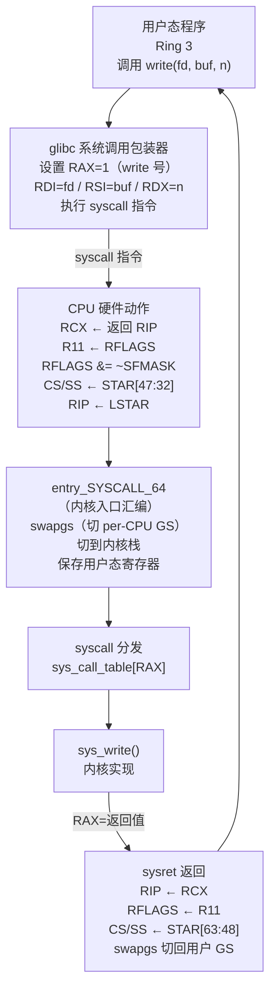
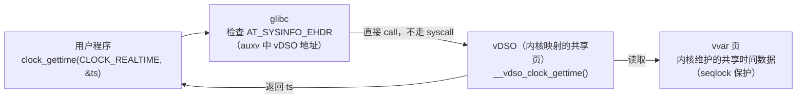
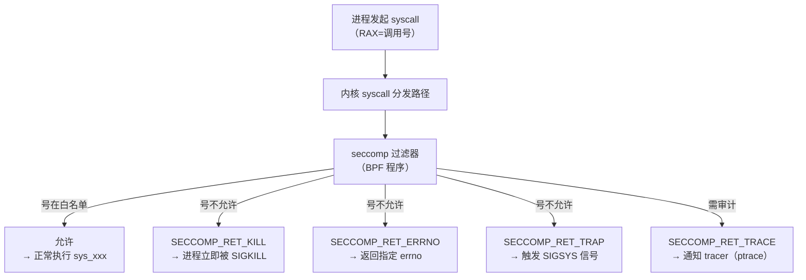

# OS启动（10）· 系统调用机制

## 概述与定位

> [!abstract] TL;DR
> **系统调用**是用户态（Ring 3）请求内核服务的唯一正式入口，本质是**受控的特权级切换**。x86-64 Linux 的主路径是 `syscall`/`sysret` 快速系统调用：内核启动时把入口函数 `entry_SYSCALL_64` 的地址写入 MSR **`LSTAR`(0xC0000082)**；用户态执行 `syscall` 后，CPU 自动把**返回 RIP 存入 RCX、RFLAGS 存入 R11**，然后跳入 LSTAR 所指地址；系统调用**号在 RAX**，参数依次为 **RDI RSI RDX R10 R8 R9**（第 4 个参数是 **R10 而非 RCX**，因为 `syscall` 已占用 RCX），返回值回 **RAX**（错误为负的 `-errno`）。Legacy `int 0x80` 走 IDT 第 0x80 项，号在 **EAX**，参数为 **EBX ECX EDX ESI EDI EBP**（速度更慢，现代 64 位用户态基本不再用）。**vDSO** 把 `gettimeofday`/`clock_gettime` 等做成无需陷入内核的用户态实现，大幅降低高频调用开销。ARM64 用 `SVC #0`，调用号放 **x8**，参数 x0–x5。与 [[23.C_C++运行时与ABI/12.参数传递与调用规约细节.md]] 的函数调用 ABI 严格区分：函数调用第 4 个整型参数走 **RCX**，而 syscall 走 **R10**；函数调用无"调用号"概念，syscall RAX 携带的号才是分发依据。

**在启动链中的位置**：内核在 `start_kernel()` 完成早期初始化、中断子系统（IDT/APIC，见 [[09.中断异常与IDT]]）就绪后，会调用 `syscall_init()` 写入三个 MSR（`LSTAR`/`STAR`/`SFMASK`），从此用户态进程可以安全地发起系统调用。这是内核向用户态"打开服务窗口"的关键一步。

---

## 原理与机制

### 为什么需要特权级切换

x86-64 CPU 有四个特权级（Ring 0–3），Linux 只使用 Ring 0（内核）和 Ring 3（用户态）。内核代码可以访问物理内存、I/O 端口、修改 CR3 等控制寄存器；用户态代码执行这些操作会立刻触发 `#GP`（通用保护异常）。系统调用的核心价值在于：

1. **隔离**：用户态代码不能直接读写内核数据结构，只能通过系统调用接口请求服务。
2. **审查**：内核在服务入口处校验参数合法性（指针是否指向用户空间、权限是否足够），阻止非法访问。
3. **效率**：`syscall`/`sysret` 是 Intel/AMD 为此设计的专用指令，比 `int 0x80` 快得多——不走 IDT 查表，不保存完整中断帧，直接跳到 MSR 指定地址。

### 用户态到内核态的切换流程



### MSR 三剑客：LSTAR / STAR / SFMASK

内核在 `syscall_init()`（`arch/x86/kernel/cpu/common.c`）中写入三个 MSR，一次性配置好整个快速系统调用机制：

| MSR | 地址 | 写入内容 | 作用 |
|---|---|---|---|
| **`LSTAR`** | `0xC0000082` | `entry_SYSCALL_64` 的虚拟地址 | `syscall` 指令跳转的目标（Long mode SYSCALL Target） |
| **`STAR`** | `0xC0000081` | `[63:48]` = 用户 CS、`[47:32]` = 内核 CS | 进入/退出时 CS/SS 选择子的来源 |
| **`SFMASK`** | `0xC0000084` | `TF|DF|IF|IOPL|AC|NT` 等位的掩码 | `syscall` 执行时从 RFLAGS 中**清除**这些标志位（IF 被清 → 进入内核时关中断） |

`STAR` 的布局（64 位 MSR）：

```
STAR[63:48] = 用户态 CS 基址（sysret 时恢复的 CS/SS 选择子）
STAR[47:32] = 内核态 CS  （syscall 时写入 CS 的值；SS = 此值 + 8）
STAR[31:0]  = 保留（EIP，32位遗留，64位模式不用）
```

### `syscall` 指令执行的硬件动作（逐步）

```
① RCX ← RIP（保存返回地址，即 syscall 指令的下一条指令）
② R11 ← RFLAGS（保存用户态标志寄存器）
③ RFLAGS &= ~(SFMASK)（清除 SFMASK 指定的位，包括 IF，关中断）
④ CS  ← STAR[47:32]（切换到内核代码段）
⑤ SS  ← STAR[47:32] + 8（内核数据段）
⑥ RIP ← LSTAR（跳入 entry_SYSCALL_64）
```

注意：`syscall` **不会**自动切换栈——内核入口汇编 `entry_SYSCALL_64` 需要手动用 `swapgs` 获取 per-CPU 结构体指针，再从中取出内核栈指针并切换。这也是为什么 `swapgs` 是 syscall 入口的第一条指令。

### `sysret` 指令执行的硬件动作

```
① RIP    ← RCX（恢复用户态返回地址）
② RFLAGS ← R11（恢复用户态 RFLAGS；硬件会清除 RF/VM 等不可由用户设置的位。因为 syscall 入口经 SFMASK 清了 IF，R11 里保存的是用户态原 RFLAGS（IF=1），故 sysret 后自动重开中断）
③ CS     ← STAR[63:48]（切换回用户代码段）
④ SS     ← STAR[63:48] + 8
```

`sysret` 同样不自动切栈——内核在 `sysret` 前需手动恢复用户态 RSP，并再次执行 `swapgs` 切回用户态 GS。

---

## 结构详解

### 系统调用寄存器约定（x86-64 Linux）

| 角色 | 寄存器 | 说明 |
|---|---|---|
| **调用号** | **RAX** | 系统调用编号，决定分发到哪个 `sys_xxx` |
| **第 1 参数** | **RDI** | 与 SysV 函数调用 ABI 一致 |
| **第 2 参数** | **RSI** | 同上 |
| **第 3 参数** | **RDX** | 同上 |
| **第 4 参数** | **R10** | **注意：不是 RCX！** 因 `syscall` 指令用 RCX 存返回 RIP |
| **第 5 参数** | **R8** | 同 SysV |
| **第 6 参数** | **R9** | 同 SysV |
| **返回值** | **RAX** | 成功为非负值；出错为 `-errno`（如 `-2` 代表 `ENOENT`） |
| *被 CPU 占用* | **RCX** | 存放用户态返回 RIP（不可用于传参） |
| *被 CPU 占用* | **R11** | 存放用户态 RFLAGS（不可用于传参） |

> [!warning] 与函数调用 ABI 的关键区别
> System V AMD64 函数调用 ABI（见 [[23.C_C++运行时与ABI/12.参数传递与调用规约细节.md]]）的第 4 个整型参数走 **RCX**；而 Linux x86-64 syscall ABI 的第 4 参数走 **R10**。glibc 的 syscall 包装器会在调用 `syscall` 指令前显式地把 RCX 的值移到 R10。两套 ABI 不能混用，逆向时必须先判断是函数调用还是系统调用。

### 内核入口：entry_SYSCALL_64

`entry_SYSCALL_64`（位于 `arch/x86/entry/entry_64.S`）是 x86-64 系统调用的真正入口，简化版流程如下：

```nasm
; arch/x86/entry/entry_64.S（示意，非完整原文）
SYM_CODE_START(entry_SYSCALL_64):
    ; ① 切换 GS：让 GS.base 指向 per-CPU 结构体（存有内核栈地址）
    swapgs

    ; ② 将用户 RSP 保存到 per-CPU 变量，然后切换到内核栈
    movq    %rsp, PER_CPU_VAR(cpu_tss_rw + TSS_sp2)
    movq    PER_CPU_VAR(cpu_current_top_of_stack), %rsp

    ; ③ 保存用户态寄存器到内核栈（构建 pt_regs 结构体）
    push    %r11        ; 用户 RFLAGS（CPU 自动存在 R11，这里再压栈）
    push    %rcx        ; 用户返回 RIP（CPU 自动存在 RCX，这里再压栈）
    push    %rax        ; 系统调用号
    ; ... 保存其他寄存器 ...

    ; ④ 检查调用号合法性
    cmpq    $__NR_syscall_max, %rax
    ja      .Lbad_syscall_nr

    ; ⑤ 查 sys_call_table 分发
    call    *sys_call_table(, %rax, 8)   ; 调用 sys_call_table[RAX]()

    ; ⑥ 返回值在 RAX，存回 pt_regs
    movq    %rax, RAX(%rsp)

    ; ⑦ 恢复用户态寄存器，切回用户 GS，sysret 返回
    swapgs
    sysretq
SYM_CODE_END(entry_SYSCALL_64)
```

> [!warning] 示例输出为示意

**`sys_call_table`** 是一个函数指针数组，下标就是系统调用号。在 x86-64 上定义于 `arch/x86/entry/syscall_64.c`：

```c
/* arch/x86/entry/syscall_64.c（示意） */
asmlinkage const sys_call_ptr_t sys_call_table[] = {
    [0]  = sys_read,
    [1]  = sys_write,
    [2]  = sys_open,
    /* ... */
    [59] = sys_execve,
    /* ... */
};
```

> [!warning] 示例输出为示意

### swapgs 与 per-CPU 结构体

`swapgs` 是 x86-64 专门为系统调用/中断入口设计的指令，它交换 `GS.base` 与 `IA32_KERNEL_GS_BASE` MSR 的值：

- **用户态时**：`GS.base` 是用户态 TLS 基地址（`arch_prctl(ARCH_SET_GS, ...)` 设置），`IA32_KERNEL_GS_BASE` 存着内核 per-CPU 数据的物理基地址。
- **`swapgs` 后**（进入内核）：`GS.base` 变成 per-CPU 数据基地址，可以通过 `%gs:offset` 访问 per-CPU 变量（包括当前进程的内核栈顶、`current` 指针等）。
- **`sysret` 前再次 `swapgs`**：恢复用户态 `GS.base`。

这是内核栈隔离的关键：每个 CPU 有独立的内核栈指针存在 per-CPU 区，`swapgs` 后即可快速切换到当前 CPU 的内核栈。

### Legacy `int 0x80`（32 位兼容路径）

在 32 位 x86 Linux 中，系统调用通过软件中断 `int 0x80` 发起，走 IDT 第 0x80 项（见 [[09.中断异常与IDT]]）。

| 角色 | 寄存器 | 说明 |
|---|---|---|
| **调用号** | **EAX** | 32 位系统调用号（与 64 位号不同！） |
| **第 1 参数** | **EBX** | |
| **第 2 参数** | **ECX** | |
| **第 3 参数** | **EDX** | |
| **第 4 参数** | **ESI** | |
| **第 5 参数** | **EDI** | |
| **第 6 参数** | **EBP** | |
| **返回值** | **EAX** | 同 64 位，负值为 `-errno` |

典型调用号对比：`write` 在 32 位是 **4**（EAX=4），在 64 位是 **1**（RAX=1）；`execve` 在 32 位是 **11**，在 64 位是 **59**。两套号表**完全不同**，逆向时不可混淆。

`int 0x80` 比 `syscall` 慢的原因：需要查 IDT、走中断门、保存完整的 `EFLAGS`/CS/EIP 到内核栈，还涉及 CPL 切换的硬件保存，整体约多 10–20 ns。

在 64 位 Linux 内核中，IDT 0x80 对应 `entry_INT80_compat`，允许 32 位进程（包括运行在 64 位内核上的 32 位兼容模式进程）继续使用 `int 0x80`。但 64 位进程用 `int 0x80` 时，内核**只会读 EAX/EBX/ECX/EDX/ESI/EDI/EBP**（32 位截断），高 32 位被忽略，可能导致指针被截断——这是安全风险，现代 64 位代码不应使用 `int 0x80`。

### vDSO：无需陷入内核的"伪系统调用"

**vDSO**（Virtual Dynamic Shared Object）是内核映射到每个进程地址空间的一个共享内存页，包含部分系统调用的**纯用户态实现**，无需陷入内核即可完成，大幅降低高频调用（如 `gettimeofday`、`clock_gettime`）的开销。



**工作原理**：

1. 内核在进程启动时（`load_elf_binary` 阶段）通过 `auxv`（辅助向量）传递 `AT_SYSINFO_EHDR`，其值指向 vDSO 映射地址（一个完整的 mini ELF 共享库）。
2. glibc 的 `__libc_start_main` 解析 auxv，找到 vDSO 并从中解析出 `__vdso_gettimeofday` 等符号的地址。
3. vDSO 中的函数直接读取内核在 **vvar 页**维护的时间戳（seqlock 保护，内核 tick 更新），完全在用户态完成计算，无 Ring 3→Ring 0 切换。
4. 若 vDSO 不可用（或极少数路径），glibc 退回到真正的 `syscall` 指令。

可通过以下命令观察 vDSO：

```bash
# 查看进程地址空间中的 vDSO 映射
cat /proc/self/maps | grep vdso

# 解析 vDSO 导出符号（将 vDSO 转储为文件再 nm）
dd if=/proc/self/mem bs=4096 skip=$((0x7fff...000/4096)) count=1 of=vdso.so 2>/dev/null
nm vdso.so

# 或者用 ldd 查看 vDSO 加载地址
ldd /bin/ls | grep vdso
```

> [!warning] 示例输出为示意

### 其他架构的系统调用

| 架构 | 指令 | 调用号寄存器 | 参数寄存器 | 返回值 |
|---|---|---|---|---|
| **ARM64 (AArch64)** | `SVC #0` | **x8**（w8） | x0–x5 | x0 |
| **ARM32** | `SVC #0`（旧 `swi`） | **r7** | r0–r6 | r0 |
| **RISC-V** | `ecall` | **a7** | a0–a5 | a0 |
| **MIPS** | `syscall` | **v0** | a0–a3（4个） | v0 |
| **PowerPC** | `sc` | **r0** | r3–r8 | r3 |

ARM64 示例（以 `write(1, buf, len)` 为例）：

```
// ARM64 syscall 示意（AArch64 汇编）
mov x8, #64        // write 的 ARM64 syscall 号 = 64
mov x0, #1         // fd = 1 (stdout)
adr x1, msg        // buf = &msg
mov x2, #13        // len = 13
svc #0             // 进入内核
// 返回后 x0 = 写入字节数或 -errno
```

> [!warning] 示例输出为示意

---

## 逆向视角

### 在反汇编中识别系统调用

逆向分析时，识别系统调用的关键特征：

**x86-64 `syscall` 路径识别**：

```nasm
; 典型 x86-64 syscall 序列（Intel 语法，示意地址）
; 对应 C：write(1, "hello", 5)

0x7ffff7ab0100: mov    eax, 0x1        ; RAX = 1 = __NR_write
0x7ffff7ab0105: mov    edi, 0x1        ; RDI = fd = 1
0x7ffff7ab010a: lea    rsi, [rip+0x10] ; RSI = buf
0x7ffff7ab0111: mov    edx, 0x5        ; RDX = len = 5
0x7ffff7ab0116: syscall                ; ← 系统调用指令
0x7ffff7ab0118: ret
; 分析：RAX=1 → write；参数 fd=RDI, buf=RSI, len=RDX
```

> [!warning] 示例输出为示意

**识别规律**：
- `mov eax/rax, 立即数` 紧接 `syscall`：立即数即调用号，查 `/usr/include/asm/unistd_64.h` 或 `ausyscall` 工具。
- 第 4 个参数装入 **R10**（而非 RCX）：若看到 `mov r10, rcx` 或直接 `mov r10d, ...` 紧在 `syscall` 前，是第 4 参数。
- `syscall` 后 RAX 含返回值，**RCX 被破坏**（变成了 `syscall` 指令的下一条地址），**R11 被破坏**（变成用户态 RFLAGS）——若逆向代码依赖 RCX 或 R11 的值在 `syscall` 后仍有效，那是 bug。

**x86 32位 `int 0x80` 识别**：

```nasm
; 32位 int 0x80 序列（AT&T 语法，示意）
; 对应 C（32位）：execve("/bin/sh", NULL, NULL)

movl  $11,  %eax    ; EAX = 11 = __NR_execve (32位)
movl  $arg, %ebx    ; EBX = "/bin/sh" 地址
xorl  %ecx, %ecx    ; ECX = NULL
xorl  %edx, %edx    ; EDX = NULL
int   $0x80          ; ← 32位系统调用中断
; 返回值在 EAX
```

> [!warning] 示例输出为示意

**常用系统调用号速查（x86-64 / x86-32 对照）**：

| 系统调用 | x86-64 号 | x86-32 号 | 说明 |
|---|---|---|---|
| `read` | 0 | 3 | `read(fd, buf, count)` |
| `write` | 1 | 4 | `write(fd, buf, count)` |
| `open` | 2 | 5 | `open(path, flags, mode)` |
| `close` | 3 | 6 | `close(fd)` |
| `mmap` | 9 | 90 | `mmap(addr, len, prot, flags, fd, off)` |
| `execve` | **59** | **11** | `execve(path, argv, envp)` |
| `exit` | 60 | 1 | `exit(status)` |
| `getpid` | 39 | 20 | `getpid()` |
| `socket` | 41 | 359 | `socket(domain, type, protocol)` |
| `brk` | 12 | 45 | `brk(addr)` |

`execve=59`（64位）/ `execve=11`（32位）在漏洞利用/shellcode 分析中极为常见，务必记住。

### GDB 调试 syscall

```bash
# 在 gdb 中捕获所有 syscall（进入内核时暂停）
(gdb) catch syscall
(gdb) run

# 只捕获特定 syscall（如 execve）
(gdb) catch syscall execve

# 查看 syscall 号和参数（syscall 指令执行后）
(gdb) info registers rax rdi rsi rdx r10
```

```bash
# strace 追踪系统调用（最直观的方式）
strace -e trace=execve,openat,write /bin/ls
```

> [!warning] 示例输出为示意

---

## 安全性与正确使用

### seccomp：系统调用过滤

**seccomp**（Secure Computing Mode）是 Linux 内核提供的系统调用过滤机制，允许进程（或 sandbox 框架）限制自身或子进程可以发起的系统调用集合，是现代应用沙箱（Chrome、Docker、systemd 服务）的核心基础之一。

**工作原理**：



seccomp 使用 **BPF（Berkeley Packet Filter）** 程序作为过滤规则，可以匹配调用号、参数值（如只允许向特定 fd 写入），功能强大。Chrome 的 sandbox 进程、Docker 的默认 seccomp 配置文件、systemd 的 `SystemCallFilter=` 指令都是其典型应用场景。

```c
/* seccomp-BPF 过滤器示意（只允许 read/write/exit）*/
struct sock_filter filter[] = {
    /* 加载系统调用号 */
    BPF_STMT(BPF_LD | BPF_W | BPF_ABS, offsetof(struct seccomp_data, nr)),
    /* 允许 read=0 */
    BPF_JUMP(BPF_JMP | BPF_JEQ | BPF_K, 0, 0, 1),
    BPF_STMT(BPF_RET | BPF_K, SECCOMP_RET_ALLOW),
    /* 允许 write=1 */
    BPF_JUMP(BPF_JMP | BPF_JEQ | BPF_K, 1, 0, 1),
    BPF_STMT(BPF_RET | BPF_K, SECCOMP_RET_ALLOW),
    /* 允许 exit_group=231 */
    BPF_JUMP(BPF_JMP | BPF_JEQ | BPF_K, 231, 0, 1),
    BPF_STMT(BPF_RET | BPF_K, SECCOMP_RET_ALLOW),
    /* 其余全部 KILL */
    BPF_STMT(BPF_RET | BPF_K, SECCOMP_RET_KILL),
};
```

> [!warning] 示例输出为示意

### 与函数调用 ABI 的严格区分

这是逆向分析和底层编程中的高频混淆点，必须清晰区分：

| 特性 | **函数调用 ABI**（SysV AMD64） | **Syscall ABI**（Linux x86-64） |
|---|---|---|
| 第 4 个整型参数 | **RCX** | **R10**（`syscall` 占用了 RCX） |
| 分发机制 | 直接 `call` 目标地址 | `syscall` 指令 + RAX 号查表 |
| "调用号"概念 | 无（直接调地址） | **RAX** 携带调用号 |
| 返回地址保存 | `call` 指令压栈 | `syscall` 存入 **RCX** |
| 标志寄存器 | `call` 不修改 RFLAGS | `syscall` 保存到 **R11**，并按 SFMASK 清位 |
| RCX/R11 调用后 | caller-saved，但值保持 | **必然被破坏**（存 RIP/RFLAGS） |
| 第 6 个参数 | **R9** | **R9**（相同） |
| 第 5 个参数 | **R8** | **R8**（相同） |

**glibc 的适配方式**：glibc 的 `syscall()` 包装宏（`sysdeps/unix/sysv/linux/x86_64/syscall.S`）会把传入的第 4 个参数从 **RCX** 移到 **R10**，再执行 `syscall` 指令：

```nasm
; glibc syscall() 包装（示意，Intel 语法）
; long syscall(long nr, arg1, arg2, arg3, arg4, arg5, arg6)
; nr(RDI)→RAX；arg1(RSI)→RDI；arg2(RDX)→RSI；arg3(RCX，函数第4参)→RDX(syscall第3参)；arg4(R8，函数第5参)→R10(syscall第4参)；arg5(R9，函数第6参)→R8(syscall第5参)
; 系统调用最多 6 个参数（RAX=号 + RDI RSI RDX R10 R8 R9）

syscall_wrapper:
    movq    %rdi, %rax    ; 函数调用第1参（nr）→ RAX（syscall号）
    movq    %rsi, %rdi    ; 函数调用第2参 → RDI（syscall第1参）
    movq    %rdx, %rsi    ; 函数调用第3参 → RSI（syscall第2参）
    movq    %rcx, %rdx    ; 函数调用第4参 → RDX（syscall第3参）
    movq    %r8,  %r10    ; 函数调用第5参 → R10（syscall第4参！）
    movq    %r9,  %r8     ; 函数调用第6参 → R8（syscall第5参）
    syscall
    ret
```

> [!warning] 示例输出为示意

### syscall 劫持的分析视角（防御）

了解 syscall 机制有助于分析以下攻击手法（防御视角）：

1. **`LSTAR` 篡改**：内核 rootkit 可能通过写 `LSTAR` MSR（需要 Ring 0）把系统调用入口重定向到恶意代码。检测方法：在 `/proc/kallsyms` 中查 `entry_SYSCALL_64` 的地址，与当前 `LSTAR` 值比对。

2. **`sys_call_table` 钩子**：修改内核中的 `sys_call_table` 函数指针（classic rootkit 手法），使特定系统调用执行恶意函数。`CONFIG_KALLSYMS_ALL` + `CONFIG_STRICT_KERNEL_RWX`（内核代码段只读）是主要防护。

3. **seccomp bypass 技巧**：攻击者会寻找 seccomp 白名单中功能足够强大的 syscall 组合（如 `openat`+`mmap`+`execve`），或利用 32位/64位 syscall 号不同来绕过只检查调用号但未检查执行模式的过滤器（`int 0x80` 绕过 seccomp 的历史漏洞）。

4. **ptrace syscall 注入**：调试器通过 `ptrace(PTRACE_SYSCALL, ...)` 在每个 syscall 入口/出口暂停，可以修改寄存器（改调用号、参数、返回值）——合法调试功能，也是进程注入的底层原语。防御：`PR_SET_NO_NEW_PRIVS` + seccomp `SECCOMP_RET_KILL` 可阻止 ptrace 附着。

5. **vsyscall 区域的 ret2vsyscall**：早期 Linux 有 `vsyscall` 区域（固定地址 `0xffffffffff600000`），现代内核已改为 `emulate` 模式（访问该地址触发缺页，内核模拟执行），消除了该区域作为 ROP gadget 的价值。

---

## 小结

系统调用机制是内核对用户态的"服务窗口"，也是 Ring 3/Ring 0 边界的守门人。核心要点：

1. **快速路径**：`syscall`/`sysret` + MSR（`LSTAR`/`STAR`/`SFMASK`）= 现代 x86-64 Linux 的标准 syscall 路径。`syscall` 把返回 RIP 存 RCX、RFLAGS 存 R11，跳入 `entry_SYSCALL_64`；`swapgs` 切 per-CPU GS；`sys_call_table[RAX]` 完成分发。
2. **寄存器约定**：号在 **RAX**，参数 **RDI RSI RDX R10 R8 R9**（第 4 参是 **R10 非 RCX**），返回 **RAX**。
3. **Legacy 路径**：`int 0x80` 走 IDT，号在 **EAX**，参数 **EBX ECX EDX ESI EDI EBP**，慢且有安全风险（64位不应使用）。
4. **vDSO**：高频 syscall 的用户态加速层，通过 `AT_SYSINFO_EHDR` 定位，无需陷入内核。
5. **ARM64**：`SVC #0`，号在 **x8**，参数 x0–x5。
6. **安全**：seccomp BPF 过滤是沙箱核心；`LSTAR`/`sys_call_table` 完整性是 rootkit 检测重点；与函数调用 ABI 的 RCX/R10 区别是逆向分析基础功。

---

## 相关阅读

- [[23.C_C++运行时与ABI/12.参数传递与调用规约细节.md]] — 函数调用 ABI（与本篇 syscall ABI 对照理解，区分 RCX vs R10）
- [[21.Asm/15 x86(64).md]] — x86-64 寄存器与指令集基础（`syscall`/`sysret`/`swapgs` 指令细节）
- [[09.中断异常与IDT]] — IDT 与 `int 0x80` 的陷阱门机制
- [[11.init与systemd启动]] — 用户态第一个进程如何使用系统调用启动服务
- [[12.ELF程序的加载与执行]] — `execve` 系统调用的内核实现与 auxv（`AT_SYSINFO_EHDR`）
- [[34.现代二进制防护机制/00.现代二进制防护机制总览.md]] — seccomp、RELRO、NX 等防护机制全景

---

⬅️ 上一篇 [[09.中断异常与IDT]] ｜ 🏠 [[00.操作系统加载与启动总览]] ｜ 下一篇 [[11.init与systemd启动]] ➡️
