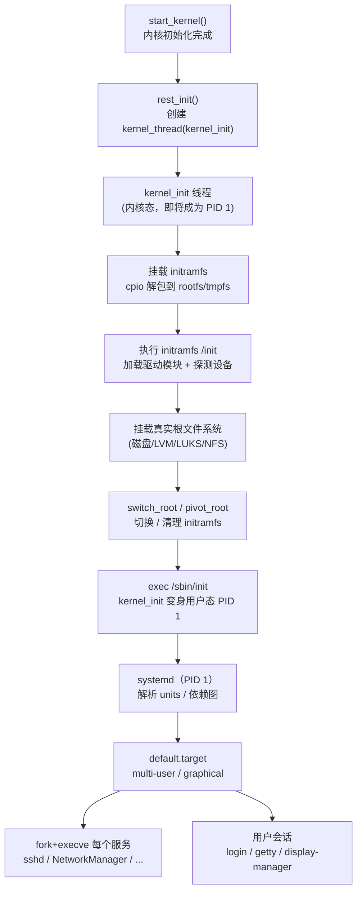

# OS启动（11）· init与systemd启动

## 概述与定位

> [!abstract] TL;DR
> 内核启动的最后一棒：`start_kernel` 完成内存/中断/调度等子系统初始化后，调用 `rest_init`，创建出系统中第一个用户态进程 **PID 1**。PID 1 先从 **initramfs**（cpio 临时根）起跑，加载必要驱动，挂载真实根文件系统，再通过 **`switch_root`** 交接控制权，最终执行 `/sbin/init`——在现代 Linux 上即 **systemd**。systemd 以 **unit + target** 取代 runlevel，基于依赖图**并行**拉起全部服务，是从内核到应用进程的最后一道"总协调员"。

本篇是系列第 11 篇，衔接上一篇 [[10.系统调用机制]]（syscall 入口）与下一篇 [[12.ELF程序的加载与执行]]（execve 内核侧）。init/systemd 的核心动作是 **`fork` + `execve`**——既是操作系统启动链的终点，也是每个应用进程诞生的起点。

---

## 原理与机制

### 整体流程



### PID 1 的诞生

内核 `rest_init`（`init/main.c`）做两件事：

1. `kernel_thread(kernel_init, NULL, CLONE_FS)` —— 创建 **PID 1** 的内核线程（此时仍在内核态执行 `kernel_init`）。
2. `kernel_thread(kthreadd, NULL, CLONE_FS|CLONE_FILES)` —— 创建 **PID 2** 的内核线程守护者（`kthreadd`，负责后续内核线程的创建）。

随后 `rest_init` 自身演变为 **idle 进程（PID 0）**，在 CPU 空闲时运行（`cpu_startup_entry(CPUHP_ONLINE)`）。

`kernel_init` 在内核态完成设备探测、文件系统挂载等收尾，最终调用 `run_init_process`（或 `execute_command`），通过 `execve` 跳入用户态的 `/sbin/init`——此后 PID 1 就是真正的**用户态 init 进程**。

```
PID 0  (idle/swapper)  — rest_init 遗留，永不退出
PID 1  (kernel_init → /sbin/init)  — 所有用户态进程的祖先
PID 2  (kthreadd)      — 所有内核线程的父
```

**PID 1 的两个特殊职责：**
- **孤儿收养**：任何进程的父进程退出后，子进程被 `reparent` 给 PID 1（现代 Linux 也支持 `prctl(PR_SET_CHILD_SUBREAPER, 1)` 指定次级收养者）。
- **`SIGCHLD` 处理**：负责 `waitpid` 收割僵尸进程，防止进程表泄漏。

---

## 结构详解

### initramfs：内核启动早期的临时根

**为什么需要 initramfs？**  
内核自身不内置所有存储控制器驱动（SCSI/NVMe/LVM/dm-crypt 等）。若真实根文件系统在这些设备上，内核就无法直接挂载——先用一个已包含必要驱动和工具的**临时根**，加载模块后再切换。

**格式：cpio 归档（可选 gzip/lz4/zstd 压缩）**

```
initramfs.img = cpio 归档（+ 压缩）
├── /init            ← 入口脚本（busybox sh 或 systemd-based initrd）
├── /bin/busybox     ← 精简 userland（ls/mount/modprobe/switch_root…）
├── /lib/modules/    ← 针对当前内核版本的驱动模块（.ko）
├── /etc/            ← 最小配置
└── /sbin/           ← 辅助工具
```

**内核如何加载 initramfs：**
- GRUB 将 initramfs 镜像地址/大小写入 boot protocol（`setup_header.ramdisk_image` / `ramdisk_size`）。
- 内核启动早期（`populate_rootfs()`）将 cpio 解包到 **rootfs**（内存文件系统，本质是 tmpfs），作为初始根 `/`。
- 内核随后直接 `execve("/init", ...)` 运行其中的 init 脚本——此时内核态 `kernel_init` 已进入用户态。

**查看 initramfs 内容：**

```bash
# lsinitramfs（Debian/Ubuntu）
lsinitramfs /boot/initrd.img-$(uname -r) | head -40

# 手动解包（先跳过可能存在的 microcode cpio 前缀）
cpio -it < /boot/initrd.img-$(uname -r) 2>/dev/null | head -40

# dracut 系统（RHEL/Fedora）
lsinitrd /boot/initramfs-$(uname -r).img | head -40
```

> [!warning] 示例输出为示意
> ```
> .
> usr
> usr/lib
> usr/lib/modules
> usr/lib/modules/6.8.0-45-generic
> usr/lib/modules/6.8.0-45-generic/kernel
> usr/lib/modules/6.8.0-45-generic/kernel/drivers/nvme
> bin
> bin/busybox
> init
> ```

---

### switch_root：切换到真实根

initramfs 的 `/init` 脚本完成驱动加载、设备探测、挂载真实根之后，执行 **`switch_root`**（busybox 提供的命令，也是 `util-linux` 的一部分）切换根目录：

**`switch_root` 的内部动作（C 实现核心）：**

```c
// 伪代码，简化自 util-linux switch_root.c
// 递归删除 initramfs 旧根文件以释放 tmpfs 内存
chdir(newroot);           // cd 到真实根
mount(newroot, "/", NULL, MS_MOVE, NULL);  // 把真实根移到 /
chroot(".");              // 更新根目录引用
execv(init, argv);        // exec /sbin/init（即 systemd）
```

关键步骤：
1. 递归删除/释放 initramfs 中所有文件（释放内存）。
2. 将真实根文件系统 `MS_MOVE` 挂载到 `/`。
3. `chroot(".")` 让当前进程的根切换到新位置。
4. `execve` 执行真实根上的 `/sbin/init`——PID 1 的**地址空间**被替换，但 PID 不变，仍是 1。

> 现代 `switch_root`（util-linux）用 `MS_MOVE` 把新根移到 `/` 再 `chroot(".")` 完成切换（早期曾用 `pivot_root`，因 rootfs/tmpfs 与目标常在同一挂载命名空间下 `pivot_root` 受限而改用 `MS_MOVE`）；容器运行时则直接用 `pivot_root`，因容器根与宿主根必在不同文件系统。

---

### SysV init vs systemd

#### 传统 SysV init

| 概念 | 说明 |
|---|---|
| 配置文件 | `/etc/inittab` |
| 运行级别 | 0 关机、1 单用户、2–5 多用户（发行版各异）、6 重启 |
| 服务脚本 | `/etc/rc?.d/` → 符号链接到 `/etc/init.d/` 脚本 |
| 启动顺序 | **串行**：`S01udev` → `S10network` → `S20sshd`…数字决定顺序 |
| 问题 | 慢（串行）；脚本复杂（shell）；无统一日志；无依赖跟踪 |

#### systemd

systemd 于 2010 年由 Lennart Poettering 发起，现为绝大多数 Linux 发行版的默认 init。**核心设计理念：所有系统资源都是 unit，依赖关系驱动并行启动。**

**systemd 作为 PID 1 的主要职责：**
- 并行激活 units，最大化启动并发度。
- 用 **cgroups** 管理每个服务的进程树（杀死服务时一并清理所有子进程）。
- 维护系统/服务日志（`journald`）。
- 管理 socket 激活（先绑定端口，需要时再启动服务）。
- 处理系统电源状态（关机/重启/休眠）。

---

### systemd Units

每个 unit 对应一个 **`.unit` 配置文件**，存放路径优先级（高→低）：

```
/etc/systemd/system/        ← 管理员自定义（最高优先级）
/run/systemd/system/        ← 运行时生成
/usr/lib/systemd/system/    ← 发行版默认（最低优先级）
```

**主要 unit 类型：**

| 类型 | 文件扩展名 | 说明 |
|---|---|---|
| Service | `.service` | 守护进程（最常用） |
| Target | `.target` | 同步点，取代 runlevel |
| Mount | `.mount` | 文件系统挂载点 |
| Socket | `.socket` | Socket 激活 |
| Timer | `.timer` | 定时任务（取代 cron） |
| Device | `.device` | udev 设备节点 |
| Path | `.path` | 文件/目录变化触发 |

**典型 `.service` 文件结构：**

```ini
# /usr/lib/systemd/system/sshd.service
[Unit]
Description=OpenSSH server daemon
After=network.target syslog.target
Wants=network.target

[Service]
Type=notify
ExecStart=/usr/sbin/sshd -D $OPTIONS
ExecReload=/bin/kill -HUP $MAINPID
Restart=on-failure
RestartSec=42s

[Install]
WantedBy=multi-user.target
```

**关键字段说明：**

| 字段 | 含义 |
|---|---|
| `After=` | 本 unit 启动前须已启动（顺序依赖，不是强制依赖） |
| `Requires=` | 强依赖：若依赖失败则本 unit 也失败 |
| `Wants=` | 弱依赖：依赖失败不影响本 unit |
| `WantedBy=` | 指定被哪个 target 拉入（`systemctl enable` 时创建软链接） |
| `Type=notify` | 服务通过 `sd_notify()` 通知 systemd 就绪 |

---

### Target：取代 runlevel

| SysV runlevel | systemd target | 说明 |
|---|---|---|
| 0 | `poweroff.target` | 关机 |
| 1 | `rescue.target` | 单用户救援模式 |
| 3 | `multi-user.target` | 多用户无图形界面 |
| 5 | `graphical.target` | 多用户 + 图形界面 |
| 6 | `reboot.target` | 重启 |

**启动目标选择：**

```bash
# 查看当前默认 target
systemctl get-default

# 切换默认 target（持久）
systemctl set-default multi-user.target

# 立即切换（临时）
systemctl isolate rescue.target
```

---

### cgroups：服务进程树管理

systemd 为每个 service 创建一个 **cgroup v2 slice**，将服务主进程及其所有子进程纳入同一个 cgroup：

```
/sys/fs/cgroup/
├── system.slice/
│   ├── sshd.service/       ← sshd + 所有 ssh 子进程
│   ├── NetworkManager.service/
│   └── ...
├── user.slice/
│   └── user-1000.slice/    ← 用户会话的全部进程
└── ...
```

**好处：**
- `systemctl stop sshd` 会 `cgroup.kill` 整颗子树，不遗漏孤儿进程。
- 可对每个服务设置 CPU/内存/IO 配额（`CPUQuota=`/`MemoryMax=`/`IOWeight=`）。
- 与 Linux 容器技术（Docker/containerd）共享同一套 cgroup 基础设施。

---

### 服务进程的诞生：fork + execve

systemd 拉起每个服务的动作，本质就是 [[12.ELF程序的加载与执行]] 中讲的 `execve` 内核路径：

```
systemd (PID 1)
  └─ fork()  ─────→  子进程（继承 PID 1 的 fd、环境等）
       └─ execve("/usr/sbin/sshd", argv, envp)
            └─ 内核 load_elf_binary()
                 └─ 解析 PT_LOAD → 映射段
                 └─ 若有 PT_INTERP → 启动 ld.so
                 └─ 建栈 + auxv（AT_PHDR/AT_ENTRY/AT_RANDOM）
                 └─ 跳入入口点 → sshd 开始运行
```

参见 [[12.ELF程序的加载与执行]] 的完整 `load_elf_binary` 流程，以及 [[14.动态链接与加载器详解/02.程序加载全景.md]] 中 ld.so 的动态链接过程。

---

## 实战 / 观察

### 查看 PID 1 信息

```bash
# 确认 PID 1 是 systemd
ps -p 1 -o pid,comm,args
# 或
cat /proc/1/comm
cat /proc/1/exe     # 软链接到 /usr/lib/systemd/systemd

# 查看 PID 1 的 cgroup
cat /proc/1/cgroup
```

> [!warning] 示例输出为示意
> ```
> $ ps -p 1 -o pid,comm,args
>   PID COMMAND         COMMAND
>     1 systemd         /usr/lib/systemd/systemd --switched-root --system --deserialize 31
> ```

---

### 分析启动时间

```bash
# 各服务启动耗时排名
systemd-analyze blame

# 关键路径（启动瓶颈）
systemd-analyze critical-chain

# 总启动时间
systemd-analyze
```

> [!warning] 示例输出为示意
> ```
> $ systemd-analyze
> Startup finished in 1.203s (kernel) + 3.741s (initrd) + 8.932s (userspace) = 13.876s
> graphical.target reached after 8.901s in userspace.
>
> $ systemd-analyze blame
>   4.201s NetworkManager-wait-online.service
>   1.837s plymouth-quit-wait.service
>   1.023s dev-sda1.device
>    802ms apt-daily-upgrade.service
>    ...
>
> $ systemd-analyze critical-chain
> graphical.target @8.901s
> └─multi-user.target @8.901s
>   └─NetworkManager-wait-online.service @4.698s +4.201s
>     └─NetworkManager.service @4.120s +573ms
>       └─dbus.service @3.201s +915ms
>         └─basic.target @3.199s
>           └─...
> ```

---

### 管理 units

```bash
# 列出所有 unit（含状态）
systemctl list-units
systemctl list-units --type=service --state=failed

# 查看服务状态（含最近日志）
systemctl status sshd

# 启动 / 停止 / 重载
systemctl start sshd
systemctl stop sshd
systemctl reload sshd

# 开机自启 / 禁用
systemctl enable sshd
systemctl disable sshd

# 查看 unit 依赖树
systemctl list-dependencies graphical.target
```

> [!warning] 示例输出为示意
> ```
> $ systemctl status sshd
> ● sshd.service - OpenSSH server daemon
>      Loaded: loaded (/usr/lib/systemd/system/sshd.service; enabled)
>      Active: active (running) since Mon 2026-06-30 08:00:01 CST; 2h 15min ago
>    Main PID: 1234 (sshd)
>     CGroup: /system.slice/sshd.service
>             └─1234 sshd: /usr/sbin/sshd -D
> ```

---

### 查看 initramfs 内容

```bash
# Ubuntu/Debian
lsinitramfs /boot/initrd.img-$(uname -r)

# RHEL/Fedora（dracut）
lsinitrd /boot/initramfs-$(uname -r).img

# 查看 initramfs 中的 init 脚本
lsinitramfs /boot/initrd.img-$(uname -r) | grep "^init$"
```

> [!warning] 示例输出为示意

---

### journald：统一日志

```bash
# 查看系统日志（最近 100 行）
journalctl -n 100

# 跟踪某服务日志
journalctl -u sshd -f

# 查看本次启动日志
journalctl -b

# 查看内核消息（替代 dmesg）
journalctl -k
```

---

## 安全性与正确使用

### initramfs 的攻击面

initramfs 在内核加载后、真实根挂载前以 **root 权限运行**，且内核无法验证其内容（除非开启 Secure Boot + shim 签名链）。

**风险：**
- initramfs 被篡改 → 在 `switch_root` 前执行任意代码，绕过磁盘加密、植入后门。
- 这是"Evil Maid Attack"（邪恶女仆攻击）的经典入口：物理接触设备后替换 initramfs。

**防御：**
- **Secure Boot + UKI（Unified Kernel Image）**：将内核 + initramfs + cmdline 打包为一个 PE 签名文件（`*.efi`），UEFI 验签，任何组件改动均使签名失效。
- **dm-verity**：用哈希树验证块设备完整性，即使 initramfs 不被篡改，真实根的完整性也有保障。
- **加密根（LUKS）+ Measured Boot**：TPM PCR 扩展度量 initramfs 哈希，解密密钥封装在 PCR 状态下，initramfs 被篡改则 PCR 值变化，密钥无法解封。

详见 [[13.可信启动与启动安全]]。

---

### systemd 服务沙箱

systemd 为 `.service` 提供了一套**内核级安全加固**选项，在 `[Service]` 段声明，本质上是对 Linux 安全 API（namespaces/seccomp/capabilities）的高级封装：

| 选项 | 机制 | 效果 |
|---|---|---|
| `ProtectSystem=strict` | bind-mount 只读 | `/usr`、`/etc` 等挂载为只读 |
| `ProtectHome=true` | bind-mount 空目录 | `/home`、`/root`、`/run/user` 不可见 |
| `NoNewPrivileges=true` | `prctl(PR_SET_NO_NEW_PRIVS)` | 禁止通过 setuid/setgid 提权 |
| `CapabilityBoundingSet=` | capabilities 裁剪 | 仅保留服务所需的最小 capabilities |
| `SystemCallFilter=` | seccomp 白名单 | 限制可用系统调用集合 |
| `PrivateTmp=true` | tmpfs + unshare | 独立 `/tmp`，不同服务互相隔离 |
| `PrivateNetwork=true` | network namespace | 完全隔离网络栈 |
| `DynamicUser=true` | 动态分配 UID/GID | 每次启动使用不同的临时 UID |
| `ReadOnlyPaths=` | bind-mount 只读 | 指定路径只读 |

**实战示例——查看服务的安全评分：**

```bash
# systemd 内置安全分析（systemd 249+）
systemd-analyze security sshd.service
```

> [!warning] 示例输出为示意
> ```
> $ systemd-analyze security sshd.service
> NAME                                DESCRIPTION                              EXPOSURE
> ✗ RootDirectory=/RootImage=         Service runs within the host's root dir  0.1
> ✗ SupplementaryGroups=              Service runs with supplementary groups    0.1
> ✓ NoNewPrivileges=                  Service cannot elevate privileges
> ✓ ProtectSystem=                    Service has limited write access...
> ...
> → Overall exposure level for sshd.service: 4.9 MEDIUM
> ```

---

### PID 1 的关键性——防御视角

PID 1 是**单点故障**：systemd 崩溃 → 内核触发 kernel panic（因为 PID 1 不可替代，其退出会使内核无法继续）。

**攻击者视角：**
- 若能以 root 权限写 `/lib/systemd/systemd`、`/etc/systemd/system/*.service`，可在服务启动时执行任意代码。
- systemd 的 `ExecStart=` 直接 `exec` 指定路径——保护这些路径完整性至关重要。

**防御：**
- 关键目录 immutable（`chattr +i`）或通过 dm-verity 保护。
- 使用 `ProtectSystem=strict` + `ReadOnlyPaths=` 限制服务的写权限。
- 监控 `/etc/systemd/system/` 的变更（auditd/inotify）。
- 容器场景：容器 PID 1 通常是应用本身（或 `tini`/`dumb-init`），需要处理 `SIGCHLD`，否则僵尸进程堆积。

---

## 小结

| 阶段 | 关键动作 | 技术 |
|---|---|---|
| PID 1 诞生 | `rest_init` → `kernel_thread(kernel_init)` | PID 1 是所有进程祖先 |
| 临时根 | 内核解包 initramfs（cpio） → `exec /init` | busybox + 驱动模块 |
| 切换根 | `switch_root`：移动挂载点 + `chroot` + `exec /sbin/init` | `MS_MOVE` + `chroot` |
| init 系统 | SysV 串行 vs systemd 并行（unit/target/cgroups） | 依赖图 + socket 激活 |
| 起服务 | `fork` + `execve` → `load_elf_binary` | 见第 12 篇 |
| 安全 | initramfs 签名（UKI）+ 服务沙箱（ProtectSystem 等）| Secure Boot + seccomp |

启动链到此完成了从内核到用户态的最后交接：内核把控制权给了 systemd，systemd 通过 `fork`+`execve` 给了每一个服务和应用进程。下一篇 [[12.ELF程序的加载与执行]] 将深入 `execve` 的内核侧——`load_elf_binary`、program header 解析、`PT_INTERP` 与动态链接器启动、`auxv` 构建。

---

## 相关阅读

- 下一棒（execve 内核侧）：[[12.ELF程序的加载与执行]]
- 上一棒（syscall 机制）：[[10.系统调用机制]]
- 内核启动早期（start_kernel 之前）：[[06.内核解压与早期初始化]]
- 可信启动（initramfs 签名、UKI、TPM）：[[13.可信启动与启动安全]]
- ELF 程序头（PT_LOAD/PT_INTERP）：[[11.ELF文件详解/03.程序头表.md]]
- 动态链接加载过程：[[14.动态链接与加载器详解/02.程序加载全景.md]]
- 进程地址空间：[[24.内存管理与堆分配器/02.进程地址空间与虚拟内存.md]]
- 安全防护机制：[[34.现代二进制防护机制/00.现代二进制防护机制总览.md]]

---

⬅️ 上一篇 [[10.系统调用机制]] ｜ 🏠 [[00.操作系统加载与启动总览]] ｜ 下一篇 [[12.ELF程序的加载与执行]] ➡️
