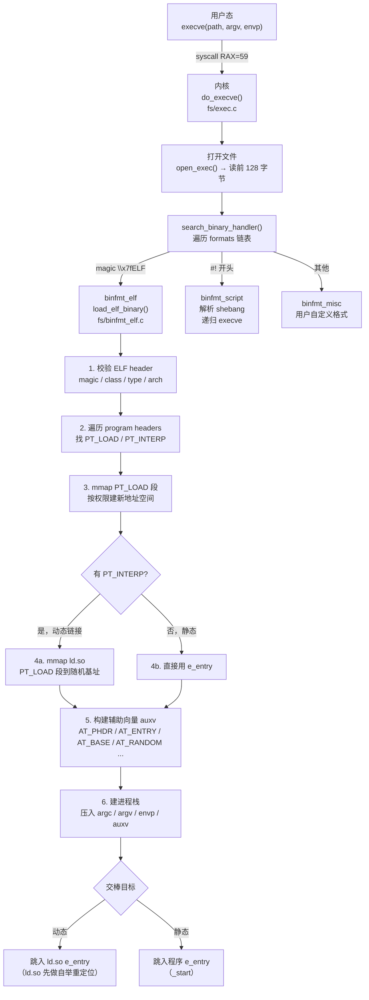

# OS启动（12）· ELF程序的加载与执行

## 概述与定位

> [!abstract] TL;DR
> - 用户执行一个程序，内核做了什么？答案是 `execve` 系统调用触发内核侧的 `load_elf_binary`，在不到一秒内完成：ELF 校验 → `PT_LOAD` 段 `mmap` 进新地址空间 → 若有 `PT_INTERP` 则把 `ld.so` 也映射进去 → 在栈顶构建 `argv/envp/auxv` → 跳入 `ld.so` 或直接跳入程序 `e_entry`。
> - **本篇聚焦内核侧（`load_elf_binary`）**，是"把 ELF 搬进内存并交棒"的那一棒。`ld.so` 接棒后做什么（重定位、延迟绑定）见 [[14.动态链接与加载器详解/02.程序加载全景.md]]；`_start → main` 的 C 运行时见 [[23.C_C++运行时与ABI/02.程序启动与crt0.md]]。
> - 核心数据结构：ELF 程序头表（`PT_LOAD` / `PT_INTERP`）、辅助向量（auxv）；核心内核代码：`fs/binfmt_elf.c`。
> - 逆向/观察入口：`readelf -l`、`LD_SHOW_AUXV=1`、`strace execve`、`/proc/<pid>/auxv`。

本章在系列中处于**进程与安全**板块（第 12 篇），承接第 11 篇（[[11.init与systemd启动]] 中 systemd 通过 `fork+execve` 启动服务/应用），向下衔接第 13 篇（[[13.可信启动与启动安全]]）。本篇描述的是启动接力赛的最后一棒交接：操作系统把一段静止在磁盘上的 ELF 文件，变成在内存中运行的进程。

### 边界声明

| 问题 | 由谁回答 |
|---|---|
| `ld.so` 如何自举、做重定位、延迟绑定 | [[14.动态链接与加载器详解/02.程序加载全景.md]] |
| `_start` 怎么调到 `main`、CRT 做了什么 | [[23.C_C++运行时与ABI/02.程序启动与crt0.md]] |
| `.interp` 节的格式 | [[11.ELF文件详解/03.程序头表.md]] |
| GOT/PLT 重定位机制 | [[11.ELF文件详解/17.got节.md]] |
| **本篇：内核如何把 ELF 搬进内存并交棒** | ← 这里 |

---

## 原理与机制

### execve 到 load_elf_binary 的完整调用链

当用户调用 `execve(path, argv, envp)` 时，内核执行以下关键路径（以 Linux x86-64 为基准）：



> 三条 binfmt 路径中，本篇只讲 `load_elf_binary`。`binfmt_script` 递归调用 `execve` 时用解释器路径（`#!/bin/bash`）替换原命令；`binfmt_misc` 由用户通过 `/proc/sys/fs/binfmt_misc` 注册自定义魔数/扩展名处理器（常用于 Java `.class`、Wine `.exe` 等）。

### 静态链接 vs 动态链接：两条路

`PT_INTERP` 是分叉点：

| 可执行类型 | `PT_INTERP` | 内核跳入 | 加载时间 |
|---|---|---|---|
| 动态链接（`ET_EXEC` / `ET_DYN` + 有依赖） | 有，如 `/lib64/ld-linux-x86-64.so.2` | `ld.so` 入口 | ld.so 做重定位后再跳 `_start` |
| 纯静态（`gcc -static`） | 无 | 直接 `e_entry`（`_start`） | 无 ld.so 介入 |
| 静态 PIE（`gcc -static-pie`） | 无，但类型为 `ET_DYN` | `e_entry`（程序自举重定位） | 无 ld.so，程序自含 RELATIVE 重定位处理 |

---

## 流程详解

### 步骤一：ELF 文件头校验

内核读取文件的前 128 字节（`linux/exec.h` 中 `BINPRM_BUF_SIZE`），由 `load_elf_binary` 校验以下字段：

| 字段 | 偏移 | 期望值 | 说明 |
|---|---|---|---|
| `e_ident[0..3]` | `0x00` | `\x7fELF` | 魔数，不匹配则拒绝 |
| `e_ident[EI_CLASS]` | `0x04` | `ELFCLASS64`（= 2）| 64 位或 32 位 |
| `e_ident[EI_DATA]` | `0x05` | `ELFDATA2LSB`（= 1）| 小端（x86-64） |
| `e_ident[EI_VERSION]`| `0x06` | `1` | ELF 版本 1 |
| `e_type` | `0x10` | `ET_EXEC`（2）或 `ET_DYN`（3） | 可执行或 PIE |
| `e_machine` | `0x12` | `EM_X86_64`（= 62）| 目标架构 |
| `e_version` | `0x14` | `1` | 版本 |
| `e_entry` | `0x18` | 入口虚拟地址 | 程序 `_start`（静态时直接跳） |
| `e_phoff` | `0x20` | program header 表偏移 | 用来读 PT_LOAD 等 |
| `e_phnum` | `0x38` | program header 条目数 | 遍历次数 |

校验失败时，`search_binary_handler` 继续尝试其他 binfmt 处理器；如果都失败，`execve` 返回 `ENOEXEC`。

### 步骤二：遍历 Program Header，提取 PT_LOAD 和 PT_INTERP

内核从 `e_phoff` 读出完整的程序头表（`Elf64_Phdr` 数组），依次扫描：

```
for each Phdr in program_headers:
    if type == PT_LOAD:
        记录到 loads[] 列表（稍后 mmap）
    if type == PT_INTERP:
        读出路径字符串（如 "/lib64/ld-linux-x86-64.so.2"）
    if type == PT_PHDR:
        记录程序头表本身在内存中的地址（传入 auxv AT_PHDR）
    if type == PT_GNU_STACK:
        检查是否需要可执行栈（NX/W^X 策略）
```

`Elf64_Phdr` 的关键字段：

```
typedef struct {
    Elf64_Word  p_type;    /* PT_LOAD=1, PT_INTERP=3, ... */
    Elf64_Word  p_flags;   /* PF_X=1, PF_W=2, PF_R=4 */
    Elf64_Off   p_offset;  /* 在文件中的偏移 */
    Elf64_Addr  p_vaddr;   /* 期望映射到的虚拟地址 */
    Elf64_Addr  p_paddr;   /* 物理地址（用户态通常忽略）*/
    Elf64_Xword p_filesz;  /* 文件中的字节数 */
    Elf64_Xword p_memsz;   /* 内存中的字节数（>= p_filesz，多出的 .bss） */
    Elf64_Xword p_align;   /* 对齐要求（通常 0x1000 = 4KB） */
} Elf64_Phdr;
```

### 步骤三：PT_LOAD 段 mmap 进新地址空间

内核在 `flush_old_exec()` 之后建立新的地址空间（此时旧进程映像被清除，execve 不可逆），对每个 `PT_LOAD` 段调用 `mmap`：

```c
/* 内核伪代码（简化自 fs/binfmt_elf.c: elf_map()） */
vaddr_aligned  = p_vaddr  & ~(PAGE_SIZE - 1);
offset_aligned = p_offset & ~(PAGE_SIZE - 1);
map_size = p_memsz + (p_vaddr - vaddr_aligned);

/* 主映射：文件内容 */
mmap(load_bias + vaddr_aligned,
     map_size,
     prot_from_flags(p_flags),   /* PF_R→PROT_READ, PF_W→PROT_WRITE, PF_X→PROT_EXEC */
     MAP_PRIVATE | MAP_FIXED,
     fd, offset_aligned);

/* BSS 尾部（p_memsz > p_filesz 的部分）：匿名零页 */
if (p_memsz > p_filesz) {
    bss_start = load_bias + p_vaddr + p_filesz;
    mmap(bss_start & ~(PAGE_SIZE-1),
         p_memsz - p_filesz + PAGE_SIZE,
         PROT_READ | PROT_WRITE,
         MAP_PRIVATE | MAP_FIXED | MAP_ANONYMOUS,
         -1, 0);
}
```

**load_bias（加载偏移）**：
- `ET_EXEC`（非 PIE）：`load_bias = 0`，段被映射到 ELF 文件指定的固定虚拟地址（通常代码从 `0x400000` 起）。
- `ET_DYN`（PIE）：内核选择一个随机基址（受 ASLR 控制），`load_bias = random_base - first_PT_LOAD.p_vaddr`，所有段在此基础上偏移。

典型的 PT_LOAD 布局（以一个简单动态链接程序为例）：

```
PT_LOAD  [0]  offset=0x000000  vaddr=0x000000  size=0x3e8   flags=R     → .text 前的元数据
PT_LOAD  [1]  offset=0x001000  vaddr=0x001000  size=0x10a   flags=R E   → .text（可读可执行）
PT_LOAD  [2]  offset=0x002000  vaddr=0x002000  size=0x0c4   flags=R     → .rodata（只读数据）
PT_LOAD  [3]  offset=0x002e10  vaddr=0x003e10  size=0x230   flags=R W   → .data/.bss（可读可写）
```

> [!note] W^X 原则
> 正确编译的程序中，代码段（`R E`，`PF_R|PF_X`）与数据段（`R W`，`PF_R|PF_W`）从不同时具有 W 和 X 权限。内核在 `mmap` 时严格按 `p_flags` 设置内存保护位，若程序头声明一个 `RWX` 段（`PF_R|PF_W|PF_X`），Linux 默认接受但会触发 `W^X` 违规警告（取决于内核配置）；在安全加固系统中这可能导致拒绝加载。

### 步骤四a：PT_INTERP → 映射 ld.so

若发现 `PT_INTERP`，内核执行额外的加载序列：

1. `open` 解释器文件（路径来自 `.interp` 节，如 `/lib64/ld-linux-x86-64.so.2`）；
2. 读并校验 ld.so 自身的 ELF 头（它是 `ET_DYN` 类型）；
3. 对 ld.so 的所有 `PT_LOAD` 段同样调用 `mmap`，基址由内核随机选择（ASLR），记录为 `interp_load_addr`；
4. 真正的入口 `start_point = ld.so.e_entry + interp_load_addr`（即跳入 ld.so，而非程序自身 `e_entry`）；
5. `interp_load_addr` 将通过 `AT_BASE` 传入 auxv，供 ld.so 自举重定位使用。

### 步骤四b：纯静态路径

无 `PT_INTERP` 时，入口直接为：
```
start_point = load_bias + e_entry    /* e_entry 是 _start 的相对/绝对 VA */
```

内核跳入后，由 crt0（`_start`）接管，无需任何动态链接器介入。

### 步骤五：建立初始栈与辅助向量（auxv）

这是内核和用户态（ld.so/程序）之间的**数据契约**。内核在新进程栈顶按如下布局从高地址向低地址压入数据：

```
高地址（栈底）
┌─────────────────────────────────┐
│ 环境变量字符串（\0 分隔的字符）    │
│ 命令行参数字符串（\0 分隔的字符）  │
│ execfn 字符串（可执行路径）        │
│ 随机字节（16 字节，AT_RANDOM 种子）│
├─────────────────────────────────┤
│ AT_NULL  (0, 0)                 │  ← auxv 结束标志
│ AT_EXECFN (addr)                │  ← 可执行文件路径字符串地址
│ AT_RANDOM (addr)                │  ← 16 字节随机种子的地址
│ AT_PAGESZ (4096)                │  ← 系统页大小
│ AT_BASE   (ld.so 基址)          │  ← ld.so 加载到的随机基址
│ AT_ENTRY  (_start 地址)         │  ← 程序真实入口（ld.so 最终跳此）
│ AT_PHNUM  (N)                   │  ← 程序头条目数
│ AT_PHENT  (56)                  │  ← sizeof(Elf64_Phdr)
│ AT_PHDR   (phdr 内存地址)       │  ← 程序头表在内存中的地址
│ AT_FLAGS  (0)                   │
│ AT_HWCAP  (CPU 特性掩码)        │
│ AT_SYSINFO_EHDR (vDSO 页地址)  │
├─────────────────────────────────┤
│ envp[n]   = NULL                │  ← envp 以 NULL 结尾
│ envp[n-1] ...                   │
│ envp[0]                         │
│ argv[argc]= NULL                │  ← argv 以 NULL 结尾
│ argv[argc-1] ...                │
│ argv[0]                         │
│ argc      (整数)                 │
└─────────────────────────────────┘
低地址（RSP 指向这里，ld.so/程序启动时读）
```

**关键 auxv 条目用途**：

| 标签 | 典型值/含义 | 谁使用 |
|---|---|---|
| `AT_PHDR` | 主程序程序头表的内存地址 | ld.so 用来找 `PT_DYNAMIC`，无需重新 `open` 文件 |
| `AT_PHENT` | `sizeof(Elf64_Phdr)` = 56 | ld.so 遍历程序头时步长 |
| `AT_PHNUM` | 程序头条目数 | ld.so 知道遍历边界 |
| `AT_BASE` | ld.so 被映射到的随机基址 | ld.so 自举：计算自身 RELATIVE 重定位的 addend |
| `AT_ENTRY` | 主程序 `_start` 的虚拟地址 | ld.so 完成所有初始化后跳此 |
| `AT_RANDOM` | 栈上 16 字节随机数的地址 | `__libc_start_main` 用来初始化栈 canary、ASLR 种子 |
| `AT_EXECFN` | 可执行文件路径字符串地址 | `glibc` 暴露为 `/proc/self/exe` 的备用来源 |
| `AT_PAGESZ` | 4096（或大页场景下 2MB） | ld.so / glibc 判断页对齐粒度 |
| `AT_SYSINFO_EHDR` | vDSO 映射页的地址 | glibc 用来加速 `gettimeofday` 等调用 |
| `AT_HWCAP` / `AT_HWCAP2` | CPU 特性位掩码 | glibc ifunc 选择最优实现（AVX2 等） |

auxv 以 `{AT_NULL, 0}` 对终止。ld.so 启动时从 RSP 向上扫描栈，解析整个结构，是**内核和用户态之间的隐形数据管道**。

### 步骤六：设置寄存器并跳入入口

```c
/* 内核伪代码：start_thread()（arch/x86/kernel/process_64.c 简化） */
regs->ip  = start_point;   /* 动态：ld.so e_entry；静态：程序 e_entry */
regs->sp  = sp;            /* 指向 argc（栈顶）*/
regs->flags = X86_EFLAGS_FIXED;  /* = 0x2，bit1 恒为 1；IF 由内核返回用户态时（sysretq/iretq）自动开启，使新进程可被中断/响应信号 */
/* 其余通用寄存器（rax/rbx/rcx 等）由内核清零或留为 0 */
```

从此刻起，CPU 在用户态从 `start_point` 开始执行。旧进程映像已被清除，新进程地址空间完全由 `PT_LOAD` 的 mmap 建立。

---

## 实战 / 观察

> [!warning] 示例输出为示意
> 本节所有命令输出均为**代表性示意**，非本机实跑。地址、偏移、段大小随编译器、链接器版本、ASLR 而变，切勿据此断言任何真实运行期数值。

### 1. readelf -l：查看 Program Headers

```bash
readelf -l /bin/cat
```

```text
# 示例输出（代表性，非本机实跑）
Elf file type is DYN (Position-Independent Executable file)
Entry point 0x3e90
There are 13 program headers, starting at offset 64

Program Headers:
  Type           Offset   VirtAddr           PhysAddr
                 FileSiz  MemSiz             Flags  Align
  PHDR           0x000040 0x0000000000000040 0x0000000000000040
                 0x0002d8 0x0000000000000040  R      0x8
  INTERP         0x000318 0x0000000000000318 0x0000000000000318
                 0x00001c 0x000000000000001c  R      0x1
      [Requesting program interpreter: /lib64/ld-linux-x86-64.so.2]
  LOAD           0x000000 0x0000000000000000 0x0000000000000000
                 0x0019e8 0x0000000000001350  R      0x1000
  LOAD           0x002000 0x0000000000002000 0x0000000000002000
                 0x005f61 0x0000000000005f61  R E    0x1000
  LOAD           0x008000 0x0000000000008000 0x0000000000008000
                 0x0021e4 0x00000000000021e4  R      0x1000
  LOAD           0x00ae10 0x000000000000be10 0x000000000000be10
                 0x000608 0x0000000000000668  RW     0x1000
  GNU_RELRO      0x00ae10 0x000000000000be10 0x000000000000be10
                 0x0001f0 0x00000000000001f0  R      0x1
  GNU_STACK      0x000000 0x0000000000000000 0x0000000000000000
                 0x000000 0x0000000000000000  RW     0x10
```

> [!warning] 示例输出为示意
> 注意 `Flags = R E`（代码段，可读可执行）和 `R W`（数据段，可读可写）——二者不交叉，这就是 W^X。`INTERP` 行的路径告诉内核要加载 ld.so。`GNU_STACK` 的 `Flags = RW`（无 X）表示栈非可执行，这是 NX 的 ELF 侧标记。

### 2. LD_SHOW_AUXV=1：观察辅助向量

```bash
LD_SHOW_AUXV=1 /bin/true 2>&1
```

```text
# 示例输出（代表性，非本机实跑）
AT_SYSINFO_EHDR:      0x7fff9a000000
AT_HWCAP:             178bfbff
AT_PAGESZ:            4096
AT_CLKTCK:            100
AT_PHDR:              0x55e4b2400040
AT_PHENT:             56
AT_PHNUM:             13
AT_BASE:              0x7f8c12e00000
AT_FLAGS:             0x0
AT_ENTRY:             0x55e4b2403e90
AT_UID:               1000
AT_EUID:              1000
AT_GID:               1000
AT_EGID:              1000
AT_SECURE:            0
AT_RANDOM:            0x7ffd12345678
AT_HWCAP2:            0x2
AT_EXECFN:            /usr/bin/true
AT_PLATFORM:          x86_64
```

> [!warning] 示例输出为示意
> `AT_BASE` 是 ld.so 被映射到的随机基址（每次运行不同）；`AT_ENTRY` 是 `_start` 的最终虚拟地址（PIE 场景下也随 ASLR 变化）；`AT_RANDOM` 指向内核在栈上放置的 16 字节随机数，`__libc_start_main` 从这里读栈 canary 初始值。

### 3. /proc/\<pid\>/auxv：进程运行时读辅助向量

```bash
# 启动一个长时间运行的进程
sleep 100 &
PID=$!

# 用 xxd/od 读 auxv（二进制，每项 16 字节：8字节 key + 8字节 value）
od -t x8 /proc/$PID/auxv | head -20
# 或用 Python 解析
python3 -c "
import struct, sys
data = open('/proc/$PID/auxv', 'rb').read()
for i in range(0, len(data), 16):
    k, v = struct.unpack_from('QQ', data, i)
    if k == 0: break
    print(f'AT_{k}  0x{v:016x}')
"
```

```text
# 示例输出（代表性，非本机实跑）
AT_33  0x7fff9a000000    # AT_SYSINFO_EHDR (vDSO)
AT_16  0x178bfbff        # AT_HWCAP
AT_6   0x1000            # AT_PAGESZ = 4096
AT_3   0x55e4b2400040    # AT_PHDR
AT_4   0x38              # AT_PHENT = 56
AT_5   0xd               # AT_PHNUM = 13
AT_7   0x7f8c12e00000    # AT_BASE (ld.so 基址)
AT_9   0x55e4b2403e90    # AT_ENTRY (_start)
AT_25  0x7ffd12345678    # AT_RANDOM
```

> [!warning] 示例输出为示意

### 4. strace execve：跟踪系统调用与内核 mmap

```bash
strace -e trace=execve,mmap,mprotect -f ./hello 2>&1 | head -40
```

```text
# 示例输出（代表性，非本机实跑）
execve("./hello", ["./hello"], 0x7ffdc... /* 23 vars */) = 0
mmap(NULL, 8192, PROT_READ|PROT_WRITE, MAP_PRIVATE|MAP_ANONYMOUS, -1, 0) = 0x7f...
mmap(0x7f..., 212992, PROT_READ, MAP_PRIVATE|MAP_FIXED|MAP_DENYWRITE, 3, 0) = 0x7f...
mmap(0x7f..., 163840, PROT_READ|PROT_EXEC, MAP_PRIVATE|MAP_FIXED|MAP_DENYWRITE, 3, 0x3b000) = 0x7f...
mprotect(0x7f..., 4096, PROT_NONE) = 0
mmap(0x7f..., 8192, PROT_READ|PROT_WRITE, MAP_PRIVATE|MAP_FIXED|MAP_DENYWRITE, 3, 0x1bf000) = 0x7f...
mmap(0x7f..., 32768, PROT_READ|PROT_WRITE, MAP_PRIVATE|MAP_FIXED|MAP_ANONYMOUS, -1, 0) = 0x7f...
```

> [!warning] 示例输出为示意
> `execve` 返回 `0` 意味着内核切换了地址空间，之后所有的 `mmap` 是 ld.so 在用户态映射依赖库（strace 因为 `-f` 跟随子进程）。`PROT_READ|PROT_EXEC` 对应代码段，`PROT_READ|PROT_WRITE` 对应数据段。

### 5. GDB 在 load_elf_binary 设断点（内核调试）

```bash
# 在 QEMU + GDB 内核调试环境中
(gdb) break load_elf_binary
(gdb) continue
# 触发 execve 后内核在此暂停

# 查看当前程序头指针
(gdb) info reg rdi      # 通常指向 linux_binprm 结构体
(gdb) print ((struct linux_binprm*)$rdi)->filename
```

> [!warning] 示例输出为示意
> 内核调试需 QEMU `-s -S` + 本地 `gdb vmlinux`。生产机器上 `kprobe` 可以非侵入式观察 `load_elf_binary` 的调用。

---

## 安全性与正确使用

### ASLR / PIE：随机化加载基址

**ASLR（Address Space Layout Randomization）** 由内核在 `load_elf_binary` 的 `mmap` 阶段实施：

- **`ET_DYN` 可执行（PIE）**：内核选择随机 `load_bias`，使整个程序映射到不可预测的地址。
- **`ET_EXEC`（非 PIE）**：程序被映射到固定地址（如 `0x400000`），ASLR 仅影响栈、堆、共享库。
- **影响**：即使存在内存漏洞，攻击者也无法提前知道 `system()`、shellcode 等目标地址，降低利用成功率。

```bash
# 检查可执行文件是否为 PIE（ET_DYN）
readelf -h ./binary | grep Type
# PIE 输出：Type: DYN (Position-Independent Executable file)
# 非PIE输出：Type: EXEC (Executable file)

# 检查系统 ASLR 级别
cat /proc/sys/kernel/randomize_va_space
# 0=禁用, 1=部分（栈/库）, 2=完全（含堆）
```

> [!warning] 示例输出为示意

### AT_RANDOM 与栈 Canary

`AT_RANDOM` 并非随机数本身，而是内核在栈上放置的 16 字节随机种子的**地址**：

```
auxv 中 AT_RANDOM = 0x7ffd12345678
         ↓
内存地址 0x7ffd12345678 处存储 16 字节随机数（内核在 setup_arg_pages 时写入）
         ↓
__libc_start_main 读取这 16 字节，用前 8 字节初始化 %fs:0x28（TLS 中的 stack_guard）
         ↓
函数序言（prologue）：mov %fs:0x28, %rax; mov %rax, -0x8(%rbp)  → 压入栈帧
函数尾声（epilogue）：xor %fs:0x28 比对 → 不匹配则 __stack_chk_fail() → 终止
```

这就是 GCC `-fstack-protector` 机制的随机种子来源——其安全性完全依赖内核提供的 `AT_RANDOM`，而 `AT_RANDOM` 每次 `execve` 都不同。

### W^X：可执行段权限隔离

内核在 `mmap` PT_LOAD 段时按 `p_flags` 设置内存保护：

| `p_flags` | `mmap prot` | 含义 |
|---|---|---|
| `PF_R` | `PROT_READ` | 只读数据（`.rodata`） |
| `PF_R\|PF_X` | `PROT_READ\|PROT_EXEC` | 代码段（`.text`） |
| `PF_R\|PF_W` | `PROT_READ\|PROT_WRITE` | 数据/BSS/GOT 段 |
| `PF_R\|PF_W\|PF_X` | — | 安全加固系统拒绝或警告 |

W^X（Write XOR eXecute）原则：任何内存区域不能同时可写和可执行。违反 W^X 意味着攻击者若能向该区域写入 shellcode，就能直接执行——这正是 NX（No-eXecute）位（PTE bit 63 = NX）在硬件层面防止的。

```bash
# 检查各段权限（Flg 列）
readelf -l ./binary | grep -A1 LOAD

# 检查是否启用 NX（Non-Executable stack）
readelf -l ./binary | grep GNU_STACK
# 安全程序应输出 Flags = RW（无 E），表示栈不可执行
```

> [!warning] 示例输出为示意

### PIE + Full RELRO 的组合防御

| 防御措施 | 实现层 | 作用 |
|---|---|---|
| PIE / ASLR | 内核 `load_elf_binary` 的随机 load_bias | 随机化所有 VMA 基址，让 GOT/PLT 地址不可预测 |
| NX（栈/堆不可执行） | PTE NX 位 + `GNU_STACK` 程序头 | 防止将 shellcode 注入数据区后直接执行 |
| Full RELRO | ld.so 加载后 `mprotect(.got, PROT_READ)` | GOT 只读化，从根本上阻断 GOT 改写攻击 |
| 栈 Canary | `AT_RANDOM` + `__stack_chk_fail` | 检测栈溢出覆盖返回地址 |
| CFI（控制流完整性） | 编译器插桩（`-fsanitize=cfi`）| 限制间接调用/跳转目标，防御 ROP |

> [!tip] 可用 `checksec` 工具一键检查二进制的防御配置（输出含 PIE、RELRO、Stack Canary、NX）。

### setuid execve 的安全处理

当被执行的 ELF 文件设置了 **setuid**（SUID，`chmod u+s`）或 **setgid**（SGID，`chmod g+s`）位时，`execve` 触发一系列额外的权限变换逻辑，是 Unix 权限模型中**用户态→内核态权限边界**最关键的检查点。

#### AT_SECURE 与 bprm->secureexec

内核在 `load_elf_binary` 开始时，通过 `bprm_fill_uid()` 检测可执行文件的 SUID/SGID 位与当前进程凭证（credentials），决定是否进入**安全执行（secureexec）**模式：

```c
/* fs/exec.c: bprm_fill_uid()（简化） */
static void bprm_fill_uid(struct linux_binprm *bprm, struct file *file)
{
    struct inode *inode = file_inode(file);
    uid_t uid;
    gid_t gid;

    /* 只有在磁盘文件（非 memfd/匿名）、且挂载点允许 SUID 时才生效 */
    if (bprm->file->f_path.mnt->mnt_flags & MNT_NOSUID)
        return;

    if (inode->i_mode & S_ISUID) {           /* 文件有 SUID 位 */
        bprm->cred->euid = inode->i_uid;     /* 有效 UID 设为文件所有者 UID */
    }
    if ((inode->i_mode & (S_ISGID | S_IXGRP)) == (S_ISGID | S_IXGRP)) {
        bprm->cred->egid = inode->i_gid;     /* 有效 GID 设为文件所属组 GID */
    }

    /* 若 euid/egid 发生了变化（即真正触发了 SUID/SGID 提权），标记 secureexec */
    if (!uid_eq(bprm->cred->euid, current_euid()) ||
        !gid_eq(bprm->cred->egid, current_egid())) {
        bprm->secureexec = 1;
    }
}
```

`bprm->secureexec = 1` 的直接后果：

1. **`AT_SECURE = 1` 写入辅助向量（auxv）**：内核在构建 auxv 时若 `secureexec` 为真，则将 `AT_SECURE` 项的值设为 `1`（而非普通进程的 `0`）。glibc/ld.so 在自举时检查 `AT_SECURE`，据此决定是否清理危险环境变量。

2. **危险环境变量被清除**：glibc 的 ld.so（`sysdeps/generic/dl-sysdep.c`）在 `AT_SECURE=1` 时扫描 `envp` 数组，删除以下可影响动态链接器行为的敏感变量：

| 变量 | 危险原因 |
|---|---|
| `LD_PRELOAD` | 允许注入任意 `.so`，在特权程序里执行攻击者代码 |
| `LD_LIBRARY_PATH` | 替换库搜索路径，劫持 `libc.so` 等系统库加载 |
| `LD_AUDIT` | 挂载 rtld-audit 钩子，全程监控/篡改符号解析 |
| `LD_DEBUG` | 泄露加载信息，辅助攻击者分析 |
| `LD_PROFILE` | 注入 profiling 代码 |
| `GCONV_PATH` | 替换字符集转换模块路径，劫持 `iconv` |
| `GETCONF_DIR` | 替换 `getconf` 配置搜索路径 |
| `LOCPATH` / `NLSPATH` | 替换本地化文件路径，可能引发格式字符串注入 |

> [!important]
> 环境变量的清除由**用户态 ld.so** 而非内核完成，内核只负责在 auxv 中置 `AT_SECURE=1`。这意味着**静态链接的 setuid 程序不会自动清除危险环境变量**——需要程序自己调用 `clearenv()` 或手动过滤 `envp`（这是静态 setuid 程序的经典安全陷阱）。

#### Linux capabilities 在 execve 的变换

现代 Linux 权限模型不再依赖 SUID-root 的"全有或全无"机制，而是通过 **capabilities** 将超级用户权限细分为约 40 种独立能力（`CAP_NET_BIND_SERVICE`、`CAP_SYS_PTRACE`、`CAP_DAC_OVERRIDE` 等）。

每个进程维护三个 capabilities 集合，execve 时按以下规则变换：

**三个集合定义：**

| 集合 | 含义 |
|---|---|
| **Permitted（P）** | 进程**可以拥有**的 capabilities 上限；不能超出此集合获得新能力 |
| **Effective（E）** | 进程**当前激活**的 capabilities；内核检查权限时使用此集合 |
| **Inheritable（I）** | 可通过 `execve` **继承**给子进程的 capabilities |

额外还有：
- **Bounding Set（B）**：进程 capabilities 的硬上限，限制 Permitted 集合的最大范围（只能减小，无法扩大）
- **Ambient Set（A）**（Linux 4.3+）：非特权进程也可在 execve 时保留某些 capabilities

**execve 时的 capabilities 变换规则（RFC 2.6+ 规范）：**

```
设：
  P' = 新进程的 Permitted
  E' = 新进程的 Effective
  I' = 新进程的 Inheritable
  A' = 新进程的 Ambient
  
  P  = execve 前进程的 Permitted
  I  = execve 前进程的 Inheritable
  A  = execve 前进程的 Ambient
  B  = Bounding Set（不随 execve 变化，除非显式 cap_bset_drop）
  
  fP = 文件 Permitted 集合（存储在文件的 xattr security.capability 中）
  fI = 文件 Inheritable 集合
  fE = 文件 Effective 位（1位，1=所有 fP 自动进入 E'）

变换公式：
  P' = (fP & B) | (fI & I) | A         ← 新 Permitted
  I' = I                               ← Inheritable 不变
  E' = (fE ? P' : A)                  ← fE=1 时全量激活；否则仅 Ambient
  A' = (secureexec ? 0 : A)           ← SUID/secureexec 时清除 Ambient！
```

> [!warning] secureexec 对 Ambient 的影响
> 若 `secureexec=1`（即触发了 SUID/SGID 或文件 capabilities），**Ambient set 被清零**（`A'=0`）。这是一个关键的安全约束：阻止攻击者通过给自己进程设置 Ambient capabilities，再 execve 一个 setuid 程序来"携带"额外权限。

**实际场景示例：**

```bash
# 场景1：普通用户执行 /bin/ping（传统用 SUID root 实现）
# 现代 Linux 改用 file capabilities：
getcap /bin/ping
# /bin/ping cap_net_raw=ep   ← fP={CAP_NET_RAW}, fE=1（ep = effective permitted）
# 执行后：P' = fP & B = {CAP_NET_RAW}，E' = P'（fE=1）
# 结论：ping 获得 CAP_NET_RAW（发原始套接字），无需 root

# 场景2：sudo（传统 SUID root）
# /usr/bin/sudo 有 SUID bit，文件所有者为 root（uid=0）
# execve 后：euid 变为 0，AT_SECURE=1，LD_PRELOAD 被清除
# sudo 自身验证用户密码后用 setresuid(0,0,0) 建立 root 进程

# 查看当前进程的 capabilities
cat /proc/self/status | grep Cap
# CapPrm: 0000000000000000    ← Permitted（十六进制位掩码）
# CapEff: 0000000000000000    ← Effective
# CapInh: 0000000000000000    ← Inheritable
# CapBnd: 000001ffffffffff    ← Bounding Set（允许的最大集合）
# CapAmb: 0000000000000000    ← Ambient

# 解码 capabilities 掩码
capsh --decode=0x000001ffffffffff
```

```text
# 示例输出（示意）
/bin/ping = cap_net_raw+ep
# capsh 解码：
0x000001ffffffffff = cap_chown,cap_dac_override,...,cap_net_raw,...
```

> [!warning] 示例输出为示意

**内核代码路径（capabilities 变换）：**

```
execve
└── do_execveat_common()
      └── bprm_creds_from_file()      ← 读文件 xattr，计算新 capabilities
            ├── get_file_caps()        ← 从 security.capability xattr 读 fP/fI/fE
            ├── cap_bprm_set_creds()   ← 按公式计算 P'/E'/I'/A'
            └── security_bprm_set_creds()  ← LSM（SELinux/AppArmor）额外检查
      └── commit_creds(new_cred)       ← 原子替换进程凭证，权限变换正式生效
```

#### setuid 的安全编程要点

| 陷阱 | 正确做法 |
|---|---|
| setuid 程序 `system("cmd")` | 危险：shell 继承了提权后的 euid；应用 `setresuid(uid,uid,uid)` 丢弃特权后再 `exec` |
| 依赖 `LD_PRELOAD` 不存在 | 静态链接程序需自行 `clearenv()` 或白名单过滤 `envp` |
| 以为 `setuid(getuid())` 足够 | 需用 `setresuid(uid,uid,uid)` 三值全设，否则 saved-UID 仍为 root，可通过 `setuid(0)` 恢复 |
| 在 setuid 程序中 `ptrace` 或 `/proc/self/mem` | 内核在 `AT_SECURE=1` 后对 ptrace、`/proc/<pid>/mem` 施加额外限制（`PTRACE_MODE_FSCREDS` 检查） |
| 依赖 `CAP_SETUID` 滥用 | 最小特权原则：只赋予实际需要的 capability（用 `setcap` 而非 SUID root） |

> [!tip] 最小权限：用 file capabilities 替代 SUID root
> `setcap cap_net_bind_service+ep /usr/bin/myserver` 让程序绑定 <1024 端口，而无需成为 root。相比 SUID root，文件 capabilities 精准授权，攻击面远小于赋予完整 root 权限。现代 Linux 发行版正逐步将传统 SUID root 程序迁移到 file capabilities。

### binfmt_misc 安全含义

通过 `/proc/sys/fs/binfmt_misc` 注册自定义格式（如 `.exe` 走 Wine、`.class` 走 JVM）时，内核允许任意用户态程序作为"解释器"来处理特定文件类型。若注册的解释器路径指向可被攻击者控制的程序，可能导致权限提升（Privilege Escalation）。建议仅在受信环境下启用 binfmt_misc，并定期审查 `/proc/sys/fs/binfmt_misc/` 下的条目。

---

## 小结

1. **execve 触发内核切换**：`execve(path, argv, envp)` 是不可逆的——调用成功后旧映像被销毁，新的地址空间骨架由 `load_elf_binary` 建立。
2. **校验 ELF 头是第一道防线**：魔数 `\x7fELF`、`e_type`（`ET_EXEC`/`ET_DYN`）、`e_machine` 等字段决定内核是否接受该文件并分派给 `binfmt_elf`。
3. **PT_LOAD 决定地址空间骨架**：每个 `PT_LOAD` 段对应一次 `mmap`，代码段 `R E`、数据段 `R W`、BSS 匿名零页——进程地址空间的骨架完全由这几次 `mmap` 构成。
4. **PT_INTERP 是动态/静态的分叉点**：有 `PT_INTERP` → ld.so 先接棒做重定位（见 [[14.动态链接与加载器详解/02.程序加载全景.md]]）；无 `PT_INTERP` → 直接进入 `_start`（见 [[23.C_C++运行时与ABI/02.程序启动与crt0.md]]）。
5. **auxv 是内核与用户态的隐形数据管道**：`AT_PHDR`（让 ld.so 找 `PT_DYNAMIC`）、`AT_ENTRY`（ld.so 最终跳转目标）、`AT_BASE`（ld.so 自举重定位基址）、`AT_RANDOM`（栈 canary 种子）——这四个条目是理解 Linux 启动链最关键的 auxv 项。
6. **ASLR/PIE/W^X/栈 Canary 都在此处扎根**：随机基址、内存保护位、`AT_RANDOM` 种子均由 `load_elf_binary` 在内核态注入，用户态的所有安全机制以此为基础。

---

## 相关阅读

- **ELF 程序头表格式**：[[11.ELF文件详解/03.程序头表.md]]
- **ld.so 接棒后的全过程（用户态视角）**：[[14.动态链接与加载器详解/02.程序加载全景.md]]
- **_start 到 main 的 C 运行时**：[[23.C_C++运行时与ABI/02.程序启动与crt0.md]]
- **GOT/RELRO 安全机制**：[[11.ELF文件详解/17.got节.md]]
- **x86-64 分页与地址空间**：[[24.内存管理与堆分配器/02.进程地址空间与虚拟内存.md]]
- **mmap 内核接口**：[[24.内存管理与堆分配器/03.mmap与brk内核内存接口.md]]
- **现代二进制防护机制**：[[34.现代二进制防护机制/00.现代二进制防护机制总览.md]]
- **系统调用机制（execve 的系统调用侧）**：[[10.系统调用机制]]

---

⬅️ 上一篇 [[11.init与systemd启动]] ｜ 🏠 [[00.操作系统加载与启动总览]] ｜ 下一篇 [[13.可信启动与启动安全]] ➡️
