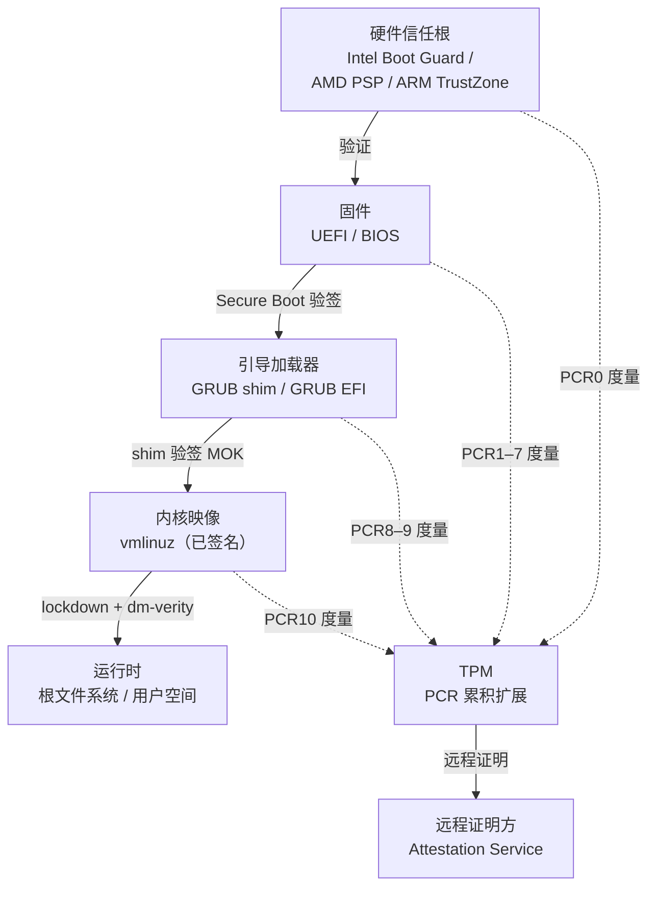

# OS启动（13）· 可信启动与启动安全

本系列从"加电"出发，经过固件（01–02）、引导扇区（03）、引导加载器（04）、CPU 模式切换（05）、内核解压（06）、分页（07）、虚拟内存（08）、中断（09）、系统调用（10）、init/systemd（11）、ELF 程序加载（12），走到第 13 棒——**可信启动**：上述每一棒都需要被验证，Secure Boot 和 Measured Boot 正是让"环环验签"成为现实的机制。

## 概述与定位

> [!abstract] TL;DR
> 可信启动（Trusted Boot）通过**信任链（chain of trust）**让每一个启动组件在执行前先被验证。Secure Boot 做"阻止"——验签失败则拒绝执行；Measured Boot 做"度量"——把每个组件的哈希扩展进 TPM 的 PCR，留下可供远程证明的启动记录。二者分工互补，配合内核 lockdown、dm-verity、IMA/EVM，从固件到运行时文件形成完整防御纵深。

---

## 原理与机制

### 信任根与信任链

信任链的核心原则：**每一棒在交棒之前必须验证下一棒**，而第一棒的可信性来自**硬件信任根（Root of Trust，RoT）**——一段烧入芯片、不可篡改的代码/密钥。



**三类硬件信任根：**

| 平台 | 信任根 | 作用 |
|---|---|---|
| Intel | Boot Guard（ACM，写入 ME Flash） | 验证初始 UEFI 固件（IBB）的哈希；策略可烧入 FPF 不可修改 |
| AMD | PSP（Platform Security Processor） | 复位时先于 x86 主核运行，验证 BIOS/AGESA 签名 |
| ARM | TrustZone 引导（BL1/BL2） | Trusted Firmware-A（TF-A）分级验证，ATF BL31 驻留安全世界 |

> [!note] 烧熔与不可逆
> Intel Boot Guard 的 OEM 公钥哈希烧入 eFuse（Field Programmable Fuses），**一旦生产时锁定即不可更改**。这是信任链的物理锚点——即使 BIOS 被刷写，Boot Guard 也只接受与 eFuse 匹配的固件。

---

## 机制详解

### Secure Boot（UEFI）

#### 密钥层级

UEFI Secure Boot 用一套**四级密钥**体系控制哪些组件允许运行：

```
PK（Platform Key）
└── KEK（Key Exchange Key）
    ├── db（Signature Database，允许列表）
    │   ├── 厂商证书（Microsoft CA、发行版 CA）
    │   └── 哈希值（允许的映像哈希）
    └── dbx（Forbidden Signature Database，吊销列表）
        ├── 已泄露密钥的证书
        └── 已知恶意映像哈希
```

| 密钥/数据库 | 存储位置 | 用途 |
|---|---|---|
| PK（唯一） | UEFI NVRAM（已认证变量） | OEM/用户持有；控制 KEK 的更新权 |
| KEK（一或多） | UEFI NVRAM | 控制 db/dbx 的更新权 |
| db | UEFI NVRAM | 持有允许执行的证书或映像哈希 |
| dbx | UEFI NVRAM | 持有被吊销的证书或哈希（黑名单） |

**验签流程（x86 UEFI）：**

1. UEFI 固件加载 ESP（FAT32 分区）上的 `.efi` 文件（PE32+ 格式）。
2. 从 PE32+ 头中提取 Authenticode 签名。
3. 在 db 中查找匹配的证书，并确认签名链有效；若证书/哈希命中 dbx，则**拒绝执行**。
4. 通过则加载映像，把控制权交给 `EFI_IMAGE_ENTRY_POINT`。

#### shim 与 MOK

Linux 发行版面临的问题：内核更新频繁，但 UEFI db 更新需要 OEM/Microsoft 签名授权，周期长。解决方案是引入 **shim**：

```
UEFI db 中的 Microsoft 第三方 UEFI CA
└── 签名 shim.efi（Fedora/Ubuntu/SUSE 等发行版 CA 再签名）
    └── shim 验证 GRUB EFI（用发行版 CA）
        └── GRUB 验证 vmlinuz（用发行版 CA）
```

- **shim**：一个极小的 EFI 应用，由 Microsoft 签名，内嵌发行版自己的 CA 证书，负责在发行版链路上做第二级验签。
- **MOK（Machine Owner Key）**：机主可通过 `mokutil` 自行注册证书，存储在 UEFI NVRAM 的 MokList 变量。shim 加载时先检查 MokList——**自编译内核需在此注册自签名证书**。

```bash
# 生成 MOK 密钥对，注册并签名内核模块（示例流程，仅供参考）
openssl req -new -x509 -newkey rsa:2048 -keyout MOK.priv -out MOK.der \
    -days 36500 -subj "/CN=MOK/"
mokutil --import MOK.der     # 注册到 MokList（重启后 MOKManager 确认）
# 签名内核模块
/usr/src/linux-headers-$(uname -r)/scripts/sign-file sha256 MOK.priv MOK.der mymod.ko
```

> [!warning] 示例输出为示意
> 以上命令为典型操作示例，具体参数依发行版/内核版本略有差异。

---

### Measured Boot 与 TPM

#### TPM PCR 机制

**TPM（Trusted Platform Module）** 是一个安全协处理器，核心功能之一是维护 **PCR（Platform Configuration Registers）**：

- PCR 共 24 个（通常用 PCR[0]–PCR[23]）；
- 每个 PCR 初始化为全 0；
- **只能"扩展"，不能直接写入**：`PCR[i] = Hash(PCR[i] || newValue)`，即 PCR 是历史度量的**单向累积摘要**。

这种不可逆设计确保：一旦某个组件被度量，历史记录无法被伪造回退。

#### 典型 PCR 分配（UEFI 平台）

| PCR 编号 | 通常度量内容 |
|---|---|
| PCR[0] | UEFI 固件可执行代码（ROM 镜像） |
| PCR[1] | UEFI 固件配置数据 |
| PCR[2] | 可选 ROM 代码（扩展固件） |
| PCR[3] | 可选 ROM 配置数据 |
| PCR[4] | MBR/EFI 应用（引导加载器） |
| PCR[5] | MBR/GPT 分区表 |
| PCR[6] | 平台厂商特定事件 |
| PCR[7] | Secure Boot 策略（PK/KEK/db/dbx 内容） |
| PCR[8]–PCR[9] | 引导加载器（GRUB）度量内核命令行、initrd 等 |
| PCR[10] | IMA（完整性度量架构）使用 |

```mermaid
graph LR
    A["组件A<br/>（UEFI 固件）"] -->|Hash(A)| E0["扩展 PCR0<br/>= Hash(0x00...00 || Hash(A))"]
    B["组件B<br/>（Boot Loader）"] -->|Hash(B)| E4["扩展 PCR4<br/>= Hash(PCR4_prev || Hash(B))"]
    C["组件C<br/>（内核映像）"] -->|Hash(C)| E4B["再扩展 PCR4<br/>= Hash(PCR4_cur || Hash(C))"]
```

#### Measured Boot vs Secure Boot

| 维度 | Secure Boot | Measured Boot |
|---|---|---|
| 动作 | **阻止**未授权组件运行（验签失败→拒绝） | **度量**组件哈希，扩展进 PCR（不阻止） |
| 依赖 | UEFI 密钥数据库（db/dbx） | TPM PCR |
| 失败后果 | 启动终止 | PCR 值反映变化（远程证明可发现） |
| 用途 | 防止恶意 bootloader/内核执行 | 远程证明、TPM 封存（Sealing）策略 |
| 互补关系 | 阻止层 | 检测/审计层 |

#### 远程证明（Remote Attestation）

TPM 支持生成**报价（Quote）**：用 AIK（证明身份密钥）对当前 PCR 值集合签名，发给远程验证方：

```
设备                               证明服务
  |-- nonce（防重放）  <----------|
  |-- TPM Quote(PCR[0..23], nonce) -->|
                                    |-- 比对预期 PCR 值
                                    |-- 验证签名（AIK 证书链→厂商 CA）
                                    |-- 判定：可信 / 不可信
```

- **应用场景**：VPN 接入前检查终端启动状态；机密计算（Confidential Computing）验证 TEE 环境；云实例完整性校验。

---

### 内核 lockdown 模式

Linux 内核自 5.4 版本将 **lockdown** 作为 LSM（Linux Security Module）纳入主线。Secure Boot 启用时内核通常自动进入 lockdown：

| lockdown 级别 | 限制 |
|---|---|
| `integrity`（完整性模式） | 禁止 `/dev/mem`、禁止加载未签名模块、禁止 kprobes/eBPF 修改内核代码、禁止 hibernation |
| `confidentiality`（机密模式） | 在 integrity 之上，还禁止读取内核内存（防止泄露密钥）、限制 PCI P2P DMA |

```bash
cat /sys/kernel/security/lockdown   # 查看当前 lockdown 状态
# 示例输出：none [integrity] confidentiality
```

> [!warning] 示例输出为示意

---

### KASLR

**KASLR（Kernel Address Space Layout Randomization）** 在每次启动时随机化内核映像的加载基址，使攻击者无法依赖固定地址构造 ROP 链或内核漏洞利用。内核命令行 `nokaslr` 可禁用（调试用），生产环境应保持开启。KASLR 配合 Measured Boot：内核的实际加载地址会影响某些度量，而 lockdown 进一步阻止从用户空间探测内核地址（`/proc/kallsyms` 在 lockdown 下显示为 0）。

---

### dm-verity（块级完整性）

**dm-verity** 是 Linux Device Mapper 的目标（target），为只读块设备提供**哈希树完整性验证**：

```
根哈希（root hash）
└── 哈希树（Merkle Tree）
    └── 数据块（4 KB 为单位）
```

工作方式：
1. 只读根文件系统分区被 dm-verity 保护；
2. Merkle 树的**根哈希**硬编码在已验签的内核命令行或 vbmeta（Android Verified Boot 2.0）中；
3. 每次读取数据块，内核验证该块哈希直至根哈希，任何块被篡改即返回 I/O 错误。

**典型应用**：
- Android：`vbmeta` 分区存根哈希，`dm-verity` 保护 `system`/`vendor` 分区；
- Chrome OS：`/` 分区只读，dm-verity 校验；
- 嵌入式 Linux：只读 squashfs + dm-verity。

```bash
# 在 Linux 上查看 dm-verity 设备状态（示例）
dmsetup status vroot
# 示例输出：0 4096000 verity V
```

> [!warning] 示例输出为示意

---

### IMA/EVM（文件完整性度量）

**IMA（Integrity Measurement Architecture）** 是内核中的文件完整性框架：

- 在文件被执行（`execve`）或打开前，计算文件哈希并：
  1. **度量**：将哈希扩展进 TPM PCR[10]，写入 IMA 度量日志；
  2. **评估**（可选）：将哈希与 IMA 签名/策略比对，不匹配则拒绝访问。

**EVM（Extended Verification Module）** 保护文件的扩展属性（`security.ima`、`security.selinux` 等），防止攻击者离线修改文件后伪造哈希。

```bash
# 查看 IMA 度量日志（示例，需内核启用 IMA）
cat /sys/kernel/security/ima/ascii_runtime_measurements | head -5
# 格式：PCR 模板哈希 模板名 文件哈希 文件路径
```

> [!warning] 示例输出为示意

---

### 机密计算：AMD SEV 与 Intel TDX

机密计算（Confidential Computing）将 Measured Boot 的思路从"OS 信任固件"推进到"OS 不信任 Hypervisor"——即使云平台的 Hypervisor 被攻陷，租户虚拟机中的内存和计算也不可被窥视或篡改。

#### AMD SEV 技术演进

AMD SEV（Secure Encrypted Virtualization）系列构建在 AMD SP（安全处理器，即 PSP）之上，分三代逐步加强保护：

| 代际 | 全称 | 新增能力 |
|---|---|---|
| SEV（2016） | Secure Encrypted Virtualization | VM 内存加密（每个 VM 独立密钥），Hypervisor 无法读取明文 |
| SEV-ES（2019） | SEV + Encrypted State | 寄存器状态（VMSA）也加密，VMEXIT 时不向 Hypervisor 暴露 CPU 寄存器值 |
| SEV-SNP（2021） | SEV + Secure Nested Paging | 内存完整性 + 防重放 + 强 VM/Hypervisor 隔离 |

**SEV-SNP 核心机制：**

1. **内存加密引擎（Memory Encryption Engine，MEE）**：集成于内存控制器，在写入 DRAM 时 AES-128 加密（带 tweak），每个 VM 持有唯一密钥存于 PSP 内部，Hypervisor 不可获取。

2. **反向映射表（Reverse Map Table，RMP）**：每个 4 KB 物理内存页对应一条 RMP 条目，记录该页"属于哪个 VM/Hypervisor/固件"。若 Hypervisor 试图将某个已分配给 VM 的物理页重新映射到另一个 GPA，RMP 检查失败触发 `#PF`（页错误），CPU 以硬件强制执行，拒绝重映射攻击。

3. **防重放（Anti-replay）**：RMP 条目包含版本号，防止 Hypervisor 保存并回滚内存快照（重放旧密文绕过完整性）。

4. **VMPL（VM Privilege Level）**：SNP 引入四个 VMPL（0–3），类似 Ring 0–3，允许在 VM 内部建立更细粒度的信任域（如 VM 内的安全内核运行在 VMPL0，普通 OS 运行在 VMPL1）。

```
AMD SEV-SNP 内存访问控制流：

  Guest VM 访问内存
       │
       ▼
  NPT（嵌套页表，由 Hypervisor 控制）
       │
       ▼
  RMP 检查（由硬件强制执行）
  ├── 页属于该 GuestASID？
  ├── GPA→SPA 映射是否与 RMP 一致？
  └── 版本号匹配？
       │
  通过 → MEE 解密 → 明文送给 Guest CPU
  失败 → #VMEXIT / #PF（拒绝访问）
```

**SEV-SNP 远程证明（Attestation）：**

VM 启动时 PSP 计算 **度量值（Measurement）**：对初始内存内容（Guest 固件/内核的哈希）、SEV 策略参数等计算 SHA-384 摘要，存入 **ATTESTATION_REPORT**，由 PSP 内置的 VCEK（Versioned Chip Endorsement Key，不可导出）签名：

```
证明方（Verifier）                        SEV-SNP VM
    │                                        │
    │── nonce（防重放随机数）──────────────>│
    │                                        │ SNP_GET_REPORT(nonce)
    │                                        │ → PSP 生成 ATTESTATION_REPORT
    │<── REPORT {measurement, policy, nonce, VCEK_sig} ──│
    │                                        │
验证：
  1. 从 AMD KDS（Key Distribution Service）获取 VCEK 证书链
  2. 验证 VCEK_sig 和证书链（VCEK→ASK→ARK）
  3. 比对 measurement 与预期镜像哈希
  4. 检查 policy（是否允许调试模式、是否启用 SMT 等）
  → 可信 / 不可信
```

#### Intel TDX（Trust Domain Extensions）

TDX 是 Intel 在 Ice Lake-SP（Xeon）/ Sapphire Rapids 起推出的机密虚拟机技术，通过引入新的 **SEAM（Secure Arbitration Mode）** CPU 操作模式实现 TD（Trust Domain）与 VMM 的硬件隔离。

**核心概念：**

| 概念 | 说明 |
|---|---|
| SEAM 模式 | 新增于 VMX 之外的第三种 CPU 模式；TDX 模块（Intel 签名的固件）运行于 SEAM，充当"TD 管理器" |
| Trust Domain（TD） | 即一个受保护的 VM；拥有独立加密内存，VMM 不可读取 |
| TDX Module | Intel 签名、加载到 SEAM 内存的固件，负责 TD 生命周期管理（创建/销毁/度量），取代 VMM 对 TD 的直接控制权 |
| TDCALL / TDVMCALL | TD → TDX Module 的调用（TDCALL，类似 hypercall）；TD → VMM 的调用（TDVMCALL，经由 TDX Module 中转） |
| KeyID | 每个 TD 分配一个 KeyID，内存控制器用 KeyID 选择对应的 AES-128-XTS 密钥 |

**TDX 隔离架构：**

```
Ring 0 VMM（KVM/Xeon SP）
│   ← 无法直接访问 TD 内存（KeyID 保护，读到密文或 #GP）
│
TDX Module（SEAM 模式，Intel 签名）
│   ← 管理 TD-VMX 扩展、SEPT（Secure EPT）、度量寄存器
│
TD（Trust Domain，即 Guest VM）
│   ← 内存 AES-XTS 加密，VMM 不可读取明文寄存器/内存
│
SEPT（Secure EPT，安全扩展页表）
│   ← 由 TDX Module 管理，VMM 只能"请求"添加/移除内存页，
│     不能直接修改 SEPT（防止重映射攻击）
```

**TDX 远程证明（TDREPORT / TDX Quote）：**

```
TD 内调用 TDCALL[TDG.MR.REPORT](nonce)
  → TDX Module 读取度量寄存器（MRTD：初始内存度量；RTMR0-3：运行时度量）
  → 生成 TDREPORT（由 Intel Attestation Key 签名，仅在本机有效）

TD 内调用 tdx-attest 库 → 发给 Intel Provisioning Certification Service（PCS）
  → PCS 将 TDREPORT 转换为 TDX Quote（全局可验证，QE 签名）

证明方验证 TDX Quote：
  1. 验证 QE（Quoting Enclave）签名链 → Intel Root CA
  2. 比对 MRTD（TD 初始镜像哈希）
  3. 检查 TD 属性（是否开启调试、TD 配置）
```

#### 内存加密引擎（MEE）工作原理

AMD SEV 和 Intel TDX 均在**内存控制器**（MC）内集成加密引擎，而非软件层：

```
CPU 核心
  │  物理地址 + 明文数据（CPU Cache 内为明文）
  ▼
内存控制器（MC）
  ├── 加密引擎：AES-XTS（Intel）/ AES-128（AMD）
  ├── KeyID/ASID → 选择密钥（密钥存于 PSP/TDX Module，不出片）
  └── 加密后密文写入 DRAM / 解密后明文送入 Cache
  ▼
DRAM（只存密文）
```

关键特性：
- **CPU Cache 内为明文**：性能接近原生（通常 < 5% 开销）
- **密钥不出片**：私钥由 PSP/TDX Module 生成，永远不以明文形式出现在 DRAM/PCIe 总线
- **粒度为页（4 KB）**：每个内存页独立加密，支持多个 VM 各用不同密钥

#### 与 SGX（进程级 TEE）的对比

| 维度 | Intel SGX | AMD SEV-SNP | Intel TDX |
|---|---|---|---|
| **保护粒度** | 用户态进程（Enclave） | 整个 VM | 整个 VM（Trust Domain） |
| **信任边界** | 不信任 OS/Hypervisor/其他进程 | 不信任 Hypervisor | 不信任 VMM |
| **开发模型** | 需要专用 SDK（Intel SGX SDK / Open Enclave），代码须分为 Trusted/Untrusted | 普通 VM 内无修改运行（或配合 SEV-aware 内核） | 普通 VM 近乎无修改运行 |
| **内存保护** | EPC（Enclave Page Cache），MEE 加密；大小受限（128 MB–1 GB EPC） | 整个 VM 内存加密（GPA 空间无限制） | 整个 TD 内存加密 |
| **攻击面** | 较窄（只有 Enclave 需可信） | 更大（整个 Guest OS 在信任域内） | 更大（整个 TD 在信任域内） |
| **证明机制** | SGX QUOTE（EPID/DCAP） | SEV-SNP ATTESTATION_REPORT | TDX Quote（TDREPORT + PCS） |
| **适用场景** | 敏感计算函数、密钥管理 | 完整 VM 迁移到不可信云（Lift & Shift） | 完整 VM 迁移到不可信云 |

**SGX 局限**（相比 VM 级 TEE）：
- EPC 大小受限，应用须专门改写
- 侧信道攻击面较大（分页、分支预测泄露）
- 无法保护 OS 本身（OS 在 SGX 外运行）

**SEV-SNP/TDX 局限**（相比 SGX）：
- 信任域更大（整个 Guest OS），内核漏洞仍可被利用
- 不能保护进程免受同 VM 内其他进程攻击

#### 机密虚拟机（CVM）启动信任链

CVM 将 Measured Boot 与 TEE 结合：

```
1. Hypervisor 创建 TD/SEV VM → 分配 KeyID/ASID
2. TDX Module / PSP 将 Guest 固件（OVMF）加载到加密内存
   → 同时计算初始度量（MRTD / SNP Measurement）
3. Guest 固件（OVMF）在加密 VM 内启动
   → 执行 UEFI Secure Boot（验证 Bootloader 签名）
   → 将每个组件哈希扩展进 RTMR（TDX）/ VMSA 度量（SNP）
4. Bootloader → 内核启动
5. VM 内应用调用证明 API
   → 生成包含全链度量的 Quote/Report
6. 远程证明方验证：
   初始固件度量 + Secure Boot 链度量 + 应用自身度量 → 全链可信
```

与传统 Measured Boot 的区别：度量扩展链由**硬件 TEE（TDX Module/PSP）**而非 Hypervisor 维护，Hypervisor 无法伪造或篡改度量值。

---

## 威胁与防御分析

### Bootkit 与固件级持久化

**原理**（防御视角分析）：

Bootkit 是在操作系统内核加载之前驻留在存储介质的恶意代码。典型位置：MBR、VBR（Volume Boot Record）、EFI System Partition（`/EFI/BOOT/BOOTX64.EFI`）、UEFI 固件 NVRAM 变量、甚至固件 ROM 自身。其核心优势是**早于内核执行**，传统杀毒引擎在其已完全控制系统后才启动。

| Bootkit 驻留层 | 特征 | 检测/防御 |
|---|---|---|
| MBR/VBR | 覆盖 MBR 或 VBR | Secure Boot 阻止（MBR 不是 EFI 应用；UEFI 模式下 MBR 不执行引导代码） |
| ESP EFI 应用替换 | 替换 `BOOTX64.EFI` 为恶意 EFI | Secure Boot 验签，替换的未签名 EFI 被拒绝；Measured Boot 度量变化 |
| UEFI 固件植入 | 修改固件 Flash（需物理访问或固件漏洞） | 固件更新签名验证（Intel Boot Guard）；固件完整性验证（NIST SP 800-193） |
| UEFI NVRAM | 修改启动选项、变量 | Secure Boot 已认证变量（需 PK 签名才可写）；定期 NVRAM 完整性审计 |

**检测手段**：

- **Measured Boot + 远程证明**：任何启动路径改变都体现在 PCR 值变化，证明服务比对基线即可发现异常；
- **固件扫描工具**：`fwupd` + LVFS（Linux Vendor Firmware Service）验证固件签名；`chipsec` 对 Intel 平台固件做完整性检查；
- **实模式检测**（旧方案）：现代 UEFI 配合 Secure Boot 已大幅收窄 MBR 类 Bootkit 的攻击面。

```bash
# chipsec 检查 Secure Boot 策略与固件保护（需 root，分析视角示例）
python chipsec_main.py -m common.secureboot.variables
```

> [!warning] 示例输出为示意

---

### Evil Maid 物理攻击

**Evil Maid 攻击**是攻击者在设备无人看管时对其进行物理接触（如替换硬盘、修改固件）的场景。典型威胁：

1. 替换引导加载器为键记录器，在用户下次输入磁盘加密密码时窃取；
2. 接入 DMA 设备（Thunderbolt）读取内存中的明文密钥；
3. 修改 EFI 分区中的组件，植入后门。

**防御：**

| 防御措施 | 原理 |
|---|---|
| Secure Boot（已启用、PK 锁定） | 替换的未签名 EFI 组件无法执行 |
| TPM 封存（Sealing）绑定 PCR | 磁盘加密密钥被 TPM 密封，只有 PCR[0–7] 等与预期匹配时 TPM 才释放密钥；引导路径被篡改导致 PCR 变化，TPM 拒绝解封，LUKS/BitLocker 无法自动解密 |
| 全盘加密（LUKS/dm-crypt + BitLocker） | 物理取走磁盘无法读取明文数据 |
| 禁用 Thunderbolt DMA（IOMMU 策略） | 防止 DMA 攻击；内核 `intel_iommu=on`、BIOS 中禁用 Pre-boot DMA 授权 |
| 机箱入侵检测 + 物理封条 | 发现物理接触 |

**TPM Sealing 工作流程：**

```mermaid
graph LR
    KEY["磁盘加密密钥<br/>（明文）"] -->|TPM2_Seal<br/>绑定 PCR[0,2,4,7]| BLOB["密封 Blob<br/>（存于磁盘）"]
    BLOB -->|启动时 TPM2_Unseal| CHK{PCR 匹配?}
    CHK -->|Yes| KEY2["明文密钥<br/>（自动解密）"]
    CHK -->|No：启动路径被篡改| DENY["拒绝解封<br/>→ 要求手动输密码"]
```

---

## 安全性与正确使用

### 防御建议清单

1. **启用 Secure Boot 并锁定 PK**：确认 PK 已由 OEM 设置且处于 User Mode（而非 Setup Mode）；不要随意清除 PK（会退回 Setup Mode，失去签名验证）。
2. **保持 dbx 更新**：定期通过 `fwupd` 或 OS 更新同步 dbx，吊销已泄露的证书/哈希（如 UEFI CA 撤销事件）。
3. **启用 TPM 并配置全盘加密绑定 PCR**：Linux 下 `systemd-cryptenroll --tpm2-device=auto --tpm2-pcrs=0+2+4+7` 把 LUKS 密钥绑定到 PCR；Windows 下 BitLocker 默认绑定 PCR[0,2,4,11]。
4. **启用内核 lockdown**：生产系统应在 integrity 模式以上，防止从用户空间绕过签名加载内核模块。
5. **dm-verity 保护只读分区**：嵌入式/Android 设备应为系统分区启用 dm-verity，并将根哈希固化到已签名的启动链中。
6. **启用 IMA 策略**：在安全敏感场景下配置 IMA 度量策略，将运行时文件完整性信息记录进 TPM。
7. **固件保持最新**：通过 LVFS/`fwupd` 更新固件；固件漏洞（如 LogoFAIL、BootHole）通常通过 dbx 更新和固件 Patch 修复。
8. **检查 Secure Boot 状态**：

```bash
# 检查 Secure Boot 是否开启
mokutil --sb-state
# 示例输出：SecureBoot enabled

# 查看 UEFI 变量（需 efivarfs 挂载）
efivar -n 8be4df61-93ca-11d2-aa0d-00e098032b8c-SecureBoot
```

> [!warning] 示例输出为示意

```bash
# 检查 TPM 状态
cat /sys/class/tpm/tpm0/tpm_version_major  # 应为 2
tpm2_pcrread sha256:0,1,2,4,7              # 读取关键 PCR 值
```

> [!warning] 示例输出为示意

### 合规边界

> [!caution] 合规边界
> 本篇内容用于**自有设备的安全评估与防御加固**（自建服务器/开发板/个人设备的可信启动配置）以及**安全研究与教育目的的原理讲解**。
>
> 本篇**不提供**：绕过他人设备 Secure Boot/TPM 封存的武器化步骤；绕过 DRM（如 Android Verified Boot）的具体方法链；在未获授权的设备上禁用或欺骗可信启动机制的操作指引。
>
> 对自有设备（含 BYOD 合规评估、嵌入式安全开发、红队测试已授权目标），以上限制不适用，但应遵守所在机构的安全策略与法律法规。

---

## 小结

本篇是《操作系统加载与启动》系列的收官篇，也是启动接力的最后一道防线。

**接力串联**：前 12 篇把"固件发现引导设备（01–02）→ 引导扇区与分区表（03）→ 引导加载器（04）→ CPU 从实模式切换到长模式（05）→ 内核解压与 `start_kernel`（06）→ 分页/页表（07）→ 虚拟内存（08）→ 中断/IDT（09）→ 系统调用（10）→ init/systemd（11）→ ELF 程序加载（12）"走完了一遍；可信启动（13）正是让这条接力链的**每一棒都可被验证**——从硬件信任根一路向上，Secure Boot 负责"拦截不合格棒次"，Measured Boot 负责"记录每一棒状态"，二者共同确保你拿到控制权的内核，是你信任的那个内核。

**核心要点速查：**

| 机制 | 关键点 |
|---|---|
| 硬件信任根 | Intel Boot Guard / AMD PSP / ARM TF-A；不可篡改锚点 |
| Secure Boot | PK→KEK→db/dbx；shim（发行版 CA）+ MOK；PE32+ Authenticode 验签 |
| Measured Boot | TPM PCR 扩展（单向累积）；度量不阻止；与 Secure Boot 互补 |
| 远程证明 | TPM Quote（AIK 签名 PCR 值）+ 证明服务比对基线 |
| kernel lockdown | integrity / confidentiality 两级；Secure Boot 启用时自动激活 |
| KASLR | 内核加载基址随机化；lockdown 防地址泄漏 |
| dm-verity | Merkle 树块级完整性；根哈希固化于已签名启动链 |
| IMA/EVM | 文件执行前度量（PCR[10]）+ 扩展属性完整性保护 |
| Bootkit 防御 | Secure Boot + Measured Boot + 固件签名更新 |
| Evil Maid 防御 | TPM Sealing 绑定 PCR + 全盘加密 + IOMMU |

---

## 相关阅读

- [[34.现代二进制防护机制/00.现代二进制防护机制总览.md]]（运行时防护机制全景，与启动安全互补）
- [[02.BIOS与UEFI固件]]（UEFI Boot Services/Runtime Services、Secure Boot 固件基础）
- [[06.内核解压与早期初始化]]（`startup_64` → `start_kernel`，内核最早的自我建立）
- [[12.ELF程序的加载与执行]]（`execve` → ELF 加载，本系列上一篇）
- [[21.Asm/43 启动流程与Bootloader.md]]（汇编视角的引导流程）
- [[11.ELF文件详解/00.ELF文件详解总览.md]]（ELF 格式基础）

---

⬅️ 上一篇 [[12.ELF程序的加载与执行]] ｜ 🏠 [[00.操作系统加载与启动总览]] ｜ ➡️ 下一篇 [[14.Windows启动链BOOTMGR与winload]]
