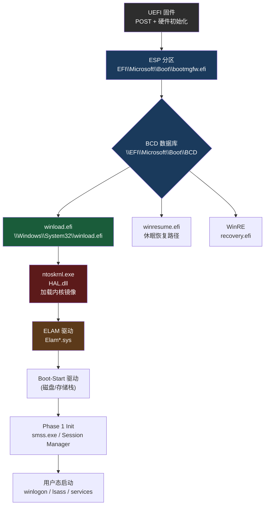
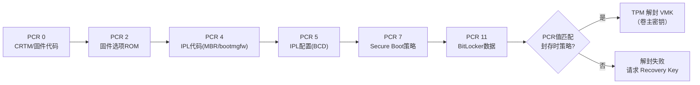

---
tags:
  - 操作系统
  - 启动
  - tier3
  - windows
  - boot
---
# Windows 启动链：BOOTMGR 与 winload

> [!abstract] TL;DR
> Windows 现代启动链分两大阶段：固件（UEFI/BIOS）移交控制权后，`bootmgfw.efi`（即 BOOTMGR）读取 BCD 数据库、选择启动项并校验 Secure Boot 签名；随后 `winload.efi`（UEFI 模式）或 `winload.exe`（Legacy 模式）接管，加载内核 `ntoskrnl.exe`、硬件抽象层 `hal.dll`、boot-start 驱动及 ELAM 驱动，并在此过程中完成 BitLocker/TPM 解封与 Measured Boot 度量。全链与 Linux GRUB→vmlinuz 路径在架构哲学上迥异：Windows 将安全逻辑深度嵌入引导器而非操作系统层，PatchGuard/DSE 的初始化时机也在内核早期完成，形成纵深防御闭环。

## 概述与定位

### 历史演进：从 NTLDR 到 BOOTMGR

Windows NT 系列启动架构经历了两代根本性变革：

**第一代（NT 3.1～Vista 前身）：NTLDR 时代**

在 Windows XP 及更早版本中，BIOS 从 MBR 加载 `NTLDR`（NT Loader），其完成所有引导工作：
- 从 FAT 或 NTFS 分区根目录读取 `boot.ini` 文本配置
- 在实模式下读取磁盘，切换到保护模式，最终加载 `ntoskrnl.exe`
- `NTDETECT.COM` 负责硬件检测，将结果传给内核

`boot.ini` 是纯文本，格式简单但脆弱，例如：
```
[boot loader]
timeout=30
default=multi(0)disk(0)rdisk(0)partition(1)\WINDOWS

[operating systems]
multi(0)disk(0)rdisk(0)partition(1)\WINDOWS="Windows XP Professional"
```

ARC（Advanced RISC Computing）路径语法 `multi(0)disk(0)rdisk(0)partition(1)` 是 DEC Alpha 时代的遗产，在 x86 平台实际忽略前两个括号数值。

**第二代（Vista+）：BOOTMGR + BCD 时代**

Vista 引入了现代架构：`BOOTMGR`（Boot Manager）替代 NTLDR，`BCD`（Boot Configuration Data）替代 `boot.ini`。这一重构的核心驱动力：
1. 支持 UEFI 平台（需要 PE32+ 格式可执行文件）
2. 安全性需求——BCD 是二进制注册表格式，不易被文本编辑器随意篡改
3. 支持 WinRE（Windows Recovery Environment）、WinPE、调试模式等多样化启动项
4. 为 BitLocker 全盘加密提供解封钩子

### 现代 Windows 启动链全景



**Legacy BIOS 路径**（仍受支持但逐渐淘汰）：
```
BIOS → MBR → VBR（卷引导记录）→ bootmgr（无 .efi 后缀）→ winload.exe
```

UEFI 与 Legacy 路径的 BOOTMGR 功能完全相同，仅文件格式不同：`bootmgfw.efi` 是 PE32+ UEFI 应用，`bootmgr` 是 MBR 时代的 16 位实模式+32 位保护模式混合程序。

---

## 原理与机制

### UEFI 固件到 bootmgfw.efi 的交接

UEFI 固件完成 POST 后，执行 UEFI Boot Manager（固件内置，非 Windows BOOTMGR），按 `BootOrder` 变量（`efibootmgr -v` 可查）遍历 `Boot####` 条目，找到 Windows Boot Manager 条目：

```
Boot0001* Windows Boot Manager
         HD(2,GPT,<GUID>,0x800,0x100000)/File(\EFI\Microsoft\Boot\bootmgfw.efi)
```

固件将 `bootmgfw.efi` 以 PE32+ UEFI 应用程序方式加载到内存，调用其 EFI 入口点 `EfiMain(EFI_HANDLE ImageHandle, EFI_SYSTEM_TABLE *SystemTable)`。

此时系统仍处于 UEFI 环境：
- CPU 运行在 64 位长模式
- UEFI Boot Services 仍然可用（内存映射、协议查找等）
- 固件负责的 Secure Boot 策略已激活

**Secure Boot 验证（固件层）**：

在调用 `EfiMain` 之前，UEFI 固件已对 `bootmgfw.efi` 的 Authenticode 签名进行验证：
1. 检查 `db`（允许的签名数据库）中是否包含该文件的签名证书
2. 检查 `dbx`（撤销数据库）中是否吊销了该证书
3. 签名链须最终锚定到 `PK`（Platform Key）或 `KEK`（Key Exchange Key）

`bootmgfw.efi` 由微软使用 Microsoft Windows Production PCA 证书签名，该证书的 CA 根已预装在几乎所有 OEM 的 UEFI `db` 中。

### BCD（Boot Configuration Data）详解

BCD 是一个标准 Windows 注册表 Hive 文件，但语义专用于引导配置。

**BCD 存储位置**：
- UEFI 模式：`\EFI\Microsoft\Boot\BCD`（ESP 分区内）
- Legacy 模式：`\Boot\BCD`（系统分区，通常 100MB 隐藏分区）
- 活动系统中可通过注册表路径访问：`HKLM\BCD00000000`

**BCD 结构**：BCD 由"对象"（Object）和"元素"（Element）组成，每个对象对应一个 GUID 标识的启动项：

| GUID | 含义 |
|---|---|
| `{9dea862c-5cdd-4e70-acc1-f32b344d4795}` | Windows Boot Manager（全局配置） |
| `{current}` = `{...}` | 当前 OS 的 Boot Loader 条目 |
| `{bootmgr}` | BOOTMGR 对象别名 |
| `{memdiag}` | Windows Memory Diagnostics |
| `{ramdiskoptions}` | WinRE/WinPE 的 ramdisk 配置 |

每个对象含多个元素，元素以 32 位类型码标识：

```
0x11000001  Description（显示名称）
0x12000002  ApplicationPath（如 \Windows\System32\winload.efi）
0x21000001  OSDevice（包含分区描述符）
0x22000002  SystemRoot（如 \Windows）
0x25000030  BootDebugEnabled
0x26000010  KernelDebuggerEnabled
0x16000048  DisableIntegrityChecks（测试签名模式标志）
```

**bcdedit 常用操作**：

```cmd
:: 查看所有条目
bcdedit /enum all

:: 修改超时时间
bcdedit /timeout 10

:: 启用内核调试（串口）
bcdedit /debug on
bcdedit /dbgsettings serial debugport:1 baudrate:115200

:: 添加 WinRE 引导项
bcdedit /create {recoverysequence} ...

:: 强制使用 VGA 显示（SafeBoot）
bcdedit /set {current} safeboot minimal
```

BCD 的二进制格式使得非管理员账户无法直接用文本编辑器修改（需要 SYSTEM 权限挂载注册表 Hive），相比 `boot.ini` 有显著的防篡改优势——但不是密码学保护。

### winload.efi 的工作序列

`winload.efi` 是 Windows 启动链中工作量最重的组件，其功能等价于 Linux 内核本身的早期初始化（但发生在内核进入 `start_kernel()` 之前）。

**阶段一：环境建立**

```
winload 入口
  ↓
BlInitializeLibrary()    // 初始化引导库，建立内存管理
  ↓
BmMain()                 // 引导管理器主函数
  ↓
BlBsdOpenLog()           // 打开引导日志（调试用）
  ↓
BlFwEnumerateDevice()    // 枚举 UEFI 固件设备
```

**阶段二：BCD 参数读取**

winload 读取自身 BCD 条目中的参数，包括：
- `OSDevice`：操作系统所在磁盘/分区描述符
- `SystemRoot`：如 `\Windows`
- `KernelDebuggerEnabled`：是否启用 KD（Kernel Debugger）
- `SafeBoot`：安全模式类型

**阶段三：BitLocker/TPM 解封（若启用）**

这是 winload 中最关键的安全环节，详见"安全性与正确使用"节。

**阶段四：加载内核镜像**

```
OslLoadImage()
  ↓
LdrLoadImageWithLinker("ntoskrnl.exe")
  ↓
LdrLoadImageWithLinker("hal.dll")        // 硬件抽象层
  ↓
LdrLoadImageWithLinker("kdcom.dll")      // 内核调试通信（若启用）
  ↓
OslLoadHypervisor()                      // Hyper-V 若启用
```

内核和 HAL 均以 PE32+ 格式加载，winload 负责解析其导入表（IAT）并做初步重定位——但真正的重定位在内核 ASLR（KASLR 等效，Windows 内核 ASLR）时完成。

**阶段五：加载注册表 Hive**

winload 在将控制权交给内核之前必须加载若干注册表 Hive（因为内核启动需要它们）：

```
SYSTEM    → \Windows\System32\config\SYSTEM
HARDWARE  → 动态生成（硬件检测结果）
```

注意：`SYSTEM` Hive 此时以只读方式挂载，内核获得控制权后才可写。

**阶段六：枚举 Boot-Start 驱动**

Boot-Start 驱动是注册表中 `HKLM\SYSTEM\CurrentControlSet\Services` 下 `Start=0`（SERVICE_BOOT_START）的驱动。典型的 Boot-Start 驱动：

| 驱动 | 功能 |
|---|---|
| `disk.sys` | 磁盘设备驱动 |
| `Ntfs.sys` | NTFS 文件系统 |
| `ataport.sys` / `storport.sys` | 存储控制器端口 |
| `acpi.sys` | ACPI 平台驱动 |
| `pci.sys` | PCI 总线驱动 |
| `ELAM 驱动` | 早期反恶意软件（见下节） |

这些驱动均被加载（pe 映像映射到内存），但**尚未执行**——执行将在 `ntoskrnl` 的 Phase 1 初始化中进行。

**阶段七：ExitBootServices 与控制权移交**

winload 调用 UEFI 的 `ExitBootServices()`，此后 UEFI Boot Services 不再可用（Runtime Services 仍可用于读写 EFI 变量）。随后 winload 跳转到 `ntoskrnl.exe` 的内核入口 `KiSystemStartup`，传递一个 `LOADER_PARAMETER_BLOCK` 结构，包含：
- 已加载模块链表
- 内存描述符列表（页框信息）
- 注册表 Hive 地址
- NLS 表地址
- Boot 驱动列表

### ntoskrnl 早期初始化（Phase 0 与 Phase 1）

`KiSystemStartup` → `ExpInitializeExecutive(0, LoaderBlock)` 开始内核 Phase 0：

**Phase 0**（单处理器，中断关闭，不可失败）：
- `HalInitializeProcessor` — HAL 初始化 BSP（Boot Strap Processor）
- `KiInitializeKernel` — 调度器数据结构初始化
- `ExInitPool` — 内存池（PagedPool/NonPagedPool）初始化
- `MmInitSystem(0)` — 内存管理子系统 Phase 0
- PatchGuard（KPP）数据结构初始化（此时确定保护范围）

**Phase 1**（可以初始化更多子系统，仍在 System 进程上下文）：
- I/O 管理器初始化，开始加载 Boot-Start 驱动的 `DriverEntry`
- ELAM 驱动的回调注册生效
- PnP 管理器启动硬件枚举
- DSE（Driver Signature Enforcement）检查驱动签名
- `smss.exe`（Session Manager）启动，这是第一个用户态进程

---

## 结构/算法/伪代码详解

### BCD 对象的注册表结构

以十六进制转储方式理解 BCD 内部结构（可用 `reg export HKLM\BCD00000000 bcd.reg` 后人工阅读）：

```
HKLM\BCD00000000
  └── Objects
        └── {<GUID>}          ← 每个启动项
              ├── Description
              │     └── Type   = 0x10200003  (Windows Boot Loader)
              └── Elements
                    ├── 11000001   ← Description (REG_SZ)
                    ├── 12000002   ← ApplicationPath (REG_SZ)
                    ├── 21000001   ← OSDevice (二进制，含分区 GUID)
                    └── 25000020   ← AllowPrereleaseSignatures (REG_DWORD)
```

`OSDevice` 元素的二进制格式：

```
偏移 0x00  : 4 字节  Device 类型（1 = 启动分区，6 = ramdisk，等）
偏移 0x04  : 4 字节  附加标志
偏移 0x08  : 16 字节 分区 GUID（GPT 磁盘）
偏移 0x18  : 16 字节 磁盘 GUID
...
```

### winload 加载内核的伪代码

```c
// 高度简化的 winload 核心逻辑伪代码
NTSTATUS OslMain(LOADER_BLOCK **OutLoaderBlock)
{
    LOADER_PARAMETER_BLOCK *LoaderBlock = AllocateLoaderBlock();

    // 1. 读取 BCD 参数
    BcdOpenStoreFromDevice(SystemDevice, &BcdStore);
    BcdGetElementData(BcdStore, CurrentGuid, BCP_APPLICATION_PATH, &KernelPath);
    BcdGetElementData(BcdStore, CurrentGuid, BCP_OSDEVICE, &OsDevice);

    // 2. 若 BitLocker 启用，先解封
    if (IsVolumeEncrypted(OsDevice)) {
        FveTpmUnlockVolume(OsDevice);  // TPM PCR 验证 + 解封卷密钥
    }

    // 3. 加载内核与 HAL
    LdrLoadPEImage(L"\\Windows\\System32\\ntoskrnl.exe", &KernelBase);
    LdrLoadPEImage(L"\\Windows\\System32\\hal.dll", &HalBase);

    // 4. 加载注册表 SYSTEM hive
    HiveLoad(L"\\Windows\\System32\\config\\SYSTEM", &SystemHive);
    LoaderBlock->RegistryBase = SystemHive;

    // 5. 枚举 Boot-Start 驱动
    foreach (driver in EnumBootStartDrivers(SystemHive)) {
        LdrLoadPEImage(driver->ImagePath, &DriverBase);
        AppendToDriverList(LoaderBlock->BootDriverListHead, DriverBase);
    }

    // 6. 加载 ELAM 驱动（特殊优先级）
    OslLoadElamDrivers(LoaderBlock);

    // 7. 关闭 UEFI Boot Services
    gBS->ExitBootServices(ImageHandle, MemoryMapKey);

    // 8. 建立页表并跳转内核
    OslArchSetupTransferPage();
    OslTransferToKernel(KernelBase, LoaderBlock);  // 不返回
}
```

### ELAM（Early Launch Anti-Malware）机制详解

ELAM 是 Windows 8 引入的安全机制，允许安全厂商的驱动在所有其他 Boot-Start 驱动之前加载并对其进行签名验证。

**ELAM 驱动的特殊性**：
1. 必须使用微软颁发的专门 ELAM 签名证书签名（不同于普通驱动签名）
2. 由 winload 在所有其他 Boot-Start 驱动之后、内核入口之前注册
3. 在内核 Phase 1 中，I/O 管理器在加载每个 Boot-Start 驱动的 `DriverEntry` 之前，先调用 ELAM 驱动的回调

**ELAM 驱动的回调接口**：

```c
// ELAM 驱动注册的回调
NTSTATUS ElamDriverEntry(PDRIVER_OBJECT DriverObject, PUNICODE_STRING RegistryPath)
{
    // 注册 Boot-Start 驱动策略回调
    CmRegisterCallback(ElamPreDriverLoadCallback, NULL, &CookieHandle);

    // 注册驱动验证回调
    IoRegisterBootDriverCallback(ElamBootDriverCallback, NULL);
    return STATUS_SUCCESS;
}

// 每个 Boot-Start 驱动加载前被调用
DRIVER_CALLBACK_TYPE ElamBootDriverCallback(
    PVOID  ClassificationContext,
    PBOOT_DRIVER_CALLBACK_DATA DataIn,
    PULONG ClassificationData)
{
    // 检查驱动哈希是否在已知良好/已知恶意/未知列表中
    if (IsKnownMalicious(DataIn->DriverHash))
        *ClassificationData = ELAM_CLASSIFICATION_KNOWN_BAD;
    else if (IsKnownGood(DataIn->DriverHash))
        *ClassificationData = ELAM_CLASSIFICATION_KNOWN_GOOD;
    else
        *ClassificationData = ELAM_CLASSIFICATION_UNKNOWN;
    return STATUS_SUCCESS;
}
```

ELAM 驱动的分类结果通过 `HKLM\ELAM` 注册表键暴露给用户态 Windows Defender，供后续启动评估使用。

### BitLocker + TPM Measured Boot 解封详解

BitLocker 的 TPM 解封是 winload 中最复杂的安全机制，涉及 TPM 2.0 的 PCR（Platform Configuration Register）策略。

**TPM PCR 的度量链**（Measured Boot）：



**度量过程**：
- PCR 4 在 UEFI 固件加载 `bootmgfw.efi` 时，由固件将其哈希扩展进 PCR 4
- PCR 5 由 `bootmgfw.efi` 将 BCD 数据哈希扩展进去
- PCR 7 由固件记录 Secure Boot 策略（db/dbx 内容哈希）
- PCR 11 专为 BitLocker 保留，由 winload 写入当前度量结果

**解封 VMK（Volume Master Key）**：

BitLocker 加密卷的密钥层次：
```
FVE（Full Volume Encryption）设计
  └── VMK（Volume Master Key）—— 对称密钥，加密 FVEK
        ├── TPM 封存的 VMK 保护器（PCR 策略绑定）
        ├── 恢复密钥保护器（48位数字）
        └── 密码保护器（用户口令）
  └── FVEK（Full Volume Encryption Key）—— 实际加密数据的 AES 密钥
```

winload 的解封流程：

```c
// 简化的 BitLocker TPM 解封
NTSTATUS FveTpmUnlockVolume(FVE_PROTECTED_VOLUME *Volume)
{
    TPM_PCR_SELECTION PcrMask = {PCR_0|PCR_2|PCR_4|PCR_5|PCR_7|PCR_11};

    // 读取封存时的 PCR 策略
    FVE_KEY_PROTECTOR *TpmProtector = FindTpmProtector(Volume);

    // 请求 TPM 解封（TPM 内部验证当前 PCR 值是否匹配封存策略）
    NTSTATUS status = Tpm20Unseal(
        TpmProtector->SealedBlob,
        PcrMask,
        &VolumeKey);

    if (!NT_SUCCESS(status)) {
        // PCR 不匹配（可能有人修改了 bootmgr 或 BCD）
        // 请求用户输入 48 位恢复密钥
        return FveRequestRecoveryKey(Volume, &VolumeKey);
    }

    // 用 VMK 解密 FVEK，再用 FVEK 解密卷
    return FveUnlockVolumeWithKey(Volume, VolumeKey);
}
```

**关键陷阱**：以下操作会导致 TPM PCR 变化，触发 BitLocker 恢复模式：
- 更新固件（PCR 0 变化）
- 修改 Secure Boot 策略/证书（PCR 7 变化）
- 更新 `bootmgfw.efi` 或修改 BCD（PCR 4/5 变化）
- 在 BIOS 中更改引导顺序（PCR 5 变化）
- 物理上更换主板（TPM 绑定到主板，或迁移时需备份恢复密钥）

### PatchGuard（KPP）与 DSE 初始化时机

**DSE（Driver Signature Enforcement）**：

winload 传给内核的 `LOADER_PARAMETER_BLOCK` 中包含一个 `CodeIntegrityData` 字段，携带代码完整性配置。内核 Phase 1 初始化时，`SeInitializeCodeIntegrity()` 基于此配置启用 DSE：

- 若 Secure Boot 开启，DSE 强制要求所有驱动具有有效的 WHQL 或 EV 代码签名
- 测试签名模式（`bcdedit /set testsigning on`）允许测试证书，但此时 `bootmgfw.efi` 会在 BCD 读取后设置内核标志，使内核知晓处于测试模式

**PatchGuard（Kernel Patch Protection，KPP）**：

PatchGuard 是 x64 Windows 的内核完整性保护机制，防止内核代码/数据被运行时篡改。其初始化发生在内核 Phase 1 的后期（`KiInitializeKernel` 之后）：

1. 内核选择随机的受保护区域（IDT、GDT、SSDT、MSR、内核代码段等）
2. 对这些区域计算校验值
3. 启动随机定时器，定期重新校验；若发现不匹配则触发 `CRITICAL_STRUCTURE_CORRUPTION`（Bug Check 0x109）蓝屏

PatchGuard 的反逆向设计：
- 校验定时器的触发时间随机化（0～10 分钟内的任意时刻）
- 校验代码本身经过混淆，且每次 Windows 更新都会改变结构
- 使用 ETW（Event Tracing for Windows）系统的定时器作为触发源之一，隐藏在正常系统活动中

---

## 工具视角与实战

### 逆向分析 Windows 启动组件

**工具链**：
- IDA Pro / Ghidra：反汇编 `bootmgfw.efi`、`winload.efi`、`ntoskrnl.exe`
- WinDbg Kernel Debugger：通过串口或 1394/以太网附加调试内核
- BootDebug：在 Boot Manager 阶段调试

**启用内核调试器（本地 VM 调试典型配置）**：

```cmd
:: 目标机（被调试）
bcdedit /debug on
bcdedit /dbgsettings net hostip:192.168.1.100 port:50000 key:1.2.3.4

:: 宿主机（调试器）
windbg -k net:port=50000,key=1.2.3.4
```

**在 WinDbg 中观察启动链**：

```
// 加载 ntoskrnl 符号后，在内核初始化早期断点
kd> bp nt!IopInitializeBootDrivers   // Boot-Start 驱动加载
kd> bp nt!CmpLoadHiveFilePath        // 注册表 hive 加载

// 查看 LOADER_PARAMETER_BLOCK
kd> dt nt!_LOADER_PARAMETER_BLOCK @rcx

// 列出已加载的 Boot-Start 驱动
kd> !drivers 0x08
```

**解析 BCD 二进制文件**：

```python
# Python + python-registry 解析 BCD
from Registry import Registry

reg = Registry.Registry("BCD")
root = reg.root()
objs = root.subkey("Objects")

for obj in objs.subkeys():
    guid = obj.name()
    try:
        desc_elem = obj.subkey("Elements").subkey("11000001")
        desc = desc_elem.value("Element").value()
        print(f"GUID: {guid}  Name: {desc}")
    except:
        pass
```

**分析 bootmgfw.efi 签名**：

```powershell
# 验证签名链
$sig = Get-AuthenticodeSignature "C:\Windows\Boot\EFI\bootmgfw.efi"
$sig.SignerCertificate | Select-Object Subject, Issuer, Thumbprint

# 输出示例：
# Subject : CN=Microsoft Windows Production PCA 2011
# Issuer  : CN=Microsoft Root Certificate Authority 2010
```

**使用 bcdedit 深度查看**：

```cmd
:: 显示所有 BCD 对象（包括隐藏项）
bcdedit /enum all /v

:: 查看 Windows Boot Loader 详细条目
bcdedit /enum {current} /v

:: 输出示例（关键字段）
:: identifier              {xxxxxxxx-...}
:: device                  partition=C:
:: path                    \Windows\system32\winload.efi
:: description             Windows 11
:: locale                  zh-CN
:: recoverysequence        {xxxxxxxx-...}
:: recoveryenabled         Yes
:: bootmenupolicy          Standard
:: bitlockeractivated      <仅加密时显示>
```

### 分析 Measured Boot 日志

Windows 的 Measured Boot 结果写入 TCG Event Log，可通过 WMI 或直接解析访问：

```powershell
# 读取 TPM 事件日志（需要 Tpm 模块）
$log = Get-WinEvent -LogName "Microsoft-Windows-TPM-WMI/Operational" |
       Where-Object { $_.Id -eq 1796 }

# 或用 tpmtool（Windows 内置）
tpmtool getdeviceinformation
```

也可用 `CimSession` 查询 Measured Boot 结果：

```powershell
Get-WmiObject -Namespace "root\cimv2\security\MicrosoftTpm" `
              -Class Win32_Tpm | Select-Object *
```

### WinRE 恢复环境的 BCD 配置

WinRE（Windows Recovery Environment）通过 BCD 中的 `recoverysequence` 元素关联到当前 OS 条目：

```
当前 OS 条目
  └── recoverysequence → {<WinRE-GUID>}
                              └── path = \Recovery\WindowsRE\winre.wim
                              └── ramdisksdidevice, ramdisksdipath
```

手动修复 WinRE 条目（常见恢复场景）：

```cmd
:: 重建 WinRE BCD 条目
reagentc /enable

:: 手动设置 WinRE 路径
reagentc /setreimage /path "D:\Recovery\WindowsRE\winre.wim"

:: 验证状态
reagentc /info
```

**自动修复（Automatic Repair）触发机制**：

当 BOOTMGR 检测到连续两次异常启动（内核崩溃或异常关机），会自动将 BCD 中的 `BootStatusPolicy` 触发自动修复，启动 WinRE 的 `startuprepair.exe`。

---

## 安全性与正确使用

### Bootkit 攻击面分析

Windows 启动链历史上是 Bootkit 的重灾区，因为在内核和安全软件初始化之前，引导器拥有完整的系统控制权。

**历史 Bootkit 案例**：

| Bootkit | 年份 | 攻击点 | 持久化方式 |
|---|---|---|---|
| MBR Rootkit（早期） | 2007- | MBR 代码 | 替换 MBR 第 446 字节内的 NTLDR 加载代码 |
| TDL4（Alureon） | 2010 | MBR | 替换 MBR，加密存储恶意代码在硬盘末尾扇区 |
| Rovnix | 2011 | VBR（卷引导记录） | 感染 VBR，NTLDR 调用前执行 |
| LoJax | 2018 | UEFI 固件 | 持久化到 SPI Flash，Secure Boot 无效 |
| BootHole（CVE-2020-10713） | 2020 | GRUB2 配置解析 | 绕过 Secure Boot 的 GRUB 漏洞 |
| BlackLotus | 2023 | `bootmgfw.efi` | 利用 CVE-2022-21894，绕过 Secure Boot |

**BlackLotus 攻击链分析**（CVE-2022-21894，"Baton Drop"）：

BlackLotus 的核心是利用微软一个已修补但 `dbx`（撤销列表）未及时更新的漏洞：
1. 攻击者将一个旧版本（已知漏洞的）`bootmgfw.efi` 放入 ESP
2. 该旧版本存在不安全恢复路径，可绕过 Secure Boot 校验
3. 利用此漏洞加载未签名的恶意 Bootkit 驱动
4. 驱动在内核初始化前注入，绕过 DSE 和 ELAM

**防御要点**：
- 确保 `dbx` 定期更新（Windows Update 会推送 `dbx` 更新，但需要固件支持写入）
- 开启 UEFI Secure Boot 并保持锁定（不要轻易关闭）
- 使用 BitLocker + TPM（Measured Boot 会在启动链被篡改时拒绝解封）
- Windows 11 的 VBS（Virtualization Based Security）和 HVCI（Hypervisor-Protected Code Integrity）提供额外保护层

### BCD 篡改与防护

BCD 本身受 Windows ACL 保护（`SYSTEM` 账户所有，普通用户只读），但管理员可以修改。常见恶意 BCD 篡改：

```cmd
:: 恶意操作示例（需要管理员权限）：
bcdedit /set {bootmgr} path \EFI\evil\evil.efi

:: 或绑架 recoverysequence 执行恶意 WinRE：
bcdedit /set {current} recoverysequence {evil-guid}
```

**防护措施**：
- UEFI Secure Boot：即使 BCD 被修改指向恶意 EFI，固件会拒绝加载未签名的 EFI 文件
- BitLocker + TPM：BCD 修改会导致 PCR 5 变化，触发恢复模式，阻止无密钥访问
- Windows Defender Credential Guard（利用 VBS）：进一步隔离凭据，即使 Bootkit 加载也难以获取有效凭据

### Secure Boot 验证链的完整性

Secure Boot 保护链是分层的：

```
PKI 信任链
  Microsoft Root CA
    └── Microsoft Windows Production PCA 2011
          └── bootmgfw.efi（微软直接签名）
                └── winload.efi（bootmgfw 调用，自身也经过签名验证）
                      └── 内核文件 ntoskrnl.exe（winload 验证哈希）
                            └── Boot-Start 驱动（DSE 在 Phase 1 验证）
```

**winload 对内核文件的验证（不依赖 UEFI）**：

winload 使用自带的代码完整性库（`ci.dll` 的早期版本逻辑内嵌于 winload 中）验证 `ntoskrnl.exe`：
1. 读取 PE 文件的 Authenticode 签名（嵌入在 PE 目录中）
2. 验证签名链至信任根
3. 计算文件哈希并与签名中的哈希比对
4. 若失败且 Secure Boot 开启，则拒绝启动

这意味着即使攻击者绕过了 UEFI Secure Boot 加载了未签名的 `winload.efi`，只要原版 winload 在，内核文件仍受保护——提供了纵深防御。

### HVCI（Hypervisor-Protected Code Integrity）

Windows 10/11 引入的 HVCI 将代码完整性验证移入 Hyper-V 虚拟机监控器层：

- Hyper-V 在内核层之下运行（Ring-1），对 Windows 内核所在的 VM（Ring 0）形成监控
- 内核不再可以直接映射可执行的内存页；所有驱动的代码页必须通过 Hyper-V 的 SLAT（Second Level Address Translation）策略才可执行
- 即使 PatchGuard 被绕过、DSE 被禁用，驱动代码也无法在内存中直接执行

HVCI 需要 VBS 支持，在 BCD 层面的配置：

```cmd
bcdedit /set {current} hypervisorlaunchtype Auto
:: 开启 HVCI（也可通过 Windows Security 设置界面开启）
```

---

## 小结

Windows 启动链的设计哲学是**安全逻辑前置化**：不等内核和安全软件启动，而是在 BOOTMGR/winload 阶段就完成关键安全验证（Secure Boot 签名验证、BitLocker TPM 解封、Measured Boot 度量）。这与 Linux 将安全机制分散在内核 `integrity` 子系统和用户态 `systemd` 中的风格形成鲜明对比。

**核心要点回顾**：

1. **双模式兼容**：`bootmgfw.efi`（UEFI）和 `bootmgr`（Legacy BIOS）共享 BCD 配置语义，但固件接口完全不同

2. **BCD 是关键基础设施**：不是简单配置文件，而是二进制注册表 Hive，`bcdedit` 是其主要操作工具；其内容直接参与 TPM PCR 度量（PCR 5）

3. **winload 承担繁重工作**：内核+HAL 加载、注册表 Hive 加载、Boot-Start 驱动收集、BitLocker 解封，全在内核启动前完成

4. **ELAM 是第一道防线**：在所有 Boot-Start 驱动之前加载，为安全产品提供最早的干预机会

5. **Measured Boot 的可证明性**：TPM PCR 的链式度量使启动链状态可被远程证明（Attestation），是企业零信任架构的重要基础

6. **PatchGuard/DSE/HVCI 层次防御**：内核初始化期间按序启用，逐层加固，单点突破不代表全链失陷

**与 Linux GRUB 的核心差异对比**：

| 维度 | Windows（BOOTMGR/winload） | Linux（GRUB→vmlinuz） |
|---|---|---|
| 配置格式 | BCD（二进制注册表） | `grub.cfg`（文本脚本） |
| 安全验证 | winload 内嵌代码完整性库 | GRUB shim + mokutil（依赖分发） |
| 磁盘加密集成 | BitLocker TPM 在 winload 内解封 | LUKS 在 initramfs 用户态解封 |
| 驱动加载 | winload 收集列表，内核 Phase 1 执行 | 内核驱动在 `start_kernel` 内部处理 |
| 内核防护 | PatchGuard + HVCI（Hypervisor 层） | Lockdown LSM（相对弱） |
| 恢复环境 | WinRE（BCD 集成，ramdisk-based） | GRUB rescue shell / initramfs fallback |
| 调试接口 | KD（WinDbg，bcdedit 配置） | KGDB / 串口控制台 |

---

## 相关阅读

- `[[01.加电到用户态的启动全景|01. 加电到用户态的启动全景]]` — 启动接力链总览，本篇 Windows 路径的上位视图
- `[[02.BIOS与UEFI固件|02. BIOS 与 UEFI 固件]]` — UEFI Boot Services / Runtime Services，Secure Boot 固件基础
- `[[03.MBR与GPT与引导扇区|03. MBR 与 GPT 与引导扇区]]` — Legacy BIOS 路径的 MBR/VBR 机制
- `[[04.引导加载器GRUB与U-Boot|04. 引导加载器 GRUB 与 U-Boot]]` — Linux GRUB 启动链，与本篇对比阅读
- `[[13.可信启动与启动安全|13. 可信启动与启动安全]]` — Secure Boot PKI 体系、TPM Measured Boot 通用原理
- `[[15.macOS启动链iBoot与kernelcache|15. macOS 启动链：iBoot 与 kernelcache]]` — Apple 平台封闭信任链，第三大 OS 对比

---

[[00.操作系统加载与启动总览|⬆ 系列总览]] | [[13.可信启动与启动安全|← 上一章]] | [[15.macOS启动链iBoot与kernelcache|→ 下一章]]
