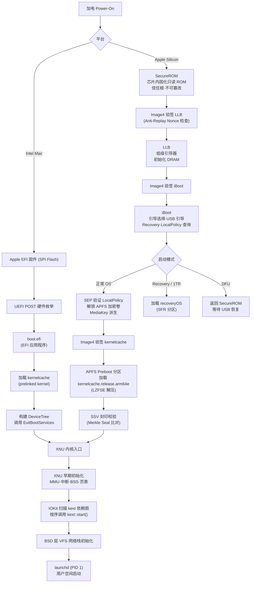

---
tags:
  - 操作系统
  - 启动
  - tier3
  - macos
  - apple-silicon
---
# macOS 启动链：iBoot 与 kernelcache

> [!abstract] TL;DR
> macOS 的启动链在 Intel 与 Apple Silicon 两代平台上走向截然不同的路径。Intel Mac 沿用标准 EFI 固件，由 `boot.efi` 加载 kernelcache 并跳入 XNU；Apple Silicon Mac 则从芯片内部固化的 SecureROM 出发，经 LLB → iBoot 两级引导、Image4 格式验签，再联合 Secure Enclave 协处理器完成对 kernelcache 的加载与度量，最终进入已由 Signed System Volume (SSV) 封印的只读系统卷。整条链路以硬件信任根为锚点，Secure Boot 无法被软件关闭，LocalPolicy 机制以分级安全模式为越狱/降级留出受控窗口——但代价是安全等级的明确降低。理解这条链是 iOS/macOS 安全研究、内核扩展开发、取证工作的必要前置知识。

## 概述与定位

macOS 的启动架构在苹果自研芯片发布之前，实际上是一套"标准 UEFI + Apple 定制引导器"的混合方案。2020 年 Apple Silicon（M1 系列）问世后，苹果将 iPhone/iPad 上已经打磨多年的 iOS 启动哲学——以硬件信任根为核心、链式验签层层递进——完整移植到了桌面平台，形成了目前世界上商用量最大的、端到端硬件保障的 PC 启动体系之一。

本篇在系列整体框架下承接第 13 篇"可信启动与启动安全"（讨论通用 Secure Boot / TPM / dm-verity 理论）和第 14 篇"Windows 启动链 BOOTMGR 与 winload"（另一主流平台实现），横向对比三大桌面平台的引导差异，并为系列 35 "Android 逆向"和 36 "Objective-C 与 iOS 运行时"提供下层基础。

### 两代平台的路径分歧

| 维度 | Intel Mac（2006-2020）| Apple Silicon Mac（2020-至今）|
|---|---|---|
| 固件基础 | 标准 UEFI（Apple 定制固件）| SecureROM（芯片内固化只读 ROM）|
| 第一级加载器 | UEFI 直接调用 `boot.efi` | SecureROM → LLB → iBoot |
| 验签格式 | 苹果专有 + EFI 机制 | Image4 (IMG4) 格式，AAPL 证书链 |
| Secure Enclave | 仅 T2 芯片型号有（2018+）| 深度集成，参与启动度量 |
| 系统卷完整性 | 无封印机制（早期）| Signed System Volume (SSV) |
| 启动策略控制 | 较宽松 | LocalPolicy / Boot Policy，分级安全 |
| 对应 iOS 版本 | 概念相似但路径不同 | 与 iOS 路径高度趋同 |

---

## 原理与机制

### Intel Mac 启动路径

Intel Mac 的启动流程如下：

1. **加电，CPU 在实模式执行固件入口**。苹果的 EFI 固件（存储于主板 SPI Flash，T2 型号额外在 T2 芯片内）完成 POST（Power-On Self Test）和硬件初始化。
2. **UEFI Boot Manager** 读取 NVRAM 变量 `BootOrder`，找到 EFI 系统分区（ESP，GPT 分区类型 `EF00`）上的 `/EFI/APPLE/BOOTX64.EFI` 或经由苹果 APFS 驱动找到预引导分区中的 `boot.efi`。
3. **`boot.efi`** 是苹果编写的 UEFI 应用程序。它：
   - 从 APFS 卷（`Preboot` 分区）加载 `kernelcache`（prelinked kernel）；
   - 解析 kernelcache 中的 XNU 内核 Mach-O 头部；
   - 构建设备树（DeviceTree，DTB），将内存映射、硬件描述传给内核；
   - 通过 EFI Boot Services `ExitBootServices()` 退出 UEFI 环境；
   - 跳转至 XNU 内核入口（`_start` 函数，ARM64 上为 `__start`）。
4. **XNU 内核**接管，在 `start_kernel` 等价函数中完成 BSS 清零、早期 MMU 建立、中断描述符初始化，随后由 `IOKit` 加载内核扩展（kext），最终 `launchd` 作为 PID 1 出现在用户态。

Intel Mac 没有强制的 Secure Boot 至今（部分型号在 T2 芯片协助下有软件验签），这也是为什么 Intel Mac 的越狱/降级研究相对活跃。

### Apple Silicon 启动路径（详细）

Apple Silicon 引入了与 iPhone 高度同构的可信启动链，核心思想是**每一级引导组件验证下一级的签名，且验证密钥固化在硬件中，无法被软件替换**。

#### 1. SecureROM（信任根）

SecureROM 是固化在 SoC（M1/M2/M3/M4）芯片内的**只读引导代码**，存储在无法擦写的 ROM 中。它是整条信任链的根，也是任何攻击者都无法通过软件手段修改的屏障。

SecureROM 的主要职责：
- **硬件检测**：初始化最小化 CPU 状态（MMU 关闭，Cache 关闭）；
- **加载并验签 LLB**（Low Level Bootloader）：从 NAND/NOR 闪存读取 LLB，使用 Image4 格式验证其签名；
- **DFU 模式入口**：若引导失败（LLB 损坏/签名不匹配），或用户强制触发（Mac 为按住电源键通电 10 秒触发 DFU），SecureROM 进入 DFU（Device Firmware Update）模式，此时可通过 USB 与 Apple Configurator 通信，重新烧写固件；
- **JTAG 封闭**：生产版本 SoC 的 JTAG 调试接口被 SecureROM 禁用，研究人员需要使用特殊工程版芯片（SWD 探针访问）。

#### 2. LLB（Low Level Bootloader）

LLB 是第二级引导组件，由 SecureROM 验证并加载。其核心职责：
- 初始化 DRAM 控制器（完成主内存初始化）；
- 初始化 Secure Enclave Processor（SEP）的早期握手；
- 加载并验签 iBoot；
- 传递硬件配置信息（内存大小、Flash 分区表等）给 iBoot。

LLB 以 Image4 格式封装，必须携带苹果签名，降级保护通过 Image4 中的 `BNCN`（Nonce）字段实现（详见下文 Image4 机制）。

#### 3. iBoot

iBoot 是苹果 Apple Silicon 生态中最"厚重"的引导器，类似于标准 PC 的 GRUB/bootmgr，但功能更广：
- **USB 引导支持**：可从外部 USB 驱动器引导；
- **Recovery OS 加载**：加载 recoveryOS（一个精简版 macOS，存储在专用 SFR/iSCPreboot 分区）；
- **OneTrue recoveryOS (1TR) 模式**：仅在用户在开机时长按电源键进入，此模式下可修改 LocalPolicy（降低安全级别）；
- **系统 OS 加载**：正常启动时，iBoot 从 APFS Preboot 分区找到对应系统 OS 的 `kernelcache`，验签后跳入；
- **bootargs 传递**：iBoot 构建内核参数字符串（bootargs），传递给 XNU；
- **设备树注入**：与 `boot.efi` 类似，iBoot 生成 Apple DeviceTree（ADT）格式的硬件描述结构，包含内存映射、外设节点（I2C、SPI 总线上的设备）等。

iBoot 本身也以 Image4 封装，由 LLB 验签。

#### 4. Secure Enclave Processor（SEP）的启动参与

SEP 是 Apple Silicon 内集成的独立安全协处理器，拥有自己的处理核心、ROM、RAM，运行独立固件（sepos），与主 CPU 隔离。在启动阶段，SEP 的参与：
- **Nonce 生成**：SEP 持有 Anti-Replay Nonce，用于 Image4 验签（防止重放降级攻击）；
- **Secure Boot 策略执行**：SEP 存储 LocalPolicy，在 iBoot 请求内核加载时，SEP 验证所请求的安全级别是否被授权；
- **媒体密钥包裹（Media Key Wrapping）**：APFS 加密卷（FileVault 2）的数据密钥由 SEP 内的 UID（Unique ID，设备唯一，不可导出）派生密钥加密，SEP 在启动阶段解密并交给 APFS 驱动。

---

## 结构/算法/伪代码详解

### Image4 (IMG4) 格式

Image4 是苹果自定义的引导组件封装格式，基于 DER（Distinguished Encoding Rules，ASN.1 子集）编码。每个 Image4 文件（扩展名 `.img4` 或内部以 `.im4p` 封装的 payload）包含以下 DER sequence：

```
Image4 ::= SEQUENCE {
    magic       IA5String,        -- 'IMG4'（魔数）
    im4p        IM4P,             -- 实际 payload（可选压缩）
    im4m        IM4M,             -- Manifest（清单，包含签名）
    im4r        IM4R OPTIONAL     -- Restore 信息（含 Nonce）
}

IM4P ::= SEQUENCE {
    magic       IA5String,        -- 'IM4P'
    type        IA5String,        -- 四字符类型码，如 'krnl'（kernel）、'ibot'（iBoot）
    description IA5String,        -- 描述字符串
    data        OCTET STRING,     -- 实际二进制内容（可能是 LZFSE/zlib 压缩后的 Mach-O）
    kbag        OCTET STRING OPT  -- Key Bag（加密组件的解密密钥，SEP 解密）
}

IM4M ::= SEQUENCE {
    magic       IA5String,        -- 'IM4M'
    version     INTEGER,          -- 0
    body        SET {             -- 签名覆盖的数据集
        BORD: Board ID,           -- 目标主板型号
        CHIP: Chip ID,
        SDOM: Security Domain,
        BNCN: Nonce,              -- Anti-Replay Nonce（由 SEP 生成并封存）
        ECID: Exclusive Chip ID,  -- 设备唯一 ID，防止一台设备的 manifest 用于另一台
        DGST: SHA384 哈希（对应 IM4P 内容）
        ...
    },
    signature   OCTET STRING,     -- RSA/ECDSA 签名，苹果私钥签发
    certificates SEQUENCE         -- 证书链（苹果 CA → 中间 CA → 叶节点）
}
```

验签逻辑伪代码（SecureROM / iBoot 内部执行）：

```python
def verify_image4(im4p_bytes: bytes, im4m_bytes: bytes) -> bool:
    im4p = parse_der(im4p_bytes)
    im4m = parse_der(im4m_bytes)

    # 1. 验证证书链，根证书公钥固化在 ROM 中
    if not verify_cert_chain(im4m.certificates, ROM_ROOT_CA_PUBKEY):
        return False

    # 2. 验证 manifest 签名
    leaf_pubkey = im4m.certificates[-1].public_key
    if not verify_signature(im4m.body_bytes, im4m.signature, leaf_pubkey):
        return False

    # 3. 验证当前设备的 Board/Chip/ECID 是否与 manifest 匹配
    if not check_device_identity(im4m.body, DEVICE_BORD, DEVICE_CHIP, DEVICE_ECID):
        return False

    # 4. 验证 Anti-Replay Nonce（防重放降级攻击）
    # SEP 持有当前有效 Nonce；苹果 TSS 服务器签发 manifest 时将设备当前 Nonce 嵌入
    current_nonce = sep_get_current_nonce()
    if im4m.body.BNCN != current_nonce:
        return False  # Nonce 不匹配 → manifest 是旧版本，拒绝

    # 5. 验证 payload 哈希
    actual_hash = sha384(im4p.data)
    if actual_hash != im4m.body.DGST:
        return False

    return True
```

关键防降级机制：BNCN（Nonce）由 SEP 随机生成并只在 SEP 内部存储，每次成功启动后可能更换。苹果 TSS（Tatsu Signing Server）在为设备签发 manifest 时将 Nonce 嵌入其中，所以一份旧签名的 manifest 在 Nonce 更换后即失效——即使攻击者保存了旧版本的 `.im4m`，也无法在新 Nonce 下通过验证。这就是苹果"关窗口"（close signing window）停止为旧固件版本签发 manifest 的底层机制。

### kernelcache 与 prelinked kernel

kernelcache 是 macOS 启动的核心组件，本质上是**将 XNU 内核与一批预链接的内核扩展（kext）合并打包**的单一 Mach-O 文件。

#### 组成结构

```
kernelcache（Mach-O, filetype: MH_FILESET 或 MH_EXECUTE）
├── __TEXT segment         -- XNU 内核代码（x86_64 或 arm64e）
├── __DATA segment         -- XNU 数据段
├── __LINKEDIT segment     -- 符号表、重定位
├── kext[0]: com.apple.iokit.IOPCIFamily
│   ├── __TEXT_EXEC        -- kext 代码
│   └── __DATA_CONST       -- kext 只读数据
├── kext[1]: com.apple.driver.AppleACPIEC
│   └── ...
├── kext[N]: com.apple.security.sandbox
│   └── ...
└── Prelink info section   -- plist 格式的 kext 元数据，包含 OSBundleIdentifier、版本、依赖
```

在 Apple Silicon 上，kernelcache 采用新的 `MH_FILESET` 格式（Mach-O filetype = 12），其中每个 kext 作为独立的 fileset entry 存在，拥有独立的 UUID 和基地址，便于 ASLR（内核 KASLR）的独立随机化。

#### kernelcache 的构建

在 macOS 系统上，kernelcache 不是安装时预建好的静态文件，而是根据当前安装的 kext 动态生成的，工具为 `kcditto` / `kmutil`：

```bash
# 现代 macOS 使用 kmutil 构建 kernelcache
kmutil create \
    --kernel /System/Library/Kernels/kernel \
    --volume-root / \
    --boot-path /System/Library/Caches/com.apple.kext.caches/Startup/kernelcache
```

Apple Silicon 上的 kernelcache 存储在 APFS Preboot 分区的路径类似：

```
/System/Volumes/Preboot/<UUID>/boot/
    ├── kernelcache.release.arm64e  -- LZFSE 或 zlib 压缩，Image4 封装
    └── SystemVersion.plist
```

#### kext 加载机制

Apple Silicon 上 kext 在 kernelcache 中是**预链接**的（pre-linked），即编译期已完成链接，只有少数地址需要在加载时修正（KASLR slide 重定位）。IOKit 框架在 XNU 早期初始化时扫描 kernelcache 中所有 kext 的 `OSBundleIdentifier`，构建依赖图，按依赖顺序调用各 kext 的 `start()` 函数（IOKit 驱动则调用 `IOService::start()`）。

用户态动态加载 kext（第三方驱动）在 macOS Ventura (13) 后被 System Extensions 和 DriverKit 彻底替代，传统 `/Library/Extensions/` 下的 `.kext` 包已不再以内核态直接加载为推荐方案。DriverKit 驱动运行在用户态，通过 Mach IPC 与内核 I/O Kit 交互，崩溃不再导致内核 panic。

### Signed System Volume (SSV) 与封印快照

SSV 是 macOS Big Sur（11.0）引入的系统完整性机制，与 Linux dm-verity 目标相同但实现细节不同。

#### 技术原理

SSV 将系统卷（`/System/Volumes/System`，APFS 卷）的整个内容建立为一棵 **Merkle Tree**，根哈希（称为"Seal"）由苹果签名并写入系统快照（APFS Snapshot）的元数据。

快照相关 APFS 结构：

```
APFS Container
└── APFS Volume: "Macintosh HD" (System)
    ├── APFS Snapshot: "com.apple.os.update-<UUID>"
    │   ├── snapshot_xid: 快照事务 ID
    │   └── 所有文件的 Merkle 封印哈希
    └── Live Filesystem（通常挂载为只读 overlay）
```

XNU 在挂载系统卷时，内核中的 `apfs_mount` 会：
1. 找到系统卷上的已封印快照；
2. 从快照元数据中读取根 Seal 哈希；
3. 比对苹果签名的预期哈希值（嵌入 `boot.efi` 或 iBoot 传入的参数中）；
4. 不匹配则拒绝挂载，系统无法启动。

访问任何系统文件时，APFS 按路径在 Merkle Tree 中验证该文件的哈希，防止运行时文件被篡改。

SSV 也是为什么从 Big Sur 起无法直接修改 `/System` 目录下文件的根本原因——修改会破坏 Seal，导致下次启动失败。取而代之的是 Firmlinks（APFS 固链），系统在 `/System/Volumes/Data` 上维护用户可写内容，通过 Firmlink 与只读系统卷叠合呈现统一的文件系统视图。

### LocalPolicy 与启动安全级别

Apple Silicon 引入 LocalPolicy，取代 Intel Mac T2 上的固件密码机制，以更精细的安全级别管理启动行为。

LocalPolicy 存储在 Secure Enclave 内，不是普通文件。可通过 `bputil` 工具查询（需要 1TR 模式下运行）：

```bash
# 必须在 1TR (One True recoveryOS) 模式下运行
bputil -g  # 获取当前 LocalPolicy 摘要
```

LocalPolicy 定义的三个安全级别：

| 安全级别 | 含义 | 启用后果 |
|---|---|---|
| **Full Security**（完整安全）| 仅运行由苹果认证的 macOS，自动 OCSP 检查软件证书吊销状态 | 无法启动第三方操作系统、无法加载未签名 kext |
| **Reduced Security**（降低安全）| 允许加载用户批准的 kext（不在苹果官方 SIP 白名单中的驱动）、允许旧版 macOS | 可安装第三方内核扩展（如 VirtualBox、Parallels Desktop 旧版驱动层）|
| **Permissive Security**（宽松安全）| 关闭 Secure Boot 验签，允许自定义内核（如内核研究者使用的 custom XNU build）| 安全链断裂，完全信任本地代码，SSV 仍可选择绕过 |

修改安全级别的操作**必须在 1TR 模式**（One True recoveryOS）下执行，1TR 是苹果对降级操作设置的"仪式性屏障"——攻击者必须物理接触机器、长按电源键通电，这排除了远程攻击者通过软件漏洞静默降级安全策略的可能性。

### Apple Silicon 启动模式详解

```
┌─────────────────────────────────────────────────────────────┐
│                   Apple Silicon 启动模式                     │
│                                                             │
│  正常启动     → SecureROM → LLB → iBoot → OS               │
│                                                             │
│  Recovery     → SecureROM → LLB → iBoot → recoveryOS       │
│  (按住电源键通电)                  (存储在 SFR 分区)          │
│                                                             │
│  1TR           → 同上，但进入 One True recoveryOS            │
│  (通电后立即按 │  可修改 LocalPolicy、关闭/开启 SIP           │
│   住电源键)    │  可 Erase All Content、重新配对 SEP          │
│                                                             │
│  DFU 模式      → SecureROM（停在此处）                       │
│  (硬件触发：   │  等待 USB 连接 Apple Configurator 2         │
│   通电按住     │  可完整重刷固件（仅苹果签名包）               │
│   10秒)        │                                            │
└─────────────────────────────────────────────────────────────┘
```

DFU 模式的细节：Mac 的 DFU 是硬件级别的最后救援手段。SecureROM 暴露一个极简 USB 协议接口（基于 Apple 私有协议，Checkm8 利用其 USB handler 漏洞），Apple Configurator 2 通过此接口上传 IPSW（类 iOS 固件包）格式的恢复镜像，每个组件仍需苹果签名，SecureROM 仍会验签。

---

## 结构/算法/伪代码详解（启动链时序图）

下图以 Apple Silicon 正常启动为主线，同时标注 Intel Mac 分支：



---

## 工具视角与实战

### 查看当前系统的 kernelcache 信息

```bash
# 查看 kernelcache 路径（macOS Monterey+）
kmutil inspect

# 查看已加载的 kext 列表
kextstat | head -30

# Apple Silicon 上查看 kernelcache 文件
ls -lh /System/Volumes/Preboot/$(ls /System/Volumes/Preboot/)/boot/

# 用 jtool2（第三方工具）解析 kernelcache
# https://www.newosxbook.com/tools/jtool.html
jtool2 --analyze /path/to/kernelcache
jtool2 --seg __TEXT kernelcache | head -20

# lipo 查看 kernelcache 架构（通常为 arm64e on Apple Silicon）
lipo -info kernelcache
```

### 提取 kernelcache 中的 kext

```bash
# 使用 kmutil 提取（macOS 12+）
kmutil extract --kernel kernelcache \
    --output /tmp/kexts-extracted/

# 手动提取（旧版工具 kextextract）
kextextract -f kernelcache -o /tmp/kexts/

# 用 joker（第三方工具）解析 MH_FILESET 格式 kernelcache
joker.linux -e com.apple.security.sandbox kernelcache
```

### 查看 Image4 信息

```bash
# img4tool（https://github.com/tihmstar/img4tool）
img4tool -i kernelcache.release.arm64e

# 输出示例：
# IM4P tag: krnl
# version: 
# 
# IM4M found:
#     BORD: 0x10 (Board: j274ap)
#     CHIP: 0x8103
#     ECID: 0x1234567890ABCDEF
#     BNCN: <Nonce 已体现签名时刻的时效性>
```

### 查看 LocalPolicy 与安全状态

```bash
# 在正常启动的 macOS 中查看 SIP 状态
csrutil status
# → System Integrity Protection status: enabled.

# 在 1TR 中（recoveryOS 终端）
bputil -g
# 输出 LocalPolicy 内容，包含安全级别、已批准 kext 列表等

# 查看 Secure Boot 状态（Intel T2 Mac）
system_profiler SPiBridgeDataType | grep "Secure Boot"
```

### SSV 快照验证

```bash
# 查看系统卷的 APFS 快照
diskutil apfs listSnapshots disk3s1

# 输出示例：
# Snapshots for disk3s1 (2 found)
# +-- com.apple.os.update-<UUID>
#     |-- Created: 2024-10-15T18:22:00Z
#     |-- XID: 54321
#     +-- Purgeable: No (Sealed System Volume Seal)

# 验证封印状态
diskutil apfs verifySnapshot disk3s1 com.apple.os.update-<UUID>
```

### iBoot 日志（开发者/研究者）

在 Apple Silicon 开发机（Apple Developer Transition Kit 或特殊工程版本）上，可通过 UART/SWD 读取 iBoot 串口日志。生产机上，部分 iBoot 日志存储在 NVRAM panic log 区域，可通过：

```bash
nvram -p | grep -i boot
# 查看 boot-args、上次 panic 信息等
```

### 使用 `kmutil` 管理 kext（macOS Ventura+）

```bash
# 查看所有可用 kext
kmutil inspect --show-mutable-collections

# 批准第三方 kext（需要降低安全级别至 Reduced Security）
# 第三方 kext 安装后首次加载需要用户在 System Preferences 中批准
# 或用命令行（需管理员权限 + SIP 部分关闭）
kmutil load -p /Library/Extensions/SomeDriver.kext

# 重建 kernelcache（安装/移除 kext 后）
kmutil create --new boot
```

---

## 安全性与正确使用

### 可信启动链的安全意义

macOS Apple Silicon 的启动链是目前消费级计算设备中安全性最高的实现之一，其关键安全属性：

1. **不可旁路的信任根**：SecureROM 固化在芯片内，软件攻击无法修改。即使操作系统完全被攻陷，下次重启后 SecureROM 会重新建立信任链。这与 x86 平台 UEFI Secure Boot 的根本区别在于：UEFI 固件本身存储在可（用特殊工具）擦写的 SPI Flash 上，而 SecureROM 物理上不可写。

2. **设备绑定的签名**（ECID 机制）：每份 Image4 manifest 包含目标设备的 ECID（Exclusive Chip Identifier，类似序列号的唯一标识符），使得"签名窃取"攻击失效——A 设备签过的 manifest 无法用于 B 设备，即使两台设备运行相同 macOS 版本。

3. **时效性 Nonce 防降级**：BNCN Nonce 机制使得一台设备停止接收旧版签名后，即使攻击者持有旧版固件，也无法重放安装（苹果"关签"后即失效）。

4. **SEP 隔离**：SEP 运行独立固件（sepos），主 CPU 无法直接访问 SEP 内存，密钥材料（UID 派生的加密密钥、LocalPolicy）无法通过软件手段导出。即使攻击者获得内核代码执行权，仍无法直接读取 SEP 内的密钥。

5. **SSV 运行时完整性**：系统卷的 Merkle Seal 在挂载时验证，访问时按路径验证，修改系统文件不仅会在启动时被拒，在运行时对 `/System` 的写操作也被 SIP（System Integrity Protection）在内核层拦截（`mac_vnode_check_open` MAC 框架回调）。

### SSV 与 SIP 的分工

```
攻击面分层防御：

  用户态攻击者
       ↓
  SIP（System Integrity Protection）
    - 内核 MAC 框架阻止对 /System /usr /bin /sbin 的写操作
    - rootless 设计：即使 root 也无法写系统路径
       ↓（SIP 如果被关闭...）
  SSV 封印校验（APFS Merkle Seal）
    - 修改了文件 → 下次启动 Seal 不匹配 → 系统无法挂载
       ↓（如果有 iBoot 漏洞...）
  Image4 验签
    - kernelcache/iBoot 必须有苹果签名
       ↓（如果找到 SecureROM 漏洞...）
  SecureROM 硬件信任根
    - 物理只读，无法被软件攻击
```

### 越狱与降级的原理（防御视角）

"越狱"（Jailbreak）在 iOS/macOS 语境中，本质是在信任链的某个环节找到漏洞，绕过 Secure Boot 或 SIP 的限制，以获得未签名代码的执行权或对系统卷的写权限。

**历史上已知的攻击面**：

- **SecureROM 漏洞（如 Checkm8）**：2019 年公开的 A5–A11 芯片 SecureROM USB 处理器堆溢出漏洞。由于 SecureROM 不可修补（只读），受影响设备永久可被利用（但仅 DFU 模式下，需物理接触）。Apple Silicon 的 SecureROM 已修复同类问题。
- **iBoot 逻辑漏洞**：iBoot 运行在更复杂的环境中，历史上出现过验签绕过（如 iOS 9.3.x 时代的多个 iBoot bug）。
- **内核漏洞链**：即使启动链完整，内核中的 UAF/类型混淆漏洞可在运行时获取内核权限，配合内核 patch 技术（KPP/PAC 绕过）实现越狱。Apple Silicon 上 Pointer Authentication Code（PAC，arm64e 指令集扩展）大幅增加了 ROP/JOP 链的难度。

**防御角度的关键结论**：
- 保持系统在 Full Security 级别，不轻易降低安全等级；
- 避免在 1TR 模式下操作 LocalPolicy，除非有明确的测试/研究需求；
- 理解 SEP 的密钥封闭性：设备一旦被攻击者获得物理访问并进入 DFU，数据加密密钥在 SEP 没有被攻破的情况下，加密数据仍受保护（Activation Lock + UID 派生密钥机制）。

### FileVault 2 与启动链的交互

FileVault 2 是 macOS 的全盘加密方案，其与启动链的关系：

- 加密密钥（Volume Encryption Key, VEK）由 SEP 内的 UID 派生密钥封装；
- iBoot 在加载 kernelcache 前，需先让 SEP 解封 VEK，才能读取加密的 APFS 卷内容（Preboot 分区本身不加密，kernel 加密）；
- 用户密码（或 Recovery Key）用于解锁 Keychain 中的 KEK（Key Encryption Key），KEK 再解封 VEK——整个层次架构确保 SEP 内的硬件密钥从不离开 SEP。

---

## 与 iOS 启动链的对比

iOS 和 macOS Apple Silicon 共享大量启动基础设施，差异主要在策略层：

| 维度 | iOS（iPhone/iPad）| macOS (Apple Silicon)|
|---|---|---|
| SecureROM | 相同架构，同厂商设计 | 相同（M 系列 SoC）|
| LLB | 存在（相同角色）| 存在（相同角色）|
| iBoot | 功能相同，无 USB 引导 UI | 支持 USB 引导、有 recoveryOS 菜单 |
| Image4 验签 | 完全相同格式 | 完全相同格式 |
| ECID 绑定 | 是 | 是 |
| kernelcache | XNU（iOS 变种），kext 更少 | XNU（macOS 变种），kext 更多 |
| SSV | iOS 14+ 系统卷封印 | macOS Big Sur+ |
| 越狱入口 | 内核漏洞为主（无 1TR 等价物）| 1TR 可降低安全级别（合法使用）|
| 第三方 OS | 完全不支持 | 支持（降低安全级别后）|
| 安全级别修改 | 无法修改（硬编码 Full Security）| LocalPolicy（三级，1TR 中修改）|

最大差异在于 macOS 提供了 **LocalPolicy 分级安全** 机制，而 iOS 没有（固定 Full Security），这是 Apple 对"桌面平台需要更多灵活性（第三方驱动、双系统、内核研究）"的妥协。

---

## 小结

macOS 的启动链是苹果十余年 iOS 安全架构打磨成果在桌面平台的集成呈现。核心设计哲学一以贯之：**以不可修改的硬件为信任锚，以链式签名验证为传导机制，以时效 Nonce 为防降级屏障，以 SSV 封印和 SEP 密钥隔离为运行时保障**。

关键技术要点回顾：

1. **Intel Mac** 走标准 EFI + `boot.efi` + kernelcache 路径，Secure Boot 保障较弱，历史上是越狱研究的主战场。

2. **Apple Silicon** 从 SecureROM 出发，LLB → iBoot → kernelcache 三级验签，每级均以 Image4 格式封装、苹果私钥签发、ECID 绑定、Nonce 防重放。

3. **Image4** 是苹果定义的 DER 编码验签格式，`IM4P`（payload）+ `IM4M`（manifest + 签名）+ `IM4R`（Nonce 容器）三部分构成，BNCN 字段是防降级的关键。

4. **SEP** 在启动过程中持有 Nonce、存储 LocalPolicy、派生 FileVault 媒体密钥，是与主 CPU 完全隔离的安全岛屿。

5. **kernelcache** 是 XNU + 预链接 kext 的单一 Mach-O（`MH_FILESET`），APFS Preboot 分区存储，iBoot 加载并跳入，IOKit 在内核早期初始化阶段按依赖图启动各 kext。

6. **SSV** 以 APFS Merkle Seal 封印系统卷快照，挂载时验证，运行时 SIP 阻写，形成启动后完整性保障。

7. **LocalPolicy** 以三级安全模式为研究者/开发者保留灵活窗口，但修改必须通过 1TR（物理操作），阻断远程软件降级攻击。

理解这条链路是 macOS/iOS 安全研究、内核扩展开发（DriverKit 时代前）、取证分析（SEP 密钥边界）的必要前置知识，也是对比研究三大桌面平台启动架构的关键拼图。

---

## 相关阅读

- **系列内部**
  - [[02.BIOS与UEFI固件]] — UEFI 固件基础，Intel Mac 启动的前置知识
  - [[13.可信启动与启动安全]] — Secure Boot / TPM / dm-verity 通用理论
  - [[14.Windows启动链BOOTMGR与winload|← 上一章]] — Windows 启动链对比视角

- **苹果官方文档**
  - [Apple Platform Security Guide](https://support.apple.com/guide/security/welcome/web)（每年更新，包含 iBoot / SEP / SSV 完整描述）
  - [WWDC 2020: Secure Enclave](https://developer.apple.com/videos/play/wwdc2020/10276/)
  - [WWDC 2020: What's New in System Extensions and DriverKit](https://developer.apple.com/videos/play/wwdc2020/10017/)

- **深度研究与逆向参考**
  - Jonathan Levin《*macOS and iOS Internals* Volume I》(Technologeeks Press)
  - [*The iPhone Wiki*（非官方 iOS 启动链详解）](https://www.theiphonewiki.com/wiki/Bootchain)
  - [*Secrets of the Bootloader*（xerub 等研究者文章）](https://sploitfun.wordpress.com/)
  - [img4tool GitHub](https://github.com/tihmstar/img4tool) — Image4 解析工具
  - [iBoot 源码泄露分析（2018，iOS 9 iBoot）](https://www.theiphonewiki.com/wiki/iBoot_Source_Code_Leak)

[[00.操作系统加载与启动总览|⬆ 系列总览]] | [[14.Windows启动链BOOTMGR与winload|← 上一章]] | [[16.Android启动链AVB与vbmeta|→ 下一章]]
