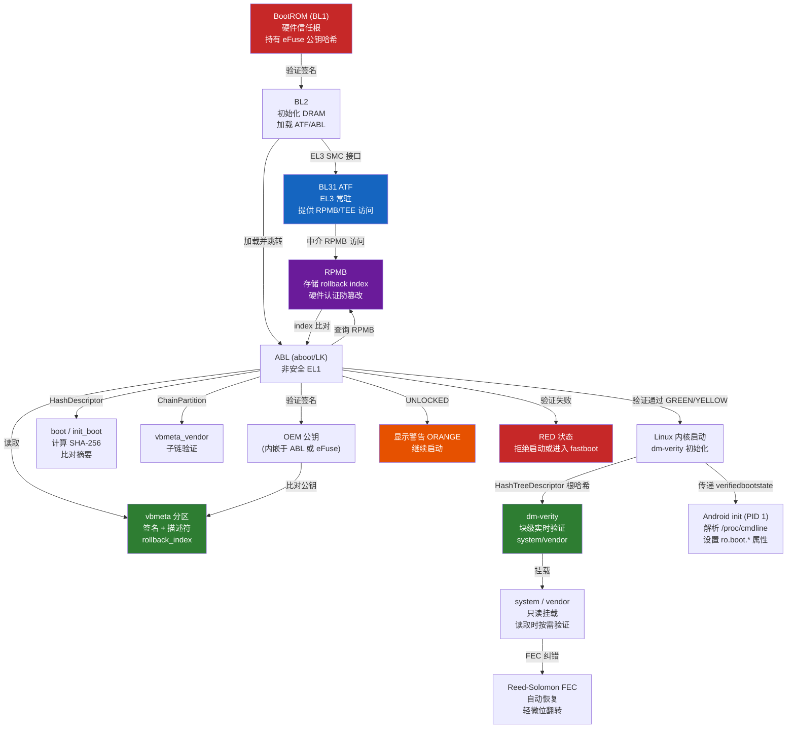

---
tags:
  - 操作系统
  - 启动
  - tier3
  - android
  - AVB
---
# Android 启动链：AVB 与 vbmeta

> [!abstract] TL;DR
> Android 的启动链在 ARM Trusted Firmware 的硬件信任根之上，叠加了一套完整的软件可信启动框架——Android Verified Boot 2.0（AVB）。其核心是 `vbmeta` 分区：一个存放签名、哈希描述符和防回滚索引的元数据枢纽。启动器（ABL）读取 `vbmeta`，沿链验证 `boot`/`system`/`vendor` 等分区的完整性；运行时由 `dm-verity` 持续守护 `system`/`vendor` 分区的块级一致性。任何篡改都会导致设备降级到"橙/红"信任态，`ro.boot.verifiedbootstate` 属性会将这一状态暴露给用户态。GKI（通用内核镜像）时代引入 `init_boot` 与 `vendor_boot` 将通用组件与厂商代码彻底解耦，A/B 双槽无缝更新则进一步保证 OTA 期间始终有可信的已验证槽可回退。

## 概述与定位

Android 不是一个单一的操作系统镜像，而是由数十个分区拼合而成的复合系统：`boot`、`system`、`vendor`、`product`、`odm`、`system_ext` 各司其职。这种分区化设计极大地方便了 OTA 差量更新和供应商定制，但也带来了完整性验证的难题——攻击者只需替换任意一个分区就能在用户不知情的情况下植入恶意代码。

Android Verified Boot（AVB）正是为解决这一威胁而生。AVB 2.0 是 Google 在 2017 年 Android 8.0（Oreo）后全面推广、到 Android 10 强制要求的方案，其设计原则是：

1. **链式信任（Chain of Trust）**：每一级只验证下一级，信任向上传递，最终锚定在硬件（BootROM / Secure Enclave）持有的设备密钥。
2. **最小可信计算基（TCB）**：BootROM 和 BL1 等早期固件是 TCB 的基础，它们代码量极少、不可修改，是整条链的信任起点。
3. **失败时可见而非静默**：即使 bootloader 被解锁，启动仍会继续，但 `verifiedbootstate` 会被标记，系统会向用户展示警告，密钥派生材料也会随状态变化而变化。
4. **防回滚（Anti-rollback）**：通过存储在熔丝（eFuse/RPMB）中的 rollback index 阻止已修补的安全漏洞被旧版本镜像利用。

本篇在系列的坐标：第 04 篇讲了 U-Boot（通用嵌入式引导器），第 13 篇简介了 dm-verity 在 Linux 可信启动中的角色；本篇专注 Android 自成体系的 AVB 全貌，与系列 35（Android 逆向与运行时）形成前后衔接——AVB 是 Android 安全模型的启动侧基础，逆向分析需要先理解它。

---

## 原理与机制

### ARM 启动层级：从 BootROM 到 ABL

Android 设备几乎全部运行在 ARM 架构上，其启动链遵循 ARM Trusted Firmware（ATF/TF-A）规范的分层结构：

```
BootROM (BL1)
   │  芯片固化、不可修改、持有硬件公钥
   ▼
BL2 (Trusted Boot Firmware)
   │  初始化 DRAM、验证 BL31/BL32
   ▼
BL31 (EL3 Runtime Firmware / ATF)
   │  运行在 EL3（最高特权级）
   │  提供 SMC（Secure Monitor Call）接口
   │  持续驻留、管理安全/非安全世界切换
   ▼
BL32 (Trusted OS / TEE，可选)      BL33 (Normal World BL = ABL)
   │  如 OP-TEE、Qualcomm QTEE          │  Android Bootloader
   │  运行在 Secure EL1                 │  运行在 EL1/EL2（非安全世界）
   ▼                                   ▼
                                  [AVB 验证]
                                       │
                                  Linux 内核 + initramfs
                                       │
                                  Android init (PID 1)
                                       │
                                  Zygote → System Server → App
```

**BootROM（BL1）** 是整条链的硬件信任根。它固化在芯片内部的 ROM 中，上电后最先执行，主要职责是：验证 BL2 的签名（使用烧录在 eFuse 中的公钥哈希）、将 BL2 加载到 SRAM 并跳转。BootROM 本身无法被软件修改，这是"硬件信任根"概念的物理体现。

**BL2** 完成更复杂的硬件初始化（DDR、时钟），然后加载并验证 BL31（EL3 运行时）、BL32（TEE，如有）和 BL33（非安全引导器，即 ABL）。

**BL31（ATF EL3 Runtime）** 在整个系统生命周期内驻留在 EL3，为 BL32/BL33 提供 SMC 服务：安全存储访问（RPMB）、密钥导出、可信执行环境入口等。

**ABL（Android Bootloader）** 是非安全世界的第一个完整引导器，在高通平台称为 `aboot` 或 LK（Little Kernel），在 MTK 平台有类似实现，Google Pixel 设备使用基于 U-Boot 或自研的 ABL。ABL 的核心职责：

- 解析分区表，定位 `vbmeta` 分区
- 调用 `libavb` 执行 AVB 验证流程
- 根据验证结果和 bootloader 锁定状态决定是否继续启动
- 加载 `boot`（或 `boot_a`/`boot_b`）分区到内存，跳转到内核

### Android Verified Boot 2.0（AVB）架构

AVB 2.0 是 AOSP 项目中的独立库（`external/avb`），实现了一套可被任何引导器调用的验证 API。其验证流程可以分为三个层次：

**层次一：非对称签名验证**

`vbmeta` 分区的末尾包含一个 AVB Footer（4096 字节对齐），其中的签名使用 RSA-2048/RSA-4096 或 ECDSA-256/ECDSA-512 算法。ABL 持有（或通过 TEE 访问）对应的**设备根公钥**，对 `vbmeta` 结构体执行签名验证，确认它是由合法签名者（通常是设备 OEM）发布的。

**层次二：哈希描述符链（Hash Descriptor Chain）**

`vbmeta` 内部包含若干**描述符（Descriptor）**，每个描述符对应一个分区的完整性信息：
- `HashDescriptor`：存储分区内容的 SHA-256 哈希（适用于 `boot`、`init_boot` 等整体加载的小分区）
- `HashTreeDescriptor`：存储 dm-verity 哈希树的根哈希（适用于 `system`、`vendor` 等大分区，运行时块级验证）
- `ChainPartitionDescriptor`：指向另一个分区的 vbmeta 子结构（链式委托，允许 OEM 独立签名 `vendor` 分区）
- `KernelCmdlineDescriptor`：追加到内核命令行的参数（如 `androidboot.verifiedbootstate`）
- `PropertyDescriptor`：任意键值对属性

**层次三：防回滚索引（Rollback Index）**

`vbmeta` 结构体中包含一组 `rollback_index[n]`（最多 8 个槽位）。ABL 将这些值与存储在 RPMB（Replay Protected Memory Block，eMMC/UFS 的安全分区）中的持久化索引对比：

- 如果镜像的 rollback_index < RPMB 中的值：拒绝启动（防止回滚到旧版本）
- 如果镜像的 rollback_index == RPMB 中的值：正常启动
- 如果镜像的 rollback_index > RPMB 中的值：启动成功后将 RPMB 中的值更新（棘轮前进，不可逆）

RPMB 通过 eMMC/UFS 控制器的硬件认证机制防止未授权写入，即使拥有 root 权限也无法直接修改其中的 rollback index（需要通过可信 TEE 应用来完成写入）。

### dm-verity：运行时块级完整性验证

`dm-verity` 是 Linux Device Mapper 框架的一个目标（target），在 Android 中用于保护已挂载的 `system`/`vendor` 等分区。其原理与 Merkle 哈希树完全一致：

1. 将分区按 4KB 块划分
2. 对每个数据块计算 SHA-256 哈希，形成叶节点层
3. 将叶节点的哈希两两合并，递归向上构建哈希树，直至根节点
4. **根哈希（Root Hash）** 存储在 `vbmeta` 的 `HashTreeDescriptor` 中，被 AVB 签名保护

当内核挂载 `system` 分区时，实际上是通过 `dm-verity` 设备映射层访问底层块设备。每次读取一个 4KB 块时，`dm-verity` 驱动会：
1. 读取对应的叶节点哈希（从哈希树分区读取）
2. 计算数据块的实际哈希
3. 比对；不一致则返回 I/O 错误（或触发 panic，取决于配置的 `dm-verity` 模式）

**FEC（Forward Error Correction，前向纠错）**：Android 的 `dm-verity` 实现在哈希树之外还附加了 Reed-Solomon FEC 数据。FEC 可以在检测到数据块损坏时（如存储介质翻转）自动纠错恢复，而不是直接报 I/O 错误，提升了实际设备上的健壮性。FEC 数据本身也受 `vbmeta` 签名保护（其大小和偏移存储在 `HashTreeDescriptor` 中）。

### bootloader 锁定状态与信任态

AVB 的最终输出是一个**验证启动状态（Verified Boot State）**，通过 `ro.boot.verifiedbootstate` 属性暴露到用户态：

| 状态 | 英文 | 含义 |
|---|---|---|
| **GREEN** | LOCKED + 验证通过 | 设备已锁定，所有镜像均通过 OEM 根密钥验证 |
| **YELLOW** | LOCKED + 自定义密钥 | 设备已锁定，但使用了用户自行注册的公钥（替换了 OEM 密钥） |
| **ORANGE** | UNLOCKED | bootloader 已解锁，AVB 验证被绕过，设备启动时显示警告 |
| **RED** | 验证失败 | 镜像签名验证失败或被检测为损坏，通常拒绝启动（或仅进入 fastboot） |

**关键安全含义**：在 GREEN 状态下，Android Keystore 和 StrongBox 可以将加密密钥与设备状态绑定（使用 `KM_TAG_ROLLBACK_RESISTANCE`）。若状态变为 ORANGE 或 RED，相关密钥将无法导出，保护用户数据不被离线攻击提取——即使攻击者物理获取了设备，也无法绕过 Full-Disk Encryption（FDE）或 File-Based Encryption（FBE）的密钥派生。

---

## 结构/算法/伪代码详解

### vbmeta 分区内部结构

`vbmeta` 分区是 AVB 的核心数据结构，其布局如下（所有字段大端序）：

```
vbmeta 分区（通常 64 KB）
┌─────────────────────────────────────────────────────────┐
│  AVB Magic: "AVB0" (4 bytes)                           │
│  Header Version (major.minor, 8 bytes)                  │
│  Authentication Block Size (8 bytes)                    │
│  Auxiliary Block Size (8 bytes)                         │
│  Algorithm Type (4 bytes) [SHA256_RSA2048, etc.]        │
│  Hash Offset in Auth Block (8 bytes)                    │
│  Hash Size (8 bytes)                                    │
│  Signature Offset in Auth Block (8 bytes)               │
│  Signature Size (8 bytes)                               │
│  Public Key Offset in Aux Block (8 bytes)               │
│  Public Key Size (8 bytes)                              │
│  Public Key Metadata Offset/Size (8+8 bytes)            │
│  Descriptor Offset in Aux Block (8 bytes)               │
│  Descriptor Size (8 bytes)                              │
│  Rollback Index (8 bytes) ← 核心防回滚字段              │
│  Flags (4 bytes) [HASHTREE_DISABLED, etc.]              │
│  Rollback Index Location (4 bytes) [0-7]                │
│  Release String (48 bytes, NUL-terminated)              │
│  Reserved (80 bytes)                                    │
├─────────────────────────────────────────────────────────┤
│  Authentication Block                                    │
│    Hash of Header + Auxiliary Block (SHA-256/512)       │
│    Signature (RSA/ECDSA) of above Hash                  │
├─────────────────────────────────────────────────────────┤
│  Auxiliary Block                                         │
│    Public Key (SubjectPublicKeyInfo DER 格式)            │
│    Public Key Metadata (可选)                            │
│    Descriptors (变长，依次排列)                           │
│      HashDescriptor × n                                 │
│      HashTreeDescriptor × m                             │
│      ChainPartitionDescriptor × k                       │
│      KernelCmdlineDescriptor × j                        │
│      PropertyDescriptor × p                             │
└─────────────────────────────────────────────────────────┘
```

**验证过程算法伪代码**（简化自 `external/avb/libavb/avb_vbmeta_image.c`）：

```python
def avb_verify_vbmeta(partition_data: bytes, trusted_pubkey: bytes) -> AvbResult:
    header = parse_vbmeta_header(partition_data)
    
    # 步骤1：检查 Magic
    if header.magic != b"AVB0":
        return AVB_ERROR_INVALID_MAGIC
    
    # 步骤2：计算 header + auxiliary block 的哈希
    data_to_hash = header_bytes + auxiliary_block_bytes
    if header.algorithm == SHA256_RSA2048:
        computed_hash = sha256(data_to_hash)
    elif header.algorithm == SHA512_RSA4096:
        computed_hash = sha512(data_to_hash)
    
    # 步骤3：与 authentication block 中存储的哈希比对
    stored_hash = auth_block[header.hash_offset : header.hash_offset + header.hash_size]
    if computed_hash != stored_hash:
        return AVB_ERROR_HASH_MISMATCH
    
    # 步骤4：验证签名（使用镜像内嵌公钥或信任锚公钥）
    signature = auth_block[header.sig_offset : header.sig_offset + header.sig_size]
    pubkey_in_image = aux_block[header.pubkey_offset : header.pubkey_offset + header.pubkey_size]
    
    if trusted_pubkey is not None:
        # LOCKED 状态：必须与 OEM 预置的受信任公钥完全匹配
        if pubkey_in_image != trusted_pubkey:
            return AVB_ERROR_PUBLIC_KEY_REJECTED
    
    if not rsa_verify(signature, stored_hash, pubkey_in_image):
        return AVB_ERROR_SIGNATURE_INVALID
    
    # 步骤5：解析描述符并验证各分区
    for descriptor in parse_descriptors(aux_block):
        if isinstance(descriptor, HashDescriptor):
            actual_hash = sha256(load_partition(descriptor.partition_name))
            if actual_hash != descriptor.digest:
                return AVB_ERROR_HASH_MISMATCH
        elif isinstance(descriptor, HashTreeDescriptor):
            # dm-verity 根哈希将被传给内核，运行时验证由 dm-verity 驱动完成
            pass  
        elif isinstance(descriptor, ChainPartitionDescriptor):
            # 递归验证子 vbmeta
            sub_result = avb_verify_vbmeta(
                load_partition(descriptor.partition_name),
                trusted_pubkey=descriptor.public_key_blob  # 子链使用其自己的公钥
            )
            if sub_result != AVB_OK:
                return sub_result
    
    # 步骤6：防回滚检查
    stored_rollback = read_rpmb_rollback_index(header.rollback_index_location)
    if header.rollback_index < stored_rollback:
        return AVB_ERROR_ROLLBACK_INDEX
    
    return AVB_OK
```

### HashTreeDescriptor 与 dm-verity 哈希树

```
system 分区 (例: 4 GB)
├── 数据块 0 (4KB)  → hash_0 = SHA256(block_0)
├── 数据块 1 (4KB)  → hash_1 = SHA256(block_1)
├── ...
└── 数据块 N (4KB)  → hash_N = SHA256(block_N)

Level 0 (叶节点):  [hash_0, hash_1, ..., hash_N]
Level 1:           [SHA256(hash_0||hash_1), SHA256(hash_2||hash_3), ...]
...
Level K (根):      [root_hash]  ← 存储在 HashTreeDescriptor.root_digest
```

`HashTreeDescriptor` 字段：

```
struct AvbHashtreeDescriptor {
    uint64_t image_size;          // 被保护的分区数据大小
    uint64_t tree_offset;         // 哈希树相对于分区起始的偏移
    uint64_t tree_size;           // 哈希树占用空间
    uint32_t data_block_size;     // 通常 4096
    uint32_t hash_block_size;     // 通常 4096
    uint32_t fec_num_roots;       // FEC Reed-Solomon 的根数（如 2）
    uint64_t fec_offset;          // FEC 数据偏移
    uint64_t fec_size;            // FEC 数据大小
    uint8_t  hash_algorithm[32];  // "sha256" 或 "sha512"（NUL-terminated）
    uint32_t partition_name_len;
    uint32_t salt_len;
    uint32_t root_digest_len;
    // 后跟可变长度字段: partition_name, salt, root_digest
};
```

### A/B 分区与 slot 选择

GKI 时代的 Android 设备通常具有 A/B 两套完整分区：

```
物理分区布局（简化）：
  boot_a / boot_b        ← 内核 + first stage ramdisk（GKI 通用部分）
  init_boot_a / _b       ← 通用 ramdisk（Android 12+，GKI 2.0）
  vendor_boot_a / _b     ← 厂商 ramdisk（设备专属驱动/Recovery）
  system_a / system_b    ← 通用 Android OS（dm-verity 保护）
  vendor_a / vendor_b    ← 厂商定制（dm-verity 保护）
  product_a / product_b  ← 产品层定制
  vbmeta_a / vbmeta_b    ← 对应 slot 的 AVB 元数据
  vbmeta_system_a / _b   ← system 分区链式 vbmeta（可选）
  misc                   ← A/B 槽元数据（BCB，Bootloader Control Block）
```

ABL 启动时：
1. 读取 `misc` 分区中的 BCB（`bootloader_message` 结构体）
2. 确定当前活跃槽（`slot_suffix`：`_a` 或 `_b`）
3. 检查该槽的 `priority`（0-15）、`tries_remaining`（倒计时）和 `successful_boot` 标志
4. 对选定槽执行 AVB 验证
5. 验证失败或 `tries_remaining` 归零则切换到另一槽

**OTA 流程**：
- 下载器将新镜像写入**非活跃槽**（如当前活跃为 `_a`，则写入 `_b`）
- 写完后设置 `_b` 的 `priority` 和 `tries_remaining`，同时**不改变** `_a` 的设置
- 下次重启 ABL 选择 `_b`，AVB 验证通过后系统启动
- 系统启动成功并通过健康检查后，`update_verifier` 将 `_b` 的 `successful_boot` 设为 1
- 此后 `_b` 成为活跃槽；`_a` 的内容在下次 OTA 时被覆盖

这一机制确保 OTA 过程中设备始终有一个经过验证的可用系统可以回退，彻底解决了 A/A（单槽）更新中"写到一半断电"导致砖机的问题。

### GKI 与 init_boot / vendor_boot 分区（Android 12+）

传统 Android 将通用内核和厂商 ramdisk 混合打包在一个 `boot` 分区中，导致每次 Google 发布内核安全补丁，所有 OEM 都必须重新制作 `boot` 镜像——耗时数月。GKI（Generic Kernel Image）的核心思路是分离：

```
boot 分区（GKI 格式）：
  ├── kernel（纯 GKI 内核，Google 直接签名）
  └── （无 ramdisk）

init_boot 分区（Android 12+ 新增）：
  └── generic_ramdisk（AOSP 通用 init 和工具，Google 签名）

vendor_boot 分区：
  ├── vendor_ramdisk（厂商 init 脚本、驱动 .ko 文件、fstab、recovery 镜像）
  └── vendor_bootconfig（厂商引导参数）
```

AVB 分别为三个分区维护独立的描述符（通常通过 `ChainPartitionDescriptor` 委托），允许 Google 独立更新 `boot` 和 `init_boot`，OEM 独立更新 `vendor_boot`，二者的签名密钥完全独立。

内核启动时，BootLoader 将 generic_ramdisk 和 vendor_ramdisk 合并（通过 `bootconfig` 或 `vendor_ramdisk_table` 机制）传给内核，内核看到的是一个逻辑上统一的初始 ramdisk。

---

## 工具视角与实战

### fastboot 与 bootloader 解锁

`fastboot` 是 Android 的底层刷机协议，当设备处于 fastboot 模式（通常通过长按音量下 + 电源键进入）时可以与主机通信。

**关键命令梳理**：

```bash
# 查看 bootloader 锁定状态和 AVB 相关变量
fastboot getvar all

# 常见返回变量示例：
# (bootloader) unlocked: no        ← 当前锁定状态
# (bootloader) slot-count: 2       ← A/B 分区
# (bootloader) current-slot: a     ← 当前活跃槽
# (bootloader) slot-successful:a: yes
# (bootloader) slot-unbootable:b: no
# (bootloader) version-bootloader: 1.0.0
# (bootloader) vbmeta-avb-version: 2.1
# (bootloader) max-download-size: 536870912

# 解锁 bootloader（需要先在开发者选项中启用 OEM 解锁）
fastboot flashing unlock
# 会清除 /data（factory reset），防止数据被解锁后的系统访问

# 刷写单个分区（需在 UNLOCKED 状态或持有 OEM 签名）
fastboot flash boot boot.img
fastboot flash vbmeta vbmeta.img
fastboot flash system system.img

# A/B 分区操作
fastboot --slot a flash boot boot_a.img
fastboot set_active a

# 临时禁用 AVB（仅测试用，重启后恢复）
fastboot flash vbmeta --disable-verification vbmeta.img
# 这会在 vbmeta flags 字段设置 AVB_VBMETA_IMAGE_FLAGS_VERIFICATION_DISABLED

# 重新锁定（会再次 factory reset）
fastboot flashing lock
```

### avbtool：vbmeta 的构建与检查工具

`avbtool` 是 AOSP 提供的命令行工具（`external/avb/avbtool.py`），用于构建和检查 AVB 相关镜像：

```bash
# 查看 vbmeta 内容（分解所有描述符）
avbtool info_image --image vbmeta.img

# 典型输出示例：
# VBMeta image version:     1.2
# Header Block:             272 bytes
# Authentication Block:     576 bytes
# Auxiliary Block:          4032 bytes
# Public key (sha1):        d8b8e93d9b6d...
# Algorithm:                SHA256_RSA2048
# Rollback Index:           5
# Flags:                    0
# Rollback Index Location:  0
# Release String:           'avbtool 1.2.0'
# Descriptors:
#     Hash descriptor:
#       Image Name:         boot
#       Image Size:         33554432 bytes
#       Hash Algorithm:     sha256
#       Digest:             a3f1c7...
#       Salt:               0001020304...
#     Hashtree descriptor:
#       Image Name:         system
#       Image Size:         2147483648 bytes
#       Hash Algorithm:     sha256
#       Data Block Size:    4096 bytes
#       Hash Block Size:    4096 bytes
#       FEC num roots:      2
#       FEC offset:         2147483648
#       FEC size:           37879808 bytes
#       Hash Tree Offset:   2147483648
#       Root Digest:        c9a02c...
#     Chain Partition descriptor:
#       Partition Name:     vendor
#       Rollback Index Location: 1
#       Public key (sha1):  f2a01c...

# 构建带哈希描述符的 boot 镜像（在构建系统中使用）
avbtool add_hash_footer \
    --image boot.img \
    --partition_name boot \
    --partition_size $((64 * 1024 * 1024)) \
    --key oem_key.pem \
    --algorithm SHA256_RSA2048

# 构建带哈希树的 system 镜像（system/vendor 大分区）
avbtool add_hashtree_footer \
    --image system.img \
    --partition_name system \
    --partition_size $((2 * 1024 * 1024 * 1024)) \
    --key oem_key.pem \
    --algorithm SHA256_RSA2048 \
    --generate_fec

# 构建最终 vbmeta 镜像
avbtool make_vbmeta_image \
    --output vbmeta.img \
    --key oem_key.pem \
    --algorithm SHA256_RSA2048 \
    --rollback_index 5 \
    --include_descriptors_from_image boot.img \
    --include_descriptors_from_image system.img \
    --chain_partition vendor:1:vendor_key.pem
```

### 读取运行时 AVB 状态

在已启动的 Android 系统上，可以通过以下方式检查 AVB 状态：

```bash
# 通过 adb shell 查看 AVB 相关属性
adb shell getprop ro.boot.verifiedbootstate
# green / yellow / orange / red

adb shell getprop ro.boot.vbmeta.digest
# vbmeta 分区的整体 SHA256 摘要（用于标识当前系统镜像版本）

adb shell getprop ro.boot.vbmeta.hash_alg
# sha256

adb shell getprop ro.boot.vbmeta.size

# dm-verity 状态（需要 root 或系统特权）
adb shell cat /sys/block/dm-0/dm/name
# system（或 vendor）

adb shell blockdev --getsz /dev/block/mapper/system
# 返回系统分区块数

# 查看 device-mapper 状态
adb shell dmctl status system
# 返回 verity 的状态（V=已验证，C=已损坏，E=FEC 纠错，-=未验证）

# 查看内核 dm-verity 统计
adb shell cat /sys/devices/virtual/block/dm-0/stat
```

### RPMB 与防回滚索引的读取（需 TEE 权限）

在高通平台，防回滚索引通过 `qseecomd`（QSEE 守护进程）和 `StorageProxyService` 访问 RPMB。普通应用无法直接读写，但可以通过厂商 HAL 接口查询部分信息：

```bash
# 查看各 slot 的 rollback 版本（部分设备支持）
adb shell fastboot getvar version-bootloader  # 需 fastboot 模式

# 或通过 vendor.gatekeeper.0 / weaver HAL 间接了解安全存储状态
# 完整的 rollback index 读取需要系统级或 TEE 级访问权限
```

### Mermaid：AVB 验证完整流程



---

## 安全性与正确使用

### AVB 安全模型的有效性分析

AVB 的安全性建立在以下几个核心假设之上：

**假设一：BootROM 不可篡改**。BootROM 中固化了验证 BL2 所需的公钥哈希。如果 BootROM 本身存在漏洞（如高通 2020 年的 "Achilles" 漏洞），整条信任链将从根部断裂。BootROM 级漏洞一旦存在且被利用，AVB 的所有软件保护都会失效——但这类漏洞极难利用且高度设备特定。

**假设二：OEM 私钥安全**。vbmeta 的签名依赖 OEM 持有的 RSA/ECDSA 私钥。若私钥泄露，攻击者可以构造任意有效签名的镜像。Google 为 Pixel 设备使用硬件安全模块（HSM）管理签名密钥，普通 OEM 的密钥管理质量则参差不齐。

**假设三：RPMB 硬件认证完好**。防回滚依赖 RPMB 的写保护机制。历史上曾发现部分 eMMC 控制器的 RPMB 实现存在缺陷，允许未认证写入。Google 的 Pixel 设备除 RPMB 外还在 Google Titan M2 安全芯片中维护防回滚计数器，提供双重保护。

**假设四：dm-verity 驱动代码正确**。dm-verity 本身是 Linux 内核的一部分，其代码质量依赖内核社区的审计。若 dm-verity 驱动中存在哈希验证逻辑的 bug，则可能允许篡改的块通过验证。目前尚未有已知的 dm-verity 逻辑绕过漏洞。

**关键设计权衡**：ORANGE 状态（bootloader 解锁）下，设备仍可正常运行，但密钥导出策略变化——Keystore 中绑定了启动状态的密钥将无法使用，理论上也意味着 FBE（文件级加密）的密钥派生路径会将 bootloader 状态混入，使解锁后无法解密之前的用户数据。这是有意为之的安全设计：将"可调试性"和"数据保护"分离，不能两者兼得。

> [!caution]
> **合规使用边界**
>
> AVB 绕过与 bootloader 解锁技术仅适用于以下合法场景：
> - 研究人员在**自有设备**上进行安全研究和防御分析
> - 开发者在**自有测试设备**上调试和刷写自签名系统镜像
> - 学术研究中对 AVB 机制本身的原理性分析
>
> 本文的技术描述聚焦于**验证机制为何有效**——理解攻击面是为了更好地防御，而非提供针对他人设备的武器化步骤。以下行为超出合法研究范畴，不予讨论：
> - 在未经授权的情况下解锁或篡改他人设备的 bootloader
> - 绕过厂商 AVB 保护以侵入用户数据
> - 构造恶意签名镜像分发给不知情的用户
>
> 值得注意的是，bootloader 解锁会触发 factory reset（清除用户数据）是 AVB 机制的有意设计，正是这一机制阻止了"静默解锁并保留数据"类型的攻击。理解 AVB 保护边界，有助于评估应用在不同设备信任态下的安全假设是否成立。

### YELLOW 态与用户注册公钥

Android 允许用户在解锁后重新锁定 bootloader 并注册自己的公钥（通过 `fastboot flash avb_custom_key` 机制，仅 Android 12+ 部分设备支持）。这种"自锁定"状态对应 YELLOW 验证态：

- 设备物理上处于锁定状态（防止外来镜像直接刷入）
- 但 OEM 签名不再受信，使用用户自己的密钥签名的系统可以运行
- 启动时显示黄色警告界面（"Your device is loading a different operating system"）
- `ro.boot.verifiedbootstate = yellow`

这一机制主要为 GrapheneOS、CalyxOS 等注重隐私的替代系统设计，允许用户在 Pixel 设备上运行第三方 Android 发行版并保持 bootloader 锁定状态，兼顾了用户自主权和设备物理防护。

### dm-verity 与性能

dm-verity 对 I/O 性能有一定影响，但现代 Android 设备通过以下方式将其最小化：

1. **哈希树缓存**：哈希树上层节点（非叶节点）通常能完整放入内存，只有叶节点需要从存储中读取，实际额外 I/O 开销远低于理论值。
2. **UFS 3.x/4.x 高速存储**：现代 UFS 存储的顺序读取速度超过 2 GB/s，哈希计算成为瓶颈而非存储 I/O。
3. **FEC 的惰性修复**：FEC 数据仅在检测到错误时才访问，正常路径下几乎无额外开销。

Android 的 I/O 性能基准测试（如 `fio`）通常显示 dm-verity 在随机小 I/O 场景下引入 5-15% 的延迟，在顺序大 I/O 场景下影响可忽略不计。

### AVB 与 Android Keystore / StrongBox 的联动

Android 安全体系的一个精妙设计是将 AVB 状态与密钥保护绑定。Android Keystore（backed by TEE 或 StrongBox）在创建密钥时可以指定：

```java
KeyGenParameterSpec spec = new KeyGenParameterSpec.Builder("my_key", ...)
    .setUserAuthenticationRequired(true)
    .setUnlockedDeviceRequired(true)  // 要求屏幕解锁
    // 注意：没有显式的 verifiedBootState 参数，
    // 但 KeyStore 会在 ORANGE/RED 状态下拒绝特定密钥操作
    .build();
```

在 StrongBox（如 Google Titan M2、高通 SPU）级别，密钥的生成和使用都在独立安全处理器内完成，即使主 CPU 被完全攻破也无法提取密钥材料。StrongBox 在启动时通过安全通道（如 SPI 总线）接收来自 BL31 的启动状态信息，据此决定是否允许密钥操作。

### 与系列 35（Android 逆向）的衔接

理解 AVB 对 Android 逆向工程至关重要：

1. **Frida/Magisk 等 Root 工具的工作原理**：Magisk 通过修改 `boot.img` 中的 `init` 来实现 root，这必然破坏 AVB 对 boot 分区的 HashDescriptor 验证。Magisk 因此需要设备处于 ORANGE（解锁）状态，或在 bootloader 锁定状态下通过 Magisk Hide 机制欺骗应用检测（但无法欺骗 dm-verity 的哈希验证本身）。

2. **SafetyNet / Play Integrity 的检测维度**：Google Play Integrity API 将 `ro.boot.verifiedbootstate` 作为设备完整性判断的核心指标之一。ORANGE 状态会导致 `MEETS_DEVICE_INTEGRITY` 验证失败，影响银行类应用、DRM 内容播放等功能。

3. **逆向工具链的启动链分析需求**：分析 Android 固件（如 OEM 的 `boot.img`、`vendor.img`）时，需要先提取 vbmeta 头部结构理解分区布局，再通过 `avbtool info_image` 分析哈希描述符确认各分区边界和验证参数，然后才能进行 `binwalk` 或 `7z` 解包分析。

---

## 小结

Android 的 AVB 2.0 体系是嵌入式 ARM 可信启动的完整工程实现，其设计思路体现了"信任链+运行时保护+防回滚"三位一体的防御纵深：

- **BootROM → BL2 → BL31(ATF) → ABL** 构成硬件信任根到引导器的链式验证
- **vbmeta 分区**作为中央签名清单，通过非对称签名 + 链式委托覆盖所有相关分区
- **dm-verity** 将完整性验证从启动时延伸到运行时，用哈希树持续监守大分区的每个 4KB 块
- **RPMB rollback index** 通过硬件认证存储防止降级攻击，棘轮机制确保不可逆性
- **A/B 无缝更新**与 AVB 结合，OTA 始终在非活跃槽进行，保留一个已验证的可回退系统
- **GKI + init_boot/vendor_boot**分离通用内核与厂商组件，允许 Google 和 OEM 独立签名和更新

`ro.boot.verifiedbootstate` 是这条链路状态的最终汇报：GREEN 代表完整的硬件信任，YELLOW 代表用户授权的替代系统，ORANGE 代表已知降级，RED 代表主动拒绝。整个体系的设计哲学不是"阻止一切修改"，而是"让每一次修改都可见、有代价"——这与 Android 开放性的基因一脉相承。

---

## 相关阅读

- **系列内**：[[01.加电到用户态的启动全景|01 启动全景]] · [[04.引导加载器GRUB与UBoot|04 U-Boot]] · [[13.可信启动与启动安全|13 可信启动与 dm-verity]] · [[15.macOS启动链iBoot与kernelcache|15 iBoot/kernelcache]]
- **系列 35**：[[35.Android逆向与运行时/|Android 逆向与运行时系列]]（AVB 是 Android 安全分析的前置基础）
- **官方文档**：AOSP `external/avb/README.md`；[Android Verified Boot 2.0 规范](https://android.googlesource.com/platform/external/avb/)；[dm-verity 内核文档](https://www.kernel.org/doc/html/latest/admin-guide/device-mapper/verity.html)
- **ARM 规范**：Trusted Firmware-A 文档（[trustedfirmware.org](https://trustedfirmware.org)）；ARM TrustZone 架构参考手册
- **延伸阅读**：《Android Security Internals》by Nikolay Elenkov；Project Zero 关于 BootROM 漏洞的研究报告

---

[[00.操作系统加载与启动总览|⬆ 系列总览]] | [[15.macOS启动链iBoot与kernelcache|← 上一章]] | [[17.休眠与恢复S4与hiberfil|→ 下一章]]
